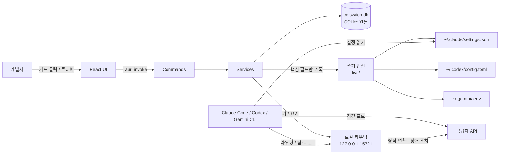
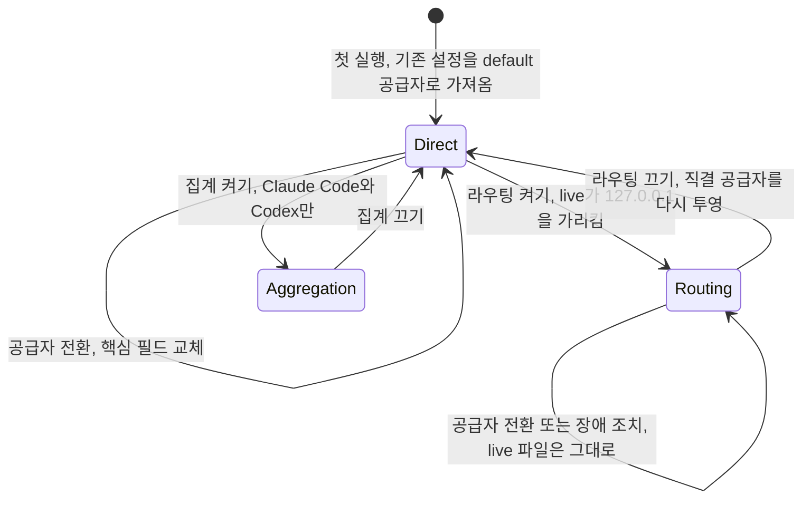
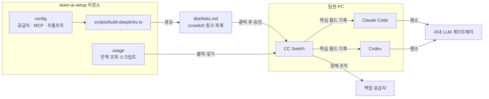
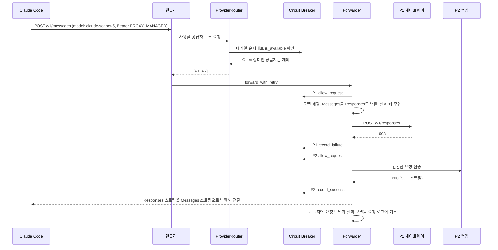
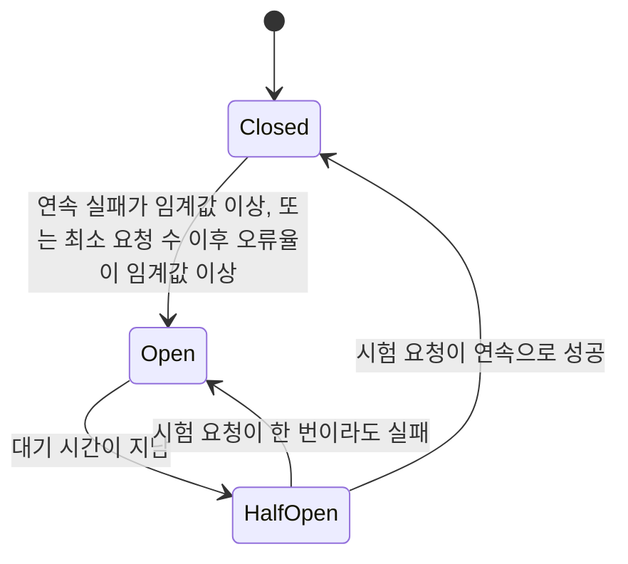

## 개요

> Claude Code, Codex, Gemini CLI 같은 AI 코딩 도구가 어느 API 공급자에 연결될지를 데스크톱 앱 하나에서 고르고 바꾸게 해 주는 오픈소스 설정 관리 도구입니다. 공급자 전환 외에 로컬 라우팅(API 형식 변환·장애 조치), MCP·Skills·프롬프트 동기화, 사용량 집계까지 한곳에서 다룹니다.

## 30초 요약

| 항목 | 내용 |
|---|---|
| 무엇인가? | AI 코딩 도구 10종의 공급자 설정, MCP, Skills, 프롬프트, 세션, 사용량을 관리하는 크로스플랫폼 데스크톱 앱(Tauri 2 + Rust + React) |
| 왜 사용하는가? | 공급자를 바꿀 때마다 `~/.claude/settings.json`, `~/.codex/config.toml`, `~/.gemini/.env`를 손으로 고치지 않기 위해 |
| 해결하는 문제 | 도구마다 다른 설정 형식, 수동 편집 중 Hook·플러그인·MCP 설정 손실, 프로토콜이 다른 모델을 쓸 수 없는 문제, 흩어진 사용량 |
| 주요 사용처 | 공식 구독과 서드파티 릴레이 전환, Claude Code에서 GPT 쓰기, Codex에서 Claude 쓰기, MCP·Skills 일괄 배포, 토큰·비용 확인 |
| 핵심 개념 | 공급자(Provider), Switch / Coexist 모드, 핵심 필드 교체, 직결 / 라우팅 / 집계 모드, 프로젝트, SSOT(SQLite) |
| Client 사용 | O (개발자 PC의 데스크톱 앱. Windows, macOS, Linux) |
| Server 사용 | X (GUI 전용. 서버·SSH 환경은 커뮤니티 CLI를 따로 사용) |
| 대표 대안 | 환경 변수 직접 관리, claude-code-router, opencodex, LiteLLM Proxy, CC Switch CLI |

- **한 번의 클릭으로 공급자를 바꾼다**: 프리셋을 고르고 키만 넣으면 각 도구의 설정 파일에 맞는 형식으로 기록합니다.
- **내 설정은 건드리지 않는다**: 4.0부터 전환할 때 주소·키·모델·프로토콜 같은 핵심 필드만 바꾸고, Hook·플러그인·권한·MCP·주석은 그대로 둡니다.
- **프로토콜이 달라도 연결한다**: 로컬 라우팅이 Anthropic Messages, OpenAI Chat Completions, OpenAI Responses, Gemini 형식을 서로 변환하고, 실패하면 다음 공급자로 넘깁니다.
- **도구 주변 설정을 한곳에 모은다**: MCP 서버, Skills, `CLAUDE.md`·`AGENTS.md`·`GEMINI.md` 프롬프트를 한 번 등록하고 도구별로 동기화합니다.
- **앱을 지워도 도구는 동작한다**: "최소 개입" 원칙에 따라 각 도구의 설정 파일은 항상 그 자체로 유효한 상태로 남습니다.

---

## 어떤 도구인가?

AI 코딩 도구를 여러 개 쓰다 보면 이런 일이 반복됩니다.

- 회사에서는 사내 게이트웨이 키로, 집에서는 개인 Claude 구독으로 Claude Code를 써야 합니다.
- 공식 API가 느리거나 한도에 걸리면 Kimi, GLM, DeepSeek 같은 다른 공급자로 잠깐 옮겨 가고 싶습니다.
- ChatGPT 구독이 있으니 Claude Code 화면에서 GPT 모델을 써 보고 싶습니다.
- 같은 MCP 서버를 Claude Code, Codex, Gemini CLI에 각각 다른 형식(JSON, TOML)으로 등록해야 합니다.

CC Switch는 이 작업을 **설정 파일을 직접 고치는 대신 앱에서 카드 하나를 고르는 일**로 바꿉니다. 비유하면 노트북의 "Wi-Fi 메뉴"와 같습니다. 접속 가능한 네트워크(공급자)를 저장해 두고, 필요할 때 하나를 고르면 운영체제 설정(도구 설정 파일)이 알맞게 바뀝니다.

기술적으로 정의하면, CC Switch는 **AI 코딩 도구의 "live 설정 파일"을 관리하는 데스크톱 앱이자, 선택적으로 켜는 로컬 HTTP 프록시**입니다. 모든 공급자와 MCP·Skills·프롬프트 정보는 `~/.cc-switch/cc-switch.db`(SQLite)에 원본으로 저장하고, 사용자가 전환하면 그중 필요한 값만 각 도구의 설정 파일에 써 넣습니다. 로컬 라우팅을 켜면 도구는 `http://127.0.0.1:15721`로 요청을 보내고, CC Switch가 실제 공급자로 전달하면서 형식을 변환합니다.

관리 대상 도구는 Claude Code, Claude Desktop, Codex, Gemini CLI, Grok Build, OpenCode, OpenClaw, Hermes, Pi, MiniMax Code 10종입니다(2026년 10월 기준). 공식 사이트는 `ccswitch.io` 하나뿐이라고 저장소가 명시하고 있으므로, 비슷한 이름의 다른 사이트에서 설치 파일을 받지 않도록 주의해야 합니다.

### 주요 사용 사례

- **공급자 전환**: 공식 Claude 구독, AWS Bedrock, 서드파티 릴레이, Coding Plan(Kimi·GLM 등) 사이를 앱이나 트레이 메뉴에서 바꿉니다.
- **프로젝트 단위 구성 전환**: "회사 프로젝트"와 "개인 프로젝트"마다 공급자·MCP·Skills·프롬프트 묶음을 저장해 두고 한 번에 바꿉니다.
- **다른 회사 모델 사용**: 로컬 라우팅으로 Claude Code에서 GPT를, Codex에서 Claude를 씁니다. 4.0의 집계 모드는 여러 공급자의 모델을 한 모델 목록에 함께 보여 줍니다.
- **장애 조치**: 공급자 대기열을 만들어 두면 요청이 실패할 때 다음 공급자로 자동으로 넘어갑니다.
- **MCP·Skills·프롬프트 관리**: 한 번 등록하고 어느 도구에 동기화할지 체크합니다.
- **사용량·할당량 확인**: 각 도구의 로컬 세션 로그를 읽어 토큰, 캐시 적중률, 추정 비용을 집계하고, 구독 할당량과 잔액을 카드와 트레이에 표시합니다.

주요 용어는 [핵심 개념과 동작 구조](#h-cc-switch-핵심-개념과-동작-구조)에서 자세히 다룹니다.

---

## 어떤 문제를 해결하는가?

```text
요구사항: 상황에 따라 AI 코딩 도구의 공급자(주소·키·모델)를 바꾸고 싶다
 ↓
일반적인 구현: 셸 프로필의 환경 변수나 도구별 설정 파일을 손으로 고친다
 ↓
문제 발생: 도구마다 형식이 다르고, 편집 중 다른 설정을 지우며, 프로토콜이 다른 모델은 연결할 수 없다
 ↓
CC Switch로 해결: 공급자를 DB에 저장하고, 전환 시 핵심 필드만 안전하게 바꾸며, 필요하면 로컬 라우팅으로 형식을 변환한다
```

### 상황 예시

한 개발자가 Claude Code와 Codex를 함께 씁니다.

- 평소에는 개인 Claude Pro 구독으로 Claude Code를 씁니다.
- 회사 저장소에서 작업할 때는 사내 LLM 게이트웨이 주소와 키를 써야 합니다.
- 구독 한도에 걸리면 저렴한 Coding Plan 공급자로 옮겨서 작업을 이어 갑니다.
- `~/.claude/settings.json`에는 직접 만든 Hook, 권한 설정, 플러그인이 들어 있습니다.

### 일반적인 구현 방식

가장 흔한 방법은 셸 함수로 환경 변수를 바꾸는 것입니다.

```bash
# ~/.zshrc : 공급자마다 함수를 하나씩 만든 경우
use-company() {
  export ANTHROPIC_BASE_URL="https://llm-gateway.internal.example.com"
  export ANTHROPIC_AUTH_TOKEN="$COMPANY_GATEWAY_TOKEN"
  export ANTHROPIC_MODEL="claude-sonnet-5"
}

use-kimi() {
  export ANTHROPIC_BASE_URL="https://api.moonshot.example/anthropic"
  export ANTHROPIC_AUTH_TOKEN="$KIMI_KEY"
  export ANTHROPIC_MODEL="kimi-k3"
}

use-official() {
  unset ANTHROPIC_BASE_URL ANTHROPIC_AUTH_TOKEN ANTHROPIC_MODEL
}
```

Codex는 `~/.codex/config.toml`의 `[model_providers.*]` 테이블과 `auth.json`을, Gemini CLI는 `~/.gemini/.env`와 `settings.json`을 따로 고쳐야 합니다.

### 이 방식에서 발생하는 문제

- **도구마다 방법이 다름**: Claude Code는 JSON의 `env`, Codex는 TOML 테이블, Gemini CLI는 `.env`입니다. 공급자 하나를 추가할 때마다 세 군데를 다른 문법으로 고칩니다.
- **열려 있는 터미널마다 상태가 다름**: 환경 변수는 셸 세션 단위입니다. 탭 하나는 회사 게이트웨이, 다른 탭은 공식 구독인 상태가 쉽게 생기고, IDE 확장은 셸 변수를 아예 못 볼 수 있습니다.
- **수동 편집 중 설정 손실**: `settings.json`을 통째로 다른 파일로 바꿔치기하면 그 안의 Hook, 권한, 플러그인 설정이 함께 사라집니다.
- **프로토콜 장벽**: Claude Code는 Anthropic Messages 형식만 보냅니다. OpenAI Responses만 지원하는 게이트웨이를 주소만 바꿔 넣으면 404나 405가 납니다.
- **비용과 한도를 한눈에 못 봄**: 어느 공급자로 토큰을 얼마나 썼는지 도구마다 따로 확인해야 합니다.

### CC Switch를 사용하면

- 공급자 세 개를 카드로 등록해 두고 클릭하거나 트레이 메뉴에서 고릅니다. 설치와 첫 전환은 [설치와 첫 사용](#h-cc-switch-설치와-첫-사용)에서 다룹니다.
- 전환할 때 `ANTHROPIC_BASE_URL`, 인증 값, 모델명 같은 핵심 필드만 바뀌고, Hook·권한·플러그인은 그대로 남습니다.
- 설정 파일 자체가 바뀌므로 새로 여는 터미널, IDE 확장 모두 같은 공급자를 봅니다. Claude Code는 재시작 없이 다음 요청부터 반영됩니다.
- OpenAI 형식 게이트웨이는 로컬 라우팅을 켜서 연결합니다. Claude Code는 계속 Anthropic 형식으로 보내고, CC Switch가 중간에서 변환합니다.
- 사용량 대시보드에서 공급자·모델별 토큰과 추정 비용을 봅니다.

> **핵심:** 도구별로 다른 설정 파일을 개발자가 직접 고치는 대신, CC Switch가 **공급자 정보를 한곳(SQLite)에 보관하고, 전환할 때 각 도구 파일의 핵심 필드만 안전하게 바꿔 쓰며, 형식이 다른 공급자는 로컬 라우팅으로 이어 붙여서** 처리해 줍니다.

---

## 왜 주목받고 있는가?

CC Switch는 2025년 8월 공개 이후 GitHub Star 약 14만 개, Fork 약 9,400개를 기록하고 있습니다(2026년 10월 기준). 개발이 매우 활발해서 1~2주 간격으로 릴리스가 나오고, 2026년 10월 4일에는 설정 쓰기 방식을 다시 만든 4.0.0이 사전 릴리스(pre-release)로 공개되었습니다.

**AI 코딩 도구가 늘고, 공급자는 더 빨리 늘었습니다.** 한 사람이 Claude Code, Codex, Gemini CLI를 동시에 쓰고, 각 도구에 붙일 수 있는 공급자(공식 구독, 클라우드, Coding Plan, 릴레이, 로컬 모델)도 많아졌습니다. 조합이 늘수록 "설정 파일을 손으로 고치는 비용"이 커졌고, 그 비용을 앱 하나로 줄여 준다는 점이 가장 큰 이유입니다.

**구독과 할당량 중심으로 쓰는 방식이 퍼졌습니다.** 5시간·주간 한도가 있는 구독을 여러 개 오가며 쓰는 사용자가 많아지면서, 남은 할당량을 카드와 트레이에서 바로 보여 주고 클릭 한 번으로 옮겨 가는 기능의 가치가 커졌습니다.

**모델과 도구를 분리해서 고르고 싶어졌습니다.** "도구는 Claude Code가 편하지만 이 작업엔 GPT가 낫다"처럼 도구와 모델을 따로 고르려는 수요가 늘었습니다. CC Switch의 로컬 라우팅과 4.0의 집계 모드가 이 수요에 맞춰져 있습니다.

**사용자 설정을 존중하는 방향으로 다시 설계했습니다.** 초기 버전은 공급자 스냅샷으로 설정 파일 전체를 다시 썼기 때문에, 사용자가 넣은 Hook이나 MCP 설정이 전환 중 사라지는 문제가 반복되었습니다. 4.0은 핵심 필드만 바꾸는 쓰기 엔진과 충돌 감지·충돌 복구를 넣어 이 문제를 구조적으로 해결하려 했습니다.

환경 변수를 직접 관리할 때와의 항목별 차이는 [장단점과 대안 비교](#h-cc-switch-장단점과-대안-비교)에 정리했습니다.

---

## 언제 사용하면 좋은가?

- **공급자를 하루에도 여러 번 바꾸는 경우**: 구독 한도, 회사·개인 계정, 모델 비교 때문에 전환이 잦다면 클릭 한 번 전환과 트레이 메뉴의 이득이 큽니다.
- **AI 코딩 도구를 두 개 이상 쓰는 경우**: MCP 서버와 Skills를 한 번 등록해 여러 도구에 동기화할 수 있어서, 도구별 형식 차이를 신경 쓰지 않아도 됩니다.
- **도구와 다른 프로토콜의 모델을 쓰고 싶은 경우**: Claude Code에서 GPT나 로컬 Chat Completions 서버를, Codex에서 Claude를 쓰려면 형식 변환이 필요한데, 이것을 직접 프록시로 만들 필요가 없습니다.
- **공급자가 불안정한 릴레이를 쓰는 경우**: 장애 조치 대기열과 circuit breaker가 긴 작업이 중간에 끊기는 일을 줄입니다.
- **토큰과 비용을 공급자별로 비교하고 싶은 경우**: 로컬 라우팅 없이도 세션 로그를 읽어 사용량을 집계합니다.

---

## 언제 사용하지 않는 것이 좋은가?

- **공급자를 하나만 쓰는 경우**: 공식 구독 하나로 Claude Code만 쓴다면 바꿀 대상이 없습니다. 앱을 상주시키는 것 자체가 불필요한 부담입니다.
  > 예: 회사가 Claude Team 구독을 주고, 개인적으로도 다른 공급자를 쓰지 않는다면 `/login` 한 번으로 끝입니다.
- **서버, CI, 원격 개발 컨테이너**: CC Switch는 GUI 데스크톱 앱입니다. CI에서는 환경 변수나 시크릿으로 공급자를 지정하는 편이 단순하고 재현 가능하며, SSH 서버에는 커뮤니티 CLI를 쓰는 편이 맞습니다.
- **조직이 설정 파일을 중앙에서 관리하는 경우**: MDM이나 사내 도구가 `~/.claude/settings.json`을 배포한다면, CC Switch가 같은 파일을 쓰면서 관리 주체가 둘이 됩니다.
- **팀 전체가 쓸 공용 게이트웨이가 필요한 경우**: CC Switch의 로컬 라우팅은 개인 PC의 `127.0.0.1`에서만 동작합니다. 팀 공용 키 관리, 사용자별 한도, 감사 로그가 필요하면 LiteLLM 같은 서버형 게이트웨이가 맞습니다.
- **구독을 공식 클라이언트 밖에서 쓰는 것이 걱정되는 경우**: OAuth 인증 센터로 ChatGPT·Copilot 구독을 다른 도구에서 쓰는 기능은 공급사 약관에 어긋날 수 있다고 프로젝트가 직접 안내합니다. 회사 계정이라면 특히 확인이 필요합니다.
- **설정 변경에 민감한 환경**: 릴리스가 잦고 4.0처럼 쓰기 방식 자체가 바뀌는 변경도 있습니다. 매번 업데이트를 검토할 여유가 없다면 환경 변수 몇 개로 버티는 편이 예측 가능합니다.

---

## 한눈에 정리

| 항목 | 내용 |
|---|---|
| 라이브러리 | CC Switch (`farion1231/cc-switch`, MIT) |
| 주요 목적 | AI 코딩 도구 10종의 공급자·MCP·Skills·프롬프트를 데스크톱 앱 하나에서 관리 |
| 해결하는 문제 | 도구별 설정 형식 차이, 수동 편집 중 설정 손실, 프로토콜이 다른 모델 연결, 흩어진 사용량 |
| 핵심 개념 | 공급자, Switch / Coexist, 핵심 필드 교체, 직결 / 라우팅 / 집계, 장애 조치, 프로젝트, SSOT |
| 주요 사용처 | 구독·릴레이 전환, Claude Code에서 GPT, Codex에서 Claude, MCP·Skills 동기화, 사용량 확인 |
| Client 활용 | 개발자 PC에서 도구별 설정 전환, 로컬 라우팅, 트레이 전환, 세션 열람 |
| Server 활용 | 직접 실행하지 않음. Deep Link·클라우드 동기화로 팀 구성 배포, 서버는 커뮤니티 CLI |
| 장점 | 한 번의 클릭 전환, 사용자 설정 보존, 형식 변환과 장애 조치, 통합 관리, 앱 없이도 유효한 설정 |
| 단점 | GUI 전용, 잦은 변경, 로컬 라우팅의 네트워크 제약, 약관 위험, 비용은 추정치 |
| 추천 상황 | 공급자·도구를 여러 개 오가며 매일 쓰는 개인 개발자 |
| 비추천 상황 | 공급자 하나, 서버·CI, 중앙 관리 설정, 팀 공용 게이트웨이가 필요한 경우 |
| 대표 대안 | 환경 변수 직접 관리, claude-code-router, opencodex, LiteLLM Proxy, CC Switch CLI |

---

## 핵심 정리

### 한 문장으로

> CC Switch는 AI 코딩 도구마다 다른 설정 파일을 손으로 고치는 문제를 **공급자 정보를 한곳에 저장하고, 전환할 때 핵심 필드만 바꿔 쓰며, 필요하면 로컬 라우팅으로 형식을 변환하는 방식**으로 해결하기 위한 데스크톱 설정 관리 도구입니다.

### 이것만 기억하기

1. **왜 사용하는가?**
   - 공급자를 바꿀 때마다 JSON, TOML, `.env`를 도구별로 고치지 않고, 클릭 한 번으로 바꾸기 위해서입니다.

2. **어떤 문제를 해결하는가?**
   - 도구별 형식 차이, 수동 편집 중 Hook·MCP 같은 설정 손실, 프로토콜이 다른 모델을 연결할 수 없는 문제, 공급자별 사용량을 모아 보기 어려운 문제입니다.

3. **어떻게 동작하는가?**
   - 공급자는 SQLite에 저장하고, 전환하면 각 도구의 설정 파일에 핵심 필드만 씁니다. 라우팅 모드에서는 설정 파일이 `127.0.0.1:15721`을 가리키고, CC Switch가 실제 공급자로 전달하며 형식 변환과 장애 조치를 합니다.

4. **실제 프로젝트에서는 어디에 사용하는가?**
   - 회사 게이트웨이와 개인 구독 전환, 한도에 걸렸을 때 다른 공급자로 이동, Claude Code에서 GPT 비교, 팀원에게 Deep Link로 MCP·Skills 배포에 씁니다.

5. **언제 사용하지 않는가?**
   - 공급자가 하나뿐일 때, 서버·CI 환경, 설정을 중앙에서 관리하는 조직, 팀 공용 게이트웨이가 필요할 때입니다.

6. **비슷한 기술과 가장 큰 차이는 무엇인가?**
   - 라우터 하나만 제공하는 도구와 달리, **설정 파일 전환(직결)과 로컬 라우팅을 둘 다** 다루고, 그 위에 MCP·Skills·프롬프트·세션·사용량 관리를 얹은 "데스크톱 관리 앱"이라는 점입니다. 라우팅이 필요 없으면 켜지 않고 설정 전환만 써도 됩니다.

## CC Switch 핵심 개념과 동작 구조

> 공급자, Switch·Coexist 모드, 핵심 필드 교체, 데이터 저장 위치, 직결·라우팅·집계 모드, 프로젝트, MCP·Skills·프롬프트 동기화가 무엇이고 어떻게 맞물려 동작하는지 다룹니다.

### 용어 한눈에 보기

| 키워드 | 설명 |
|---|---|
| 공급자(Provider) | 도구가 요청을 보낼 대상. 주소, 인증 값, 모델, API 형식의 묶음 |
| 프리셋(Preset) | 공급자별로 미리 채워 둔 설정 템플릿. 키만 넣으면 공급자가 됨 |
| Live 설정 | 각 도구가 실제로 읽는 설정 파일. `~/.claude/settings.json`, `~/.codex/config.toml` 등 |
| Switch 모드 | 한 번에 한 공급자만 live 설정에 기록하는 방식. Claude Code, Codex 등 5개 도구 |
| Coexist 모드 | 여러 공급자를 도구 설정에 함께 기록하고 도구 안에서 고르는 방식. OpenCode 등 5개 도구 |
| 핵심 필드(Key field) | 전환할 때 CC Switch가 바꾸는 값. 주소, 인증 값, 모델, 프로토콜 |
| 로컬 라우팅 | `127.0.0.1:15721`에서 요청을 받아 실제 공급자로 넘기는 내장 프록시 |
| 집계(Aggregation) | 여러 공급자의 모델을 한 모델 목록에 함께 올리는 4.0의 모드 |
| 프로젝트(Project) | 공급자·MCP·Skills·프롬프트를 묶어 저장한 구성 스냅샷 |
| SSOT | 단일 원본. CC Switch는 `~/.cc-switch/cc-switch.db`를 원본으로 삼음 |

---

### 1. 공급자와 프리셋

#### 쉽게 설명하면

공급자는 "전화번호부에 저장한 연락처"와 같습니다. 이름, 번호(주소), 비밀번호(키), 기본 설정(모델)을 한 번 저장해 두면, 다음부터는 이름만 눌러서 연결합니다. 프리셋은 대표 번호가 미리 입력된 연락처 양식입니다.

#### 개발 관점에서는

공급자는 도구 하나에 속한 **설정 레코드**입니다. Claude Code용 공급자와 Codex용 공급자는 서로 다른 레코드이고, 같은 회사라도 도구마다 따로 만듭니다(Claude Code·Codex·Gemini CLI에 함께 쓰는 "Universal provider"도 있습니다).

공급자 하나에는 다음 정보가 들어갑니다.

- **연결 정보**: 주소(endpoint), 인증 값(API Key 또는 토큰), 인증 필드 이름(`ANTHROPIC_AUTH_TOKEN` 또는 `ANTHROPIC_API_KEY`)
- **모델 정보**: 기본 모델, Claude Code의 Haiku·Sonnet·Opus 역할별 모델
- **API 형식(Upstream Format)**: Anthropic Messages, OpenAI Chat Completions, OpenAI Responses, Gemini Native 중 하나. 도구가 원래 쓰는 형식과 다르면 로컬 라우팅이 필요합니다
- **부가 정보**: 사용량 조회 스크립트, 메모, 아이콘, 장애 조치 대기열 순서

프리셋은 AWS Bedrock, NVIDIA NIM, 각종 Coding Plan과 릴레이를 포함해 도구별로 제공됩니다. README는 "90개 이상의 공급자 프리셋"이라고 소개하고, 4.0 릴리스 노트는 도구별 프리셋을 모두 합쳐 756개라고 밝힙니다(2026년 10월 기준).

#### 예제

앱 화면에서는 "+ 버튼 → 프리셋 선택 → 키 입력"이 전부입니다. 같은 일을 링크로도 할 수 있는데, CC Switch의 Deep Link 형식을 보면 공급자가 어떤 값으로 이루어지는지 잘 드러납니다.

```text
ccswitch://v1/import?resource=provider&app=claude&name=Team%20Gateway
  &endpoint=https%3A%2F%2Fllm-gateway.example.com
  &model=claude-sonnet-5
  &haikuModel=claude-haiku-4-5
```

(실제 링크는 한 줄입니다. 읽기 쉽게 줄을 나눴습니다.)

`apiKey`를 넣지 않았으므로, 링크를 연 사람이 가져오기 화면에서 자기 키를 입력하게 됩니다.

#### 핵심

> 공급자는 "도구 하나 + 연결 정보 + 모델 + API 형식"입니다. API 형식이 도구와 다르면 그 공급자는 로컬 라우팅을 켜야만 동작합니다.

### 2. Switch 모드와 Coexist 모드

#### 쉽게 설명하면

TV 리모컨과 셋톱박스의 차이입니다. TV(Switch 모드 도구)는 한 번에 한 채널만 틀 수 있어서 리모컨으로 채널을 바꿉니다. 셋톱박스(Coexist 모드 도구)는 여러 채널을 목록에 다 넣어 두고 사용자가 그 안에서 고릅니다.

#### 개발 관점에서는

도구마다 설정 파일이 공급자를 몇 개까지 담을 수 있는지가 다르기 때문에, CC Switch는 두 가지 쓰기 방식을 씁니다.

| 모드 | 도구 | 동작 |
|---|---|---|
| Switch | Claude Code, Claude Desktop, Codex, Gemini CLI, Grok Build | live 설정에는 항상 "현재 공급자" 하나만 있음. 전환하면 핵심 필드를 바꿈 |
| Coexist | OpenCode, OpenClaw, Hermes, Pi, MiniMax Code | 도구 설정에 여러 공급자를 함께 기록. "Add"를 누르면 목록에 추가되고, 모델은 도구 안에서 고름 |

Switch 모드 도구에서 **현재 활성 공급자는 삭제할 수 없습니다.** CC Switch를 지워도 도구가 정상 동작해야 한다는 "최소 개입" 원칙 때문에, live 설정에는 항상 유효한 공급자 하나가 남아 있어야 하기 때문입니다.

#### 핵심

> Switch는 "하나를 골라 바꿔 끼우기", Coexist는 "여러 개를 넣어 두고 도구가 고르기"입니다. 로컬 라우팅, 트레이 전환, 장애 조치는 Switch 모드 도구 중심으로 제공됩니다.

### 3. Live 설정과 핵심 필드 교체

#### 쉽게 설명하면

이사할 때 집 전체를 새로 짓는 것이 아니라 현관문 도어락 비밀번호만 바꾸는 것과 같습니다. 가구 배치(사용자 설정)는 그대로 두고, 바뀌어야 하는 것만 바꿉니다.

#### 개발 관점에서는

**Live 설정**은 도구가 실제로 읽는 파일입니다. CC Switch는 공급자를 전환할 때 이 파일에서 **핵심 필드만** 바꿉니다.

| 도구 | Live 파일 | 바뀌는 값(예) |
|---|---|---|
| Claude Code | `~/.claude/settings.json` | `env.ANTHROPIC_BASE_URL`, 인증 값, `ANTHROPIC_MODEL`과 역할별 모델, Bedrock·Vertex 선택자 |
| Codex | `~/.codex/config.toml`, `auth.json` | 공급자 테이블과 인증, 모델, 추론 강도 |
| Gemini CLI | `~/.gemini/.env`, `settings.json` | 주소·키 변수, 인증 방식, `model.name` |
| Grok Build | `~/.grok/config.toml` | `models.default`, CC Switch가 쓴 `[model."<이름>"]` 테이블 |

Hook, 플러그인, 권한, MCP 서버, 사용자가 직접 넣은 환경 변수, 주석과 순서는 건드리지 않습니다. TOML과 `.env`는 바꾸지 않은 줄을 바이트 단위로 그대로 두고, JSON은 다른 키의 값과 순서를 유지합니다.

이 동작은 **4.0에서 새로 만든 쓰기 엔진**의 결과입니다. 그 전(3.20.x까지)에는 전환할 때 현재 live 파일을 떠나는 공급자에 다시 저장(backfill)하고, 새 공급자의 스냅샷으로 파일을 다시 쓰는 방식이었습니다. 공유하고 싶은 설정은 "공통 설정 조각(Common Config Snippet)"으로 따로 관리해야 했고, 그 과정에서 Hook이나 MCP 설정이 특정 공급자에 갇히거나 사라지는 문제가 있었습니다. 4.0은 공통 설정 조각 기능을 없애고 "공유 설정은 원래 설정 파일에 그대로 둔다"는 방식으로 바꿨습니다.

쓰기 자체도 안전장치를 거칩니다.

1. 파일을 읽고 해시를 기록한 뒤 형식에 맞게 파싱합니다. **파싱에 실패하면 쓰지 않습니다.**
2. 메모리에서 핵심 필드만 바꾸고 옆에 임시 파일을 만듭니다.
3. 그 파일을 처음 쓰는 경우라면 원본을 `~/.cc-switch/backups/live-first-write/`에 한 번 백업합니다.
4. rename 직전에 원본을 다시 읽어 해시를 비교합니다. 그사이 다른 프로그램이 바꿨으면 새 내용을 바탕으로 다시 계산합니다.
5. 여러 파일을 함께 바꾸는 작업은 의도를 `live-state.json`에 먼저 기록해서, 중간에 앱이 죽어도 다음 실행 때 마무리하거나 버립니다.

키가 들어 있는 파일(`settings.json`, Codex `auth.json`·`config.toml` 등)은 소유자만 읽고 쓰는 0600 권한으로 기록합니다.

#### 예제

전환 전후의 `~/.claude/settings.json`입니다. 공식 구독에서 사내 게이트웨이 공급자로 바꾼 경우입니다.

```json
{
  "env": {
    "ANTHROPIC_BASE_URL": "https://llm-gateway.example.com",
    "ANTHROPIC_AUTH_TOKEN": "sk-gw-...",
    "ANTHROPIC_MODEL": "claude-sonnet-5",
    "MY_TEAM_FLAG": "1"
  },
  "permissions": { "deny": ["Bash(git push --force:*)"] },
  "hooks": { "PreToolUse": [{ "matcher": "Bash", "hooks": [{ "type": "command", "command": "node ~/.claude/hooks/guard.js" }] }] },
  "enabledPlugins": { "my-plugin@market": true }
}
```

`env`의 `ANTHROPIC_*` 세 줄만 CC Switch가 쓴 값이고, `MY_TEAM_FLAG`, `permissions`, `hooks`, `enabledPlugins`는 사용자가 넣은 그대로입니다. 다시 공식 공급자로 바꾸면 `ANTHROPIC_*` 값만 제거되거나 바뀌고 나머지는 남습니다.

#### 핵심

> CC Switch가 "소유"하는 것은 설정 파일 전체가 아니라 핵심 필드뿐입니다. 그래서 도구 안에서 `/model`로 바꾼 모델도 핵심 필드이므로, 다른 공급자로 갔다가 돌아오면 공급자에 저장된 값으로 되돌아갑니다.

### 4. 데이터는 어디에 저장되는가

#### 쉽게 설명하면

원본 장부(DB)와 이 컴퓨터 전용 메모장(설정·상태 파일)을 따로 둡니다. 장부는 다른 기기와 동기화해도 되지만, 메모장은 이 컴퓨터에서만 의미가 있습니다.

#### 개발 관점에서는

| 위치 | 내용 |
|---|---|
| `~/.cc-switch/cc-switch.db` | 공급자, MCP, 프롬프트, Skills, 프로젝트, 사용량 기록(SQLite, 원본) |
| `~/.cc-switch/settings.json` | 도구별 설정 디렉터리 재정의, 백업 정책, 동기화 연결 정보 등 이 기기 전용 설정 |
| `~/.cc-switch/live-state.json` | 도구별 직결·라우팅 상태, 진행 중인 쓰기 작업, 집계 목록(4.0) |
| `~/.cc-switch/backups/` | DB 자동 백업(기본 24시간마다, 최근 10개), `live-first-write/` 첫 쓰기 원본 백업 |
| `~/.cc-switch/skills/` | 설치한 Skills. 도구에는 심볼릭 링크로 연결하고, 실패하면 복사 |
| `copilot_auth.json`, `codex_oauth_auth.json`, `xai_oauth_auth.json` | OAuth 인증 센터의 로그인 정보 |
| `logs/cc-switch.log`, `crash.log` | 앱 로그. 이슈를 올릴 때 첨부 |

이 중 `settings.json`, 기기 상태 파일(`live-state.json` 등), 첫 쓰기 원본 백업은 이 컴퓨터에만 속하므로 클라우드 동기화에 포함되지 않습니다.

DB가 원본이고 live 파일은 "결과물"이라는 점이 중요합니다. 다른 기기에서 WebDAV나 S3 호환 저장소로 DB를 동기화하면 공급자 목록은 같아지지만, 각 기기의 live 파일과 라우팅 상태는 그 기기가 따로 관리합니다.

#### 핵심

> 공급자 정보의 원본은 `cc-switch.db`이고, 도구 설정 파일은 거기서 핵심 필드만 투영한 결과입니다. 기기에 묶인 상태(`settings.json`, `live-state.json`)는 동기화되지 않습니다.

### 5. 직결, 라우팅, 집계

#### 쉽게 설명하면

- **직결**: 도구가 공급자에게 직접 전화를 겁니다.
- **라우팅**: 도구는 항상 안내 데스크(로컬 라우팅)로 전화하고, 안내 데스크가 지금 담당자에게 연결합니다. 담당자가 외국어를 쓰면 통역도 합니다.
- **집계**: 안내 데스크가 "A사 상담원, B사 상담원" 목록을 한 번에 보여 주고, 사용자가 고른 사람에게 바로 연결합니다.

#### 개발 관점에서는

4.0은 Switch 모드 도구마다 세 가지 모드를 둡니다.

| 모드 | 요청 경로 | 쓰는 경우 |
|---|---|---|
| 직결(Direct) | 도구 → 공급자 | 도구와 같은 API 형식의 공급자를 쓸 때. 기본값 |
| 라우팅(Routing) | 도구 → `127.0.0.1:15721` → 공급자 하나 | 형식 변환, 장애 조치, 요청 로그가 필요할 때 |
| 집계(Aggregation) | 도구 → `127.0.0.1:15721` → 고른 모델의 공급자 | 한 세션에서 여러 공급자의 모델을 섞어 쓸 때. Claude Code·Codex만 |

라우팅 모드에서는 live 설정이 로컬 주소와 자리표시자 키 `PROXY_MANAGED`만 갖고, 실제 주소와 키는 CC Switch 안에만 있습니다. 집계 모드는 장애 조치를 제공하지 않습니다. 세 모드의 내부 동작은 [로컬 라우팅 깊이 보기](#h-cc-switch-로컬-라우팅-깊이-보기)에서 자세히 다룹니다.

#### 핵심

> 직결은 "설정 파일만 바꾸는 도구", 라우팅·집계는 "요청 경로에 끼어드는 프록시"입니다. 라우팅이 필요 없으면 켜지 않는 것이 가장 단순합니다.

### 6. 프로젝트

#### 쉽게 설명하면

옷장의 "출근복 세트", "운동복 세트"입니다. 상의·하의·신발을 하나하나 고르지 않고 세트 이름 하나로 갈아입습니다.

#### 개발 관점에서는

프로젝트는 Claude Code나 Codex의 **현재 공급자 + MCP + Skills + 프롬프트 파일**을 묶어 저장한 스냅샷입니다(Claude Desktop은 공급자만 저장). 메인 화면 상단의 프로젝트 전환기나 트레이에서 고르면 묶음 전체가 한 번에 바뀌고, 다른 프로젝트로 넘어갈 때 현재 상태가 이전 프로젝트에 자동으로 저장됩니다.

#### 핵심

> 공급자 전환이 "연결 대상 바꾸기"라면, 프로젝트 전환은 "작업 환경 통째로 바꾸기"입니다.

### 7. MCP·Skills·프롬프트 동기화

#### 쉽게 설명하면

여러 SNS에 같은 글을 올릴 때 쓰는 "동시 게시" 도구와 같습니다. 한 번 쓰고, 올릴 곳을 체크합니다.

#### 개발 관점에서는

- **MCP**: 서버를 한 번 등록하고 도구별 체크박스로 동기화합니다. Claude Code에는 JSON, Codex에는 TOML 테이블처럼 도구 형식에 맞게 씁니다. 4.0부터 여러 서버 설정을 한 번에 붙여 넣을 수 있습니다.
- **Skills**: skills.sh 검색, GitHub 저장소나 ZIP으로 설치하고, 심볼릭 링크 또는 복사로 각 도구에 배포합니다.
- **프롬프트**: 도구별 Markdown 라이브러리입니다. 하나를 활성화하면 `CLAUDE.md`, `AGENTS.md`, `GEMINI.md`에 기록하는데, 기존 파일 내용은 먼저 라이브러리에 저장해서 잃어버리지 않게 합니다.

#### 핵심

> MCP와 Skills는 "한 번 등록, 여러 도구에 배포", 프롬프트는 "도구별 라이브러리에서 하나를 골라 파일에 기록"입니다.

---

### 8. 전체 동작 구조

CC Switch는 React 프론트엔드와 Rust 백엔드가 Tauri IPC로 연결된 데스크톱 앱입니다. 백엔드는 명령(Commands) → 서비스(Services) → DAO → SQLite로 계층이 나뉘고, 서비스에서 "live 설정 쓰기"와 "로컬 라우팅" 두 갈래로 갈라집니다.



공급자를 바꾸는 한 번의 작업은 다음 순서로 처리됩니다.

1. **시작점**: 개발자가 Claude Code 페이지에서 "사내 게이트웨이" 카드의 Enable을 누르거나, 트레이 메뉴에서 공급자 이름을 클릭합니다.
2. **CC Switch가 개입하는 시점**: UI가 Tauri 명령을 호출하고, 서비스가 DB에서 공급자 레코드를 읽습니다. 앱별 잠금을 잡고, 이전에 끝나지 않은 쓰기 작업이 있으면 먼저 정리합니다.
3. **내부 처리**: 현재 모드가 직결이면 쓰기 엔진이 공급자의 핵심 필드를 `settings.json`에 투영합니다. 라우팅 모드라면 live 파일은 이미 로컬 주소를 가리키므로 파일을 다시 쓰지 않고 "라우팅 대상"만 바꿉니다.
4. **외부 시스템과의 연결**: Claude Code는 다음 요청부터 바뀐 값을 씁니다. 직결이면 공급자 API로 바로, 라우팅이면 `127.0.0.1:15721`로 보내고 CC Switch가 실제 공급자로 전달합니다. Codex, Gemini CLI, Grok Build는 모델이 바뀌면 재시작이 필요합니다.
5. **결과 반환**: UI 카드와 트레이가 새 공급자를 표시하고, 요청이 오가면 사용량 대시보드(세션 로그 또는 라우팅 로그)에 토큰과 추정 비용이 쌓입니다.

모드 전환을 상태 흐름으로 보면 다음과 같습니다.



## CC Switch 설치와 첫 사용

> 운영체제별 설치 방법과 버전 선택 기준, 첫 실행 때 일어나는 일, 공급자 하나를 추가하고 전환하는 가장 간단한 흐름, 설치할 때 자주 겪는 문제를 다룹니다.

### 설치

#### 지원 환경

| 운영체제 | 요구 사항 |
|---|---|
| Windows | Windows 10 이상 (x64, ARM64) |
| macOS | macOS 12 Monterey 이상. Universal 빌드(Apple Silicon, Intel), Apple 서명·공증 완료 |
| Linux | x86_64 또는 ARM64, glibc 2.35 이상, WebKitGTK 4.1 (Ubuntu 22.04+, Debian 12+, 최신 Fedora 등). RHEL·Rocky·Alma 8~9는 아직 미지원 |

#### 버전 고르기: 3.20.4 안정판과 4.0.0 사전 릴리스

2026년 10월 5일 기준으로 GitHub의 "Latest" 릴리스와 Homebrew Cask는 **3.20.4**(2026-09-22)이고, **4.0.0**은 2026-10-04에 사전 릴리스(pre-release)로 올라와 있습니다. 4.0은 설정 파일 쓰기 방식을 다시 만든 대규모 변경이라 둘의 동작이 꽤 다릅니다.

| 항목 | 3.20.4 | 4.0.0 |
|---|---|---|
| 전환 방식 | 공급자 스냅샷으로 설정 파일을 다시 씀 + 공통 설정 조각 병합 | 핵심 필드만 교체, 나머지는 그대로 |
| 모드 | 직결, 라우팅 | 직결, 라우팅, 집계 |
| 화면 | 상단 툴바 중심 | 사이드바 중심으로 전면 개편 |
| DB 스키마 | v19 | v19 (마이그레이션 없음) |

이 노트는 저장소 main 브랜치의 문서와 4.0 동작을 기준으로 설명하고, 3.20.4와 다른 부분은 그때그때 표시합니다. 4.0을 쓰다가 3.20.4로 되돌릴 때는 정해진 순서가 있으므로 [주의할 점과 FAQ](#h-cc-switch-주의할-점과-faq)를 먼저 확인합니다.

#### macOS

```bash
# 권장: Homebrew Cask (안정판)
brew install --cask cc-switch

# 업데이트
brew upgrade --cask cc-switch
```

Releases 페이지에서 `CC-Switch-v{버전}-macOS.dmg`를 직접 받아도 됩니다. 4.0 사전 릴리스를 써 보려면 이 방법을 씁니다.

#### Windows

Releases 페이지에서 `CC-Switch-v{버전}-Windows.msi`(설치형) 또는 `-Windows-Portable.zip`(무설치)을 받습니다. ARM 기기는 `-Windows-arm64.msi`를 받습니다.

#### Linux

```bash
# Arch Linux: AUR (권장)
paru -S cc-switch-bin
```

그 밖의 배포판은 Releases 페이지의 `.deb`(Debian·Ubuntu), `.rpm`(Fedora 등), `.AppImage`(요구 사항을 만족하는 모든 배포판) 중 하나를 받습니다. Flatpak은 공식 릴리스에 없고, 저장소의 `flatpak/README.md`를 보고 직접 빌드해야 합니다.

#### 소스에서 빌드 (기여하거나 내부 검토가 필요한 경우)

```bash
git clone https://github.com/farion1231/cc-switch.git
cd cc-switch
pnpm install
pnpm dev     # Vite 개발 서버 + Tauri 창, 핫 리로드
```

Node.js(20.19+ 또는 22.12+), pnpm 10, 저장소의 `rust-toolchain.toml`이 지정한 Rust가 필요합니다. 백엔드 테스트 일부는 `~/.cc-switch`, `~/.codex`를 실제로 읽고 쓰므로, 로컬에서 돌릴 때는 `CC_SWITCH_TEST_HOME`을 임시 디렉터리로 지정해야 내 설정을 건드리지 않습니다.

---

### 기본 설정

#### 첫 실행 때 일어나는 일

처음 실행하면 CC Switch는 이미 있는 Claude Code, Codex, Gemini CLI, Grok Build 설정을 읽어 `default`라는 공급자로 가져오고, 각 도구와 Claude Desktop에 공식 공급자(Claude Official, OpenAI Official 등)를 하나씩 추가합니다. 그래서 설치 직후에도 기존 설정은 그대로 동작합니다.

4.0에서는 CC Switch가 어떤 설정 파일을 처음 쓸 때 원본을 `~/.cc-switch/backups/live-first-write/`에 한 번 복사해 둡니다. 혹시 모를 상황을 대비해, 설치 전에 직접 백업해 두는 것도 좋습니다.

```bash
# 설치 전 수동 백업 (있는 파일만 복사됨)
mkdir -p ~/ai-config-backup
cp -p ~/.claude/settings.json ~/.codex/config.toml ~/.codex/auth.json \
      ~/.gemini/.env ~/.gemini/settings.json ~/ai-config-backup/ 2>/dev/null
ls ~/ai-config-backup
```

#### 자주 손대는 설정

- **사용하지 않는 도구 숨기기**: 설정에서 도구를 숨기면 사이드바와 트레이가 단순해집니다.
- **설정 디렉터리 재정의**: 도구 설정이 기본 위치에 없거나 WSL 안에 있다면, 설정의 디렉터리 재정의에서 도구별 경로를 지정합니다. 예: `\\wsl.localhost\Ubuntu\home\<user>\.claude`
- **자동 백업**: DB는 기본 24시간마다 백업되고 최근 10개를 보관합니다.
- **로컬 라우팅**: 기본은 꺼져 있습니다. 필요할 때만 켭니다. 켜는 방법은 [활용 예시 ②](#h-cc-switch-활용-예시-②-다른-회사-모델을-도구-안에서-쓰기)에서 다룹니다.

4.0에서 설정 화면은 일반, 앱 설정, 로컬 라우팅, 네트워크, 데이터, 정보로 다시 묶였습니다. 3.20.4의 메뉴 이름과 다를 수 있으니, 메뉴 경로보다 기능 이름으로 찾는 것이 빠릅니다.

---

### 가장 간단한 예제

Claude Code에 Anthropic 형식을 지원하는 서드파티 공급자를 하나 추가하고 전환해 보겠습니다.

1. Claude Code 페이지에서 공급자 추가(+)를 누르고, 프리셋 목록에서 공급자를 검색합니다. 없으면 사용자 설정(Custom)을 고릅니다.
2. API Key를 입력합니다. 사용자 설정이라면 주소(endpoint)와 모델도 입력합니다. API 형식은 기본값 `Anthropic Messages`를 그대로 둡니다.
3. 저장한 뒤 카드의 Enable을 누릅니다.
4. 터미널에서 Claude Code를 쓰던 중이라도 재시작할 필요가 없습니다. 다음 요청부터 새 공급자로 갑니다.

전환이 실제로 반영되었는지는 설정 파일을 직접 보면 확실합니다.

```bash
# 핵심 필드만 확인 (키는 앞 6자리만 표시)
node -e '
const os = require("os"), fs = require("fs");
const s = JSON.parse(fs.readFileSync(os.homedir() + "/.claude/settings.json", "utf8"));
const env = s.env ?? {};
const token = env.ANTHROPIC_AUTH_TOKEN ?? env.ANTHROPIC_API_KEY ?? "";
console.log("base_url:", env.ANTHROPIC_BASE_URL ?? "(공식 기본값)");
console.log("model   :", env.ANTHROPIC_MODEL ?? "(지정 안 함)");
console.log("token   :", token ? token.slice(0, 6) + "..." : "(없음, 공식 로그인 사용)");
console.log("hooks   :", s.hooks ? Object.keys(s.hooks).join(", ") : "(없음)");
'
```

1. **무엇을 생성하는가**: 공급자 레코드가 `cc-switch.db`에 하나 생기고, Enable을 누르면 `~/.claude/settings.json`의 `env`에 주소·인증 값·모델이 기록됩니다.
2. **어떤 값을 전달하는가**: 프리셋이 채운 주소와 모델, 사용자가 입력한 키입니다. 키는 live 파일에도 들어가므로(직결 모드), 파일 권한이 0600인지 함께 보면 좋습니다.
3. **CC Switch가 무엇을 처리하는가**: 기존 `hooks`, `permissions`, 플러그인 설정을 그대로 둔 채 핵심 필드만 바꿉니다. 위 스크립트의 `hooks` 줄이 전환 전후로 같다면 정상입니다.
4. **어떤 결과를 반환하는가**: Claude Code의 다음 요청이 새 주소로 나갑니다. 공식 공급자로 돌아가려면 Claude Official 카드를 Enable하고, 필요하면 Claude Code에서 `/login`을 합니다.

Codex, Gemini CLI, Grok Build는 프로세스가 시작할 때 설정을 읽으므로, 모델이 바뀌는 전환 뒤에는 터미널이나 CLI를 다시 시작해야 합니다. Claude Desktop은 앱을 완전히 종료했다가 다시 엽니다.

---

### 설치할 때 주의할 점

- **공식 경로에서만 받습니다.** 공식 사이트는 `ccswitch.io` 하나이고, 설치 파일은 GitHub Releases, Homebrew Cask, AUR `cc-switch-bin`에서 받습니다. 이름이 비슷한 사이트나 재배포본은 키를 다루는 앱인 만큼 특히 피해야 합니다.
- **연결 확인(Connectivity check) 통과가 정상 동작을 뜻하지 않습니다.** 주소에 닿는지만 보고 실제 모델 요청은 보내지 않으므로, 키나 모델명이 틀려도 통과합니다.
- **형식이 다른 공급자는 라우팅 없이 동작하지 않습니다.** OpenAI·Gemini 형식 공급자를 Claude Code에서 직결로 쓰면 보통 404나 405가 납니다. 카드에 "라우팅 필요" 표시가 붙은 공급자는 로컬 라우팅을 먼저 켭니다.
- **WSL은 자동으로 감지하지 않습니다.** 디렉터리 재정의로 경로를 지정해야 하고, 로컬 라우팅을 쓰려면 WSL2를 mirrored 네트워킹 모드로 바꿔야 합니다. 기본 NAT 모드에서는 WSL 안의 `127.0.0.1`이 Windows의 CC Switch에 닿지 않습니다.
- **Linux Wayland + NVIDIA**에서 AppImage 창이 클릭되지 않거나 크기 조절 때 검게 변하면 `CC_SWITCH_GDK_BACKEND=wayland`로 실행합니다.
- **셸 프로필의 공급자 환경 변수를 정리합니다.** `~/.zshrc` 등에 남은 `ANTHROPIC_*`, `OPENAI_*`, `GEMINI_*` 변수는 CC Switch가 쓴 설정을 덮어쓸 수 있어서, 전환했는데 반영되지 않는 것처럼 보입니다. CC Switch는 이런 충돌을 감지하면 화면 상단에 경고 배너를 띄우고, 백업(`~/.cc-switch/backups/env-backup-<시각>.json`)을 만든 뒤 선택한 변수를 지우는 기능을 제공합니다.

## CC Switch 활용 예시 ① 공급자 전환과 프로젝트 구성

> 구독 한도에 걸렸을 때 다른 공급자로 옮겨 작업을 이어 가는 과정과, 회사·개인 작업 환경을 프로젝트로 묶어 한 번에 바꾸는 과정을 다룹니다.

### 예제 1. 구독 한도에 걸렸을 때 Coding Plan으로 옮겨 가기

#### 요구사항

> 평소에는 Claude 공식 구독으로 Claude Code를 쓴다. 5시간 한도에 가까워지면 Anthropic 형식을 지원하는 Coding Plan 공급자로 바꿔 작업을 이어 가고, 한도가 초기화되면 다시 공식 구독으로 돌아온다. 이때 `~/.claude/settings.json`에 넣어 둔 Hook과 권한 설정은 절대 사라지면 안 된다.

#### 구현

**1. 공급자 두 개 준비**

- **Claude Official**: 첫 실행 때 자동으로 추가된 공식 공급자입니다. 카드의 사용량 조회에서 "공식 구독(Official Subscription)" 템플릿을 켜면 5시간·주간 남은 비율이 카드에 표시됩니다(기본은 꺼져 있음).
- **Coding Plan 공급자**: 공급자 추가 → 프리셋 검색(예: Kimi, GLM, MiniMax 등 Anthropic 호환 엔드포인트를 제공하는 Coding Plan) → 키 입력. 같은 방식으로 사용량 조회를 켜면 Coding Plan의 5시간·주간·월간 한도가 카드에 나옵니다.

**2. 전환 전후로 내 설정이 보존되는지 확인하는 스크립트**

CC Switch를 처음 도입할 때는 "정말 내 Hook이 남아 있는가"를 한 번 눈으로 확인해 두는 것이 좋습니다. 아래 스크립트는 전환 전 스냅샷을 찍고, 사용자가 앱에서 전환한 뒤 Enter를 누르면 무엇이 바뀌었는지 보여 줍니다.

```ts
// scripts/check-switch.ts
// 실행: npx tsx scripts/check-switch.ts
import { readFileSync } from 'node:fs';
import { homedir } from 'node:os';
import { join } from 'node:path';
import { createInterface } from 'node:readline/promises';

type Json = Record<string, unknown>;
const SETTINGS = join(homedir(), '.claude', 'settings.json');

const read = (): Json => JSON.parse(readFileSync(SETTINGS, 'utf8'));

// 공급자가 소유하는 값: env 안의 ANTHROPIC_* 와 최상위 model
const isKeyField = (path: string) => /^env\.ANTHROPIC_/.test(path) || path === 'model';

// 중첩 객체를 "a.b.c" 경로로 펼친다 (배열은 통째로 비교)
function flatten(obj: Json, prefix = ''): Map<string, string> {
  const out = new Map<string, string>();
  for (const [k, v] of Object.entries(obj)) {
    const path = prefix ? `${prefix}.${k}` : k;
    if (v && typeof v === 'object' && !Array.isArray(v)) {
      for (const [p, val] of flatten(v as Json, path)) out.set(p, val);
    } else {
      out.set(path, JSON.stringify(v));
    }
  }
  return out;
}

const mask = (v?: string) => (v && v.length > 12 ? `${v.slice(0, 7)}...` : v ?? '(없음)');

const before = flatten(read());
const rl = createInterface({ input: process.stdin, output: process.stdout });
await rl.question('CC Switch에서 공급자를 전환한 뒤 Enter를 누르세요...');
rl.close();
const after = flatten(read());

const paths = new Set([...before.keys(), ...after.keys()]);
const changed = [...paths].filter((p) => before.get(p) !== after.get(p));

const keyChanges = changed.filter(isKeyField);
const otherChanges = changed.filter((p) => !isKeyField(p));

console.log('\n[핵심 필드 변경]');
for (const p of keyChanges) console.log(`  ${p}: ${mask(before.get(p))} -> ${mask(after.get(p))}`);

console.log('\n[그 밖의 변경]');
if (otherChanges.length === 0) console.log('  없음 (Hook, 권한, 플러그인이 그대로 보존됨)');
for (const p of otherChanges) console.log(`  ${p}`);
```

**3. 한도가 다가오면 트레이에서 전환**

메뉴 막대(Windows는 작업 표시줄)의 트레이 아이콘을 열면 도구별로 "이름 · 모드 · 공급자 · 남은 할당량"이 한 줄씩 보입니다(4.0). Claude Code 하위 메뉴에서 Coding Plan 공급자를 클릭하면 전환됩니다. Claude Code는 재시작 없이 다음 요청부터 새 공급자로 갑니다.

#### 실행 흐름

```text
개발자: Claude Code로 작업 중, 트레이에서 "5시간 남은 8%" 확인
 ↓
트레이: Claude Code 하위 메뉴에서 Coding Plan 공급자 클릭
 ↓
CC Switch: 앱별 잠금 → DB에서 공급자 읽기 → 쓰기 엔진이 settings.json 핵심 필드만 교체
 ↓      (파싱 실패 시 중단, 외부 변경 감지 시 다시 계산, 0600 권한으로 기록)
Claude Code: 다음 요청부터 ANTHROPIC_BASE_URL의 새 주소로 전송
 ↓
사용량 대시보드: 세션 로그에서 공급자·모델별 토큰과 추정 비용 집계
 ↓
한도 초기화 후: 트레이에서 Claude Official 클릭 → 핵심 필드 제거, 공식 로그인으로 복귀
```

#### 코드 설명

1. **"핵심 필드"를 코드로 정의합니다.** `env.ANTHROPIC_*`와 최상위 `model`만 공급자가 바꿀 수 있는 값으로 보고, 나머지 변경은 따로 출력합니다. 4.0에서는 "그 밖의 변경"이 비어 있어야 정상입니다. 단, Bedrock·Vertex 공급자는 `CLAUDE_CODE_USE_BEDROCK` 같은 선택자와 `AWS_*` 값도 핵심 필드로 다루고, "Disable Artifact Tool" 같은 공급자 전용 호환 옵션도 함께 바뀌므로, 그런 공급자를 쓴다면 `isKeyField`를 넓혀야 합니다.
2. **경로 단위로 비교합니다.** `hooks.PreToolUse`, `permissions.deny`처럼 중첩된 설정도 경로로 펼쳐 비교하므로, 어느 설정이 바뀌었는지 정확히 보입니다.
3. **키는 가려서 출력합니다.** 화면 공유나 로그에 키가 남지 않도록 앞부분만 보여 줍니다.
4. **실제 전환은 앱이 합니다.** 스크립트는 읽기만 하고 아무것도 쓰지 않습니다. 설정 파일을 두 주체가 동시에 쓰는 상황을 만들지 않기 위해서입니다.

#### 왜 이렇게 사용하는가?

한도 때문에 공급자를 옮기는 일은 하루에도 몇 번씩 일어나고, 대개 작업 흐름 중간에 일어납니다. 이때 설정 파일을 열어 주소와 키를 바꾸는 것은 귀찮을 뿐 아니라 실수하기 쉽습니다. 트레이에서 남은 할당량을 보고 클릭 한 번으로 옮기면 **작업 맥락을 끊지 않고** 공급자만 바꿀 수 있습니다. 그리고 4.0의 핵심 필드 교체 덕분에 "전환할 때마다 내 Hook이 무사한가"를 걱정하지 않아도 됩니다. 도입 초기에 위 스크립트로 한 번 확인해 두면 이후에는 믿고 쓸 수 있습니다.

다만 Claude Code 안에서 `/model`로 바꾼 모델은 핵심 필드이므로, 다른 공급자로 갔다가 돌아오면 공급자에 저장된 모델로 돌아갑니다. 자주 쓰는 모델은 공급자 편집 화면에 저장해 둡니다.

---

### 예제 2. 회사·개인 작업 환경을 프로젝트로 묶기

#### 요구사항

> 회사 저장소에서 일할 때는 사내 게이트웨이 공급자, 사내 Jira·DB 조회용 MCP 서버, 회사 코딩 규칙 프롬프트를 써야 한다. 개인 프로젝트에서는 개인 구독, 브라우저 자동화 MCP, 개인 프롬프트를 쓴다. 회사 MCP가 개인 작업에 섞이면 안 된다.

#### 구현

1. **회사 구성 만들기**: Claude Code 페이지에서 공급자를 "사내 게이트웨이"로 전환하고, MCP 화면에서 사내 MCP 서버만 Claude Code에 켜고, 프롬프트 화면에서 "회사 규칙" 프롬프트를 활성화합니다(내용은 `~/.claude/CLAUDE.md`에 기록됨).
2. **프로젝트로 저장**: 메인 화면 상단의 프로젝트 전환기에서 "새 프로젝트"를 눌러 `company`로 저장합니다.
3. **개인 구성 만들기**: 공급자를 개인 구독으로, MCP를 개인용으로, 프롬프트를 "개인 규칙"으로 바꾼 뒤 `personal`로 저장합니다.
4. **전환**: 이후에는 프로젝트 전환기나 트레이의 앱 하위 메뉴에서 `company`·`personal`을 고르면 공급자·MCP·Skills·프롬프트가 한 번에 바뀝니다.

프롬프트 라이브러리에 넣을 회사 규칙의 예입니다.

```md
<!-- 프롬프트 라이브러리: "회사 규칙" (활성화하면 ~/.claude/CLAUDE.md에 기록됨) -->
# 회사 저장소 작업 규칙

- 모든 변경은 `feature/*` 브랜치에서 하고, main에 직접 커밋하지 않는다.
- 사내 DB MCP는 읽기 전용 계정으로만 연결되어 있다. 쓰기 쿼리를 시도하지 않는다.
- 고객 식별 정보(이메일, 전화번호)는 로그나 테스트 데이터에 넣지 않는다.
- 코드 주석과 커밋 메시지는 한국어로 쓴다.
```

#### 왜 이렇게 사용하는가?

공급자만 바꾸고 MCP를 그대로 두면, 개인 구독으로 일하는 세션에서 사내 DB MCP가 켜져 있는 상황이 생길 수 있습니다. 프로젝트는 **"어떤 계정으로, 어떤 도구에 접근하고, 어떤 규칙을 따르는가"를 하나의 묶음으로 관리**해서 이런 섞임을 막습니다. 다른 프로젝트로 넘어갈 때 현재 상태가 이전 프로젝트에 자동으로 저장되므로, 작업 중에 MCP 하나를 추가했다면 그 변경도 해당 프로젝트에 남습니다.

주의할 점은 프로젝트가 **전역 설정**을 바꾼다는 것입니다. `~/.claude/CLAUDE.md`와 `~/.claude/settings.json`은 모든 저장소에 적용되므로, 회사 프로젝트를 켜 둔 채 개인 저장소를 열면 회사 규칙이 적용됩니다. 저장소마다 규칙이 달라야 한다면 각 저장소의 `.claude/` 아래 프로젝트 범위 설정을 함께 쓰는 편이 정확합니다.

## CC Switch 활용 예시 ② 다른 회사 모델을 도구 안에서 쓰기

> 로컬 라우팅으로 Claude Code에서 GPT 모델을, Codex에서 Claude 모델을 쓰는 방법과, 4.0의 집계 모드로 여러 공급자의 모델을 한 모델 목록에서 고르는 방법을 다룹니다.

CC Switch는 브라우저나 앱 화면에 들어가는 라이브러리가 아니므로, 여기서는 **"AI 코딩 도구가 LLM API의 클라이언트로서 어떤 요청을 보내는가"**를 클라이언트 관점으로 봅니다. 도구는 저마다 정해진 형식으로만 요청을 보내기 때문에, 다른 형식의 모델을 쓰려면 중간에서 바꿔 줄 무언가가 필요합니다.

| 도구 | 도구가 보내는 형식 | 연결하고 싶은 공급자 형식 | 필요한 것 |
|---|---|---|---|
| Claude Code | Anthropic Messages (`/v1/messages`) | OpenAI Responses, Chat Completions, Gemini | 로컬 라우팅 |
| Codex | OpenAI Responses (`/v1/responses`) | Anthropic Messages, Chat Completions | 로컬 라우팅 |
| Claude Desktop | Anthropic Messages | Claude가 아닌 모델 | 모델 매핑(내부적으로 로컬 라우팅) |

### 활용할 수 있는 기능

- **API 형식 지정**: 공급자 편집의 고급 옵션에서 Upstream Format(API 형식)을 고릅니다. 도구와 형식이 다르면 카드에 "라우팅 필요" 표시가 붙습니다.
- **모델 매핑**: Claude Code의 Haiku·Sonnet·Opus 역할과 기본 대체 모델(Default fallback model)을 공급자의 실제 모델 이름에 연결합니다.
- **OAuth 인증 센터(Beta)**: ChatGPT, GitHub Copilot, xAI 계정으로 로그인해 구독을 공급자처럼 씁니다.
- **집계 모드(4.0)**: Claude Code와 Codex의 모델 선택기에 여러 공급자의 모델을 함께 올립니다.
- **요청 로그**: 사용량 화면의 요청 로그에서 "요청한 모델 → 실제 모델"과 오류를 요청 단위로 봅니다.

---

### 실제 예제 1. Claude Code에서 GPT 모델 쓰기

#### 공급자 추가

Claude Code 페이지에서 공급자를 추가하고 사용자 설정(Custom)을 고른 뒤 다음처럼 입력합니다.

| 항목 | 값 | 이유 |
|---|---|---|
| API Endpoint | `https://gpt-gateway.example.com` | 서비스 루트만 입력. 라우팅이 `/v1/responses`를 붙임 |
| API Key | 게이트웨이 키 | CC Switch 안에만 저장되고 live 파일에는 들어가지 않음 |
| API Format | `OpenAI Responses API (Requires routing)` | 게이트웨이가 Chat만 지원하면 `OpenAI Chat Completions` |
| Auth Field | `ANTHROPIC_AUTH_TOKEN` (기본값 유지) | 업스트림에 `Authorization: Bearer <키>`를 보냄 |
| Default fallback model | `gpt-5.6` (게이트웨이 문서 기준) | 비워 두면 Claude 모델명이 그대로 업스트림에 가서 오류 |
| Sonnet / Opus / Haiku | 주 모델 / 주 모델 / 빠르고 저렴한 모델 | Haiku는 백그라운드 작업에 쓰임 |

Auth Field를 `ANTHROPIC_API_KEY`로 바꾸면 `x-api-key` 헤더를 보내게 되어, 대부분의 OpenAI 호환 게이트웨이에서 401이나 403이 납니다.

ChatGPT 구독이 있다면 API 키 대신 Claude Code 페이지의 `Codex` 프리셋에서 "Sign in with ChatGPT"로 장치 코드 로그인을 하는 방법도 있습니다. 이 경우 로그인 정보는 `~/.cc-switch/codex_oauth_auth.json`에 저장되고 Codex CLI 자체의 로그인과는 별개입니다. 다만 구독을 공식 클라이언트 밖에서 쓰는 것이므로 계정에 적용되는 약관을 직접 확인해야 합니다.

#### 로컬 라우팅 켜기

설정의 로컬 라우팅에서 라우팅 마스터 스위치를 켜고(기본 주소 `127.0.0.1:15721`), 라우팅을 적용할 앱 목록에서 Claude Code만 켭니다. 4.0에서는 Claude Code 페이지 상단의 직결 / 라우팅 / 집계 탭에서도 모드를 바꿀 수 있습니다.

라우팅을 처음 켠 뒤에는 **새 터미널 세션에서 Claude Code를 다시 시작**해야 합니다. Claude Code가 시작할 때 주소를 읽기 때문입니다. 그다음부터는 라우팅 안에서 공급자를 바꿔도 재시작이 필요 없습니다.

#### 확인

```bash
# 1) 로컬 라우팅 서비스가 떠 있는지
curl -s http://127.0.0.1:15721/health
#   {"status":"healthy","timestamp":"..."}

# 2) Claude Code 설정이 로컬 라우팅을 가리키는지
grep -E '"ANTHROPIC_(BASE_URL|AUTH_TOKEN|API_KEY)"' ~/.claude/settings.json
#   "ANTHROPIC_BASE_URL": "http://127.0.0.1:15721",
#   "ANTHROPIC_AUTH_TOKEN": "PROXY_MANAGED",

# 3) Claude Code와 같은 형식으로 한 번 요청 (실제 토큰이 소모됨)
curl -s http://127.0.0.1:15721/v1/messages \
  -H 'content-type: application/json' \
  -H 'anthropic-version: 2023-06-01' \
  -H 'authorization: Bearer PROXY_MANAGED' \
  -d '{"model":"claude-sonnet-5","max_tokens":64,
       "messages":[{"role":"user","content":"한 문장으로 자기소개 해줘"}]}'
```

1. **`/health`**: 라우팅 서비스가 살아 있는지 봅니다. 응답이 없으면 마스터 스위치가 꺼져 있거나 포트가 다른 것입니다. 로컬 라우팅은 들어오는 요청의 인증 값을 검사하지 않고 실제 키를 붙여 보내므로, 이 포트는 반드시 `127.0.0.1`에만 열어 둬야 합니다.
2. **live 설정**: 주소는 로컬, 인증 값은 자리표시자 `PROXY_MANAGED`입니다. 실제 게이트웨이 키는 이 파일에 없습니다.
3. **요청 시험**: Claude Code처럼 Anthropic Messages 형식으로 보냅니다. `claude-sonnet-5`는 라우팅 모드에서 Claude Code 설정에 쓰이는 고정 별칭이고, CC Switch가 모델 매핑에 따라 `gpt-5.6` 같은 실제 모델로 바꿔 Responses 형식으로 보낸 뒤, 응답을 다시 Messages 형식으로 돌려줍니다. 응답 JSON이 `"type":"message"` 형태로 오면 변환이 동작한 것입니다.

Claude Code 안에서는 새 세션에서 `/model` 메뉴를 열면 매핑한 표시 이름이 보입니다. 사용량 화면의 요청 로그에서 요청마다 "요청한 모델 → 실제 모델"을 확인할 수 있습니다.

#### 알아 둘 동작

- **컨텍스트는 200K 기준으로 관리됩니다.** 라우팅된 공급자는 Claude Code가 기본 200K 창을 기준으로 자동 압축합니다. 업스트림 창이 더 커도 200K 이후는 쓰이지 않고, 모델 매핑의 `1M` 체크는 업스트림이 정말 100만 토큰을 지원할 때만 켭니다.
- **thinking은 추론 강도로 바뀝니다.** Claude Code의 thinking 설정은 GPT의 `reasoning.effort`로 변환됩니다.
- **도구 호출, 이미지, PDF도 변환 대상입니다.** 다만 웹 검색처럼 업스트림이 해당 기능을 지원해야 동작하는 것도 있습니다.
- **비용은 추정치입니다.** 토큰 수는 정확하지만 달러 금액은 공개 API 가격으로 환산한 값이라 실제 청구액과 다를 수 있습니다.

---

### 실제 예제 2. Codex에서 Claude 모델 쓰기

방향만 반대입니다. Codex 페이지에서 Anthropic 형식 공급자를 추가하고 API 형식을 `Anthropic Messages`로 지정한 뒤, 로컬 라우팅에서 Codex를 켭니다. Codex는 계속 Responses 형식으로 보내고, CC Switch가 Messages로 바꿔 전달합니다.

Codex는 Claude Code와 달리 **모델이 바뀌는 전환 뒤에 재시작이 필요**합니다. Codex CLI가 모델 목록(catalog)을 시작할 때 한 번 읽기 때문입니다. 4.0은 실행 중인 Codex가 오래된 목록을 쓰고 있으면 배너로 알려 주고, CLI 백그라운드 서비스는 버튼으로 다시 시작할 수 있게 합니다.

---

### 실제 예제 3. 집계 모드로 여러 공급자의 모델을 한 목록에 (4.0)

라우팅 모드는 "요청을 공급자 한 곳으로" 보냅니다. 다른 공급자의 모델을 쓰려면 라우팅 대상을 바꿔야 했습니다. 4.0의 집계 모드는 여러 공급자를 목록에 "추가"해 두면, 그 모델들이 Claude Code나 Codex의 모델 선택기에 함께 나타나게 합니다.

1. Claude Code(또는 Codex) 페이지의 집계 탭에서 안내 문구를 통해 집계 모드에 들어가며 기본 공급자를 고릅니다. 모델을 지정하지 않은 요청은 기본 공급자로 갑니다.
2. 다른 공급자 카드에서 "추가"를 누릅니다. 각 공급자의 모델이 `Kimi K3 (Kimi For Coding)`처럼 공급자 이름이 붙은 채로 목록에 올라갑니다.
3. 목록이 바뀌면 Claude Code를 다시 시작합니다(모델 목록을 시작 때 한 번 받아 오기 때문입니다).
4. 세션 안에서 `/model`로 다른 공급자의 모델을 고르면 그 요청은 바로 그 공급자로 갑니다.

내부적으로는 모델 ID에 공급자 접두사가 붙습니다. Claude Code에는 `ccs-claude-<키>--<모델>`, Codex에는 `ccs-<키>/<모델>` 형태로 게시되고, 로컬 라우팅은 접두사를 보고 공급자를 고릅니다.

집계 모드에는 **장애 조치가 없습니다.** 고른 모델의 공급자가 실패하면 그대로 실패합니다. 또 세션 중간에 다른 공급자의 모델로 바꾸면 새 모델이 프롬프트 캐시를 처음부터 만들어야 하므로, 바꾼 직후 첫 요청의 비용이 눈에 띄게 높아집니다.

---

### 실제 서비스에서는

> 개발자가 Claude Code로 결제 모듈을 리팩터링하다가, 큰 테스트 파일 생성은 저렴한 모델에 맡기고 싶어집니다. 집계 모드에서 `/model`로 Coding Plan 공급자의 모델을 고르면, Claude Code는 `ccs-claude-...` 모델 ID로 `127.0.0.1:15721/v1/messages`에 요청을 보내고, CC Switch는 접두사를 보고 그 공급자에게 요청을 넘깁니다. 테스트 생성이 끝나면 다시 `/model`로 기본 모델에 돌아오고, 사용량 화면에서 두 공급자의 토큰과 추정 비용을 나눠서 확인합니다.

이 구조의 장점은 **도구를 바꾸지 않고 모델만 바꾼다**는 것입니다. 익숙한 Claude Code의 Hook, 서브에이전트, 권한 설정을 그대로 쓰면서 작업 성격에 맞는 모델을 고를 수 있습니다. 반대로, 모델마다 도구 호출 방식과 thinking 처리가 달라서 변환 과정에서 미묘한 차이가 생길 수 있다는 점은 감안해야 합니다. 중요한 작업이라면 처음 쓰는 조합을 작은 작업으로 먼저 시험해 보는 것이 좋습니다.

라우팅이 요청을 어떻게 받아서 어디로 보내는지, 실패하면 어떻게 되는지는 [로컬 라우팅 깊이 보기](#h-cc-switch-로컬-라우팅-깊이-보기)에서 다룹니다.

## CC Switch 활용 예시 ③ 팀 배포와 운영

> 팀원들에게 공급자·MCP·프롬프트 구성을 Deep Link로 나눠 주고, 사내 게이트웨이 잔액을 카드에 표시하고, 장애 조치와 업데이트를 운영하는 방법을 다룹니다. 마지막으로 작은 팀에 실제로 도입하는 과정을 따라갑니다.

### 팀·운영 관점에서의 활용

CC Switch는 서버에서 실행하는 프로그램이 아니라 팀원 각자의 PC에서 도는 데스크톱 앱입니다. 그래서 "서버에 무엇을 배포하는가"가 아니라 **"팀원 각자의 CC Switch에 같은 구성을 어떻게 넣고, 어떻게 유지하는가"**가 팀 관점의 핵심입니다.

#### 활용 사례

- **Deep Link로 구성 배포**: `ccswitch://v1/import?...` 링크로 공급자, MCP 서버, 프롬프트, Skill 저장소를 한 번의 클릭으로 가져오게 합니다. 링크를 열면 확인 창이 뜨고, 사용자가 승인해야 가져옵니다.
- **사용량 조회 스크립트**: 사내 게이트웨이나 릴레이의 잔액 API를 호출하는 짧은 JavaScript를 공급자에 붙여, 남은 예산을 카드와 트레이에 표시합니다.
- **장애 조치 대기열**: 사내 게이트웨이가 점검 중일 때 백업 공급자로 넘어가도록 도구별 대기열을 정해 둡니다.
- **기기 간 동기화**: WebDAV나 S3 호환 저장소로 한 사람의 여러 기기(회사 노트북, 집 데스크톱)를 맞춥니다. DB에 개인 키가 들어 있으므로 팀 공용 동기화 저장소로 쓰지 않습니다.
- **서버·SSH 환경**: 데스크톱 앱이 없으므로 커뮤니티가 만든 CC Switch CLI(`SaladDay/cc-switch-cli`)를 씁니다. `~/.cc-switch` 데이터 디렉터리와 WebDAV 동기화를 공유하지만 별도 프로젝트라, 지원하는 DB 버전이 데스크톱 앱보다 늦을 수 있습니다.

#### 애플리케이션 구조

팀 구성은 "원본 저장소 → 생성된 링크 → 각자의 CC Switch → 각 도구의 설정 파일" 순서로 흘러갑니다.

```text
팀 저장소 (team-ai-setup)
  공급자 정의, MCP 정의, 프롬프트, 사용량 스크립트  ← 키는 넣지 않음
 ↓  빌드 스크립트
Deep Link 목록 (dist/links.md)
 ↓  팀원이 클릭 → 확인 창에서 승인 → 자기 키 입력
각자의 CC Switch (~/.cc-switch/cc-switch.db)
 ↓  전환 / 동기화
각자의 도구 설정 (~/.claude/settings.json, ~/.codex/config.toml ...)
 ↓
사내 LLM 게이트웨이 / 백업 공급자
```

#### 실제 코드

**사내 게이트웨이 잔액을 카드에 표시하는 사용량 조회 스크립트**

공급자 카드의 사용량 조회에서 "Custom"을 고르고 아래 스크립트를 붙여 넣습니다. CC Switch는 `{{apiKey}}`, `{{baseUrl}}`을 공급자의 값으로 바꿔서 요청을 보내고, `extractor`의 반환값을 카드에 표시합니다. 예시는 LiteLLM 계열 게이트웨이의 키 정보 API를 가정했으므로, 실제 게이트웨이 응답에 맞게 경로와 필드를 바꿔야 합니다.

```javascript
({
  request: {
    url: "{{baseUrl}}/key/info",
    method: "GET",
    headers: { Authorization: "Bearer {{apiKey}}" }
  },
  extractor: function (response) {
    const info = response.info || {};
    if (info.max_budget == null) {
      return { isValid: false, invalidMessage: "예산이 설정되지 않은 키입니다" };
    }
    return {
      planName: "사내 게이트웨이",
      total: info.max_budget,
      used: info.spend,
      remaining: info.max_budget - info.spend,
      unit: "USD"
    };
  }
})
```

저장하기 전에 "Test script"로 실제 응답이 원하는 값으로 바뀌는지 확인합니다. 자동 조회 간격은 0(끔)부터 1440분까지 정할 수 있고, 백그라운드 조회는 현재 활성 공급자일 때만 일어납니다. 조회도 게이트웨이에 요청을 보내므로 간격을 너무 짧게 잡지 않습니다.

**어느 도구에 어떤 운영 기능이 어울리는가**

| 위치 | 어울리는 CC Switch 기능 | 이유 |
|---|---|---|
| 팀원 PC의 Claude Code·Codex | Deep Link로 받은 공급자, 프로젝트 | 각자의 키로 같은 구성을 쓰게 하는 가장 가벼운 방법 |
| 사내 게이트웨이 앞단 | 사용량 조회 스크립트, 장애 조치 대기열 | 예산은 게이트웨이가 집행하고, CC Switch는 보여 주고 우회만 함 |
| 개인 기기 간 | 클라우드 동기화 | 공급자 목록은 원본(DB) 단위로 맞추고, live 상태는 기기마다 따로 |
| SSH 서버, 원격 컨테이너 | CC Switch CLI 또는 환경 변수 | 데스크톱 앱이 없는 곳 |
| CI | 환경 변수와 시크릿 | 재현 가능해야 하고 사람이 클릭할 수 없는 곳 |

---

### 실전 프로젝트 적용: 5명 팀의 AI 코딩 환경 표준화

#### 요구사항

- 팀원 5명이 Claude Code와 Codex를 함께 씁니다.
- 업무에는 사내 LLM 게이트웨이(Anthropic 형식과 OpenAI Responses 형식을 모두 제공)를 쓰고, 키는 사람마다 따로 발급되며 예산이 걸려 있습니다.
- 게이트웨이 점검 시간에는 팀 공용 백업 공급자로 넘어가야 합니다.
- 사내 문서 검색 MCP 서버와 회사 코딩 규칙 프롬프트를 모두가 같은 버전으로 씁니다.
- 키는 저장소나 메신저에 절대 남기지 않습니다.

#### 전체 구조



#### 폴더 구조

```text
team-ai-setup/
├── package.json
├── config/
│   ├── providers.json          # 공급자 정의 (키 없음)
│   ├── mcp-servers.json        # MCP 서버 정의
│   └── prompts/
│       └── company-rules.md    # 회사 코딩 규칙 프롬프트
├── usage/
│   └── gateway-balance.js      # 사용량 조회 스크립트 (위 예시)
├── scripts/
│   └── build-deeplinks.ts      # Deep Link 생성기
└── dist/
    └── links.md                # 생성 결과 (커밋해서 공유)
```

#### 구현

**1. 공급자 정의 (`config/providers.json`)**

```json
[
  {
    "app": "claude",
    "name": "사내 게이트웨이",
    "endpoint": "https://llm-gateway.example.com",
    "model": "claude-sonnet-5",
    "haikuModel": "claude-haiku-4-5",
    "homepage": "https://wiki.example.com/llm-gateway"
  },
  {
    "app": "codex",
    "name": "사내 게이트웨이",
    "endpoint": "https://llm-gateway.example.com/v1",
    "model": "gpt-5.6"
  }
]
```

`apiKey`를 일부러 넣지 않습니다. 링크를 연 사람이 가져오기 화면에서 자기 키를 입력하게 하기 위해서입니다. Codex 공급자 주소에 `/v1`을 붙일지는 게이트웨이 문서와 CC Switch의 Codex 프리셋 예시를 보고 맞춥니다. 처음 한 번은 링크로 가져온 공급자를 직접 전환해 보고 요청이 성공하는지 확인한 뒤 팀에 공지하는 것이 안전합니다.

**2. MCP 서버 정의 (`config/mcp-servers.json`)**

```json
{
  "apps": ["claude", "codex"],
  "mcpServers": {
    "company-docs": {
      "command": "npx",
      "args": ["-y", "@example/company-docs-mcp@1.4.0"]
    }
  }
}
```

**3. Deep Link 생성기 (`scripts/build-deeplinks.ts`)**

```ts
// 실행: npx tsx scripts/build-deeplinks.ts
import { readFileSync, writeFileSync, mkdirSync } from 'node:fs';

type ProviderDef = {
  app: 'claude' | 'codex' | 'gemini';
  name: string;
  endpoint: string;
  model?: string;
  haikuModel?: string;
  homepage?: string;
};

const readJson = <T>(path: string): T => JSON.parse(readFileSync(path, 'utf8'));
const base64 = (text: string) => Buffer.from(text, 'utf8').toString('base64');

// URLSearchParams가 값의 URL 인코딩(+, =, 한글 등)을 처리한다
const link = (params: Record<string, string | undefined>) => {
  const clean = Object.entries(params).filter((e): e is [string, string] => e[1] !== undefined);
  return `ccswitch://v1/import?${new URLSearchParams(clean).toString()}`;
};

const providers = readJson<ProviderDef[]>('config/providers.json');
for (const p of providers) {
  if ('apiKey' in p) throw new Error(`${p.name}: providers.json에 apiKey를 넣으면 안 됩니다`);
}

const providerLinks = providers.map((p) => ({
  title: `[${p.app}] ${p.name}`,
  url: link({ resource: 'provider', ...p }),
}));

const mcp = readJson<{ apps: string[]; mcpServers: Record<string, unknown> }>('config/mcp-servers.json');
const mcpLink = {
  title: `MCP: ${Object.keys(mcp.mcpServers).join(', ')}`,
  url: link({
    resource: 'mcp',
    apps: mcp.apps.join(','),
    config: base64(JSON.stringify({ mcpServers: mcp.mcpServers })), // 문서 규격: Base64 후 URL 인코딩
  }),
};

const promptLink = {
  title: '프롬프트: 회사 코딩 규칙 (Claude Code)',
  url: link({
    resource: 'prompt',
    app: 'claude',
    name: '회사 코딩 규칙',
    content: base64(readFileSync('config/prompts/company-rules.md', 'utf8')),
  }),
};

const all = [...providerLinks, mcpLink, promptLink];
const md = [
  '# CC Switch 팀 구성 링크',
  '',
  '각 링크를 클릭하고, 확인 창에서 내용을 검토한 뒤 가져오세요. 공급자는 가져오기 화면에서 본인 키를 입력합니다.',
  '',
  ...all.map((l) => `- [${l.title}](${l.url})`),
  '',
].join('\n');

mkdirSync('dist', { recursive: true });
writeFileSync('dist/links.md', md);
console.log(`${all.length}개 링크를 dist/links.md에 생성했습니다.`);
```

```json
// package.json (일부)
{
  "scripts": { "links": "tsx scripts/build-deeplinks.ts" },
  "devDependencies": { "tsx": "^4.0.0" }
}
```

**4. 장애 조치 대기열 정책 (각자 설정)**

대기열은 기기의 로컬 라우팅 설정이라 링크로 배포하지 않고, 저장소 README에 정책으로 적어 둡니다.

```md
## 장애 조치 정책
1. 로컬 라우팅에서 Claude Code와 Codex를 켠다.
2. 자동 장애 조치 대기열: P1 사내 게이트웨이 → P2 팀 백업 공급자
3. 백업 공급자로 넘어갔다면 #ai-tools 채널에 알린다 (예산이 따로 집계됨).
```

#### 실제 실행 흐름

신입 팀원이 첫날 환경을 맞추는 과정입니다.

1. **사용자 행동**: 신입이 CC Switch를 Homebrew로 설치하고, 팀 위키에서 `dist/links.md`를 엽니다.
2. **공급자 가져오기**: `[claude] 사내 게이트웨이` 링크를 클릭하면 운영체제가 `ccswitch://` 처리를 CC Switch에 넘기고, 확인 창에 주소·모델이 표시됩니다. 신입은 게이트웨이 포털에서 발급받은 자기 키를 입력하고 가져옵니다. Codex용도 같은 방식으로 가져옵니다.
3. **MCP·프롬프트 가져오기**: MCP 링크는 `company-docs` 서버를 Claude Code와 Codex에 동기화 대상으로 등록하고, 프롬프트 링크는 "회사 코딩 규칙"을 라이브러리에 넣습니다. 프롬프트를 활성화하면 기존 `~/.claude/CLAUDE.md` 내용은 라이브러리에 먼저 저장된 뒤 새 내용이 기록됩니다.
4. **사용량 조회 붙이기**: 사내 게이트웨이 카드의 사용량 조회에 `usage/gateway-balance.js`를 붙여 넣고 Test script로 확인합니다. 카드에 "사내 게이트웨이 · 남은 예산"이 표시됩니다.
5. **장애 조치 설정**: README의 정책대로 로컬 라우팅과 대기열을 켜고, Claude Code를 새 터미널에서 다시 시작합니다. 이제 live 설정은 `127.0.0.1:15721`과 `PROXY_MANAGED`를 담고, 실제 키는 CC Switch 안에만 있습니다.
6. **장애 상황**: 어느 날 게이트웨이가 연속으로 503을 돌려주면, 로컬 라우팅이 대기열의 다음 공급자로 요청을 넘기고, 실패가 쌓인 게이트웨이는 circuit breaker가 잠시 후보에서 뺍니다. Claude Code 사용자는 요청 하나가 조금 늦어질 뿐 작업을 계속합니다.
7. **결과 반영과 갱신**: MCP 서버 버전을 올릴 때는 `config/mcp-servers.json`을 고치고 `pnpm links`로 링크를 다시 만들어 공지합니다. 팀원은 새 링크로 다시 가져오고, 4.0의 MCP 화면에서 동기화 실패가 있는 도구만 다시 시도합니다.

#### 이 구조에서 지킨 원칙

- **키는 사람에게만 있습니다.** 저장소, 링크, 메신저 어디에도 키가 없고, 생성기는 `apiKey`가 섞이면 빌드를 멈춥니다. Deep Link 문서도 키가 든 링크를 공개된 곳에 공유하지 말라고 안내합니다.
- **예산 집행은 게이트웨이가 합니다.** CC Switch의 비용 표시는 추정치이므로 실제 한도는 게이트웨이에서 걸고, CC Switch는 잔액을 보여 주는 역할만 맡깁니다.
- **사람이 확인하는 단계를 남깁니다.** Deep Link는 확인 창을 거치고, 사용량 스크립트는 기본적으로 꺼진 채 가져오며(`usageEnabled` 기본값 false), 스크립트 전문을 보여 줍니다. 팀 저장소에서 온 링크라도 확인 창을 건너뛰지 않도록 안내합니다.

## CC Switch 장단점과 대안 비교

> 설정 파일과 환경 변수를 직접 관리할 때와 무엇이 다른지, CC Switch의 장점과 단점, 그리고 claude-code-router·opencodex·LiteLLM Proxy 같은 대안과 비교해 상황별로 무엇을 고를지 다룹니다.

### 직접 관리할 때와 무엇이 달라지나

| 항목 | 환경 변수·설정 파일 직접 관리 | CC Switch |
|---|---|---|
| 공급자 전환 | 셸 함수나 파일 편집. 도구마다 다른 문법 | 카드 클릭, 트레이 메뉴 |
| 적용 범위 | 셸 세션 단위(환경 변수) 또는 파일 단위 | 도구 설정 파일 단위. 새 터미널·IDE 확장 모두 같은 값 |
| 사용자 설정 보존 | 편집하는 사람의 주의력에 달림 | 4.0부터 핵심 필드만 교체, 나머지는 바이트 단위로 유지 |
| 다른 형식의 모델 | 별도 프록시를 직접 구성 | 내장 로컬 라우팅이 형식 변환 |
| 장애 조치 | 없음 | 도구별 대기열 + circuit breaker |
| MCP·Skills·프롬프트 | 도구별로 따로 등록 | 한 번 등록, 도구별 동기화 |
| 사용량·할당량 | 도구·공급자 콘솔을 각각 확인 | 대시보드와 카드에서 통합 표시(비용은 추정치) |
| 재현성·자동화 | 스크립트로 버전 관리 가능 | GUI 중심. Deep Link로 일부 배포 |
| 의존성 | 없음 | 상주하는 데스크톱 앱, 잦은 업데이트 |

---

### 장점과 단점

#### 장점

##### 도구별 형식 차이를 신경 쓰지 않아도 된다

Claude Code의 JSON `env`, Codex의 TOML 공급자 테이블과 `auth.json`, Gemini CLI의 `.env`를 각각 어떻게 써야 하는지 몰라도 됩니다. 프리셋이 형식을 알고 있고, 사용자는 키만 넣습니다. 도구가 늘어날수록 이 이득이 커집니다.

##### 사용자 설정을 지키도록 설계되어 있다

4.0의 쓰기 엔진은 핵심 필드만 바꾸고, 파싱할 수 없는 파일은 아예 쓰지 않으며, 다른 프로그램이 그사이 파일을 바꿨는지 확인한 뒤에 교체합니다. 처음 쓰는 파일은 원본을 따로 백업합니다. 손으로 고칠 때 가장 흔한 사고인 "Hook과 MCP 설정을 덮어써 버리는 일"을 구조적으로 줄입니다.

##### 설정 전환과 프록시를 한 앱에서 다룬다

형식이 같은 공급자는 설정 파일만 바꾸는 직결로, 형식이 다르거나 장애 조치가 필요하면 로컬 라우팅으로 처리합니다. 필요할 때만 프록시를 켜기 때문에, 평소에는 요청 경로에 아무것도 끼어들지 않습니다.

##### 앱이 없어도 도구는 동작한다

"최소 개입" 원칙에 따라 live 설정은 항상 그 자체로 유효합니다. 직결 모드라면 CC Switch를 지워도 마지막에 고른 공급자로 도구가 계속 동작합니다. 종료할 때도 라우팅 중이던 도구의 설정을 직결 공급자로 되돌려 놓습니다.

##### 할당량과 비용이 눈에 보인다

구독 할당량, Coding Plan 한도, 릴레이 잔액을 카드와 트레이에 표시하고, 로컬 라우팅 없이도 세션 로그로 토큰과 추정 비용을 집계합니다. "어느 공급자로 옮길까"를 감이 아니라 숫자로 판단할 수 있습니다.

#### 단점

##### GUI 데스크톱 앱이다

서버, CI, 원격 컨테이너에서는 쓸 수 없습니다. 설정 전환을 코드로 재현하거나 자동화하기도 어렵습니다. 서버용으로는 커뮤니티 CLI가 있지만 별도 프로젝트라 데스크톱 앱과 기능·DB 버전이 항상 같지는 않습니다.

##### 변경이 잦고 크다

1~2주 간격으로 릴리스가 나오고, 4.0처럼 쓰기 방식과 화면 구성을 한꺼번에 바꾸는 변경도 있습니다. 공통 설정 조각, 비용 배율 같은 기능이 사라지기도 하고, 다운그레이드에는 정해진 절차가 필요합니다. 외부 블로그나 영상의 메뉴 이름이 현재와 다른 경우가 많습니다.

##### 로컬 라우팅에는 네트워크 제약이 있다

라우팅은 `127.0.0.1`을 기준으로 동작하므로 WSL2 NAT 모드, 원격 개발 환경, 시스템 프록시 설정과 얽히면 연결이 안 되는 문제가 생길 수 있습니다. 공식 공급자(Claude Official 등)는 Codex의 OpenAI Official을 빼면 라우팅을 거칠 수 없습니다.

##### 변환은 완벽한 호환이 아니다

Anthropic, OpenAI, Gemini 형식 사이의 변환은 도구 호출, thinking, 캐시, 압축(compaction) 같은 세부 동작에서 차이를 만들 수 있습니다. 릴리스 노트의 상당 부분이 이런 호환성 수정이라는 점이 그 증거입니다. 라우팅된 공급자는 Claude Code에서 200K 창 기준으로 관리되는 것처럼 원래 기능을 다 쓰지 못하는 경우도 있습니다.

##### 약관과 비용 표시의 한계

OAuth 인증 센터로 구독을 공식 클라이언트 밖에서 쓰는 것은 공급사 약관에 어긋날 수 있다고 프로젝트가 직접 경고합니다. 대시보드의 달러 금액은 공개 API 가격으로 환산한 추정치라 실제 청구액과 다를 수 있습니다.

---

### 비슷한 도구와 비교

| 도구 | 특징 | 장점 | 단점 | 추천 상황 |
|---|---|---|---|---|
| CC Switch | 10개 도구의 설정 전환 + 로컬 라우팅 + MCP·Skills·프롬프트·세션·사용량을 다루는 데스크톱 앱 | 범위가 넓고 GUI로 쉽게 씀, 사용자 설정 보존, 할당량 표시 | GUI 전용, 잦은 변경, 기능이 많아 무엇이 도는지 파악하는 데 시간이 듦 | 여러 도구와 공급자를 매일 오가는 개인 개발자 |
| 환경 변수·direnv 직접 관리 | 셸 프로필이나 디렉터리별 `.envrc`로 `ANTHROPIC_*` 등을 지정 | 의존성 없음, 완전히 투명함, 버전 관리·CI 재현 쉬움 | 도구마다 방법이 다름, 형식 변환·장애 조치 없음 | 공급자 한두 개, 저장소마다 고정된 공급자를 쓰는 경우 |
| claude-code-router (CCR) | 코딩 에이전트용 로컬 모델 게이트웨이. 데스크톱 앱을 제공하며 Claude Code, Codex 등 여러 에이전트를 공급자에 연결 | 재시도·자격 증명 풀·키 순환·순서 있는 대체 모델 등 라우팅 기능이 풍부, 비전·웹 검색 같은 기능 보강 | 게이트웨이 경유가 기본이라 "설정 파일만 바꾸는 직결" 방식과는 성격이 다름 | 모든 요청을 한 게이트웨이로 모아 세밀하게 라우팅·관찰하고 싶은 경우 |
| opencodex | Codex와 Claude Code에 임의의 LLM을 붙이는 범용 공급자 프록시 | "어떤 모델이든 Codex·Claude Code에 연결"에 집중, CC Switch 집계 모드의 설계 출발점 | 설정 전환·MCP 관리 같은 주변 기능은 없음 | 모델 연결만 필요하고 관리 앱은 필요 없는 경우 |
| LiteLLM Proxy | 서버에 띄우는 OpenAI 호환 게이트웨이. 100개 이상의 공급자, 키·예산·로그 관리 | 팀 공용 키 관리, 사용자별 예산, 감사 로그, 로드 밸런싱 | 서버 운영 필요, 개인 PC의 도구 설정 전환은 하지 않음 | 팀이나 회사 단위로 LLM 접근을 중앙 관리할 때 |
| CC Switch CLI | 커뮤니티가 만든 CC Switch의 터미널 버전(TUI + 명령) | SSH·서버에서 사용, 데스크톱 앱과 데이터 디렉터리·WebDAV 동기화 공유 | 별도 프로젝트, 지원 DB 버전이 늦을 수 있음, 지원 도구 범위가 다름 | 데스크톱이 없는 환경에서 CC Switch 데이터를 이어 쓰고 싶을 때 |

GitHub Star는 CC Switch 약 14만, LiteLLM 약 6만, claude-code-router 약 3.8만, opencodex 약 1.7만, CC Switch CLI 약 5,200입니다(2026년 10월 기준). 인기는 도구의 범위와 대상 사용자가 달라 생긴 차이이므로, 숫자보다 "무엇을 해결하려는 도구인가"로 고르는 편이 맞습니다.

#### 어떤 것을 선택하면 될까?

##### CC Switch

공급자를 자주 바꾸고, Claude Code·Codex·Gemini CLI 중 두 개 이상을 쓰며, 설정 파일을 직접 만지는 일을 줄이고 싶을 때 선택합니다. 처음에는 **직결 모드로 공급자 전환만** 써 보고, 형식이 다른 모델이나 장애 조치가 필요해질 때 로컬 라우팅을 켜는 순서가 좋습니다.

##### 환경 변수·direnv 직접 관리

공급자가 한두 개뿐이거나, 저장소마다 공급자가 고정되어 있어서 `.envrc`로 충분하다면 이것이 가장 단순합니다. CI와 같은 방식으로 관리할 수 있고, 무엇이 적용되는지 완전히 이해할 수 있다는 점은 어떤 도구보다 큰 장점입니다.

##### claude-code-router

CCR은 CC Switch와 겹치는 부분이 점점 늘고 있는 가장 가까운 대안입니다. 차이는 출발점에 있습니다. CC Switch는 **설정 파일 전환(직결)이 기본이고 라우팅은 선택**인 반면, CCR은 **로컬 게이트웨이를 거치는 것이 기본**이고 그 위에 재시도, 키 순환, 대체 모델, 기능 보강을 얹습니다. 요청을 항상 한곳에서 관찰하고 세밀하게 다루고 싶다면 CCR이, 평소에는 도구가 공급자에 직접 붙고 필요할 때만 프록시를 쓰고 싶다면 CC Switch가 맞습니다.

##### LiteLLM Proxy

질문이 "내 PC에서 공급자를 어떻게 바꾸나"가 아니라 "팀 전체의 LLM 접근을 어떻게 관리하나"라면 서버형 게이트웨이가 답입니다. 실제로는 **LiteLLM으로 사내 게이트웨이를 운영하고, 팀원은 CC Switch에서 그 게이트웨이를 공급자 중 하나로 등록하는 조합**이 자연스럽습니다. 두 도구는 경쟁 관계라기보다 서로 다른 계층을 맡습니다.

## CC Switch 로컬 라우팅 깊이 보기

> 로컬 라우팅이 도구 설정에 무엇을 써 넣는지, 요청 하나가 어떤 단계를 거쳐 공급자에게 가는지, 실패했을 때 어떤 오류는 다음 공급자로 넘기고 어떤 오류는 그대로 돌려주는지, circuit breaker가 언제 공급자를 빼고 되돌리는지를 실제 소스 코드 기준으로 다룹니다.

### 로컬 라우팅은 무엇을 하는가

#### 한 줄로 정의하면

로컬 라우팅은 **CC Switch 앱 안에서 도는 HTTP 프록시**입니다. 도구는 공급자 대신 `http://127.0.0.1:15721`로 요청을 보내고, CC Switch가 지금 골라 둔 공급자에게 요청을 넘깁니다. 넘기는 과정에서 세 가지 일을 합니다.

1. **형식 변환**: Anthropic Messages, OpenAI Chat Completions, OpenAI Responses, Gemini Native 사이를 요청과 스트리밍 응답 모두 변환합니다.
2. **자격 증명 주입**: 도구 설정에는 자리표시자만 있고, 실제 키는 CC Switch가 보낼 때 붙입니다.
3. **장애 조치와 기록**: 실패하면 대기열의 다음 공급자로 넘기고, 요청마다 토큰·지연·오류를 로그로 남깁니다.

비유하면 회사 대표 번호의 교환원입니다. 직원(도구)은 항상 대표 번호(127.0.0.1)로만 전화하고, 교환원이 담당자에게 연결합니다. 담당자가 자리에 없으면 다음 담당자에게 돌리고, 외국 지사라면 통역도 합니다. 직원의 휴대폰에는 담당자들의 개인 번호(키)가 저장되지 않습니다.

#### 직결과 무엇이 다른가

| 항목 | 직결 | 로컬 라우팅 |
|---|---|---|
| live 설정의 주소 | 공급자 주소 | `http://127.0.0.1:15721` |
| live 설정의 키 | 실제 키 | `PROXY_MANAGED` (자리표시자) |
| 공급자 전환 | live 파일의 핵심 필드 교체 | 라우팅 대상만 바뀜. 계약이 같으면 live 파일을 읽지도 쓰지도 않음 |
| 형식이 다른 공급자 | 사용 불가 | 변환해서 사용 |
| 장애 조치 | 없음 | 도구별 대기열 + circuit breaker |
| CC Switch가 꺼지면 | 도구는 계속 동작 | 종료 시 직결 공급자를 다시 써 놓고, 다음 실행 때 라우팅에 다시 연결 |

---

### 도구 설정에 무엇이 들어가는가: 라우팅 계약

라우팅을 켜면 CC Switch는 도구의 live 파일에 "라우팅 계약(contract)"을 씁니다. Claude Code를 예로 들면 쓰기 엔진의 Claude 투영 코드(`live/project/claude.rs`)가 다음 값을 만듭니다.

```json
{
  "env": {
    "ANTHROPIC_BASE_URL": "http://127.0.0.1:15721",
    "ANTHROPIC_AUTH_TOKEN": "PROXY_MANAGED",
    "ANTHROPIC_DEFAULT_SONNET_MODEL": "claude-sonnet-5",
    "ANTHROPIC_DEFAULT_OPUS_MODEL": "claude-opus-5",
    "ANTHROPIC_DEFAULT_HAIKU_MODEL": "claude-haiku-4-5"
  }
}
```

- **주소**: 로컬 라우팅 주소입니다. 포트와 리슨 주소는 설정에서 바꿀 수 있고, 기본값은 `127.0.0.1:15721`입니다.
- **인증 값**: 라우팅 대상 공급자가 `ANTHROPIC_AUTH_TOKEN`과 `ANTHROPIC_API_KEY` 중 무엇을 쓰는지 따라 같은 이름의 키에 `PROXY_MANAGED`를 씁니다. 둘 다 쓰면 Claude Code가 경고를 내고, Codex 계열 공급자는 `AUTH_TOKEN`이 없으면 로그인 창이 뜨는 문제가 있어서 코드에 공급자별 규칙이 있습니다.
- **모델**: 역할별로 **고정 별칭**을 씁니다. 공급자를 바꿔도 live 파일을 다시 쓰지 않아도 되도록, 실제 모델 이름은 라우팅이 요청을 보낼 때 모델 매핑으로 바꿉니다. `/model` 메뉴의 표시 이름은 라우팅 대상 공급자를 따라갑니다.
- **나머지 핵심 필드는 비웁니다**: Bedrock·Vertex 선택자나 `/model`로 고른 값이 남아 있으면 Claude Code가 라우팅을 우회하기 때문입니다.

이 설계 덕분에 라우팅 모드에서 공급자를 바꾸는 일은 **파일 쓰기 없이 메모리의 라우팅 대상만 바꾸는 일**이 됩니다. Claude Code뿐 아니라 Codex, Gemini CLI, Grok Build도 다음 요청부터 새 공급자로 갑니다(모델이 바뀌는 경우에는 도구가 모델 목록을 다시 읽도록 재시작이 필요할 수 있습니다). 장애 조치로 공급자가 바뀔 때도 클라이언트 파일은 건드리지 않습니다.

---

### 서버는 어떻게 생겼는가

로컬 라우팅은 Rust의 axum 라우터를 hyper HTTP/1.1 연결 루프 위에 올린 구조입니다(`proxy/server.rs`). 굳이 연결 루프를 직접 짠 이유가 소스 주석에 있습니다. 도구가 보낸 **헤더 이름의 대소문자를 그대로 보존**해서 업스트림에 보내기 위해서입니다. 일반적인 HTTP 서버는 헤더 이름을 소문자로 바꾸는데, 그러면 프록시를 거친 요청이 직접 보낸 요청과 미세하게 달라지고, 클라이언트 식별에 민감한 업스트림에서 문제가 될 수 있습니다.

주요 경로는 다음과 같습니다.

| 경로 | 받는 형식 | 누가 보내는가 |
|---|---|---|
| `/v1/messages`, `/claude/v1/messages` | Anthropic Messages | Claude Code |
| `/claude-desktop/v1/models`, `/claude-desktop/v1/messages` | Anthropic Messages | Claude Desktop(모델 매핑) |
| `/v1/chat/completions`, `/codex/v1/chat/completions` | OpenAI Chat Completions | Codex(Chat 공급자 설정) 등 |
| `/v1/responses`, `/codex/v1/responses` | OpenAI Responses (GET은 WebSocket 핸드셰이크) | Codex |
| `/v1/responses/compact` | Responses 원격 압축 | Codex |
| `/grokbuild/v1/responses` | Responses | Grok Build(별도 대기열) |
| `/v1/models` | 모델 목록 | Codex 연결 확인, 집계 모드의 모델 목록 |
| `/health`, `/status` | 상태 확인 | 사용자, UI |

`/v1/v1/...` 같은 중복 경로도 등록되어 있습니다. 도구 쪽 주소 설정에 `/v1`이 한 번 더 붙는 경우까지 받아 주려는 것으로 보입니다. 요청 본문 한도는 200MB입니다.

---

### 요청 하나가 처리되는 흐름

Claude Code가 OpenAI Responses 형식 게이트웨이를 라우팅 대상으로 쓰고, 장애 조치 대기열이 `P1 게이트웨이 → P2 백업`인 상황을 따라가 보겠습니다.



1. **진입**: 핸들러가 경로로 도구 종류를 알아냅니다. `/v1/messages`면 Claude Code입니다. 인증 헤더의 `PROXY_MANAGED`는 검사하지 않고, 업스트림에 보낼 때 실제 키로 바꿉니다.
2. **공급자 목록 만들기**(`proxy/provider_router.rs`의 `select_providers`):
   - 자동 장애 조치가 꺼져 있으면 지금 쓰는 공급자 하나만 돌려줍니다. 이때는 circuit breaker도 건너뜁니다.
   - 켜져 있으면 대기열 순서(P1, P2, ...)대로 공급자를 보면서, circuit breaker가 Open인 공급자는 뺍니다.
   - 모두 Open이면 "모든 공급자가 차단됨" 오류를, 대기열이 비었으면 "공급자 없음" 오류를 돌려줍니다.
   - Codex의 OpenAI Official 카드는 대기열에 넣어도 건너뜁니다. 사용자가 고른 ChatGPT 계정의 인증 헤더를 다른 카드로 다시 보내면 계정 경계를 넘기 때문입니다.
3. **시도 횟수 제한**: Forwarder는 목록을 순서대로 시도하되, 최대 `max_retries + 1`개 공급자까지만 시도합니다. 같은 공급자를 여러 번 재시도하는 것이 아니라 **다음 공급자로 넘어가는 횟수**라는 점이 중요합니다.
4. **변환과 전송**: 공급자의 API 형식에 맞는 변환기(`proxy/providers/transform_*.rs`)가 요청 본문을 바꾸고, 모델 매핑을 적용하고, 실제 키를 붙여 보냅니다. Bedrock 공급자에는 thinking 최적화나 캐시 주입 같은 전용 처리가 공급자마다 따로 적용됩니다(다른 공급자로 넘어갈 때 섞이지 않도록 본문을 복제해서 씁니다).
5. **응답 변환과 기록**: 스트리밍 응답을 도구가 기대하는 형식으로 다시 바꿔 흘려보내고, 사용량 로그에 기록합니다. 장애 조치로 다른 공급자가 성공하면 UI와 트레이에도 "지금 쓰는 공급자"가 바뀐 것으로 표시됩니다.

---

### 어떤 실패에서 다음 공급자로 넘어가는가

모든 실패에서 다음 공급자로 넘어가면 안 됩니다. 요청 자체가 잘못되었다면 어느 공급자로 보내도 실패하고, 그 실패가 멀쩡한 공급자들의 건강 기록까지 망가뜨립니다. Forwarder의 `categorize_proxy_error`는 오류를 두 갈래로 나눕니다.

| 분류 | 오류 | 동작 |
|---|---|---|
| 다음 공급자로 (Retryable) | 타임아웃, 연결 실패, 스트림 중간 멈춤, 변환·설정 오류, 인증 오류, 업스트림 401·403·404·408·409·429 및 모든 5xx | 실패를 circuit breaker와 DB에 기록하고 다음 공급자 시도 |
| 그대로 반환 (NonRetryable) | 업스트림 400, 405, 406, 413, 414, 415, 422, 501 | 공급자 건강 기록에 반영하지 않고 바로 오류 반환 |
| 그대로 반환 (클라이언트 중단) | 도구 쪽에서 연결을 끊음 | 위와 같음 |

몇 가지 판단이 눈에 띕니다.

- **401·403도 넘깁니다.** 다른 공급자는 다른 키, 다른 할당량을 갖고 있을 수 있기 때문입니다.
- **404도 넘깁니다.** 공급자마다 모델 이름이나 경로가 달라서 한 곳에서 없는 모델이 다른 곳에는 있을 수 있습니다.
- **400·422는 넘기지 않습니다.** 요청 본문 자체의 문제라서, 넘겨 봐야 오류율만 올리고 할당량만 씁니다.
- **예외도 있습니다.** Codex OpenAI Official 경로의 오류와 xAI OAuth 계정의 인증 오류는 넘기지 않습니다. 계정 단위 문제를 다른 공급자로 조용히 옮기면 사용자가 고른 계정에서 대화가 벗어나기 때문입니다.

넘기기 전에 **같은 공급자에서 한 번 고쳐서 다시 보내는 단계**도 있습니다. 이를 정류기(Rectifier)라고 부릅니다. 예를 들어 다른 공급자가 만든 thinking 서명을 거부하는 업스트림에는 서명을 정리해서, 이미지를 지원하지 않는 업스트림에는 이미지를 빼서, 검증할 수 없는 암호화 상태를 거부하는 Responses 업스트림에는 그 부분을 지워서 한 번 다시 보냅니다(4.0). 정류기 재시도는 공급자마다 한 번씩만 일어납니다.

---

### Circuit breaker는 언제 공급자를 빼고 되돌리는가

#### 세 가지 상태

`proxy/circuit_breaker.rs`는 공급자마다(`앱:공급자ID` 단위) 차단기 하나를 둡니다.



- **Closed**: 정상입니다. 요청을 그대로 보냅니다. 성공하면 연속 실패 수를 0으로 되돌립니다.
- **Open**: 차단 상태입니다. 공급자 목록을 만들 때 이 공급자를 뺍니다.
- **HalfOpen**: 대기 시간이 지나면 시험 요청을 제한된 수만 보내 봅니다. 성공이 정해진 횟수 쌓이면 Closed로, 한 번이라도 실패하면 다시 Open으로 갑니다. 시험 요청 자리는 요청이 끝난 뒤 반드시 반납하도록 되어 있어서, 반납이 빠지면 그 공급자가 오래 복구되지 못합니다.

NonRetryable 오류와 클라이언트 중단은 여기에 실패로 세지 않습니다. 사용자가 Esc로 응답을 끊을 때마다 공급자가 "불안정"하다고 기록되면 안 되기 때문입니다.

#### 기본값

앱마다 기본값이 다릅니다. DB 스키마(`database/schema.rs`)가 처음 만들 때 넣는 값입니다.

| 설정 | Claude | Codex | Gemini | Grok Build |
|---|---|---|---|---|
| 다음 공급자로 넘기는 최대 횟수(`max_retries`) | 6 | 3 | 5 | 3 |
| 차단까지 연속 실패 수 | 8 | 4 | 4 | 4 |
| 복구까지 연속 성공 수 | 3 | 2 | 2 | 2 |
| 차단 후 대기 시간(초) | 90 | 60 | 60 | 60 |
| 오류율 임계값 | 70% | 60% | 60% | 60% |
| 오류율 계산 최소 요청 수 | 15 | 10 | 10 | 10 |
| 스트리밍 첫 바이트 타임아웃(초) | 90 | 60 | 60 | 60 |
| 스트리밍 무응답 타임아웃(초) | 180 | 120 | 120 | 120 |
| 비스트리밍 타임아웃(초) | 600 | 600 | 600 | 600 |

Claude 쪽이 더 너그러운 이유는 요청이 길고 무거워서, 같은 기준이면 정상적인 느린 응답까지 실패로 판정하기 쉽기 때문입니다. 이 값들은 설정의 장애 조치 영역에서 바꿀 수 있고, 바꾸면 이미 만들어진 차단기에도 상태를 초기화하지 않고 바로 반영됩니다.

---

### 집계 모드에서는 무엇이 다른가

집계 모드(4.0, 코드 이름 Stack)는 같은 로컬 라우팅 서버를 쓰지만 요청 경로가 다릅니다.

- 모델 ID에 공급자 접두사가 붙어 있습니다. Claude Code는 `ccs-claude-<키>--<모델>`, Codex는 `ccs-<키>/<모델>`입니다.
- 접두사가 붙은 요청은 **그 공급자로 바로** 갑니다. circuit breaker, 상태 카운터, 장애 조치, 모델 매핑을 모두 건너뜁니다.
- 접두사가 없는 요청은 기본 공급자로만 갑니다.
- 집계 모드가 아닐 때 접두사가 붙은 모델 ID가 오면 라우팅 대상으로 대신 보내지 않고 오류를 돌려줍니다. 오래된 모델 목록을 가진 도구가 엉뚱한 공급자로 요청하는 것을 막기 위해서입니다.

라우팅이 "한 공급자 + 예비 공급자들"이라면, 집계는 "여러 공급자 중 사용자가 명시적으로 고른 곳"입니다. 사용자가 고른 것이므로 몰래 다른 곳으로 넘기지 않는 것이 설계 의도입니다.

---

### 직접 확인해 보기: 일부러 실패하는 공급자로 장애 조치 관찰하기

장애 조치와 오류 분류는 직접 보면 금방 이해됩니다. 항상 실패하는 가짜 공급자를 만들어 대기열 P1에 넣고 관찰합니다.

```ts
// scripts/fake-upstream.ts
// 실행: STATUS=503 npx tsx scripts/fake-upstream.ts
import { createServer } from 'node:http';

const status = Number(process.env.STATUS ?? 503);
let count = 0;

createServer((req, res) => {
  count += 1;
  console.log(`#${count} ${req.method} ${req.url} -> ${status}`);
  res.writeHead(status, { 'content-type': 'application/json' });
  res.end(JSON.stringify({ type: 'error', error: { type: 'fake_error', message: `forced ${status}` } }));
}).listen(18080, '127.0.0.1', () => console.log(`fake upstream on :18080, always ${status}`));
```

1. Claude Code에 사용자 설정 공급자 "Fake"를 추가합니다. 주소는 `http://127.0.0.1:18080`, 키는 아무 값, API 형식은 Anthropic Messages입니다.
2. 로컬 라우팅과 Claude Code 라우팅을 켜고, 자동 장애 조치 대기열을 `P1 Fake → P2 실제 공급자`로 만들고 장애 조치를 켭니다.
3. `STATUS=503`으로 가짜 서버를 띄우고 Claude Code에서 질문합니다. 가짜 서버 로그에 요청이 찍히고, 응답은 P2에서 정상으로 옵니다. 요청 로그에서 실패와 성공 공급자를 확인할 수 있습니다.
4. 몇 번 더 질문하면 Fake의 연속 실패가 임계값(Claude 기본 8)에 닿아 차단되고, 그 뒤로는 가짜 서버 로그에 요청이 찍히지 않습니다. 90초가 지나면 시험 요청이 한 번 들어오는 것도 볼 수 있습니다.
5. `STATUS=400`으로 다시 띄우면 이번에는 P2로 넘어가지 않고 Claude Code에 오류가 그대로 표시됩니다. 400은 "요청 자체의 문제"로 분류되기 때문입니다.

실습이 끝나면 Fake 공급자를 대기열에서 빼고 삭제합니다. P2로 넘어간 요청은 실제 토큰을 쓰므로, 짧은 질문으로 시험합니다.

---

### 정리: 로컬 라우팅을 쓸 때 기억할 것

- 로컬 라우팅은 **선택 기능**입니다. 형식이 같고 장애 조치가 필요 없다면 직결이 더 단순하고 실패 지점도 적습니다.
- 라우팅 중 live 파일에는 로컬 주소와 `PROXY_MANAGED`만 있습니다. CC Switch가 꺼진 상태에서 도구가 요청하면 연결 오류가 나는 것이 정상이며, 정상 종료라면 CC Switch가 직결 공급자를 다시 써 둡니다.
- 장애 조치는 "공급자를 넘기는 횟수"로 제한되고, 요청 자체의 문제(400·422 등)는 넘기지 않습니다.
- circuit breaker는 공급자 단위로 동작하며, 사용자가 끊은 요청이나 요청 오류는 실패로 세지 않습니다.
- 라우팅 포트는 인증 없이 실제 키를 붙여 보내므로, 리슨 주소를 `127.0.0.1`이 아닌 값으로 바꾸지 않습니다.

## CC Switch 주의할 점과 FAQ

> 운영하면서 신경 써야 할 보안·비용·네트워크·동시 쓰기·버전 이동 문제와, 처음 쓸 때 자주 헷갈리는 질문을 다룹니다.

### 사용할 때 주의할 점

#### 보안

- **설치 경로**: 공식 사이트는 `ccswitch.io` 하나이고, 설치 파일은 GitHub Releases, Homebrew Cask, AUR에서 받습니다. 공급자 키를 모두 다루는 앱이므로 재배포본은 쓰지 않습니다.
- **직결 모드에서는 키가 live 파일에 들어갑니다.** `~/.claude/settings.json`, Codex `auth.json`·`config.toml`에 실제 키가 기록됩니다. 4.0은 이 파일들을 소유자만 읽을 수 있는 0600으로 쓰지만, 이 파일들을 dotfiles 저장소에 올리거나 화면 공유에 띄우지 않도록 주의합니다. 키를 도구 설정 밖에 두고 싶다면 라우팅 모드를 쓰면 live 파일에는 `PROXY_MANAGED`만 남습니다.
- **로컬 라우팅 포트는 인증 없이 실제 키를 붙여 보냅니다.** 리슨 주소를 `0.0.0.0` 같은 값으로 바꾸면 같은 네트워크의 누구나 내 키로 요청할 수 있게 됩니다. 기본값 `127.0.0.1`을 유지합니다.
- **Deep Link는 검토 후 가져옵니다.** 링크에는 주소, 키, 사용량 조회 스크립트가 들어 있을 수 있습니다. 사용량 스크립트는 기본적으로 꺼진 채 가져오고 전문을 보여 주지만, 출처가 확실하지 않은 링크는 열지 않습니다. 키가 든 링크는 공개된 곳에 올리지 않습니다.
- **구독 사용 약관**: OAuth 인증 센터로 ChatGPT·Copilot·xAI 구독을 다른 도구에서 쓰는 기능은 공급사 약관에 어긋날 수 있다고 프로젝트가 직접 안내합니다. 회사 계정이라면 사내 정책을 먼저 확인합니다.

#### 비용

- **대시보드 금액은 추정치입니다.** 토큰 수는 정확하지만 달러 금액은 공개 API 가격으로 환산한 값입니다. 릴레이의 할인·배율이나 구독 요금은 반영되지 않습니다. 4.0에서는 공급자별 비용 배율 설정이 제거되었습니다.
- **장애 조치는 비싼 공급자로 넘어갈 수 있습니다.** 대기열의 예비 공급자가 더 비싸다면, 주 공급자가 불안정한 날 비용이 조용히 늘어납니다. 요청 로그에서 어느 공급자가 실제로 응답했는지 주기적으로 확인합니다.
- **집계 모드에서 모델을 바꾸면 캐시가 다시 만들어집니다.** 세션 중간에 다른 공급자의 모델로 바꾸면 첫 요청은 프롬프트 캐시 없이 전체 가격으로 처리됩니다.
- **사용량 조회도 요청입니다.** 자동 조회 간격을 너무 짧게 잡지 않습니다.

#### 네트워크

- **WSL2**: 기본 NAT 모드에서는 WSL 안의 `127.0.0.1`이 Windows의 로컬 라우팅에 닿지 않습니다. mirrored 네트워킹 모드로 바꾸고, 설정 디렉터리 재정의로 WSL 안의 경로를 지정합니다.
- **시스템 프록시**: macOS에서 로컬 라우팅이 시작할 때의 시스템 프록시 설정을 기억해서, 프록시를 끈 뒤에도 502가 나고 앱을 재시작해야 복구된다는 이슈가 열려 있습니다(2026년 10월 기준). VPN이나 프록시 도구를 자주 켜고 끈다면, 라우팅 요청이 갑자기 실패할 때 CC Switch 재시작을 먼저 시도합니다.
- **원격 개발**: SSH로 접속한 서버의 도구는 내 PC의 `127.0.0.1`을 볼 수 없습니다. 원격 쪽에는 CC Switch CLI나 환경 변수를 씁니다.

#### 동시 쓰기

4.0의 쓰기 엔진은 CC Switch 내부의 쓰기끼리는 잠금으로 막고, 외부 프로그램(Claude Code 자신, 편집기)의 쓰기는 "교체 직전에 다시 읽어 비교"하는 낙관적 방식으로 감지합니다. 소스 주석에 적힌 대로, 다시 읽은 직후와 교체 사이의 아주 짧은 순간에 외부 쓰기가 끼어들면 덮어쓸 수 있습니다. 편집기로 `settings.json`을 고치는 동안 트레이에서 공급자를 바꾸는 식의 동시 작업은 피합니다. 문제가 생기면 `~/.cc-switch/backups/live-first-write/`의 원본 백업이 마지막 안전망입니다.

#### Breaking Change와 버전 이동

4.0.0(2026-10-04, 사전 릴리스)은 사용자가 체감하는 동작을 여러 개 바꿨습니다.

- **공통 설정 조각(Common Config Snippet) 제거**: 공유 설정은 이제 도구 설정 파일에 그대로 둡니다. 3.20.x에서 조각에만 있던 Bedrock·Vertex 선택자는 공급자에 한 번 다시 입력해야 할 수 있습니다.
- **도구 안에서 고른 모델이 전환 시 되돌아감**: `/model`, Codex의 추론 강도, Gemini의 `GEMINI_MODEL`은 핵심 필드라서 다른 공급자에 갔다 오면 공급자의 값으로 돌아갑니다.
- **라우팅에 백업을 쓰지 않음**: 라우팅을 켤 때 설정 파일을 백업하지 않고, 끌 때 직결 공급자를 다시 투영합니다. 유일한 백업은 첫 쓰기 원본입니다.
- **제거된 설정**: 공급자 비용 배율, 연결 확인 고급 설정.
- **재시작 필요 범위 확대**: Gemini CLI도 전환 후 재시작 안내를 띄웁니다.
- **일부 수정은 한 번 전환해야 적용**: Codex 모델 목록과 세션 분류 수정은 CC Switch가 Codex 설정을 다음에 쓸 때 적용되므로, 업그레이드 후 공급자를 한 번 전환합니다. 오래된 MCP 설정의 `type` 줄은 MCP를 한 번 다시 동기화하면 정리됩니다.

DB 스키마는 3.20.4와 같아서(v19) 3.20.4가 4.0의 DB를 열 수는 있지만, **되돌리는 순서를 지키지 않으면 설정 파일이 덮어써질 수 있습니다.** 릴리스 노트가 안내하는 순서는 다음과 같습니다.

1. 4.0에서 집계 모드를 끄고 라우팅을 멈춰 모든 도구를 직결 상태로 만듭니다.
2. Codex를 공식 카드로 한 번 전환해 ChatGPT 로그인을 복원합니다(3.20.4는 4.0의 로그인 임시 보관 파일을 읽지 못합니다).
3. 트레이의 Quit으로 CC Switch를 종료합니다.
4. `~/.claude/settings.json`, `~/.codex/config.toml`·`auth.json`, `~/.gemini/.env`·`settings.json`, `~/.grok/config.toml`을 백업합니다.
5. 3.20.4를 설치하고, 클라우드 동기화·가져오기 같은 "파일을 통째로 다시 쓰는" 기능을 쓰기 전에 각 파일을 백업과 비교합니다.
6. 시험용 기기는 클라우드 동기화를 끄거나 별도 프로필을 씁니다. 두 버전이 같은 동기화 스냅샷을 버전 구분 없이 공유하기 때문입니다.

사전 릴리스를 써 보려면 주력 기기가 아닌 곳에서, 동기화를 분리한 채로 시험하는 편이 안전합니다.

#### 유지보수와 플랫폼

- **매우 활발합니다.** 1~2주 간격으로 릴리스가 나오고, 열린 이슈 약 1,900개, 열린 PR 약 1,000개가 있습니다(2026년 10월 기준). 사용자가 많아 문제도 빨리 보고되지만, 외부 튜토리얼은 금방 낡습니다. 메뉴 경로보다 공식 사용자 매뉴얼과 릴리스 노트를 기준으로 삼습니다.
- **Linux**: RHEL·Rocky·Alma 8~9는 미지원, Flatpak은 공식 배포 없음, Wayland + NVIDIA에서는 `CC_SWITCH_GDK_BACKEND=wayland`가 필요할 수 있습니다.
- **라이선스**: MIT입니다. 사내에서 수정해 쓰거나 재배포해도 저작권 고지만 유지하면 됩니다.

---

### 자주 헷갈리는 부분

#### Q. CC Switch는 라이브러리인가요? 내 앱 코드에서 import하나요?

아닙니다. CC Switch는 **AI 코딩 도구의 설정을 관리하는 데스크톱 앱**입니다. 애플리케이션 코드에 들어가는 것이 없고, 하는 일은 `~/.claude/settings.json` 같은 도구 설정 파일을 바꾸는 것과, 켜 두었다면 `127.0.0.1:15721`에서 요청을 중계하는 것입니다. 내 서비스가 LLM을 호출하는 코드에는 각 공급자의 SDK나 서버형 게이트웨이를 씁니다.

#### Q. Claude Code에서 `/model`로 바꾼 모델이 왜 전환하고 나면 되돌아가나요?

모델은 공급자가 소유하는 **핵심 필드**이기 때문입니다. 도구 안에서 고른 모델은 다음 전환까지만 유효하고, 전환하면 대상 공급자에 저장된 모델로 바뀝니다. CC Switch는 도구 안에서 고른 값을 떠나는 공급자에 다시 저장하지 않습니다. 예전 버전은 그렇게 저장했는데, 그 과정에서 플러그인 같은 공유 설정까지 특정 공급자에 갇히는 문제가 있어서 4.0에서 바뀌었습니다. 오래 쓸 모델은 공급자 편집 화면에 저장합니다.

#### Q. 라우팅을 켰더니 설정 파일이 `127.0.0.1`과 `PROXY_MANAGED`를 가리킵니다. 고장인가요?

정상입니다. 라우팅 모드에서 도구는 로컬 라우팅으로 요청을 보내고, 실제 주소와 키는 CC Switch 안에만 있습니다. Claude Code의 모델 이름도 `claude-sonnet-5` 같은 고정 별칭으로 쓰이고, 실제 모델은 요청 로그에서 "요청한 모델 → 실제 모델"로 확인합니다. 자세한 내용은 [로컬 라우팅 깊이 보기](#h-도구-설정에-무엇이-들어가는가-라우팅-계약)에서 다룹니다.

#### Q. CC Switch를 지우면 도구가 망가지나요?

직결 모드라면 그렇지 않습니다. live 설정은 항상 그 자체로 유효한 상태로 유지되고, 마지막으로 고른 공급자로 계속 동작합니다. 그래서 Switch 모드 도구에서는 현재 활성 공급자를 삭제할 수 없게 막아 둡니다. 라우팅 모드였다면 정상 종료 시 직결 공급자를 다시 써 두므로, 지우기 전에 트레이의 Quit으로 한 번 종료하는 것이 안전합니다.

#### Q. "연결 확인"이 통과했는데 요청이 실패합니다.

연결 확인은 주소에 닿는지만 보고 실제 모델 요청은 보내지 않습니다. 키, 모델 이름, API 형식이 맞는지는 확인하지 못합니다. 라우팅 모드라면 요청 로그에서 정확한 오류를 볼 수 있습니다. 404나 405라면 대개 API 형식을 잘못 골랐거나 라우팅을 켜지 않은 것이고, 401·403이라면 키나 인증 필드(`ANTHROPIC_AUTH_TOKEN`과 `ANTHROPIC_API_KEY`)를 확인합니다.

#### Q. 공식 공급자(Claude Official)는 왜 라우팅을 거칠 수 없나요?

공식 공급자는 도구 자체의 로그인(OAuth)을 쓰기 때문에, 중간에서 키를 바꿔 끼우거나 다른 공급자로 넘길 대상이 아닙니다. 예외는 Codex의 OpenAI Official로, 라우팅을 거치되 Codex 자신의 로그인을 그대로 쓰고 장애 조치 대상에서는 빠집니다. 사용자가 고른 계정의 인증을 다른 카드로 보내지 않기 위해서입니다.

#### Q. Switch 모드와 Coexist 모드는 왜 나뉘어 있나요?

도구 설정 파일이 공급자를 몇 개 담을 수 있는지가 다르기 때문입니다. Claude Code의 `settings.json`은 한 번에 한 주소만 담으므로 "바꿔 끼우는" 방식이 맞고, OpenCode처럼 설정에 여러 공급자를 나열하고 도구 안에서 고르는 도구는 "목록에 추가하는" 방식이 맞습니다. 로컬 라우팅, 트레이 전환, 장애 조치는 Switch 모드 도구 중심입니다.

#### Q. 장애 조치와 집계 모드는 무엇이 다른가요?

장애 조치는 **같은 요청을 실패할 때만 다음 공급자로 넘기는 것**이고, 집계는 **사용자가 모델을 고르는 순간 공급자가 정해지는 것**입니다. 집계 모드에서 고른 공급자가 실패하면 다른 곳으로 넘기지 않고 그대로 실패합니다. 사용자가 명시적으로 고른 모델을 몰래 바꾸지 않기 위해서입니다. 둘 중 하나만 켤 수 있고, 집계는 Claude Code와 Codex만 지원합니다.

#### Q. 프로젝트 기능으로 저장소마다 다른 설정을 자동 적용할 수 있나요?

아닙니다. 프로젝트는 사용자가 직접 고르는 **전역 구성 스냅샷**이고, 작업 디렉터리를 보고 자동으로 바뀌지 않습니다. `~/.claude/settings.json`과 `~/.claude/CLAUDE.md`는 모든 저장소에 적용되므로, 저장소마다 규칙이 달라야 한다면 각 저장소의 `.claude/` 아래 프로젝트 범위 설정을 함께 씁니다.

## 원본 저장소

[farion1231/cc-switch](https://github.com/farion1231/cc-switch)
