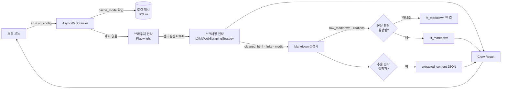
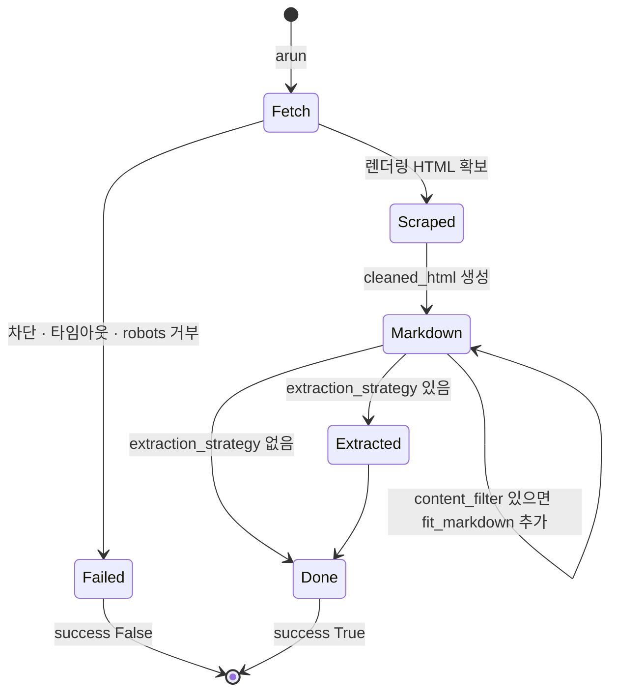
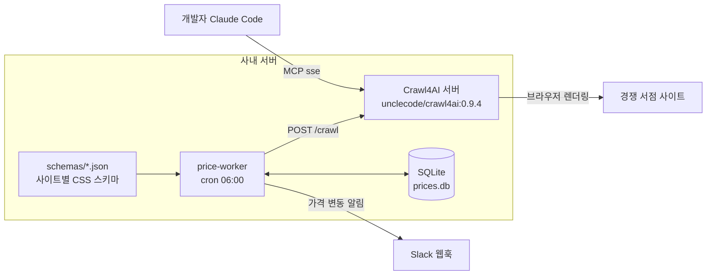
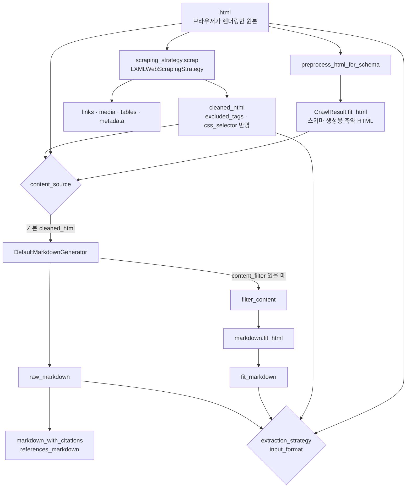

## 개요

> 실제 브라우저로 웹 페이지를 열고, 메뉴·광고·푸터 같은 군더더기를 걷어 낸 뒤 LLM이 읽기 좋은 Markdown이나 구조화된 JSON으로 돌려주는 오픈소스 Python 웹 크롤러입니다. RAG, AI 에이전트, 데이터 파이프라인의 "웹 → 텍스트" 입구를 맡습니다.

## 30초 요약

| 항목 | 내용 |
|---|---|
| 무엇인가? | Playwright 기반 headless 브라우저로 페이지를 가져와 Markdown·JSON으로 정리하는 비동기 Python 크롤러 |
| 왜 사용하는가? | HTML을 그대로 LLM에 넣으면 토큰 낭비와 잡음이 크고, JavaScript로 그려지는 페이지는 `requests`로 받을 수조차 없기 때문 |
| 해결하는 문제 | 동적 페이지 렌더링, 본문만 남기는 정제, 링크 추적, 구조화 추출, 대량 동시 크롤링을 각자 직접 조립해야 하는 문제 |
| 주요 사용처 | RAG 문서 수집, AI 에이전트의 웹 읽기 도구(MCP), 가격·공고 같은 구조화 데이터 추출, 사이트 단위 deep crawl |
| 핵심 개념 | `AsyncWebCrawler`, `BrowserConfig` / `CrawlerRunConfig`, `CrawlResult`, raw·fit Markdown, 전략(Strategy) 객체, 캐시 모드 |
| Client 사용 | X (브라우저·프론트엔드 라이브러리가 아님. 개발자 PC의 스크립트·노트북에서는 사용) |
| Server 사용 | O (백엔드 워커에 라이브러리로 넣거나, Docker 서버로 띄워 REST·MCP로 호출) |
| 대표 대안 | Firecrawl, Scrapy, Jina Reader, ScrapeGraphAI, Crawlee, Playwright + BeautifulSoup 직접 조합 |

- **LLM용 출력이 기본값이다**: 결과의 중심이 HTML이 아니라 Markdown입니다. 제목·목록·표·코드 블록 구조를 유지하고, 링크는 번호 붙은 인용 목록으로 바꿀 수 있습니다.
- **실제 브라우저를 쓴다**: Chromium·Firefox·WebKit을 띄워 JavaScript 실행, 요소 대기, 무한 스크롤, 로그인 프로필 재사용까지 처리합니다.
- **LLM 없이도 추출한다**: CSS·XPath 스키마로 결정적(deterministic)이고 비용 없는 추출을 하고, 필요할 때만 LLM 추출을 씁니다.
- **단계마다 전략을 갈아 끼운다**: 스크래핑, Markdown 생성, 본문 필터, 추출, deep crawl이 모두 교체 가능한 전략 객체입니다.
- **세 가지 형태로 쓴다**: 같은 엔진을 Python 라이브러리, 직접 운영하는 Docker 서버(REST + MCP), 호스팅형 Crawl4AI Cloud로 사용할 수 있습니다.

---

## 어떤 라이브러리인가?

LLM으로 무언가를 만들다 보면 결국 웹 페이지를 읽혀야 하는 순간이 옵니다.

- "우리 제품 공식 문서를 근거로 답하는 챗봇을 만들고 싶다."
- "에이전트가 검색 결과 링크를 열어 내용을 읽게 하고 싶다."
- "경쟁사 상품 페이지에서 가격과 재고만 매일 뽑아 오고 싶다."

이때 페이지의 HTML을 통째로 모델에 넣으면 메뉴, 쿠키 배너, 추천 상품, 스크립트가 본문보다 더 많은 토큰을 차지합니다. 반대로 직접 정제하려면 브라우저 자동화, HTML 파싱, 본문 판별, Markdown 변환, 링크 추적을 하나씩 붙여야 합니다.

Crawl4AI는 이 과정을 **"URL을 넣으면 LLM이 읽기 좋은 텍스트가 나오는 한 번의 호출"**로 묶어 둔 라이브러리입니다. 사서에게 "이 책에서 본문만 깔끔하게 복사해 주세요"라고 맡기는 것과 비슷합니다. 표지, 광고 전단, 목차 반복은 빼고 내용만 정리해서 돌려줍니다.

기술적으로 정의하면, Crawl4AI는 **Playwright로 페이지를 렌더링하고, lxml 기반 스크래핑으로 정제한 HTML을 Markdown으로 변환한 뒤, 선택적으로 본문 필터와 추출 전략을 적용하는 asyncio 기반 크롤링 파이프라인**입니다. 2023년 작성자가 "web-to-Markdown 도구가 계정과 API 토큰, 유료 결제를 요구한다"는 데 불만을 느껴 직접 만든 것이 시작이었고, 지금도 "필수 API 키 없이 쓸 수 있는 오픈소스"를 방향으로 내세웁니다.

2026년 10월 기준 최신 버전은 **v0.9.4(2026-09-23)**이고, Python 3.10 이상이 필요하며, 라이선스는 Apache 2.0입니다. 버전이 아직 0.x이고 패키지 분류도 `Beta`라는 점은 도입 전에 알아 둘 만합니다.

### 주요 사용 사례

- **RAG 수집**: 문서 사이트를 deep crawl해서 본문만 남긴 `fit_markdown`을 제목 단위로 잘라 벡터 DB에 넣습니다.
- **에이전트의 웹 읽기 도구**: Docker 서버의 MCP 엔드포인트를 Claude Code 같은 에이전트에 연결해, 에이전트가 추론 중에 페이지를 Markdown으로 읽게 합니다.
- **구조화 추출**: 상품 목록·채용 공고처럼 반복 구조가 있는 페이지는 CSS 스키마로, 형식이 제각각인 페이지는 LLM 추출로 JSON을 만듭니다.
- **동적 페이지 처리**: 무한 스크롤, lazy 이미지, "더보기" 버튼, 로그인이 필요한 페이지를 실제 브라우저로 처리합니다.
- **사이트 탐색**: sitemap·Common Crawl에서 URL을 찾거나(`AsyncUrlSeeder`), 질의에 답할 만큼 모였을 때 멈추는 적응형 크롤링(`AdaptiveCrawler`)을 씁니다.

주요 용어는 [핵심 개념과 동작 구조](#h-crawl4ai-핵심-개념과-동작-구조)에서 자세히 다룹니다.

---

## 어떤 문제를 해결하는가?

```text
요구사항: 웹 페이지 내용을 LLM이 쓸 수 있는 깨끗한 텍스트로 가져오고 싶다
 ↓
일반적인 구현: requests로 HTML을 받고 BeautifulSoup으로 본문을 골라 문자열로 만든다
 ↓
문제 발생: JavaScript로 그려지는 페이지는 비어 있고, 사이트마다 본문 선택자가 다르며, 표·코드 구조가 깨진다
 ↓
Crawl4AI로 해결: 브라우저 렌더링 → 정제 → Markdown 변환 → 본문 필터 → 추출을 설정 객체 하나로 처리한다
```

### 상황 예시

사내 개발자 지원 챗봇을 만드는 팀이 있습니다. 챗봇은 사내에서 쓰는 오픈소스 프레임워크 세 개의 공식 문서를 근거로 답해야 합니다. 문서 사이트는 모두 SPA(Single Page Application)라서 본문이 JavaScript로 그려지고, 페이지마다 왼쪽 목차, 상단 메뉴, 하단 "이 페이지가 도움이 되었나요?" 위젯이 붙어 있습니다.

### 일반적인 구현 방식

```python
# 흔히 처음 작성하는 코드
import requests
from bs4 import BeautifulSoup

def fetch_text(url: str) -> str:
    html = requests.get(url, timeout=10).text
    soup = BeautifulSoup(html, "html.parser")
    main = soup.select_one("main") or soup.body  # 사이트마다 다른 선택자
    return main.get_text("\n", strip=True)
```

### 이 방식에서 발생하는 문제

- **빈 페이지**: SPA는 서버가 내려주는 HTML에 본문이 없습니다. `requests`로는 `<div id="root"></div>`만 받습니다.
- **사이트별 선택자 관리**: `main`, `article`, `.content`, `#docs-body`처럼 사이트마다 본문 위치가 달라서, 사이트가 늘수록 분기 코드가 늘어납니다.
- **구조 손실**: `get_text()`는 제목 단계, 표, 코드 블록을 모두 평문으로 뭉갭니다. 나중에 "제목 단위로 청크를 나누자"는 요구가 오면 다시 만들어야 합니다.
- **링크 추적과 동시성**: 하위 페이지까지 따라가려면 URL 정규화, 중복 제거, 깊이 제한, 동시 요청 수 제어, 실패 재시도를 직접 구현해야 합니다.
- **브라우저 자원 관리**: Playwright를 직접 붙이면 브라우저를 언제 띄우고 닫을지, 메모리가 찼을 때 어떻게 줄일지를 매번 설계해야 합니다.

### Crawl4AI를 사용하면

같은 요구가 설정 몇 줄로 바뀝니다. 설치와 코드는 [설치와 첫 사용](#h-crawl4ai-설치와-첫-사용)에서 다룹니다.

- 브라우저가 페이지를 렌더링한 뒤의 DOM을 받기 때문에 SPA 본문도 들어옵니다.
- 사이트별 선택자 대신 **점수 기반 본문 필터**(`PruningContentFilterLXML`)가 텍스트 밀도·링크 밀도·태그 종류로 군더더기를 걷어 냅니다.
- 결과가 처음부터 Markdown이라 제목·표·코드 구조가 남습니다.
- `BFSDeepCrawlStrategy`에 깊이, 최대 페이지 수, 도메인·URL 패턴 필터를 주면 하위 페이지 추적과 중복 제거를 맡깁니다.
- 브라우저 수명은 `async with AsyncWebCrawler()` 블록이 관리하고, 여러 URL은 메모리 사용량을 보며 동시 실행 수를 조절하는 dispatcher가 처리합니다.

> **핵심:** 브라우저 렌더링, 본문 정제, Markdown 변환, 링크 추적, 동시성 제어를 개발자가 직접 이어 붙이는 대신, Crawl4AI가 **설정 객체와 교체 가능한 전략**으로 한 파이프라인 안에서 처리해줍니다.

---

## 왜 주목받고 있는가?

Crawl4AI는 2026년 10월 기준 GitHub Star 약 8만 5천 개, Fork 약 8,800개를 기록하고 있습니다. 숫자보다 중요한 것은 이 도구가 들어맞은 흐름입니다.

**LLM 시대의 크롤러는 "저장"보다 "읽히기"가 목적입니다.** 전통적인 크롤러가 HTML을 수집해 색인을 만드는 데 집중했다면, RAG와 에이전트는 모델이 바로 읽을 수 있는 텍스트를 원합니다. Crawl4AI는 처음부터 출력 형식을 Markdown에 맞췄고, `raw_markdown`과 `fit_markdown`을 나눠 "전체 보존"과 "토큰 절약" 중 고를 수 있게 했습니다.

**에이전트 도구로 바로 꽂힙니다.** Docker 서버가 REST API와 함께 MCP(Model Context Protocol) 엔드포인트를 제공해서, Claude Code 같은 에이전트에 명령 한 줄로 "웹 페이지 읽기" 도구를 붙일 수 있습니다.

**LLM 비용을 쓰지 않는 길을 남겨 둡니다.** 많은 "AI 스크레이퍼"가 매 페이지 LLM 호출을 전제로 하는 반면, Crawl4AI는 CSS·XPath 스키마 추출을 기본 경로로 두고, LLM은 스키마를 한 번 만들 때(`generate_schema`)나 형식이 불규칙한 페이지에만 쓰도록 유도합니다.

**자체 호스팅과 호스팅 서비스를 모두 제공합니다.** 라이브러리와 자체 서버는 무료이고, 브라우저·프록시·봇 차단 대응을 맡기고 싶으면 Crawl4AI Cloud를 쓸 수 있습니다. 2026년 9월 말 README가 "라이브러리 또는 클라우드" 두 갈래로 개편되었고, 클라우드는 2026년 12월 31일까지 첫 10달러 크레딧을 카드 없이 제공한다고 안내합니다.

**보안 성숙도를 빠르게 끌어올리는 중입니다.** 2026년 6월 v0.9.0에서 Docker 서버를 "기본값이 안전한(secure-by-default)" 구조로 바꾸었고, 이후 v0.9.3·v0.9.4가 연속으로 보안 릴리스였습니다. 공격 표면이 넓은 "남의 URL을 대신 열어 주는 서버"라는 특성상, 이 변화는 운영자에게 중요합니다. 자세한 내용은 [주의할 점과 FAQ](#h-crawl4ai-주의할-점과-faq)에서 다룹니다.

일반적인 직접 구현과의 항목별 차이는 [장단점과 대안 비교](#h-crawl4ai-장단점과-대안-비교)에 정리했습니다.

---

## 언제 사용하면 좋은가?

- **JavaScript로 그려지는 페이지를 읽어야 하는 경우**: 브라우저 렌더링이 기본이라 SPA, 무한 스크롤, lazy 로딩 페이지도 같은 코드로 처리합니다.
- **결과를 LLM에 넣는 것이 목적인 경우**: Markdown 출력과 본문 필터가 토큰 낭비를 줄이고, 제목 구조가 남아 청크 분할도 쉽습니다.
- **여러 사이트를 같은 방식으로 수집해야 하는 경우**: 사이트별 선택자 대신 점수 기반 필터와 설정 객체로 공통 파이프라인을 만들 수 있습니다.
- **반복 구조 데이터를 싸게 추출하고 싶은 경우**: CSS 스키마 추출은 LLM 호출이 없어 비용이 들지 않고 결과가 매번 같습니다.
- **에이전트에 웹 읽기 도구를 붙이고 싶은 경우**: Docker 서버의 MCP를 연결하면 에이전트 코드를 따로 작성할 필요가 없습니다.
- **데이터를 외부 SaaS로 보내면 안 되는 경우**: 라이브러리와 서버를 사내망에서 직접 운영할 수 있습니다.

---

## 언제 사용하지 않는 것이 좋은가?

- **공개 API나 RSS가 있는 경우**: 데이터를 API로 받을 수 있으면 브라우저를 띄울 이유가 없습니다.
  > 예: GitHub 이슈 목록은 HTML을 크롤링하는 대신 `gh api`나 REST API로 받는 편이 빠르고 안정적입니다.
- **정적 HTML 몇 페이지만 필요한 경우**: `httpx` + BeautifulSoup으로 충분하면 Playwright 브라우저 설치(수백 MB)와 실행 비용이 과합니다.
  > 예: 사내 위키의 고정된 공지 페이지 3개를 하루 한 번 읽는 스크립트.
- **수백만 페이지 규모의 범용 크롤링**: 분산 스케줄링, 중복 제거, 정책 관리가 핵심이라면 Scrapy 같은 크롤링 프레임워크나 전용 인프라가 더 맞습니다. 페이지마다 브라우저를 쓰는 방식은 비용이 큽니다.
- **강한 봇 차단 사이트를 안정적으로 뚫어야 하는 경우**: stealth 모드와 프록시 설정은 제공하지만, 프록시와 차단 대응은 사용자가 마련해야 합니다. 이 부분까지 맡기고 싶다면 호스팅형 서비스가 낫습니다.
- **크롤링 대상 사이트의 약관이 수집을 금지하는 경우**: 도구가 아니라 정책의 문제입니다. `robots.txt` 확인도 기본값은 꺼져 있으므로 직접 켜야 합니다.
- **Python을 쓰지 않는 팀이 라이브러리로만 쓰려는 경우**: 라이브러리 API는 Python 전용입니다. 다른 언어에서는 Docker 서버의 REST API를 거쳐야 하므로 운영 대상이 하나 늘어납니다.

---

## 한눈에 정리

| 항목 | 내용 |
|---|---|
| 라이브러리 | Crawl4AI (PyPI `crawl4ai`, Docker `unclecode/crawl4ai`) |
| 주요 목적 | 웹 페이지를 LLM이 읽기 좋은 Markdown·JSON으로 변환 |
| 해결하는 문제 | 동적 렌더링, 본문 정제, 구조 보존, 링크 추적, 동시성, 구조화 추출을 직접 조립하는 부담 |
| 핵심 개념 | `AsyncWebCrawler`, `BrowserConfig`/`CrawlerRunConfig`, `CrawlResult`, raw·fit Markdown, 전략 객체, 캐시 모드 |
| 주요 사용처 | RAG 수집, 에이전트 웹 도구(MCP), 구조화 추출, deep crawl |
| Client 활용 | 해당 없음 (개발자 로컬 스크립트·노트북에서는 사용) |
| Server 활용 | 백엔드 워커에 라이브러리 내장, Docker 서버(REST·MCP·작업 큐), 사내 공용 크롤링 서비스 |
| 장점 | LLM 친화 출력, 실제 브라우저, LLM 없는 추출, 교체 가능한 전략, 자체 호스팅 |
| 단점 | 브라우저 비용, 0.x 버전의 잦은 변경, 서버 운영 시 보안 부담, 봇 차단 대응은 직접 |
| 추천 상황 | 동적 페이지를 LLM 입력으로 바꾸는 파이프라인, 에이전트 도구, 사내 운영이 필요한 수집 |
| 비추천 상황 | API가 있는 데이터, 정적 몇 페이지, 초대규모 범용 크롤링, 약관상 수집 금지 대상 |
| 대표 대안 | Firecrawl, Scrapy, Jina Reader, ScrapeGraphAI, Crawlee, Playwright 직접 사용 |

---

## 핵심 정리

### 한 문장으로

> Crawl4AI는 웹 페이지를 LLM에 넣을 때 생기는 렌더링·정제·구조 손실 문제를 **실제 브라우저와 교체 가능한 전략 파이프라인**으로 해결하기 위한 Python 크롤러입니다.

### 이것만 기억하기

1. **왜 사용하는가?**
   - 웹 페이지를 LLM이 바로 읽을 수 있는 Markdown·JSON으로 바꾸는 과정을 직접 조립하지 않기 위해서입니다.

2. **어떤 문제를 해결하는가?**
   - JavaScript 렌더링, 사이트마다 다른 본문 위치, 제목·표·코드 구조 손실, 하위 페이지 추적, 동시 크롤링 자원 관리 문제입니다.

3. **어떻게 동작하는가?**
   - `AsyncWebCrawler`가 브라우저로 페이지를 가져오고, 스크래핑 전략이 HTML을 정제하고, Markdown 생성기가 `raw_markdown`을, 본문 필터가 `fit_markdown`을 만들고, 추출 전략이 JSON을 만듭니다. 브라우저 설정과 요청 설정은 `BrowserConfig`와 `CrawlerRunConfig`로 나뉩니다.

4. **실제 프로젝트에서는 어디에 사용하는가?**
   - RAG용 문서 수집 배치, 가격·공고 추출 워커, 사내 공용 크롤링 서버, 에이전트의 MCP 웹 도구로 씁니다.

5. **언제 사용하지 않는가?**
   - API가 있는 데이터, 정적 HTML 몇 장, 초대규모 범용 크롤링, 수집이 금지된 사이트에는 맞지 않습니다.

6. **비슷한 기술과 가장 큰 차이는 무엇인가?**
   - 출력이 처음부터 LLM용 Markdown이고, LLM 없는 스키마 추출과 LLM 추출을 모두 갖췄으며, 라이브러리·자체 서버·클라우드 중 고를 수 있다는 점입니다. 대신 브라우저를 쓰는 만큼 무겁기 때문에 **필요한 페이지에만, 필요한 단계만 켜는 것**이 잘 쓰는 핵심입니다.

## Crawl4AI 핵심 개념과 동작 구조

> Crawl4AI를 이루는 크롤러 객체, 두 가지 설정 객체, 결과 객체, 전략 객체, 캐시 모드, 세 가지 실행 형태가 각각 무엇이고 어떻게 맞물려 동작하는지 다룹니다.

### 용어 한눈에 보기

| 키워드 | 설명 |
|---|---|
| `AsyncWebCrawler` | 브라우저를 띄우고 URL을 크롤링하는 비동기 크롤러 본체. `arun()`, `arun_many()` 제공 |
| `BrowserConfig` | 브라우저 단위 설정. 엔진 종류, headless, 프록시, 프로필, stealth 등 |
| `CrawlerRunConfig` | 크롤 한 번 단위 설정. 캐시, 대기 조건, 본문 필터, 추출 전략, deep crawl 등 |
| `CrawlResult` | 크롤 결과. HTML, 정제된 HTML, Markdown, 링크, 미디어, 추출 JSON, 성공 여부 |
| raw / fit Markdown | 정제된 HTML 전체를 변환한 Markdown / 본문 필터를 거친 Markdown |
| Strategy | 스크래핑·Markdown 생성·본문 필터·추출·청크 분할·deep crawl을 담당하는 교체 가능한 객체 |
| `CacheMode` | 로컬 캐시를 읽을지·쓸지 정하는 값. `CrawlerRunConfig` 기본값은 `BYPASS` |
| Dispatcher | `arun_many()`에서 동시 실행 수와 속도를 조절하는 객체 |
| Docker 서버 | 같은 엔진을 REST API와 MCP로 감싼 자체 호스팅 서버 (기본 포트 11235) |

---

### 1. AsyncWebCrawler (크롤러 본체)

#### 쉽게 설명하면

웹 페이지를 대신 열어 주는 "브라우저 담당 직원"입니다. 출근할 때 브라우저를 한 번 켜 두고, 요청이 올 때마다 새 탭을 열어 페이지를 읽은 뒤, 퇴근할 때 브라우저를 닫습니다.

#### 개발 관점에서는

`AsyncWebCrawler`는 Playwright 브라우저의 수명주기를 관리하는 asyncio 객체입니다. `async with` 블록에 들어갈 때 브라우저를 시작하고, 블록을 나올 때 정리합니다. 블록 안에서는 같은 브라우저를 재사용하므로, URL마다 크롤러를 새로 만드는 것보다 훨씬 빠릅니다.

- `arun(url, config)`: URL 하나를 크롤링합니다. `https://` 외에 `file://`(로컬 파일), `raw:`(HTML 문자열)도 받습니다.
- `arun_many(urls, config, dispatcher)`: 여러 URL을 동시에 크롤링합니다. 기본 dispatcher는 메모리 사용량을 보고 동시 실행 수를 조절하는 `MemoryAdaptiveDispatcher`입니다.

#### 예제

```python
import asyncio
from crawl4ai import AsyncWebCrawler

async def main():
    async with AsyncWebCrawler() as crawler:  # 여기서 브라우저 시작
        a = await crawler.arun("https://example.com")
        b = await crawler.arun("raw:<h1>안녕하세요</h1><p>HTML 문자열도 됩니다.</p>")
        print(a.markdown[:200])
        print(b.markdown)
    # 블록을 나오면 브라우저 종료

asyncio.run(main())
```

#### 핵심

> 크롤러는 "브라우저 하나를 오래 쓰는 객체"입니다. 요청마다 새로 만들지 말고, 작업 단위로 한 번 열어 여러 URL에 재사용합니다.

### 2. BrowserConfig와 CrawlerRunConfig (설정의 두 층)

#### 쉽게 설명하면

"어떤 차를 탈지"와 "이번에 어디를 어떻게 갈지"를 나눈 것입니다. 차종·타이어·블랙박스는 한 번 정하면 계속 쓰고(BrowserConfig), 목적지·경유지·주차 방식은 매번 다르게 정합니다(CrawlerRunConfig).

#### 개발 관점에서는

- **`BrowserConfig`**: 크롤러를 만들 때 한 번 넘깁니다. `browser_type`(chromium·firefox·webkit), `headless`, `proxy_config`, `user_data_dir` + `use_persistent_context`(로그인 프로필 유지), `enable_stealth`, `text_mode`(이미지 끄기) 같은 브라우저 자체의 성질을 정합니다.
- **`CrawlerRunConfig`**: `arun()`마다 넘깁니다. `cache_mode`, `wait_for`(특정 요소가 나타날 때까지 대기), `js_code`, `scan_full_page`(끝까지 스크롤), `excluded_tags`, `markdown_generator`, `extraction_strategy`, `deep_crawl_strategy`, `stream`, `check_robots_txt` 같은 "이번 크롤의 방식"을 정합니다.

두 설정을 나눈 덕분에, 브라우저는 하나만 띄워 두고 페이지 종류마다 다른 실행 설정을 쓸 수 있습니다. 설정 객체는 `clone()`으로 일부 값만 바꾼 사본을 만들 수 있습니다.

#### 예제

```python
from crawl4ai import BrowserConfig, CrawlerRunConfig, CacheMode

browser_cfg = BrowserConfig(headless=True, text_mode=True)  # 이미지 로딩 끄기

base_run = CrawlerRunConfig(
    cache_mode=CacheMode.ENABLED,
    excluded_tags=["nav", "footer"],
)
# 목록 페이지는 끝까지 스크롤, 상세 페이지는 특정 요소를 기다림
list_run = base_run.clone(scan_full_page=True, scroll_delay=0.5)
detail_run = base_run.clone(wait_for="css:article.product-detail")
```

`wait_for`는 `css:` 접두사로 CSS 선택자를, `js:` 접두사로 참이 될 때까지 기다릴 JavaScript 식을 받습니다.

#### 핵심

> 브라우저의 성질은 `BrowserConfig`, 크롤 한 번의 방식은 `CrawlerRunConfig`입니다. 예전 글에서 보이는 `arun(url, bypass_cache=True, ...)`처럼 키워드 인자를 직접 넘기는 방식은 하위 호환용이고, 지금은 설정 객체를 넘기는 방식이 권장됩니다.

### 3. CrawlResult와 두 종류의 Markdown

#### 쉽게 설명하면

크롤링 결과는 "원본 사진 + 보정한 사진 + 요약 메모"가 한 봉투에 들어 있는 것과 같습니다. 원본 HTML, 군더더기를 뺀 HTML, 전체 Markdown, 본문만 남긴 Markdown, 추출한 데이터가 함께 들어 있습니다.

#### 개발 관점에서는

`CrawlResult`의 주요 필드는 다음과 같습니다.

| 필드 | 내용 |
|---|---|
| `success`, `status_code`, `error_message` | 성공 여부와 실패 이유. **실패해도 예외가 아니라 결과로 돌아오므로 반드시 확인** |
| `html` / `cleaned_html` | 브라우저가 렌더링한 원본 HTML / 스크래핑 전략이 정제한 HTML |
| `markdown` | Markdown 결과. 문자열처럼 쓰면 `raw_markdown`이고, 속성으로 다른 버전에 접근 |
| `markdown.raw_markdown` | 정제된 HTML 전체를 변환한 Markdown |
| `markdown.markdown_with_citations` / `references_markdown` | 링크를 `⟨1⟩` 번호로 바꾼 본문 / 번호별 URL 목록 |
| `markdown.fit_markdown` / `fit_html` | 본문 필터를 거친 Markdown / 그 입력이 된 HTML 조각. **필터를 설정하지 않으면 빈 문자열** |
| `extracted_content` | 추출 전략의 결과(JSON 문자열) |
| `links`, `media`, `tables`, `metadata` | 내부·외부 링크, 이미지·영상, 표, 제목·설명 등 메타데이터 |

#### 예제

```python
result = await crawler.arun("https://example.com", config=run_cfg)

if not result.success:
    print(result.status_code, result.error_message)
else:
    print(result.markdown)                     # raw_markdown과 같음 (str 하위 클래스)
    print(result.markdown.fit_markdown)        # 필터가 없으면 ""
    print(len(result.links["internal"]))       # 같은 도메인 링크 수
```

#### 핵심

> `raw_markdown`은 "빠짐없이", `fit_markdown`은 "본문만"입니다. `fit_markdown`이 비어 있다면 버그가 아니라 본문 필터를 설정하지 않았기 때문입니다.

### 4. 전략(Strategy) 객체

#### 쉽게 설명하면

조립 라인의 교체 가능한 부품입니다. "본문 거르는 부품"을 점수 기반에서 질의 기반으로 바꾸거나, "데이터 뽑는 부품"을 CSS 규칙에서 LLM으로 바꿔도 나머지 라인은 그대로 돌아갑니다.

#### 개발 관점에서는

Crawl4AI의 처리 단계는 대부분 `CrawlerRunConfig`에 끼우는 전략 객체로 표현됩니다.

| 단계 | 설정 위치 | 대표 구현 |
|---|---|---|
| 스크래핑(HTML 정제·링크·미디어 수집) | `scraping_strategy` | `LXMLWebScrapingStrategy`(기본) |
| Markdown 생성 | `markdown_generator` | `DefaultMarkdownGenerator`(기본) |
| 본문 필터 | `DefaultMarkdownGenerator(content_filter=...)` | `PruningContentFilterLXML`, `BM25ContentFilter`, `LLMContentFilter` |
| 구조화 추출 | `extraction_strategy` | `JsonCssExtractionStrategy`, `JsonXPathExtractionStrategy`, `RegexExtractionStrategy`, `LLMExtractionStrategy`, `CosineStrategy` |
| 청크 분할(LLM 추출 입력) | `chunking_strategy` | `RegexChunking`, 문장·토픽 기반 청크 |
| 여러 페이지 탐색 | `deep_crawl_strategy` | `BFSDeepCrawlStrategy`, `DFSDeepCrawlStrategy`, `BestFirstCrawlingStrategy` |

#### 예제

```python
from crawl4ai import CrawlerRunConfig, JsonCssExtractionStrategy
from crawl4ai.content_filter_strategy import BM25ContentFilter
from crawl4ai.markdown_generation_strategy import DefaultMarkdownGenerator

run_cfg = CrawlerRunConfig(
    # 질의와 관련 있는 문단만 fit_markdown에 남긴다
    markdown_generator=DefaultMarkdownGenerator(
        content_filter=BM25ContentFilter(user_query="refund policy", bm25_threshold=1.0)
    ),
    # 같은 크롤에서 FAQ 항목을 JSON으로도 뽑는다
    extraction_strategy=JsonCssExtractionStrategy({
        "name": "faq",
        "baseSelector": "details.faq-item",
        "fields": [
            {"name": "question", "selector": "summary", "type": "text"},
            {"name": "answer", "selector": "div.answer", "type": "text"},
        ],
    }),
)
```

#### 핵심

> 무엇을 바꾸고 싶은지 먼저 정하고, 그 단계의 전략만 바꿉니다. Markdown 생성과 본문 필터의 내부 동작은 [Markdown 생성 파이프라인 깊이 보기](#h-crawl4ai-markdown-생성-파이프라인-깊이-보기)에서 자세히 다룹니다.

### 5. CacheMode (로컬 캐시)

#### 쉽게 설명하면

한 번 복사해 둔 페이지를 다시 복사하지 않고 서랍에서 꺼내 쓰는 기능입니다. 다만 Crawl4AI는 기본값이 "서랍을 쓰지 않음"입니다.

#### 개발 관점에서는

크롤 결과는 `~/.crawl4ai/crawl4ai.db`(SQLite)에 캐시될 수 있습니다. 위치는 `CRAWL4_AI_BASE_DIRECTORY` 환경 변수로 바꿉니다. `CrawlerRunConfig`의 `cache_mode` 기본값은 **`CacheMode.BYPASS`**라서, 아무것도 지정하지 않으면 매번 새로 가져오고 캐시에 쓰지도 않습니다.

| 값 | 읽기 | 쓰기 | 용도 |
|---|:-:|:-:|---|
| `ENABLED` | O | O | 개발 중 같은 페이지를 반복 실험할 때, 재실행 가능한 배치 |
| `READ_ONLY` | O | X | 캐시된 결과로만 후처리를 다시 돌릴 때 |
| `WRITE_ONLY` | X | O | 항상 새로 받되 다음 실행을 위해 저장할 때 |
| `BYPASS` | X | X | 기본값. 매번 최신 페이지가 필요할 때 |
| `DISABLED` | X | X | 캐시 기능 자체를 쓰지 않을 때 |

`check_cache_freshness=True`를 주면 캐시를 쓰기 전에 ETag·Last-Modified로 원본이 바뀌었는지 확인합니다.

#### 핵심

> 개발 중에는 `ENABLED`로 같은 사이트를 반복해서 두드리지 않게 하고, 운영 배치에서는 신선도 요구에 맞게 고릅니다.

### 6. 세 가지 실행 형태

#### 쉽게 설명하면

같은 엔진을 "내 차에 직접 달기", "회사 차고에 한 대 두고 같이 쓰기", "택시 부르기" 중에서 고르는 것입니다.

#### 개발 관점에서는

| 형태 | 브라우저를 돌리는 곳 | 호출 방식 | 비용 | 특징 |
|---|---|---|---|---|
| Python 라이브러리 | 내 Python 프로세스 | `AsyncWebCrawler` | 무료 | 모든 기능(JS 실행, 세션, hook 함수, deep crawl) 사용 가능 |
| Docker 서버 | 내가 운영하는 컨테이너 | REST, MCP, Python `Crawl4aiDockerClient` | 무료(호스팅 비용) | 다른 언어·에이전트가 공유. 보안상 일부 설정은 네트워크로 받지 않음 |
| Crawl4AI Cloud | 운영사 | REST(`api.crawl4ai.com`), MCP | 종량제 | 봇 차단·JS 페이지를 자동 처리, `/search`·`/answer` 같은 클라우드 전용 기능 |

Docker 서버는 v0.9.0부터 `js_code`, `proxy_config`, `cookies`, `headers`, `session_id`, `deep_crawl_strategy` 같은 필드를 네트워크 요청으로 받으면 HTTP 400으로 거부합니다. 이런 기능이 필요하면 서버 쪽 설정으로 고정하거나 라이브러리를 직접 써야 합니다. 자세한 내용은 [활용 예시 ③ 자체 서버·에이전트·운영](#h-crawl4ai-활용-예시-③-자체-서버-에이전트-운영)에서 다룹니다.

#### 핵심

> 기능이 가장 넓은 것은 라이브러리입니다. 서버와 클라우드는 "공유와 운영 편의"를 얻는 대신 요청으로 할 수 있는 일이 좁아집니다.

---

### 7. 전체 동작 구조

`arun()` 한 번이 처리되는 흐름은 다음과 같습니다.



1. **시작점**: 호출 코드가 `arun(url, config)`를 부릅니다. 크롤러가 아직 시작되지 않았다면 이때 브라우저를 띄웁니다.
2. **Crawl4AI가 개입하는 시점**: `cache_mode`가 읽기를 허용하면 로컬 캐시를 먼저 봅니다. 캐시가 없으면 `check_robots_txt`, 프록시 회전, 재시도 설정을 반영해 브라우저로 페이지를 엽니다. 이때 `wait_for`, `js_code`, `scan_full_page` 같은 페이지 조작이 실행됩니다.
3. **내부 처리**: 렌더링된 HTML을 스크래핑 전략이 정제해 `cleaned_html`, 링크, 미디어, 표, 메타데이터를 만듭니다. Markdown 생성기가 이를 `raw_markdown`으로 바꾸고 링크를 인용 번호로 정리합니다. 본문 필터가 있으면 같은 입력에서 `fit_markdown`을 따로 만듭니다.
4. **외부 시스템과의 연결**: 추출 전략이 있으면 지정한 입력 형식(HTML, Markdown, fit Markdown)으로 JSON을 만듭니다. LLM 추출이라면 이 단계에서 LiteLLM을 통해 외부 모델 API를 호출합니다. deep crawl이라면 결과의 링크가 다음 크롤 대기열로 들어갑니다.
5. **결과 반환**: 모든 결과를 `CrawlResult`에 담아 돌려주고, 캐시 쓰기가 허용되면 저장합니다. 실패도 `success=False`인 결과로 돌아옵니다.

결과의 상태 변화를 단계로 보면 다음과 같습니다.



## Crawl4AI 설치와 첫 사용

> pip 설치와 브라우저 준비, 기본 설정, URL 하나를 Markdown으로 받는 첫 예제, CLI와 Docker 서버로 같은 일을 하는 방법, 설치할 때 자주 겪는 문제를 다룹니다.

### 설치

필요 조건은 Python 3.10 이상입니다(2026년 10월 기준 패키지 분류자는 3.10~3.13). 라이브러리는 브라우저 자동화에 Playwright를 쓰므로, 패키지 설치와 별개로 **브라우저를 한 번 설치하는 단계**가 있습니다.

```bash
# 가상 환경 권장
python -m venv .venv && source .venv/bin/activate

pip install -U crawl4ai
crawl4ai-setup      # 브라우저 설치와 OS 수준 점검 (한 번만)
crawl4ai-doctor     # 설치 상태 진단
```

uv를 쓰는 프로젝트라면 다음과 같습니다.

```bash
uv add crawl4ai
uv run crawl4ai-setup
```

`crawl4ai-setup`이 실패하면 Playwright 명령으로 Chromium을 직접 설치합니다.

```bash
python -m playwright install --with-deps chromium
```

**선택 설치(extras)** 는 필요한 기능이 있을 때만 붙입니다.

| extra | 추가되는 것 | 필요한 경우 |
|---|---|---|
| `crawl4ai[pdf]` | pypdf | PDF를 크롤링해 텍스트를 뽑을 때 |
| `crawl4ai[torch]` | torch, nltk, scikit-learn | 로컬 임베딩·클러스터링 기반 기능 |
| `crawl4ai[transformer]` | transformers, sentence-transformers | 로컬 트랜스포머 모델 사용 |
| `crawl4ai[cosine]` | torch + transformers | `CosineStrategy` |
| `crawl4ai[all]` | 위 전부 + selenium | 기여·실험용 |

`torch`, `transformer`, `all`은 수 GB 단위로 디스크와 메모리를 늘립니다. Markdown 변환과 CSS·LLM 추출만 쓴다면 기본 설치로 충분합니다.

---

### 기본 설정

라이브러리 자체는 설정 파일 없이 동작합니다. 알아 둘 환경 설정은 두 가지입니다.

```bash
# 캐시 DB 위치 (기본: ~/.crawl4ai/crawl4ai.db)
export CRAWL4_AI_BASE_DIRECTORY=/data/crawl4ai

# LLM 추출·LLM 필터를 쓸 때만 필요 (LiteLLM이 지원하는 제공자 키)
export OPENAI_API_KEY=sk-...
```

LLM 키는 코드에서 `LLMConfig(provider="openai/gpt-4o-mini", api_token=os.getenv("OPENAI_API_KEY"))`처럼 명시적으로 넘기는 편이 어떤 키가 쓰이는지 분명합니다. 로컬 모델이라면 `provider="ollama/llama3.3"`처럼 제공자 이름만 바꿉니다.

---

### 가장 간단한 예제

```python
# first_crawl.py
import asyncio
from crawl4ai import AsyncWebCrawler, BrowserConfig, CrawlerRunConfig, CacheMode
from crawl4ai.content_filter_strategy import PruningContentFilterLXML
from crawl4ai.markdown_generation_strategy import DefaultMarkdownGenerator

async def main():
    run_cfg = CrawlerRunConfig(
        cache_mode=CacheMode.ENABLED,  # 개발 중에는 같은 페이지를 다시 받지 않도록
        markdown_generator=DefaultMarkdownGenerator(
            content_filter=PruningContentFilterLXML(threshold=0.48, threshold_type="fixed")
        ),
    )
    async with AsyncWebCrawler(config=BrowserConfig(headless=True)) as crawler:
        result = await crawler.arun("https://en.wikipedia.org/wiki/Web_crawler", config=run_cfg)

        if not result.success:
            raise SystemExit(f"실패: {result.status_code} {result.error_message}")

        print("raw:", len(result.markdown.raw_markdown), "chars")
        print("fit:", len(result.markdown.fit_markdown), "chars")
        print(result.markdown.fit_markdown[:500])

asyncio.run(main())
```

```bash
python first_crawl.py
```

1. **무엇을 생성하는가**: `AsyncWebCrawler`가 headless Chromium을 띄우고, 블록이 끝날 때 닫습니다. 같은 블록 안의 다른 `arun()` 호출은 이 브라우저를 재사용합니다.
2. **어떤 값을 전달하는가**: 크롤할 URL과 `CrawlerRunConfig`입니다. 여기서는 캐시를 켜고, Markdown 생성기에 점수 기반 본문 필터 `PruningContentFilterLXML`을 붙였습니다.
3. **Crawl4AI가 무엇을 처리하는가**: 페이지를 렌더링하고, HTML을 정제하고, 전체 Markdown(`raw_markdown`)과 본문만 남긴 Markdown(`fit_markdown`)을 함께 만듭니다. 위키백과 문서라면 사이드바·언어 목록·편집 링크가 빠지면서 `fit` 쪽 길이가 눈에 띄게 줄어듭니다.
4. **어떤 결과를 반환하는가**: `CrawlResult`를 돌려줍니다. 실패해도 예외 대신 `success=False`와 `error_message`가 담긴 결과가 오므로, 첫 줄에서 성공 여부를 확인합니다.

필터를 빼고 `result.markdown`만 출력하면 README에 있는 가장 짧은 예제와 같습니다. 그 경우 `fit_markdown`은 빈 문자열입니다.

---

### CLI로 같은 일 하기

`crwl` 명령은 스크립트를 쓰기 전에 페이지가 어떻게 변환되는지 빠르게 확인할 때 편합니다.

```bash
# 페이지 하나를 Markdown으로
crwl https://news.ycombinator.com -o markdown

# BFS로 최대 10페이지 deep crawl
crwl https://docs.crawl4ai.com --deep-crawl bfs --max-pages 10

# 페이지에 질문하기 (LLM 키 필요, 먼저 crwl config로 설정)
crwl https://www.example.com/products -q "Extract all product prices"
```

---

### Docker 서버로 같은 일 하기

Python 밖에서 쓰거나 여러 서비스가 공유하려면 Docker 서버를 띄웁니다. v0.9.0부터 **토큰이 없으면 서버가 컨테이너 내부 loopback에만 바인딩**하므로, 반드시 토큰을 만들어 넘겨야 합니다.

```bash
export CRAWL4AI_API_TOKEN="$(openssl rand -hex 32)"

docker run -d -p 11235:11235 --name crawl4ai --shm-size=1g \
  -e CRAWL4AI_API_TOKEN="$CRAWL4AI_API_TOKEN" \
  unclecode/crawl4ai:0.9.4

# 약 10초 뒤
curl -s http://localhost:11235/md \
  -H "Authorization: Bearer $CRAWL4AI_API_TOKEN" \
  -H "Content-Type: application/json" \
  -d '{"url": "https://news.ycombinator.com", "f": "fit"}' | jq -r .markdown
```

`/md`의 `f`는 필터 종류(`fit`, `raw`, `bm25`, `llm`)이고, `bm25`·`llm`일 때는 `q`에 질의를 넣습니다. 대시보드는 `http://localhost:11235/dashboard`, 요청을 시험해 보는 Playground는 `/playground`에 있습니다. 서버 운영은 [활용 예시 ③ 자체 서버·에이전트·운영](#h-crawl4ai-활용-예시-③-자체-서버-에이전트-운영)에서 다룹니다.

---

### 설치할 때 주의할 점

- **`crawl4ai-setup`을 빼먹는 것이 가장 흔한 실패 원인입니다.** pip 설치만으로는 브라우저 바이너리가 없어 첫 `arun()`에서 실패합니다. CI나 Docker 이미지를 직접 만들 때도 이 단계를 넣어야 합니다.
- **Linux 서버에서는 브라우저 시스템 라이브러리가 필요합니다.** `--with-deps` 옵션이 이를 설치하며, root 권한이 필요할 수 있습니다. 최소 이미지에서 직접 맞추기 어렵다면 공식 Docker 이미지를 쓰는 편이 쉽습니다.
- **Docker 실행 시 `--shm-size`를 주어야 합니다.** Chromium은 공유 메모리(`/dev/shm`)를 많이 쓰는데, Docker 기본값(64MB)으로는 탭이 무작위로 죽을 수 있습니다. 공식 안내는 `--shm-size=1g`입니다.
- **`-e CRAWL4AI_API_TOKEN`처럼 값 없이 넘기지 않습니다.** 셸에 변수가 없으면 빈 값이 조용히 전달되어 서버가 loopback에만 바인딩됩니다. 이때 컨테이너는 healthy로 보이지만 바깥에서 접속하면 연결이 끊깁니다.
- **기존 서버 토큰은 v0.9.0 이후 재발급해야 합니다.** JWT 구현이 바뀌어 예전 토큰이 무효입니다.
- **의존성 고정에 주의합니다.** `crawl4ai`는 LiteLLM의 포크 패키지인 `unclecode-litellm`을 특정 버전(`==1.81.13`, 2026년 10월 기준)으로 고정합니다. 같은 환경에서 upstream `litellm`을 따로 쓰는 프로젝트라면 충돌 여부를 먼저 확인하고, 가능하면 크롤러를 별도 가상 환경이나 서비스로 분리합니다.
- **버전을 고정합니다.** 0.x 단계라 마이너 버전 사이에도 기본값과 서버 동작이 바뀝니다. `crawl4ai==0.9.4`, `unclecode/crawl4ai:0.9.4`처럼 고정하고 릴리스 노트를 확인한 뒤 올립니다.

## Crawl4AI 활용 예시 ① 문서 사이트를 RAG 데이터로 수집하기

> 공식 문서 사이트를 deep crawl해서 본문만 남긴 Markdown을 만들고, 제목 단위 청크로 잘라 벡터 DB에 넣기 직전 형태(JSONL)로 저장하는 과정을 다룹니다.

### 요구사항

> 사내 개발자 지원 챗봇이 Crawl4AI 공식 문서(`docs.crawl4ai.com`)를 근거로 답하게 하고 싶다.
> - `core`, `advanced`, `extraction` 섹션만 수집한다(블로그·릴리스 공지는 제외).
> - 왼쪽 목차, 상단 메뉴, 푸터는 청크에 들어가면 안 된다.
> - 청크는 "어느 페이지의 어느 제목 아래 내용인지"를 알 수 있어야 한다(답변에 출처 링크를 달기 위해).
> - 같은 안내 문구가 여러 페이지에 반복되면 한 번만 저장한다.
> - 사이트에 부담을 주지 않도록 최대 80페이지, `robots.txt`를 지킨다.

---

### 구현

```python
# ingest_docs.py
import asyncio
import hashlib
import json
import re
from pathlib import Path

from crawl4ai import AsyncWebCrawler, BrowserConfig, CrawlerRunConfig, CacheMode
from crawl4ai.content_filter_strategy import PruningContentFilterLXML
from crawl4ai.markdown_generation_strategy import DefaultMarkdownGenerator
from crawl4ai.deep_crawling import BFSDeepCrawlStrategy
from crawl4ai.deep_crawling.filters import FilterChain, DomainFilter, URLPatternFilter

START_URL = "https://docs.crawl4ai.com/"
OUT_FILE = Path("corpus/crawl4ai-docs.jsonl")
HEADING = re.compile(r"^(#{1,3})\s+(.+)$")


def build_run_config() -> CrawlerRunConfig:
    return CrawlerRunConfig(
        deep_crawl_strategy=BFSDeepCrawlStrategy(
            max_depth=2,                 # 시작 페이지 + 2단계
            include_external=False,
            max_pages=80,
            filter_chain=FilterChain([
                DomainFilter(allowed_domains=["docs.crawl4ai.com"]),
                URLPatternFilter(patterns=["*/core/*", "*/advanced/*", "*/extraction/*"]),
            ]),
        ),
        excluded_tags=["nav", "footer", "aside"],
        markdown_generator=DefaultMarkdownGenerator(
            content_filter=PruningContentFilterLXML(threshold=0.48, threshold_type="fixed"),
            options={"ignore_images": True},  # 이미지 링크는 검색 품질에 도움이 안 됨
        ),
        check_robots_txt=True,
        cache_mode=CacheMode.ENABLED,     # 재실행 시 이미 받은 페이지는 캐시에서
        stream=True,                      # 한 페이지씩 받는 즉시 처리
    )


def split_by_headings(markdown: str, url: str, max_chars: int = 2000) -> list[dict]:
    """h1~h3 기준으로 자르고, 각 청크에 제목 경로를 붙인다."""
    chunks: list[dict] = []
    path: list[str] = []
    buf: list[str] = []
    in_code = False

    def flush() -> None:
        text = "\n".join(buf).strip()
        for i in range(0, len(text), max_chars):  # 너무 긴 섹션은 길이로 한 번 더 자름
            chunks.append({"url": url, "heading": " > ".join(path), "text": text[i:i + max_chars]})
        buf.clear()

    for line in markdown.splitlines():
        if line.startswith("```"):
            in_code = not in_code         # 코드 블록 안의 # 주석을 제목으로 오인하지 않기
        match = None if in_code else HEADING.match(line)
        if match:
            flush()
            level = len(match.group(1))
            path[:] = path[: level - 1] + [match.group(2).strip()]
        buf.append(line)
    flush()
    return chunks


async def main() -> None:
    OUT_FILE.parent.mkdir(parents=True, exist_ok=True)
    seen: set[str] = set()
    pages = failed = 0

    async with AsyncWebCrawler(config=BrowserConfig(headless=True, text_mode=True)) as crawler:
        with OUT_FILE.open("w", encoding="utf-8") as out:
            async for result in await crawler.arun(START_URL, config=build_run_config()):
                if not result.success:
                    failed += 1
                    print(f"[skip] {result.url} {result.status_code} {result.error_message}")
                    continue

                pages += 1
                markdown = result.markdown.fit_markdown or result.markdown.raw_markdown
                for chunk in split_by_headings(markdown, result.url):
                    digest = hashlib.sha256(chunk["text"].encode("utf-8")).hexdigest()
                    if digest in seen:
                        continue          # 여러 페이지에 반복되는 안내 문구 제거
                    seen.add(digest)
                    chunk.update(
                        id=digest[:16],
                        title=(result.metadata or {}).get("title"),
                        depth=(result.metadata or {}).get("depth", 0),
                    )
                    out.write(json.dumps(chunk, ensure_ascii=False) + "\n")

    print(f"pages={pages} failed={failed} chunks={len(seen)} -> {OUT_FILE}")


if __name__ == "__main__":
    asyncio.run(main())
```

저장된 JSONL 한 줄은 다음과 같은 모양입니다(값은 설명을 위한 예시입니다).

```json
{"url": "https://docs.crawl4ai.com/core/deep-crawling/", "heading": "Deep Crawling > 3. Streaming vs. Non-Streaming Results", "text": "## 3. Streaming vs. Non-Streaming Results\n...", "id": "5c1e0b7a9d2f4e31", "title": "Deep Crawling", "depth": 1}
```

이 파일을 임베딩 모델에 넣고 벡터 DB에 저장하는 단계는 Crawl4AI의 역할 밖입니다. LangChain, LlamaIndex, 또는 직접 작성한 임베딩 스크립트 어느 쪽이든 이 JSONL을 그대로 입력으로 쓸 수 있습니다.

---

### 실행 흐름

```text
ingest_docs.py 실행
 ↓
AsyncWebCrawler: Chromium 시작 (text_mode로 이미지 로딩 끔)
 ↓
BFSDeepCrawlStrategy: 시작 페이지 크롤 → 링크 추출
 ↓  (depth 1, 2의 링크마다)
FilterChain: 도메인 · URL 패턴 검사 → 통과한 URL만 대기열에
 ↓
robots.txt 검사 → 페이지 렌더링 → cleaned_html (nav · footer · aside 제거)
 ↓
DefaultMarkdownGenerator: raw_markdown + PruningContentFilterLXML로 fit_markdown
 ↓  (stream=True라 페이지 하나가 끝날 때마다 async for로 전달)
split_by_headings: 제목 경로를 붙인 청크로 분할
 ↓
SHA-256 중복 제거 → JSONL에 기록
 ↓
max_pages(80) 도달 또는 대기열 소진 → 브라우저 종료
```

---

### 코드 설명

1. **`max_depth`와 `max_pages`를 함께 둡니다.** 문서 사이트는 링크가 촘촘해서 깊이 2만으로도 수백 페이지가 될 수 있습니다. 깊이는 "얼마나 멀리", 페이지 수는 "얼마나 많이"를 각각 제한합니다. 시작 URL 자체는 필터를 거치지 않고, 필터는 거기서 발견한 링크(depth 1 이상)에만 적용됩니다.
2. **`excluded_tags`와 본문 필터는 역할이 다릅니다.** `excluded_tags`는 의미가 확실한 태그(`nav`, `footer`, `aside`)를 정제 단계에서 지웁니다. `PruningContentFilterLXML`은 태그 이름으로 판단할 수 없는 군더더기(목차 역할을 하는 `div`, 링크만 모인 블록)를 점수로 걸러 `fit_markdown`을 만듭니다. `header`는 문서 제목(`h1`)을 감싸는 경우가 있어 일부러 빼지 않았습니다.
3. **`fit_markdown`이 비면 `raw_markdown`으로 대체합니다.** 본문이 아주 짧은 페이지는 필터가 대부분을 잘라 낼 수 있습니다. 대체 경로를 두면 페이지가 통째로 사라지지 않습니다.
4. **청크마다 제목 경로를 붙입니다.** "Deep Crawling > 3. Streaming vs. Non-Streaming Results"처럼 경로가 있으면, 검색된 청크만 보고도 어떤 맥락의 내용인지 알 수 있고 답변에 출처를 달기 쉽습니다. Markdown 구조가 보존되기 때문에 가능한 분할 방식입니다.
5. **코드 블록 안의 `#`을 제목으로 보지 않습니다.** 문서 사이트에는 셸 주석(`# 설치`)이 많아서, 이 처리가 없으면 코드 예제가 엉뚱한 청크로 쪼개집니다.
6. **`stream=True`로 받는 즉시 씁니다.** 80페이지 결과를 메모리에 모았다가 한 번에 처리하지 않고, 페이지 하나가 끝날 때마다 파일에 기록합니다. 중간에 실패해도 그때까지의 결과가 남습니다.
7. **실패는 결과로 확인합니다.** deep crawl 중 일부 페이지가 타임아웃되거나 `robots.txt`로 거부되어도 예외가 나지 않고 `success=False` 결과가 섞여 옵니다.

---

### 왜 이렇게 사용하는가?

RAG 품질은 검색 단계에서 결정되는 경우가 많고, 검색 품질은 **청크에 무엇이 들어 있는가**에 크게 좌우됩니다. 모든 청크에 같은 목차와 메뉴가 섞여 있으면 질문과 무관한 청크끼리 서로 비슷해져 검색 순위가 흐려집니다. 그래서 수집 단계에서 군더더기를 걷어 내는 것이 임베딩 모델을 바꾸는 것보다 효과가 큰 경우가 많습니다.

이 예제는 그 일을 다음처럼 나눴습니다.

- **어떤 페이지를 볼지**는 deep crawl 전략과 필터 체인이 정합니다.
- **페이지 안에서 무엇을 남길지**는 `excluded_tags`와 본문 필터가 정합니다.
- **어떻게 자를지**는 Markdown 제목 구조를 이용해 애플리케이션 코드가 정합니다.

각 단계가 분리되어 있어서, 예를 들어 질문과 관련 있는 문단만 남기고 싶다면 본문 필터만 `BM25ContentFilter(user_query=...)`로 바꾸고 나머지는 그대로 둘 수 있습니다.

#### 변형: 페이지 수가 부족할 때는 우선순위로 고르기

`max_pages`보다 후보 페이지가 훨씬 많다면 BFS는 "먼저 발견한 순서"로 예산을 씁니다. 중요한 페이지를 먼저 받고 싶다면 `BestFirstCrawlingStrategy`에 키워드 점수기를 붙입니다.

```python
from crawl4ai.deep_crawling import BestFirstCrawlingStrategy
from crawl4ai.deep_crawling.scorers import KeywordRelevanceScorer

strategy = BestFirstCrawlingStrategy(
    max_depth=3,
    include_external=False,
    max_pages=40,
    url_scorer=KeywordRelevanceScorer(keywords=["extraction", "markdown", "deep", "cache"], weight=0.7),
)
```

질문이 정해져 있고 "답할 만큼 모이면 멈추는" 수집을 원한다면 `AdaptiveCrawler`도 선택지입니다. Coverage(질의어를 얼마나 다루는지), Consistency(페이지 간 정보가 일관적인지), Saturation(새 페이지가 더 이상 정보를 늘리지 않는지)으로 충분한지 판단하고, 기본값은 신뢰도 0.7, 최대 20페이지입니다. 다만 사이트 전체를 보관하는 용도에는 맞지 않습니다.

#### 재실행과 증분 수집

`CacheMode.ENABLED`로 두면 같은 스크립트를 다시 돌릴 때 이미 받은 페이지는 로컬 캐시에서 읽습니다. 청크 분할 규칙만 바꿔 다시 만들 때 사이트를 다시 두드리지 않아도 됩니다. 반대로 문서 갱신을 반영해야 하는 정기 배치라면 `check_cache_freshness=True`를 추가해, ETag·Last-Modified가 바뀐 페이지만 새로 받게 합니다.

## Crawl4AI 활용 예시 ② 구조화 데이터 추출

> 웹 페이지에서 Markdown이 아니라 필드가 정해진 JSON을 뽑는 방법을 다룹니다. LLM 없이 CSS 스키마로 추출하기, LLM으로 스키마를 한 번만 만들어 재사용하기, 형식이 제각각인 페이지를 LLM으로 추출하기, 동적 페이지 처리 순서로 진행합니다.

Crawl4AI는 프론트엔드에서 실행되는 라이브러리가 아니므로, 여기서는 Client/Server 구분 대신 **"데이터를 꺼내는 쪽"의 관점**으로 봅니다. 같은 페이지라도 "LLM에게 읽힐 텍스트"가 필요한지, "DB에 넣을 필드"가 필요한지에 따라 쓰는 기능이 달라집니다.

### 활용할 수 있는 기능

| 기능 | 입력 | LLM 호출 | 결과가 매번 같은가 | 어울리는 페이지 |
|---|---|---|---|---|
| `JsonCssExtractionStrategy` | HTML + CSS 선택자 스키마 | 없음 | 같음 | 상품 목록, 게시판, 검색 결과처럼 반복 구조 |
| `JsonXPathExtractionStrategy` | HTML + XPath 스키마 | 없음 | 같음 | CSS로 표현하기 어려운 위치(텍스트 기준 탐색 등) |
| `RegexExtractionStrategy` | 텍스트 + 정규식 | 없음 | 같음 | 이메일, 전화번호, 날짜, 금액 같은 패턴 |
| `generate_schema` / `agenerate_schema` | 예시 HTML 또는 URL + 자연어 설명 | 스키마 만들 때만 | 스키마 고정 후 같음 | 사이트는 많은데 선택자를 손으로 쓰기 싫을 때 |
| `LLMExtractionStrategy` | Markdown·HTML + Pydantic 스키마 | 페이지마다 | 다를 수 있음 | 공고문, 보도자료, 이벤트 안내처럼 형식이 제각각 |
| `CosineStrategy` | 텍스트 + 질의 | 없음(로컬 임베딩) | 같음 | 질의와 비슷한 문단 묶음 찾기 |

선택 순서는 단순합니다. **반복 구조면 CSS 스키마, 선택자를 쓰기 귀찮으면 스키마 생성 후 CSS, 구조가 없으면 그때 LLM**입니다.

---

### 예제 1. LLM 없이 상품 목록 추출하기

스크래핑 연습용으로 공개된 `books.toscrape.com`의 목록 페이지 5장에서 도서 정보를 뽑습니다.

```python
# extract_books.py
import asyncio
import json
from urllib.parse import urljoin

from crawl4ai import (
    AsyncWebCrawler, BrowserConfig, CrawlerRunConfig, CacheMode,
    JsonCssExtractionStrategy, MemoryAdaptiveDispatcher, RateLimiter,
)

BOOK_SCHEMA = {
    "name": "books",
    "baseSelector": "article.product_pod",          # 도서 카드 하나 = 결과 한 건
    "fields": [
        {"name": "title", "selector": "h3 a", "type": "attribute", "attribute": "title"},
        {"name": "href", "selector": "h3 a", "type": "attribute", "attribute": "href"},
        {"name": "price", "selector": "p.price_color", "type": "regex", "pattern": r"([\d.]+)"},
        {"name": "availability", "selector": "p.instock.availability", "type": "text"},
        {"name": "rating", "selector": "p.star-rating", "type": "attribute", "attribute": "class"},
    ],
}

async def main() -> None:
    urls = [f"https://books.toscrape.com/catalogue/page-{n}.html" for n in range(1, 6)]
    run_cfg = CrawlerRunConfig(
        extraction_strategy=JsonCssExtractionStrategy(BOOK_SCHEMA),
        cache_mode=CacheMode.BYPASS,                 # 가격은 항상 최신으로
    )
    dispatcher = MemoryAdaptiveDispatcher(
        memory_threshold_percent=80.0,               # 메모리 80% 넘으면 새 작업 대기
        max_session_permit=4,                        # 동시에 여는 페이지 수 상한
        rate_limiter=RateLimiter(base_delay=(1.0, 2.0), max_delay=30.0, max_retries=2),
    )

    books = []
    async with AsyncWebCrawler(config=BrowserConfig(headless=True, text_mode=True)) as crawler:
        results = await crawler.arun_many(urls, config=run_cfg, dispatcher=dispatcher)
        for result in results:
            if not result.success:
                print(f"[fail] {result.url}: {result.error_message}")
                continue
            for item in json.loads(result.extracted_content):
                item["url"] = urljoin(result.url, item.pop("href", ""))
                item["price"] = float(item["price"]) if item.get("price") else None
                item["rating"] = item.get("rating", "").replace("star-rating", "").strip()
                books.append(item)

    print(f"{len(books)} books")
    print(json.dumps(books[0], indent=2, ensure_ascii=False))

asyncio.run(main())
```

#### 동작 설명

1. **`baseSelector`가 "한 건"의 단위입니다.** 페이지 안에서 `article.product_pod`에 맞는 요소마다 결과 객체 하나가 만들어지고, `fields`의 선택자는 그 요소 안에서만 찾습니다.
2. **`type`은 값을 꺼내는 방법입니다.** `text`는 텍스트, `attribute`는 지정한 속성, `html`은 내부 HTML, `regex`는 텍스트에 정규식을 적용해 첫 번째 그룹을 꺼냅니다. `["text", "regex"]`처럼 리스트로 단계를 이어 붙일 수도 있고, 반복되는 하위 요소는 `list`, `nested`, `nested_list` 타입으로 표현합니다.
3. **`JsonCssExtractionStrategy`는 HTML을 입력으로 씁니다.** Markdown 변환과 무관하게 렌더링된 HTML에서 바로 추출하므로, 본문 필터 설정이 추출 결과에 영향을 주지 않습니다.
4. **`arun_many`와 dispatcher로 여러 페이지를 처리합니다.** `max_session_permit`이 동시 페이지 수를, `RateLimiter`가 같은 도메인 요청 사이의 무작위 지연과 429·503 응답 시 지수 백오프를 맡습니다.
5. **후처리는 애플리케이션 몫입니다.** 상대 경로를 절대 URL로 바꾸고, 문자열 가격을 숫자로 바꾸는 일은 스키마 밖에서 합니다.

> 선택자에 맞는 요소가 없으면 그 필드는 결과에서 **빠지고 오류가 나지 않습니다**(`default`를 지정했다면 그 값). 사이트 구조가 바뀌어도 조용히 빈 필드가 쌓일 수 있으므로, 운영에서는 필수 필드 누락 비율을 따로 감시해야 합니다.

---

### 예제 2. 스키마는 LLM으로 한 번만 만들고 계속 재사용하기

수집할 사이트가 수십 개라면 선택자를 손으로 쓰는 것도 일입니다. `agenerate_schema`는 예시 페이지와 자연어 설명을 LLM에 보내 위와 같은 스키마를 만들어 줍니다. **LLM 비용은 스키마를 만들 때 한 번만** 들고, 이후 크롤링은 예제 1과 똑같이 LLM 없이 돌아갑니다.

```python
# make_schema.py
import asyncio
import json
import os
from pathlib import Path

from crawl4ai import JsonCssExtractionStrategy, LLMConfig

async def main() -> None:
    schema = await JsonCssExtractionStrategy.agenerate_schema(
        url="https://books.toscrape.com/",
        query="각 도서 카드에서 제목, 가격(숫자만), 재고 문구, 상세 페이지 링크를 추출",
        llm_config=LLMConfig(provider="openai/gpt-4o-mini", api_token=os.getenv("OPENAI_API_KEY")),
    )
    Path("schemas").mkdir(exist_ok=True)
    Path("schemas/books.json").write_text(json.dumps(schema, indent=2, ensure_ascii=False))
    print(json.dumps(schema, indent=2, ensure_ascii=False))

asyncio.run(main())
```

생성된 `schemas/books.json`은 사람이 열어 검토하고 저장소에 커밋합니다. 크롤러는 이 파일을 읽어 `JsonCssExtractionStrategy(json.load(...))`로 씁니다. 사이트 구조가 바뀌어 필수 필드가 비기 시작하면 그때 스키마를 다시 생성합니다. 코드 안에서 이미 이벤트 루프가 돌고 있다면 동기 버전 `generate_schema` 대신 지금처럼 `agenerate_schema`를 `await`합니다.

---

### 예제 3. 형식이 제각각인 페이지는 LLM으로 추출하기

행사 안내 페이지처럼 사이트마다 레이아웃이 다르고, "일시"가 표에 있기도 하고 본문 문장에 섞여 있기도 하다면 선택자가 통하지 않습니다. 이때 `LLMExtractionStrategy`에 Pydantic 스키마를 줍니다.

```python
# extract_event.py
import asyncio
import json
import os
from typing import Optional

from pydantic import BaseModel, Field
from crawl4ai import (
    AsyncWebCrawler, CrawlerRunConfig, CacheMode, LLMConfig, LLMExtractionStrategy,
)
from crawl4ai.content_filter_strategy import PruningContentFilterLXML
from crawl4ai.markdown_generation_strategy import DefaultMarkdownGenerator

class Event(BaseModel):
    name: str = Field(..., description="행사 이름")
    starts_at: str = Field(..., description="시작 일시, ISO 8601 형식")
    location: Optional[str] = Field(None, description="장소 또는 온라인 여부")
    fee_krw: Optional[int] = Field(None, description="참가비(원). 무료면 0")

async def main(url: str) -> None:
    strategy = LLMExtractionStrategy(
        llm_config=LLMConfig(provider="openai/gpt-4o-mini", api_token=os.getenv("OPENAI_API_KEY")),
        schema=Event.model_json_schema(),
        extraction_type="schema",
        instruction="페이지에 안내된 행사 정보를 추출하라. 페이지에 없는 값은 null로 둔다.",
        input_format="fit_markdown",        # 본문만 보내 토큰을 줄인다
    )
    run_cfg = CrawlerRunConfig(
        cache_mode=CacheMode.ENABLED,
        markdown_generator=DefaultMarkdownGenerator(content_filter=PruningContentFilterLXML()),
        extraction_strategy=strategy,
    )
    async with AsyncWebCrawler() as crawler:
        result = await crawler.arun(url, config=run_cfg)
        events = [Event.model_validate(e) for e in json.loads(result.extracted_content or "[]")
                  if not e.get("error")]
        print(events)
        strategy.show_usage()               # 프롬프트·응답 토큰 사용량

asyncio.run(main("https://example.com/events/devfest-2026"))  # 실제 행사 페이지 URL로 교체
```

- **`input_format="fit_markdown"`** 으로 본문 필터를 거친 텍스트만 모델에 보냅니다. 필터를 설정하지 않았거나 `fit_markdown`이 비면 Crawl4AI가 자동으로 `markdown`(raw)으로 바꿔 보냅니다.
- **긴 페이지는 청크로 나뉘어 여러 번 호출될 수 있습니다.** 그래서 결과가 리스트로 오고, 청크마다 비슷한 항목이 중복될 수 있습니다. 결과를 Pydantic으로 다시 검증하고 중복을 정리하는 단계를 둡니다.
- **`show_usage()`로 비용을 확인합니다.** 페이지 수에 비례해 비용이 늘어나므로, 대량 수집 전에 몇 페이지로 토큰 사용량을 먼저 재 봅니다.
- **LLM 결과는 검증 대상입니다.** 날짜 형식이나 금액 단위를 모델이 틀릴 수 있으므로 저장 전에 검증합니다.

---

### 동적 페이지에서 먼저 확인할 것

추출 결과가 비어 있다면 스키마보다 **추출 시점에 데이터가 DOM에 있었는지**를 먼저 의심합니다.

```python
from crawl4ai import CrawlerRunConfig

# 무한 스크롤 목록: 끝까지 스크롤한 뒤 HTML을 가져온다
scroll_cfg = CrawlerRunConfig(scan_full_page=True, scroll_delay=0.5)

# 비동기로 그려지는 목록: 카드가 20개 이상 나타날 때까지 기다린다
wait_cfg = CrawlerRunConfig(wait_for="js:() => document.querySelectorAll('.card').length >= 20")

# "더보기" 버튼: 같은 탭(session)에서 JS만 실행해 이어서 읽는다
more_cfg = CrawlerRunConfig(
    session_id="list-session",
    js_code="document.querySelector('button.load-more')?.click();",
    js_only=True,                       # 페이지를 다시 열지 않고 현재 탭에서 실행
    wait_for="css:.card:nth-child(40)",
)
```

`session_id`를 쓰는 경우 첫 `arun()`에도 같은 `session_id`를 주고, 작업이 끝나면 `await crawler.crawler_strategy.kill_session("list-session")`으로 탭을 닫습니다. 이 기능들은 라이브러리에서만 쓸 수 있고, Docker 서버는 보안상 `js_code`와 `session_id`를 네트워크 요청으로 받지 않습니다.

---

### 실제 서비스에서는

> 중고 도서 가격 비교 서비스를 예로 들면, 매일 새벽 워커가 서점 사이트 5곳의 목록 페이지를 `arun_many`로 돌며 사이트별로 저장해 둔 CSS 스키마로 제목·가격·재고를 뽑아 DB에 넣습니다. 사용자가 상품 상세 화면을 열면 서버는 DB의 최신 가격을 보여 줄 뿐, 그 순간 크롤링하지 않습니다. 새 서점을 추가할 때만 개발자가 `agenerate_schema`로 스키마 초안을 만들고 검토해 커밋합니다. 레이아웃이 매번 다른 "할인 행사 공지"만 LLM 추출로 처리하고, 결과는 관리자 확인 후 노출합니다.

핵심은 **LLM을 "매 요청의 엔진"이 아니라 "스키마를 만드는 도구"와 "예외 처리기"로 쓰는 것**입니다. 그래야 비용이 페이지 수에 비례해 늘지 않고, 같은 입력에 같은 결과가 나와 테스트와 장애 분석이 쉬워집니다. 이 흐름을 팀 단위 서비스로 운영하는 구조는 [활용 예시 ③ 자체 서버·에이전트·운영](#h-crawl4ai-활용-예시-③-자체-서버-에이전트-운영)에서 이어집니다.

## Crawl4AI 활용 예시 ③ 자체 서버·에이전트·운영

> Crawl4AI를 Docker 서버로 띄워 여러 서비스와 AI 에이전트가 함께 쓰는 방법, 서버가 받아 주지 않는 요청과 그 이유, 그리고 작은 가격 모니터링 서비스에 실제로 적용하는 과정을 다룹니다.

### 서버 환경에서의 활용

Crawl4AI를 서버에서 쓰는 방법은 두 가지입니다.

- **라이브러리 내장**: 백엔드 워커 프로세스가 `AsyncWebCrawler`를 직접 import합니다. 기능 제약이 없고 네트워크 홉이 없지만, 워커마다 브라우저를 띄우므로 메모리를 많이 씁니다.
- **Docker 서버**: 크롤링을 별도 서비스로 분리하고, 다른 서비스와 에이전트는 REST·MCP로 호출합니다. 언어에 상관없이 쓸 수 있고 브라우저 풀을 한곳에서 관리하지만, 보안 경계 때문에 요청으로 넘길 수 있는 설정이 제한됩니다.

#### 활용 사례

- **사내 공용 크롤링 서비스**: Node.js·Go 백엔드, 데이터 팀 노트북, 배치 작업이 같은 서버의 `/md`, `/crawl`을 호출합니다. 브라우저 설치와 업데이트는 서버 하나에서만 관리합니다.
- **에이전트의 웹 도구**: 서버의 MCP 엔드포인트(`/mcp/sse`, `/mcp/ws`)를 Claude Code 같은 에이전트에 연결하면 `md`, `html`, `screenshot`, `pdf`, `execute_js`, `crawl`, `ask` 도구가 생깁니다. `execute_js`는 서버에서 기본으로 꺼져 있습니다.
- **긴 작업 비동기 처리**: `/crawl/job`으로 작업을 큐에 넣고, 완료되면 웹훅으로 결과를 받거나 `/job/{task_id}`로 조회합니다.
- **LLM 키 중앙 관리**: LLM 제공자 키를 서버의 `.llm.env`와 `config.yml`에 두고, 요청은 제공자 이름만 고릅니다. 요청으로 LLM 엔드포인트(`base_url`)를 바꿀 수 없어 키가 외부로 새지 않습니다.
- **운영 관찰**: `/dashboard`와 `/monitor/*` API로 브라우저 풀, 진행 중 요청, 메모리를 확인합니다.

#### 서버가 요청으로 받지 않는 것

v0.9.0부터 Docker 서버는 요청 본문을 "신뢰할 수 없는 입력"으로 다룹니다. 다음 필드를 네트워크로 보내면 HTTP 400을 돌려줍니다.

| 구분 | 거부되는 필드 | 이유 |
|---|---|---|
| 브라우저 | `proxy_config`, `extra_args`, `user_data_dir`, `cdp_url`, `cookies`, `headers`, `init_scripts` | 내부망 우회, 브라우저 실행 인자 주입, 서버 파일 접근 위험 |
| 실행 | `js_code`, `c4a_script`, `session_id`, `magic`, `simulate_user`, `deep_crawl_strategy` | 임의 코드 실행과 서버 자원 고갈 위험 |
| 전략 | `LLMExtractionStrategy`, `LLMContentFilter` 같은 LLM 설정 객체 | 서버 환경 변수(LLM 키) 노출 위험 |
| hook | Python 코드 문자열(`hooks.code`) | 원격 코드 실행. 대신 선언형 hook 5종(`block_resources`, `add_cookies`, `set_headers`, `scroll_to_bottom`, `wait_for_timeout`)을 `CRAWL4AI_HOOKS_ENABLED=true`일 때만 허용 |

CSS·XPath·정규식 추출, `PruningContentFilterLXML`, `BM25ContentFilter`, 캐시 모드처럼 데이터만 담긴 설정은 그대로 보낼 수 있습니다. **로그인 쿠키, 프록시, JS 조작, deep crawl이 필요한 작업은 라이브러리를 내장한 워커**로 처리하는 것이 원칙입니다.

#### 애플리케이션 구조

```text
사용자 / 내부 서비스 / AI 에이전트
 ↓
리버스 프록시 (TLS 종료, 사내망만 허용)
 ↓
Crawl4AI Docker 서버 (토큰 인증, 요청 검증, egress 제한)
 ├─ /md · /crawl · /crawl/job      ← 백엔드·배치가 호출
 ├─ /mcp/sse                        ← 에이전트가 호출
 └─ 브라우저 풀 (페이지 200개마다 context 재활용)
 ↓
외부 웹사이트

복잡한 크롤링(로그인 · 프록시 · deep crawl)
 → 라이브러리를 내장한 전용 워커가 직접 처리
```

#### 실제 코드

**에이전트에 MCP로 연결하기**

```bash
claude mcp add --transport sse c4ai https://crawl4ai.internal.example.com/mcp/sse \
  --header "Authorization: Bearer $CRAWL4AI_API_TOKEN"
claude mcp list
```

**다른 서비스에서 REST로 호출하기**

설정 객체는 `{"type": "클래스이름", "params": {...}}`, 일반 딕셔너리는 `{"type": "dict", "value": {...}}` 형식으로 감싸야 합니다.

```bash
curl -s https://crawl4ai.internal.example.com/crawl \
  -H "Authorization: Bearer $CRAWL4AI_API_TOKEN" \
  -H "Content-Type: application/json" \
  -d '{
    "urls": ["https://books.toscrape.com/"],
    "crawler_config": {
      "type": "CrawlerRunConfig",
      "params": {
        "cache_mode": "bypass",
        "extraction_strategy": {
          "type": "JsonCssExtractionStrategy",
          "params": {"schema": {"type": "dict", "value": {
            "name": "books", "baseSelector": "article.product_pod",
            "fields": [{"name": "title", "selector": "h3 a", "type": "attribute", "attribute": "title"}]
          }}}
        }
      }
    }
  }' | jq '.results[0].extracted_content | fromjson | .[0:3]'
```

**어느 계층에 두는가**

| 위치 | Crawl4AI 사용 방식 | 이유 |
|---|---|---|
| API 서버(요청 처리 경로) | 직접 크롤링하지 않음. DB나 캐시에 저장된 결과만 조회 | 크롤링은 수 초~수십 초가 걸리고 실패가 잦아 사용자 응답 시간을 망침 |
| 배치·워커 | REST 호출 또는 라이브러리 내장 | 정해진 시간에 반복 실행하고, 실패는 재시도·알림으로 처리 |
| 에이전트 도구 | MCP | 에이전트가 필요할 때 스스로 호출. 결과를 저장할 필요가 없음 |
| 인프라 | 별도 컨테이너, 사내망, 토큰, 리버스 프록시 | "남의 URL을 열어 주는 서버"라 SSRF와 남용의 표적이 됨 |

---

### 실전 프로젝트 적용: 온라인 서점 가격 모니터링

#### 요구사항

다섯 명이 운영하는 온라인 서점에 Crawl4AI를 도입합니다.

- 매일 새벽 6시, 경쟁 서점 두 곳의 목록 페이지에서 도서 제목·가격·재고를 수집한다.
- 가격이 5% 이상 바뀌거나 재고 상태가 바뀐 도서는 Slack으로 알린다.
- 사이트별 CSS 스키마는 저장소에서 버전 관리하고, 수집에 LLM 비용을 쓰지 않는다.
- 개발자들의 Claude Code는 같은 서버를 MCP로 써서 경쟁사 페이지를 읽는다.
- 크롤링 서버는 사내망에만 열고, 토큰 없이는 쓸 수 없다.
- 수집 실패가 30%를 넘으면 작업을 실패로 처리해 운영자가 알 수 있게 한다.

#### 전체 구조



#### 폴더 구조

```text
price-monitor/
├── docker-compose.yml        # Crawl4AI 서버
├── .env                      # CRAWL4AI_API_TOKEN, SLACK_WEBHOOK_URL (커밋하지 않음)
├── targets.json              # 수집 대상: 서점 이름, 스키마 파일, URL 목록
├── schemas/
│   ├── store_a.json          # agenerate_schema로 초안 생성 후 사람이 검토
│   └── store_b.json
├── worker/
│   ├── crawl_client.py       # Crawl4AI REST 호출
│   ├── store.py              # 가격 스냅샷 저장과 변동 감지
│   └── run_price_job.py      # cron이 실행하는 진입점
└── data/
    └── prices.db
```

#### 구현

**1. 크롤링 서버**

```yaml
# docker-compose.yml
services:
  crawl4ai:
    image: unclecode/crawl4ai:0.9.4          # latest 대신 버전 고정
    shm_size: "1g"                            # Chromium 공유 메모리
    environment:
      CRAWL4AI_API_TOKEN: ${CRAWL4AI_API_TOKEN:?CRAWL4AI_API_TOKEN is required}
    ports:
      - "10.0.0.5:11235:11235"                # 사내망 인터페이스에만 바인딩
    restart: unless-stopped
```

`${VAR:?message}` 문법은 토큰이 비어 있으면 컨테이너를 아예 띄우지 않습니다. 토큰 없이 떠서 "healthy인데 접속이 안 되는" 상태를 막기 위한 장치입니다.

**2. REST 호출 클라이언트**

```python
# worker/crawl_client.py
import json
import os

import httpx

C4AI_URL = os.environ.get("CRAWL4AI_URL", "http://10.0.0.5:11235")
TOKEN = os.environ["CRAWL4AI_API_TOKEN"]


def _typed(name: str, **params) -> dict:
    """Crawl4AI 서버가 요구하는 {"type", "params"} 형식으로 감싼다."""
    return {"type": name, "params": params}


def extract(urls: list[str], schema: dict) -> tuple[list[dict], list[str]]:
    payload = {
        "urls": urls,
        "browser_config": _typed("BrowserConfig", headless=True, text_mode=True),
        "crawler_config": _typed(
            "CrawlerRunConfig",
            cache_mode="bypass",
            extraction_strategy=_typed(
                "JsonCssExtractionStrategy", schema={"type": "dict", "value": schema}
            ),
        ),
    }
    resp = httpx.post(
        f"{C4AI_URL}/crawl",
        json=payload,
        headers={"Authorization": f"Bearer {TOKEN}"},
        timeout=300,                     # 서버의 크롤당 기본 상한(300초)과 맞춤
    )
    resp.raise_for_status()

    items, failed = [], []
    for result in resp.json()["results"]:
        rows = json.loads(result.get("extracted_content") or "[]") if result.get("success") else []
        if not rows:
            # 크롤 실패뿐 아니라 "성공했지만 0건"도 실패로 본다 (레이아웃 변경 감지)
            failed.append(result.get("url", "unknown"))
            continue
        for item in rows:
            item["page_url"] = result["url"]
            items.append(item)
    return items, failed
```

**3. 저장과 변동 감지**

```python
# worker/store.py
import sqlite3
from datetime import datetime, timezone

SCHEMA = """
CREATE TABLE IF NOT EXISTS prices (
    store TEXT NOT NULL, title TEXT NOT NULL,
    price REAL, availability TEXT, seen_at TEXT NOT NULL,
    PRIMARY KEY (store, title, seen_at)
)"""


def connect(path: str = "data/prices.db") -> sqlite3.Connection:
    conn = sqlite3.connect(path)
    conn.execute(SCHEMA)
    return conn


def latest(conn: sqlite3.Connection, store: str, title: str) -> tuple | None:
    return conn.execute(
        "SELECT price, availability FROM prices WHERE store=? AND title=? "
        "ORDER BY seen_at DESC LIMIT 1",
        (store, title),
    ).fetchone()


def save_and_diff(conn: sqlite3.Connection, store: str, items: list[dict], threshold: float = 0.05) -> list[str]:
    now = datetime.now(timezone.utc).isoformat()
    changes = []
    for item in items:
        title = item.get("title")
        price = float(item["price"]) if item.get("price") else None
        avail = (item.get("availability") or "").strip()
        if not title:
            continue                         # 필수 필드가 없으면 저장하지 않음
        prev = latest(conn, store, title)
        if prev:
            prev_price, prev_avail = prev
            if prev_price and price and abs(price - prev_price) / prev_price >= threshold:
                changes.append(f"[{store}] {title}: {prev_price} → {price}")
            elif prev_avail != avail:
                changes.append(f"[{store}] {title}: 재고 '{prev_avail}' → '{avail}'")
        conn.execute("INSERT INTO prices VALUES (?, ?, ?, ?, ?)", (store, title, price, avail, now))
    conn.commit()
    return changes
```

**4. 진입점**

```python
# worker/run_price_job.py
import json
import os
import sys

import httpx

from crawl_client import extract
from store import connect, save_and_diff

MAX_FAILURE_RATIO = 0.3


def notify(lines: list[str]) -> None:
    webhook = os.environ.get("SLACK_WEBHOOK_URL")
    if webhook and lines:
        httpx.post(webhook, json={"text": "\n".join(lines[:50])}, timeout=10)


def main() -> int:
    targets = json.load(open("targets.json", encoding="utf-8"))
    conn = connect()
    changes, total, failed = [], 0, 0

    for target in targets:
        schema = json.load(open(target["schema"], encoding="utf-8"))
        items, failed_urls = extract(target["urls"], schema)
        total += len(target["urls"])
        failed += len(failed_urls)
        changes += save_and_diff(conn, target["store"], items)

    notify(changes)
    print(f"urls={total} failed={failed} changes={len(changes)}")
    return 1 if total and failed / total > MAX_FAILURE_RATIO else 0


if __name__ == "__main__":
    sys.exit(main())
```

```cron
# crontab: 매일 06:00, 실패하면 cron 메일로 운영자에게 전달
0 6 * * * cd /opt/price-monitor/worker && ../.venv/bin/python run_price_job.py
```

#### 실제 실행 흐름

1. **사용자 행동**: 06:00에 cron이 `run_price_job.py`를 실행합니다. 같은 시각 개발자 A는 Claude Code에서 "경쟁 서점 B의 신간 페이지를 읽고 요약해 줘"라고 요청합니다.
2. **설정 로드**: 워커가 `targets.json`과 서점별 CSS 스키마를 읽습니다. 스키마는 처음 한 번 `agenerate_schema`로 초안을 만들고 사람이 검토해 커밋한 파일입니다.
3. **서버 요청**: 워커가 `/crawl`에 URL 목록과 `JsonCssExtractionStrategy` 설정을 보냅니다. 서버는 토큰을 확인하고, 요청 설정을 허용 목록으로 검증하고, 목적지가 사내 IP·메타데이터 주소가 아닌지 확인합니다.
4. **크롤링**: 서버의 브라우저 풀이 페이지를 렌더링하고, HTML에서 스키마대로 도서 목록을 추출합니다. 같은 시각 들어온 개발자 A의 MCP `md` 요청도 같은 풀에서 처리됩니다. 풀의 context는 페이지 200개를 처리할 때마다 새로 만들어져 장시간 운영에도 느려지지 않습니다.
5. **결과 처리**: 워커가 결과를 받아 `success`와 `extracted_content`를 확인합니다. 크롤 자체가 실패한 URL뿐 아니라 "성공했지만 추출 0건"인 URL도 실패로 셉니다. CSS 스키마는 선택자가 맞지 않아도 오류 없이 빈 결과를 내기 때문입니다. 제목이 없는 항목은 저장하지 않습니다.
6. **변동 감지와 알림**: 직전 스냅샷과 비교해 5% 이상 가격 변동이나 재고 상태 변화를 찾아 Slack으로 보냅니다. 서점 웹사이트의 가격 화면은 이 DB만 읽습니다.
7. **실패 처리**: 서점 A가 레이아웃을 바꿔 결과가 비기 시작하면 실패 비율이 30%를 넘어 종료 코드 1로 끝나고, 운영자가 알림을 받습니다. 운영자는 스키마를 다시 생성·검토해 커밋하고, 다음 날 정상 수집되는지 확인합니다.

## Crawl4AI 장단점과 대안 비교

> 직접 조립하는 방식과 비교한 차이, Crawl4AI의 장점과 단점, 그리고 Firecrawl·Scrapy·Jina Reader 같은 대안과 비교해 상황별로 무엇을 고를지 다룹니다.

### 직접 조립할 때와 무엇이 달라지나

| 항목 | `requests` + BeautifulSoup | Playwright + 직접 정제 | Crawl4AI |
|---|---|---|---|
| JavaScript 렌더링 | 불가 | 가능 | 가능(기본) |
| 출력 형식 | 직접 만든 텍스트 | 직접 만든 텍스트 | Markdown(raw·fit), 인용 목록, JSON |
| 본문 판별 | 사이트별 선택자 | 사이트별 선택자 | 점수·BM25·LLM 필터 중 선택 |
| 구조화 추출 | 직접 파싱 코드 | 직접 파싱 코드 | CSS·XPath·정규식 스키마, LLM 추출, 스키마 자동 생성 |
| 링크 추적 | 직접 구현 | 직접 구현 | BFS·DFS·Best-First, 필터 체인, 재시작 지원 |
| 동시성·속도 제어 | 직접 구현 | 직접 구현 | 메모리 적응형 dispatcher, RateLimiter |
| 실행 비용 | 매우 낮음 | 높음(브라우저) | 높음(브라우저). `text_mode`, 캐시로 일부 절감 |
| 다른 언어·에이전트에서 사용 | 직접 API 서버 작성 | 직접 API 서버 작성 | Docker 서버의 REST·MCP |
| 의존성 | 작음 | 중간 | 큼(Playwright, patchright, LiteLLM 포크 등) |

---

### 장점과 단점

#### 장점

##### 출력이 처음부터 LLM에 맞춰져 있다

Markdown 변환, 링크 인용 번호, 본문 필터가 기본 파이프라인 안에 있습니다. "크롤링한 다음 LLM용으로 다시 가공"하는 단계를 따로 만들 필요가 없고, 제목 구조가 남아 청크 분할도 쉽습니다.

##### LLM을 꼭 쓰지 않아도 된다

CSS·XPath 스키마 추출은 비용이 없고 결과가 매번 같습니다. LLM은 스키마를 만들 때나 구조가 없는 페이지에만 쓰도록 선택할 수 있어서, 페이지 수가 늘어도 비용이 선형으로 늘지 않게 설계할 수 있습니다.

##### 단계마다 교체할 수 있다

스크래핑, Markdown 생성, 본문 필터, 추출, deep crawl이 모두 전략 객체입니다. 문제가 생긴 단계만 바꾸거나 직접 구현한 전략을 끼울 수 있습니다.

##### 실제 브라우저로 할 수 있는 일이 많다

JavaScript 실행, 요소 대기, 무한 스크롤, 세션 유지, 로그인 프로필, CDP로 원격 브라우저 연결, 스크린샷·PDF까지 같은 API로 다룹니다.

##### 운영 형태를 고를 수 있다

같은 엔진을 라이브러리, 자체 Docker 서버(REST·MCP), 호스팅형 클라우드로 쓸 수 있고, 라이브러리와 서버는 무료로 사내망에서 운영할 수 있습니다. 데이터를 외부 SaaS로 보내기 어려운 조직에 유리합니다.

#### 단점

##### 브라우저 비용이 크다

페이지마다 실제 브라우저가 렌더링하므로, 정적 HTML을 받는 것보다 CPU·메모리·시간이 몇 배 듭니다. 대규모 수집에서는 인프라 비용이 핵심 변수가 됩니다.

##### 0.x 버전이라 변화가 잦다

2026년 6월부터 9월까지 v0.8.7부터 v0.9.4까지 여덟 번의 릴리스가 있었고, v0.9.0에서는 Docker 서버 동작이 크게 바뀌었습니다. 기본 필터 교체(`PruningContentFilter` → `PruningContentFilterLXML`)처럼 권장 API도 움직입니다. 외부 튜토리얼의 코드가 지금과 다른 경우가 많습니다.

##### 서버로 운영하면 보안 부담이 생긴다

"요청받은 URL을 대신 열어 주는 서버"는 SSRF, 파일 쓰기, 원격 코드 실행의 표적이 되기 쉽습니다. 실제로 2026년 6월부터 9월 사이 Docker 서버 관련 보안 권고가 여러 건 공개되고 수정되었습니다. 최신 패치 버전 유지와 사내망 격리가 필수입니다.

##### 봇 차단 대응은 사용자 몫이다

stealth 모드, undetected 브라우저 어댑터, 프록시 회전을 제공하지만 프록시 자체와 차단 우회 전략은 사용자가 마련해야 합니다. 강한 봇 차단 사이트에서는 호스팅형 서비스가 더 안정적일 수 있습니다.

##### 의존성이 무겁다

Playwright 브라우저, patchright, LiteLLM 포크(`unclecode-litellm`) 고정 버전, NLTK 등 의존성이 많습니다. 기존 애플리케이션 가상 환경에 그대로 넣으면 버전 충돌이 생길 수 있어, 별도 워커나 서버로 분리하는 편이 관리하기 쉽습니다.

---

### 비슷한 라이브러리와 비교

| 라이브러리 | 특징 | 장점 | 단점 | 추천 상황 |
|---|---|---|---|---|
| Crawl4AI | 브라우저 기반 크롤러 + LLM용 Markdown + 스키마·LLM 추출, Apache 2.0 | 자체 호스팅 무료, LLM 없는 추출, 세밀한 브라우저 제어 | 브라우저 비용, 잦은 변경, 봇 차단 대응은 직접 | Python 팀이 LLM 입력용 수집을 직접 운영하고 싶을 때 |
| Firecrawl | 스크레이핑·크롤·검색을 API로 제공하는 서비스 중심 도구. 자체 호스팅 가능, AGPL-3.0 | API 하나로 바로 사용, 봇 차단 처리 등 운영 부담이 적음 | 호스팅 사용 시 비용, 자체 호스팅·수정 배포 시 AGPL 의무 검토 필요 | 운영보다 개발 속도가 중요하고 API 호출 비용을 감당할 수 있을 때 |
| Scrapy | Python 크롤링 프레임워크. 스케줄러·파이프라인·미들웨어, BSD | 대규모 크롤링에 검증된 구조, 매우 빠른 HTTP 수집 | 기본은 JS 렌더링 없음, LLM용 출력은 직접 구현 | 수십만 페이지 이상 정적 페이지 수집, 정교한 크롤 정책 |
| Jina Reader | URL 앞에 접두사를 붙이면 Markdown을 돌려주는 호스팅 API(오픈소스 공개) | 코드가 거의 필요 없음 | 세밀한 브라우저 제어와 구조화 추출은 제한적, 외부 서비스 의존 | 에이전트나 스크립트에서 페이지 몇 개를 빠르게 읽을 때 |
| ScrapeGraphAI | LLM이 그래프 파이프라인으로 추출을 수행하는 라이브러리, MIT | 자연어 프롬프트만으로 추출 | 페이지마다 LLM 호출 비용, 결과가 매번 다를 수 있음 | 소량의 불규칙한 페이지에서 빠르게 데이터를 뽑을 때 |
| Crawlee (Python) | Apify의 크롤링·스크레이핑 프레임워크. HTTP·브라우저 크롤러, 큐·저장소, Apache 2.0 | 요청 큐·재시도·프록시 관리 등 크롤러 인프라가 탄탄함 | LLM용 Markdown·추출은 직접 구성 | 크롤러 자체의 견고함이 핵심인 수집 시스템 |

#### 어떤 것을 선택하면 될까?

##### Crawl4AI

결과물을 LLM에 넣는 것이 목적이고, 동적 페이지가 섞여 있으며, **데이터와 인프라를 직접 통제**하고 싶을 때 선택합니다. 특히 반복 구조 데이터를 LLM 비용 없이 뽑고, 필요한 곳에만 LLM을 쓰는 설계를 하고 싶을 때 잘 맞습니다.

##### Firecrawl

크롤링 인프라를 운영하고 싶지 않고, API 비용을 내더라도 빨리 붙이는 것이 중요할 때 적합합니다. 자체 호스팅도 가능하지만 AGPL-3.0이므로, 수정해서 서비스로 제공하려면 라이선스 의무를 먼저 검토해야 합니다.

##### Scrapy 또는 Crawlee

문제가 "LLM 입력 만들기"가 아니라 **"대량의 페이지를 안정적으로 수집하기"** 라면 크롤링 프레임워크가 맞습니다. 이 경우 수집은 프레임워크로 하고, 필요한 페이지만 Crawl4AI의 Markdown 변환이나 `raw:` 입력으로 후처리하는 조합도 가능합니다.

##### Jina Reader 같은 Reader API

에이전트가 가끔 페이지 몇 개를 읽는 정도라면, 브라우저와 서버를 운영하는 것보다 Reader API 호출이 단순합니다. 사내 데이터 정책상 외부 서비스로 URL을 보내도 되는지는 먼저 확인합니다.

##### 직접 조립(`httpx` + BeautifulSoup)

대상이 정적 HTML이고 사이트가 몇 개뿐이라면 여전히 가장 가볍고 이해하기 쉬운 선택입니다. 사이트가 늘거나 JavaScript 렌더링이 필요해지는 시점이 Crawl4AI를 검토할 시점입니다.

## Crawl4AI Markdown 생성 파이프라인 깊이 보기

> 렌더링된 HTML이 `raw_markdown`과 `fit_markdown`이 되기까지 어떤 단계를 거치는지, 본문 필터(Pruning·BM25·LLM)가 실제로 어떤 기준으로 내용을 자르는지를 v0.9.4 소스 코드 기준으로 다룹니다.

Crawl4AI를 쓰다 보면 "왜 이 문단이 빠졌지?", "왜 메뉴가 남았지?", "`fit_markdown`이 왜 비었지?"라는 질문을 반드시 만납니다. 답은 모두 이 파이프라인 안에 있습니다. 이 구조를 알면 설정값을 감으로 바꾸지 않고, 어느 단계를 고쳐야 하는지 정확히 고를 수 있습니다.

---

### 한 번의 크롤에서 HTML이 지나가는 길

페이지를 가져온 다음의 처리는 `AsyncWebCrawler.aprocess_html()` 한 함수에 모여 있습니다.



1. **스크래핑**: `LXMLWebScrapingStrategy`가 원본 HTML에서 스크립트·스타일, `excluded_tags`, `excluded_selector`를 제거하고, `css_selector`나 `target_elements`가 있으면 그 범위만 남겨 `cleaned_html`을 만듭니다. 링크·미디어·표·메타데이터도 이때 수집합니다.
2. **스키마용 축약 HTML**: 별도로 원본 HTML을 `preprocess_html_for_schema`에 넣어 `CrawlResult.fit_html`을 만듭니다. 긴 텍스트를 잘라 구조만 남긴 HTML(최대 30만 자)로, 주로 LLM에게 스키마를 만들게 할 때 쓰입니다.
3. **입력 선택**: Markdown 생성기의 `content_source`에 따라 `cleaned_html`(기본), `raw_html`, `fit_html` 중 하나를 고릅니다. 원본 HTML에 `<base href>`가 있으면 상대 링크의 기준 URL로 씁니다.
4. **Markdown 생성**: 선택한 HTML을 html2text 기반 변환기로 `raw_markdown`으로 바꾸고, 링크를 인용 번호로 바꾼 버전을 함께 만듭니다.
5. **본문 필터**: `content_filter`가 있으면 **같은 입력 HTML**을 필터에 넣어 남길 조각을 고르고, 그 조각만 다시 Markdown으로 바꿔 `fit_markdown`을 만듭니다.
6. **추출**: 추출 전략의 `input_format`에 따라 `markdown`(raw), `fit_markdown`, `html`, `cleaned_html`, `fit_html` 중 하나를 입력으로 씁니다. `fit_markdown`을 요청했는데 비어 있으면 `markdown`으로 자동 대체됩니다.

#### 이름이 같은 두 개의 `fit_html`

파이프라인을 따라가면 헷갈리는 이름이 하나 보입니다.

| 위치 | 만드는 곳 | 내용 |
|---|---|---|
| `result.fit_html` | `preprocess_html_for_schema` | 원본 HTML을 스키마 생성용으로 축약한 것. 본문 필터와 무관하게 항상 생성 |
| `result.markdown.fit_html` | 본문 필터 | 필터가 남긴 HTML 조각. `fit_markdown`의 직접적인 입력. 필터가 없으면 빈 문자열 |

`fit_markdown`이 왜 이렇게 나왔는지 확인하려면 **`result.markdown.fit_html`** 을 봐야 합니다.

---

### DefaultMarkdownGenerator가 하는 일

#### 변환 옵션

변환기는 다음 기본값으로 동작하고, `DefaultMarkdownGenerator(options={...})`로 덮어쓸 수 있습니다.

| 옵션 | 기본값 | 의미 |
|---|---|---|
| `body_width` | `0` | 줄바꿈 폭 제한 없음. 문장이 임의 위치에서 끊기지 않음 |
| `ignore_links` / `ignore_images` | `False` | 링크·이미지를 Markdown에 남김 |
| `mark_code` | `True` | 코드 블록을 펜스로 표시 |
| `single_line_break` | `True` | 단일 줄바꿈 유지 |
| `escape_snob` | `False` | 특수 문자를 과하게 이스케이프하지 않음 |

#### 링크 인용 변환

`raw_markdown`의 링크를 정규식으로 찾아 본문에는 번호만 남기고, 번호별 URL을 따로 모읍니다. 같은 URL은 같은 번호를 씁니다.

```text
# raw_markdown
자세한 내용은 [설치 가이드](/docs/install)를 보세요.

# markdown_with_citations
자세한 내용은 설치 가이드⟨1⟩를 보세요.

# references_markdown
## References

⟨1⟩ https://example.com/docs/install: 설치 가이드
```

URL이 본문에서 빠지기 때문에 토큰이 줄고, LLM이 답변에 "⟨1⟩" 형태로 출처를 표시하게 만들기 쉽습니다. 다만 `fit_markdown`에는 인용 변환이 적용되지 않고 원래 링크 형식이 남습니다.

#### 오류는 예외가 아니라 문자열로

변환 중 예외가 나면 생성기는 예외를 던지지 않고 결과 문자열 자리에 `"Error converting HTML to markdown: ..."`, `"Error generating fit markdown: ..."` 같은 메시지를 넣습니다. 크롤 자체는 `success=True`로 끝날 수 있으므로, 대량 수집에서는 Markdown이 `Error`로 시작하는 결과를 따로 걸러 내는 검사를 두는 편이 안전합니다.

---

### PruningContentFilter: 점수로 가지치기

#### 동작 순서

`PruningContentFilterLXML`(v0.9.4 기본)과 이전 구현 `PruningContentFilter`는 같은 규칙으로 같은 결과를 냅니다.

1. HTML 주석을 지웁니다.
2. 의미가 확실한 태그를 통째로 지웁니다: `nav`, `footer`, `header`, `aside`, `script`, `style`, `form`, `iframe`, `noscript`.
3. `<body>`부터 **위에서 아래로** 노드마다 점수를 계산합니다. 점수가 기준보다 낮으면 그 노드와 **모든 자식을 함께** 지우고, 기준을 넘으면 자식으로 내려가 같은 검사를 반복합니다.
4. 남은 `<body>`의 직계 자식 중 텍스트가 있는 것을 HTML 조각 목록으로 돌려줍니다.

부모가 잘리면 자식은 검사 기회 없이 함께 사라진다는 점이 중요합니다. 본문 전체를 감싼 `div`가 낮은 점수를 받으면 본문이 통째로 빠질 수 있습니다.

#### 점수 계산식

노드 하나의 점수는 다섯 지표의 가중 평균입니다.

| 지표 | 계산 | 가중치 |
|---|---|---|
| 텍스트 밀도 | 텍스트 길이 ÷ 내부 HTML 길이 | 0.4 |
| 링크 밀도 | 1 − (직계 `<a>` 텍스트 길이 ÷ 텍스트 길이) | 0.2 |
| 태그 가중치 | `article` 1.5, `h1` 1.2, `p`·`section` 1.0, `div`·`li` 0.5, `span` 0.3 등 | 0.2 |
| class·id 가중치 | `nav`, `footer`, `sidebar`, `ads`, `comment`, `share` 등으로 시작하면 감점 | 0.1 |
| 텍스트 길이 | log(텍스트 길이 + 1) | 0.1 |

```text
score = (0.4 × 텍스트밀도 + 0.2 × 링크밀도 + 0.2 × 태그가중치
         + 0.1 × max(0, class·id가중치) + 0.1 × log(텍스트길이 + 1)) ÷ 1.0
```

`min_word_threshold`를 주면, 공백 수로 센 단어 수가 그보다 적은 노드는 점수 계산 없이 -1(무조건 제거)을 받습니다.

#### 숫자로 보기

기본 기준값 0.48로 몇 가지 노드를 계산해 보면 필터의 성격이 보입니다.

| 노드 | 텍스트 / 내부 HTML / 링크 텍스트(자) | 점수 | fixed 0.48 | dynamic 0.48 |
|---|---|---|---|---|
| 본문 `<p>` | 300 / 320 / 0 | 1.35 | 유지 | 유지 |
| `<article>` | 3000 / 6000 / 100 | 1.49 | 유지 | 유지 |
| 링크만 모인 `<div>` | 40 / 300 / 40 | 0.53 | **유지** | 제거(기준 0.58) |
| 짧은 `<span>` 배지 | 6 / 40 / 0 | 0.52 | 유지 | 유지 |
| 공유 버튼 `<div>` | 12 / 400 / 12 | 0.37 | 제거 | 제거 |

`log(텍스트 길이 + 1)` 항이 점수를 꽤 끌어올리기 때문에, **고정 기준 0.48에서는 링크만 모인 블록도 살아남을 수 있습니다.** 이럴 때 쓰는 것이 `threshold_type="dynamic"`입니다. 동적 기준은 노드마다 기준값을 조정합니다.

- 중요 태그(`article` 1.5, `main`·`h1` 1.4, `section`·`h2` 1.3, `p`·`h3` 1.2)면 기준 × 0.8 (남기기 쉽게)
- 텍스트 밀도가 0.4를 넘으면 기준 × 0.9
- 링크 텍스트 비율이 0.6을 넘으면 기준 × 1.2 (링크 덩어리는 지우기 쉽게)

#### 소스에서 확인되는 특이점

- **class·id 감점은 사실상 점수에 반영되지 않습니다.** 감점 값은 0 이하인데 계산식에서 `max(0, ...)`로 잘리기 때문에 항상 0이 됩니다. 그런데 가중치 0.1은 분모에 남아 있어, 모든 노드의 점수가 조금씩 낮아지는 효과만 있습니다. lxml 구현의 문서 주석도 이 동작을 "기존 구현의 특이점을 그대로 재현했다"고 명시합니다. 즉 `class="sidebar"` 같은 이름만으로는 잘리지 않고, 실제로는 태그 제거 목록과 밀도 지표가 군더더기를 걸러 냅니다.
- **링크 밀도는 직계 자식 `<a>`만 셉니다.** `<ul><li><a>…</a></li></ul>`처럼 링크가 한 단계 아래에 있으면 `ul` 입장에서는 링크 텍스트가 0으로 계산됩니다. 목차형 목록이 남는 이유 중 하나입니다.
- **보존 목록이 있습니다.** `preserve_tags`, `preserve_classes`에 지정한 노드는 점수와 무관하게 남깁니다. 다만 2번 단계에서 통째로 지우는 태그에는 효과가 없습니다.

#### 왜 lxml 구현으로 바뀌었나

이전 구현은 BeautifulSoup 위에서 노드마다 `get_text()`와 내부 HTML 직렬화를 다시 수행했습니다. 둘 다 하위 트리 전체를 도는 연산이라, 깊고 넓은 페이지에서는 작업량이 노드 수보다 훨씬 빠르게 늘었습니다. `PruningContentFilterLXML`은 모든 지표를 **아래에서 위로 한 번만** 계산해 캐시하고, 점수 계산과 가지치기는 위에서 아래로 한 번 돌면서 처리합니다. 공식 측정값은 중간 크기 페이지 134ms → 13ms, 카드 6,000개 페이지 2,200ms → 260ms입니다. 출력은 바이트 단위로 같고, 기존 `PruningContentFilter`를 직접 쓰면 v0.9.4부터 `DeprecationWarning`이 납니다.

---

### BM25ContentFilter: 질의와 관련 있는 조각만

Pruning이 "본문다운가"를 본다면, BM25 필터는 "질문과 관련 있는가"를 봅니다.

1. **질의 결정**: `user_query`가 있으면 그것을 쓰고, 없으면 페이지의 `<title>`, 첫 `<h1>`, `keywords`·`description` 메타 태그로 질의를 만듭니다. 메타 태그가 없으면 150자가 넘는 첫 문단 일부를 씁니다.
2. **후보 조각 추출**: 본문을 블록 단위 텍스트 조각으로 나눕니다.
3. **BM25 점수**: 질의와 조각을 소문자·공백 기준으로 토큰화하고(기본으로 영어 스테머 적용), 불용어를 걸러 BM25 점수를 매깁니다.
4. **태그 가중치**: 조각을 감싼 태그에 따라 점수를 곱합니다. `h1` 5.0, `h2`·`title` 4.0, `h3` 3.0, `strong`·`blockquote`·`code` 2.0, `b`·`em`·`pre`·`th` 1.5.
5. **선택**: 조정 점수가 `bm25_threshold`(기본 1.0) 이상인 조각만, **원본 문서 순서대로**, 중복 텍스트를 제거해 돌려줍니다.

토큰화가 공백 기준이고 기본 스테머가 영어라서, 조사가 붙는 한국어 문서에서는 "환불"과 "환불은"을 다른 단어로 봅니다. 한국어 페이지에서는 기대보다 적게 남거나 아무것도 남지 않을 수 있으므로, 질의어를 여러 활용형으로 넣거나 Pruning 필터를 먼저 고려합니다.

---

### LLMContentFilter: 모델이 고르게 하기

`LLMContentFilter`는 HTML을 청크로 나눠 LLM에 보내고, `instruction`에 따라 남길 내용을 모델이 골라 돌려주게 합니다. "가격 정책과 환불 조건만 남겨라"처럼 규칙으로 표현하기 어려운 기준을 쓸 수 있지만, 페이지마다 LLM 호출 비용이 들고 결과가 매번 같지 않습니다. `show_usage()`로 토큰 사용량을 확인할 수 있으며, Docker 서버에서는 보안상 요청으로 이 필터를 지정할 수 없습니다.

---

### 실제로 튜닝하는 방법

필터는 HTML을 받아 HTML 조각 목록을 돌려주는 평범한 객체라서, 브라우저 없이 바로 실험할 수 있습니다. 페이지를 한 번만 받아 두고 기준값을 바꿔 가며 비교합니다.

```python
# tune_filter.py
import asyncio
from crawl4ai import AsyncWebCrawler, CrawlerRunConfig, CacheMode
from crawl4ai.content_filter_strategy import PruningContentFilterLXML

URL = "https://en.wikipedia.org/wiki/Web_crawler"

async def main() -> None:
    async with AsyncWebCrawler() as crawler:
        result = await crawler.arun(URL, config=CrawlerRunConfig(cache_mode=CacheMode.ENABLED))
    html = result.cleaned_html                       # 생성기의 기본 입력과 같은 HTML

    for kind, threshold in [("fixed", 0.48), ("fixed", 0.6), ("dynamic", 0.48)]:
        blocks = PruningContentFilterLXML(threshold=threshold, threshold_type=kind).filter_content(html)
        kept = sum(len(b) for b in blocks)
        print(f"{kind:<8} {threshold:<5} blocks={len(blocks):<4} kept_html={kept:>7} / {len(html)}")

asyncio.run(main())
```

튜닝은 다음 순서로 하는 것이 효율적입니다.

1. **범위부터 줄입니다.** 본문 위치가 확실하면 `css_selector="main article"`이나 `target_elements`로 범위를 지정하는 것이 어떤 필터보다 정확합니다. 필터는 범위를 정할 수 없을 때 쓰는 도구입니다.
2. **확실한 군더더기는 태그로 지웁니다.** `excluded_tags`, `excluded_selector`로 쿠키 배너, 추천 목록 같은 반복 요소를 정제 단계에서 지웁니다.
3. **그다음에 필터를 고릅니다.** 범용 본문 추출은 Pruning, 특정 질문에 대한 근거 수집은 BM25, 규칙으로 표현할 수 없는 기준은 LLM 필터입니다.
4. **기준값은 `result.markdown.fit_html`을 보며 조정합니다.** 메뉴가 남으면 기준을 올리거나 `dynamic`으로, 본문이 잘리면 기준을 내리거나 `preserve_tags`를 씁니다.
5. **`raw_markdown`을 버리지 않습니다.** 필터는 휴리스틱입니다. `fit_markdown`이 비거나 지나치게 짧을 때 `raw_markdown`으로 대체하는 경로를 애플리케이션에 남겨 둡니다.

## Crawl4AI 주의할 점과 FAQ

> 운영하면서 신경 써야 할 성능·보안·비용·법적 문제와 Breaking Change, 그리고 처음 쓸 때 자주 헷갈리는 질문을 다룹니다.

### 사용할 때 주의할 점

**성능과 메모리**
- 브라우저 탭 하나가 수십~수백 MB를 씁니다. `arun_many`는 dispatcher가 메모리 사용률을 보며 동시 실행을 조절하지만, `max_session_permit`의 기본값은 문서(10)와 v0.9.4 코드(20)가 다르게 적혀 있으므로 **항상 명시적으로 지정**합니다.
- 이미지가 필요 없으면 `BrowserConfig(text_mode=True)`로 이미지 로딩을 끕니다. Docker 서버의 기본 설정도 `text_mode`를 켭니다.
- deep crawl에서 `max_depth`를 3보다 크게 잡으면 페이지 수가 기하급수로 늘어납니다. 깊이와 함께 `max_pages`를 반드시 둡니다. Docker 서버는 기본으로 깊이 5, 페이지 100으로 제한합니다.
- 오래 도는 서버에서는 브라우저 context에 쿠키·스토리지가 쌓여 점점 느려집니다. v0.9.4부터 서버는 페이지 200개마다 context를 교체합니다(`crawler.pool.max_pages_before_recycle`). 라이브러리를 장시간 쓰는 워커라면 일정 작업 수마다 크롤러를 다시 여는 방식으로 같은 효과를 냅니다.

**동시성**
- `session_id`는 탭 하나를 가리킵니다. 같은 세션을 여러 코루틴이 동시에 쓰면 서로의 페이지 조작이 섞이므로, 세션은 작업 하나에만 쓰고 끝나면 `kill_session`으로 닫습니다.

**보안 (특히 Docker 서버)**
- 2026년 6월부터 9월 사이 SSRF, 임의 파일 쓰기, 원격 코드 실행, XSS를 포함한 보안 권고가 여러 차례 공개·수정되었습니다. 공식 보안 정책상 지원 버전은 0.9.x뿐이고 **이전 버전으로 수정이 역이식되지 않습니다.** 서버는 최신 패치(2026년 10월 기준 0.9.4)로 유지합니다.
- `CRAWL4AI_API_TOKEN`을 설정하고, TLS 리버스 프록시 뒤 사내망에만 둡니다. `CRAWL4AI_ALLOW_INTERNAL_URLS`, `CRAWL4AI_ALLOW_INSECURE_TLS`, `CRAWL4AI_HOOKS_ENABLED`는 내부 테스트처럼 이유가 분명할 때만 켭니다.
- 크롤링한 HTML은 외부에서 온 데이터입니다. `cleaned_html`을 관리 화면 등에 그대로 렌더링하면 XSS가 될 수 있으므로 이스케이프하거나 Markdown·텍스트로만 표시합니다.
- 크롤링한 텍스트를 에이전트나 LLM에 넣을 때는 **프롬프트 인젝션**을 전제로 합니다. 페이지 안의 "이전 지시를 무시하고…" 같은 문장도 그대로 모델에 들어갑니다. 크롤 결과를 읽는 에이전트에게는 파일 삭제·메시지 발송 같은 위험한 도구 권한을 함께 주지 않는 것이 안전합니다.

**비용**
- `LLMExtractionStrategy`, `LLMContentFilter`는 페이지마다, 긴 페이지는 청크마다 LLM을 호출합니다. 대량 수집 전에 몇 페이지로 `show_usage()`를 확인하고, 반복 구조 페이지는 `agenerate_schema`로 스키마를 한 번 만든 뒤 CSS 추출로 돌립니다.
- `input_format="fit_markdown"`으로 본문만 보내면 토큰이 크게 줄어듭니다.

**법적·윤리적 고려**
- `check_robots_txt`의 기본값은 `False`입니다. 공개 사이트를 수집한다면 직접 켭니다.
- 도구가 수집을 허락해 주지는 않습니다. 대상 사이트의 이용 약관, 저작권, 개인정보 포함 여부를 먼저 확인하고, `RateLimiter`로 요청 속도를 제한합니다.

**라이선스**
- 코드 라이선스는 Apache 2.0입니다. 다만 README의 "License & Attribution" 절은 출처 표시를 "권장한다(recommended)"는 문장과 "배지나 문구 중 하나를 포함해야 한다(must include)"는 문장을 함께 담고 있습니다. 두 문구의 법적 관계가 명확하지 않으므로, 제품에 포함한다면 배지나 문구로 출처를 표시해 두고 필요하면 법무 검토를 받는 편이 안전합니다.

**유지보수와 의존성**
- 패키지 분류는 `Development Status :: 4 - Beta`이고 버전은 0.x입니다. 라이브러리 버전과 Docker 이미지 태그를 고정하고, 올릴 때는 CHANGELOG의 Breaking Changes와 Deprecated 항목을 먼저 확인합니다.
- `unclecode-litellm`(LiteLLM 포크)이 정확한 버전으로 고정되어 있어 upstream `litellm`을 쓰는 프로젝트와 같은 환경에 두면 충돌할 수 있습니다. 크롤러는 별도 가상 환경이나 서비스로 분리하는 것을 권장합니다.
- 공개 분류자는 Python 3.10~3.13입니다(2026년 10월 기준). 3.14 관련 수정이 일부 들어가고 있지만, 공식 지원 범위로 명시되기 전까지는 3.13 이하에서 운영하는 편이 안전합니다.

**Breaking Change와 Deprecated 사용 방식**
- **v0.9.0 (2026-06, Docker 서버만)**: 인증 기본 활성화, 토큰 없으면 loopback 바인딩, 기존 JWT 토큰 무효화, `js_code`·`proxy_config`·`cookies`·`headers`·`deep_crawl_strategy` 등 요청 필드 거부, `hooks.code` 제거와 선언형 hook 도입, `output_path` 대신 `artifact_id`, LLM `base_url` 요청 지정 제거, CORS 기본 거부, TLS 검증 기본 활성화, Redis 비밀번호 필수. pip 라이브러리는 변경되지 않았습니다. 이전 절차는 저장소의 `deploy/docker/MIGRATION.md`에 있습니다.
- **SDK의 함수형 hook**: Python 함수를 `Crawl4aiDockerClient`의 hook으로 넘기는 방식은 서버에서 더 이상 동작하지 않습니다. 함수 hook이 필요하면 라이브러리(`AsyncWebCrawler`)를 직접 씁니다.
- **v0.9.4**: `PruningContentFilter` 직접 사용 시 `DeprecationWarning`. 같은 인자를 받는 `PruningContentFilterLXML`로 바꿉니다.
- **오래된 사용 방식**: `arun(url, bypass_cache=True, word_count_threshold=...)`처럼 키워드 인자를 직접 넘기는 방식은 `CrawlerRunConfig`로, `bypass_cache`·`disable_cache` 같은 불리언 플래그는 `CacheMode`로, 전략 생성자의 `provider`·`api_token` 인자는 `llm_config=LLMConfig(...)`로 옮깁니다.

---

### 자주 헷갈리는 부분

#### Q. `fit_markdown`이 항상 빈 문자열입니다. 버그인가요?

아닙니다. `fit_markdown`은 본문 필터의 결과이므로, `DefaultMarkdownGenerator(content_filter=PruningContentFilterLXML())`처럼 필터를 설정해야 채워집니다. 필터 없이 쓰면 `raw_markdown`만 의미가 있습니다. 필터를 설정했는데도 비어 있다면 기준값이 너무 높거나 본문을 감싼 상위 노드가 통째로 잘린 경우로, [Markdown 생성 파이프라인 깊이 보기](#h-pruningcontentfilter-점수로-가지치기)의 튜닝 방법을 참고합니다.

#### Q. `result.markdown`은 문자열인가요, 객체인가요?

둘 다입니다. 문자열의 하위 클래스라서 `print(result.markdown)`이나 문자열 연산을 하면 `raw_markdown`처럼 동작하고, 동시에 `.fit_markdown`, `.markdown_with_citations`, `.references_markdown` 같은 속성으로 다른 버전에 접근할 수 있습니다. 예전 버전과의 호환을 위한 설계입니다.

#### Q. 캐시를 켠 적이 없는데 캐시가 동작하나요?

`CrawlerRunConfig`를 넘기면 `cache_mode` 기본값은 `CacheMode.BYPASS`라서 캐시를 읽지도 쓰지도 않습니다. 개발 중 같은 페이지를 반복해서 받지 않으려면 `CacheMode.ENABLED`를 명시합니다. 캐시는 `~/.crawl4ai/crawl4ai.db`에 저장됩니다.

#### Q. 크롤링이 실패했는데 예외가 나지 않습니다.

Crawl4AI는 페이지 단위 실패(타임아웃, 차단, `robots.txt` 거부)를 예외 대신 `success=False`인 `CrawlResult`로 돌려줍니다. `arun_many`나 deep crawl에서 일부만 실패해도 전체가 멈추지 않게 하기 위한 설계입니다. 결과마다 `success`, `status_code`, `error_message`를 확인하고, CSS 추출이 "성공했지만 0건"인 경우도 별도로 감시해야 합니다.

#### Q. 라이브러리에서 되던 `js_code`가 Docker 서버에서는 400 오류가 납니다.

의도된 동작입니다. v0.9.0부터 서버는 요청 본문을 신뢰하지 않으며, JavaScript 코드·프록시·쿠키·헤더·세션·deep crawl 같은 필드를 네트워크로 받으면 거부합니다. 이런 작업은 서버 쪽 설정으로 고정하거나, 라이브러리를 내장한 워커로 처리합니다. 자세한 목록은 [활용 예시 ③ 자체 서버·에이전트·운영](#h-crawl4ai-활용-예시-③-자체-서버-에이전트-운영)에 정리했습니다.

#### Q. LLM API 키가 꼭 필요한가요?

아닙니다. 크롤링, Markdown 변환, Pruning·BM25 필터, CSS·XPath·정규식 추출, deep crawl은 모두 LLM 없이 동작합니다. 키가 필요한 것은 `LLMExtractionStrategy`, `LLMContentFilter`, 스키마 자동 생성(`agenerate_schema`), CLI의 질문 기능(`crwl -q`)처럼 이름에 LLM이 드러나는 기능뿐입니다. Ollama 같은 로컬 모델도 LiteLLM 제공자 이름으로 지정할 수 있습니다.

#### Q. stealth 모드를 켜면 봇 차단을 우회할 수 있나요?

일부 단순한 자동화 탐지는 피할 수 있지만 보장되지 않습니다. `enable_stealth`, undetected 브라우저 어댑터, 프록시 회전은 도구일 뿐이고, 고급 봇 방어 앞에서는 주거용 프록시 같은 추가 자원이 필요합니다. 그 이전에 대상 사이트가 자동 수집을 허용하는지부터 확인해야 합니다. 차단 대응까지 맡기고 싶다면 호스팅형 서비스(Crawl4AI Cloud 등)를 검토합니다.

#### Q. `result.fit_html`과 `result.markdown.fit_html`은 같은 건가요?

다릅니다. `result.fit_html`은 LLM 스키마 생성용으로 원본 HTML을 축약한 것이고, `result.markdown.fit_html`은 본문 필터가 남긴 HTML 조각으로 `fit_markdown`의 직접적인 입력입니다. 필터 결과를 확인하려면 후자를 봅니다.

#### Q. 라이브러리로 쓸지 Docker 서버로 쓸지 어떻게 정하나요?

Python 프로세스 하나에서 쓰고, 로그인·JS 조작·deep crawl처럼 세밀한 제어가 필요하면 라이브러리입니다. 여러 언어의 서비스나 에이전트가 공유해야 하고, 브라우저 관리를 한곳에 모으고 싶다면 Docker 서버입니다. 둘을 함께 쓰는 구성도 흔합니다. 단순한 Markdown 변환은 서버로, 복잡한 수집은 전용 워커의 라이브러리로 처리합니다.

## 원본 저장소

[unclecode/crawl4ai](https://github.com/unclecode/crawl4ai)
