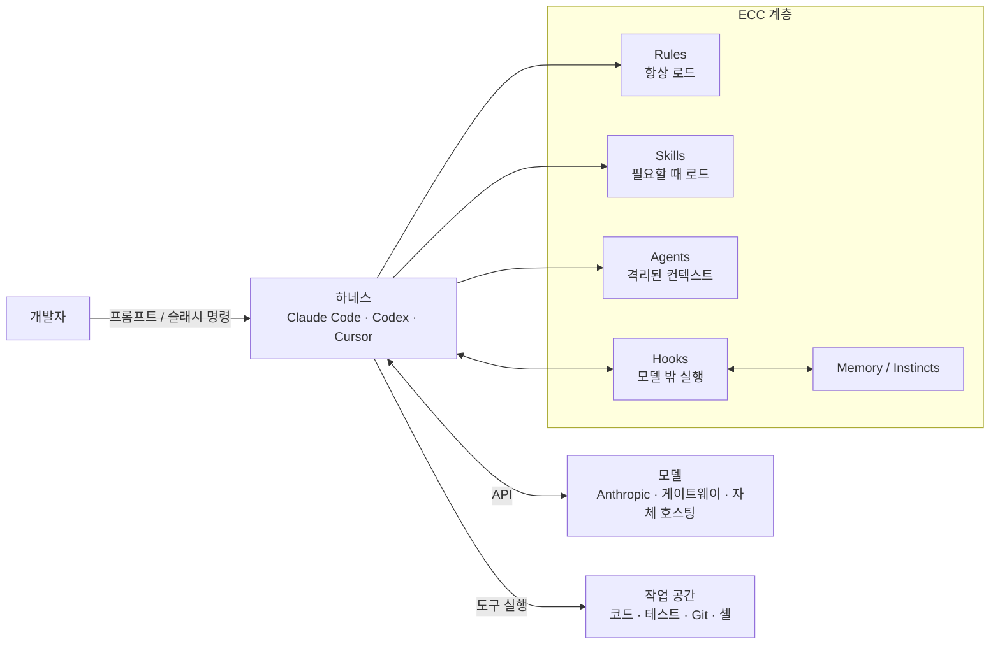
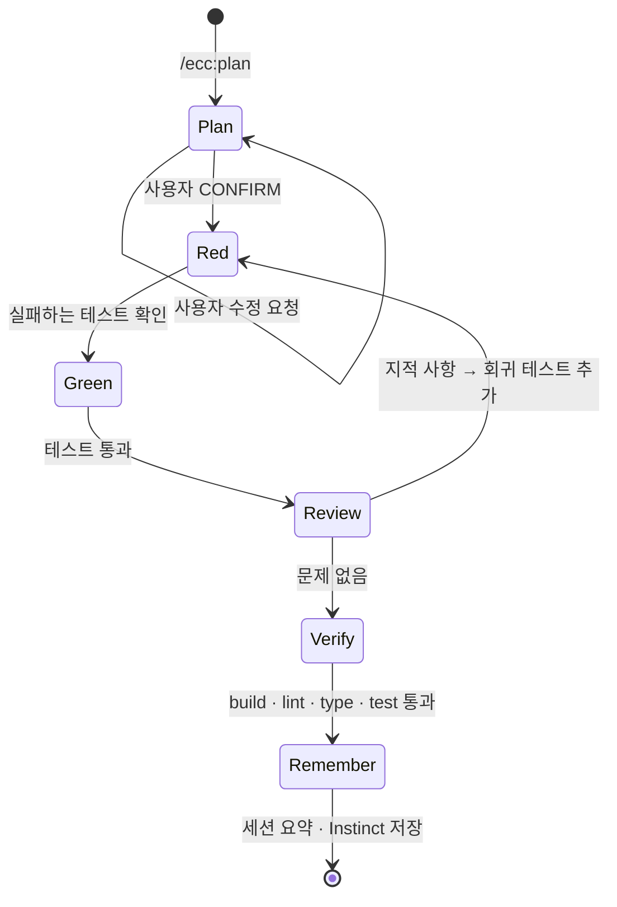
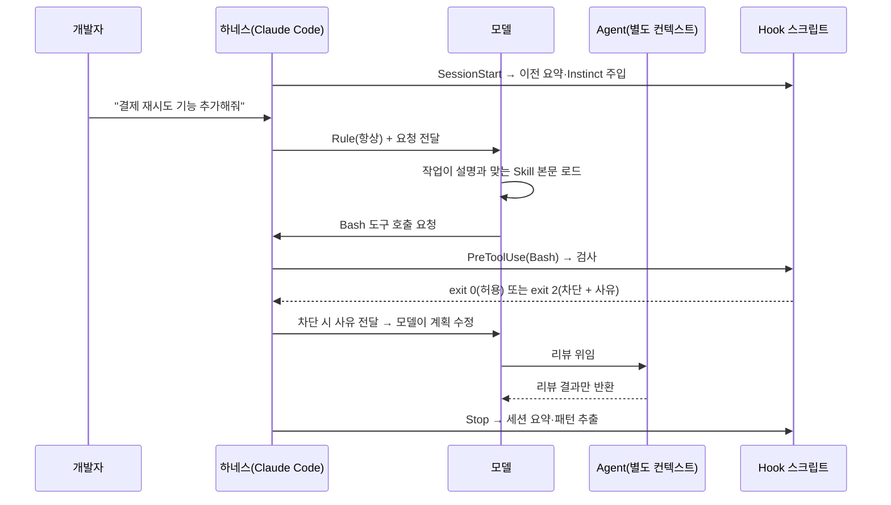
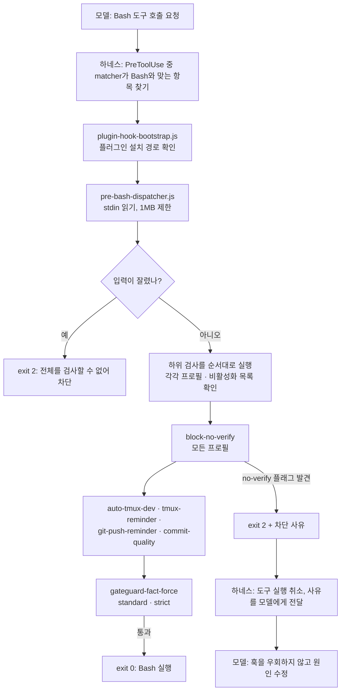

## 개요

> Claude Code 같은 AI 코딩 에이전트에 "계획 → 테스트 → 구현 → 리뷰 → 검증 → 기억"이라는 개발 절차를 한 번 설치해 두고, 매 프롬프트마다 다시 설명하지 않아도 에이전트가 그 절차대로 일하게 만드는 오픈소스 하네스 확장 시스템입니다.

## 30초 요약

| 항목 | 내용 |
|---|---|
| 무엇인가? | AI 코딩 에이전트(Claude Code, Codex 등)에 Agent·Skill·Rule·Hook·Memory를 한 벌로 설치하는 워크플로 계층 |
| 왜 사용하는가? | "TDD로 해줘", "리뷰해줘", "위험한 명령은 막아줘" 같은 요청을 매번 프롬프트로 반복하지 않기 위해 |
| 해결하는 문제 | 에이전트가 코드는 잘 쓰지만 계획·검증·리뷰·기억 같은 앞뒤 절차는 세션마다 사라지는 문제 |
| 주요 사용처 | 기능 개발, 버그 수정, 코드 리뷰, 빌드 복구, 보안 점검, 세션 인계 |
| 핵심 개념 | Agent, Skill, Rule, Hook, Instinct/Memory, 설치 프로필 |
| Client 사용 | O (개발자 로컬의 에이전트 하네스에 설치) |
| Server 사용 | △ (서버 런타임 라이브러리가 아님. 팀 저장소·CI·자체 호스팅 모델 게이트웨이와 연결해 사용) |
| 대표 대안 | 직접 작성한 `CLAUDE.md`, Superpowers, GitHub Spec Kit, oh-my-claudecode |

- **절차를 설치물로 만든다**: 계획·TDD·리뷰 같은 개발 습관을 프롬프트가 아니라 파일(Agent, Skill, Hook)로 고정합니다.
- **컨텍스트를 아낀다**: 항상 필요한 것(Rule)과 필요할 때만 부르는 것(Skill, Agent)을 분리해 컨텍스트 창을 절약합니다.
- **모델 밖에서 강제한다**: Hook은 모델의 기억력에 기대지 않고, 도구 실행 직전·직후에 스크립트로 규칙을 강제합니다.
- **여러 하네스를 지원한다**: 하나의 저장소를 원본으로 두고 Claude Code, Codex, Cursor, OpenCode, Kimi 등에 맞게 변환해 설치합니다.
- **하네스 자체를 보안 대상으로 본다**: AgentShield와 GateGuard로 에이전트 설정 파일과 파괴적 명령을 점검합니다.

---

## 어떤 도구인가?

AI 코딩 에이전트에게 일을 시키다 보면 비슷한 말을 계속 반복하게 됩니다.

- "구현하기 전에 계획부터 보여줘."
- "테스트 먼저 작성하고 실패하는 걸 확인한 다음 구현해."
- "다 했으면 처음 보는 사람 입장에서 다시 리뷰해줘."
- "`rm -rf`나 `git reset --hard`는 함부로 실행하지 마."
- "어제 하던 작업 이어서 해줘."

ECC는 이런 요청을 **매번 말로 하는 대신, 에이전트가 원래 그렇게 일하도록 미리 설치해 두는 도구**입니다. 숙련된 개발자의 작업 습관을 "에이전트용 설정 파일 묶음"으로 만들어 둔 것이라고 생각하면 됩니다.

기술적으로 정의하면, ECC는 **에이전트 하네스(agent harness) 위에 얹는 워크플로 계층**입니다. 하네스란 모델을 감싸서 파일 읽기·쓰기, 셸 실행, 서브에이전트 호출 같은 도구를 제공하는 실행 환경을 말합니다. Claude Code, Codex CLI, Cursor, OpenCode가 모두 하네스입니다. ECC는 이 하네스가 이해하는 확장 형식(서브에이전트 정의, `SKILL.md`, 규칙 파일, Hook 설정)으로 68개의 Agent, 293개의 Skill, 94개의 명령 shim, 언어별 Rule, Hook 런타임, 메모리 시스템, 보안 스캐너를 제공합니다.

ECC가 다루지 않는 영역도 분명합니다. 어떤 모델을 쓸지, API 키와 인증을 어떻게 설정할지는 각 하네스가 그대로 관리합니다. ECC는 그 위에서 "일하는 방식"만 담당합니다.

프로젝트가 내세우는 원칙은 한 문장입니다.

> Optimize the context window. Persist everything else.

컨텍스트 창에는 지금 필요한 것만 올리고, 나머지(규칙, 학습한 패턴, 세션 기록)는 파일로 남겨 두라는 뜻입니다.

참고로 이 프로젝트는 처음에 `everything-claude-code`라는 이름으로 알려졌고, 지금은 저장소·플러그인·패키지 모두 **ECC**로 이름을 정리했습니다. 검색하다가 옛 이름의 글을 보면 같은 프로젝트입니다.

### 주요 사용 사례

- **기능 개발**: `/ecc:plan`으로 구현 계획을 먼저 만들고 확인받은 뒤, `tdd-workflow` Skill로 실패하는 테스트부터 작성하게 합니다.
- **코드 리뷰**: 구현한 컨텍스트와 분리된 `code-reviewer` 서브에이전트가 새로운 시선으로 변경 사항을 검토합니다.
- **빌드·타입 오류 복구**: `/build-fix`가 언어별 build-resolver 에이전트를 불러 최소한의 변경으로 빌드를 복구합니다.
- **위험 명령 차단**: GateGuard Hook이 파괴적인 셸 명령을 실행 전에 막습니다.
- **세션 인계**: `/save-session`, `/resume-session`, 메모리 볼트로 긴 작업을 다음 세션이나 다른 하네스로 넘깁니다.
- **에이전트 설정 보안 점검**: AgentShield로 프롬프트, Hook, MCP 설정, 권한, 비밀값 노출을 검사합니다.

주요 용어는 [핵심 개념과 동작 구조](#h-ecc-핵심-개념과-동작-구조)에서 자세히 다룹니다.

---

## 어떤 문제를 해결하는가?

```text
요구사항: AI 에이전트가 팀의 개발 절차(계획, TDD, 리뷰, 안전 수칙)를 지키며 일하게 하고 싶다
 ↓
일반적인 구현: 프롬프트나 CLAUDE.md에 규칙을 계속 적어 넣는다
 ↓
문제 발생: 규칙이 길어질수록 컨텍스트를 잡아먹고, 모델은 긴 지시를 종종 잊으며, 강제할 방법이 없다
 ↓
ECC로 해결: 상시 규칙 / 필요 시 Skill / 격리된 Agent / 모델 밖 Hook으로 역할을 나눠 설치한다
```

### 상황 예시

세 명이 일하는 스타트업에서 Claude Code로 결제 서비스 백엔드를 개발하고 있습니다. 팀에는 이런 약속이 있습니다.

- 새 기능은 계획을 먼저 공유한다.
- 결제 로직은 반드시 테스트를 먼저 작성한다.
- 머지 전에 보안 관점 리뷰를 한 번 거친다.
- 운영 DB에 닿는 명령이나 `git push --force`는 사람이 직접 실행한다.

### 일반적인 구현 방식

가장 먼저 떠올리는 방법은 프로젝트 루트의 `CLAUDE.md`에 모든 규칙을 적는 것입니다.

```md
<!-- CLAUDE.md : 모든 규칙을 한 파일에 몰아넣은 경우 -->
# 프로젝트 규칙

## 작업 절차
- 기능 구현 전에 반드시 계획을 먼저 보여주고 승인을 받을 것
- 테스트를 먼저 작성하고, 실패를 확인한 다음 구현할 것
- 구현이 끝나면 보안 관점에서 스스로 리뷰할 것 (SQL Injection, 인증 우회, 비밀값 노출...)

## 금지 사항
- rm -rf, git reset --hard, git push --force 실행 금지
- .env 파일 읽기 금지

## TypeScript 규칙
- any 금지, 함수 반환 타입 명시, ...(200줄)

## Python 규칙
- ...(150줄)

## React 규칙
- ...(150줄)

## 리뷰 체크리스트
- ...(100줄)
```

### 이 방식에서 발생하는 문제

- **컨텍스트 낭비**: 백엔드 작업 중에도 React 규칙 150줄이 매 턴 로드됩니다. 규칙 파일은 대화가 길어질수록 같은 자리를 계속 차지합니다.
- **지시가 강제되지 않음**: "`git push --force` 금지"는 부탁일 뿐입니다. 긴 세션 중 모델이 이 줄을 놓치면 막을 장치가 없습니다.
- **자기 리뷰의 한계**: 코드를 작성한 컨텍스트가 그대로 리뷰까지 하면, 작성할 때의 가정과 맹점을 리뷰에서도 그대로 공유합니다.
- **기억이 남지 않음**: 세션을 닫으면 "이 프로젝트에서는 금액을 항상 정수(원 단위)로 다룬다" 같은 학습 내용이 사라집니다.
- **재사용이 어려움**: 다른 저장소나 다른 하네스(Codex, Cursor)로 옮길 때 규칙을 복사·수정해야 합니다.

### ECC를 사용하면

같은 요구사항이 역할별 구성 요소로 나뉩니다. 설치와 호출 방법은 [설치와 첫 사용](#h-ecc-설치와-첫-사용)에서 다룹니다.

- React·Python 규칙은 설치하지 않았으므로 컨텍스트를 차지하지 않습니다.
- TDD 절차와 리뷰 체크리스트는 Skill과 Agent 안에 있어서, 해당 작업을 할 때만 로드됩니다.
- 파괴적 명령은 GateGuard Hook이 모델과 무관하게 실행 직전에 차단합니다.
- 세션 종료 시 학습한 패턴은 Instinct로 저장되고, 다음 세션에 관련 있을 때만 다시 주입됩니다.

> **핵심:** 개발 절차와 안전 수칙을 개발자가 매 프롬프트로 관리하는 대신, ECC가 **상시 규칙·필요 시 로드되는 Skill·격리된 Agent·모델 밖 Hook**으로 나눠 설치해서 처리해줍니다.

---

## 왜 주목받고 있는가?

ECC는 2026년 1월 공개 이후 GitHub Star 27만 개, Fork 4만 개를 넘겼습니다(2026년 10월 기준). 숫자보다 중요한 것은 **왜 이런 도구가 필요해졌는가**입니다.

**모델보다 하네스가 결과를 좌우하는 시기가 왔습니다.** 코딩 모델의 기본 실력이 충분히 올라오면서, 같은 모델이라도 어떤 절차와 규칙 위에서 일하느냐에 따라 결과 품질 차이가 커졌습니다. "프롬프트 엔지니어링"에서 "하네스 엔지니어링"으로 관심이 옮겨 간 흐름에 ECC가 정확히 들어맞습니다.

**하네스가 확장 지점을 열어 주었습니다.** Claude Code가 서브에이전트, Skill, Hook, 플러그인 마켓플레이스를 제공하면서 "에이전트 작업 방식"을 파일로 배포할 수 있게 되었습니다. ECC는 이 확장 지점을 가장 넓게 채운 카탈로그입니다.

**컨텍스트 비용 문제에 정면으로 답합니다.** 규칙을 많이 넣을수록 컨텍스트가 줄어드는 문제를 Rule(항상)과 Skill(필요할 때)의 분리, 세션 시작 컨텍스트 상한(`ECC_SESSION_START_MAX_CHARS`), 신뢰도 기반 Instinct 주입 같은 장치로 다룹니다.

**모델의 기억력에 기대지 않는 강제 장치가 있습니다.** Hook은 모델 밖에서 실행되므로 "잊어버림"이 없습니다. 에이전트에게 셸 권한을 주는 일이 많아질수록 이 차이는 커집니다.

**하네스를 가리지 않으려 합니다.** 저장소 루트 하나를 원본으로 두고 Claude Code, Codex, Cursor, OpenCode, Kimi Code, Gemini 등으로 변환합니다. 팀원마다 다른 도구를 써도 같은 절차를 공유할 수 있습니다.

`CLAUDE.md`만 쓸 때와의 항목별 차이는 [장단점과 대안 비교](#h-ecc-장단점과-대안-비교)에 정리했습니다.

---

## 언제 사용하면 좋은가?

- **AI 에이전트로 매일 상당량의 코드를 작성하는 경우**: 같은 지시를 반복하는 비용이 매일 쌓이므로, 절차를 한 번 설치해 두는 효과가 큽니다.
- **결제·인증·데이터 마이그레이션처럼 실수 비용이 큰 코드가 있는 경우**: 계획 확인, 테스트 선작성, 별도 컨텍스트 리뷰라는 단계가 사고를 줄이는 안전장치가 됩니다.
- **에이전트에게 셸 권한을 넓게 주는 경우**: 프롬프트로 하는 금지는 잊힐 수 있지만 Hook은 잊히지 않습니다.
- **팀원마다 다른 하네스를 쓰는 경우**: 하나의 원본에서 Claude Code, Codex, Cursor 등으로 같은 워크플로를 배포하고, Memory Vault로 맥락을 공유할 수 있습니다.
- **에이전트 활용 방식을 배우고 싶은 경우**: 293개의 Skill과 68개의 Agent 정의 자체가 "좋은 에이전트 워크플로를 어떻게 작성하는가"의 예제 모음입니다. 설치하지 않고 읽기만 해도 얻는 것이 많습니다.

---

## 언제 사용하지 않는 것이 좋은가?

- **일회성 스크립트나 빠른 프로토타입**: 계획 확인과 TDD 단계가 오히려 속도를 늦춥니다. 버릴 코드라면 절차의 이득이 없습니다.
  > 예: 데이터 한 번 변환하는 50줄짜리 Python 스크립트를 만드는데 planner와 code-reviewer를 거칠 필요는 없습니다.
- **에이전트를 일주일에 몇 번만 쓰는 경우**: 설치와 학습 비용이 반복 지시를 줄이는 이득보다 큽니다.
- **잘 정리된 `CLAUDE.md` 하나로 충분한 팀**: 규칙이 수십 줄 이내이고 위험 명령 걱정이 적다면, 단순한 규칙 파일 하나로 필요한 효과의 대부분을 얻습니다.
- **컨텍스트 창이 작은 로컬 모델**: 전체 카탈로그와 세션 시작 주입은 작은 모델을 흔들 수 있습니다. 쓰더라도 `minimal` 프로필, `ECC_SESSION_START_CONTEXT=off`, 프로젝트에 맞는 Skill 몇 개로 줄여야 합니다.
- **이미 Hook 기반 도구를 쓰고 있는 경우**: 다른 Hook 도구와 겹쳐 켜면 같은 이벤트에서 충돌하거나 중복 실행될 수 있습니다. 하나를 정하거나 `ECC_DISABLED_HOOKS`로 겹치는 부분을 꺼야 합니다.
- **설정 변화에 민감한 환경**: ECC는 릴리스가 잦고 구성 요소가 많습니다. 사내 보안 검토를 거친 설정만 써야 하는 조직이라면 전체 설치보다 검토한 Skill 몇 개만 가져오는 편이 관리하기 쉽습니다.

---

## 한눈에 정리

| 항목 | 내용 |
|---|---|
| 라이브러리 | ECC (`ecc@ecc` 플러그인, npm `ecc-universal`) |
| 주요 목적 | AI 코딩 에이전트에 계획·테스트·리뷰·검증·기억 절차를 설치물로 고정 |
| 해결하는 문제 | 매 프롬프트 반복 지시, 강제되지 않는 규칙, 자기 리뷰의 맹점, 세션 간 기억 손실 |
| 핵심 개념 | Agent(격리된 작업자), Skill(필요 시 로드되는 절차), Rule(항상 로드되는 표준), Hook(모델 밖 강제), Instinct/Memory |
| 주요 사용처 | 기능 개발 TDD, 코드 리뷰, 빌드 복구, 보안 점검, 세션 인계 |
| Client 활용 | 개발자 로컬 하네스에서 React·Next.js Skill, 프론트엔드 리뷰 Agent, 브라우저 QA |
| Server 활용 | 프레임워크별 TDD·보안 Skill, DB 리뷰, 팀 저장소 공유, CI 보안 스캔, 게이트웨이 연동 |
| 장점 | 절차 재사용, 컨텍스트 역할 분리, Hook 기반 강제, 별도 컨텍스트 리뷰, 다중 하네스 |
| 단점 | 큰 규모와 복잡도, 컨텍스트·비용, Hook 오탐·누락, 하네스 간 기능 차이, 잦은 변경 |
| 추천 상황 | 에이전트를 매일 깊게 쓰고, 위험 명령 차단·팀 공유·기억이 필요한 경우 |
| 비추천 상황 | 일회성 스크립트, 가끔 쓰는 경우, 짧은 `CLAUDE.md`로 충분한 팀, 작은 로컬 모델 |
| 대표 대안 | `CLAUDE.md`, Superpowers, GitHub Spec Kit, oh-my-claudecode |

---

## 핵심 정리

### 한 문장으로

> ECC는 AI 코딩 에이전트가 매번 잊어버리는 개발 절차와 안전 수칙을 **상시 규칙·필요 시 로드되는 Skill·격리된 Agent·모델 밖 Hook**으로 나눠 설치해서 해결하기 위한 하네스 확장 시스템입니다.

### 이것만 기억하기

1. **왜 사용하는가?**
   - "계획 먼저, 테스트 먼저, 리뷰는 따로, 위험 명령은 금지"를 매 프롬프트로 반복하지 않고 에이전트의 기본 작업 방식으로 만들기 위해서입니다.

2. **어떤 문제를 해결하는가?**
   - 규칙이 컨텍스트를 낭비하는 문제, 규칙이 강제되지 않는 문제, 작성자가 자기 코드를 리뷰하는 문제, 세션이 끝나면 맥락이 사라지는 문제입니다.

3. **어떻게 동작하는가?**
   - Rule은 항상, Skill은 필요할 때 로드되고, Agent는 별도 컨텍스트에서 위임 작업을 처리하며, Hook은 도구 실행 전후에 모델 밖에서 검사합니다. 세션 요약과 Instinct가 다음 세션으로 맥락을 넘깁니다.

4. **실제 프로젝트에서는 어디에 사용하는가?**
   - 결제·인증처럼 실수 비용이 큰 기능의 TDD, PR 전 리뷰와 보안 점검, CI 빌드 복구, 팀 저장소의 공통 에이전트 설정, 하네스 간 작업 인계에 씁니다.

5. **언제 사용하지 않는가?**
   - 버릴 코드, 가끔 쓰는 에이전트, 짧은 규칙 파일로 충분한 팀, 컨텍스트가 작은 로컬 모델에서는 오히려 부담이 됩니다.

6. **비슷한 기술과 가장 큰 차이는 무엇인가?**
   - 절차(Skill)만이 아니라 강제(Hook), 기억(Memory), 보안 점검(AgentShield), 다중 하네스 배포까지 한 저장소에서 다룬다는 점입니다. 그만큼 크기 때문에 **필요한 것만 골라 쓰는 것**이 ECC를 잘 쓰는 핵심입니다.

## ECC 핵심 개념과 동작 구조

> ECC를 이루는 Agent, Skill, Rule, Hook, Instinct·Memory, 설치 프로필이 각각 무엇이고 어떻게 맞물려 동작하는지 다룹니다.

### 용어 한눈에 보기

| 키워드 | 설명 |
|---|---|
| Harness | 모델에 도구를 붙여 실제 작업을 수행하게 하는 실행 환경. Claude Code, Codex, Cursor 등 |
| Agent | 특정 작업만 위임받아 처리하는 서브에이전트. 자기만의 컨텍스트와 도구 권한을 가짐 |
| Skill | 필요할 때만 로드되는 재사용 워크플로 정의(`SKILL.md`) |
| Rule | 매 세션 항상 로드되는 코딩 표준. 언어별로 골라서 설치 |
| Hook | 도구 실행 같은 이벤트에 맞춰 모델 밖에서 실행되는 스크립트 |
| Instinct | 실제 세션에서 학습한 패턴. 신뢰도 점수를 갖고 관련 있을 때만 다시 주입됨 |
| Memory Vault | 여러 하네스가 공유하는 로컬 Markdown 기반 기억 저장소 |
| Profile | 무엇을 얼마나 설치할지 정하는 묶음(minimal, core, full 등) |

---

### 1. Agent (서브에이전트)

#### 쉽게 설명하면

팀장이 모든 일을 혼자 하지 않고 "이 PR 리뷰는 리뷰 담당에게", "빌드 깨진 건 빌드 담당에게" 넘기는 것과 같습니다. 담당자는 자기 일에 필요한 자료만 받아서 일하고, 결과만 보고합니다.

#### 개발 관점에서는

Agent는 메인 에이전트가 작업을 위임하는 **서브에이전트 정의 파일**입니다. 각 Agent는 자기만의 컨텍스트 창에서 실행되고, 사용할 수 있는 도구와 모델이 제한됩니다. 그래서 다음 두 가지 효과가 생깁니다.

- 계획·구현 단계의 긴 대화가 리뷰 단계에 섞이지 않습니다(fresh-context review).
- 리뷰 Agent에게는 읽기 도구만 주는 식으로 권한을 좁힐 수 있습니다.

ECC에는 planner, architect, tdd-guide, code-reviewer, security-reviewer, build-error-resolver, e2e-runner, refactor-cleaner 같은 범용 Agent와 typescript-reviewer, python-reviewer, go-reviewer, react-reviewer 같은 언어별 Agent가 68개 있습니다.

#### 예제

Claude Code의 서브에이전트 정의 형식은 Markdown + frontmatter입니다. ECC의 리뷰 Agent도 이 형식을 따릅니다.

```md
---
name: payment-reviewer
description: 결제 도메인 코드 리뷰 전문가. src/payments/** 변경 시 반드시 사용.
tools: ["Read", "Grep", "Glob", "Bash"]
model: sonnet
---

당신은 결제 시스템 코드 리뷰어입니다.

## 확인 항목
- 금액은 number가 아니라 정수(원 단위) 또는 Decimal로 다루는가
- 외부 PG 호출에 멱등성 키(idempotency key)가 있는가
- 재시도 로직이 중복 결제를 만들 수 있는가

## 출력
CRITICAL / HIGH / MEDIUM 으로 분류해서 파일:줄 형식으로 보고합니다.
```

`tools`에 `Edit`, `Write`가 없으므로 이 Agent는 코드를 고칠 수 없고 읽고 보고만 합니다.

#### 핵심

> Agent는 "역할 + 격리된 컨텍스트 + 제한된 권한"입니다. 리뷰를 별도 Agent에 맡기는 이유는 작성자의 맹점을 리뷰어가 물려받지 않게 하기 위해서입니다.

### 2. Skill (필요할 때만 로드되는 워크플로)

#### 쉽게 설명하면

회사 위키의 "업무 매뉴얼"과 같습니다. 모든 매뉴얼을 출근할 때마다 읽지 않고, 배포할 때는 배포 매뉴얼, 장애가 나면 장애 대응 매뉴얼을 펼쳐 봅니다.

#### 개발 관점에서는

Skill은 `skills/<이름>/SKILL.md` 형태의 **재사용 워크플로 정의**입니다. 하네스는 평소에 Skill의 이름과 짧은 설명만 알고 있다가, 작업이 그 설명과 맞을 때 본문을 로드합니다. 그래서 Skill이 많아도 본문은 필요할 때만 컨텍스트에 들어옵니다.

ECC는 새로운 워크플로를 명령(command)이 아니라 Skill로 먼저 만드는 **skills-first** 방향으로 옮겨 가고 있습니다. `/tdd`, `/eval` 같은 예전 짧은 명령은 `legacy-command-shims/`로 옮겨졌고, 명시적으로 켜야 쓸 수 있습니다.

#### 예제

```md
---
name: payment-tdd
description: 결제 관련 기능을 추가하거나 수정할 때 사용. 금액 계산, 환불, 재시도 로직 작업 시 자동 적용.
---

# Payment TDD

1. 변경할 동작을 테스트 이름으로 먼저 적는다.
2. 실패하는 테스트를 작성하고 실행해 RED 출력을 남긴다.
3. 테스트를 통과시키는 최소 구현을 작성한다(GREEN).
4. 금액 경계값(0원, 음수, 최대 한도)과 중복 요청 케이스를 추가한다.
5. `npm test`, `npm run typecheck`가 모두 통과해야 완료로 본다.
```

#### 핵심

> Skill은 "평소에는 이름만, 필요할 때만 본문"입니다. 설명(description)에 언제 써야 하는지를 정확히 적어야 제때 로드됩니다.

### 3. Rule (항상 로드되는 규칙)

#### 쉽게 설명하면

사무실 벽에 붙어 있는 "기본 수칙"입니다. 어떤 일을 하든 항상 눈에 들어옵니다. 그래서 벽에 붙일 내용은 신중하게 골라야 합니다.

#### 개발 관점에서는

Rule은 세션마다 **항상** 컨텍스트에 로드되는 코딩 표준입니다. ECC의 `rules/`는 `common/`과 언어별 디렉터리(`typescript/`, `python/`, `golang/` 등)로 나뉘어 있고, 언어별 규칙이 공통 규칙을 구체화하거나 덮어쓰는 구조입니다.

항상 로드된다는 점이 장점이자 비용입니다. 한 줄 한 줄이 모든 턴의 컨텍스트를 차지하므로, 공식 문서도 `rules/common`과 **실제로 쓰는 언어 하나**부터 시작하라고 권장합니다.

#### 예제

```bash
# 프로젝트 하나에만 적용하고 싶다면 프로젝트 로컬 .claude/rules 에 설치
mkdir -p .claude/rules/ecc
cp -R ECC/rules/common .claude/rules/ecc/
cp -R ECC/rules/typescript .claude/rules/ecc/

# 디렉터리 구조를 유지해야 한다 (평탄화하면 언어별 규칙이 common을 덮어쓰는 구조가 깨진다)
ls .claude/rules/ecc
# common  typescript
```

Claude 플러그인 설치(`/plugin install ecc@ecc`)는 Rule을 자동으로 배포하지 않으므로, Rule은 위처럼 직접 복사하거나 설치 스크립트의 프로필로 설치해야 합니다.

#### 핵심

> Rule은 비싼 자리입니다. "어떤 작업에서든 반드시 지켜야 하는 것"만 Rule에 두고, 특정 작업 절차는 Skill로 내립니다.

### 4. Hook (모델 밖에서 실행되는 강제 장치)

#### 쉽게 설명하면

공장 기계의 안전 센서와 같습니다. 작업자가 "조심해야지"라고 기억하는 것과 별개로, 손이 들어가면 기계가 멈춥니다.

#### 개발 관점에서는

Hook은 하네스 이벤트(도구 실행 전 `PreToolUse`, 실행 후 `PostToolUse`, 세션 시작 `SessionStart`, 종료 `Stop` 등)에 연결된 **셸 명령**입니다. 모델이 아니라 하네스가 실행하므로 컨텍스트를 쓰지 않고, 모델이 잊어버릴 수도 없습니다. Claude Code에서는 `PreToolUse` Hook이 종료 코드 2를 반환하면 해당 도구 호출이 차단되고, stderr 내용이 모델에게 이유로 전달됩니다.

ECC의 대표 Hook은 다음과 같습니다.

- **GateGuard**: `rm`, 강제 `git checkout`, 파괴적 `find -exec`, PowerShell 파괴 명령 등을 실행 전에 막습니다. 세션 첫 Bash 실행이나 새 파일 생성 전에 "현재 요청이 무엇이고, 이 작업이 무엇을 위한 것인지"를 먼저 밝히도록 요구하는 사실 확인 게이트도 있습니다.
- **세션 요약·학습**: 세션 시작 시 이전 요약과 Instinct를 주입하고, 종료 시 세션을 요약해 저장합니다.
- **편집 후 검사**: 파일 수정 뒤 포맷·타입 체크를 자동으로 돌립니다.

Hook 강도는 `ECC_HOOK_PROFILE`로 조절합니다.

| 프로필 | 의미 |
|---|---|
| `minimal` | 꼭 필요한 Hook만 |
| `standard` | 기본값 |
| `strict` | 검사를 가장 엄격하게 |

특정 Hook만 끄려면 `ECC_DISABLED_HOOKS`에 Hook ID를 쉼표로 나열합니다.

#### 예제

Claude Code Hook의 동작 원리를 보여주는 최소 예제입니다. 운영 DB 접속 명령을 막습니다.

```json
// .claude/settings.json (수동 Hook 예시)
{
  "hooks": {
    "PreToolUse": [
      {
        "matcher": "Bash",
        "hooks": [{ "type": "command", "command": "node .claude/hooks/block-prod-db.js" }]
      }
    ]
  }
}
```

```js
// .claude/hooks/block-prod-db.js
// 하네스가 stdin으로 도구 호출 정보를 JSON으로 넘겨준다
let input = '';
process.stdin.on('data', (chunk) => (input += chunk));
process.stdin.on('end', () => {
  const { tool_input } = JSON.parse(input);
  const command = tool_input?.command ?? '';

  if (/psql\s+.*prod/i.test(command)) {
    console.error('운영 DB 접속은 사람이 직접 실행해야 합니다.');
    process.exit(2); // 2 = 도구 호출 차단, stderr가 모델에게 전달됨
  }
  process.exit(0);
});
```

ECC의 Hook을 직접 쓸 때는 저장소의 `hooks/hooks.json`을 `settings.json`에 복사하지 말고 설치 스크립트(`--modules hooks-runtime --enable-hooks`)를 써야 합니다. 경로가 플러그인 기준으로 작성되어 있어서 그대로 복사하면 동작하지 않습니다.

#### 핵심

> "하지 마"를 프롬프트에 적는 것은 부탁이고, Hook으로 막는 것은 강제입니다. 반드시 지켜야 하는 규칙은 Hook으로 옮깁니다.

Hook이 어떤 파일로 구성되고, 한 번의 도구 호출에서 어떤 순서로 실행되는지는 [Hook 깊이 보기](#h-hook은-어떻게-이루어져-있는가)에서 자세히 다룹니다.

### 5. Instinct와 Memory (세션을 넘어 남는 기억)

#### 쉽게 설명하면

일을 오래 하면 "이 프로젝트에서는 이렇게 하더라"는 감이 생깁니다. Instinct는 에이전트의 그런 감을 기록해 둔 것이고, Memory Vault는 여러 도구가 함께 보는 업무 일지입니다.

#### 개발 관점에서는

- **세션 요약**: 세션 종료 시 결정 사항과 진행 상황을 요약해 저장하고, 다음 세션 시작 시 주입합니다. 크기는 `ECC_SESSION_START_MAX_CHARS`(기본 8,000자)로 제한하고, `ECC_SESSION_START_CONTEXT=off`로 끌 수 있습니다.
- **Instinct**(continuous-learning v2): 세션에서 관찰한 패턴을 신뢰도 점수와 함께 저장합니다. 다음 세션에는 신뢰도 0.7 이상(`ECC_INSTINCT_CONFIDENCE_THRESHOLD`), 최대 6개(`ECC_MAX_INJECTED_INSTINCTS`)만, 현재 프로젝트·스택과 관련 높은 순으로 주입합니다. `/evolve`로 비슷한 Instinct를 모아 Skill로 승격할 수 있습니다.
- **Memory Vault**: Claude, Codex, Kimi, Hermes 등 여러 하네스가 공유하는 로컬 Markdown 저장소입니다. 프로젝트 기억은 `.ecc/memory/`, 개인 기억은 `~/.ecc/memory/`에 저장됩니다.

#### 예제

```bash
# Memory Vault CLI는 플러그인 설치만으로는 PATH에 없으므로 별도 설치
npm install -g ecc-universal@2.2.3

ecc memory init --scope project
ecc memory search "결제 재시도 정책" --target-harness codex
ecc memory doctor
```

```text
# Claude Code 안에서 Instinct 확인·관리
/instinct-status     -> 학습된 Instinct와 신뢰도 확인
/evolve              -> 비슷한 Instinct를 묶어 Skill 후보로 만들기
/prune               -> 오래된 미승인 Instinct 정리
```

#### 핵심

> 기억은 "실행 정책"이 아니라 "검증되지 않은 참고 자료"입니다. 중요한 내용은 사람이 확인한 뒤 프로젝트 문서나 Rule로 승격합니다.

### 6. 설치 프로필과 선택 설치

#### 쉽게 설명하면

공구 세트를 통째로 사지 않고, 지금 필요한 드라이버와 렌치만 꺼내 쓰는 것입니다.

#### 개발 관점에서는

ECC는 설치 범위를 프로필과 모듈로 고릅니다.

- `minimal`: Hook 런타임 없이 핵심 워크플로만. 컨텍스트가 작은 로컬 모델에 적합
- `core`: 일반적인 기본 구성
- `full`: 전체 카탈로그
- `--skills tdd-workflow,security-review`: 원하는 Skill만
- `--with capability:machine-learning`: 특정 도메인 묶음 추가

Claude Code 플러그인은 설치된 카탈로그 목록을 모델에게 알리므로, 많이 설치할수록 그 목록만으로도 컨텍스트를 씁니다. 컨텍스트가 중요한 환경이면 선택 설치가 유리합니다.

#### 예제

```bash
# 무엇을 설치할지 먼저 찾아보기
npx ecc-universal@2.2.3 consult "security reviews" --target claude

# Hook 없이 최소 구성 + 필요한 Skill만
npx ecc-universal@2.2.3 install --profile minimal --target claude
./install.sh --target claude --skills tdd-workflow,security-review
```

#### 핵심

> 전체 설치에서 줄여 나가지 말고, 최소 구성에서 빈틈이 보일 때만 늘려 갑니다.

---

### 7. 전체 동작 구조

ECC는 애플리케이션 코드에 import되는 라이브러리가 아니라, **개발자와 모델 사이의 하네스 안에 설치되는 계층**입니다.



한 번의 작업이 처리되는 순서는 다음과 같습니다.

1. **시작점**: 세션이 시작되면 `SessionStart` Hook이 이전 세션 요약과 관련 Instinct를 정해진 크기 안에서 컨텍스트에 넣습니다. 설치된 Rule도 함께 로드됩니다.
2. **ECC가 개입하는 시점**: 개발자가 `/ecc:plan "..."`을 입력하거나, 작업 내용이 어떤 Skill의 설명과 맞으면 해당 Skill 본문이 로드됩니다.
3. **내부 처리**: Skill이 정한 절차에 따라 메인 에이전트가 planner, tdd-guide, code-reviewer 같은 Agent에 작업을 위임합니다. 각 Agent는 자기 컨텍스트에서 일하고 결과만 돌려줍니다.
4. **외부 시스템과의 연결**: 에이전트가 파일 수정·셸 명령 같은 도구를 호출할 때마다 `PreToolUse` / `PostToolUse` Hook이 끼어들어 위험 명령을 막거나 타입 체크를 돌립니다. 모델 호출 자체는 하네스 설정(공식 API, 게이트웨이, 자체 호스팅 모델)을 그대로 따릅니다.
5. **결과 반환**: 작업 결과는 코드 변경과 함께 "계획 → 실패한 테스트 → 통과한 테스트 → 리뷰 결과 → 최종 검증"이라는 증거 흐름으로 남습니다. 세션 종료 시 `Stop` Hook이 요약과 Instinct를 저장합니다.

기능 하나를 만드는 사이클을 상태 흐름으로 보면 다음과 같습니다.



## ECC 설치와 첫 사용

> 설치 방법을 고르는 기준, 기본 설정, 가장 간단한 첫 실행, 설치할 때 자주 겪는 충돌을 다룹니다.

### 설치

필요 조건은 Node.js 18 이상, Git, Claude Code 2.1 이상입니다.

**방법 1. 안내형 설치(권장)**

```bash
npx ecc-universal@2.2.3 setup
```

```bash
pnpm dlx ecc-universal@2.2.3 setup
```

```bash
bunx ecc-universal@2.2.3 setup
```

마법사는 기존 설치 범위(user / project / local)를 먼저 조사한 뒤, `ecc@ecc` 플러그인을 선택한 범위에 설치하거나 옮깁니다. 같은 명령을 다시 실행하면 업데이트, 범위 변경, Hook 프로필 변경도 할 수 있습니다.

**방법 2. Claude Code 네이티브 플러그인 명령**

```text
/plugin marketplace add affaan-m/ECC
/plugin install ecc@ecc
```

**방법 3. 여러 하네스를 한 번에**

```bash
npx ecc-universal@2.2.3 install --guided \
  --harness claude --harness codex \
  --claude-scope local --claude-hooks standard \
  --profile core --yes
```

**한 하네스에는 한 가지 방법만** 사용해야 합니다. 플러그인을 설치한 뒤 `./install.sh --profile full`을 또 실행하면 Skill, Hook이 중복 등록되어 같은 Hook이 두 번 실행됩니다. 이미 겹쳤다면 `uninstall --dry-run`으로 확인한 뒤 정리하고 한 방법으로 다시 설치합니다.

### 기본 설정

Rule은 플러그인이 자동 배포하지 않으므로 직접 설치합니다.

```bash
git clone https://github.com/affaan-m/ECC.git
mkdir -p ~/.claude/rules/ecc
cp -R ECC/rules/common ~/.claude/rules/ecc/
cp -R ECC/rules/typescript ~/.claude/rules/ecc/   # 실제로 쓰는 언어로 교체
```

필요하면 Hook 동작을 환경 변수로 조절합니다.

```bash
export ECC_HOOK_PROFILE=standard            # minimal | standard | strict
export ECC_SESSION_START_MAX_CHARS=4000     # 세션 시작 시 주입할 요약 크기 상한
export ECC_DISABLED_HOOKS="post:edit:typecheck"  # 특정 Hook만 끄기
```

설치 상태는 언제든 점검할 수 있습니다.

```bash
npx ecc-universal@2.2.3 list-installed
npx ecc-universal@2.2.3 doctor
npx ecc-universal@2.2.3 repair
```

### 가장 간단한 예제

Claude Code를 열고 다음을 입력합니다.

```text
/ecc:plan "회원가입 API에 이메일 중복 검사 추가"
```

1. **무엇을 생성하는가**: planner Agent가 구현 계획(변경할 파일, 단계, 위험 요소, 테스트 전략)을 만듭니다.
2. **어떤 값을 전달하는가**: 따옴표 안의 기능 설명과 현재 저장소 코드가 입력이 됩니다.
3. **ECC가 무엇을 처리하는가**: 계획을 보여준 뒤 **사용자의 CONFIRM을 기다립니다.** 확인 전에는 코드를 수정하지 않습니다. 계획이 마음에 들지 않으면 수정을 요청하면 됩니다.
4. **어떤 결과를 반환하는가**: 확인된 계획은 이후 `tdd-workflow`의 입력이 되어 "실패하는 테스트 → 구현 → 리뷰 → 검증" 순서로 이어집니다.

플러그인으로 설치하면 명령이 `/ecc:plan`처럼 네임스페이스가 붙은 형태가 되고, 수동 설치에서는 `/plan` 같은 짧은 형태가 노출될 수 있습니다. 설치된 항목은 `/plugin list ecc@ecc`로 확인합니다.

---

### 설치할 때 주의할 점

- 플러그인 사용 시 `hooks/hooks.json`을 `settings.json`에 복사하지 않습니다. Claude Code 2.1 이상은 플러그인 Hook을 자동으로 읽으므로 복사하면 같은 Hook이 두 번 실행됩니다.
- `.claude-plugin/plugin.json`에 `hooks` 필드를 직접 넣으면 중복 로드 오류가 납니다.
- 수동으로 Skill을 설치할 때는 `~/.claude/skills/<스킬이름>/`에 바로 둡니다. `~/.claude/skills/ecc/` 아래로 한 단계 더 넣으면 인식되지 않습니다.
- 문제가 생기면 `list-installed` → `doctor` → `repair` 순서로 확인하고, 재설치 전에는 `uninstall --dry-run`으로 무엇이 지워지는지 먼저 봅니다.

## ECC 활용 예시 ① 기능 개발과 빌드 복구

> 결제 재시도 기능을 계획 → TDD → 리뷰 → 검증 흐름으로 만드는 과정과, 깨진 빌드를 최소 변경으로 복구하는 과정을 다룹니다.

### 예제 1. 결제 재시도 기능을 TDD로 추가하기

#### 요구사항

> PG사 결제 승인 API가 일시적으로 실패(HTTP 503, 타임아웃)하면 최대 3회까지 지수 백오프로 재시도한다. 단, 같은 주문이 두 번 결제되면 안 되므로 멱등성 키를 반드시 사용한다. 카드 한도 초과 같은 영구 실패는 재시도하지 않는다.

#### 구현

```text
/ecc:plan "PG 결제 승인 API 일시 실패 시 최대 3회 지수 백오프 재시도. 멱등성 키 필수. 영구 실패는 재시도 금지"
```

planner가 계획을 제시하면 확인 후 `tdd-workflow`로 진행합니다. 에이전트는 구현 전에 다음과 같은 실패하는 테스트부터 작성합니다.

```ts
// src/payments/approve-with-retry.test.ts
import { describe, it, expect, vi } from 'vitest';
import { approveWithRetry } from './approve-with-retry';
import { PgError } from './pg-client';

describe('approveWithRetry', () => {
  it('일시 실패(503)는 최대 3회 재시도 후 성공하면 결과를 반환한다', async () => {
    const approve = vi
      .fn()
      .mockRejectedValueOnce(new PgError(503))
      .mockRejectedValueOnce(new PgError(503))
      .mockResolvedValueOnce({ status: 'APPROVED' });

    const result = await approveWithRetry({ approve, orderId: 'order-1', sleep: async () => {} });

    expect(result.status).toBe('APPROVED');
    expect(approve).toHaveBeenCalledTimes(3);
  });

  it('모든 재시도에서 같은 멱등성 키를 사용한다', async () => {
    const approve = vi.fn().mockRejectedValueOnce(new PgError(503)).mockResolvedValueOnce({ status: 'APPROVED' });

    await approveWithRetry({ approve, orderId: 'order-1', sleep: async () => {} });

    const keys = approve.mock.calls.map(([req]) => req.idempotencyKey);
    expect(new Set(keys).size).toBe(1);
  });

  it('영구 실패(한도 초과)는 재시도하지 않는다', async () => {
    const approve = vi.fn().mockRejectedValue(new PgError(402, 'LIMIT_EXCEEDED'));

    await expect(approveWithRetry({ approve, orderId: 'order-1', sleep: async () => {} })).rejects.toThrow();
    expect(approve).toHaveBeenCalledTimes(1);
  });
});
```

테스트가 실패하는 것(RED)을 확인한 뒤에 구현합니다.

```ts
// src/payments/approve-with-retry.ts
import { PgError, type ApproveRequest, type ApproveResult } from './pg-client';

const RETRYABLE = new Set([502, 503, 504]);
const MAX_ATTEMPTS = 3;

type Options = {
  approve: (req: ApproveRequest) => Promise<ApproveResult>;
  orderId: string;
  sleep?: (ms: number) => Promise<void>;
};

export async function approveWithRetry({
  approve,
  orderId,
  sleep = (ms) => new Promise((r) => setTimeout(r, ms)),
}: Options): Promise<ApproveResult> {
  // 주문 단위로 고정된 키: 재시도해도 PG가 같은 요청으로 인식한다
  const idempotencyKey = `approve:${orderId}`;

  for (let attempt = 1; ; attempt++) {
    try {
      return await approve({ orderId, idempotencyKey });
    } catch (error) {
      const retryable = error instanceof PgError && RETRYABLE.has(error.status);
      if (!retryable || attempt === MAX_ATTEMPTS) throw error;
      await sleep(200 * 2 ** (attempt - 1)); // 200ms, 400ms
    }
  }
}
```

구현이 끝나면 리뷰와 검증을 이어 갑니다.

```text
/code-review src/payments/
/security-scan
```

#### 실행 흐름

```text
개발자: /ecc:plan "..."
 ↓
planner Agent: 계획 작성 → 개발자 CONFIRM
 ↓
tdd-workflow Skill: 실패하는 테스트 작성 → npm test (RED 증거)
 ↓
메인 에이전트: 구현 → npm test (GREEN)
 ↓  (파일 수정마다 PostToolUse Hook이 타입 체크)
code-reviewer Agent: 별도 컨텍스트에서 리뷰 → 지적 사항
 ↓
메인 에이전트: 지적 사항마다 회귀 테스트 추가 후 수정
 ↓
verification: build · lint · typecheck · test 전체 통과
 ↓
Stop Hook: 세션 요약 + "결제는 멱등성 키 필수" 같은 Instinct 저장
```

#### 코드 설명

1. **테스트가 요구사항을 그대로 표현합니다.** "3회까지", "같은 멱등성 키", "영구 실패는 재시도 안 함"이 각각 하나의 테스트가 됩니다. 에이전트가 요구사항을 잘못 이해했다면 구현 전에 테스트를 보고 바로 알 수 있습니다.
2. **`sleep`을 주입받습니다.** 테스트에서 실제로 기다리지 않도록 하기 위한 설계로, TDD를 먼저 하면 자연스럽게 이런 테스트 가능한 구조가 나옵니다.
3. **멱등성 키를 루프 밖에서 한 번만 만듭니다.** 재시도마다 새 키를 만들면 PG 입장에서는 별개의 결제 요청이 되어 중복 결제가 생길 수 있습니다.
4. **리뷰는 별도 컨텍스트에서 합니다.** code-reviewer는 구현 과정의 대화를 모르므로 "왜 이렇게 했는지"가 아니라 "코드가 무엇을 하는지"만 보고 판단합니다.

#### 왜 이렇게 사용하는가?

결제처럼 실수 비용이 큰 영역에서 에이전트에게 "알아서 재시도 로직 짜줘"라고 하면, 코드는 그럴듯하지만 멱등성 키가 매번 새로 만들어지는 식의 미묘한 버그가 섞이기 쉽습니다. ECC의 흐름은 **계획 단계에서 사람이 방향을 확인하고, 테스트로 요구사항을 고정하고, 다른 시선으로 리뷰하는 지점**을 강제합니다. 결과물이 코드 한 덩어리가 아니라 "계획 → 실패 테스트 → 통과 테스트 → 리뷰 → 검증"이라는 증거의 흐름으로 남기 때문에, 나중에 사람이 검토하기도 쉽습니다.

### 예제 2. CI가 깨졌을 때 빌드 복구

#### 요구사항

> 의존성 업데이트 후 TypeScript 빌드가 수십 개의 타입 오류로 깨졌다. 설계를 바꾸지 말고 최소한의 수정으로 빌드만 복구하고 싶다.

#### 구현

```text
/build-fix
```

`/build-fix`는 프로젝트의 빌드 시스템을 감지하고 build-error-resolver Agent에 넘깁니다. 이 Agent는 "아키텍처 변경 없이 최소 diff로 빌드를 초록색으로 만든다"는 역할로 범위가 제한되어 있어서, 타입 오류를 고치다가 관련 없는 리팩터링까지 하는 일을 줄입니다.

#### 왜 이렇게 사용하는가?

빌드 복구와 리팩터링을 한 번에 하면 리뷰가 어려워지고 원인 추적도 힘들어집니다. 역할이 좁게 정의된 Agent를 쓰는 것은 **에이전트가 하는 일의 범위를 줄여 결과를 예측 가능하게 만드는 것**입니다.

## ECC 활용 예시 ② 프론트엔드 개발

> 개발자 한 명의 로컬 하네스에서 React·Next.js 작업에 ECC의 Skill과 Agent를 쓰는 방법을 다룹니다.

ECC는 브라우저나 앱에서 실행되는 클라이언트 라이브러리가 아니므로, 여기서는 "개발자 한 명의 로컬 환경"을 클라이언트 관점으로 봅니다. 그중에서도 프론트엔드 작업에 쓸 수 있는 구성 요소가 많습니다.

### 활용할 수 있는 기능

- **React·Next.js Skill**: `react-patterns`(훅 규칙, 서버·클라이언트 컴포넌트 경계, Suspense), `react-performance`(워터폴, 번들 크기, 리렌더 등 우선순위별 규칙), `nextjs-turbopack`, `frontend-patterns`
- **테스트 Skill**: `react-testing`(React Testing Library + Vitest/Jest, MSW, 접근성 단언), `e2e-testing`(Playwright Page Object Model)
- **접근성·디자인**: `frontend-a11y`, `accessibility`(WCAG 2.2 AA), `design-system`
- **리뷰·복구 Agent**: `react-reviewer`, `typescript-reviewer`, `react-build-resolver`(Vite, webpack, Next.js 빌드 실패, 하이드레이션 불일치), `performance-optimizer`
- **확인·공유**: `browser-qa`(배포 후 실제 화면 확인), `ui-demo`(Playwright로 데모 영상 녹화)
- **Plan Canvas**: `/plan`의 확인 단계를 로컬 브라우저 화면에서 처리하고, 화면 요소를 클릭해 번호 붙은 주석을 남길 수 있습니다.

### 실제 예제

상품 상세 페이지에 리뷰 목록을 추가하는 작업을 ECC 흐름으로 진행하면 다음과 같습니다.

```text
/ecc:plan "상품 상세 페이지에 리뷰 목록 추가. 서버 컴포넌트에서 첫 페이지 렌더, 더보기는 클라이언트에서"
```

에이전트는 `react-patterns` Skill에 따라 서버·클라이언트 경계를 나누고, `react-testing` Skill에 따라 컴포넌트 테스트를 먼저 작성합니다.

```tsx
// app/products/[id]/ReviewList.test.tsx
import { render, screen } from '@testing-library/react';
import userEvent from '@testing-library/user-event';
import { ReviewList } from './ReviewList';

it('더보기 버튼을 누르면 다음 페이지 리뷰를 이어서 보여준다', async () => {
  const fetchPage = vi.fn().mockResolvedValue({
    items: [{ id: 'r3', author: '민수', body: '배송이 빨라요' }],
    nextCursor: null,
  });

  render(
    <ReviewList
      initial={{ items: [{ id: 'r1', author: '지영', body: '좋아요' }], nextCursor: 'c2' }}
      fetchPage={fetchPage}
    />,
  );

  await userEvent.click(screen.getByRole('button', { name: '리뷰 더보기' }));

  expect(await screen.findByText('배송이 빨라요')).toBeInTheDocument();
  expect(screen.queryByRole('button', { name: '리뷰 더보기' })).not.toBeInTheDocument();
});
```

```tsx
// app/products/[id]/ReviewList.tsx
'use client';

import { useState, useTransition } from 'react';

type Review = { id: string; author: string; body: string };
type Page = { items: Review[]; nextCursor: string | null };

export function ReviewList({
  initial,
  fetchPage,
}: {
  initial: Page;
  fetchPage: (cursor: string) => Promise<Page>;
}) {
  const [items, setItems] = useState(initial.items);
  const [cursor, setCursor] = useState(initial.nextCursor);
  const [isPending, startTransition] = useTransition();

  const loadMore = () => {
    if (!cursor) return;
    startTransition(async () => {
      const page = await fetchPage(cursor);
      setItems((prev) => [...prev, ...page.items]);
      setCursor(page.nextCursor);
    });
  };

  return (
    <section aria-label="상품 리뷰">
      <ul>
        {items.map((r) => (
          <li key={r.id}>
            <strong>{r.author}</strong> {r.body}
          </li>
        ))}
      </ul>
      {cursor && (
        <button onClick={loadMore} disabled={isPending}>
          {isPending ? '불러오는 중…' : '리뷰 더보기'}
        </button>
      )}
    </section>
  );
}
```

구현 뒤에는 `.tsx` 변경이므로 react-reviewer와 typescript-reviewer를 각각 별도 컨텍스트에서 실행하고, 화면 확인이 필요하면 `browser-qa`로 실제 페이지를 확인합니다.

### 실제 서비스에서는

> 사용자가 상품 상세 페이지에 들어오면 서버 컴포넌트가 첫 페이지 리뷰 10개를 HTML에 포함해 바로 보여주고, "리뷰 더보기"를 누를 때만 클라이언트에서 `/api/products/:id/reviews?cursor=...`를 호출해 이어 붙입니다. 이때 ECC의 `react-patterns` Skill은 클라이언트 컴포넌트를 버튼과 목록 상태가 필요한 범위로만 좁히도록 이끌고, `frontend-a11y` Skill은 버튼 이름과 `aria-label`을 리뷰 단계에서 확인하게 합니다.

혼자 일하는 개발자에게 ECC의 가치는 "옆에 리뷰어와 QA 담당이 한 명씩 더 있는 것"에 가깝습니다. 다만 Skill이 293개이므로 프론트엔드 개발자라면 프론트엔드 관련 Skill과 TypeScript Rule만 켜는 것이 좋습니다.

## ECC 활용 예시 ③ 팀·CI·서버

> 팀 저장소, CI, 사내 LLM 게이트웨이와 ECC를 연결하는 방법과, 작은 서비스에 실제로 도입하는 과정을 다룹니다.

### 팀·CI·서버 환경에서의 활용

ECC는 서버 런타임에서 import하는 라이브러리가 아닙니다. 대신 **서버 코드를 개발하는 과정**과 **팀 단위 운영**에서 다음과 같이 쓰입니다.

#### 활용 사례

- **팀 표준 공유**: 프로젝트 로컬 범위(`.claude/`)에 Rule과 필요한 Skill을 설치하고 저장소에 커밋해서, 팀원 모두의 에이전트가 같은 규칙으로 일하게 합니다.
- **백엔드 프레임워크별 워크플로**: `springboot-tdd`, `django-tdd`, `laravel-tdd`, `quarkus-tdd` 같은 프레임워크별 TDD·보안·검증 Skill과 `java-reviewer`, `python-reviewer`, `go-reviewer`, `database-reviewer` Agent를 사용합니다.
- **에이전트 설정 보안 감사**: CI에서 AgentShield로 저장소의 에이전트 설정(Hook, MCP 설정, 권한, 비밀값)을 검사합니다.
- **자체 호스팅 모델·게이트웨이 연결**: ECC는 Anthropic 전송 설정을 하드코딩하지 않으므로, 회사 LLM 게이트웨이나 자체 호스팅 모델을 붙여도 워크플로는 그대로 동작합니다.
- **하네스 간 인계**: Memory Vault로 Claude Code에서 하던 작업 맥락을 Codex 세션으로 넘깁니다.

#### 애플리케이션 구조

ECC가 "서버 코드의 어느 계층에 들어가느냐"가 아니라, **서버 개발 흐름의 어느 단계에 개입하느냐**로 보는 것이 맞습니다.

```text
개발자 / 에이전트
 ↓
ECC Rule (항상: 코딩 표준, 보안 기본 수칙)
 ↓
ECC Skill (작업별: springboot-tdd, api-design, database-migrations)
 ↓
ECC Agent (단계별: planner → tdd-guide → java-reviewer → security-reviewer)
 ↓
ECC Hook (도구 실행마다: 위험 명령 차단, 편집 후 검사)
 ↓
저장소 코드 (Controller / Service / Repository)
 ↓
CI (테스트 + AgentShield 스캔)
```

#### 실제 코드

**팀 저장소에 ECC 구성을 프로젝트 범위로 고정하기**

```bash
# 프로젝트 범위로 플러그인 설치 (설정이 저장소의 .claude/ 에 기록됨)
npx ecc-universal@2.2.3 install --guided \
  --harness claude --claude-scope project --claude-hooks standard \
  --profile core --yes

# 팀이 쓰는 언어 규칙만 프로젝트에 설치
mkdir -p .claude/rules/ecc
cp -R ECC/rules/common ECC/rules/java .claude/rules/ecc/

git add .claude
git commit -m "chore: ECC 프로젝트 범위 설정 추가"
```

**사내 LLM 게이트웨이를 쓰는 경우**

```bash
# 모델 연결은 하네스(Claude Code) 설정에서 처리하고, ECC는 건드리지 않는다
export ANTHROPIC_BASE_URL=https://llm-gateway.internal.example.com
export ANTHROPIC_AUTH_TOKEN="$GATEWAY_TOKEN"
claude
```

**CI에서 에이전트 설정 스캔하기**

```yaml
# .github/workflows/agent-config-scan.yml
name: agent-config-scan
on: [pull_request]

jobs:
  agentshield:
    runs-on: ubuntu-latest
    steps:
      - uses: actions/checkout@v4
      - uses: actions/setup-node@v4
        with:
          node-version: 20
      # 버전을 고정하고, 고정한 버전의 릴리스 소스는 직접 검토한다
      - run: npx --yes ecc-agentshield@<검토한-버전> scan --path .
```

**계층별로 어떤 ECC 구성 요소가 어울리는가**

| 위치 | 적절한 ECC 구성 요소 | 이유 |
|---|---|---|
| Controller / API 설계 | `api-design` Skill, architect Agent | 엔드포인트 계약과 오류 응답 형식은 구현 전에 정해야 하므로 계획 단계에서 사용 |
| Service (비즈니스 로직) | `tdd-workflow` 또는 프레임워크별 TDD Skill | 규칙이 가장 많이 바뀌는 곳이라 테스트로 요구사항을 고정하는 효과가 큼 |
| Repository / DB | `database-migrations` Skill, database-reviewer Agent | 마이그레이션과 쿼리는 되돌리기 어려우므로 전용 리뷰를 거침 |
| 외부 API Adapter | security-reviewer Agent, GateGuard | 비밀값 노출과 위험 명령 실행을 모델 밖에서 막아야 함 |

---

### 실전 프로젝트 적용: 운동 클래스 예약 서비스

#### 요구사항

세 명이 개발하는 "동네 운동 클래스 예약 서비스"에 ECC를 도입합니다.

- 스택: Next.js(프론트) + NestJS(API) + PostgreSQL, TypeScript 모노레포
- 팀원 두 명은 Claude Code, 한 명은 Codex를 사용
- 예약·결제 코드는 반드시 TDD와 보안 리뷰를 거친다
- 운영 DB 접속 명령과 강제 푸시는 에이전트가 실행할 수 없다
- 다음 세션이나 다른 팀원의 에이전트가 진행 상황을 이어받을 수 있어야 한다

#### 전체 구조

```mermaid
flowchart LR
    subgraph Dev[개발자 환경]
        C1[Claude Code<br/>ecc@ecc 플러그인]
        C2[Codex<br/>ecc@ecc 플러그인]
    end

    subgraph Repo[모노레포]
        RULES[.claude/rules/ecc<br/>common + typescript]
        SK[.claude/skills<br/>booking-tdd]
        HK[.claude/hooks<br/>block-prod-db.js]
        MEM[.ecc/memory<br/>프로젝트 기억]
        CODE[apps/web · apps/api]
    end

    CI[GitHub Actions<br/>test + AgentShield]

    C1 --> RULES
    C1 --> SK
    C1 --> HK
    C1 <--> MEM
    C2 <--> MEM
    C1 --> CODE
    C2 --> CODE
    CODE --> CI
    RULES --> CI
```

#### 폴더 구조

```text
class-booking/
├── .claude/
│   ├── settings.json             # 프로젝트 범위 플러그인 + 커스텀 Hook 등록
│   ├── rules/ecc/
│   │   ├── common/               # ECC 공통 규칙
│   │   └── typescript/           # ECC TypeScript 규칙
│   ├── skills/
│   │   └── booking-tdd/
│   │       └── SKILL.md          # 팀 전용 Skill: 예약 도메인 TDD 절차
│   └── hooks/
│       └── block-prod-db.js      # 팀 전용 Hook: 운영 DB 접속 차단
├── .ecc/
│   └── memory/                   # 하네스 간 공유 기억 (Claude ↔ Codex)
├── .github/workflows/
│   └── ci.yml
├── apps/
│   ├── web/                      # Next.js
│   └── api/                      # NestJS
└── package.json
```

#### 구현

**1. 팀 전용 Skill: 예약 도메인 TDD**

ECC의 범용 `tdd-workflow`에 예약 도메인 특유의 경계 조건을 더한 Skill입니다.

```md
<!-- .claude/skills/booking-tdd/SKILL.md -->
---
name: booking-tdd
description: 클래스 예약·취소·대기열·결제 관련 코드를 추가하거나 수정할 때 사용. apps/api/src/booking/** 변경 시 적용.
---

# Booking TDD

ECC tdd-workflow 절차(RED → GREEN → REFACTOR)를 따르되, 아래 경계 조건 테스트를 반드시 포함한다.

## 필수 테스트 케이스
- 정원이 꽉 찬 클래스에 예약하면 대기열에 들어간다
- 동시에 마지막 자리 예약 요청 2건이 오면 1건만 성공한다
- 클래스 시작 24시간 이내 취소는 환불 금액이 50%다
- 같은 사용자가 같은 클래스를 중복 예약할 수 없다

## 완료 조건
- `pnpm --filter api test` 통과
- `pnpm --filter api typecheck` 통과
- 동시성 테스트는 실제 PostgreSQL(테스트 컨테이너)에서 실행
```

**2. 팀 전용 Hook: 운영 DB 접속 차단**

ECC의 GateGuard가 일반적인 파괴적 명령을 막고, 팀 고유의 위험(운영 DB)은 직접 작성한 Hook으로 막습니다.

```js
// .claude/hooks/block-prod-db.js
let input = '';
process.stdin.on('data', (chunk) => (input += chunk));
process.stdin.on('end', () => {
  const command = JSON.parse(input).tool_input?.command ?? '';
  const touchesProd = /(psql|pg_dump|prisma\s+migrate\s+deploy).*(prod|PROD_DATABASE_URL)/.test(command);

  if (touchesProd) {
    console.error('운영 DB 관련 명령은 사람이 직접 실행합니다. 스테이징에서 먼저 확인하세요.');
    process.exit(2);
  }
  process.exit(0);
});
```

```json
// .claude/settings.json
{
  "enabledPlugins": { "ecc@ecc": true },
  "hooks": {
    "PreToolUse": [
      {
        "matcher": "Bash",
        "hooks": [{ "type": "command", "command": "node .claude/hooks/block-prod-db.js" }]
      }
    ]
  }
}
```

**3. 하네스 간 공유 기억 초기화**

```bash
npm install -g ecc-universal@2.2.3
ecc memory init --scope project   # .ecc/memory/ 생성
```

**4. CI**

```yaml
# .github/workflows/ci.yml
name: ci
on: [pull_request]

jobs:
  test:
    runs-on: ubuntu-latest
    steps:
      - uses: actions/checkout@v4
      - uses: pnpm/action-setup@v4
      - uses: actions/setup-node@v4
        with:
          node-version: 20
          cache: pnpm
      - run: pnpm install --frozen-lockfile
      - run: pnpm -r typecheck
      - run: pnpm -r test

  agent-config:
    runs-on: ubuntu-latest
    steps:
      - uses: actions/checkout@v4
      - run: npx --yes ecc-agentshield@<검토한-버전> scan --path .
```

#### 실제 실행 흐름

"마지막 자리 동시 예약 버그 수정" 작업을 예로 듭니다.

1. **사용자 행동**: 개발자 A가 Claude Code에서 `/ecc:plan "마지막 자리에 동시 예약 2건이 모두 성공하는 버그 수정"`을 입력합니다.
2. **하네스 처리(세션 시작)**: `SessionStart` Hook이 `.ecc/memory`와 Instinct에서 "예약 테이블은 `SELECT ... FOR UPDATE`로 잠근다"는 이전 기록을 찾아 컨텍스트에 넣습니다. TypeScript Rule도 로드됩니다.
3. **계획**: planner Agent가 원인 가설(트랜잭션 격리 수준, 잠금 누락)과 수정 계획을 제시하고, A가 확인합니다.
4. **Skill 로드**: 작업 대상이 `apps/api/src/booking/`이므로 `booking-tdd` Skill이 로드됩니다. 에이전트는 "동시 요청 2건 중 1건만 성공" 테스트를 먼저 작성하고, 실제 PostgreSQL에서 실패하는 것(RED)을 확인합니다.
5. **구현과 Hook 동작**: 에이전트가 마이그레이션 상태를 확인하려고 운영 DB에 `psql`을 실행하려 하자 `block-prod-db.js`가 차단하고, 에이전트는 메시지에 따라 스테이징 DB로 방향을 바꿉니다. 파일 수정마다 ECC의 편집 후 Hook이 타입 체크를 돌립니다.
6. **리뷰와 검증**: `/code-review`로 typescript-reviewer와 database-reviewer가 별도 컨텍스트에서 잠금 범위와 데드락 가능성을 검토합니다. 지적 사항은 회귀 테스트와 함께 반영합니다.
7. **결과 반영과 인계**: PR이 올라가면 CI가 테스트와 AgentShield 스캔을 실행합니다. 세션 종료 시 `/save-session`과 메모리 저장으로 "동시성 테스트는 테스트 컨테이너에서만 재현됨"이 기록되고, 다음 날 Codex를 쓰는 개발자 B가 `ecc memory search "동시 예약"`으로 그 맥락을 이어받습니다.

## ECC 장단점과 대안 비교

> ECC의 장점과 단점, 그리고 CLAUDE.md·Superpowers·Spec Kit 같은 대안과 비교해 상황별로 무엇을 고를지 다룹니다.

### `CLAUDE.md`만 쓸 때와 무엇이 달라지나

| 항목 | 직접 작성한 `CLAUDE.md` | ECC |
|---|---|---|
| 규칙 로드 방식 | 모든 규칙이 매 턴 로드 | 상시 Rule은 선택 설치, 나머지는 필요할 때만 로드 |
| 리뷰 | 작성한 컨텍스트가 그대로 리뷰 | 별도 컨텍스트의 리뷰 전용 Agent |
| 금지 사항 | 문장으로 부탁 | Hook이 실행 직전에 차단 |
| 세션 간 기억 | 없음(직접 문서화) | 세션 요약, Instinct, Memory Vault |
| 다른 하네스로 이전 | 수동 복사·수정 | 하네스별 어댑터로 설치 |
| 시작 비용 | 매우 낮음 | 설치·학습 비용 있음 |
| 유지보수 | 팀이 직접 | 활발한 업스트림(잦은 릴리스) |

---

### 장점과 단점

#### 장점

##### 개발 절차를 재사용 가능한 자산으로 만든다

"계획 → 테스트 → 구현 → 리뷰 → 검증"이 프롬프트가 아니라 파일로 존재하므로, 프로젝트와 사람이 바뀌어도 같은 절차를 다시 쓸 수 있습니다. 좋은 작업 습관이 개인의 프롬프트 실력에 묶이지 않습니다.

##### 컨텍스트를 역할별로 나눠 쓴다

항상 필요한 Rule, 작업별 Skill, 격리된 Agent, 컨텍스트 밖 Hook으로 구분하기 때문에, 기능이 많아져도 한 번에 컨텍스트에 올라오는 양을 통제할 수 있습니다.

##### 강제가 필요한 규칙을 모델 밖에서 처리한다

GateGuard와 Hook은 모델이 규칙을 잊거나 잘못 해석해도 동작합니다. 셸 권한을 가진 에이전트에게는 이 차이가 실제 사고 예방으로 이어집니다.

##### 리뷰 품질이 올라간다

작성한 컨텍스트와 분리된 리뷰 Agent는 작성자의 가정을 공유하지 않습니다. 사람 사이의 코드 리뷰가 효과적인 이유와 같은 원리입니다.

##### 하네스 이식성과 활발한 유지보수

한 원본에서 여러 하네스로 배포하고, 릴리스마다 Linux·macOS·Windows에서 설치·제거 생명주기를 검증한 뒤 `latest`를 올립니다. 2026년 9~10월에만 여러 차례 릴리스가 나올 정도로 활발합니다.

#### 단점

##### 규모가 커서 무엇이 돌고 있는지 파악하기 어렵다

Agent 68개, Skill 293개, 명령 94개를 한 번에 켜면 어떤 Skill이 언제 로드되는지, 어떤 Hook이 무엇을 막는지 추적하기 어렵습니다. 문제가 생겼을 때 원인이 모델인지, Skill인지, Hook인지 구분하는 데 시간이 듭니다.

##### 컨텍스트 비용이 0이 아니다

Skill 본문은 필요할 때만 로드되지만, 설치된 카탈로그 목록과 Rule, 세션 시작 주입은 매번 자리를 차지합니다. MCP 서버까지 많이 켜면 실제로 작업에 쓸 수 있는 컨텍스트가 크게 줄어듭니다.

##### Hook 오탐과 누락이 있다

GateGuard는 패턴 기반이어서 문서 안 heredoc 본문을 명령으로 오인해 막거나, 반대로 `git restore`, `git branch -D`, `git stash drop` 같은 되돌리기 어려운 명령을 놓친다는 보고가 있습니다. Hook을 "완벽한 안전장치"로 믿으면 안 됩니다.

##### Claude Code 외 하네스는 기능이 같지 않다

Claude Code가 주 지원 대상이고, Codex는 Hook 프로필을 공유하지 않으며, Cursor·OpenCode는 beta, GitHub Copilot은 지시문만 지원, Gemini·Zed·Kimi 등은 실험적 어댑터입니다. "어디서나 같은 기능"을 기대하면 실망합니다.

##### 잦은 변경에 따른 학습 부담

이름 변경(everything-claude-code → ECC), 명령에서 Skill 중심으로의 이동, 짧은 명령의 legacy 이동처럼 사용 방식이 계속 바뀝니다. 외부 튜토리얼의 명령이나 수치가 현재와 다른 경우가 많습니다.

---

### 비슷한 도구와 비교

| 라이브러리 | 특징 | 장점 | 단점 | 추천 상황 |
|---|---|---|---|---|
| ECC | Agent·Skill·Rule·Hook·Memory·보안 스캐너를 포함한 대형 카탈로그, 다중 하네스 지원 | 범위가 가장 넓고, Hook 기반 강제와 기억 시스템까지 포함 | 크고 복잡함, 컨텍스트·학습 비용 | 에이전트를 매일 깊게 쓰고, 안전장치와 팀 공유가 필요한 경우 |
| 직접 작성한 `CLAUDE.md` / `AGENTS.md` | 프로젝트 루트의 규칙 파일 하나 | 가장 단순하고 이해하기 쉬움, 의존성 없음 | 강제력 없음, 규칙이 늘면 컨텍스트 낭비 | 소규모 프로젝트, 규칙이 짧은 팀 |
| Superpowers | 브레인스토밍·계획·TDD·디버깅 같은 개발 프로세스 Skill에 집중한 플러그인 | 절차 중심으로 작고 일관됨, 도입이 가벼움 | 언어·프레임워크별 지식, 보안 스캐너, 다중 하네스 배포 범위는 좁음 | "에이전트가 일하는 순서"만 바로잡고 싶은 경우 |
| GitHub Spec Kit | 명세 → 명확화 → 계획 → 작업 → 구현의 명세 주도 개발(SDD) 흐름 | 요구사항을 문서로 먼저 고정, 여러 에이전트에서 사용 가능 | 구현 단계의 리뷰·Hook·기억은 범위 밖 | 요구사항 정의가 핵심인 신규 기능, 기획 문서가 중요한 팀 |
| oh-my-claudecode | 여러 에이전트를 조율하는 오케스트레이션 중심 Claude Code 플러그인 | 병렬·자동 실행 모드가 강함 | Claude Code 중심, 실행 비용이 커지기 쉬움 | 큰 작업을 여러 에이전트로 병렬 처리하고 싶은 경우 |

#### 어떤 것을 선택하면 될까?

##### ECC

에이전트에게 셸 권한을 주고 매일 많은 코드를 맡기며, **강제 장치(Hook), 보안 점검, 세션 간 기억, 여러 하네스 공유**가 모두 필요할 때 선택합니다. 전체를 켜기보다 최소 프로필에서 시작해 필요한 Skill만 추가하는 방식이 좋습니다.

##### 직접 작성한 `CLAUDE.md`

규칙이 짧고, 팀이 작고, 에이전트를 가끔 쓴다면 이것으로 충분합니다. 무엇이 로드되는지 완전히 이해하고 통제할 수 있다는 점은 어떤 도구보다 큰 장점입니다. 규칙이 길어지거나 "강제"가 필요해지는 시점이 ECC 같은 도구를 검토할 시점입니다.

##### Superpowers

계획·TDD·체계적 디버깅 같은 **작업 순서**만 바로잡고 싶고, 언어별 규칙이나 보안 스캐너까지는 필요 없을 때 적합합니다. ECC보다 작아서 무엇이 동작하는지 파악하기 쉽습니다.

##### GitHub Spec Kit

문제의 원인이 "에이전트가 무엇을 만들어야 하는지 모른다"는 데 있다면 Spec Kit이 맞습니다. 명세 단계는 Spec Kit으로, 구현 단계는 ECC의 Rule과 Agent로 처리하는 조합도 실제로 쓰입니다.

## ECC Hook 깊이 보기

> Skill·Agent·Rule과 Hook이 어떻게 다른지, 그리고 Hook이 어떤 파일로 이루어져 있고 한 번의 도구 호출에서 어떤 순서로 실행되는지 다룹니다.

### Skill·Agent·Rule과 Hook은 무엇이 다른가

#### 한 줄로 구분하면

Skill, Agent, Rule은 **모델이 읽는 글**이고, Hook은 **하네스가 실행하는 프로그램**입니다.

Skill·Agent·Rule은 모두 Markdown으로 작성되어 모델의 컨텍스트에 들어갑니다. 모델은 그 내용을 읽고 따르려고 하지만, 따를지 말지는 결국 모델의 판단입니다. 반면 Hook은 모델의 컨텍스트 밖에서 하네스(Claude Code)가 직접 실행하는 스크립트입니다. 모델이 무엇을 기억하든, 어떻게 판단하든 정해진 이벤트가 오면 반드시 실행되고, 결과에 따라 도구 호출을 막을 수도 있습니다.

비유하면 Rule·Skill·Agent는 신입 사원에게 주는 업무 매뉴얼, 업무 절차서, 담당자 지정입니다. Hook은 출입문의 보안 게이트입니다. 매뉴얼은 읽고 잊을 수 있지만, 게이트는 출입증 없이는 열리지 않습니다.

#### 항목별 비교

| 항목 | Rule | Skill | Agent | Hook |
|---|---|---|---|---|
| 정체 | 항상 지켜야 하는 표준 | 특정 작업의 절차 | 위임받은 작업자 | 이벤트에 붙은 스크립트 |
| 형식 | Markdown | `SKILL.md` (frontmatter + Markdown) | Markdown (frontmatter에 도구·모델 지정) | `hooks.json`의 명령 + Node.js 스크립트 |
| 누가 해석·실행하나 | 모델 | 모델 | 별도 컨텍스트의 모델 | 하네스 (모델 아님) |
| 언제 동작하나 | 매 턴 항상 로드 | 작업이 설명과 맞을 때 로드 | 메인 에이전트가 위임할 때 | 도구 호출 전후, 세션 시작·종료, 응답 종료 등 이벤트 발생 시 |
| 컨텍스트 소비 | 매 턴 전부 | 로드될 때만 본문 | 별도 컨텍스트 (메인에는 결과만) | 거의 없음 (차단 사유나 추가 정보만 전달) |
| 강제력 | 없음 (모델이 놓칠 수 있음) | 없음 | 도구 권한 제한만 강제됨 | 있음 (종료 코드 2로 도구 호출 차단) |
| 판단 능력 | 맥락을 이해하고 적용 | 맥락을 이해하고 적용 | 맥락을 이해하고 적용 | 정해진 규칙(패턴 매칭 등)만 적용 |
| 대표 예 | `rules/common`, `rules/typescript` | `tdd-workflow`, `security-review` | `code-reviewer`, `planner` | GateGuard, config-protection, 세션 요약 |

핵심 차이는 **판단력과 강제력의 교환**입니다. 모델이 읽는 세 가지는 "이 상황에서는 이게 맞다"는 맥락 판단을 할 수 있지만 강제할 수 없습니다. Hook은 반드시 실행되지만 정해진 규칙 이상의 판단은 하지 못합니다. 문서 안의 heredoc 본문을 실제 명령으로 오인해 막는 GateGuard 오탐이 바로 이 한계에서 나옵니다. 비슷하게, 커밋을 하지 않고 `echo '... git commit --no-verify ...'`처럼 문자열만 출력하는 명령도 `block-no-verify` Hook은 차단합니다. Hook은 명령의 의도를 이해하지 못하고 문자열 패턴만 보기 때문입니다.

#### 한 번의 작업에서 각각 개입하는 지점



#### 무엇을 어디에 둘지 고르는 기준

| 이런 요구라면 | 여기에 둔다 | 이유 |
|---|---|---|
| 판단이 필요한 코딩 원칙 ("함수는 한 가지 일만") | Rule | 모든 작업에 적용되지만 상황 판단이 필요함 |
| 특정 작업의 긴 절차 ("결제 기능은 이 순서로 TDD") | Skill | 그 작업을 할 때만 필요하므로 평소 컨텍스트를 아낌 |
| 다른 시선이나 좁은 권한이 필요한 일 ("읽기 전용으로 리뷰") | Agent | 작성자의 맥락과 분리하고 도구 권한을 제한함 |
| 어기면 사고가 나는 금지 사항 ("`--no-verify`로 커밋 훅 우회 금지") | Hook | 모델이 잊어도 반드시 막아야 함 |
| 결과를 기계적으로 확인할 수 있는 검사 ("편집 후 타입 체크") | Hook | 사람이 매번 시킬 필요 없이 항상 실행되어야 함 |

한 요구를 둘로 나누는 경우도 많습니다. ECC의 `config-protection` Hook이 좋은 예입니다. 에이전트는 린트 오류를 만나면 코드를 고치는 대신 ESLint·Prettier 설정 파일을 수정해 검사를 통과시키려는 경향이 있습니다. "린트 설정을 바꾸지 말고 코드를 고쳐라"를 Rule에만 적으면 모델이 놓칠 수 있으므로, ECC는 기존 린트·포매터 설정 파일 수정을 Hook으로 차단하고 차단 메시지로 "원본 코드를 고치라"고 방향을 돌려줍니다. **왜 그래야 하는지는 Rule로 설명하고, 반드시 지켜야 하는 선은 Hook으로 긋는** 방식입니다.

---

### Hook은 어떻게 이루어져 있는가

#### Hook 하나의 구성: 이벤트 · matcher · 명령

Hook 설정은 "**어떤 이벤트**에서, **어떤 도구**에 대해, **어떤 명령**을 실행할지"의 세 가지로 이루어집니다.

```json
{
  "hooks": {
    "PreToolUse": [
      {
        "matcher": "Edit|Write|MultiEdit",
        "hooks": [
          {
            "type": "command",
            "command": "node scripts/hooks/run-with-flags.js pre:config-protection scripts/hooks/config-protection.js standard,strict",
            "timeout": 5
          }
        ]
      }
    ]
  }
}
```

| 필드 | 의미 |
|---|---|
| 이벤트 키 (`PreToolUse`) | 언제 실행할지. 도구 실행 전, 실행 후, 세션 시작 등 |
| `matcher` | 어떤 도구에 반응할지. 도구 이름에 대한 정규식 (`Bash`, `Edit\|Write`, `^mcp__`, `.*`) |
| `type` | 실행 방식. ECC는 모두 `command`(셸 명령) |
| `command` | 실제로 실행할 명령 |
| `timeout` | 최대 실행 시간(초). 넘으면 중단됨 |
| `async` | `true`면 백그라운드 실행. 작업 흐름을 기다리게 하지 않는 대신 차단도 할 수 없음 |

#### ECC가 사용하는 이벤트

| 이벤트 | 실행 시점 | 차단 가능 | ECC에서의 용도 |
|---|---|---|---|
| `PreToolUse` | 도구 실행 직전 | O | GateGuard, `--no-verify` 차단, 설정 파일 보호, MCP 상태 확인, 행동 관찰 (9개 항목) |
| `PostToolUse` | 도구 실행 직후 | X | 편집 후 품질 검사, 포맷, 타입 체크, PR 생성 기록 |
| `PostToolUseFailure` | 도구 실행이 실패한 직후 | X | 실패한 MCP 호출 상태 기록, Skill 실행 추적 |
| `PreCompact` | 컨텍스트 압축 직전 | X | 압축으로 사라질 상태를 파일로 저장 |
| `SessionStart` | 세션 시작 | X | 이전 세션 요약·Instinct 주입, 열려 있는 Plan Canvas 리뷰 안내 |
| `Stop` | 모델 응답이 끝날 때마다 | X | `console.log` 감사, 세션 요약 저장, 패턴 추출, 비용 기록, 데스크톱 알림 (7개 항목) |
| `SessionEnd` | 세션 종료 | X | 종료 기록과 정리 |

차단할 수 있는 것은 `PreToolUse`뿐입니다. 이미 실행된 도구를 되돌릴 수는 없으므로, "막아야 하는 것"은 반드시 실행 전 단계에 걸어야 합니다.

#### 입력과 출력 약속

Hook 스크립트와 하네스는 표준 입출력과 종료 코드로 대화합니다.

**입력 (stdin)**: 하네스가 도구 호출 정보를 JSON으로 넘겨줍니다.

```json
{
  "tool_name": "Bash",
  "tool_input": { "command": "git commit --no-verify -m \"fix\"" }
}
```

`Edit`/`Write`라면 `tool_input`에 `file_path`, `old_string`, `new_string`, `content`가 들어오고, `PostToolUse`에서는 실행 결과(`tool_output`)도 함께 들어옵니다.

**출력 (종료 코드 + stderr + stdout)**

| 신호 | 의미 |
|---|---|
| 종료 코드 `0` | 통과. 도구가 그대로 실행됨 |
| 종료 코드 `2` | 차단 (`PreToolUse`에서만). stderr 내용이 차단 사유로 모델에게 전달됨 |
| 그 외 종료 코드 | Hook 자체의 오류. 기록만 되고 도구 실행은 막지 않음 |
| stderr (종료 코드 0) | 차단하지 않는 경고 메시지 |
| stdout | 명시적인 결정이나 모델에게 추가로 줄 정보(`additionalContext`)가 있을 때만 사용. 할 말이 없으면 비워 둠 |

stdout을 비워 두는 규칙이 중요합니다. 받은 입력을 그대로 stdout에 다시 출력하면 하네스가 그것을 Hook의 응답으로 해석할 수 있습니다.

#### ECC의 Hook 파일 구성

```text
ECC/
├── hooks/
│   ├── hooks.json             # 실행 그래프: 이벤트 · matcher · 명령 (하네스가 읽는 파일)
│   ├── hooks.metadata.json    # 각 항목의 고정 ID · 설명 · fingerprint (사이드카)
│   ├── codex-hooks.json       # Codex 하네스용 Hook 정의
│   └── memory-persistence/    # 세션 시작·압축·종료 시 기억 저장 동작의 명세
└── scripts/
    ├── hooks/
    │   ├── plugin-hook-bootstrap.js  # 플러그인 설치 경로를 찾아 실제 스크립트로 연결
    │   ├── run-with-flags.js         # 공통 실행기: 프로필 · 비활성화 목록 · 입력 크기 검사
    │   ├── pre-bash-dispatcher.js    # Bash 호출 검사를 한 프로세스에서 순서대로 실행
    │   ├── gateguard-fact-force.js   # GateGuard
    │   ├── config-protection.js      # 린트·포매터 설정 파일 보호
    │   ├── block-no-verify.js        # git 훅 우회 플래그 차단
    │   └── ...                       # 그 밖의 개별 Hook 로직
    └── lib/
        └── hook-flags.js             # 프로필(minimal/standard/strict)과 활성화 여부 판단
```

설정과 로직이 분리되어 있다는 점이 핵심입니다. `hooks.json`은 "언제 무엇을 부를지"만 정하고, 실제 판단은 모두 `scripts/hooks/`의 Node.js 스크립트가 합니다. Node.js로 작성한 덕분에 Windows, macOS, Linux에서 같은 로직이 돌아갑니다.

`hooks.metadata.json`이 따로 있는 이유도 알아 둘 만합니다. Claude Code는 플러그인의 `hooks.json`을 자체 스키마로 검증하고, `id`·`description`·`$schema` 같은 모르는 키가 있으면 로드할 때 경고를 냅니다. 그래서 ECC는 하네스가 받아들이는 키만 `hooks.json`에 두고, 사람이 관리할 ID와 설명은 같은 순서의 사이드카 파일로 분리했습니다. 각 항목에는 matcher와 명령으로 계산한 fingerprint가 있어서, 한쪽만 순서를 바꾸거나 명령을 수정하면 CI 검증(`validate-hooks.js`)에서 실패합니다.

#### 공통 실행기 `run-with-flags.js`

`hooks.json`의 명령을 보면 대부분 같은 형태입니다.

```text
node scripts/hooks/run-with-flags.js <Hook ID> <스크립트 경로> <허용 프로필>
node scripts/hooks/run-with-flags.js pre:config-protection scripts/hooks/config-protection.js standard,strict
```

각 Hook이 스크립트를 직접 실행하지 않고 이 실행기를 거치는 이유는 공통 처리를 한곳에 모으기 위해서입니다.

1. **활성화 여부 판단**: `ECC_HOOKS_ENABLED`(전체 스위치), `ECC_HOOK_PROFILE`(현재 프로필), `ECC_DISABLED_HOOKS`(개별 끄기)를 보고 이번 Hook을 실행할지 정합니다. 현재 프로필이 허용 목록에 없거나 ID가 비활성화 목록에 있으면 아무것도 하지 않고 통과시킵니다.
2. **입력 크기 제한**: stdin을 `ECC_HOOK_INPUT_MAX_BYTES`(기본·최대 1MB)까지만 읽습니다.
3. **안전 Hook의 fail-closed 처리**: 입력이 잘려서 전체를 검사할 수 없으면 GateGuard와 MCP 상태 확인 같은 안전 Hook은 **통과가 아니라 차단**으로 처리합니다. 검사하지 못한 요청을 통과시키는 것보다 다시 시도하게 하는 편이 안전하기 때문입니다.
4. **결과 정리**: 스크립트의 결과를 종료 코드, stderr, stdout 형식에 맞춰 하네스에 돌려주고, 출력이 끝까지 전달된 다음에 종료합니다. 큰 출력이 중간에 잘려 하네스가 Hook을 실패로 처리하던 문제를 고친 부분입니다.

#### 한 번의 Bash 호출이 처리되는 흐름

모델이 `git commit --no-verify -m "fix"`를 실행하려 할 때를 따라가 보겠습니다.



1. 하네스는 `PreToolUse` 항목 중 matcher가 `Bash`와 맞는 것을 모두 찾습니다. Bash 검사는 `pre-bash-dispatcher.js` 하나로 묶여 있고, `.*`(모든 도구)나 `Bash|PowerShell|Write|Edit|MultiEdit`처럼 범위가 넓은 다른 항목(행동 관찰, 거버넌스 기록)도 함께 호출됩니다.
2. 디스패처는 Bash 관련 검사 여러 개를 한 프로세스 안에서 정해진 순서로 실행합니다. 각 검사는 자기 ID와 허용 프로필을 갖고 있어서, 예를 들어 `pre:bash:tmux-reminder`는 `strict`에서만 실행됩니다.
3. `block-no-verify`가 `--no-verify`를 발견하면 종료 코드 2와 차단 사유를 돌려줍니다. 이 검사는 `minimal` 프로필에서도 실행되는 핵심 안전장치입니다.
4. 하네스는 Bash를 실행하지 않고 사유를 모델에게 전달합니다. 모델은 커밋 훅을 우회하지 않고 훅이 실패한 원인을 고치는 쪽으로 계획을 바꿉니다.
5. 디스패처 자체가 예외로 죽으면 그것도 종료 코드 2로 처리합니다. 검사기가 고장 났을 때 검사 없이 통과시키지 않도록 하기 위해서입니다.

#### 프로필별로 켜지는 Hook

`ECC_HOOK_PROFILE`이 바꾸는 것은 "어떤 Hook ID가 실행되는가"입니다. 프로필을 지정하지 않은 Hook은 기본적으로 `standard`와 `strict`에서 실행됩니다.

| Hook ID | minimal | standard | strict | 하는 일 |
|---|:-:|:-:|:-:|---|
| `pre:bash:dispatcher` | O | O | O | Bash 검사 묶음의 입구 |
| `pre:bash:block-no-verify` | O | O | O | `--no-verify`, `core.hooksPath` 변경으로 git 훅을 우회하는 명령 차단 |
| `pre:bash:gateguard-fact-force` | | O | O | Bash 실행 전 사실 확인 요구 |
| `pre:edit-write:gateguard-fact-force` | | O | O | 파일 편집·생성 전 사실 확인 요구 |
| `pre:config-protection` | | O | O | 기존 린트·포매터 설정 파일 수정 차단 |
| `pre:write:doc-file-warning` | | O | O | 정해진 위치 밖에 `.md`/`.txt` 파일을 만들면 경고 |
| `pre:edit-write:suggest-compact` | | O | O | 도구 호출이 많이 쌓이면 수동 `/compact` 제안 |
| `pre:mcp-health-check` | | O | O | MCP 도구 실행 전 서버 상태 확인 (실패하면 `PostToolUseFailure`에서 비정상 표시 후 재연결 시도) |
| `pre:observe` | | O | O | Instinct 학습을 위한 행동 관찰 기록 |
| `pre:bash:tmux-reminder` | | | O | 오래 걸리는 명령은 tmux에서 실행하라고 안내 |
| `pre:bash:git-push-reminder` | | | O | `git push` 전에 변경 사항 확인 안내 |
| `pre:bash:commit-quality` | | | O | 커밋 전 staged 파일 린트, 커밋 메시지 형식, `console.log`·비밀값 검사 |

`minimal`에서는 GateGuard도 꺼진다는 점에 주의해야 합니다. `minimal`은 "가장 안전한 설정"이 아니라 "가장 가벼운 설정"입니다.

#### GateGuard: "정말 괜찮아요?" 대신 사실을 요구하는 Hook

GateGuard는 ECC Hook의 설계 방향을 가장 잘 보여줍니다. 모델에게 "정말 실행해도 괜찮나요?"라고 물으면 거의 항상 "네"라고 답합니다. 그래서 GateGuard는 확인 질문 대신 **구체적인 사실을 먼저 제시하게** 합니다.

| 상황 | 요구하는 것 |
|---|---|
| 파일 편집·생성 전 (파일당 처음 한 번) | 이 파일을 import하는 곳, 영향받는 공개 함수·클래스, 다루는 데이터의 필드 구조, 사용자 지시 원문 |
| 파괴적인 Bash·PowerShell 명령 전 | 영향받는 대상 목록, 되돌리는 방법, 사용자 지시 원문 |
| 일반 Bash 명령 (세션당 처음 한 번) | 현재 요청을 한 문장으로, 이 명령이 무엇을 확인하거나 만드는지 |

실제로 세션 첫 Bash 명령을 실행하려고 하면 다음과 같은 차단 메시지가 돌아옵니다.

```text
PreToolUse:Bash hook error: [Fact-Forcing Gate]

Before the first Bash command this session, present these facts:

1. The current user request in one sentence
2. What this specific command verifies or produces

Present the facts, then retry the same operation.
```

모델은 이 사실들을 정리해서 밝힌 다음 같은 작업을 다시 시도해야 합니다. 조사하는 과정 자체가 "이 파일을 누가 쓰는지 모른 채 고치는" 실수를 줄여 줍니다. 대신 매 세션 첫 작업이 한 단계 늘어나므로, 설치·복구 작업 중에는 `ECC_GATEGUARD=off`로 GateGuard만 잠시 끄거나 `GATEGUARD_EXEMPT_GLOBS`로 특정 경로를 제외할 수 있습니다.

#### Hook을 직접 다룰 때의 원칙

- **설정 파일을 복사하지 않습니다.** 저장소의 `hooks.json`은 플러그인 경로 기준이어서 `settings.json`에 붙여 넣으면 경로가 맞지 않습니다. 수동 설치는 `install.sh --modules hooks-runtime --enable-hooks`를 쓰면 경로를 실제 환경에 맞게 바꿔 등록합니다.
- **끌 때는 파일이 아니라 환경 변수로 끕니다.** `ECC_DISABLED_HOOKS="pre:bash:tmux-reminder,post:edit:typecheck"`처럼 ID로 끄면 업데이트해도 설정이 유지됩니다.
- **느린 작업은 `async`로 돌립니다.** 빌드 분석이나 비용 기록처럼 결과를 기다릴 필요가 없는 작업을 동기로 실행하면 모든 도구 호출이 그만큼 느려집니다. 단, `async` Hook은 차단할 수 없습니다.
- **막아야 하는 것만 종료 코드 2를 씁니다.** 단순 안내는 종료 코드 0과 stderr로 충분합니다. 차단이 잦으면 모델이 작업을 진행하지 못하고 같은 시도를 반복합니다.
- **Hook만 따로 실행해서 확인합니다.** Hook은 stdin으로 JSON을 받는 일반 스크립트이므로, 모델 없이도 ECC 저장소 루트에서 바로 테스트할 수 있습니다.

```bash
# 테스트 입력을 파일로 준비 (차단 대상 문자열은 조립해서 만든다)
node -e '
const flag = "--no-" + "verify";
require("fs").writeFileSync("block.json", JSON.stringify({ tool_name: "Bash", tool_input: { command: `git commit ${flag} -m x` } }));
require("fs").writeFileSync("pass.json",  JSON.stringify({ tool_name: "Bash", tool_input: { command: "git status" } }));
'

node scripts/hooks/pre-bash-dispatcher.js < block.json; echo "exit code: $?"
# BLOCKED: --no-verify flag is not allowed with git commit. Git hooks must not be bypassed.
# exit code: 2

node scripts/hooks/pre-bash-dispatcher.js < pass.json; echo "exit code: $?"
# exit code: 0
```

  차단 대상 문자열을 명령에 그대로 쓰지 않고 조립하는 데는 이유가 있습니다. ECC가 설치된 에이전트에게 이 테스트를 시키면, `echo '... --no-verify ...'`처럼 문자열이 그대로 들어간 테스트 명령 자체를 설치된 Hook이 먼저 막습니다.

## ECC 주의할 점과 FAQ

> 운영하면서 신경 써야 할 컨텍스트·비용·보안·플랫폼 문제와, 처음 쓸 때 자주 헷갈리는 질문을 다룹니다.

### 사용할 때 주의할 점

**컨텍스트(성능)**
설치한 것이 많을수록 모델이 실제 작업에 쓸 수 있는 컨텍스트가 줄어듭니다. `/context-budget`으로 사용량을 확인하고, Rule은 공통 + 쓰는 언어 하나로 제한하고, MCP 서버는 필요한 것만 켭니다. 세션 시작 주입은 `ECC_SESSION_START_MAX_CHARS`로 줄일 수 있습니다.

**비용**
서브에이전트와 병렬 실행은 모델 호출을 늘립니다. 특히 비싼 모델에서 여러 Agent를 동시에 돌리면 비용이 배로 늘어납니다. 리뷰 같은 단계는 더 저렴한 모델로 돌리도록 Agent의 `model`을 지정하는 것을 고려합니다.

**보안**
- 공식 채널(GitHub `affaan-m/ECC`, npm `ecc-universal`·`ecc-agentshield`, 플러그인 `ecc@ecc`, GitHub App, ecc.tools)에서만 설치합니다. 비공식 재업로드본은 검토되지 않으며 악성 코드가 섞여 있을 수 있다고 프로젝트가 직접 경고합니다.
- 버전 고정(`ecc-universal@2.2.3`)은 재현성을 위한 것이지 보안 감사가 아닙니다. 고정한 버전의 릴리스 소스는 직접 확인해야 합니다.
- Hook은 사용자 권한으로 셸 명령을 실행하므로, 설치하는 Hook이 무엇을 하는지 알고 있어야 합니다.
- GateGuard는 모든 위험 명령을 막지 못합니다. 되돌리기 어려운 작업은 하네스의 권한 설정으로도 함께 제한합니다.

**설치 충돌**
설치 방법 중복, Hook 중복 실행, Skill 경로 문제는 [설치와 첫 사용](#h-설치할-때-주의할-점)에 정리했습니다.

**플랫폼 제약**
- 네이티브 Windows에서는 continuous-learning v2 관찰 데몬과 메모리 볼트 쓰기에 알려진 결함이 있습니다. WSL을 쓰면 Linux 경로를 따릅니다.
- macOS 기본 Bash 3.2에서는 일부 셸 기반 기능(독립 실행 GAN 경로)이 동작하지 않습니다.
- `/multi-plan` 같은 `multi-*` 명령은 기본 설치에 포함되지 않고 별도 런타임(ccg-workflow)이 필요합니다.

**기억의 신뢰도**
Memory와 Instinct는 검증되지 않은 맥락입니다. 잘못 학습된 패턴이 계속 주입될 수 있으므로 `/instinct-status`로 주기적으로 확인하고, `/prune`으로 정리합니다.

**Breaking Change와 Deprecated 사용 방식**
- 프로젝트 이름과 플러그인 식별자가 `ecc@ecc`로 정리되었습니다. 예전 글의 긴 마켓플레이스 식별자는 legacy 별칭입니다.
- `/tdd`, `/eval` 같은 짧은 명령은 `legacy-command-shims/`로 옮겨졌습니다. 새 워크플로는 Skill(`tdd-workflow` 등)을 기준으로 사용합니다.
- npm 패키지 이름은 여전히 `ecc-universal`입니다. `npx ecc-install`은 별도 패키지가 아니라 `ecc-universal` 안의 실행 파일 이름이므로 그렇게 호출하면 안 됩니다.

**라이선스**
MIT 라이선스입니다. 사내에서 Skill을 수정해 재배포해도 라이선스 고지만 유지하면 됩니다.

---

### 자주 헷갈리는 부분

#### Q. ECC는 npm 라이브러리인가요? 내 앱 코드에서 import하나요?

아닙니다. `ecc-universal`은 npm으로 배포되지만 애플리케이션에 import하는 라이브러리가 아니라 **설치 도구와 CLI**입니다. 실제로 설치되는 것은 Agent 정의, `SKILL.md`, Rule 파일, Hook 스크립트 같은 **하네스 설정 파일**입니다. 앱의 `package.json` 의존성에 추가할 필요가 없습니다.

#### Q. Rule과 Skill은 둘 다 Markdown인데 무엇이 다른가요?

차이는 **언제 로드되는가**입니다. Rule은 모든 턴에 항상 로드되고, Skill은 이름과 설명만 알려져 있다가 작업과 맞을 때 본문이 로드됩니다. 그래서 "항상 지켜야 하는 짧은 원칙"은 Rule, "특정 작업을 할 때의 긴 절차"는 Skill에 둡니다. 결제 TDD 절차 300줄을 Rule에 넣으면 CSS를 고칠 때도 그 300줄이 컨텍스트를 차지합니다.

#### Q. Skill과 Agent는 무엇이 다른가요?

Skill은 **절차(무엇을 어떤 순서로 할지)**이고, Agent는 **작업자(누가 어떤 권한과 컨텍스트로 할지)**입니다. `tdd-workflow` Skill이 "테스트 먼저"라는 절차를 정하면, 그 안에서 `tdd-guide` Agent가 실제로 일을 맡는 식으로 함께 쓰입니다. Agent는 별도 컨텍스트에서 실행되지만, Skill은 호출한 에이전트의 컨텍스트에 로드됩니다.

#### Q. Rule에 "rm -rf 금지"라고 적으면 Hook은 필요 없지 않나요?

Rule은 모델에게 하는 부탁이고 Hook은 하네스가 실행하는 검사입니다. 긴 세션에서 모델이 Rule을 놓치거나, 명령이 변수나 다른 형태로 감싸여 있으면 Rule만으로는 막지 못합니다. 반드시 지켜야 하는 금지 사항은 Hook으로, 판단이 필요한 가이드라인은 Rule로 두는 것이 원칙입니다. 자세한 비교는 [Hook 깊이 보기](#h-skill-agent-rule과-hook은-무엇이-다른가)에서 다룹니다.

#### Q. 다 설치하면 더 똑똑해지지 않나요?

반대인 경우가 많습니다. 설치된 카탈로그 목록과 Rule이 컨텍스트를 차지하고, 비슷한 Skill이 많으면 엉뚱한 Skill이 로드될 수 있습니다. 실제 사용자들도 수백 개를 켜 봤다가 몇 개만 남기는 경우가 많습니다. 최소 구성에서 시작해 반복해서 필요하다고 느낀 것만 추가하는 것이 좋습니다.

#### Q. `/ecc:plan`과 `/plan`은 다른 명령인가요?

같은 기능입니다. Claude Code 플러그인으로 설치하면 다른 플러그인과 이름이 겹치지 않도록 `ecc:` 네임스페이스가 붙고, 수동 설치에서는 짧은 이름이 노출될 수 있습니다.

#### Q. ECC를 쓰면 Claude 모델만 써야 하나요?

아닙니다. ECC는 모델 연결을 하네스에 맡깁니다. Claude Code에서 `ANTHROPIC_BASE_URL`로 사내 게이트웨이를 지정하거나, 자체 호스팅 모델을 붙여도 ECC의 Skill과 Hook은 그대로 동작합니다. Codex, Kimi Code 같은 다른 하네스에도 설치할 수 있습니다. 다만 작은 로컬 모델에서는 최소 프로필과 세션 시작 주입 끄기를 권장합니다.

#### Q. Instinct가 저장되면 그대로 믿어도 되나요?

아닙니다. Instinct는 세션에서 관찰한 패턴을 신뢰도와 함께 저장한 것으로, 잘못된 패턴도 저장될 수 있습니다. 주입은 신뢰도 기준(기본 0.7) 이상, 최대 개수(기본 6개) 안에서만 일어나지만, 중요한 내용은 사람이 확인한 뒤 Rule이나 프로젝트 문서로 옮겨야 합니다.

## 원본 저장소

[affaan-m/ECC](https://github.com/affaan-m/ECC)
