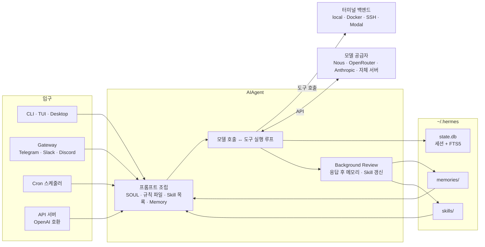
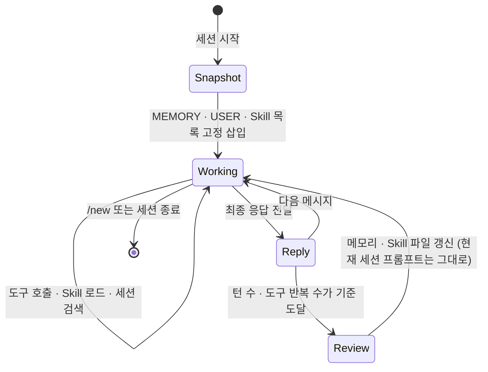
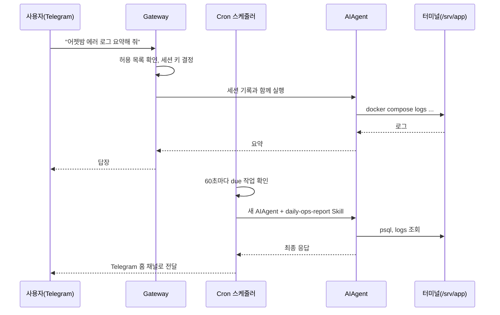
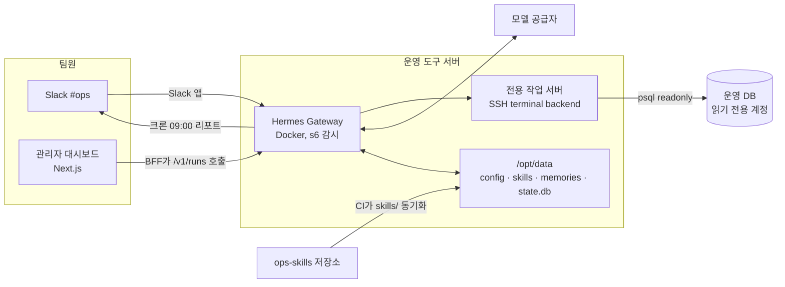
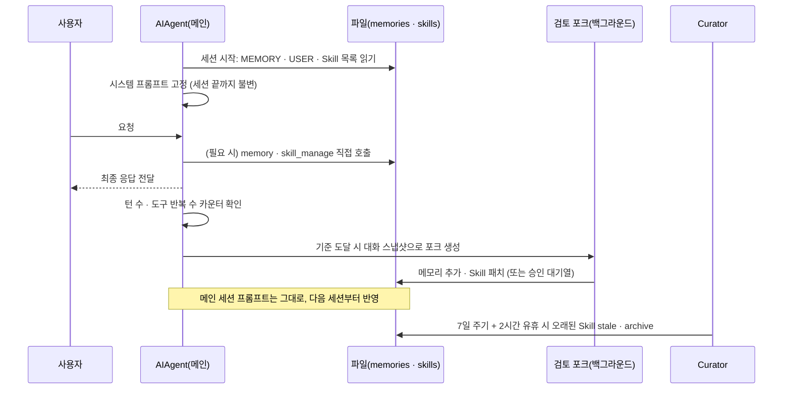

## 개요

> 터미널, 메신저, 예약 작업, HTTP API 어디서 부르든 같은 에이전트 하나가 응답하고, 일하면서 알게 된 사실은 메모리로, 알아낸 작업 절차는 Skill로 스스로 남겨 다음 세션에 다시 쓰는 Nous Research의 오픈소스 상주형 AI 에이전트입니다.

## 30초 요약

| 항목 | 내용 |
|---|---|
| 무엇인가? | 모델 공급자를 가리지 않는 Python 기반 상주형 AI 에이전트. CLI·TUI·데스크톱 앱·메신저 게이트웨이·크론·HTTP API가 모두 같은 에이전트 코어(`AIAgent`)를 공유 |
| 왜 사용하는가? | 에이전트를 노트북 터미널 한 세션에 묶어 두지 않고, 어디서든 부를 수 있는 "계속 살아 있는 나만의 에이전트"로 쓰기 위해 |
| 해결하는 문제 | 세션이 끝나면 알게 된 것이 사라지는 문제, 에이전트가 특정 기기·특정 화면에 묶이는 문제, 반복 작업을 매번 손으로 시켜야 하는 문제 |
| 주요 사용처 | 터미널 코딩 작업, Telegram·Slack 개인 비서, 정기 리포트·모니터링, 사내 도구의 에이전트 백엔드 |
| 핵심 개념 | AIAgent 루프, Tool·Toolset, Skill, Memory(`MEMORY.md`/`USER.md`), Session Search, Gateway, Cron, Profile, 학습 루프 |
| Client 사용 | O (CLI·TUI·데스크톱 앱, 메신저에서 대화) |
| Server 사용 | O (게이트웨이 프로세스, OpenAI 호환 API 서버, Docker 이미지) |
| 대표 대안 | Claude Code·Codex CLI 같은 코딩 하네스, OpenClaw 같은 메신저형 개인 에이전트, LangGraph 등 에이전트 프레임워크로 직접 구축 |

- **학습 루프가 내장되어 있다**: 대화가 끝난 뒤 백그라운드에서 "기억할 사실이 있는가, Skill로 남길 절차가 있는가"를 스스로 검토해 저장합니다.
- **한 에이전트, 여러 입구**: 터미널, Telegram, Slack, Discord, 이메일, 크론, HTTP API가 같은 설정·메모리·Skill을 공유합니다.
- **모델에 묶이지 않는다**: Nous Portal, OpenRouter, Anthropic, OpenAI, 자체 엔드포인트 등을 `hermes model` 한 번으로 바꿉니다.
- **어디서든 돌아간다**: 로컬, Docker, SSH, Modal, Daytona 같은 7가지 터미널 백엔드에서 명령을 실행하고, 저렴한 VPS에 상주시킬 수 있습니다.
- **안전 장치가 여러 겹이다**: 위험 명령 승인, 절대 실행하지 않는 명령 목록, 메신저 사용자 허용 목록과 DM 페어링, 컨테이너 격리를 기본으로 둡니다.

---

## 어떤 라이브러리인가?

ChatGPT 같은 대화형 AI를 쓰다 보면 이런 아쉬움이 생깁니다.

- "어제 알려 준 서버 주소를 오늘 또 설명해야 하네."
- "노트북을 덮으면 하던 작업도 멈추네."
- "매일 아침 같은 리포트를 뽑아 달라고 매번 말해야 하네."
- "밖에서 휴대폰으로 '스테이징 배포 상태 봐 줘'라고 말하고 싶은데."

Hermes Agent는 이런 요구를 위해 **서버나 PC에 상주하면서, 여러 입구에서 같은 에이전트로 응답하고, 경험을 스스로 축적하는 에이전트**입니다. 비유하면 매번 새로 오는 단기 아르바이트생이 아니라, 일하면서 업무 노트를 쓰고 자기만의 업무 매뉴얼을 만들어 가는 개인 비서입니다.

기술적으로 정의하면, Hermes Agent는 **도구 호출 루프(agent loop)를 가진 Python 애플리케이션**입니다. 하나의 `AIAgent` 클래스가 시스템 프롬프트 조립, 모델 호출, 도구 실행, 컨텍스트 압축, 세션 저장을 담당하고, CLI·게이트웨이·크론·API 서버는 이 코어를 서로 다른 방식으로 부르는 입구일 뿐입니다. 여기에 메모리 파일, Skill 라이브러리, SQLite 기반 세션 검색, 대화 후 자동 검토(background review)를 붙여 **"닫힌 학습 루프"**를 만든 것이 가장 큰 특징입니다.

Nous Research가 MIT 라이선스로 공개했고, 2025년 7월 저장소가 만들어진 뒤 빠르게 성장해 2026년 10월 기준 GitHub Star 약 25만 개, Fork 약 5.4만 개를 기록하고 있습니다.

애플리케이션 코드에 import하는 일반 라이브러리와는 성격이 다릅니다. 기본적으로는 **설치해서 실행하는 에이전트 제품**이고, 필요하면 HTTP API나 Python 클래스로 다른 프로그램에 붙여 쓰는 구조입니다.

### 주요 사용 사례

- **터미널 코딩 에이전트**: 저장소에서 `hermes`를 실행해 버그 수정, 리팩터링, PR 준비를 맡깁니다. `AGENTS.md`·`CLAUDE.md` 같은 프로젝트 규칙 파일도 읽습니다.
- **메신저 개인 비서**: 게이트웨이를 띄워 Telegram·Slack·Discord에서 같은 에이전트와 대화합니다. 음성 메모도 받아 적습니다.
- **예약 자동화**: "매일 아침 9시에 PR 현황을 정리해 Slack으로 보내 줘"처럼 자연어로 크론 작업을 등록합니다.
- **사내 도구의 에이전트 백엔드**: OpenAI 호환 API 서버를 켜서 Open WebUI나 직접 만든 대시보드가 Hermes를 백엔드로 쓰게 합니다.
- **연구용 데이터 생성**: 에이전트 실행 궤적(trajectory)을 대량으로 생성·압축해 도구 호출 모델 학습 데이터로 씁니다.

주요 용어는 [핵심 개념과 동작 구조](#h-hermes-agent-핵심-개념과-동작-구조)에서 자세히 다룹니다.

---

## 어떤 문제를 해결하는가?

```text
요구사항: 내 환경을 아는 AI 에이전트를 언제 어디서든 부르고, 반복 작업은 알아서 돌게 하고 싶다
 ↓
일반적인 구현: 노트북에서 코딩 에이전트를 띄우고, 크론 스크립트와 슬랙 봇은 따로 만든다
 ↓
문제 발생: 세션이 끝나면 맥락이 사라지고, 봇·스크립트·에이전트가 서로 다른 지식을 갖고 따로 논다
 ↓
Hermes로 해결: 하나의 상주 에이전트에 메모리·Skill·세션 검색을 붙이고, 터미널·메신저·크론·API를 모두 그 에이전트의 입구로 만든다
```

### 상황 예시

혼자 사이드 프로젝트로 작은 SaaS를 운영하는 개발자가 있습니다. 서버는 VPS 한 대, 코드는 GitHub, 장애 알림은 Telegram으로 받고 싶습니다. 원하는 것은 다음과 같습니다.

- 집에서는 터미널에서 코딩을 맡기고 싶다.
- 출근길에는 휴대폰으로 "어젯밤 에러 로그 요약해 줘"라고 묻고 싶다.
- 매일 아침 가입자 수와 결제 실패 건수를 자동으로 받고 싶다.
- "우리 DB는 PostgreSQL 16이고 마이그레이션은 이 명령으로 한다" 같은 사실을 한 번만 알려 주고 싶다.

### 일반적인 구현 방식

```text
노트북:   코딩 에이전트 CLI (세션마다 프로젝트 설명 반복)
VPS:      cron + bash 스크립트 → curl 로 Telegram Bot API 호출
Telegram: 직접 만든 봇 (python-telegram-bot + OpenAI API, 도구 없음)
문서:     README에 "에이전트에게 알려 줄 것" 목록을 따로 관리
```

```python
# daily_report.py — 크론이 매일 실행하는 스크립트
import os, psycopg, requests

with psycopg.connect(os.environ["DATABASE_URL"]) as conn:
    signups = conn.execute("select count(*) from users where created_at > now() - interval '1 day'").fetchone()[0]
    failed = conn.execute("select count(*) from payments where status = 'failed' and created_at > now() - interval '1 day'").fetchone()[0]

text = f"신규 가입 {signups}명, 결제 실패 {failed}건"
requests.post(
    f"https://api.telegram.org/bot{os.environ['TG_TOKEN']}/sendMessage",
    json={"chat_id": os.environ["TG_CHAT_ID"], "text": text},
)
```

### 이 방식에서 발생하는 문제

- **지식이 흩어짐**: 코딩 에이전트, 텔레그램 봇, 크론 스크립트가 각자 다른 맥락을 갖습니다. 텔레그램 봇은 코딩 에이전트가 어제 알아낸 사실을 모릅니다.
- **판단이 필요한 작업은 스크립트로 못 함**: "결제 실패가 평소보다 많으면 원인 후보까지 찾아 줘" 같은 요구는 고정 스크립트로 표현하기 어렵습니다.
- **봇마다 인증·권한·로그를 따로 구현**: 누가 봇에 명령할 수 있는지, 위험한 명령을 어떻게 막는지 매번 직접 만들어야 합니다.
- **기억이 남지 않음**: 세션을 닫으면 "마이그레이션은 이 명령으로 한다" 같은 사실을 다음에 또 설명해야 합니다.

### Hermes Agent를 사용하면

같은 요구가 하나의 에이전트로 모입니다. 설치와 실행 방법은 [설치와 첫 사용](#h-hermes-agent-설치와-첫-사용)에서 다룹니다.

- 터미널의 `hermes`, Telegram 봇, 크론 작업이 모두 같은 `~/.hermes/` 설정·메모리·Skill을 씁니다.
- "DB는 PostgreSQL 16" 같은 사실은 에이전트가 `MEMORY.md`에 적어 두고, 다음 세션부터 시스템 프롬프트에 자동으로 들어갑니다.
- 아침 리포트는 `hermes cron create "every 1d at 09:00" "..." --deliver telegram`으로 등록하면 에이전트가 직접 DB를 조회하고 판단까지 해서 보냅니다.
- 누가 봇에게 말할 수 있는지는 허용 목록과 DM 페어링으로, 위험한 명령은 승인 절차로 처리됩니다.

> **핵심:** 에이전트·봇·스크립트를 따로 만들고 각자에게 맥락을 반복 설명하는 대신, Hermes Agent가 **하나의 상주 에이전트와 공유 메모리·Skill, 그리고 여러 입구(터미널·메신저·크론·API)**로 묶어서 처리해줍니다.

---

## 왜 주목받고 있는가?

**"세션형"에서 "상주형" 에이전트로 관심이 옮겨 가고 있습니다.** 코딩 에이전트가 터미널에서 충분히 쓸 만해지자, 다음 요구는 "노트북을 덮어도 계속 일하고, 밖에서도 부를 수 있는 에이전트"가 되었습니다. Hermes는 처음부터 게이트웨이와 크론을 1급 기능으로 넣어 이 흐름에 맞췄습니다.

**학습 루프를 제품 기능으로 만들었습니다.** 많은 에이전트가 메모리 기능을 "선택 플러그인"으로 두는 반면, Hermes는 메모리 쓰기, Skill 생성·수정, 과거 세션 검색, 대화 후 자동 검토, 오래된 Skill 정리(Curator)를 하나의 루프로 묶어 기본값으로 켭니다. 내부 동작은 [학습 루프 깊이 보기](#h-hermes-agent-학습-루프-깊이-보기)에서 다룹니다.

**모델 선택의 자유가 큽니다.** 수십 개 공급자와 자체 엔드포인트(vLLM, Ollama, llama.cpp 서버)를 지원하고, 세션 도중 `/model`로 바꿀 수 있습니다. 특정 모델 회사의 구독에 묶이고 싶지 않은 사용자에게 매력적입니다.

**개발 속도가 매우 빠릅니다.** 2026년 9월 한 달에만 0.21.1~0.21.5 패치가 나왔고, 패치 한 번에 병합 PR이 수백~1,800개에 이릅니다. 데스크톱 앱, Bot Mode, 플러그인 카탈로그처럼 범위도 계속 넓어지고 있습니다. 이 속도는 장점이자 [주의할 점](#h-hermes-agent-주의할-점과-faq)이기도 합니다.

**생태계 표준을 따릅니다.** Skill은 agentskills.io 공개 규격과 호환되고, MCP 서버를 붙일 수 있으며, 프로젝트 규칙으로 `AGENTS.md`·`CLAUDE.md`·`.cursorrules`도 읽습니다. 다른 도구에서 쓰던 자산을 그대로 가져오기 쉽습니다.

일반적인 방식과의 항목별 차이는 [장단점과 대안 비교](#h-hermes-agent-장단점과-대안-비교)에 정리했습니다.

---

## 언제 사용하면 좋은가?

- **에이전트를 "도구"가 아니라 "상주하는 비서"로 쓰고 싶은 경우**: 서버에 띄워 두고 터미널·메신저·크론에서 같은 에이전트를 부르는 구조가 Hermes의 기본 설계입니다.
- **반복되는 판단형 작업이 있는 경우**: "매일 로그를 보고 이상하면 원인 후보까지 알려 줘"처럼 스크립트로는 표현하기 어려운 정기 작업에 적합합니다.
- **모델 공급자를 자유롭게 바꾸고 싶은 경우**: 비싼 모델과 저렴한 모델, 로컬 모델을 작업별로 나눠 쓰기 쉽습니다.
- **같은 일을 여러 번 시키는 경우**: 대화 중 알아낸 절차가 Skill로 쌓이므로, 비슷한 작업을 반복할수록 설명이 줄어듭니다.
- **사내 웹 UI에 에이전트 백엔드가 필요한 경우**: OpenAI 호환 API를 그대로 제공하므로 Open WebUI 같은 기존 프런트엔드를 바로 붙일 수 있습니다.

---

## 언제 사용하지 않는 것이 좋은가?

- **애플리케이션 안에 에이전트 로직을 직접 짜야 하는 경우**: Hermes는 완성된 에이전트 제품입니다. 상태 그래프를 세밀하게 설계하거나 자체 서비스의 비즈니스 흐름에 맞춘 에이전트를 만들려면 에이전트 프레임워크가 더 맞습니다.
  > 예: 고객 문의를 분류해 환불 API를 호출하는 상담 봇을 자사 백엔드 안에 넣는다면, Hermes를 통째로 띄우기보다 SDK로 필요한 단계만 구현하는 편이 단순합니다.
- **코딩만 하고, 이미 쓰는 코딩 에이전트에 만족하는 경우**: 터미널 코딩만 필요하다면 게이트웨이·크론·메모리 같은 나머지 기능은 관리 부담만 됩니다.
- **버전 고정과 변경 통제가 엄격한 환경**: 소스 설치는 `main`을 따라가고 릴리스 속도가 매우 빠릅니다. 안정 태그 Docker 이미지로 고정할 수는 있지만, 사내 보안 검토 주기가 길다면 따라가기 어렵습니다.
- **컨텍스트 64K 미만의 작은 로컬 모델만 쓸 수 있는 경우**: Hermes는 64,000 토큰 미만 모델을 시작 단계에서 거부합니다. 도구 호출이 약한 작은 모델은 메모리 저장을 "했다고 말만 하는" 경우도 많습니다.
- **에이전트에게 셸 권한을 주는 것 자체가 허용되지 않는 환경**: 승인 절차와 컨테이너 격리가 있어도, 메신저에서 명령을 받아 서버 셸을 다루는 구조는 조직 정책과 충돌할 수 있습니다.

---

## 한눈에 정리

| 항목 | 내용 |
|---|---|
| 라이브러리 | Hermes Agent (`NousResearch/hermes-agent`, MIT) |
| 주요 목적 | 어디서든 부를 수 있고 경험을 스스로 축적하는 상주형 AI 에이전트 |
| 해결하는 문제 | 세션 간 기억 손실, 기기·화면 종속, 반복 작업의 수동 지시, 봇·스크립트·에이전트의 지식 분산 |
| 핵심 개념 | AIAgent 루프, Tool·Toolset, Skill, Memory, Session Search, Gateway, Cron, Profile, Background Review |
| 주요 사용처 | 터미널 코딩, 메신저 비서, 예약 자동화, 사내 도구 에이전트 백엔드 |
| Client 활용 | CLI·TUI·데스크톱 앱, Telegram·Slack 등 메신저 대화, 음성 메모 |
| Server 활용 | 상주 게이트웨이, 크론 스케줄러, OpenAI 호환 API·Runs API, Docker 배포, 프로필별 격리 |
| 장점 | 내장 학습 루프, 다중 입구, 모델 자유, 다양한 실행 백엔드, 여러 겹의 안전 장치 |
| 단점 | 매우 빠른 변경 속도, 큰 설정 표면, 자동 학습의 품질 편차, 셸 권한에 따른 보안 부담 |
| 추천 상황 | 개인·소규모 팀의 상주 에이전트, 판단형 정기 작업, 모델을 자유롭게 바꾸고 싶은 경우 |
| 비추천 상황 | 앱 내부 에이전트 로직 구현, 코딩만 필요한 경우, 엄격한 버전 통제 환경, 작은 로컬 모델 |
| 대표 대안 | Claude Code·Codex CLI, OpenClaw, LangGraph 등 에이전트 프레임워크 |

---

## 핵심 정리

### 한 문장으로

> Hermes Agent는 세션이 끝나면 사라지고 한 화면에 묶여 있던 AI 에이전트를 **상주 프로세스 + 공유 메모리·Skill + 여러 입구(터미널·메신저·크론·API)**로 바꿔서, 어디서 불러도 같은 에이전트가 경험을 쌓으며 일하게 만드는 오픈소스 에이전트입니다.

### 이것만 기억하기

1. **왜 사용하는가?**
   - 에이전트를 노트북 한 세션에 가두지 않고, 서버에 상주시켜 어디서든 부르고 반복 작업을 맡기기 위해서입니다.

2. **어떤 문제를 해결하는가?**
   - 세션 간 기억 손실, 기기 종속, 반복 지시, 그리고 봇·스크립트·에이전트가 서로 다른 지식을 갖는 문제입니다.

3. **어떻게 동작하는가?**
   - 모든 입구가 같은 `AIAgent` 루프를 쓰고, 세션 시작 시 메모리와 Skill 목록을 시스템 프롬프트에 넣습니다. 대화가 끝나면 백그라운드 검토가 메모리와 Skill을 갱신하고, 과거 대화는 SQLite FTS5로 검색합니다.

4. **실제 프로젝트에서는 어디에 사용하는가?**
   - 터미널 코딩, Telegram·Slack 운영 비서, 매일 아침 리포트와 모니터링, 사내 웹 UI의 에이전트 백엔드에 씁니다.

5. **언제 사용하지 않는가?**
   - 자체 서비스 안에 에이전트 로직을 직접 짜야 할 때, 코딩만 필요할 때, 버전 통제가 엄격할 때, 64K 미만의 작은 모델만 쓸 수 있을 때입니다.

6. **비슷한 기술과 가장 큰 차이는 무엇인가?**
   - 코딩 하네스는 "한 세션을 잘 수행하는 것"에, 에이전트 프레임워크는 "에이전트를 만드는 재료"에 집중합니다. Hermes는 **완성된 에이전트가 계속 살아 있으면서 스스로 배우는 것**에 집중합니다. 그만큼 자동으로 쌓이는 메모리와 Skill을 사람이 주기적으로 살펴보는 습관이 중요합니다.

## Hermes Agent 핵심 개념과 동작 구조

> Hermes Agent를 이루는 AIAgent 루프, Tool·Toolset, Skill, Memory·Session Search, Gateway·Cron, Profile이 각각 무엇이고 어떻게 맞물려 동작하는지 다룹니다.

### 용어 한눈에 보기

| 키워드 | 설명 |
|---|---|
| AIAgent | 프롬프트 조립 → 모델 호출 → 도구 실행 → 반복을 담당하는 에이전트 코어 클래스. 모든 입구가 공유 |
| Tool / Toolset | 에이전트가 호출하는 기능(터미널, 파일, 웹, 브라우저 등)과 그 묶음. 입구별로 켜고 끔 |
| Terminal Backend | 셸 명령이 실제로 실행되는 곳. local, Docker, SSH, Modal, Daytona 등 7종 |
| Skill | 필요할 때만 로드되는 작업 절차 문서(`SKILL.md`). 에이전트가 직접 만들고 고침 |
| Memory | `MEMORY.md`(환경 사실)와 `USER.md`(사용자 프로필). 세션 시작 시 시스템 프롬프트에 고정 삽입 |
| Session Search | 모든 과거 대화를 저장한 SQLite(FTS5)에서 필요한 대화를 찾아보는 도구 |
| Gateway | Telegram·Slack·Discord 등 메신저와 API 서버를 한 프로세스로 처리하는 상주 프로세스 |
| Cron | 게이트웨이가 60초마다 확인하는 예약 작업. 셸 스크립트가 아니라 "에이전트 작업" |
| Profile | 설정·키·메모리·세션·Skill이 완전히 분리된 독립 에이전트 홈 디렉터리 |
| Background Review | 응답이 끝난 뒤 대화를 다시 읽고 메모리·Skill을 갱신하는 별도 에이전트 포크 |

---

### 1. AIAgent (에이전트 루프)

#### 쉽게 설명하면

비서 한 명이 일하는 방식과 같습니다. 요청을 받으면 생각하고, 필요하면 전화를 걸거나 서류를 찾아보고(도구 사용), 그 결과를 보고 다시 생각한 뒤, 일이 끝나면 답을 줍니다. 이 반복을 하는 비서 한 명이 `AIAgent`입니다.

#### 개발 관점에서는

`AIAgent`는 하나의 대화 턴을 다음 순서로 처리하는 **동기식 오케스트레이션 루프**입니다.

1. 시스템 프롬프트를 조립하거나 캐시된 것을 재사용합니다.
2. 컨텍스트가 모델 한도의 50%를 넘으면 먼저 압축합니다.
3. 공급자에 맞는 형식(Chat Completions, Codex Responses, Anthropic Messages 중 하나)으로 모델을 호출합니다.
4. 응답에 도구 호출이 있으면 실행하고 결과를 붙여 3으로 돌아갑니다. 여러 도구 호출은 스레드 풀로 병렬 실행합니다.
5. 텍스트 응답이 나오면 세션을 SQLite에 저장하고 반환합니다.

중요한 점은 **CLI, 메신저 게이트웨이, 크론, API 서버, IDE 연동(ACP)이 모두 같은 `AIAgent`를 쓴다**는 것입니다. 입구마다 다른 것은 "어떻게 입력을 받고 결과를 돌려주는가"뿐입니다. 그래서 터미널에서 만든 Skill이 Telegram 대화에서도 그대로 쓰입니다.

또한 한 턴의 반복 횟수 상한(`agent.max_turns`, 기본 500), 주 모델이 429·5xx로 실패할 때 넘어갈 `fallback_providers`, 사용자가 새 메시지를 보내면 진행 중인 모델 호출을 버리는 인터럽트 처리도 이 루프가 담당합니다.

#### 예제

Python 코드에서 직접 부를 수도 있습니다. Hermes가 설치된 Python 환경(소스 체크아웃)에서 실행해야 합니다.

```python
from run_agent import AIAgent

agent = AIAgent(model="anthropic/claude-opus-4.7")

# 간단한 형태: 최종 응답 문자열만 받기
print(agent.chat("이 디렉터리의 main 진입점이 어디인지 알려 줘"))

# 전체 형태: 메시지 목록, 사용량 등 메타데이터까지 받기
result = agent.run_conversation(user_message="pytest를 실행하고 실패한 테스트만 요약해 줘")
print(result["final_response"])
```

#### 핵심

> 입구가 몇 개든 에이전트는 하나입니다. Hermes를 이해하는 출발점은 "모든 기능이 같은 `AIAgent` 루프 위에 있다"는 사실입니다.

### 2. Tool과 Toolset, 터미널 백엔드

#### 쉽게 설명하면

비서에게 주는 업무 권한 목록입니다. 사내 메신저 담당 비서에게는 일정 조회 권한만 주고, 개발 보조 비서에게는 서버 접속 권한까지 주는 식으로, 입구마다 쓸 수 있는 도구를 다르게 정할 수 있습니다.

#### 개발 관점에서는

도구는 `tools/` 아래 파일마다 하나씩 있고, import될 때 중앙 레지스트리에 스스로 등록됩니다. 2026년 10월 기준 공식 문서는 70개 이상의 도구와 약 28개 Toolset을 안내합니다. Toolset은 도구 묶음(`terminal`, `file`, `web`, `browser`, `skills`, `memory`, `cron` 등)이고, `hermes tools`로 **입구(플랫폼)별로** 켜고 끕니다.

셸 명령이 실제로 실행되는 위치는 터미널 백엔드로 고릅니다.

| 백엔드 | 실행 위치 | 위험 명령 승인 |
|---|---|---|
| `local` | Hermes가 돌아가는 호스트 | 적용 |
| `ssh` | 별도 원격 서버 | 적용 |
| `docker` | 지속되는 샌드박스 컨테이너 | 생략(컨테이너가 경계) |
| `modal`, `daytona`, `vercel_sandbox` | 클라우드 샌드박스 | 생략 |
| `singularity` | HPC 컨테이너 | 생략 |

#### 예제

```bash
hermes tools                                  # 플랫폼별 Toolset 켜기/끄기 (대화형)
hermes config set terminal.backend docker     # 셸 명령을 Docker 샌드박스에서 실행
hermes chat -t terminal,file -q "로그 디렉터리 용량을 확인해 줘"   # 이번 실행에만 Toolset 지정
```

#### 핵심

> 도구가 많을수록 도구 스키마가 매 호출마다 프롬프트를 차지합니다. 입구별로 꼭 필요한 Toolset만 켜는 것이 비용과 안전 모두에 유리합니다.

### 3. Skill (절차 기억)

#### 쉽게 설명하면

비서가 직접 쓰는 업무 매뉴얼입니다. "스테이징 배포는 이 순서로, 이 명령으로, 이 함정을 피해서"를 한 번 알아내면 매뉴얼로 남기고, 다음에 같은 일이 오면 그 매뉴얼을 펼쳐 봅니다.

#### 개발 관점에서는

Skill은 `~/.hermes/skills/<카테고리>/<이름>/SKILL.md` 형태의 문서입니다. agentskills.io 공개 규격과 호환되고, **점진적 공개(progressive disclosure)** 방식으로 로드됩니다.

- 평소에는 이름·설명·카테고리로 된 **Skill 목록**만 시스템 프롬프트에 들어갑니다.
- 작업이 어떤 Skill과 맞으면 에이전트가 `skill_view(name)`으로 본문을 엽니다.
- 본문이 참조하는 `references/`, `templates/`, `scripts/` 파일은 필요할 때 따로 엽니다.

Hermes의 Skill이 다른 도구와 가장 다른 점은 **에이전트가 `skill_manage` 도구로 Skill을 직접 만들고(create), 고치고(patch), 지운다**는 것입니다. 사람도 `/learn` 명령으로 문서·디렉터리·방금 한 작업을 Skill로 만들게 할 수 있고, Skills Hub에서 보안 검사를 거쳐 설치할 수도 있습니다. 설치된 Skill은 모두 `/skill-name` 슬래시 명령이 됩니다.

#### 예제

```markdown
---
name: staging-deploy
description: 스테이징 서버 배포와 롤백 절차
version: 1.0.0
metadata:
  hermes:
    tags: [deploy, docker]
    category: devops
---

# Staging Deploy

## When to Use
스테이징에 새 이미지를 배포하거나 직전 버전으로 되돌릴 때.

## Procedure
1. `docker compose -f deploy/staging.yml pull api`
2. `docker compose -f deploy/staging.yml up -d api`
3. `curl -fsS https://staging.example.com/health` 로 200 확인

## Pitfalls
- 마이그레이션이 포함된 릴리스는 2단계 전에 `make migrate ENV=staging` 을 먼저 실행한다 — 새 코드가 없는 컬럼을 읽으면 바로 500이 난다.

## Verification
헬스 체크 200, 그리고 최근 5분 에러 로그 0건.
```

#### 핵심

> Skill은 "평소에는 목록만, 필요할 때 본문"입니다. 그리고 Hermes에서는 사람이 쓰는 문서이기 전에 **에이전트가 경험에서 스스로 쓰는 절차 기억**입니다.

### 4. Memory와 Session Search (사실 기억과 대화 기록)

#### 쉽게 설명하면

Memory는 비서 책상 위에 붙여 둔 포스트잇 몇 장이고, Session Search는 지난 업무 일지 전체를 검색하는 것입니다. 포스트잇은 항상 눈에 보이지만 몇 장 못 붙이고, 업무 일지는 다 남아 있지만 찾아봐야 보입니다.

#### 개발 관점에서는

| 구분 | Memory | Session Search |
|---|---|---|
| 저장 위치 | `~/.hermes/memories/MEMORY.md`, `USER.md` | `~/.hermes/state.db` (SQLite + FTS5) |
| 용량 | `MEMORY.md` 2,200자, `USER.md` 1,375자 | 모든 세션 |
| 컨텍스트 진입 | 세션 시작 시 시스템 프롬프트에 고정 삽입 | 에이전트가 `session_search`를 호출할 때만 |
| 비용 | 매 호출 약 1,300토큰 고정 | 검색할 때만, LLM 호출 없음 |
| 관리 | 에이전트가 `memory` 도구로 add/replace/remove | 자동 저장 |

Memory에는 두 가지 중요한 성질이 있습니다.

- **고정 스냅샷**: 세션 도중 메모리를 고쳐도 파일에는 바로 저장되지만, 시스템 프롬프트에는 **다음 세션부터** 반영됩니다. 프롬프트 캐시를 깨지 않기 위한 설계입니다.
- **자동 압축 없음**: 용량을 넘기면 오류가 나고, 에이전트가 같은 턴 안에서 항목을 합치거나 지운 뒤 다시 저장해야 합니다.

#### 예제

```text
# 에이전트가 내부적으로 호출하는 형태 (사용자가 직접 쓰지는 않음)
memory(action="add", target="memory",
       content="api 저장소는 PostgreSQL 16, 마이그레이션은 `make migrate` 로 실행")
memory(action="replace", target="user", old_text="간결",
       content="사용자는 짧은 답과 명령어 위주 설명을 선호")
```

```bash
cat ~/.hermes/memories/MEMORY.md   # 실제로 저장됐는지 확인
hermes sessions list               # 저장된 과거 세션 보기
```

#### 핵심

> 모든 세션에 필요한 짧은 사실은 Memory, 특정 작업의 긴 절차는 Skill, "지난주에 뭐라고 했더라"는 Session Search입니다.

### 5. Gateway와 Cron (상주와 예약)

#### 쉽게 설명하면

Gateway는 비서의 전화·메신저 수신 창구이고, Cron은 비서의 업무 달력입니다. 창구가 열려 있어야 밖에서 연락할 수 있고, 달력에 적힌 일은 시간이 되면 비서가 알아서 합니다.

#### 개발 관점에서는

`hermes gateway`는 오래 실행되는 프로세스로, 25개 이상의 플랫폼 어댑터(Telegram, Discord, Slack, WhatsApp, Signal, 이메일, Teams 등)와 OpenAI 호환 API 서버를 함께 띄웁니다. 메시지가 오면 사용자를 인가하고, 세션 키를 정하고, 그 세션 기록으로 `AIAgent`를 만들어 실행한 뒤 같은 채널로 답을 보냅니다.

Cron 스케줄러도 게이트웨이 안에서 60초마다 돕니다. 실행 시점이 된 작업마다 **기록이 없는 새 AIAgent**를 만들고, 붙어 있는 Skill을 로드한 뒤 프롬프트를 실행하고, 최종 응답을 지정한 채널로 보냅니다. 따라서 **게이트웨이가 꺼져 있으면 크론도 돌지 않습니다.**

#### 예제

```bash
hermes gateway setup                 # 메신저 플랫폼 연결 (대화형)
hermes gateway install && hermes gateway start   # 백그라운드 서비스로 등록·시작
hermes cron create "every 1d at 09:00" "어제 에러 로그를 요약해 줘" --deliver telegram
hermes cron list
```

#### 핵심

> Hermes를 "상주형"으로 만드는 것은 게이트웨이입니다. 메신저도 크론도 API 서버도 게이트웨이 프로세스가 살아 있어야 동작합니다.

### 6. Profile (에이전트 단위 격리)

#### 쉽게 설명하면

한 사무실에 비서를 여러 명 두되, 책상·서류함·업무 노트를 완전히 따로 쓰게 하는 것입니다.

#### 개발 관점에서는

Profile은 독립된 Hermes 홈 디렉터리(`~/.hermes/profiles/<이름>/`)입니다. 각자 `config.yaml`, `.env`, `SOUL.md`, 메모리, 세션 DB, Skill, 크론 작업, 게이트웨이 상태를 따로 가집니다. 만들면 이름이 곧 명령이 됩니다(`coder chat`, `coder gateway start`).

공식 문서는 **두 에이전트 프로세스가 같은 홈을 공유하지 말라**고 강하게 경고합니다. 메모리 쓰기가 자동이라 서로의 기록이 섞여, 누구도 의도하지 않은 상태가 다음 세션 프롬프트에 들어가기 때문입니다.

#### 예제

```bash
hermes profile create coder      # 코딩 전용 에이전트
hermes profile create ops        # 운영 알림 전용 에이전트
coder setup
ops gateway start
```

#### 핵심

> 용도가 다른 에이전트는 Profile로 나눕니다. "같은 에이전트를 두 군데서 동시에 띄우기"는 Profile이 막으려는 바로 그 상황입니다.

---

### 7. 전체 동작 구조

Hermes는 애플리케이션에 import하는 라이브러리라기보다, **여러 입구가 하나의 에이전트 코어와 로컬 상태 저장소를 공유하는 상주 애플리케이션**입니다.



한 번의 요청이 처리되는 순서는 다음과 같습니다.

1. **시작점**: 사용자가 터미널에 입력하거나, Telegram 메시지를 보내거나, 크론 시각이 되거나, HTTP 요청이 들어옵니다. 게이트웨이 입구라면 먼저 허용 목록·DM 페어링으로 사용자를 인가합니다.
2. **프롬프트 조립**: 세션이 새로 시작되면 `SOUL.md`(정체성), 프로젝트 규칙 파일(`.hermes.md` → `AGENTS.md` → `CLAUDE.md` → `.cursorrules` 중 처음 찾은 것), Skill 목록, `MEMORY.md`·`USER.md` 스냅샷을 순서대로 묶어 시스템 프롬프트를 만듭니다. 이 프롬프트는 세션 동안 바뀌지 않습니다.
3. **내부 처리**: 모델이 도구 호출을 요청하면 위험 명령 검사와 승인 절차를 거쳐 터미널 백엔드에서 실행하고, 결과를 다시 모델에게 줍니다. 작업이 Skill과 맞으면 `skill_view`로 본문을 불러오고, 과거 맥락이 필요하면 `session_search`를 씁니다.
4. **외부 시스템 연결**: 모델 호출은 설정한 공급자로, 명령 실행은 설정한 백엔드로, 필요하면 MCP 서버와 웹·브라우저 도구로 나갑니다. 주 모델이 실패하면 대체 공급자로 넘어갑니다.
5. **결과 반환과 학습**: 최종 응답은 입구에 맞게 전달되고(터미널 출력, 메신저 답장, 크론 전달, HTTP 응답), 대화는 `state.db`에 저장됩니다. 조건이 맞으면 응답이 나간 **뒤에** Background Review가 별도 스레드에서 대화를 다시 읽고 메모리와 Skill을 갱신합니다.

학습 루프 관점에서 세션을 상태 흐름으로 보면 다음과 같습니다.



세부 동작과 실제 소스 코드는 [학습 루프 깊이 보기](#h-hermes-agent-학습-루프-깊이-보기)에서 다룹니다.

## Hermes Agent 설치와 첫 사용

> 설치 방법을 고르는 기준, 공급자·모델 설정, 설정 파일 구조, 가장 간단한 첫 실행, 설치할 때 자주 겪는 문제를 다룹니다.

### 설치

설치 방법은 "어디서, 어떤 화면으로 쓸 것인가"로 고릅니다.

| 상황 | 설치 방법 | 업데이트 방법 |
|---|---|---|
| macOS(Apple Silicon)·Windows에서 앱으로 쓰고 싶다 | 공식 사이트의 Hermes Desktop 설치 파일 | 앱의 업데이트 기능 |
| 터미널만 쓰거나 Linux·WSL2 서버에 둔다 | 소스 설치 스크립트 (아래) | `hermes update` |
| 서버에 상주 게이트웨이로 띄운다 | Docker 이미지 `nousresearch/hermes-agent` | 이미지 pull 후 컨테이너 재생성 |
| Android 휴대폰(aarch64) | Termux용 서명된 APT 저장소 | `pkg upgrade hermes-agent` |

**Linux / macOS / WSL2 (터미널 전용 설치)**

```bash
curl -fsSL https://hermes-agent.nousresearch.com/install.sh | bash
source ~/.bashrc   # zsh라면 source ~/.zshrc
```

**Windows (네이티브, PowerShell)**

```powershell
iex (irm https://hermes-agent.nousresearch.com/install.ps1)
```

설치 스크립트는 소스를 `~/.hermes/hermes-agent/`에 내려받고, 고정된 버전의 `uv`를 받은 뒤, Hermes 자체 패키지 관리자(PM)에게 Python 3.14, Node.js, ripgrep, FFmpeg, 브라우저 자동화 도구 설치를 맡깁니다. 시스템에 이미 있는 Python·Node 버전을 그대로 쓰지 않는다는 점이 특징입니다. 브라우저 도구가 필요 없으면 `--skip-browser`로 뺄 수 있고, 이 선택은 이후 업데이트에서도 유지됩니다.

| 설치 방식 | 코드 위치 | 사용자 데이터 |
|---|---|---|
| POSIX 소스 스크립트 | `~/.hermes/hermes-agent/` | `~/.hermes/` |
| Windows 소스 스크립트 | `%LOCALAPPDATA%\hermes\hermes-agent\` | `%LOCALAPPDATA%\hermes\` |
| Docker | `/opt/hermes/` | 마운트한 `/opt/data/` |

`HERMES_HOME` 환경 변수로 사용자 데이터 위치를 바꿀 수 있습니다.

---

### 기본 설정

#### 1. 공급자와 모델 고르기

가장 중요한 설정 단계입니다.

```bash
hermes setup          # 전체 마법사 (처음이라면 이것부터)
hermes model          # 공급자·모델만 고르기
```

`hermes setup`은 세 가지 모드를 제공합니다.

- **Quick Setup (Nous Portal)**: OAuth 로그인 한 번으로 모델과 웹 검색·이미지 생성·TTS·클라우드 브라우저(Tool Gateway)를 함께 설정합니다. 구독 비용이 듭니다.
- **Full Setup**: 공급자·도구·옵션을 하나씩 직접 고르고, 키도 직접 넣습니다.
- **Blank Slate**: 모델, 파일 도구, 터미널 도구만 켜고 나머지(웹, 메모리, Skill, 크론, MCP 등)를 모두 끈 상태에서 시작합니다. 무엇이 켜져 있는지 완전히 통제하고 싶을 때 씁니다.

로컬 모델을 쓴다면 `hermes model`에서 Custom endpoint를 고르고 OpenAI 호환 주소를 넣습니다.

```yaml
# ~/.hermes/config.yaml
model:
  default: qwen3.5:27b
  provider: custom
  base_url: http://localhost:11434/v1
```

#### 2. 설정 파일 구조 이해하기

Hermes는 비밀값과 일반 설정을 파일로 분리합니다.

```text
~/.hermes/
├── .env                # API 키, 봇 토큰 같은 비밀값
├── config.yaml         # 모델, 도구, 메모리, 승인 정책 같은 일반 설정
├── SOUL.md             # 에이전트 정체성·말투 (선택)
├── memories/           # MEMORY.md, USER.md
├── skills/             # 설치·생성된 Skill
├── cron/               # 예약 작업 정의와 실행 결과
├── state.db            # 세션 기록 (SQLite + FTS5)
└── profiles/           # 추가 프로필
```

값을 넣을 때는 `hermes config set`을 쓰면 키 이름을 보고 알맞은 파일에 저장해 줍니다.

```bash
hermes config set model anthropic/claude-opus-4.7
hermes config set terminal.backend docker
hermes config set OPENROUTER_API_KEY sk-or-...   # 비밀값은 .env 로 들어감
hermes config get terminal.backend
```

---

### 가장 간단한 예제

저장소 디렉터리에서 Hermes를 실행합니다.

```bash
cd ~/code/my-api
hermes --tui      # 새 TUI (권장). 기존 CLI는 그냥 hermes
```

```text
이 저장소를 5줄로 요약하고, 메인 진입점이 어디인지 알려 줘.
```

1. **무엇을 생성하는가**: 세션이 하나 만들어지고, 시작 배너에 선택한 모델·사용 가능한 도구·Skill 수가 표시됩니다. 현재 디렉터리에 `AGENTS.md`나 `CLAUDE.md`가 있으면 시스템 프롬프트에 함께 들어갑니다.
2. **어떤 값을 전달하는가**: 입력한 문장과 현재 작업 디렉터리, 그리고 조립된 시스템 프롬프트(정체성, 규칙 파일, Skill 목록, 메모리 스냅샷)가 모델에게 전달됩니다.
3. **Hermes가 무엇을 처리하는가**: 모델이 `search_files`, `read_file`, `terminal` 같은 도구를 호출하면 Hermes가 실행해 결과를 돌려주고, 이 과정을 답이 나올 때까지 반복합니다. 도구 실행 과정은 화면에 실시간으로 표시되고, 진행 중에 새 메시지를 보내면 방향을 바꿀 수 있습니다.
4. **어떤 결과를 반환하는가**: 최종 요약이 출력되고 대화는 `~/.hermes/state.db`에 저장됩니다. `hermes -c`로 마지막 세션을 이어 갈 수 있습니다.

첫 대화가 잘 되면 세션 이어 가기를 확인합니다.

```bash
hermes -c                 # 가장 최근 세션 이어 가기
hermes sessions list      # 저장된 세션 목록
```

자주 쓰는 슬래시 명령은 다음과 같습니다. 터미널과 메신저에서 대부분 똑같이 동작합니다.

| 명령 | 하는 일 |
|---|---|
| `/new` | 새 세션 시작 (메모리 스냅샷을 다시 읽는 시점) |
| `/model [provider:model]` | 세션 도중 모델 변경 |
| `/compress`, `/usage` | 컨텍스트 압축, 토큰 사용량 확인 |
| `/skills`, `/<skill-name>` | Skill 목록 보기, 특정 Skill로 작업 시작 |
| `/plan [요청]` | 실행하지 않고 구현 계획만 `.hermes/plans/`에 작성 |
| `/retry`, `/undo` | 마지막 턴 다시 시도, 되돌리기 |

공식 퀵스타트의 원칙도 기억해 둘 만합니다. **평범한 대화가 한 번 제대로 되기 전에는 게이트웨이, 크론, Skill, 라우팅 같은 기능을 더 얹지 말라**는 것입니다.

---

### 설치할 때 주의할 점

- **최소 컨텍스트 64K**: 컨텍스트 창이 64,000 토큰보다 작은 모델은 시작 단계에서 거부됩니다. Ollama라면 `num_ctx`를 64K 이상으로 올리고, Hermes에도 같은 값을 알려 줘야 합니다(Ollama가 보고하는 값은 최대치일 뿐 실제 설정값이 아닙니다).
- **`hermes: command not found`**: 셸을 다시 읽거나(`source ~/.bashrc`) `~/.local/bin`이 `PATH`에 있는지 확인합니다.
- **Python 버전**: 현재 공식 설치는 Python 3.14에서 돌아갑니다. `pyproject.toml`의 `>=3.11` 범위는 오래된 설치가 업데이트 단계를 통과하기 위한 것이지, 3.11~3.13 지원을 약속하는 것이 아닙니다.
- **PyPI 패키지로 설치하지 않습니다**: PyPI에 같은 이름의 `hermes-agent` 패키지가 있지만 2026년 10월 기준 0.19.0에 머물러 있어, 현재 버전(0.21.x)과 차이가 큽니다. 공식 문서가 안내하는 설치 경로를 씁니다.
- **Windows 백신 오탐**: `%LOCALAPPDATA%\hermes\bin\uv.exe`를 악성으로 격리하는 경우가 있습니다. Astral의 `uv` 바이너리이므로, 공식 README의 방법으로 진위를 확인한 뒤 파일 해시가 아니라 **폴더**를 예외 처리합니다(업데이트마다 해시가 바뀝니다).
- **macOS Intel 미지원**: 데스크톱 설치 파일은 Apple Silicon 전용입니다.
- **Nix는 최선 노력 지원**: 예전 문서에는 Nix가 정식 경로로 나오지만, 지금은 명시적 지원 대상이 아닙니다.
- **설정이 꼬였을 때**: `hermes doctor`가 무엇이 빠졌는지 알려 줍니다. 업데이트 후 설정 항목이 맞지 않으면 `hermes config check` → `hermes config migrate` 순서로 확인합니다. 데이터 폴더(`~/.hermes`)를 지우는 것은 복구 방법이 아닙니다.
- **설치 스크립트를 파이프로 바로 실행하는 방식**이 기본 경로입니다. 사내 정책상 검토가 필요하면 스크립트를 먼저 내려받아 읽은 뒤 실행하거나, 버전 태그가 붙은 Docker 이미지를 씁니다.

## Hermes Agent 활용 예시 ① 터미널 코딩 에이전트

> 저장소에서 Hermes에게 버그 수정을 맡기는 과정과, 그 과정에서 알아낸 절차를 프로젝트 Skill로 남겨 다음 작업에 재사용하는 방법을 다룹니다.

### 예제 1. 탈퇴한 사용자가 로그인되는 버그 고치기

#### 요구사항

> FastAPI로 만든 회원 API가 있다. 회원 탈퇴는 `deleted_at`을 채우는 soft delete로 처리하는데, 탈퇴한 사용자가 기존 비밀번호로 다시 로그인된다는 신고가 들어왔다. 회귀 테스트를 먼저 추가하고, 최소 변경으로 고치고 싶다. 테스트는 Docker 안에서 돌리고, 호스트 파일 시스템은 건드리지 않게 하고 싶다.

#### 구현

**1단계. 프로젝트 규칙 파일 준비**

Hermes는 작업 디렉터리의 `AGENTS.md`를 시스템 프롬프트에 넣습니다(같은 위치에 `.hermes.md`가 있으면 그것이 우선이고, 없으면 `CLAUDE.md`, `.cursorrules` 순서로 찾습니다). 팀이 이미 Claude Code용 `CLAUDE.md`를 쓰고 있다면 그대로 읽힙니다.

```markdown
<!-- AGENTS.md -->
# member-api

- Python 3.12, FastAPI, SQLAlchemy 2.x, PostgreSQL 16
- 테스트: `docker compose run --rm api pytest -q`
- 버그 수정은 실패하는 테스트를 먼저 추가하고, 실패를 확인한 뒤 고친다.
- `app/auth/` 변경은 기존 공개 함수 시그니처를 바꾸지 않는다.
- 마이그레이션 파일을 직접 수정하지 않는다. 필요하면 새 리비전을 만든다.
```

**2단계. 터미널 백엔드를 Docker로, 작업은 별도 worktree에서**

```bash
cd ~/code/member-api
hermes config set terminal.backend docker   # 셸 명령을 지속형 샌드박스 컨테이너에서 실행
hermes --tui -w                              # 격리된 git worktree에서 세션 시작
```

**3단계. 계획부터 받기**

```text
/plan 탈퇴(soft delete)한 사용자가 로그인되는 버그 수정. 회귀 테스트 먼저.
```

`/plan`은 코드를 바꾸지 않고 구현 계획만 Markdown으로 써서 `.hermes/plans/` 아래에 저장합니다. 계획을 읽고 방향이 맞으면 "계획대로 진행해"라고 이어 갑니다.

**4단계. 에이전트가 작성하는 테스트와 수정**

에이전트는 `AGENTS.md`의 규칙에 따라 먼저 실패하는 테스트를 추가합니다.

```python
# tests/test_login_deleted_user.py
from datetime import datetime, timezone

from fastapi.testclient import TestClient

from app.main import app
from tests.factories import create_user


def test_soft_deleted_user_cannot_login(db_session):
    user = create_user(db_session, email="bye@example.com", password="pw-1234")
    user.deleted_at = datetime.now(timezone.utc)
    db_session.commit()

    client = TestClient(app)
    res = client.post("/auth/login", json={"email": "bye@example.com", "password": "pw-1234"})

    assert res.status_code == 401
    assert res.json()["detail"] == "invalid_credentials"
```

`docker compose run --rm api pytest -q tests/test_login_deleted_user.py`로 실패(200 반환)를 확인한 다음 원인을 찾습니다. 원인은 사용자 조회 쿼리가 `deleted_at`을 보지 않는 것이었습니다.

```python
# app/auth/repository.py
from sqlalchemy import select
from sqlalchemy.orm import Session

from app.models import User


def find_active_user_by_email(db: Session, email: str) -> User | None:
    # 탈퇴(soft delete)한 사용자는 인증 대상에서 제외한다
    stmt = select(User).where(User.email == email, User.deleted_at.is_(None))
    return db.scalars(stmt).first()
```

로그인 서비스가 이 함수를 쓰도록 바꾸고, 응답은 "없는 사용자"와 같은 `invalid_credentials`로 맞춥니다. 탈퇴 여부를 따로 알려 주면 이메일 존재 여부가 노출되기 때문입니다.

#### 실행 흐름

```text
개발자: hermes --tui -w  →  /plan "..."
 ↓
AIAgent: AGENTS.md + Skill 목록 + 메모리 스냅샷으로 시스템 프롬프트 구성
 ↓
search_files / read_file 로 로그인 경로 추적 → 계획 작성 (.hermes/plans/)
 ↓
개발자: "계획대로 진행해"
 ↓
write_file 로 테스트 추가 → terminal(Docker 샌드박스)에서 pytest → 실패 확인
 ↓
patch 로 repository 수정 → pytest 전체 통과
 ↓
최종 보고 (바뀐 파일, 검증한 것, 남은 것)
 ↓
Background Review: "이 저장소의 테스트 명령, soft delete 조회 규칙" 같은 사실·절차 저장 검토
```

#### 코드 설명

1. **테스트가 버그 신고를 그대로 옮깁니다.** "탈퇴 → 같은 비밀번호로 로그인 → 401"이 한 테스트입니다. 에이전트가 원인을 잘못 짚었다면 이 테스트가 통과하지 않으므로 바로 드러납니다.
2. **조회 함수 이름이 의도를 드러냅니다.** `find_active_user_by_email`처럼 "활성 사용자만"을 이름에 담으면, 다음에 다른 기능에서 같은 실수를 하기 어렵습니다.
3. **오류 응답을 일부러 구분하지 않습니다.** 탈퇴한 계정과 없는 계정을 같은 응답으로 처리하는 것은 보안상의 선택입니다. 이런 판단은 에이전트가 놓치기 쉬우므로 계획 단계에서 확인합니다.
4. **명령은 Docker 샌드박스에서 돌아갑니다.** `terminal.backend: docker`에서는 셸 명령이 하나의 지속형 컨테이너에서 실행되므로, 에이전트가 의존성을 설치하거나 파일을 만들어도 호스트 환경이 오염되지 않습니다.

#### 왜 이렇게 사용하는가?

Hermes는 Claude Code처럼 코딩 전용으로 다듬어진 하네스가 아니라 범용 상주 에이전트입니다. 그래서 **절차는 프로젝트 규칙 파일과 `/plan`으로, 안전은 터미널 백엔드와 worktree로** 직접 잡아 주는 편이 결과가 안정적입니다. 대신 이렇게 일한 경험이 다음 예제처럼 Skill로 쌓이고, 같은 에이전트를 Telegram이나 크론에서도 부를 수 있다는 점이 다릅니다.

---

### 예제 2. 알아낸 절차를 프로젝트 Skill로 남기기

#### 요구사항

> 이 저장소에서는 "인증 관련 버그 수정"이 자주 반복된다. 매번 테스트 명령, 팩토리 사용법, 응답 규칙을 다시 알려 주지 않도록 절차를 저장해 두고, 팀원 누구의 Hermes에서도 같은 절차가 쓰이게 하고 싶다.

#### 구현

방금 한 작업을 Skill로 만들라고 요청합니다.

```text
/learn 방금 한 탈퇴 사용자 로그인 버그 수정 절차를 이 저장소의 인증 버그 수정 Skill로 만들어 줘
```

에이전트가 만든 Skill은 기본적으로 개인 Skill 디렉터리(`~/.hermes/skills/`)에 저장됩니다. 팀과 공유하려면 저장소의 `.hermes/skills/`로 옮겨 커밋합니다.

```text
member-api/
├── AGENTS.md
└── .hermes/
    └── skills/
        └── auth-bugfix/
            └── SKILL.md
```

```markdown
---
name: auth-bugfix
description: member-api 인증·로그인 버그를 회귀 테스트 우선으로 수정
---

# Auth Bugfix (member-api)

## When to Use
`app/auth/` 의 로그인, 토큰, 계정 상태 관련 버그를 고칠 때.

## Procedure
1. `tests/factories.py` 의 `create_user` 로 재현 데이터를 만든다.
2. `tests/test_<버그요약>.py` 에 실패하는 테스트를 추가하고
   `docker compose run --rm api pytest -q <파일>` 로 실패를 확인한다.
3. 사용자 조회는 `find_active_user_by_email` 같은 활성 사용자 전용 함수를 쓴다.
4. 수정 후 `docker compose run --rm api pytest -q` 전체를 돌린다.

## Pitfalls
- 인증 실패 응답은 원인과 관계없이 `invalid_credentials` 하나로 통일한다 — 원인을 구분하면 계정 존재 여부가 노출된다.
- 조회 쿼리를 새로 쓸 때 `deleted_at.is_(None)` 조건을 빠뜨리지 않는다 — soft delete 계정이 인증 경로에 다시 들어온다.

## Verification
새 테스트와 기존 `tests/auth/` 전체가 통과하고, 공개 함수 시그니처 변경이 없다.
```

팀원은 처음 한 번 이 저장소를 신뢰한다고 표시해야 Skill이 로드됩니다.

```bash
hermes skills trust          # 현재 저장소의 프로젝트 Skill 활성화
```

다음부터는 이렇게 시작합니다.

```text
/auth-bugfix 비밀번호 재설정 토큰이 만료 후에도 사용되는 문제
```

#### 왜 이렇게 사용하는가?

- **신뢰는 명시적으로**: Skill은 에이전트가 따르는 절차 문서이므로, 아무 저장소나 클론했다고 자동으로 로드되면 위험합니다. 그래서 Hermes는 `hermes skills trust`를 요구하고, 신뢰한 뒤에도 `git pull`로 바뀐 Skill을 보안 검사해 위험 판정이면 격리합니다.
- **저장소 Skill이 우선**: 같은 이름이면 프로젝트 Skill이 개인·기본 Skill보다 우선하므로, 이 저장소 안에서만 다른 절차를 쓰게 할 수 있습니다. 자동 정리 기능(Curator)도 저장소 Skill은 건드리지 않습니다.
- **`AGENTS.md`와 역할 분담**: 항상 지켜야 하는 짧은 규칙은 `AGENTS.md`, 특정 작업의 긴 절차는 Skill에 둡니다. Skill이 `AGENTS.md` 내용을 반복하지 않게 하는 것도 Hermes 공식 작성 지침입니다.

---

### 함께 알아 두면 좋은 기능

| 기능 | 쓰는 상황 |
|---|---|
| `delegate_task` | 독립적인 하위 작업(예: 프런트·백엔드 분석)을 별도 컨텍스트의 하위 에이전트로 병렬 처리. 기본 최대 10개 동시 실행, 부모에게는 요약만 돌아옴 |
| `execute_code` | 도구 호출이 3번 이상 이어지고 중간 처리가 필요할 때, 에이전트가 Python 스크립트로 도구를 RPC 호출해 결과만 받음. 중간 결과가 컨텍스트에 쌓이지 않음 |
| `hermes -w` | 여러 Hermes 세션이 같은 저장소에서 서로의 작업을 덮어쓰지 않게 worktree 분리 |
| `hermes acp` | VS Code, Zed, JetBrains에서 ACP 프로토콜로 Hermes를 에디터 내장 에이전트로 사용 |

## Hermes Agent 활용 예시 ② 메신저와 예약 작업

> 사용자가 에이전트를 만나는 접점(Client) 관점에서, Telegram으로 상주 에이전트와 대화하고 크론으로 정기 리포트와 감시 작업을 맡기는 방법을 다룹니다.

Hermes에는 브라우저에 넣는 클라이언트 SDK가 없습니다. 대신 사용자가 에이전트를 만나는 화면, 즉 **터미널·데스크톱 앱·메신저**가 클라이언트 역할을 합니다. 이 문서는 그중 가장 Hermes다운 사용 방식인 메신저와 예약 작업을 다룹니다.

### 활용할 수 있는 기능

- **메신저 게이트웨이**: Telegram, Discord, Slack, WhatsApp, Signal, 이메일, Teams 등 25개 이상 플랫폼을 프로세스 하나로 처리합니다. 음성 메모를 받아 적고, 에이전트가 만든 이미지·파일 경로를 메신저 첨부로 바꿔 보냅니다.
- **사용자 인가**: 플랫폼별 허용 목록(`TELEGRAM_ALLOWED_USERS` 등)과 DM 페어링 코드로 누가 봇에게 말할 수 있는지 정합니다. 아무것도 설정하지 않으면 **모두 거부**가 기본입니다.
- **크론**: 자연어 또는 cron 식으로 일회성·반복 작업을 등록하고, 결과를 원래 대화방이나 지정 채널로 보냅니다. Skill을 붙이거나 특정 저장소 디렉터리에서 실행할 수 있습니다.
- **스크립트 전용 크론(no-agent)**: LLM 없이 스크립트만 정해진 주기로 돌리고, 출력이 있을 때만 메시지를 보냅니다. 토큰이 들지 않습니다.
- **공통 슬래시 명령**: `/new`, `/model`, `/compress`, `/stop`, `/<skill-name>`이 터미널과 메신저에서 똑같이 동작합니다.

### 실제 예제

1인 개발자가 운영하는 SaaS에 대해 "휴대폰으로 운영 상황을 묻고, 매일 아침 리포트를 받고, 서버 이상은 즉시 알림받는" 구성을 만듭니다.

#### 1. Telegram 봇 연결

BotFather로 봇을 만들고 토큰과 내 사용자 ID를 `~/.hermes/.env`에 넣습니다.

```bash
# ~/.hermes/.env
TELEGRAM_BOT_TOKEN=123456789:ABCdefGHIjklMNOpqrSTUvwxYZ
TELEGRAM_ALLOWED_USERS=123456789        # 여러 명이면 쉼표로 구분
```

```bash
hermes gateway setup      # 또는 위처럼 직접 설정한 뒤
hermes gateway install    # systemd(Linux)·launchd(macOS) 사용자 서비스로 등록
hermes gateway start      # 백그라운드 서비스 시작
hermes gateway status
```

허용 목록에 없는 사람이 DM을 보내면 기본적으로 8자리 페어링 코드를 받습니다. 주인이 서버에서 승인해야만 대화할 수 있습니다.

```bash
hermes pairing list
hermes pairing approve telegram ABC12DEF
```

#### 2. 운영 정보를 메모리와 Skill로 알려 주기

Telegram에서 한 번만 알려 줍니다.

```text
기억해 줘: 운영 서버는 /srv/app 에 있고 docker compose 로 돌아. DB는 PostgreSQL 16, 접속은 `docker compose exec db psql -U app`.
```

에이전트가 `memory` 도구를 실제로 호출했는지는 서버에서 확인할 수 있습니다. "기억했어요"라는 답만으로는 저장되었다고 볼 수 없습니다.

```bash
cat ~/.hermes/memories/MEMORY.md
```

#### 3. 매일 아침 리포트: Skill이 붙은 크론 작업

리포트 절차는 Skill로 고정해 두고, 크론은 그 Skill을 불러 실행만 하게 합니다.

```markdown
<!-- ~/.hermes/skills/ops/daily-ops-report/SKILL.md -->
---
name: daily-ops-report
description: 지난 24시간 가입·결제 실패·에러 로그 요약 리포트
---

# Daily Ops Report

## Procedure
1. `docker compose exec -T db psql -U app -At -c "select count(*) from users where created_at > now() - interval '1 day'"` 로 신규 가입 수를 구한다.
2. 같은 방식으로 `payments` 테이블의 `status = 'failed'` 건수를 구한다.
3. `docker compose logs --since 24h api | grep -c ERROR` 로 에러 로그 수를 구한다.
4. 결제 실패가 최근 7일 평균의 2배를 넘으면 실패 사유 상위 3개를 함께 조회한다.

## Output
- 다섯 줄 이내. 숫자는 전일 대비 증감을 괄호로 붙인다.
- 이상 징후가 있을 때만 "확인 필요" 섹션을 추가한다.
```

```bash
hermes cron create "every 1d at 09:00" \
  "daily-ops-report 절차대로 오늘 운영 리포트를 만들어 줘" \
  --skill daily-ops-report \
  --workdir /srv/app \
  --deliver telegram \
  --name "아침 운영 리포트"
```

`--workdir`를 주면 그 디렉터리의 `AGENTS.md`가 로드되고 셸·파일 도구가 그 위치에서 실행됩니다. 결과는 Telegram 홈 채널로 전달되며, 전달 직전에 API 키·토큰 모양의 문자열은 자동으로 가려집니다.

#### 4. 서버 감시: 스크립트 전용 크론

디스크 사용량처럼 판단이 필요 없는 감시는 LLM을 쓰지 않는 편이 싸고 확실합니다. 스크립트는 반드시 `~/.hermes/scripts/` 안에 둡니다.

```bash
# ~/.hermes/scripts/disk-watchdog.sh
#!/usr/bin/env bash
# 출력이 없으면 아무 메시지도 보내지 않는다 (조용한 tick)
usage=$(df --output=pcent / | tail -1 | tr -dc '0-9')
if [ "$usage" -ge 85 ]; then
  echo "⚠️ 루트 디스크 사용량 ${usage}% — /srv/app/logs 정리 필요"
fi
```

```bash
hermes cron create "every 5m" --no-agent --script disk-watchdog.sh \
  --deliver telegram --name "disk-watchdog"
```

판단이 필요한 감시라면 에이전트 크론에 `[SILENT]` 규칙을 씁니다.

```bash
hermes cron create "every 30m" \
  "api 컨테이너 헬스체크와 최근 30분 5xx 비율을 확인해. 정상이면 [SILENT] 한 단어만 답하고, 이상하면 원인 후보와 함께 보고해." \
  --workdir /srv/app --deliver telegram --name "api-health"
```

#### 5. 상태 확인

```bash
hermes cron list          # 다음 실행 시각, 고정 모델 여부
hermes cron status        # 스케줄러가 살아 있는지 (게이트웨이 heartbeat)
```

### 동작 순서



### 실제 서비스에서는

> 출근길 지하철에서 사용자가 Telegram으로 "결제 실패가 왜 늘었어?"라고 보냅니다. 게이트웨이가 사용자 ID를 허용 목록과 대조한 뒤, 이 대화방의 세션 기록과 `MEMORY.md`에 적힌 서버 위치를 바탕으로 에이전트를 실행합니다. 에이전트는 VPS에서 `psql`로 실패 사유를 집계하고, PG사 응답 코드별로 묶어 "카드사 점검 시간대에 집중"이라고 답합니다. 같은 날 아침 9시에는 크론이 `daily-ops-report` Skill로 만든 리포트를 이미 보내 두었고, 5분마다 도는 디스크 감시 스크립트는 문제가 없어서 아무 메시지도 보내지 않았습니다.

이 구성에서 꼭 챙길 점이 있습니다.

- **메신저 대화는 하나의 긴 세션입니다.** 재부팅해도 이어집니다. 그래서 대화가 몇 주씩 이어지면 압축이 반복되어 비싸지고, 새로 저장한 메모리도 세션이 끝나야 반영됩니다. 작업 단위가 끝날 때마다 `/new`를 보내는 습관이 좋습니다.
- **크론은 사람이 승인할 수 없습니다.** 위험 명령을 만나면 기본값(`approvals.cron_mode: deny`)으로 차단되고 에이전트는 다른 방법을 찾습니다. 이 기본값을 `approve`로 바꾸는 것은 신중해야 합니다.
- **크론 안에서는 크론을 만들 수 없습니다.** 예약 작업이 예약 작업을 계속 만드는 폭주를 막기 위한 제한입니다.
- **크론은 실행 시점의 주 모델을 따릅니다.** `/model`로 대화 모델을 바꾸면 고정하지 않은 크론도 함께 바뀝니다. 리포트용 모델을 고정하려면 `hermes cron edit <id> --pin` 또는 `cron.model` 설정을 씁니다.

## Hermes Agent 활용 예시 ③ API 서버와 팀 운영

> Hermes를 서버에 상주시켜 OpenAI 호환 API·Runs API로 다른 서비스에 붙이는 방법과, 작은 팀의 사내 운영 도우미로 실제 도입하는 과정을 다룹니다.

### 서버·팀 환경에서의 활용

#### 활용 사례

- **사내 채팅 UI의 백엔드**: Open WebUI, LobeChat 같은 OpenAI 호환 프런트엔드를 `http://<host>:8642/v1`에 연결하면, 모델만 응답하는 것이 아니라 터미널·파일·웹·Skill·메모리를 가진 에이전트가 응답합니다.
- **사내 도구에 "에이전트 실행" 버튼 붙이기**: Runs API(`POST /v1/runs`)로 작업을 시작하고, SSE 이벤트 스트림으로 도구 실행 과정을 화면에 보여 줍니다.
- **팀 Slack 운영 봇**: 같은 게이트웨이 프로세스가 Slack 메시지와 HTTP 요청을 함께 처리하므로, Slack에서 물은 내용과 대시보드에서 시킨 작업이 같은 Skill과 메모리를 씁니다.
- **용도별 에이전트 격리**: Profile마다 다른 키·메모리·Skill·API 키를 주고, 멀티 프로필 라우팅(`/p/<profile>/...`)으로 한 리스너에서 나눠 받습니다.
- **Docker 상주 배포**: 공식 이미지는 게이트웨이를 s6로 감시해 프로세스가 죽으면 몇 초 안에 다시 띄웁니다. 데이터는 마운트한 `/opt/data` 하나에만 있습니다.

#### 애플리케이션 구조

Hermes는 웹 서비스 코드 안에 들어가는 라이브러리가 아니라 **옆에 두는 별도 서비스**입니다. 웹 서비스는 Hermes를 "도구를 쓸 줄 아는 외부 AI 서비스"로 호출합니다.

```text
브라우저 (사내 대시보드)
 ↓  fetch /api/agent/runs   (Hermes 키는 브라우저에 절대 노출하지 않음)
웹 서버 (Next.js Route Handler)
 ↓  POST /v1/runs, GET /v1/runs/{id}/events   (Authorization: Bearer API_SERVER_KEY)
Hermes Gateway (Docker, 127.0.0.1:8642)
 ↓
AIAgent → Skill · Memory · 도구
 ↓
터미널 백엔드 / 사내 API / DB (읽기 전용 계정)
```

#### 실제 코드

**1. API 서버 켜기**

```bash
# ~/.hermes/.env
API_SERVER_ENABLED=true
API_SERVER_KEY=change-me-to-a-long-random-value   # openssl rand -hex 32
# API_SERVER_HOST=127.0.0.1  (기본값. 외부 노출이 필요할 때만 바꾼다)
```

```bash
hermes gateway
# [API Server] API server listening on http://127.0.0.1:8642
```

**2. OpenAI SDK로 호출하기 (TypeScript)**

API 서버가 OpenAI 형식을 그대로 따르므로 공식 `openai` 패키지를 그대로 씁니다.

```ts
// lib/hermes.ts
import OpenAI from 'openai';

export const hermes = new OpenAI({
  baseURL: process.env.HERMES_BASE_URL ?? 'http://127.0.0.1:8642/v1',
  apiKey: process.env.HERMES_API_KEY!, // = Hermes 쪽 API_SERVER_KEY
});

export async function askOps(question: string, sessionId: string) {
  const res = await hermes.chat.completions.create(
    {
      model: 'hermes-agent',
      messages: [
        // 프런트엔드의 system 메시지는 Hermes 기본 프롬프트 "위에" 덧붙는다
        { role: 'system', content: '답은 한국어 다섯 줄 이내로. 실행한 명령은 마지막에 목록으로.' },
        { role: 'user', content: question },
      ],
    },
    // 같은 세션 ID를 계속 보내면 서버 쪽 세션 기록을 이어서 쓴다
    { headers: { 'X-Hermes-Session-Id': sessionId } },
  );
  return res.choices[0].message.content;
}
```

`/v1/chat/completions`는 원래 상태가 없는(stateless) 형식이라 매번 `messages` 전체를 보내야 합니다. `X-Hermes-Session-Id` 헤더를 붙이면 Hermes가 서버에 저장된 세션 기록을 이어 쓰고, 백그라운드 하위 에이전트 결과도 그 세션에 쌓입니다.

**3. 오래 걸리는 작업은 Runs API + SSE로**

몇 분씩 걸리는 작업을 HTTP 요청 하나로 기다리면 타임아웃과 재연결 문제가 생깁니다. Runs API는 작업을 시작하고 `run_id`를 바로 돌려준 뒤, 진행 상황을 SSE로 흘려보냅니다.

```ts
// lib/hermes-runs.ts
const BASE = process.env.HERMES_BASE_URL ?? 'http://127.0.0.1:8642/v1';
const auth = { Authorization: `Bearer ${process.env.HERMES_API_KEY}` };

export async function startRun(input: string, sessionId: string, requestId: string) {
  const res = await fetch(`${BASE}/runs`, {
    method: 'POST',
    headers: {
      ...auth,
      'Content-Type': 'application/json',
      'Idempotency-Key': requestId, // 재시도해도 같은 run_id를 돌려받아 중복 실행을 막는다
    },
    body: JSON.stringify({ input, session_id: sessionId }),
  });
  if (res.status === 429) throw new Error('Hermes 동시 실행 한도 초과, 잠시 후 재시도');
  if (!res.ok) throw new Error(`run 시작 실패: ${res.status}`);
  const { run_id } = (await res.json()) as { run_id: string };
  return run_id;
}

type RunEvent = { event: string; seq: number; delta?: string; tool?: string; output?: string; error?: string };

export async function* streamRun(runId: string): AsyncGenerator<RunEvent> {
  const res = await fetch(`${BASE}/runs/${runId}/events`, { headers: auth });
  const reader = res.body!.pipeThrough(new TextDecoderStream()).getReader();
  let buffer = '';
  for (;;) {
    const { value, done } = await reader.read();
    if (done) return;
    buffer += value;
    const frames = buffer.split('\n\n');
    buffer = frames.pop() ?? '';
    for (const frame of frames) {
      // ': keepalive' 같은 주석 줄은 건너뛰고 data 줄만 JSON으로 읽는다
      const data = frame.split('\n').find((line) => line.startsWith('data: '));
      if (data) yield JSON.parse(data.slice(6)) as RunEvent;
    }
  }
}
```

이벤트의 `event` 값은 `message.delta`(응답 토큰), `tool.started`·`tool.completed`(도구 실행), `run.completed`·`run.failed`·`run.cancelled`(종료) 등입니다. 승인이 필요한 도구를 만나면 `approval.request` 이벤트가 오고, `POST /v1/runs/{id}/approval`로 결정할 때까지 기다립니다. 중단은 `POST /v1/runs/{id}/stop`입니다.

**4. 어느 계층에 두는가**

| 위치 | Hermes와의 관계 | 이유 |
|---|---|---|
| 브라우저 | Hermes를 직접 호출하지 않음 | API 키가 터미널 명령까지 가능한 전권 키이므로 노출하면 안 됨 |
| 웹 서버 (Route Handler, BFF) | Hermes API 클라이언트를 둠 | 인증·권한 확인, 요청 ID 발급, 사용자별 세션 ID 매핑을 여기서 처리 |
| 도메인 서비스 / DB | Hermes가 도구로 접근 | 읽기 전용 DB 계정·사내 API 토큰만 작업 서버나 `env_passthrough`로 좁혀서 제공 |
| 배치·정기 작업 | Hermes 크론 또는 `/api/jobs` | 판단이 필요한 정기 작업은 Hermes에, 단순 집계는 기존 배치에 |

---

### 실전 프로젝트 적용: 사내 운영 도우미

#### 요구사항

다섯 명이 일하는 B2B SaaS 팀에 Hermes를 운영 도우미로 도입합니다.

- 팀원은 Slack `#ops` 채널에서 "어제 결제 실패 원인 봐 줘"처럼 묻는다.
- 사내 관리자 대시보드(Next.js)에는 "고객사 데이터 점검 실행" 버튼이 있고, 진행 과정이 화면에 실시간으로 보인다.
- 매일 아침 9시 운영 리포트를 `#ops`에 올린다.
- 에이전트는 운영 DB에 **읽기 전용**으로만 접근하고, 셸 명령은 Hermes와 분리된 전용 작업 서버에서만 실행한다.
- 운영 절차(점검 순서, 확인 쿼리)는 Git으로 리뷰한 Skill로만 바뀐다.

#### 전체 구조



#### 폴더 구조

```text
ops-assistant/
├── docker-compose.yml
├── hermes-data/                 # 컨테이너의 /opt/data 로 마운트
│   ├── .env                     # 모델 키, Slack 토큰, API_SERVER_KEY (커밋 금지)
│   ├── config.yaml              # 승인 정책, 터미널 백엔드, 쓰기 승인
│   └── skills/ops/              # ops-skills 저장소에서 동기화
├── ops-skills/                  # 별도 Git 저장소 (PR 리뷰 필수)
│   └── customer-data-check/
│       └── SKILL.md
└── admin-dashboard/             # Next.js
    └── app/api/agent/runs/route.ts
```

#### 구현

**1. Docker Compose**

```yaml
# docker-compose.yml
services:
  hermes:
    image: nousresearch/hermes-agent:v2026.9.24   # latest 대신 태그 고정
    restart: unless-stopped
    command: gateway run
    ports:
      - "127.0.0.1:8642:8642"   # 사내 대시보드 서버에서만 접근
    volumes:
      - ./hermes-data:/opt/data
    environment:
      - API_SERVER_ENABLED=true
      - API_SERVER_HOST=0.0.0.0   # 컨테이너 안에서는 0.0.0.0, 호스트 포트는 127.0.0.1로 제한
```

게이트웨이(메신저·API 연결)와 명령 실행 위치를 분리하기 위해 터미널 백엔드는 `ssh`로 둡니다. 공식 보안 문서가 권하는 네트워크 격리 방식으로, 에이전트가 무엇을 실행하든 Hermes 컨테이너와 그 안의 비밀값에는 닿지 않습니다. 작업 서버에는 `psql`과 읽기 전용 DB 접속 정보(`~/.pg_service.conf`의 `ops_readonly` 항목)만 둡니다.

**2. Hermes 설정**

```yaml
# hermes-data/config.yaml
terminal:
  backend: ssh                   # 접속 정보는 .env 의 TERMINAL_SSH_* 로
approvals:
  mode: manual                   # 위험 명령은 사람이 승인
  cron_mode: deny
  unattended_mode: deny          # API 요청 중 위험 명령은 즉시 거부
skills:
  write_approval: true           # 에이전트의 Skill 생성·수정은 스테이징 후 승인
memory:
  write_approval: true           # 메모리 쓰기도 승인 후 반영
```

```bash
# hermes-data/.env  (커밋 금지, chmod 600)
OPENROUTER_API_KEY=sk-or-...
SLACK_BOT_TOKEN=xoxb-...
SLACK_APP_TOKEN=xapp-...
SLACK_ALLOWED_USERS=U01AAA,U01BBB,U01CCC,U01DDD,U01EEE
API_SERVER_KEY=...
TERMINAL_SSH_HOST=ops-worker.internal
TERMINAL_SSH_USER=hermes
TERMINAL_SSH_KEY=/opt/data/ssh/ops_worker_ed25519
SLACK_HOME_CHANNEL=C0OPS12345        # #ops 채널 ID (크론 기본 전달 위치)
```

`write_approval`을 켜 두면, 대화 뒤 자동 검토가 만든 메모리·Skill 변경은 `/memory pending`, `/skills pending`에 쌓이고 사람이 승인해야 반영됩니다. 여러 사람이 쓰는 에이전트에서는 한 사람의 잘못된 지시가 모두의 에이전트 행동으로 굳는 것을 막는 장치입니다.

**3. 리뷰된 운영 Skill**

```markdown
<!-- ops-skills/customer-data-check/SKILL.md -->
---
name: customer-data-check
description: 고객사 단위 데이터 정합성 점검 (주문·결제·정산 불일치)
---

# Customer Data Check

## Procedure
1. 입력에서 고객사 ID를 확인한다. 없으면 clarify로 묻는다.
2. `psql "service=ops_readonly" -At -f ~/ops/orders_vs_payments.sql -v tenant=<ID>` 로 불일치 주문을 구한다.
3. 불일치가 있으면 상위 20건의 주문 ID, 금액 차이, 생성 시각을 표로 만든다.

## Pitfalls
- 쓰기 쿼리를 만들지 않는다 — 이 Skill은 점검 전용이며 계정도 읽기 전용이다.
- 금액은 원 단위 정수로 비교한다 — 소수 변환 시 반올림 차이가 불일치로 잡힌다.
```

**4. 대시보드 BFF (Next.js Route Handler)**

```ts
// admin-dashboard/app/api/agent/runs/route.ts
import { NextResponse } from 'next/server';
import { getSessionUser } from '@/lib/auth';
import { startRun } from '@/lib/hermes-runs';

export async function POST(req: Request) {
  const user = await getSessionUser(req);
  if (!user?.roles.includes('ops')) {
    return NextResponse.json({ error: 'forbidden' }, { status: 403 });
  }

  const { tenantId } = (await req.json()) as { tenantId: string };
  const runId = await startRun(
    `/customer-data-check 고객사 ${tenantId} 점검`,
    `dashboard:${user.id}`,      // 사용자별 세션
    crypto.randomUUID(),         // Idempotency-Key
  );
  return NextResponse.json({ runId }, { status: 202 });
}
```

이벤트 스트림은 같은 방식의 `GET /api/agent/runs/[id]/events` 핸들러에서 앞의 `streamRun()`을 브라우저용 SSE로 그대로 중계합니다.

**5. 크론 리포트와 Skill 동기화**

```bash
docker compose exec -u hermes hermes \
  hermes cron create "every 1d at 09:00" "daily-ops-report 절차로 리포트 작성" \
  --skill daily-ops-report --deliver slack --name "아침 리포트"
```

`ops-skills` 저장소의 CI는 main 병합 시 `skills/` 디렉터리를 서버의 `hermes-data/skills/ops/`로 복사합니다. Skill 변경은 다음 세션부터 반영됩니다.

#### 실제 실행 흐름

"고객사 데이터 점검" 버튼을 누른 경우입니다.

1. **사용자 행동**: 운영 담당자가 대시보드에서 고객사 `t-1042`를 고르고 "점검 실행"을 누릅니다.
2. **웹 서버 처리**: Route Handler가 로그인 사용자의 `ops` 권한을 확인하고, 요청 ID를 `Idempotency-Key`로 붙여 `POST /v1/runs`를 호출합니다. Hermes 키는 서버에만 있습니다.
3. **Hermes 처리**: API 서버가 `202`와 `run_id`를 즉시 돌려주고, 백그라운드에서 `AIAgent`를 실행합니다. `/customer-data-check`로 시작했으므로 해당 Skill 본문이 로드됩니다.
4. **도구 실행**: 에이전트가 SSH로 전용 작업 서버에 접속해 `psql`을 실행합니다. 작업 서버에는 읽기 전용 DB 접속 정보만 있고, 모델 공급자 키나 Slack 토큰 같은 Hermes 쪽 비밀값은 없습니다. SSH 백엔드에서도 위험 명령 검사와 승인 절차는 그대로 적용됩니다.
5. **실시간 표시**: 대시보드는 SSE로 `tool.started`(psql), `tool.completed`, `message.delta` 이벤트를 받아 진행 상황과 응답을 화면에 그립니다.
6. **결과 반환**: `run.completed` 이벤트의 `output`에 불일치 주문 표가 담기고, 사용량(`usage`)과 실제로 응답한 모델(`runtime`)도 함께 와서 비용을 기록할 수 있습니다.
7. **학습과 검토**: 응답 뒤 자동 검토가 "t-1042는 정산 주기가 월 2회"라는 사실을 메모리 후보로 만들지만, `write_approval: true`이므로 바로 저장되지 않고 대기열에 쌓입니다. 다음 날 담당자가 Slack에서 `/memory pending`을 보고 승인하거나 거절합니다.

## Hermes Agent 장단점과 대안 비교

> 일반적인 구성(코딩 에이전트 + 직접 만든 봇 + 크론 스크립트)과 무엇이 다른지, Hermes의 장점과 단점, 그리고 코딩 하네스·메신저형 에이전트·에이전트 프레임워크와 비교해 상황별로 무엇을 고를지 다룹니다.

### 일반적인 구성과 무엇이 달라지나

| 항목 | 코딩 에이전트 + 직접 만든 봇 + 크론 스크립트 | Hermes Agent |
|---|---|---|
| 에이전트 수 | 용도마다 따로 (지식이 분리됨) | 하나의 `AIAgent`를 여러 입구가 공유 |
| 세션 간 기억 | 없음, 또는 규칙 파일을 사람이 관리 | `MEMORY.md`·`USER.md` 자동 관리 + 과거 세션 검색 |
| 작업 절차 축적 | 사람이 문서화 | 대화 후 자동 검토가 Skill 생성·수정 |
| 메신저 연동 | 봇 SDK로 직접 구현 | 25개 이상 플랫폼 어댑터 내장 |
| 정기 작업 | 고정 스크립트 (판단 불가) | 에이전트 크론 (판단 가능) + 스크립트 전용 크론 |
| 인가·위험 명령 | 직접 구현 | 허용 목록, DM 페어링, 승인 모드, 하드라인 차단 목록 |
| 모델 교체 | 코드 수정 | `hermes model`, `/model` |
| 시작 비용 | 각 부분은 단순 | 설치는 쉽지만 설정 표면이 매우 넓음 |
| 변경 속도 | 내가 통제 | 업스트림이 매우 빠르게 변함 |

---

### 장점과 단점

#### 장점

##### 하나의 에이전트가 여러 입구를 가진다

터미널에서 알아낸 사실과 만든 Skill이 Telegram 대화, 크론 작업, API 요청에서 그대로 쓰입니다. "봇은 봇대로, 에이전트는 에이전트대로" 따로 가르치는 일이 사라집니다. 같은 슬래시 명령이 터미널과 메신저에서 똑같이 동작하는 것도 이 구조 덕분입니다.

##### 학습 루프가 기본으로 돈다

메모리 쓰기, Skill 생성·수정, 대화 후 자동 검토, 오래된 Skill 정리(Curator)가 기본으로 켜져 있습니다. 사람이 매번 "이거 기억해", "이 절차 문서로 남겨"라고 말하지 않아도 반복 작업일수록 설명이 줄어듭니다. 원리는 [학습 루프 깊이 보기](#h-hermes-agent-학습-루프-깊이-보기)에서 다룹니다.

##### 모델과 실행 위치를 자유롭게 고른다

수십 개 공급자와 OpenAI 호환 자체 서버를 지원하고, 주 모델 실패 시 대체 공급자로 넘어갑니다. 명령 실행 위치도 로컬, Docker, SSH, 클라우드 샌드박스 중에서 고를 수 있어, 상주 게이트웨이와 명령 실행 환경을 분리하기 쉽습니다.

##### 프롬프트 캐시를 고려한 설계

세션 중에는 시스템 프롬프트를 바꾸지 않고(메모리도 고정 스냅샷), 매 턴 바뀌는 정보는 사용자 메시지 쪽에 붙입니다. 긴 세션에서 공급자의 프롬프트 캐시를 계속 재사용할 수 있어 비용이 줄어듭니다.

##### 보안 장치가 여러 겹이다

사용자 인가(기본 거부), 위험 명령 승인(smart·manual·off), `--yolo`로도 풀리지 않는 하드라인 차단 목록, 사용자 정의 거부 규칙, 컨텍스트 파일과 Skill의 프롬프트 인젝션 검사, 외부로 나가는 출력의 비밀값 가리기가 기본 제공됩니다.

#### 단점

##### 변경 속도가 매우 빠르다

2026년 9월에만 패치가 다섯 번 나왔고, 0.21.4 한 번에 병합 PR이 약 1,800개였습니다. 패치 릴리스 노트는 상세 내역을 다음 마이너 버전(0.22.0)으로 미룬다고 명시합니다. 블로그 글이나 영상의 명령·설정 키가 현재와 다른 경우가 흔하고, 업그레이드 뒤 크론이 조용히 실패하거나 세션 저장소 결함이 생겼다가 고쳐지는 일이 반복되었습니다.

##### 설정 표면이 넓다

`config.yaml` 공식 문서만 3,000줄이 넘습니다. 기능이 많은 만큼 "지금 무엇이 켜져 있고 무엇이 프롬프트를 차지하는가"를 파악하기 어렵습니다. `hermes prompt-size`로 고정 프롬프트 크기를 확인하고, 필요 없는 Toolset과 Skill을 끄는 관리가 필요합니다.

##### 자동 학습은 틀릴 수 있다

자동 검토가 잘못된 가정을 메모리에 넣거나, 일회성 실패를 "이 도구는 안 된다"는 규칙으로 굳힐 수 있습니다. Hermes도 이를 알고 검토 프롬프트에서 막으려 하지만, 결국 모델 품질에 좌우됩니다. 특히 작은 로컬 모델은 저장했다고 말만 하고 실제로는 도구를 호출하지 않는 경우가 많습니다.

##### 자동 검토에 토큰이 든다

대화 후 검토는 대화를 다시 읽는 별도 모델 호출이라, 바쁜 게이트웨이에서는 전체 토큰의 적지 않은 비중을 차지할 수 있습니다. 더 싼 모델로 돌리거나 빈도를 줄이거나 끌 수 있지만, 기본값 그대로 두면 비용이 예상보다 커질 수 있습니다.

##### 셸 권한을 가진 상주 프로세스라는 부담

메신저에서 받은 문장이 서버 셸 명령으로 이어지는 구조입니다. 허용 목록을 잘못 열거나(`GATEWAY_ALLOW_ALL_USERS=true`), 승인 모드를 `off`로 두거나, API 키를 노출하면 그대로 원격 실행 통로가 됩니다.

---

### 비슷한 도구와 비교

비교 대상은 성격이 서로 다르므로, 기능 우열보다 "무엇에 초점을 둔 도구인가"로 보는 것이 정확합니다.

| 도구 | 특징 | 장점 | 단점 | 추천 상황 |
|---|---|---|---|---|
| Hermes Agent | 상주형 범용 에이전트. 다중 입구, 내장 학습 루프, 모델 자유 | 메신저·크론·API까지 한 에이전트, 경험 축적, 공급자 교체 쉬움 | 빠른 변경, 넓은 설정, 자동 학습 품질 편차 | 개인·소규모 팀의 상주 비서, 판단형 정기 작업 |
| Claude Code, Codex CLI 같은 코딩 하네스 | 터미널·IDE에서 한 세션의 코딩 작업에 집중 | 코딩 작업 흐름과 도구가 정교하게 다듬어짐, 생태계(플러그인·Hook) 풍부 | 기본적으로 세션형, 메신저·예약 작업은 별도 구성 | 코딩이 주 용도이고 사람이 터미널 앞에 있는 경우 |
| OpenClaw 같은 메신저형 개인 에이전트 | 메신저 중심의 상주 개인 비서 | 개인 비서 용도에 맞춘 구성 | 생태계·기능 범위는 도구마다 다름 | 이미 쓰고 있다면 그대로, Hermes로 옮길 때는 `hermes claw migrate` 사용 |
| LangGraph, OpenAI Agents SDK 같은 에이전트 프레임워크 | 에이전트를 만드는 라이브러리 | 상태·흐름을 코드로 세밀하게 제어, 자사 서비스에 내장 | 메모리·메신저·스케줄러·안전 장치를 직접 구현 | 자체 제품 안에 정해진 흐름의 에이전트를 넣는 경우 |
| n8n 같은 워크플로 자동화 도구 | 노드 기반 자동화에 LLM 단계를 끼움 | 흐름이 눈에 보이고 결정적, 연동 노드 많음 | 열린 문제를 스스로 탐색하는 능력은 제한적 | 입력·출력이 정해진 업무 자동화 |

#### 어떤 것을 선택하면 될까?

##### Hermes Agent

"내 환경을 아는 에이전트 하나를 서버에 두고, 터미널·휴대폰·예약 작업·사내 도구에서 함께 쓰고 싶다"면 Hermes가 가장 직접적인 답입니다. 처음에는 CLI 대화만 안정적으로 만들고, 게이트웨이 → 크론 → API 서버 순서로 넓혀 가는 것이 좋습니다.

##### 코딩 하네스

일의 대부분이 저장소 안의 코딩이고 사람이 계속 지켜본다면, 코딩 전용 하네스가 더 정교합니다. Hermes는 `AGENTS.md`·`CLAUDE.md`를 그대로 읽으므로, 코딩은 기존 하네스로 하고 운영 비서·정기 작업만 Hermes에 맡기는 조합도 자연스럽습니다.

##### 에이전트 프레임워크

고객용 제품 안에 "이 단계에서 이 API를 부르고, 이 조건이면 사람에게 넘긴다" 같은 정해진 흐름을 넣어야 한다면 프레임워크로 직접 만드는 편이 맞습니다. Hermes는 완성된 에이전트라서 흐름을 코드로 통제하는 용도에는 무겁습니다.

##### 워크플로 자동화 도구

매일 같은 데이터를 같은 형식으로 옮기는 일이라면 결정적인 워크플로가 더 싸고 확실합니다. Hermes에서도 판단이 필요 없는 일은 스크립트 전용 크론(`--no-agent`)으로 돌리는 것이 같은 원리입니다.

## Hermes Agent 학습 루프 깊이 보기

> Hermes가 "스스로 배운다"고 할 때 실제로 어떤 코드가 언제 실행되는지 다룹니다. 세션 시작 시 기억이 프롬프트에 들어가는 방식, 대화 후 자동 검토가 켜지는 조건, 검토 에이전트가 쓸 수 있는 도구와 지침, 그리고 쌓인 Skill을 정리하는 Curator까지 소스 코드 기준으로 따라갑니다.

### 학습 루프는 무엇으로 이루어져 있는가

#### 한 줄로 정리하면

Hermes의 학습은 모델 가중치를 바꾸는 것이 아니라, **파일에 적어 두고 다음 세션의 프롬프트에 다시 넣는 것**입니다. "배운다"는 말은 결국 네 가지 저장소에 무엇을, 언제, 누가 쓰는가의 문제입니다.

| 저장소 | 담는 것 | 쓰는 주체 | 다음 세션에 들어가는 방식 |
|---|---|---|---|
| `MEMORY.md` | 환경 사실 (경로, 버전, 설정의 함정) | 대화 중 에이전트, 대화 후 검토 | 시스템 프롬프트에 전문 고정 삽입 |
| `USER.md` | 사용자 프로필 (선호, 말투, 습관) | 대화 중 에이전트, 대화 후 검토 | 시스템 프롬프트에 전문 고정 삽입 |
| `skills/` | 작업 절차와 함정 | 대화 중 에이전트, 대화 후 검토, `/learn`, Curator | 목록만 삽입, 본문은 필요할 때 로드 |
| `state.db` | 모든 대화 원문 | 자동 저장 | 에이전트가 `session_search`로 찾을 때만 |

비유하면 `MEMORY.md`·`USER.md`는 모니터에 붙인 포스트잇, Skill은 업무 매뉴얼 서가, `state.db`는 지난 업무 일지 보관함입니다. 대화 후 검토는 하루 일을 마치고 "포스트잇에 붙일 것, 매뉴얼에 고칠 것이 있나" 돌아보는 시간이고, Curator는 몇 주에 한 번 서가를 정리하는 사람입니다.

#### 전체 흐름



---

### 1단계. 세션 시작: 기억이 프롬프트에 들어가는 방식

시스템 프롬프트는 세 층으로 조립되고 이 순서로 이어 붙습니다(`agent/system_prompt.py`, `agent/prompt_builder.py`).

| 층 | 들어가는 것 |
|---|---|
| stable | 정체성(`SOUL.md` 또는 기본 문구), 도구 사용 지침, 코딩 지침 |
| context | 프로젝트 규칙 파일(`.hermes.md` → `AGENTS.md` → `CLAUDE.md` → `.cursorrules` 중 하나), git 작업 공간 정보, 플랫폼 힌트 |
| volatile | Skill 목록, `MEMORY.md` 스냅샷, `USER.md` 스냅샷, 외부 메모리 공급자 블록, 시각·세션·모델 정보, 실행 환경 |

메모리는 사용량과 함께 이런 모양으로 들어갑니다.

```text
══════════════════════════════════════════════
MEMORY (your personal notes) [67% — 1,474/2,200 chars]
══════════════════════════════════════════════
User's project is a Rust web service at ~/code/myapi using Axum + SQLx
§
This machine runs Ubuntu 22.04, has Docker and Podman installed
```

핵심은 **고정 스냅샷(frozen snapshot)**입니다. 세션 도중 에이전트가 메모리를 고치면 파일에는 즉시 저장되지만, 이미 만들어진 시스템 프롬프트는 바꾸지 않습니다. 시스템 프롬프트가 바뀌면 공급자의 프롬프트 캐시가 깨져 매 호출마다 전체 입력 비용을 다시 내야 하기 때문입니다. 그래서 다음 성질이 생깁니다.

- 오늘 저장한 사실은 **다음 세션**부터 보입니다. 메신저처럼 세션이 몇 주씩 이어지는 곳에서는 `/new`를 해야 학습이 반영됩니다.
- 메모리 용량(`MEMORY.md` 2,200자, `USER.md` 1,375자)은 곧 매 호출의 고정 비용입니다. 그래서 자동 압축 없이 **넘치면 오류**를 내고, 에이전트가 같은 턴에서 항목을 합치거나 지우게 합니다.
- 메모리 항목은 저장 전에 프롬프트 인젝션·유출 패턴과 보이지 않는 유니코드 문자를 검사합니다. 다음 세션 시스템 프롬프트에 그대로 들어가는 내용이기 때문입니다.

---

### 2단계. 대화 중: 에이전트가 직접 쓰는 경우

시스템 프롬프트의 도구 지침은 에이전트에게 두 가지를 구분하라고 말합니다. **모든 세션에 해당하는 사실만 메모리에, 작업에서 배운 절차·함정·선호는 Skill에** 두라는 것입니다. 그래서 대화 중에도 에이전트는 `memory`나 `skill_manage`를 직접 호출할 수 있습니다.

이때 중요한 연결 고리가 있습니다. 에이전트가 직접 저장하면 **자동 검토 카운터가 0으로 돌아갑니다**(`agent/tool_executor.py`).

```python
if ref.name == "memory":
    agent._turns_since_memory = 0
elif ref.name == "skill_manage":
    agent._iters_since_skill = 0
```

방금 스스로 기록했으니 곧바로 같은 내용을 다시 검토할 필요가 없다는 뜻입니다.

---

### 3단계. 응답 후: 자동 검토가 켜지는 조건

자동 검토(background review)는 매 턴 도는 것이 아니라 **두 개의 카운터**가 기준에 닿을 때만 켜집니다. 둘은 세는 단위가 다릅니다.

| 카운터 | 세는 것 | 기본 기준 | 설정 키 | 켜지는 검토 |
|---|---|---|---|---|
| `_turns_since_memory` | 사용자 턴 수 | 10 | `memory.nudge_interval` | 메모리 검토 |
| `_iters_since_skill` | 도구 호출 반복(모델 호출 단위) 수 | 10 | `skills.creation_nudge_interval` | Skill 검토 |

메모리 카운터는 사용자 메시지가 들어올 때마다 1씩 오릅니다(`agent/turn_context.py`).

```python
def _tick_memory_nudge(agent) -> bool:
    if (agent._memory_nudge_interval > 0
            and "memory" in agent.valid_tool_names
            and agent._memory_store):
        agent._turns_since_memory += 1
        if agent._turns_since_memory >= agent._memory_nudge_interval:
            agent._turns_since_memory = 0
            return True
    return False
```

Skill 카운터는 한 턴 안에서 모델을 다시 부를 때마다 오르고(`agent/turn_iteration_prep.py`), 턴이 끝날 때 기준을 넘었는지 확인합니다(`agent/turn_finalizer.py`). 즉 **도구를 많이 쓴 복잡한 작업일수록 Skill 검토가 켜지기 쉽습니다.** "복잡한 작업 뒤에 Skill을 만든다"는 README 문구는 대화 중 시스템 프롬프트의 지침과 함께, 이 반복 횟수 카운터로 구현되어 있습니다.

검토 실행 조건은 턴이 끝나는 지점에 모여 있습니다.

```python
if (
    final_response
    and not interrupted
    and not getattr(agent, "skip_background_review", False)
    and (_should_review_memory or _should_review_skills)
):
    agent._spawn_background_review(
        messages_snapshot=list(messages),
        review_memory=_should_review_memory,
        review_skills=_should_review_skills,
    )
```

여기서 읽을 수 있는 규칙은 다음과 같습니다.

1. **응답을 보낸 뒤에** 실행됩니다. 사용자는 검토를 기다리지 않습니다.
2. 사용자가 중간에 끊은 턴(`interrupted`)은 검토하지 않습니다.
3. `skip_background_review`가 켜진 실행(크론 등)은 검토하지 않습니다. 코드 주석은 사람이 없는 실행에서 이벤트마다 약 3만 토큰을 쓰는 것이 이득이 없다고 설명합니다.
4. 대화를 이어 받을 때(`/resume`, 메신저 재시작)는 저장된 사용자 턴 수로 카운터를 복원하므로, 재시작해도 주기가 초기화되지 않습니다.

---

### 4단계. 검토 포크는 무엇을 할 수 있는가

`_spawn_background_review`는 메인 에이전트를 **포크**해 데몬 스레드에서 실행합니다(`agent/background_review.py`). 설계의 핵심은 두 가지입니다.

#### 캐시를 그대로 재사용한다

같은 모델로 검토할 때 포크는 부모의 공급자, 모델, 자격 증명, **캐시된 시스템 프롬프트**, 추론 강도, 도구 목록을 바이트 단위로 똑같이 물려받습니다. 그래서 대화 전체를 다시 보내도 대부분 캐시 읽기로 처리되어 싸게 끝납니다. 같은 모델 검토에서 추론 강도를 따로 낮출 수 없는 이유도 이것입니다. 바꾸는 순간 캐시가 깨집니다.

다른(더 싼) 모델로 보내면(`auxiliary.background_review`) 어차피 캐시를 공유할 수 없으므로, 최근 턴 원문과 오래된 턴 요약으로 된 **다이제스트**만 보냅니다. 공식 문서는 이 방식이 3~5배 저렴하고 메모리 포착 결과는 같았다고 설명합니다.

#### 광고하는 도구와 허용하는 도구를 분리한다

포크가 모델에게 보여 주는 도구 목록은 부모와 똑같지만(캐시 유지), **실제로 실행을 허용하는 도구는 화이트리스트로 제한**합니다.

```python
memory_on = review_agent._memory_enabled or review_agent._user_profile_enabled
review_toolsets = ["memory", "skills"] if memory_on and review_memory else ["skills"]
whitelist = {t["function"]["name"] for t in get_tool_definitions(enabled_toolsets=review_toolsets, quiet_mode=True)}
whitelist |= {"read_file", "search_files"}
```

- Skill 검토만 켜진 경우에는 `memory` 도구가 아예 허용되지 않습니다. 사람이 보지 않는 검토가 "용량이 꽉 찼으니 정리하라"는 오류 안내를 따라 메모리 항목을 지우는 일을 막기 위해서입니다.
- 읽기 전용 파일 도구는 허용합니다. 처음에는 막았는데, Skill을 고치기 전에 읽어야 한다는 규칙(read-before-write) 때문에 거부가 폭주해 패치가 거의 성공하지 못했다는 운영 경험이 주석에 남아 있습니다.
- `terminal`, `write_file`, `patch` 같은 쓰기 도구는 계속 막습니다. 자동 유지보수는 반드시 `skill_manage`의 검증을 거쳐야 합니다.
- 꼭 필요한 도구는 `auxiliary.background_review.extra_tools`로 이름을 지정해 추가할 수 있습니다.

#### 무엇을 남기고 무엇을 버리라고 지시하는가

검토 프롬프트는 Skill의 모양을 꽤 구체적으로 정합니다.

- Skill은 **클래스 단위**로 만든다. 세션 하나마다 좁은 Skill을 만들지 말고, 이미 로드했던 Skill이나 기존 상위 Skill을 먼저 패치한다.
- 함정(pitfall)은 **일반화된 규칙 + 이유 한 구절**로 쓴다. 이번 세션에 무슨 일이 있었는지 서술하지 않는다. PR·이슈 번호, 날짜, 사용자 발언 인용은 넣지 않는다.
- 사용자의 말투·형식 지적("너무 길어", "이렇게 하지 마")도 Skill 신호로 본다.

반대로 **남기지 말라**고 명시하는 것도 있습니다.

- 바이너리 미설치, 자격 증명 미설정 같은 **환경 문제로 인한 실패** — 사용자가 고칠 수 있는 일시적 상태입니다.
- "이 도구는 안 된다" 같은 **부정적 주장** — 문제가 고쳐진 뒤에도 몇 달씩 스스로 거부하는 근거가 됩니다.
- 끝내 해결하지 못한 시도들을 "권장 절차"로 포장하는 것.

이 지침들은 "자동으로 배우는 에이전트"가 실제로 겪는 실패 모양, 즉 일회성 사건이 영구 규칙으로 굳는 문제를 그대로 보여 줍니다.

#### 비용 상한과 로컬 모델 배려

- `auxiliary.background_review.max_input_tokens`로 한 번의 검토가 다시 보내는 입력 토큰 합계를 제한합니다. 지정하지 않으면 검토 모델 컨텍스트의 75%(최대 60만 토큰)가 상한입니다.
- 관리형 로컬 llama-server를 쓰는 경우 검토는 기본적으로 **유휴 시간까지 미뤄집니다**(`defer: auto`). 다음 프롬프트가 같은 GPU를 기다리지 않게 하기 위해서입니다.
- `auxiliary.background_review.enabled: false`로 자동 검토를 끌 수 있고, 이때도 수동 `/refine`은 동작합니다.

---

### 5단계. 쓰기 게이트: 사람이 끼어드는 지점

기본값은 "자유롭게 쓰기"입니다. 여러 사람이 쓰는 에이전트나 작은 모델에서는 승인 게이트를 켭니다.

```yaml
memory:
  write_approval: true    # 대화형 CLI는 즉석 확인, 그 외(메신저·자동 검토)는 대기열
skills:
  write_approval: true    # Skill 쓰기는 출처와 관계없이 항상 대기열
display:
  memory_notifications: verbose   # 메신저에 무엇이 바뀌었는지 미리보기 표시
```

```text
/memory pending      /memory approve <id|all>      /memory reject <id|all>
/skills pending      /skills diff <id>             /skills approve <id|all>
```

메모리 대기열의 `replace`·`remove`는 대상 항목 전문을 함께 기록해 두고, 승인 시점에 그 항목이 바뀌었으면 적용을 거부합니다. 오래된 제안이 그사이 사람이 고친 내용을 덮어쓰지 않게 하기 위해서입니다.

---

### 6단계. Curator: 쌓인 Skill 정리하기

자동 생성이 계속되면 비슷하고 좁은 Skill이 수십 개 쌓여 목록이 프롬프트를 차지하고, 엉뚱한 Skill이 로드됩니다. Curator는 이것을 정리하는 백그라운드 작업입니다.

**언제 도는가**: 크론이 아니라 비활성 검사로 돕니다. CLI 세션 시작, 게이트웨이 정리 작업, 데스크톱 백엔드의 정기 타이머에서 "마지막 실행 후 `interval_hours`(기본 168시간 = 7일)가 지났고, `min_idle_hours`(기본 2시간) 동안 사용이 없었는가"를 확인합니다. 새로 설치하면 첫 실행은 한 주기 뒤로 미뤄, 사람이 먼저 Skill을 살펴보고 고정(pin)할 시간을 줍니다.

**무엇을 하는가**:

1. **결정적 전이(LLM 없음, 항상)**: 사용하지 않은 지 14일이면 `stale`, 30일이면 `~/.hermes/skills/.archive/`로 보관합니다. 고정한 Skill과 **크론 작업이 참조하는 Skill**(일시 정지된 작업 포함)은 건너뜁니다. 한 번도 쓰이지 않은 Skill도 최소 14일은 유예합니다.
2. **LLM 통합(기본 꺼짐)**: `curator.consolidate: true`일 때만, 보조 모델이 에이전트가 만든 Skill들을 훑어 겹치는 것을 상위 Skill로 합치거나 고칩니다. 한 번에 50~100번의 API 호출이 들 수 있어 기본값이 꺼짐입니다.

**지키는 선**: Curator는 기본적으로 **에이전트가 만든 Skill만** 다룹니다. Hub에서 설치한 Skill과 저장소의 프로젝트 Skill은 건드리지 않고, 번들 Skill은 `prune_builtins: true`일 때만 보관 대상이 됩니다. 그리고 **절대 삭제하지 않습니다.** 최악의 결과는 복구 가능한 보관입니다.

```bash
hermes curator status            # 마지막 실행, 개수, 고정 목록
hermes curator run --dry-run     # 실제로 바꾸지 않고 보고서만
hermes curator pin deploy-k8s    # 자동 전이에서 제외
hermes curator restore old-skill # 보관된 Skill 되살리기
hermes curator rollback          # 최근 스냅샷으로 skills/ 전체 복원
```

---

### 학습 결과를 확인하고 바로잡기

자동으로 배운 것은 주기적으로 사람이 봐야 합니다.

```bash
cat ~/.hermes/memories/MEMORY.md ~/.hermes/memories/USER.md
hermes journey               # 메모리·Skill이 언제 생겼는지 타임라인
hermes journey list          # 노드 ID 목록
hermes journey edit <node>   # $EDITOR 로 Skill 또는 메모리 항목 수정
hermes journey delete <node> # Skill은 보관, 메모리 항목은 삭제
hermes prompt-size           # 메모리·Skill 목록이 고정 프롬프트를 얼마나 차지하는지
```

#### 설정 요약

| 목적 | 설정 |
|---|---|
| 메모리 검토 빈도 | `memory.nudge_interval` (기본 10 사용자 턴, 0이면 끔) |
| Skill 검토 빈도 | `skills.creation_nudge_interval` (기본 10 도구 반복, 0이면 끔) |
| 자동 검토 끄기 | `auxiliary.background_review.enabled: false` |
| 검토를 싼 모델로 | `auxiliary.background_review.provider` / `model` |
| 검토 비용 상한 | `auxiliary.background_review.max_input_tokens` |
| 사람 승인 | `memory.write_approval`, `skills.write_approval` |
| Curator | `curator.enabled`, `interval_hours`, `stale_after_days`, `archive_after_days`, `consolidate` |

> **핵심:** Hermes의 학습 루프는 "응답 후, 카운터가 찼을 때, 캐시를 공유하는 포크가, 허용된 도구로만, 정해진 모양으로" 파일을 고치는 장치입니다. 무엇이 쓰이는지 이해하고 승인 게이트와 Curator를 함께 쓰면, 자동 학습의 이점은 살리고 잘못 굳은 규칙은 줄일 수 있습니다.

## Hermes Agent 주의할 점과 FAQ

> 운영하면서 신경 써야 할 버전·비용·보안·상태 저장소 문제와, 처음 쓸 때 자주 헷갈리는 질문을 다룹니다.

### 사용할 때 주의할 점

**유지보수와 버전 (Breaking Change 대응)**
- 2026년 10월 기준 최신 태그는 v0.21.5(`v2026.9.24`)이고, 다음 정리 릴리스는 0.22.0으로 예고되어 있습니다. 패치 릴리스 노트는 수백 개 PR의 상세 내역을 일부러 생략하고 0.22.0 노트로 미룹니다. 패치 노트만 보고 "바뀐 게 별로 없다"고 판단하면 안 됩니다.
- **소스 설치는 `main`을 따라갑니다.** 공식 문서상 소스 설치의 유효한 채널은 `main` 하나이고, `hermes update`는 그 최신 상태로 올립니다. 운영 서버에서 버전을 고정하려면 태그가 붙은 Docker 이미지(`nousresearch/hermes-agent:v2026.9.24` 같은 형식, 또는 digest)를 씁니다.
- 업데이트 전에는 `hermes update --check`로 미리 보고, 필요하면 `--backup`으로 전체 백업을 남깁니다. 업데이트 뒤에는 `hermes doctor`, `hermes config check`, `hermes cron status`로 확인합니다. 업그레이드 뒤 크론이 조용히 실패했다는 보고가 반복된 적이 있습니다.
- 2026년 7월에는 멀티 프로필 API 라우팅의 인증이 바뀌어, 기본 프로필 키로 다른 프로필 경로(`/p/<profile>/`)에 접근하던 구성이 `401`을 받게 되었습니다. 이런 보안 관련 변경은 하위 호환 없이 들어올 수 있습니다.

**상태 저장소(`state.db`)**
- 0.21.0에서 들어온 `state.db` 결함이 0.21.2에서 정리되는 등, 세션 저장소는 최근까지 안정화가 이어진 영역입니다. 장시간 상주 게이트웨이라면 정기 백업(`hermes backup`)을 권장합니다.
- `state.db`는 SQLite WAL 모드로 열립니다. macOS·Windows의 Docker Desktop처럼 VM 경계를 넘는 바인드 마운트(virtiofs, 9p)에서는 여러 프로세스가 동시에 쓸 때 DB가 조용히 손상될 수 있습니다. 이런 환경에서는 이름 있는 Docker 볼륨(`-v hermes-data:/opt/data`)을 쓰거나 `database.journal_mode: delete`로 둡니다. NFS·SMB는 자동 감지되지 않으므로 직접 `delete`로 설정합니다.
- **두 에이전트 프로세스가 같은 Hermes 홈을 쓰면 안 됩니다.** 메모리가 서로 섞이고 세션 DB 쓰기가 경쟁합니다. 용도별로 Profile을 나눕니다.

**비용**
- 고정 프롬프트(정체성, 도구 스키마, Skill 목록, 메모리)가 매 호출마다 나갑니다. `hermes prompt-size`로 크기를 보고, 쓰지 않는 Toolset과 Skill을 끕니다.
- 대화 후 자동 검토, Curator 통합, 하위 에이전트 위임은 모두 추가 모델 호출입니다. 비싼 주 모델을 쓴다면 `auxiliary.background_review`와 `auxiliary.curator`를 더 싼 모델로 돌리는 것을 검토합니다.
- 메신저 대화는 하나의 긴 세션이라 압축이 반복되며 비용이 커집니다. 작업 단위가 끝나면 `/new`를 씁니다.

**보안**
- `API_SERVER_KEY`는 터미널 명령까지 가능한 **전권 키**입니다. 기본 바인드(`127.0.0.1`)에서도 필수이고, 브라우저에 노출하지 않습니다. CORS는 꼭 필요할 때만 정확한 출처로 엽니다.
- 운영 게이트웨이에서는 `GATEWAY_ALLOW_ALL_USERS=true`를 쓰지 않고, 허용 목록이나 DM 페어링을 씁니다. 공식 체크리스트는 컨테이너 백엔드, 비루트 실행, `.env` 권한 600도 함께 권장합니다.
- `--yolo`나 `approvals.mode: off`는 승인 절차를 끕니다. 하드라인 차단 목록(루트 삭제, 포크 폭탄, 디스크 직접 쓰기 등)은 그래도 남지만, 그 밖의 파괴적 명령은 그대로 실행됩니다. 꼭 막아야 할 명령은 `approvals.deny`에 추가합니다.
- Docker·Modal 같은 컨테이너 백엔드에서는 위험 명령 검사가 생략됩니다(컨테이너가 경계라는 설계). 컨테이너에 마운트한 경로와 전달한 환경 변수가 곧 피해 범위입니다.
- 게이트웨이 Hook(`~/.hermes/hooks/`)과 플러그인은 게이트웨이 권한으로 샌드박스 없이 실행됩니다. 남이 만든 `handler.py`는 읽어 보고 넣습니다.
- Hub의 서드파티 Skill은 보안 검사를 거치지만, `--force`는 주의·경고 수준 판정을 무시하게 합니다. 위험 판정은 `--force`로도 설치되지 않습니다.
- 설치 스크립트를 파이프로 바로 실행하는 것이 기본 경로입니다. 검토가 필요한 조직은 스크립트를 먼저 읽거나 버전 고정 이미지를 씁니다.

**플랫폼 제약**
- macOS 데스크톱 설치 파일은 Apple Silicon 전용이고, Nix는 최선 노력 지원입니다.
- Android는 Termux APT 패키지가 정식 경로이며, 데스크톱·서버용 설치 스크립트를 쓰지 않습니다.
- 64K 토큰 미만 컨텍스트 모델은 시작 단계에서 거부됩니다.

**라이선스**
MIT 라이선스입니다. 사내에서 수정해 쓰거나 재배포해도 고지만 유지하면 됩니다. 다만 Nous Portal, Tool Gateway 같은 유료 서비스와 각 모델 공급자의 이용 약관은 별개입니다.

---

### 자주 헷갈리는 부분

#### Q. Hermes Agent는 pip로 설치해서 import하는 라이브러리인가요?

기본적으로는 아닙니다. 설치 스크립트·데스크톱 앱·Docker로 설치해서 실행하는 **에이전트 애플리케이션**입니다. 다른 프로그램에서 쓰려면 OpenAI 호환 API 서버, TUI 게이트웨이 JSON-RPC, IDE용 ACP 중 하나로 붙이는 것이 권장 경로이고([API 서버와 팀 운영](#h-hermes-agent-활용-예시-③-api-서버와-팀-운영)), 같은 Python 환경 안에서는 `from run_agent import AIAgent`로 직접 쓸 수도 있습니다. PyPI의 같은 이름 패키지는 최신 버전보다 크게 뒤처져 있습니다.

#### Q. "기억해 줘"라고 했는데 다음 세션에서 모릅니다. 왜 그런가요?

공식 문서가 제시하는 확인 순서는 다음과 같습니다.

1. `~/.hermes/memories/MEMORY.md`에 실제로 적혔는지 봅니다. 모델이 도구를 호출하지 않고 "기억했어요"라고 말만 했을 수 있습니다. 작은 모델에서 흔합니다.
2. `write_approval`이 켜져 있으면 `/memory pending`에 대기 중일 수 있습니다.
3. 다른 Profile의 메모리를 보고 있지 않은지 확인합니다.
4. 이미 열려 있던 세션에는 반영되지 않습니다. 새 세션(`/new`)에서 확인합니다.

#### Q. Memory와 Skill은 어떻게 나눠 쓰나요?

Memory는 **모든 세션에 필요한 짧은 사실**(서버 위치, 선호하는 답변 길이), Skill은 **특정 작업에서만 필요한 긴 절차**(배포 순서와 함정)입니다. Memory는 매 호출 비용이 드는 2,200자짜리 자리라서, 반복 작업에서만 쓰는 경로나 명령은 Skill에 두는 편이 낫습니다. 자세한 동작은 [학습 루프 깊이 보기](#h-hermes-agent-학습-루프-깊이-보기)에서 다룹니다.

#### Q. 대화 중에 메모리를 고쳤는데 에이전트 행동이 그대로입니다.

정상입니다. 메모리는 세션 시작 시점의 **고정 스냅샷**으로 시스템 프롬프트에 들어갑니다. 파일은 바로 바뀌지만 프롬프트는 다음 세션부터 바뀝니다. 프롬프트 캐시를 유지하기 위한 설계입니다.

#### Q. 터미널의 `hermes`와 Telegram 봇은 같은 에이전트인가요?

같은 Profile이라면 설정·메모리·Skill·세션 DB를 공유하는 같은 에이전트입니다. 다만 대화(세션)는 입구별로 따로입니다. 터미널에서 나눈 대화 내용 자체가 Telegram 대화에 들어가지는 않고, 메모리에 저장된 사실이나 `session_search`를 통해서만 이어집니다.

#### Q. 크론 작업이 실행되지 않습니다.

크론은 게이트웨이 프로세스 안에서 돕니다. 게이트웨이가 꺼져 있으면 실행되지 않습니다. `hermes cron status`로 스케줄러 heartbeat를 확인하고, `Overdue`가 보이면 `hermes gateway restart`를 합니다. 또 크론 실행 전에 공급자 키, Skill 준비 상태, 전달 대상을 미리 검사하므로, 설정이 잘못되면 LLM 호출 없이 `blocked_config` 상태가 됩니다.

#### Q. 대화 모델을 바꿨더니 크론 리포트 품질이 달라졌습니다.

고정하지 않은 크론 작업은 **실행 시점의 주 모델**을 씁니다. 크론용 모델을 따로 두려면 `hermes cron edit <id> --pin`으로 현재 모델을 고정하거나, `cron.model`을 설정합니다.

#### Q. Claude Code에서 쓰던 `CLAUDE.md`나 Skill을 그대로 쓸 수 있나요?

`CLAUDE.md`는 프로젝트 규칙 파일로 그대로 읽힙니다(같은 위치에 `.hermes.md`나 `AGENTS.md`가 있으면 그쪽이 우선). Skill은 agentskills.io 규격의 `SKILL.md` 형식이라 대부분 그대로 쓸 수 있고, 저장소의 `.hermes/skills/`나 `.agents/skills/`에 두면 `hermes skills trust` 후 프로젝트 Skill로 로드됩니다. 다만 다른 하네스 전용 Hook이나 도구 이름을 전제로 쓴 Skill은 Hermes의 도구 이름에 맞게 고쳐야 합니다.

#### Q. 로컬 모델만으로 쓸 수 있나요?

가능합니다. `hermes model`에서 Custom endpoint로 Ollama, vLLM, llama.cpp 서버 주소를 넣습니다. 컨텍스트는 64K 이상이어야 하고, 도구 호출이 약한 작은 모델은 메모리 저장이나 Skill 작성을 제대로 하지 못하는 경우가 많습니다. 공식 문서도 초기 설정은 강한 모델로 하고, 저장된 메모리를 읽는 일상 작업에 작은 모델을 쓰는 방식을 권합니다.

## 원본 저장소

[NousResearch/hermes-agent](https://github.com/NousResearch/hermes-agent)
