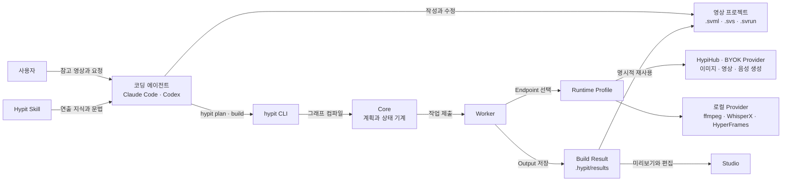
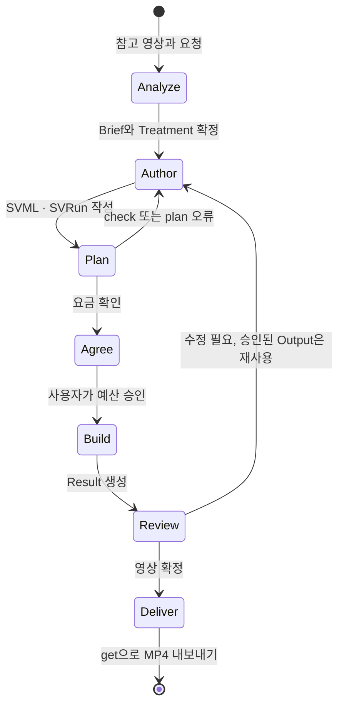
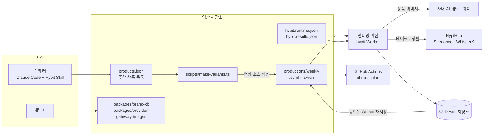
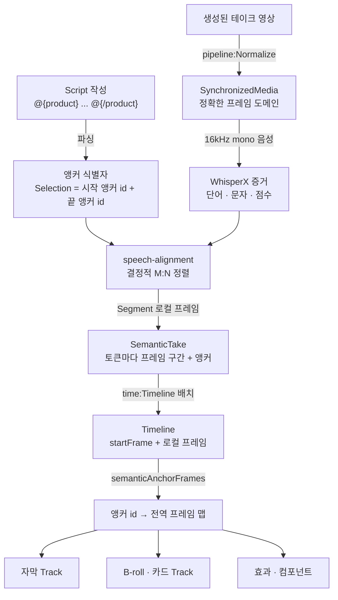

## 개요

> Claude Code, Codex 같은 코딩 에이전트에게 "영상을 코드로 기술하는 언어(SVML)"와 "그 코드를 실행해 영상을 만드는 런타임"을 함께 주어서, 참고 영상 하나를 수정 가능하고 다시 실행할 수 있는 영상 프로젝트로 바꾸게 하는 오픈소스 영상 제작 시스템입니다.

## 30초 요약

| 항목 | 내용 |
|---|---|
| 무엇인가? | 코딩 에이전트용 Skill + `hypit` CLI·런타임 + SVML/SVS/SVRun 소스 형식으로 이루어진 "코드로 만드는 영상" 시스템 |
| 왜 사용하는가? | 한 번 렌더링하고 끝나는 MP4 대신, 대사·출연자·제품만 바꿔 다시 실행할 수 있는 영상 워크플로를 얻기 위해 |
| 해결하는 문제 | AI 영상 생성 결과물이 일회성이라 문구 한 줄, 출연자 한 명만 바꿔도 처음부터 다시 만들어야 하는 문제 |
| 주요 사용처 | 바이럴 숏폼 복제, 광고 소재 변형 대량 생산, 팟캐스트·인터뷰 클립, 다국어 버전, 생성 모델 없는 코드 렌더링 영상 |
| 핵심 개념 | Script(대사), Selection/Moment(단어 앵커), SemanticTake, Timeline, Track/Film, Run/Build, Runtime Profile, Provider |
| Client 사용 | O (개발자 로컬의 에이전트 + CLI + 브라우저 Studio) |
| Server 사용 | △ (자기 조직용 단일 테넌트 렌더링 백엔드는 가능, 멀티 테넌트 SaaS는 별도 상용 라이선스 필요) |
| 대표 대안 | Remotion, HyperFrames, 템플릿형 AI 영상 SaaS, ffmpeg 스크립트 + 생성 API 직접 호출 |

- **영상을 소스 코드로 남긴다**: 결과는 MP4 한 개가 아니라 `.svml`(구성), `.svs`(스타일), `.svrun`(실행 대상) 같은 평범한 텍스트 파일입니다.
- **시간을 초가 아니라 단어에 묶는다**: 자막, B-roll, 그래픽 등장 시점을 "3.2초"가 아니라 "이 단어부터 저 단어까지"로 적습니다. 대사가 바뀌면 타이밍이 따라 움직입니다.
- **바뀐 부분만 다시 만든다**: 이전 Build에서 승인한 이미지·영상을 명시적으로 재사용하고, 바뀐 장면만 새로 생성합니다.
- **모델과 서비스를 갈아 끼운다**: 무엇을 생성할지(Model)와 어디서 실행할지(Provider)를 분리해서, HypiHub·자체 API 키·로컬 모델을 프로젝트별로 고릅니다.
- **에이전트가 감독 역할을 한다**: Skill이 에이전트에게 참고 영상 분석, 연출 결정, 비용 합의, 결과 검수 절차를 알려 줍니다.

---

## 어떤 도구인가?

숏폼 마케팅을 하다 보면 이런 요청이 계속 생깁니다.

- "요즘 잘 되는 이 틱톡 구성 그대로, 우리 제품으로 바꿔서 만들어 줘."
- "같은 영상인데 첫 3초 훅만 다르게 해서 20개 뽑아 줘."
- "내레이터 목소리만 바꿔 줘. 자막 타이밍은 그대로."
- "이걸 스페인어로도 만들어 줘."

AI 영상 생성 서비스는 대부분 결과를 MP4 한 개로 돌려줍니다. 그 영상을 조금만 바꾸고 싶어도 프롬프트를 다시 쓰고, 다시 생성하고, 편집 툴에서 자막을 다시 맞춰야 합니다.

Hypit은 이 과정을 **"영상 한 편 = 다시 실행할 수 있는 프로젝트"**로 바꾸는 도구입니다. 비유하자면, 완성된 요리 사진이 아니라 **레시피와 재료 목록**을 받는 것과 같습니다. 레시피가 있으면 고기만 바꾸거나, 양념만 바꾸거나, 1인분을 10인분으로 늘리는 일이 쉬워집니다.

기술적으로 정의하면 Hypit은 세 부분으로 나뉩니다.

| 구성 | 정체 | 역할 |
|---|---|---|
| Hypit Skill | `skills/hypit/SKILL.md`와 참고 문서 묶음 | 에이전트에게 감독·제작자로서 일하는 방법과 SVML 문법을 알려 줌 |
| `@hypit/hypit` Distribution | npm으로 배포되는 CLI, 런타임, 공식 컴포넌트 패키지, SDK | 소스를 컴파일하고, 생성 작업을 실행하고, 렌더링하고, Studio를 띄움 |
| 영상 프로젝트 | 사용자가 소유한 평범한 폴더 | `.svml`/`.svs`/`.svrun`, 에셋, 프로젝트 전용 컴포넌트, 실행 결과(Build Result) |

세 부분은 설치 위치와 업데이트 채널이 모두 다릅니다. Skill은 에이전트에, Distribution은 npm 전역(또는 프로젝트)에, 영상 프로젝트는 어디든 둘 수 있습니다. Hypit 저장소를 clone할 필요는 없습니다.

Hypit이 직접 하지 않는 일도 분명합니다. 이미지·영상·음성 생성은 Seedance, GPT Image, PixVerse 같은 외부 모델이 하고, 그 호출 비용은 선택한 서비스가 청구합니다. Hypit은 그 모델들을 **어떤 순서로, 어떤 입력으로 부르고, 결과를 어떻게 한 화면에 합성할지**를 담당합니다. 생성 모델 없이 자막·모션 그래픽·코드로 그린 화면만으로 영상을 만드는 것도 가능합니다.

### 주요 사용 사례

- **바이럴 영상 복제**: 참고 영상을 넣으면 에이전트가 컷, 자막, B-roll, 효과가 어떤 단어에 반응하는지 분석해 같은 구조의 새 영상을 만듭니다.
- **광고 소재 변형**: 하나의 워크플로에서 훅, 제품, CTA, 언어, 화면 비율만 바꾼 변형을 여러 개 만듭니다.
- **팟캐스트·인터뷰 클립**: 화면 분할 레이아웃, 화자별 색이 다른 자막, 리액션 오버레이를 구성합니다.
- **AI UGC·토킹헤드**: 생성된 출연자 영상에 단어 단위 자막, B-roll, 비트에 맞춘 컷을 자동으로 연결합니다.
- **코드 렌더링 영상**: 생성 API 호출 없이 HTML/CSS 기반 컴포넌트로 그린 설명 영상을 로컬에서 렌더링합니다.
- **다국어 버전**: 문장을 다시 쓰면 자막 타이밍이 새 음성에 맞춰 다시 배치됩니다.

주요 용어는 [핵심 개념과 동작 구조](#h-hypit-핵심-개념과-동작-구조)에서 자세히 다룹니다.

---

## 어떤 문제를 해결하는가?

```text
요구사항: 잘 되는 숏폼 하나를 기준으로, 출연자·제품·문구만 바꾼 변형을 계속 만들고 싶다
 ↓
일반적인 구현: 영상 생성 API로 클립을 만들고, 편집 툴이나 ffmpeg로 자막·B-roll을 초 단위로 맞춘다
 ↓
문제 발생: 문장 하나만 바뀌어도 음성 길이가 달라져 자막·그래픽 타이밍을 전부 다시 맞춰야 하고, 무엇을 재사용했는지 남지 않는다
 ↓
Hypit으로 해결: 대사를 Script로, 타이밍을 단어 앵커로, 실행을 Build로 분리해 바뀐 부분만 다시 생성·합성한다
```

### 상황 예시

건강기능식품 쇼핑몰의 마케터가 크레아틴 광고 숏폼을 만들고 있습니다. 첫 버전은 반응이 좋았고, 이제 이런 변형이 필요합니다.

- 훅 문장만 다른 버전 5개
- 남성 출연자 버전과 여성 출연자 버전
- 제품만 비타민으로 바꾼 버전
- 영어 버전

### 일반적인 구현 방식

생성 API를 직접 부르고, ffmpeg로 자막을 입히는 스크립트를 떠올리기 쉽습니다.

```ts
// make-ad.ts : 초 단위로 자막과 B-roll을 맞추는 직접 구현
import { execFileSync } from 'node:child_process';

const take = await generateTalkingHead({ prompt: '...크레아틴 광고 대사...', duration: 8 });
const broll = await generateImage({ prompt: '헬스장 탈의실, 크레아틴 통 클로즈업' });

// 자막 타이밍은 영상을 보며 사람이 직접 적는다
const captions = [
  { start: 0.0, end: 1.4, text: '이거 아직도 안 먹어?' },
  { start: 1.4, end: 3.1, text: '크레아틴은 매일 먹어야 해' },
];
const brollWindow = { start: 3.1, end: 5.0 }; // "매일" 뒤에 제품 컷

writeSrt('captions.srt', captions);
execFileSync('ffmpeg', [
  '-i', take.path, '-i', broll.path,
  '-filter_complex', `[0][1]overlay=enable='between(t,${brollWindow.start},${brollWindow.end})',subtitles=captions.srt`,
  'out.mp4',
]);
```

### 이 방식에서 발생하는 문제

- **타이밍이 숫자에 묶여 있음**: 훅 문장을 바꾸면 음성 길이가 달라져서 `start`, `end`를 영상을 다시 보며 전부 고쳐야 합니다.
- **재사용 근거가 없음**: 이미 마음에 든 B-roll 이미지를 다시 쓰려면 파일을 직접 찾아 경로를 바꿔야 하고, 어떤 생성 결과를 썼는지 기록이 남지 않습니다.
- **생성 비용이 반복됨**: 스크립트를 다시 돌리면 바뀌지 않은 장면까지 다시 생성해서 비용이 그대로 다시 나갑니다.
- **레이어 구성이 코드 곳곳에 흩어짐**: 화면 분할, 자막 위치, 등장 애니메이션이 ffmpeg 필터 문자열 안에 섞여 있어서 사람이 읽고 수정하기 어렵습니다.
- **서비스 교체가 어려움**: 생성 API를 바꾸려면 호출 코드와 응답 처리 코드를 모두 다시 작성해야 합니다.

### Hypit을 사용하면

같은 요구사항이 다음처럼 나뉩니다. 문법은 [핵심 개념과 동작 구조](#h-hypit-핵심-개념과-동작-구조)와 [SVML 직접 작성](#h-hypit-활용-예시-②-svml-직접-작성)에서 다룹니다.

- 대사는 `<script>` 안에 문장으로만 적고, "제품 컷이 나올 구간"은 `@{product}...@{/product}` 같은 단어 앵커로 표시합니다.
- 생성된 음성을 WhisperX가 단어 단위로 정렬하면, 앵커가 실제 프레임 위치로 계산됩니다. 훅 문장이 바뀌어도 B-roll은 여전히 "매일"이라는 단어 뒤에 나옵니다.
- 마음에 든 생성 결과는 `.svrun`에서 이전 Build의 Output으로 명시적으로 지정해 다시 생성하지 않습니다.
- 생성 서비스는 Runtime Profile에서 고르므로, 소스는 그대로 두고 HypiHub와 자체 API 키를 바꿔 쓸 수 있습니다.

> **핵심:** 영상의 타이밍과 재사용을 개발자가 초 단위 숫자와 파일 경로로 관리하는 대신, Hypit이 **대사(Script)·단어 앵커·명시적 재사용(Run)**으로 나눠서 처리해줍니다.

---

## 왜 주목받고 있는가?

Hypit은 2026년 7월 말 저장소가 만들어졌고, 9월 14일 첫 GitHub 릴리스(v0.1.8)가 나온 뒤 짧은 기간에 GitHub Star 약 1만 9천 개, Fork 약 2천 개를 모았습니다(2026년 10월 기준). 숫자보다 중요한 것은 **왜 이런 접근이 나왔는가**입니다.

**코딩 에이전트가 "도구를 쓰는 작업자"가 되었습니다.** Claude Code, Codex 같은 에이전트는 파일을 읽고 쓰고 셸 명령을 실행할 수 있습니다. Hypit은 영상 편집을 타임라인 UI 조작이 아니라 **텍스트 파일 편집 + CLI 실행**으로 바꿔서, 에이전트가 가장 잘하는 방식으로 영상을 만들게 합니다.

**생성 모델의 결과물은 비결정적입니다.** 같은 프롬프트로 다시 생성해도 다른 영상이 나옵니다. 그래서 "마음에 든 결과를 고정하고 나머지만 다시 만드는 것"이 품질과 비용 모두에 중요합니다. Hypit은 암묵적 캐시 없이 **명시적 재사용**만 허용하는 방식으로 이 문제를 다룹니다.

**영상의 의미 단위가 단어라는 점을 정면으로 다룹니다.** 숏폼에서 자막 강조, 제품 등장, 효과음은 거의 항상 특정 단어에 맞춰집니다. Hypit은 이를 초 단위 타임코드가 아니라 단어 앵커로 표현해서, 대사 수정과 언어 변경에 강한 구조를 만듭니다.

**모델 생태계 변화에 대응합니다.** 이미지·영상 모델이 몇 주 단위로 바뀌는 상황에서 Model(요청의 의미)과 Provider(실행 경로)를 분리해, 새 모델이나 새 API 게이트웨이를 패키지 하나로 붙일 수 있게 했습니다. 실제로 2026년 9월 한 달 동안 PixVerse, Wan, BeatAPI 등의 지원이 릴리스마다 추가되었습니다.

**비용이 눈에 보입니다.** 공식 예제는 20초 축구 티어 리스트를 약 1.15달러, 18초 팟캐스트 클립을 약 1.07달러로 만들었다고 밝힙니다. 유료 호출 전에 `hypit pricing`으로 요청별 요금을 보고 사용자와 예산을 합의하는 절차가 Skill에 들어 있습니다.

일반적인 방식과의 항목별 차이는 [장단점과 대안 비교](#h-hypit-장단점과-대안-비교)에 정리했습니다.

---

## 언제 사용하면 좋은가?

- **같은 형식의 영상을 반복해서 만드는 경우**: 광고 소재, 상품 소개, 티어 리스트처럼 구조는 같고 내용만 바뀌는 영상은 워크플로를 한 번 만들어 두는 효과가 큽니다.
- **대사와 화면이 단어 단위로 맞물리는 영상**: 카라오케식 자막, 단어에 맞춘 그래픽 등장, 화자별 자막 색처럼 타이밍이 중요한 영상은 단어 앵커의 이점이 가장 큽니다.
- **이미 Claude Code나 Codex를 쓰는 개발자·마케터**: 에이전트에게 말로 요청하고, 결과를 텍스트 파일로 검토하는 흐름이 익숙하다면 진입 비용이 낮습니다.
- **생성 서비스를 직접 고르고 싶은 경우**: HypiHub, 파트너 API, 자체 API 키, 로컬 WhisperX를 섞어 쓸 수 있고, 좌석 요금이나 렌더 요금이 따로 없습니다.
- **생성 모델 없이 코드로 그리는 영상**: 개발 도구 소개, 데이터 설명, 다이어그램 애니메이션처럼 HTML/CSS로 그릴 수 있는 영상은 생성 비용 없이 로컬 렌더링만으로 만들 수 있습니다.

---

## 언제 사용하지 않는 것이 좋은가?

- **영상 한두 개만 만들고 끝나는 경우**: 워크플로를 만드는 비용이 재사용 이득보다 큽니다.
  > 예: 회사 송년회 영상 한 편이라면 CapCut 같은 편집 툴로 직접 만드는 것이 빠릅니다.
- **사람이 촬영한 원본을 섬세하게 편집하는 작업**: 컷 단위 색보정, 멀티캠 편집, 오디오 믹싱이 핵심이라면 Premiere Pro, DaVinci Resolve 같은 NLE가 맞습니다. Hypit의 강점은 "생성된 소재 + 합성"입니다.
- **영상 생성 기능을 고객에게 SaaS로 제공하려는 경우**: 여러 외부 고객이 각자 워크스페이스를 갖는 멀티 테넌트 서비스는 라이선스상 별도 상용 계약이 필요합니다.
  > 예: "우리 플랫폼에 가입한 셀러마다 광고 영상을 자동 생성해 주는 기능"은 사전에 라이선스를 확인해야 합니다.
- **React 컴포넌트로 영상을 직접 프로그래밍하고 싶은 경우**: 에이전트 없이 개발자가 코드로 영상을 완전히 통제하는 것이 목적이라면 Remotion 같은 도구가 더 단순합니다.
- **버전 변화에 민감한 운영 환경**: 2026년 9월에만 GitHub 릴리스가 20번 넘게 나왔고, 0.2.0에서 Script 문법이 바뀌는 등 아직 0.x 단계입니다. 안정성이 최우선이라면 버전을 고정하고 업데이트를 신중히 해야 합니다.
- **타인의 콘텐츠를 그대로 베끼려는 경우**: "복제"는 구조와 연출을 배우는 것이지 원본 출연자나 문구를 가져오는 것이 아닙니다. 초상권, 저작권, 플랫폼 스팸 정책 문제는 도구가 대신 해결해 주지 않습니다.

---

## 한눈에 정리

| 항목 | 내용 |
|---|---|
| 라이브러리 | Hypit (Skill `hypit-ai/hypit`, npm `@hypit/hypit`, 2026년 10월 기준 v0.2.17) |
| 주요 목적 | 코딩 에이전트가 영상을 수정 가능하고 다시 실행할 수 있는 소스 프로젝트로 만들게 함 |
| 해결하는 문제 | 일회성 렌더 결과, 초 단위 타이밍 수작업, 재생성 비용 반복, 서비스 종속 |
| 핵심 개념 | Script·Selection·Moment, SemanticTake, Timeline, Track·Film, Run·Build, Runtime Profile·Provider |
| 주요 사용처 | 바이럴 복제, 광고 변형, 팟캐스트·인터뷰 클립, 다국어 버전, 코드 렌더링 영상 |
| Client 활용 | 로컬 에이전트 + `hypit` CLI + 브라우저 Studio에서 검토·수정 |
| Server 활용 | 자기 조직용 단일 테넌트 렌더링 백엔드, S3 Result 저장소, 프로젝트 전용 Provider |
| 장점 | 단어 기반 타이밍, 명시적 재사용, 모델·서비스 교체, 텍스트 소스, 비용 사전 확인 |
| 단점 | 0.x 단계의 잦은 변경, 높은 학습 곡선, 생성 품질은 모델 의존, 라이선스 조건, 로컬 준비 부담 |
| 추천 상황 | 같은 형식의 영상을 반복 생산하고, 대사와 화면이 단어 단위로 맞물리는 경우 |
| 비추천 상황 | 일회성 영상, 촬영본 정밀 편집, 멀티 테넌트 SaaS, 안정성 최우선 운영 |
| 대표 대안 | Remotion, HyperFrames, 템플릿형 AI 영상 SaaS, ffmpeg + 생성 API 직접 구현 |

---

## 핵심 정리

### 한 문장으로

> Hypit은 AI로 만든 영상이 일회성 MP4로 끝나서 조금만 바꿔도 처음부터 다시 만들어야 하는 문제를 **대사(Script)·단어 앵커·명시적 재사용이 있는 텍스트 소스와 실행 런타임**으로 해결하기 위한 에이전트용 영상 제작 시스템입니다.

### 이것만 기억하기

1. **왜 사용하는가?**
   - 영상 하나를 "다시 실행할 수 있는 워크플로"로 남겨서, 출연자·문구·제품·언어만 바꾼 변형을 싸고 빠르게 만들기 위해서입니다.

2. **어떤 문제를 해결하는가?**
   - 초 단위 타이밍을 매번 다시 맞추는 문제, 바뀌지 않은 장면까지 다시 생성하는 비용 문제, 특정 생성 서비스에 묶이는 문제입니다.

3. **어떻게 동작하는가?**
   - Script에 대사와 단어 앵커를 적고, 생성된 음성을 WhisperX로 단어 정렬해 SemanticTake를 만들고, Timeline이 앵커를 프레임으로 바꾸면 각 Track이 그 프레임에 맞춰 그려지고 Film이 합성되어 HyperFrames로 렌더링됩니다.

4. **실제 프로젝트에서는 어디에 사용하는가?**
   - 광고 소재 변형, 바이럴 숏폼 복제, 팟캐스트 클립, 다국어 영상, 생성 비용 없는 코드 렌더링 설명 영상에 씁니다.

5. **언제 사용하지 않는가?**
   - 한 번 만들고 끝나는 영상, 촬영 원본의 정밀 편집, 외부 고객용 멀티 테넌트 서비스, 안정성이 최우선인 운영 환경에서는 맞지 않습니다.

6. **비슷한 기술과 가장 큰 차이는 무엇인가?**
   - 영상 코드를 사람이 아니라 **에이전트가 쓰도록 설계**했고, 시간을 초가 아니라 **단어**에 묶는다는 점입니다. Remotion이 "React로 영상을 프로그래밍"한다면, Hypit은 "에이전트가 대사와 의미 단위로 영상을 연출"합니다.

## Hypit 핵심 개념과 동작 구조

> Hypit을 이루는 소스 형식(SVML·SVS·SVRun), Script와 단어 앵커, SemanticTake와 Timeline, Track과 Film, Run과 Build, Model과 Provider가 각각 무엇이고 어떻게 맞물려 동작하는지 다룹니다.

### 용어 한눈에 보기

| 키워드 | 설명 |
|---|---|
| SVML (`.svml`) | 영상의 대사, 소재, 컴포넌트, 합성을 기술하는 Author Source |
| SVS (`.svs`) | 색, 크기, 위치, 등장 모션 같은 재사용 스타일(Recipe)을 모은 스타일시트 |
| SVRun (`.svrun`) | 이번 실행에서 무엇을 만들지(Target)와 무엇을 재사용할지(Candidate)를 고르는 Run Source |
| Script | 출연자가 말하는 모든 단어. 타임코드·스타일 없이 문장만 담음 |
| Selection / Moment | Script 안에 표시한 단어 구간 / 단어 시점. 시간 대신 쓰는 의미 앵커 |
| SemanticTake | 영상 한 테이크를 Script의 한 Segment와 단어 단위로 정렬한 결과 |
| Timeline | 테이크들을 프레임 축 위에 배치한 전체 시간축. 앵커를 프레임으로 바꾸는 기준 |
| Track / Film | 자막·B-roll·그래픽 같은 레이어 / 그 레이어들을 쌓아 만든 최종 합성 |
| Build / Result | 한 번의 실행 시도 / 그 실행이 남긴 Output과 기록 |
| Model / Provider / Endpoint | 무엇을 생성할지 / 어떤 서비스로 실행할지 / 그 서비스의 설정된 인스턴스 |
| Runtime Profile | 어떤 Endpoint와 자격 증명을 쓸지 고르는 `hypit.runtime.json` |

---

### 1. 소스 세 가지: SVML · SVS · SVRun

#### 쉽게 설명하면

영화 제작에 비유하면 SVML은 **시나리오와 콘티**, SVS는 **미술팀의 스타일 가이드**, SVRun은 **오늘 촬영할 장면 목록**입니다. 시나리오가 같아도 오늘은 1장만 찍을 수도 있고, 어제 찍은 장면을 그대로 쓸 수도 있습니다.

#### 개발 관점에서는

- **SVML**은 HTML과 비슷한 마크업으로, `<import>`로 컴포넌트 패키지를 불러오고 각 요소가 그래프의 노드가 됩니다. `{take.video}`처럼 다른 요소의 출력을 중괄호로 참조하면 그것이 의존성 간선이 됩니다.
- **SVS**는 CSS와 비슷한 문법으로 `caption.base { size: 58; fill: #FFFFFF; }` 같은 Recipe를 정의하고, SVML에서 `{recipes.caption.base}`로 참조합니다.
- **SVRun**은 SVML 하나를 가리키고, 만들 결과(`<target>`)와 재사용할 이전 결과(`<build-record>`, `<satisfy>`)를 적습니다.

세 파일을 나눈 이유는 **"무엇을 만드는가", "어떻게 보이는가", "이번에 무엇을 실행하는가"가 서로 다른 속도로 바뀌기 때문**입니다. 스타일만 바꿔서 다시 렌더링하거나, 같은 SVML로 이미지 생성용 Run과 최종 렌더용 Run을 따로 둘 수 있습니다.

#### 예제

```svml
<!-- build.svrun -->
<?svml using="@hypit/run-markup@1"?>

<svrun version="1">
  <author source="./main.svml"/>
  <target output="final.video"/>
</svrun>
```

`final.video`는 `main.svml` 안의 `<render:Video id="final" .../>`가 내보내는 출력입니다. Run은 이 Target까지 가는 데 필요한 작업만 실행합니다.

#### 핵심

> SVML은 영상의 정의, SVS는 외형, SVRun은 실행 의도입니다. 세 파일 모두 평범한 텍스트라서 에이전트가 읽고 고치고 Git으로 관리할 수 있습니다.

### 2. Script: 문장만 담는 대사 원본

#### 쉽게 설명하면

방송 대본에서 "누가 무슨 말을 하는지"만 적힌 페이지입니다. 언제 자막이 뜨는지, 어떤 색인지는 적지 않습니다.

#### 개발 관점에서는

`<script>`는 `@hypit/script@1`을 import하면 활성화되는 요소로, 다음 구성만 가집니다.

- **Segment**: `<opening>`, `<answer>`처럼 태그 이름이 곧 id인 대사 블록. 중첩할 수 없고, 보통 한 Segment가 생성 영상 한 테이크에 대응합니다.
- **Role Cue**: `<HOST>`, `<ALICE>`처럼 닫는 태그 없이 "누가 말하는지"만 표시합니다. 목소리나 캐릭터를 고르지는 않습니다.
- **Dual Text**: `<BCC | B C C>`처럼 화면에 보일 글자(왼쪽)와 실제로 발음할 말(오른쪽)을 나눕니다.
- **Cue Break** `||`: 자막 한 덩어리를 끊는 위치입니다.

Script 하나에서 세 가지 텍스트 투영이 나옵니다. `dialogue`(화자 이름 포함, 영상 생성 프롬프트용), `speech`(발음용), `caption`(자막용 CaptionDocument)입니다.

#### 예제

```svml
<import from="@hypit/script@1"/>

<script id="story">
  <hook>
    <HOST> 이거 아직도 안 먹어? || 크레아틴은 <3g | 삼 그램>이면 충분해.
  </hook>
</script>
```

화면 자막에는 "3g"이, 음성 생성 프롬프트에는 "삼 그램"이 들어갑니다. 두 표현은 하나의 정렬 단위로 묶여서 "삼 그램"이 발음되는 동안 "3g"가 강조됩니다.

#### 핵심

> Script는 다른 어떤 것도 읽지 않고, 나머지 모든 단계가 Script를 읽습니다. 그래서 대사를 고치면 그 영향이 자막·생성 프롬프트·타이밍으로 자연스럽게 퍼집니다.

### 3. Selection과 Moment: 시간 대신 쓰는 단어 앵커

#### 쉽게 설명하면

편집자에게 "3.2초에 제품 컷 넣어 주세요"가 아니라 **"'매일'이라고 말하는 순간에 제품 컷 넣어 주세요"**라고 말하는 것입니다. 배우가 말을 조금 빠르게 해도 지시는 여전히 맞습니다.

#### 개발 관점에서는

Script 안에 `@{...}` 마커로 이름 붙은 구간(Selection)과 시점(Moment)을 선언합니다.

| 마커 | 의미 |
|---|---|
| `@{name}` ... `@{/name}` | Selection: 다음 단어 시작부터 이전 단어 끝까지 |
| `@{name!}` | Moment: 다음 단어가 시작하는 순간 |
| `~` 접두·접미 | 경계를 왼쪽·오른쪽 단어 중 어디에 붙일지 선택 |

마커는 텍스트에 아무것도 추가하지 않는 0폭 표시이고, 컴파일되면 "어느 앵커에서 어느 앵커까지"라는 식별자만 남습니다. 초나 프레임 숫자는 Script에 전혀 없습니다.

#### 예제

```svml
<script id="story">
  <hook>
    <HOST> @{problem}운동하는데 근육이 안 붙어?@{/problem}
    @{reveal!}답은 크레아틴이야.
  </hook>
</script>

<!-- 다른 컴포넌트에서 -->
<media-track:Item image={product.image} during={story.selection.problem} .../>
```

`during={story.selection.problem}`은 "problem 구간이 실제 영상에서 몇 프레임부터 몇 프레임까지인지"를 Timeline이 계산한 뒤에 정해집니다.

#### 핵심

> 앵커는 "언제"를 "무엇을 말할 때"로 바꿉니다. 대사 속도, 문장 길이, 언어가 바뀌어도 연출 의도가 그대로 유지되는 이유입니다. 계산 과정은 [단어 앵커와 시맨틱 타이밍 깊이 보기](#h-hypit-단어-앵커와-시맨틱-타이밍-깊이-보기)에서 소스 코드와 함께 다룹니다.

### 4. SemanticTake와 Timeline: 앵커를 프레임으로

#### 쉽게 설명하면

녹음된 대사를 들으면서 대본의 단어마다 "몇 초에 시작해서 몇 초에 끝났는지" 형광펜으로 표시하는 작업이 SemanticTake이고, 그렇게 표시된 테이크들을 순서대로 이어 붙인 것이 Timeline입니다.

#### 개발 관점에서는

말하는 영상은 세 단계로 시간 정보를 얻습니다.

1. `pipeline:Normalize`: 생성된 영상을 지정한 프레임 레이트(`Clock`)의 정확한 미디어로 정규화합니다.
2. `whisperx:SemanticTake`: 정규화된 테이크 하나를 Script Segment 하나와 정렬해 단어마다 로컬 프레임 구간을 붙입니다. 언어 코드(`language="ko"`)는 자동 감지하지 않고 직접 적어야 합니다.
3. `time:Timeline`: SemanticTake들을 순서대로(또는 `at` 위치에) 배치해 전체 프레임 축을 만듭니다.

말이 없는 순수 애니메이션은 테이크 없이 `end="8s"`만 가진 Timeline을 쓰고, 이벤트를 초나 프레임으로 적습니다.

#### 예제

```svml
<program:Clock id="clock" frame-rate="30"/>
<pipeline:Normalize id="hook-media" source={hook-take.video}
  video="primary-moving" audio="default" span-authority="video" clock={clock}/>
<whisperx:SemanticTake id="hook-semantic" narrative={story}
  segment={story.segment.hook} media={hook-media.media} language="ko"/>
<time:Timeline id="speech" clock={clock}>
  <time:Take source={hook-semantic.take}/>
</time:Timeline>
```

#### 핵심

> Timeline은 "의미(앵커)"와 "물리 시간(프레임)"을 잇는 유일한 기준입니다. 모든 Track은 같은 `{speech.timeline}`을 입력으로 받습니다.

### 5. Component, Track, Film, Render

#### 쉽게 설명하면

포토샵의 레이어와 같습니다. 출연자 영상 레이어, B-roll 레이어, 자막 레이어, 제목 레이어를 겹쳐서 한 장면을 만들고, 그 결과를 영상 파일로 내보냅니다.

#### 개발 관점에서는

- **Component**: `caption-fine`, `media-track`, `ranking`처럼 패키지로 제공되는 시각 요소입니다. 입력(Timeline, 앵커, 이미지, Recipe)을 받아 Track을 출력합니다. 프로젝트 전용 컴포넌트를 TypeScript로 직접 만들 수도 있습니다.
- **Track**: 시간에 따라 나타나고 사라지는 레이어입니다. `stack-order`가 낮을수록 뒤에 그려집니다.
- **Film**: Track들을 모아 하나의 Composition으로 검증·합성합니다.
- **Render**: `render:Video`가 Composition을 HyperFrames 렌더러로 프레임마다 HTML로 그리고, headless Chromium으로 캡처하고, 오디오를 섞어 MP4로 만듭니다.

#### 예제

```svml
<film:Film id="main" canvas={vertical} timeline={speech.timeline} appearance={recipes.film.vertical}>
  <film:Track source={performance.visual}/>  <!-- 출연자 영상 -->
  <film:Track source={voice.audio}/>         <!-- 음성 -->
  <film:Track source={cards.visual}/>        <!-- B-roll -->
  <film:Track source={captions.track}/>      <!-- 자막 -->
</film:Film>
<render:Video id="final" composition={main.composition} timeline={speech.timeline}/>
```

#### 핵심

> 함께 움직여야 하는 요소는 한 컴포넌트(한 장면) 안에, 독립적인 요소는 별도 Track으로 둡니다. Film의 자식 순서가 아니라 Recipe의 `stack-order`가 그리기 순서를 정합니다.

### 6. Run, Build, Result: 명시적 재사용

#### 쉽게 설명하면

사진관에서 "지난번에 찍은 증명사진 원판으로 다시 뽑아 주세요"라고 말하는 것과 같습니다. 말하지 않으면 사진관은 새로 찍습니다. 대신 무엇을 다시 썼는지가 분명히 남습니다.

#### 개발 관점에서는

- `hypit build`를 실행할 때마다 **새 Build id**가 생깁니다. 소스가 그대로여도 마찬가지입니다. 생성 모델은 같은 입력에도 다른 결과를 내기 때문입니다.
- Hypit에는 **암묵적 캐시가 없습니다.** 이전 결과를 쓰려면 `.svrun`에 `<build-record>`로 "어느 Build의 어느 Output"인지 지정하고, `<satisfy>`로 지금 소스의 어떤 출력을 그것으로 대신할지 연결해야 합니다.
- 결과는 기본적으로 `.hypit/results/<날짜>/<build-id>/`에 `result.json`, `files/`, `values/`로 저장됩니다. 실패한 Build에서도 완료된 Output은 남아 재사용할 수 있습니다.
- Build는 백그라운드 Worker가 실행합니다. `--follow`는 관찰만 하므로 터미널을 닫아도 Build는 계속됩니다.

#### 예제

```svml
<svrun version="1">
  <author source="./main.svml"/>
  <target output="final.video"/>

  <!-- 지난 Build에서 승인한 훅 테이크를 그대로 쓴다 -->
  <build-record id="approved-hook"
    build="bld_20260930T101500000Z_0000000001" output="hook-take.video"/>
  <satisfy output="hook-take.video" candidate="approved-hook"/>
</svrun>
```

#### 핵심

> "무엇을 다시 쓰는지"를 사람이 읽을 수 있는 파일에 남기는 것이 Hypit 재사용의 원칙입니다. 이 덕분에 바뀐 부분만 비용을 내고 다시 생성합니다.

### 7. Model, Provider, Endpoint, Runtime Profile

#### 쉽게 설명하면

Model은 **주문서**("9:16 비율 이미지 한 장, 이런 프롬프트로")이고, Provider는 **배달 업체**, Endpoint는 **내 계정으로 등록된 그 업체의 지점**입니다. Runtime Profile은 "이 주문은 이 지점으로 보낸다"는 배정표입니다.

#### 개발 관점에서는

- **Model**(예: `@hypit/seedance@1`, `@hypit/gpt-image@1`)은 요청의 입력·파라미터·출력 타입을 정의하고 SVML에서 import합니다.
- **Provider**(예: `@hypit/provider-hypihub`, `@hypit/provider-media-local`)는 그 요청을 특정 API나 로컬 도구로 실행합니다.
- **Endpoint**는 `hypit.runtime.json`의 `endpoints`에 등록한 Provider 인스턴스로, 주소·자격 증명 참조·동시성 한도를 가집니다.
- 같은 기능을 여러 Endpoint가 제공하면 `bindings`로 하나를 고릅니다. 실패해도 **다른 계정으로 조용히 넘어가지 않습니다.**
- 비밀값은 Profile과 소스에 넣지 않고 Credential Store(OS 키체인, 환경 변수, 플랫폼 OAuth)에서 이름으로 참조합니다.

#### 예제

```json
{
  "format": "hypit.runtime-local@1",
  "dataRoot": ".hypit/runtimes/local",
  "credentials": { "platform": { "use": "@hypit/credential-store-platform" } },
  "endpoints": {
    "hypihub.default": {
      "use": "@hypit/provider-hypihub",
      "config": { "apiKey": { "store": "platform", "key": "hypihub.oauth" } }
    },
    "media.local": { "use": "@hypit/provider-media-local" }
  },
  "bindings": {}
}
```

#### 핵심

> 소스(SVML)는 "무엇을"만, Profile은 "어디서"만 정합니다. 그래서 같은 영상 소스를 HypiHub로 돌리다가 자체 API 키나 로컬 모델로 바꿔도 소스는 수정하지 않습니다.

---

### 8. 전체 동작 구조

Hypit은 애플리케이션 코드에 import하는 라이브러리가 아니라, **에이전트가 소스를 쓰고 CLI가 그래프를 실행하는 제작 시스템**입니다.



한 번의 영상 제작이 처리되는 순서는 다음과 같습니다.

1. **시작점**: 사용자가 에이전트에 `/hypit`으로 참고 영상과 바꿀 내용을 전달합니다. 에이전트는 Skill을 읽고 참고 영상을 프레임과 단어 단위 대본으로 분석해 프로젝트 노트(Analysis, Brief, Treatment)에 기록합니다.
2. **Hypit이 개입하는 시점**: 에이전트가 Script, 생성 프롬프트, 컴포넌트 배치를 SVML로 작성하고 `hypit check`, `hypit plan`으로 그래프를 검증합니다. `hypit pricing`으로 예상 요금을 보여 주고 사용자와 예산을 합의합니다.
3. **내부 처리**: `hypit build`가 Author Graph와 Run Graph를 함께 계획해 Target까지 필요한 작업만 고르고, Worker가 의존성 순서대로 실행합니다. 이미지 생성 → 영상 생성 → 정규화 → WhisperX 정렬 → Timeline 조립 → Track 계산 → Film 합성 → 렌더링 순으로 진행됩니다.
4. **외부 시스템과의 연결**: 생성과 전사 요청은 Runtime Profile이 고른 Endpoint로 나갑니다. 원격 작업은 제출 → 폴링 → 수집으로 나뉘어 처리되고, 렌더링은 로컬 headless Chromium에서 병렬로 진행됩니다.
5. **결과 반환**: 완료된 Output은 Build Result에 쌓이고, `hypit get`으로 MP4를 내보내거나 `hypit studio`로 타임라인을 보며 수정합니다. 다음 변형은 승인된 Output을 `.svrun`에서 재사용해 바뀐 부분만 다시 실행합니다.

하나의 영상이 다듬어지는 흐름을 상태로 보면 다음과 같습니다.



## Hypit 설치와 첫 사용

> Skill과 실행 파일을 설치하는 방법, 영상 프로젝트의 기본 설정(Runtime Profile과 계정 연결), 가장 간단한 첫 실행, 설치할 때 자주 겪는 문제를 다룹니다.

### 설치

필요한 것은 다음과 같습니다.

| 도구 | 버전 | 필요한 경우 |
|---|---|---|
| Skill을 지원하는 코딩 에이전트 | Claude Code, Codex 등 | 에이전트로 작업할 때 |
| Node.js | 22.15 이상 | `hypit` 실행 파일 |
| ffmpeg / ffprobe | 최신 안정 버전 | 로컬 미디어 처리와 렌더링 |
| Chrome / Chromium | `hypit runtime up`이 내려받음 | 로컬 HyperFrames 렌더링 |
| Python 3.10~3.13, uv | - | 로컬 WhisperX·OpenCV를 쓸 때만 |

**1단계. Skill 설치**

```bash
npx skills add hypit-ai/hypit -g
```

이 명령은 에이전트가 읽을 `hypit` Skill(연출 지식, SVML 문법, 런타임 사용법)을 전역으로 설치합니다. Hypit 저장소를 clone할 필요는 없습니다.

**2단계. 실행 파일 설치**

Skill을 설치한 뒤 에이전트에게 처음 요청하면, 에이전트가 `hypit` 실행 파일이 있는지 확인하고 없으면 설치를 도와줍니다. 직접 설치하려면 버전을 고정해서 설치합니다.

```bash
npm install -g @hypit/hypit@0.2.17
```

```bash
pnpm add -g @hypit/hypit@0.2.17
```

```bash
hypit --version
hypit version --check   # 최신 릴리스와 비교
```

Skill과 실행 파일은 **업데이트 채널이 다릅니다.** 실행 파일은 npm으로, Skill은 `npx skills update hypit -g`로 따로 갱신합니다. 어느 쪽을 업데이트해도 기존 영상 프로젝트 파일은 자동으로 바뀌지 않습니다.

### 기본 설정

영상 프로젝트 폴더를 만들고 그 안에서 명령을 실행합니다. Hypit은 **현재 위치에서 가장 가까운 `package.json`이 있는 폴더**를 프로젝트 경계로 봅니다. 없으면 현재 폴더가 프로젝트입니다.

```bash
mkdir creatine-ad && cd creatine-ad
npm init -y                # 프로젝트 경계를 명확히 하기 위해 권장
hypit paths                # Hypit이 인식한 프로젝트·Runtime·Result 경로 확인
hypit runtime init         # hypit.runtime.json 생성 + .hypit/runtime 에 선택 기록
```

`runtime init`은 HypiHub(호스팅 생성·WhisperX)와 로컬 미디어 처리·렌더링이 들어 있는 시작용 Profile을 만듭니다. 설치, 로그인, 실행은 하지 않습니다. 실제로 쓸 서비스를 고른 다음에 그 서비스만 준비합니다.

**로컬 미디어 처리 준비**

```bash
hypit runtime up --endpoint media.local   # 필요한 프로그램 준비 + Worker 시작
hypit runtime status
```

**생성 서비스 계정 연결 (HypiHub를 고른 경우)**

```bash
hypit auth status hypihub.default
hypit auth login hypihub.default          # 브라우저 OAuth 로그인
```

**설정 점검**

```bash
hypit doctor                               # 유료 요청 없이 설정·자격 증명·환경 점검
```

`doctor`는 생성 요청을 보내지 않습니다. 그래서 "자격 증명이 있다"와 "모든 요청이 성공한다"는 다른 이야기입니다. 경고도 오류만큼 주의해서 읽어야 합니다.

마지막으로 생성물과 실행 데이터가 커밋되지 않도록 `.gitignore`를 둡니다.

```text
.hypit/
output/
```

### 가장 간단한 예제

에이전트(Claude Code 등)를 영상 프로젝트 폴더에서 열고 다음을 입력합니다.

```text
/hypit Make a 15-second ranking video that ranks three protein supplements, in Korean, vertical 9:16.
```

1. **무엇을 생성하는가**: 에이전트가 Brief(사용자 목표)와 Treatment(연출안)를 프로젝트에 기록하고, Script·생성 프롬프트·랭킹 보드 컴포넌트 배치를 `.svml`로, 스타일을 `.svs`로, 실행 대상을 `.svrun`으로 작성합니다.
2. **어떤 값을 전달하는가**: 요청 문장, 선택한 서비스 계정, 그리고 Script에서 측정한 대사 길이(`hypit measure`)가 생성 요청의 입력이 됩니다.
3. **Hypit이 무엇을 처리하는가**: 에이전트는 `hypit plan`과 `hypit pricing`으로 어떤 모델을 몇 번 호출하고 얼마가 드는지 보여 주고, **사용자가 계정·범위·예산에 동의해야** `hypit build`를 실행합니다. Worker가 이미지·영상 생성, WhisperX 정렬, 자막·그래픽 합성, 렌더링을 순서대로 진행합니다.
4. **어떤 결과를 반환하는가**: Build Result에 최종 영상과 중간 Output(생성 이미지, 테이크, 정렬 결과)이 남습니다. 에이전트는 `hypit get`으로 MP4를 내보내고, `hypit studio`로 타임라인을 열어 직접 확인·수정할 수 있게 안내합니다.

에이전트 없이 CLI만으로 같은 과정을 진행할 수도 있습니다.

```bash
hypit check main.svml                         # 그래프·타입 검증 (외부 호출 없음)
hypit plan build.svrun                         # 실행될 작업과 준비 상태 확인
hypit pricing build.svrun                      # 요청별 요금 확인
hypit build build.svrun --title first-cut --follow
hypit get <build-id> --output final.video --to output/final.mp4
```

`check`와 `plan`은 외부 서비스를 호출하지 않으므로 몇 번을 실행해도 비용이 들지 않습니다. 실제로 작업을 제출하는 명령은 `build`뿐입니다.

---

### 설치할 때 주의할 점

- **Skill과 실행 파일 버전을 함께 확인합니다.** Skill만 최신이고 실행 파일이 예전 버전이면, Skill이 안내하는 문법(예: 0.2.0의 `@{name}` 마커)을 실행 파일이 이해하지 못할 수 있습니다. 문제가 생기면 `hypit version --check`부터 확인합니다.
- **`^0.1.x` 범위는 0.2로 올라가지 않습니다.** 프로젝트 로컬로 설치했다면 `npm install --save-exact @hypit/hypit@<버전>`처럼 의도적으로 올려야 합니다.
- **0.2.14는 npm에 없습니다.** CI 문제로 배포되지 않았고, 0.2.15에 그 변경이 모두 들어 있습니다.
- **로컬 WhisperX는 다운로드가 큽니다.** ASR 모델과 언어별 정렬 모델을 받아야 하므로, 처음에는 호스팅 전사(HypiHub)와 비교해서 경로를 정하는 편이 좋습니다. 준비만 하려면 `hypit programs prepare --endpoint whisperx.local`을 씁니다.
- **원격 에이전트에서는 미리보기 주소가 다릅니다.** 원격 머신의 `localhost:5179`(Studio 기본 포트)는 내 컴퓨터의 주소가 아닙니다. 그 환경의 포트 포워딩이나 파일 전달 기능을 써야 합니다.
- **자격 증명은 소스와 Profile 밖에 둡니다.** API 키를 `.svml`이나 `hypit.runtime.json`에 직접 쓰지 말고 `hypit auth login <endpoint>`나 환경 변수 Credential Store로 연결합니다.
- **Windows에서는 WSL 경로와 ffmpeg shim 문제가 보고된 적이 있습니다.** 대부분 수정되었지만, 처음 설치 후에는 `hypit doctor`로 ffmpeg와 브라우저 준비 상태를 확인합니다.

## Hypit 활용 예시 ① 참고 영상 복제와 변형

> 잘 된 숏폼 광고 하나를 참고 영상으로 넣어 우리 제품 버전으로 복제하고, 승인된 소재를 재사용해 훅만 다른 변형을 싸게 만드는 과정을 다룹니다.

### 예제 1. 참고 영상을 우리 제품 버전으로 복제하기

#### 요구사항

> 팟캐스트 형식의 크레아틴 광고 숏폼(약 18초)이 반응이 좋았다. 같은 구성(두 사람의 대화, 화자별 자막, 제품을 건네는 순간, 라이프스타일 몽타주)을 유지하면서 우리 브랜드의 비타민 제품으로 바꾸고, 한국어로 만들고 싶다. 생성 비용은 영상 한 편당 3달러 이내로 한다.

#### 구현

에이전트에게 참고 영상, 제품 사진, 목표를 함께 전달합니다.

```text
/hypit 이 영상을 참고해 줘: ./refs/creatine-podcast.mp4
제품 사진은 ./assets/vitamin-bottle.png 이야.
두 사람이 대화하는 팟캐스트 구성과 제품을 건네는 장면은 유지하고,
크레아틴 대신 우리 비타민 제품으로 바꿔서 한국어로 만들어 줘.
HypiHub 계정을 쓰고, 생성 비용은 3달러 이내로 해 줘.
```

에이전트는 Skill의 절차에 따라 먼저 참고 영상을 "이해"합니다. 음성이 있는 영상이므로 단어 단위 대본을 먼저 뽑습니다.

```bash
hypit transcribe refs/creatine-podcast.mp4 --language en \
  --to references/creatine-podcast/transcript.json
```

그다음 대본과 프레임 그리드를 함께 보며 "무엇이 시선을 붙잡는가"를 기록합니다. 이 내용은 대화가 끝나도 남도록 프로젝트 파일에 저장됩니다.

```text
creatine-ad/
├── references/creatine-podcast/
│   ├── source.mp4
│   ├── transcript.json        # 단어 단위 전사 (증거)
│   ├── ANALYSIS.md            # 전체 구조와 왜 먹히는지에 대한 해석
│   └── TIMELINE.md            # 어떤 단어에서 무엇이 등장·퇴장하는지
├── productions/vitamin-ko/
│   ├── BRIEF.md               # 사용자 목표, 바꿀 것, 합의한 예산
│   ├── TREATMENT.md           # 에이전트의 연출안
│   ├── PROGRESS.md            # 현재 진행 상황, 활성 Build id
│   ├── authors/main.svml
│   ├── recipes/visual.svs
│   └── runs/reference.svrun
├── assets/vitamin-bottle.png
├── hypit.runtime.json
└── package.json
```

연출안이 정해지면 에이전트는 SVML을 작성합니다. 복제의 핵심은 **참고 영상의 "단어와 화면의 관계"를 새 대사에 옮기는 것**입니다. 예를 들어 참고 영상에서 제품이 "creatine"이라는 단어에 맞춰 등장했다면, 새 Script에서는 같은 역할을 하는 문장에 앵커를 둡니다.

```svml
<!-- productions/vitamin-ko/authors/main.svml (발췌) -->
<script id="story">
  <hook>
    <COACH> 너 요즘 왜 이렇게 피곤해 보여? || @{problem}매일 야근에 커피만 마시지?@{/problem}
  </hook>
  <handoff>
    <COACH> @{product}이거 하나만 먹어.@{/product} || <비타민D | 비타민 디>랑 마그네슘이 같이 들었어.
    <STUDENT> 진짜 이것만 먹으면 돼?
  </handoff>
  <payoff>
    <STUDENT> @{montage}한 달 뒤, 아침이 달라졌어.@{/montage}
  </payoff>
</script>

<media:Image id="bottle" src="../../../assets/vitamin-bottle.png"/>
<!-- 제품 사진을 참조 이미지로 넘겨 출연자가 실제 병을 건네는 테이크를 생성 -->
<seedance:ReferenceVideo id="handoff-take" model="mini"
  prompt={handoff-direction} duration="6" generate-audio="true">
  <seedance:Reference image={coach-portrait.image} person-reference="true"/>
  <seedance:Reference image={bottle} person-reference="false"/>
</seedance:ReferenceVideo>

<!-- 제품 클로즈업은 "이거 하나만 먹어"라고 말하는 구간에 맞춰 등장 -->
<media-track:Track id="product-card" timeline={speech.timeline} canvas={vertical}>
  <media-track:Item image={bottle} during={story.selection.product}
    frame={card-frame} appearance={recipes.media.card} motion={recipes.motion.card}/>
</media-track:Track>
```

에이전트는 생성 전에 비용을 확인하고 사용자와 합의합니다.

```bash
hypit plan productions/vitamin-ko/runs/reference.svrun
hypit pricing productions/vitamin-ko/runs/reference.svrun
```

```text
# 대화 예시 (모델 구성과 금액은 설명을 위한 가정입니다)
에이전트: HypiHub 계정으로 GPT Image 2 이미지 3장, Seedance 2 Mini 720p 테이크 4개(총 22초),
WhisperX 정렬 4회를 요청합니다. 공개 요금 기준 약 1.3달러이며, 테이크 길이가 확정되기 전이라
정렬 비용은 추정치입니다. 이 범위로 진행할까요?
사용자: 좋아, 진행해.
```

합의가 끝나면 Build를 제출합니다.

```bash
hypit build productions/vitamin-ko/runs/reference.svrun --title vitamin-v1 --follow
```

#### 실행 흐름

```text
사용자: /hypit + 참고 영상 + 제품 사진 + 목표
 ↓
에이전트: transcribe → 프레임 그리드 확인 → ANALYSIS.md, TIMELINE.md 기록
 ↓
에이전트: BRIEF.md(목표·예산), TREATMENT.md(연출안) 작성 → 사용자에게 방향 설명
 ↓
에이전트: Script·프롬프트·컴포넌트를 main.svml로 작성 → hypit check
 ↓
에이전트: hypit plan · pricing → 사용자 예산 승인
 ↓
Worker: 출연자 이미지 생성 → 테이크 생성(제품 참조) → 정규화 → WhisperX 정렬
 ↓
Worker: Timeline 조립 → 자막·제품 카드·몽타주 Track 계산 → Film 합성 → HyperFrames 렌더
 ↓
에이전트: 결과 영상을 직접 보고 검수 → Studio Comments 링크 전달
```

#### 코드 설명

1. **참고 영상의 대사를 그대로 번역하지 않습니다.** Skill은 에이전트에게 컷, 그림, 등장, 소리가 "무엇에 반응하는지"를 찾아 새 대사와 의도에 맞게 다시 만들라고 지시합니다. 그래서 `problem`, `product`, `montage` 같은 앵커 이름이 연출 의도를 그대로 드러냅니다.
2. **Dual Text로 표기와 발음을 나눕니다.** 자막에는 "비타민D"가, 음성 생성에는 "비타민 디"가 들어가서 TTS가 이상하게 읽는 일을 줄입니다.
3. **`person-reference`를 반드시 적습니다.** 0.2.8부터 Seedance의 모든 이미지·영상 참조는 이 값이 필요하고, 없으면 생성 전에 실패합니다. 사람 얼굴 참조는 `true`, 제품 사진은 `false`입니다.
4. **비용 합의가 절차에 들어 있습니다.** `pricing`은 요금을 읽을 뿐 승인하지 않습니다. 로그인 성공이나 잔액도 승인이 아닙니다. 사용자가 계정·범위·예산에 동의한 내용은 `BRIEF.md`에 기록되고, 그 범위를 넘는 변경은 다시 묻습니다.

#### 왜 이렇게 사용하는가?

참고 영상을 "비슷하게 만들어 줘"라고만 하면 겉모습은 닮았지만 왜 그 영상이 먹혔는지는 놓치기 쉽습니다. Hypit의 흐름은 **분석(ANALYSIS) → 목표(BRIEF) → 연출안(TREATMENT) → 소스(SVML)**를 파일로 남기기 때문에, 사람이 중간에 방향을 확인할 수 있고 다음 대화나 다른 팀원이 작업을 이어받을 수 있습니다. 결과물은 MP4가 아니라 다시 실행할 수 있는 프로젝트입니다.

### 예제 2. 승인된 소재를 재사용해 훅만 다른 변형 만들기

#### 요구사항

> 첫 버전에서 몽타주와 제품 건네는 장면은 마음에 든다. 첫 문장(훅)만 세 가지로 바꿔 A/B 테스트를 하고 싶다. 바뀌지 않는 장면은 다시 생성하지 않는다.

#### 구현

먼저 첫 Build에서 어떤 Output이 남았는지 확인합니다.

```bash
hypit builds
hypit history handoff-take.video
hypit inspect bld_20261001T091200000Z_0000000001 --verbose
```

새 변형용 소스는 훅 Segment의 대사만 바꾸고, 변형마다 별도 Run을 둡니다. 핵심은 Run에서 **바뀌지 않는 테이크를 이전 Build의 Output으로 지정**하는 것입니다.

```svml
<!-- productions/vitamin-ko/runs/hook-b.svrun -->
<?svml using="@hypit/run-markup@1"?>

<svrun version="1">
  <author source="../authors/hook-b.svml"/>
  <target output="final.video"/>

  <!-- v1에서 승인한 테이크와 이미지를 그대로 사용 -->
  <build-record id="v1-handoff"
    build="bld_20261001T091200000Z_0000000001" output="handoff-take.video"/>
  <build-record id="v1-payoff"
    build="bld_20261001T091200000Z_0000000001" output="payoff-take.video"/>
  <build-record id="v1-coach"
    build="bld_20261001T091200000Z_0000000001" output="coach-portrait.image"/>

  <satisfy output="handoff-take.video" candidate="v1-handoff"/>
  <satisfy output="payoff-take.video" candidate="v1-payoff"/>
  <satisfy output="coach-portrait.image" candidate="v1-coach"/>
</svrun>
```

```bash
hypit plan productions/vitamin-ko/runs/hook-b.svrun    # 훅 테이크 1개만 생성 요청에 남는지 확인
hypit build productions/vitamin-ko/runs/hook-b.svrun --title hook-b --follow
```

#### 코드 설명

1. **재사용은 `build + output` 주소로만 일어납니다.** Hypit은 "이름이 같으니 같은 결과겠지"라고 추론하지 않습니다. 소스에서 Output 이름을 바꿨다면 `build-record`에는 옛 이름을, `satisfy`에는 새 이름을 적습니다.
2. **어떤 Output을 고르느냐가 다시 계산할 범위를 정합니다.** 생성된 테이크(`handoff-take.video`)를 재사용하면 정규화와 WhisperX 정렬은 다시 실행됩니다. 정렬이 끝난 SemanticTake를 재사용하면 그 단계까지 건너뜁니다. 자막·합성·렌더는 Timeline이 바뀌었으므로 항상 다시 계산됩니다.
3. **파일은 복사되지 않습니다.** 새 Result는 이전 Result의 파일을 가리키는 forward 참조만 기록하므로, 변형을 100개 만들어도 같은 영상 파일이 100번 저장되지 않습니다.
4. **`plan`으로 비용을 먼저 확인합니다.** 재사용이 의도대로 연결되었다면 plan의 외부 요청 목록에는 새 훅 테이크 하나만 남습니다.

#### 왜 이렇게 사용하는가?

생성 모델은 같은 입력에도 매번 다른 결과를 냅니다. 암묵적 캐시가 있으면 "왜 이번에는 출연자 얼굴이 바뀌었지?" 같은 혼란이 생기고, 캐시가 없으면 매번 전체 비용을 냅니다. Hypit은 **사람이 승인한 결과를 Run 파일에 명시적으로 고정**하는 방식을 택했습니다. 덕분에 변형 영상의 비용은 바뀐 장면 수에 비례하고, 어떤 소재를 재사용했는지가 Git 커밋에 그대로 남습니다.

## Hypit 활용 예시 ② SVML 직접 작성

> 에이전트에게 모두 맡기지 않고 개발자가 SVML·SVS를 직접 읽고 고치는 관점에서, 자막 연출을 다듬는 방법과 생성 모델 없이 코드만으로 영상을 만드는 방법을 다룹니다.

Hypit은 브라우저나 앱에서 import하는 클라이언트 라이브러리가 아니므로, 여기서는 "에이전트가 만든 소스를 사람이 직접 다루는 로컬 작업"을 클라이언트 관점으로 봅니다. 에이전트가 작성한 SVML도 결국 평범한 텍스트이기 때문에, 구조를 이해하면 작은 수정은 직접 하는 편이 빠르고 비용도 들지 않습니다.

### 활용할 수 있는 기능

| 기능 | 명령 / 요소 | 용도 |
|---|---|---|
| 어휘 확인 | `hypit vocabulary` | 설치된 패키지가 제공하는 요소·속성·출력 이름 확인 (빈 프로젝트에서도 번들 패키지 표시) |
| 정적 검증 | `hypit check <file.svml>` | import, 타입, 그래프 간선 검증. 외부 호출 없음 |
| 대사 길이 측정 | `hypit measure main.svml --segment hook --language ko --pace normal` | 생성 요청 전에 테이크 길이(초) 추정 |
| 실행 계획 | `hypit plan <file.svrun>` | 이번 Run이 실제로 실행할 작업과 외부 요청 목록 |
| 미리보기·편집 | `hypit studio --run <file.svrun>` | 브라우저에서 타임라인 확인, 지원되는 속성 편집, `#comments`로 시점별 피드백 |
| 자막 | `@hypit/caption-fine@1` | 카라오케 강조, 화자별 스타일, 구간별 스타일 교체 |
| 오버레이 | `@hypit/media-track@1`, `@hypit/typography-track@1`, `@hypit/screen-overlay@1` | B-roll, 텍스트, 플래시·비네트 같은 화면 효과 |

### 실제 예제 1. 자막 연출 다듬기

에이전트가 만든 팟캐스트 클립의 자막을 다음처럼 바꾸고 싶다고 가정합니다.

- 기본 자막은 흰색, 말하는 단어만 노란 박스로 강조(카라오케)
- 코치와 학생의 자막 색을 다르게
- 제품을 소개하는 구간에서는 자막을 화면 위쪽으로 이동
- "음..." 같은 군말은 소리로는 남기고 자막에서는 숨김

**Script 수정** (대사 원문은 그대로 두고 표시만 조정)

```svml
<script id="story">
  <handoff>
    <COACH> < | 음>@{product}이거 하나만 먹어.@{/product} ||
            비타민D{keyword}랑 마그네슘이 같이 들었어.
    <STUDENT> 진짜 이것만 먹으면 돼?
  </handoff>
</script>
```

**스타일 정의** (`recipes/visual.svs`)

```svs
<?svml using="@hypit/svs@1"?>

<sheet version="1">
  caption.base {
    stack-order: 70; x: 0.08; y: 0.74; width: 0.84;
    size: 60; line-height: 1; align: center;
    fill: #FFFFFF; background: #09090BCC; padding: 16 24; radius: 18;
    karaoke: current; karaoke-transition: step;
    active-box: current;
  }
  caption.coach   { stack-order: 70; x: 0.08; y: 0.74; width: 0.84; size: 60; align: center; fill: #73FBD3; }
  caption.student { stack-order: 70; x: 0.08; y: 0.74; width: 0.84; size: 60; align: center; fill: #FFD166; }
  caption.top     { stack-order: 70; x: 0.08; y: 0.12; width: 0.84; size: 60; align: center; fill: #FFFFFF; }
</sheet>
```

**자막 Track** (`authors/main.svml`)

```svml
<import as="fonts" from="@hypit/fonts-open@1"/>
<import as="caption-fine" from="@hypit/caption-fine@1"/>

<!-- 한국어 글리프가 있는 폰트를 Fallback으로 명시한다. 시스템 폰트로 대체되지 않는다 -->
<fonts:Stack id="caption-font" family="inter" weight="700" style="normal" emoji="color">
  <fonts:Fallback family="noto-sans-kr" weight="700" style="normal"/>
</fonts:Stack>

<caption-fine:Style id="base"    recipe={recipes.caption.base}    font={caption-font}/>
<caption-fine:Style id="coach"   recipe={recipes.caption.coach}   font={caption-font}/>
<caption-fine:Style id="student" recipe={recipes.caption.student} font={caption-font}/>
<caption-fine:Style id="top"     recipe={recipes.caption.top}     font={caption-font}/>

<caption-fine:Track id="captions" document={story.caption} timeline={speech.timeline}>
  <caption-fine:Use style={base}/>
  <caption-fine:Use role="COACH" style={coach}/>
  <caption-fine:Use role="STUDENT" style={student}/>
  <!-- 나중에 적은 Use가 그 구간 안에서 앞의 스타일을 덮어쓴다 -->
  <caption-fine:Use during={story.selection.product} style={top}/>
</caption-fine:Track>
```

수정 후에는 생성 작업 없이 검증과 미리보기만 합니다.

```bash
hypit check authors/main.svml
hypit studio --run runs/final.svrun     # 기존 테이크를 재사용하는 Run으로 연다
```

#### 동작 설명

1. **`< | 음>`은 왼쪽(표시)이 비어 있는 Dual Text입니다.** "음"은 발음되고 정렬에도 쓰이지만 자막에는 나타나지 않습니다. 대사를 지우면 생성 프롬프트까지 바뀌지만, 이 방식은 자막만 바꿉니다.
2. **`{keyword}`는 단어 속성입니다.** 타이밍에는 영향을 주지 않고, 자막 패밀리가 그 단어를 다르게 칠할 때 역할 정보로 씁니다.
3. **Use는 위에서 아래로 겹쳐 적용됩니다.** 기본 스타일 → 화자별 스타일 → 구간별 스타일 순으로 덮어쓰고, `role`은 화자로, `during`은 시간으로 거릅니다.
4. **`||`가 자막 덩어리(Cue)를 끊습니다.** 줄바꿈은 소스의 개행이 아니라 Recipe의 레이아웃 규칙이 정합니다. Segment가 끝나는 곳도 자동으로 Cue 경계가 됩니다.

Studio의 타임라인에는 Segment, Word, Selection, Moment가 함께 표시됩니다. `product` 구간의 경계를 드래그하면 Studio가 **Script 안 마커 위치를 고쳐 씁니다.** 그래서 같은 Selection을 쓰는 자막·B-roll·효과가 모두 함께 움직입니다.

### 실제 예제 2. 생성 모델 없이 코드로만 만드는 영상

말하는 출연자 없이 텍스트와 그래픽만으로 8초짜리 공지 영상을 만듭니다. 생성 API를 호출하지 않으므로 HypiHub 계정이 없어도 로컬 렌더링만으로 완성됩니다.

```svml
<!-- notice.svml -->
<?svml using="@hypit/markup@1"?>

<svml>
  <import as="time" from="@hypit/timeline-author@1"/>
  <import as="space" from="@hypit/spatial@1"/>
  <import as="fonts" from="@hypit/fonts-open@1"/>
  <import as="text" from="@hypit/typography-track@1"/>
  <import as="film" from="@hypit/film@1"/>
  <import as="render" from="@hypit/render-hyperframes@1"/>
  <import as="recipes" source="./notice.svs"/>

  <!-- 테이크가 없는 Timeline: 길이를 직접 정한다 -->
  <time:Clock id="clock" frame-rate="30"/>
  <time:Timeline id="animation" clock={clock} end="8s"/>

  <space:Canvas id="vertical" width="1080" height="1920"/>
  <!-- right, bottom은 여백이 아니라 절대 위치. 가운데 80%는 left 10%, right 90% -->
  <space:Frame id="title-frame" within={vertical} left="10%" top="40%" right="90%" bottom="60%"/>

  <fonts:Stack id="title-font" family="inter" weight="900" style="normal">
    <fonts:Fallback family="noto-sans-kr" weight="900" style="normal"/>
  </fonts:Stack>
  <text:Style id="title-style" recipe={recipes.text.title} font={title-font}/>

  <text:Track id="titles" timeline={animation.timeline}>
    <text:Area id="headline" placement={title-frame} style={title-style} during="program">
      10월 정기 점검 안내
    </text:Area>
  </text:Track>

  <film:Film id="main" canvas={vertical} timeline={animation.timeline} appearance={recipes.film.vertical}>
    <film:Track source={titles.track}/>
  </film:Film>
  <render:Video id="final" composition={main.composition} timeline={animation.timeline}/>
</svml>
```

```svs
<?svml using="@hypit/svs@1"?>

<sheet version="1">
  film.vertical { background: #0B1020; }
  text.title {
    stack-order: 90; size: 88; align: center;
    fill: #FFFFFF; tracking: -1;
  }
</sheet>
```

`notice.svrun`은 `notice.svml`을 가리키고 Target이 `final.video`인 최소 Run입니다([핵심 개념](#h-1-소스-세-가지-svml-svs-svrun)의 예제와 같은 형태).

```bash
hypit runtime up --endpoint media.local     # 로컬 렌더 준비
hypit check notice.svml
hypit build notice.svrun --follow
```

#### 동작 설명

1. **Timeline에 테이크가 없으면 `end`가 필수입니다.** 빈 시간을 채우는 기본 영상은 만들어지지 않고, 배경은 Film Recipe의 `background` 색이 됩니다.
2. **오디오 Track이 없으면 무음 영상이 나옵니다.** 배경 음악이 필요하면 오디오 파일을 `media:Audio`로 선언하고 사운드 Track으로 Film에 추가합니다.
3. **폰트는 패키지에 포함된 정확한 파일로 렌더링됩니다.** 렌더링 머신의 시스템 폰트를 찾지 않으므로, 어느 컴퓨터에서 렌더링해도 같은 결과가 나옵니다. 대신 한국어처럼 기본 폰트에 없는 글자는 Fallback을 직접 지정해야 합니다.
4. **복잡한 애니메이션은 프로젝트 컴포넌트로 만듭니다.** 다이어그램이 움직이거나 채팅 말풍선이 하나씩 올라오는 장면은 HTML/CSS 기반 컴포넌트를 TypeScript로 작성해 프로젝트의 `packages/`에 둡니다. 이벤트 시점은 초·프레임으로 적어도 되고, 말하는 영상이라면 Script의 Moment를 받을 수도 있습니다.

### 실제 서비스에서는

> 마케터가 에이전트와 함께 만든 광고 클립을 Studio의 Comments 화면(`#comments`)에서 보면서 "7초 지점 제품 카드가 너무 늦게 나와요"라고 시점별 코멘트를 남깁니다. 코멘트는 프로젝트의 `FEEDBACK.json`에 저장되고, 에이전트는 그 파일을 읽어 `product` Selection의 시작 마커를 한 단어 앞으로 옮긴 뒤 기존 테이크를 재사용하는 Run으로 다시 렌더링합니다. 생성 모델 호출은 한 번도 일어나지 않고, 변경 내역은 Script 한 줄의 diff로 Git에 남습니다.

이 관점에서 Hypit의 가치는 **"영상 편집을 코드 리뷰처럼 다룰 수 있다"**는 데 있습니다. 자막 색, 등장 시점, 레이아웃 같은 결정이 모두 텍스트 diff로 남고, 렌더링은 결정적으로 재현됩니다. 반대로 비결정적인 생성 결과는 Build Result에 고정해 두고 재사용합니다. 다만 Studio에서 편집할 수 있는 속성의 범위는 각 컴포넌트의 Studio Companion이 정하므로, 모든 값이 화면에서 바로 수정되지는 않습니다.

## Hypit 활용 예시 ③ 팀·운영·실전 적용

> 여러 사람이 같은 영상 프로젝트를 다룰 때의 Runtime Profile·자격 증명·Result 저장소 구성, CI 검증, 사내 모델 게이트웨이 연결, 그리고 쇼핑몰 상품 숏폼 변형 파이프라인에 실제로 도입하는 과정을 다룹니다.

### 팀·운영 환경에서의 활용

Hypit은 서버 코드에서 import하는 라이브러리가 아닙니다. 대신 **영상 프로젝트를 팀이 공유하고, 렌더링을 사내 머신에서 실행하고, 결과를 공용 저장소에 모으는 운영 단위**로 쓰입니다.

#### 활용 사례

- **팀 공용 Profile**: `hypit.runtime.json`을 저장소에 커밋해서 모두가 같은 Endpoint 구성을 쓰고, 자격 증명은 각자의 Credential Store에 둡니다.
- **공용 Result 저장소**: `hypit.results.json`으로 S3 호환 버킷을 지정하면, 한 사람이 만든 Build Output을 다른 사람이 `build-record`로 재사용할 수 있습니다.
- **브랜드 컴포넌트 패키지**: 브랜드 자막 스타일, 가격 카드, 로고 엔딩 같은 컴포넌트를 프로젝트 `packages/`에 두고, 필요하면 사내 npm 레지스트리로 버전을 붙여 배포합니다.
- **사내 모델 게이트웨이 연결**: 회사가 쓰는 이미지·영상 생성 게이트웨이를 프로젝트 Provider 패키지로 연결하고, Profile의 `bindings`로 특정 Model 요청을 그쪽으로 보냅니다.
- **CI 정적 검증**: PR마다 `hypit check`와 그래프 전용 `hypit plan`을 돌려서 문법 오류나 끊어진 참조를 비용 없이 잡습니다.
- **사내 렌더링 머신**: 고성능 머신 한 대에서 Worker를 띄워 렌더링과 로컬 WhisperX를 처리합니다. 자기 조직용 단일 테넌트 배포는 라이선스상 허용됩니다.

#### 애플리케이션 구조

"서버 코드의 어느 계층에 넣느냐"보다 **영상 제작 흐름의 어느 경계에 무엇을 두느냐**로 보는 것이 맞습니다.

```text
사람 / 에이전트
 ↓
영상 소스 (.svml · .svs · .svrun)          ← Git으로 공유, PR 리뷰
 ↓
프로젝트 패키지 (브랜드 컴포넌트, 사내 Provider)  ← 버전 고정, lockfile 커밋
 ↓
Runtime Profile (Endpoint · bindings · 자격 증명 참조) ← 커밋, 비밀값은 Store에
 ↓
Worker (렌더링 머신)                         ← 단일 테넌트
 ↓
외부 생성 서비스 / 로컬 도구
 ↓
Result 저장소 (S3 호환 버킷)                 ← 팀 전체가 읽고 재사용
```

#### 실제 코드

**공용 Result 저장소** (`hypit.results.json`)

```json
{
  "format": "hypit.build-results@1",
  "use": "@hypit/build-result-s3",
  "config": {
    "bucket": "acme-video-results",
    "prefix": "projects/weekly-shorts",
    "region": "ap-northeast-2"
  }
}
```

S3 자격 증명은 AWS SDK의 기본 자격 증명 체인을 그대로 쓰므로 이 파일에 들어가지 않습니다. Result 저장소를 바꿔도 이전 Build 기록이 자동으로 옮겨지지는 않습니다.

**사내 게이트웨이를 쓰는 Runtime Profile** (`hypit.runtime.json`)

```json
{
  "format": "hypit.runtime-local@1",
  "dataRoot": ".hypit/runtimes/local",
  "credentials": {
    "env": { "use": "@hypit/credential-store-env" },
    "platform": { "use": "@hypit/credential-store-platform" }
  },
  "endpoints": {
    "gateway.images": {
      "use": "@acme/provider-gateway-images",
      "config": {
        "baseUrl": "https://ai-gateway.acme.internal",
        "apiKey": { "store": "env", "key": "ACME_GATEWAY_KEY" }
      }
    },
    "hypihub.default": {
      "use": "@hypit/provider-hypihub",
      "config": { "apiKey": { "store": "platform", "key": "hypihub.oauth" } }
    },
    "media.local": { "use": "@hypit/provider-media-local" },
    "hyperframes.local": {
      "use": "@hypit/provider-hyperframes-local",
      "config": { "workers": 4, "quality": "standard" }
    }
  },
  "bindings": {
    "@hypit/gpt-image@1#gpt-image-2": "gateway.images"
  }
}
```

`@acme/provider-gateway-images`는 Distribution에 포함된 `examples/provider-package/packages/provider-images`를 복사해 사내 게이트웨이 API에 맞게 고친 프로젝트 패키지입니다. 이미지 요청만 게이트웨이로 보내고, 영상 생성과 전사는 HypiHub를 그대로 씁니다. 게이트웨이가 지원하는 해상도·길이가 Model보다 좁다면 Provider의 `supports`에서 그 차이를 보고해야 `plan` 단계에서 이유와 함께 거절됩니다.

**CI에서 비용 없이 검증하기**

```yaml
# .github/workflows/video-source-check.yml
name: video-source-check
on: [pull_request]

jobs:
  check:
    runs-on: ubuntu-latest
    steps:
      - uses: actions/checkout@v4
      - uses: actions/setup-node@v4
        with:
          node-version: 22
      - run: npm ci                                  # 프로젝트 컴포넌트·Provider 패키지
      - run: npm install -g @hypit/hypit@0.2.17     # 팀이 검토한 버전으로 고정
      - run: hypit check productions/weekly/authors/main.svml
      # Runtime을 선택하지 않은 plan은 그래프만 계산하므로 자격 증명이 필요 없다
      - run: hypit plan productions/weekly/runs/final.svrun
```

**계층별로 어떤 구성 요소가 어울리는가**

| 위치 | 적절한 구성 요소 | 이유 |
|---|---|---|
| 영상 정의 | `.svml`, `.svs`, `.svrun` | 사람이 리뷰하는 텍스트. 연출 결정과 재사용 선택이 diff로 남음 |
| 브랜드 표현 | 프로젝트 Author Package | 여러 영상이 같은 자막·카드·엔딩을 쓰므로 한 곳에서 버전 관리 |
| 실행 경로 | Runtime Profile + Provider 패키지 | 어떤 서비스와 계정을 쓸지는 소스와 분리해 환경별로 바꿈 |
| 비밀값 | Credential Store (env, OS, platform) | 소스·Profile·Git 어디에도 비밀값이 남지 않게 함 |
| 결과물 | S3 Result 저장소 | 팀 전체가 같은 `build + output` 주소로 재사용 |

---

### 실전 프로젝트 적용: 쇼핑몰 주간 상품 숏폼 파이프라인

#### 요구사항

건강식품 쇼핑몰의 마케팅팀(3명)과 개발자(1명)가 Hypit을 도입합니다.

- 매주 신상품 5개에 대해 15초 세로 숏폼을 만든다.
- 상품마다 훅 문장만 다른 변형 3개를 만들어 광고 A/B 테스트를 한다.
- 출연자(브랜드 모델) 이미지와 엔딩 로고 장면은 한 번 승인한 것을 계속 재사용한다.
- 상품 이미지는 사내 AI 게이트웨이로 생성하고, 영상·전사는 HypiHub를 쓴다.
- 주간 생성 예산은 20달러를 넘지 않는다.
- 렌더링은 사무실의 렌더링 머신 한 대에서 처리하고, 결과는 S3에 모은다.

#### 전체 구조



#### 폴더 구조

```text
weekly-shorts/
├── package.json                      # 프로젝트 경계 + 워크스페이스
├── hypit.runtime.json                # 팀 공용 Endpoint 구성
├── hypit.results.json                # S3 Result 저장소
├── products.json                     # 이번 주 상품과 훅 문장
├── scripts/
│   └── make-variants.ts              # 상품 × 훅 조합의 소스 생성
├── packages/
│   ├── brand-kit/                    # 브랜드 자막·가격 카드·엔딩 컴포넌트
│   └── provider-gateway-images/      # 사내 게이트웨이 Provider
├── productions/weekly/
│   ├── BRIEF.md                      # 목표, 주간 예산 합의
│   ├── template.svml                 # 공통 구성 (에이전트와 함께 작성)
│   ├── approved.json                 # 재사용할 승인 Output 목록
│   ├── authors/                      # 생성된 상품별 .svml
│   ├── runs/                         # 생성된 변형별 .svrun
│   └── recipes/brand.svs
└── .gitignore                        # .hypit/, output/
```

#### 구현

**1. 공통 템플릿**

마케터가 에이전트와 함께 첫 상품으로 영상 한 편을 완성한 뒤, 그 SVML에서 상품마다 달라지는 부분을 자리표시자로 바꿉니다.

```svml
<!-- productions/weekly/template.svml (발췌) -->
<!-- brand:PriceCard는 packages/brand-kit에 팀이 직접 만든 프로젝트 컴포넌트 -->
<import as="brand" from="@acme/brand-kit@1"/>

<script id="story">
  <hook>
    <MODEL> @{hook}{{HOOK}}@{/hook}
  </hook>
  <pitch>
    <MODEL> @{product}{{PRODUCT_LINE}}@{/product} || @{price!}지금 {{PRICE}}.
  </pitch>
</script>

<wording:Value id="product-look">{{PRODUCT_PROMPT}}</wording:Value>
<gpt:Image id="product-shot" prompt={product-look} aspect-ratio="9:16" resolution="1K"/>
<brand:PriceCard id="price-card" timeline={speech.timeline} at={story.moment.price} price="{{PRICE}}"/>
```

**2. 상품 × 훅 조합 생성 스크립트**

```ts
// scripts/make-variants.ts
import { readFileSync, writeFileSync, mkdirSync } from 'node:fs';

type Product = { slug: string; line: string; price: string; prompt: string; hooks: string[] };
type Approved = Record<string, { build: string; output: string }>; // 재사용할 Output

const base = 'productions/weekly';
const template = readFileSync(`${base}/template.svml`, 'utf8');
const products: Product[] = JSON.parse(readFileSync('products.json', 'utf8'));
const approved: Approved = JSON.parse(readFileSync(`${base}/approved.json`, 'utf8'));

// Script 안에 들어갈 값은 SVML 예약 문자를 이스케이프한다
const escape = (text: string) => text.replace(/[\\@<|]/g, (c) => `\\${c}`);

mkdirSync(`${base}/authors`, { recursive: true });
mkdirSync(`${base}/runs`, { recursive: true });

for (const product of products) {
  product.hooks.forEach((hook, index) => {
    const id = `${product.slug}-h${index + 1}`;
    const svml = template
      .replaceAll('{{HOOK}}', escape(hook))
      .replaceAll('{{PRODUCT_LINE}}', escape(product.line))
      .replaceAll('{{PRICE}}', escape(product.price))
      .replaceAll('{{PRODUCT_PROMPT}}', product.prompt);
    writeFileSync(`${base}/authors/${id}.svml`, svml);

    // 브랜드 모델 이미지·엔딩 장면은 승인된 Output을 그대로 쓴다
    const reuse = Object.entries(approved)
      .map(([output, rec], i) =>
        `  <build-record id="r${i}" build="${rec.build}" output="${rec.output}"/>\n` +
        `  <satisfy output="${output}" candidate="r${i}"/>`)
      .join('\n');

    writeFileSync(`${base}/runs/${id}.svrun`, `<?svml using="@hypit/run-markup@1"?>

<svrun version="1">
  <author source="../authors/${id}.svml"/>
  <target output="final.video"/>
${reuse}
</svrun>
`);
  });
}
```

**3. 실행 전 비용 확인과 제출**

```bash
npx tsx scripts/make-variants.ts
for run in productions/weekly/runs/*.svrun; do
  hypit plan "$run" || exit 1          # 준비 상태와 외부 요청 목록 확인
done
hypit pricing productions/weekly/runs/vitamin-d-h1.svrun   # 대표 변형 하나로 단가 확인
# 마케터가 BRIEF.md의 주간 예산 범위 안인지 확인한 뒤 제출
for run in productions/weekly/runs/*.svrun; do
  hypit build "$run" --title "$(basename "$run" .svrun)"
done
hypit activity --verbose                # 공유 동시성 한도와 진행 중 작업 확인
```

#### 코드 설명

- **템플릿 치환은 "사람이 승인한 구조"를 복제하는 용도로만 씁니다.** 새로운 연출이 필요한 상품은 템플릿에 억지로 맞추지 말고 에이전트와 별도 production으로 만듭니다.
- **이스케이프가 필요합니다.** Script에서 `@`, `<`, `|`, `\`는 문법 문자이므로, 상품명에 들어간 `@`나 `|`를 그대로 넣으면 컴파일 오류가 나거나 의도하지 않은 마커가 됩니다.
- **`approved.json`이 재사용의 단일 출처입니다.** 브랜드 모델 이미지를 다시 뽑으면 이 파일의 Build id 하나만 바꾸면 되고, 그 변경이 PR로 리뷰됩니다.
- **`build`는 제출만 하고 바로 돌아옵니다.** 실행은 렌더링 머신의 Worker가 맡으므로 15개 Build를 연달아 제출해도 터미널이 묶이지 않습니다. Endpoint의 동시성 한도가 실제 병렬 수를 정합니다.

#### 실제 실행 흐름

1. **사용자 행동**: 월요일 아침 마케터가 `products.json`에 이번 주 상품 5개와 훅 문장 3개씩을 적고 PR을 올립니다.
2. **소스 생성과 검증**: 위 CI 예시를 확장한 GitHub Actions가 `make-variants.ts`로 15개 변형 소스를 만들고 `hypit check`, 그래프 전용 `hypit plan`을 실행합니다. 상품명에 이스케이프되지 않은 문자가 있으면 여기서 실패합니다.
3. **비용 합의**: 렌더링 머신에서 `hypit pricing`으로 변형 하나의 단가를 확인합니다. 출연자 이미지·엔딩은 재사용되므로 외부 요청은 상품 이미지 1장, 훅·피치 테이크, WhisperX 정렬뿐입니다. 15개 합계가 주간 예산 20달러 안인지 확인하고 `BRIEF.md`에 기록합니다.
4. **실행**: `hypit build` 15번으로 제출합니다. Worker는 상품 이미지 요청을 Profile의 `bindings`에 따라 사내 게이트웨이로, 테이크 생성과 정렬을 HypiHub로 보내고, 렌더링은 로컬 headless Chromium으로 처리합니다.
5. **외부 서비스 오류 처리**: HypiHub 폴링 중 5xx나 429가 오면 작업은 실패하지 않고 대기 상태로 남아 다음 폴링에서 다시 확인합니다(0.2.11~0.2.12에서 개선). API 키 누락 같은 설정 오류는 즉시 실패합니다. 실패한 Build에서도 완료된 이미지·테이크는 S3 Result에 남습니다.
6. **검토**: 마케터가 `hypit studio --run productions/weekly/runs/vitamin-d-h1.svrun`의 Comments 화면에서 시점별 피드백을 남기고, 에이전트가 `FEEDBACK.json`을 읽어 Script 마커나 브랜드 Recipe를 수정합니다. 수정본은 기존 테이크를 재사용하는 Run으로 다시 렌더링됩니다.
7. **결과 반영**: 확정된 변형은 `hypit get <build-id> --output final.video --to output/<변형>.mp4`로 내보내 광고 플랫폼에 올립니다. 성과가 좋은 훅의 테이크는 `approved.json`에 추가되어 다음 주 변형의 재사용 소재가 됩니다.

## Hypit 장단점과 대안 비교

> Hypit의 장점과 단점, 그리고 생성 API와 ffmpeg를 직접 쓰는 방식, Remotion, HyperFrames, 템플릿형 AI 영상 서비스와 비교해 상황별로 무엇을 고를지 다룹니다.

### 직접 구현할 때와 무엇이 달라지나

생성 API를 호출하고 ffmpeg나 편집 툴로 자막·B-roll을 맞추는 방식과 비교하면 다음과 같습니다.

| 항목 | 생성 API + ffmpeg/편집 툴 직접 구현 | Hypit |
|---|---|---|
| 타이밍 표현 | 초 단위 숫자 (`start: 3.1`) | 단어 앵커 (`during={story.selection.product}`) |
| 대사 수정 시 | 자막·그래픽 타이밍을 다시 측정 | 정렬 후 앵커가 새 프레임으로 다시 계산됨 |
| 생성 결과 재사용 | 파일 경로를 직접 관리 | `.svrun`에 `build + output`으로 명시 |
| 재실행 비용 | 스크립트 재실행 시 전체 재생성 위험 | Target까지 필요한 작업만, 재사용 지정분은 제외 |
| 생성 서비스 교체 | 호출·응답 코드 재작성 | Runtime Profile의 Endpoint·binding 변경 |
| 비용 확인 | 서비스 대시보드에서 사후 확인 | `hypit pricing`으로 요청 전 요금 확인, 합의 절차 |
| 결과 형태 | MP4 + 흩어진 스크립트 | 텍스트 소스 + Build Result + Studio |
| 작성 주체 | 개발자 | 주로 에이전트, 필요하면 개발자 |
| 시작 비용 | 낮음 (아는 도구로 바로 시작) | 높음 (SVML·Runtime 개념 학습) |
| 안정성 | 직접 통제 | 0.x 단계, 잦은 릴리스 |

---

### 장점과 단점

#### 장점

##### 대사가 바뀌어도 연출이 유지된다

자막, 제품 카드, 효과음이 단어 앵커에 묶여 있어서 훅 문장 교체, 내레이터 교체, 번역 같은 변경에도 "어떤 말을 할 때 무엇이 나오는지"가 그대로 유지됩니다. 숏폼 광고처럼 같은 구조를 여러 번 변형하는 작업에서 가장 큰 차이를 만듭니다.

##### 변형 비용이 바뀐 부분에 비례한다

승인한 이미지·테이크를 Run에서 명시적으로 재사용하므로, 훅만 바꾼 변형은 훅 테이크 하나만 새로 생성합니다. 파일도 복사되지 않고 이전 Result를 참조하므로 저장 공간도 크게 늘지 않습니다.

##### 모델과 서비스에 묶이지 않는다

Model(요청의 의미)과 Provider(실행 경로)가 분리되어 있어서, 같은 Seedance 요청을 HypiHub, 파트너 API, 자체 배포 중 어디로 보낼지 Profile에서 고릅니다. 공식 Distribution에 없는 서비스도 공개 SDK로 Provider 패키지를 만들어 붙일 수 있습니다.

##### 영상이 리뷰 가능한 텍스트로 남는다

SVML, SVS, SVRun이 모두 텍스트라서 Git diff로 변경을 리뷰하고, 에이전트가 다음 대화에서 작업을 이어받을 수 있습니다. 렌더링은 시스템 폰트를 찾지 않고 패키지에 포함된 정확한 폰트 파일과 고정된 컴포넌트로 이루어지므로, 같은 소스와 같은 Output에서 같은 결과를 내도록 설계되어 있습니다.

##### 돈이 나가기 전에 멈추는 지점이 있다

`check`와 `plan`은 외부 호출이 없고, `pricing`으로 요청별 요금을 확인한 뒤 사용자가 동의해야 Build를 제출하는 흐름이 Skill에 들어 있습니다. 실패한 요청이 다른 계정으로 조용히 넘어가지 않는 것도 비용 사고를 줄입니다.

#### 단점

##### 학습 곡선이 가파르다

Script, Selection, SemanticTake, Timeline, Fragment, Candidate, Endpoint 같은 고유 용어가 많고, SVML은 HTML처럼 생겼지만 그래프 언어입니다. 에이전트에게 맡기면 진입은 쉽지만, 결과를 직접 고치거나 문제를 진단하려면 이 개념들을 알아야 합니다.

##### 아직 0.x이고 변화가 빠르다

2026년 9월에만 GitHub 릴리스가 20번 넘게 나왔고, 0.2.0에서 Script 마커 문법이 `@name`에서 `@{name}`으로, 0.2.8에서 Seedance 참조에 `person-reference`가 필수로 바뀌었습니다. 0.2.15 이후 자막 Cue가 첫 번째만 남는 문제나 나중에 시작하는 애니메이션의 시간이 어긋나는 문제가 이슈로 보고되는 등, 성능 개선 릴리스에서 회귀가 생기기도 합니다.

##### 품질의 상당 부분은 생성 모델이 정한다

Hypit은 모델을 어떻게 부르고 결과를 어떻게 합성할지를 다룹니다. 출연자 얼굴이 어색하거나 립싱크가 맞지 않는 문제는 모델과 프롬프트의 문제이고, Hypit이 해결해 주지 않습니다. Skill이 이미지·영상 연출 지식을 제공하지만 결과는 여전히 비결정적입니다.

##### 로컬 준비 부담이 있다

로컬 렌더링에는 Chromium, ffmpeg가, 로컬 전사에는 Python·uv·WhisperX 모델 다운로드가 필요합니다. 예제 영상은 headless Chromium 64개 프로세스로 렌더링했다고 밝힐 만큼 렌더링 자원도 적지 않게 씁니다.

##### 라이선스 조건이 있다

Apache 2.0에 추가 조건을 붙인 자체 라이선스입니다. 자기 조직용 상업 사용은 자유롭지만 멀티 테넌트 서비스와 상업적 재배포는 서면 허가가 필요하고, CLI와 실행 리포트의 이름·로고 표시를 제거할 수 없습니다. 만든 영상의 소유권은 사용자에게 있습니다.

---

### 비슷한 도구와 비교

| 도구 | 특징 | 장점 | 단점 | 추천 상황 |
|---|---|---|---|---|
| Hypit | 에이전트용 Skill + SVML 소스 + 생성·렌더 런타임 | 단어 앵커 타이밍, 명시적 재사용, 서비스 교체, 비용 확인 절차 | 학습 곡선, 0.x 변화, 라이선스 조건 | 생성 소재로 같은 형식의 영상을 반복 생산 |
| Remotion | React 컴포넌트로 영상을 프로그래밍하는 프레임워크 | 익숙한 React 생태계, 성숙도, 개발자가 완전히 통제 | 생성 모델 연동·단어 정렬은 직접 구현, 일정 규모 이상 회사는 유료 라이선스 조건 | 데이터 기반 영상, 개발자가 직접 만드는 템플릿 영상 |
| HyperFrames | HTML 페이지를 프레임 단위로 시킹해 Puppeteer·FFmpeg로 렌더링하는 엔진 (Hypit 내부 렌더러) | HTML/CSS로 그린 것을 그대로 영상화, 단순함 | 대사 정렬·생성 모델·재사용 관리 같은 제작 계층은 없음 | HTML로 그린 화면을 영상으로 바꾸는 것만 필요할 때 |
| 템플릿형 AI 영상 서비스 | 아바타·자막·템플릿을 웹 UI로 제공하는 SaaS | 설치 없음, 비개발자도 바로 사용 | 결과 수정·재사용·서비스 교체가 플랫폼에 묶임, 좌석·렌더 요금 | 소량의 영상을 빠르게, 개발 리소스 없이 |
| 생성 API + ffmpeg 직접 구현 | 필요한 모델 API와 ffmpeg 필터를 직접 조합 | 의존성 최소, 완전한 통제 | 타이밍·재사용·비용 관리를 모두 직접 구현 | 형식이 하나로 고정되고 변형이 적은 파이프라인 |
| CapCut·Premiere 같은 편집 툴 | 사람이 타임라인을 직접 편집 | 촬영본 정밀 편집, 즉각적 피드백 | 자동화·대량 변형이 어려움 | 실제 촬영본 편집, 일회성 영상 |

#### 어떤 것을 선택하면 될까?

##### Hypit

생성된 출연자·B-roll과 단어 단위 자막이 맞물리는 숏폼을 **같은 구조로 여러 번** 만들어야 하고, 이미 코딩 에이전트를 쓰고 있다면 가장 잘 맞습니다. 버전을 고정하고, 재사용할 Output을 팀이 명시적으로 관리하는 운영 습관이 함께 필요합니다.

##### Remotion

영상의 모든 픽셀을 개발자가 React 코드로 통제하고 싶고, 에이전트보다 사람이 코드를 쓰는 것이 중심이라면 Remotion이 더 단순합니다. 데이터 대시보드 영상, 연말 결산 영상처럼 생성 모델이 필요 없는 영상에 특히 적합합니다. 생성 모델과 단어 정렬이 필요해지는 시점이 Hypit 같은 도구를 검토할 시점입니다.

##### HyperFrames

"HTML로 그린 장면을 MP4로 뽑기"만 필요하다면 Hypit 전체를 들일 필요 없이 렌더링 엔진만 쓰는 편이 가볍습니다. Hypit은 그 위에 대사·생성·재사용·비용 관리 계층을 얹은 것으로 이해하면 됩니다.

##### 템플릿형 AI 영상 서비스

개발 인력이 없고 한 달에 몇 편만 필요하다면 웹 서비스가 훨씬 빠릅니다. 대량 변형, 소재 재사용, 사내 모델 연결이 필요해질 때 Hypit이 비용과 통제 면에서 유리해집니다.

## Hypit 단어 앵커와 시맨틱 타이밍 깊이 보기

> `@{product}` 같은 단어 앵커가 Script 파싱, 테이크 정렬, Timeline 조립, 프레임 투영을 거쳐 실제 몇 번째 프레임이 되는지를 공식 패키지 소스 코드와 함께 따라가고, 이 구조가 왜 대사 수정에 강한지 설명합니다.

### 왜 이 주제인가

Hypit의 다른 기능(재사용, Provider 교체, Studio)은 다른 도구에도 비슷한 개념이 있습니다. 하지만 **"시간을 초가 아니라 단어에 묶는다"**는 설계는 Hypit을 Hypit답게 만드는 핵심이고, 동시에 가장 많은 오해가 생기는 부분입니다.

- "앵커가 있으면 Hypit이 알아서 타이밍을 맞춰 주는 거죠?" → 맞추는 것은 **실제 음성 정렬 결과**입니다. 정렬 전에는 앵커에 시간이 없습니다.
- "WhisperX가 영상 전체를 한 번에 전사하나요?" → 아닙니다. **Segment 하나와 테이크 하나**씩만 정렬합니다.
- "Selection 시작과 끝이 같은 프레임이 되면 어떻게 되나요?" → 자동으로 늘려 주지 않고 **거부**합니다.

이 문서는 이런 동작이 어디서 결정되는지 따라갑니다.

---

### 전체 흐름 한눈에 보기



핵심은 **각 단계가 자기 책임만 진다**는 점입니다. Script는 시간을 모르고, 정렬은 Segment 하나만 알고, Timeline은 배치만 하고, 소비하는 컴포넌트는 Timeline을 입력으로 받아 프레임을 조회만 합니다.

---

### 1단계. Script: 앵커는 "위치의 이름"이다

Script를 파싱하면 단어(Token)마다 시작·끝 앵커 두 개, Segment마다 시작·끝 앵커 두 개, 그리고 전체 프로그램의 시작·끝 앵커가 생깁니다. 토큰이 M개, Segment가 N개면 앵커는 정확히 **2M + 2N + 2개**입니다.

Selection과 Moment는 새 시간 정보를 만드는 것이 아니라, 이 앵커들 중 어느 것을 가리키는지만 기록합니다. `@hypit/script`의 투영 코드가 이를 그대로 보여 줍니다.

```ts
// packages/script/src/narrative.ts (발췌)
export function narrativeSelectionValue(selection, narrativeId) {
  return canonicalize({
    narrativeId,
    id: selection.id,
    startAnchorId: selection.open.boundary.anchorId,  // 어느 앵커에서
    endAnchorId: selection.close.boundary.anchorId,   // 어느 앵커까지
  });
}

export function narrativeMomentValue(moment, narrativeId) {
  return canonicalize({ narrativeId, id: moment.id, anchorId: moment.boundary.anchorId });
}
```

출력 어디에도 초나 프레임이 없습니다. `{story.selection.product}`가 다른 컴포넌트로 전달될 때 실제로 넘어가는 값은 "이 Narrative의 앵커 A부터 앵커 B까지"라는 식별자 쌍뿐입니다.

#### `~`가 고르는 것: 경계의 소속

같은 위치처럼 보여도 앵커는 다릅니다. "운동하는데" 다음에 "근육이"가 오면, "운동하는데"의 끝 앵커와 "근육이"의 시작 앵커는 별개입니다. 실제 음성에서는 그 사이에 숨 쉬는 0.3초가 있을 수 있기 때문입니다.

| 마커 | 붙는 앵커 | 효과 |
|---|---|---|
| `@{x}` | 다음 단어의 시작 | 숨 쉬는 구간 뒤, 말이 시작될 때 등장 |
| `@{~x}` | 이전 단어의 끝 | 앞 단어가 끝나자마자 등장 (쉼 구간 포함) |
| `@{/x}` | 이전 단어의 끝 | 말이 끝나는 순간 퇴장 |
| `@{/x~}` | 다음 단어의 시작 | 다음 말이 시작될 때까지 유지 |

예를 들어 B-roll을 "말이 끝나도 다음 문장이 시작될 때까지 화면에 남기고" 싶다면 `@{/broll~}`를 씁니다. 정렬 후 두 앵커의 프레임이 우연히 같아질 수는 있어도, 작성자가 의도한 소속은 식별자로 구분되어 남습니다.

#### 자막 단위도 Script가 정한다

자막은 음성 인식 결과의 구두점이나 띄어쓰기를 따르지 않습니다. Script가 만든 CaptionDocument가 표시 단어(Display Word), 정렬 단위(Alignment Unit), Cue 경계를 모두 정합니다. Dual Text `<3g | 삼 그램>`은 "표시 1단어 : 발음 2단어"인 하나의 N:M 단위가 되고, Segment가 끝나는 곳은 `||`가 없어도 항상 Cue 경계가 됩니다.

```ts
// packages/script/src/narrative.ts (발췌)
// Segment 끝은 강제 Cue 경계: 서로 다른 테이크의 단어가 한 자막에 섞이지 않게 한다
for (let index = 0; index < units.length - 1; index += 1) {
  if (units[index]!.segmentId === units[index + 1]!.segmentId) continue;
  breaks.add(units[index]!.id);
}
```

---

### 2단계. SemanticTake: 테이크 하나와 Segment 하나만 정렬한다

`whisperx:SemanticTake`는 다음 순서로 동작합니다.

1. `pipeline:Normalize`가 만든 정규화 미디어에서 오디오를 **16kHz 모노**로 투영합니다. WhisperX는 이 바이트만 봅니다.
2. 선택된 Endpoint(HypiHub 또는 로컬 WhisperX)가 단어·문자 단위 타임스탬프와 점수를 담은 **공급자 중립 증거**(`AlignedTranscriptEvidence`)를 돌려줍니다.
3. `@hypit/speech-alignment`가 이 증거와 Script Segment를 **로컬에서 결정적으로** 정렬합니다. 이 단계는 Python도, 음성 서비스도, LLM도 호출하지 않습니다.

정렬 알고리즘은 단조 증가하는 M:N 동적 계획법입니다. 정확히 일치, 하나를 둘로 나눔, 둘을 하나로 합침, 대체, Script 쪽 누락, 인식 쪽 삽입을 모두 허용합니다. 인식이 놓친 단어는 임의의 한 점으로 찍지 않고 측정된 양옆 단어 사이에 가중치를 둔 연속 구간을 받습니다. 결과는 마지막에 **한 번만** 테이크의 로컬 프레임으로 양자화되고, Segment 앵커는 정확히 프레임 0과 테이크의 마지막 프레임이 됩니다.

이 설계에서 알아 둘 점은 다음과 같습니다.

- **언어는 자동 감지하지 않습니다.** 말이 있는 Segment에는 `language="ko"`처럼 소문자 2~3자 코드를 반드시 적어야 하고, 그 값이 그대로 WhisperX로 전달됩니다. 영어 전용 `.en` 모델에 한국어를 요청하면 다른 모델로 바꾸지 않고 실패합니다.
- **전체 프로그램을 한 번에 전사하지 않습니다.** 테이크마다 따로 정렬하므로, 훅 테이크만 다시 생성하면 정렬도 훅 하나만 다시 합니다.
- **말이 없는 Segment는 정렬하지 않습니다.** `<pause/>` 같은 빈 Segment는 `language` 없이 쓰고, 시작·끝 앵커가 미디어의 첫 프레임과 마지막 프레임에 바로 붙습니다. WhisperX 요청도 생기지 않습니다.
- **중국어는 문자 단위로 처리됩니다.** WhisperX의 중국어 정렬은 글자 크기의 단어를 내므로, Script의 Han 문자도 글자 단위 토큰으로 나뉘어 1:1에 가깝게 맞춰집니다.

---

### 3단계. Timeline: 로컬 프레임을 전역 프레임으로

`time:Timeline`은 SemanticTake들을 배치만 합니다. `@hypit/timeline-author`의 조립 함수를 보면 규칙이 그대로 드러납니다.

```ts
// packages/timeline-author/src/program.ts (발췌)
let previousEnd = 0;
let contentEnd = 0;
const items = set.takes.map((item, index) => {
  // at을 생략하면 첫 테이크는 0프레임, 이후는 직전 테이크 끝
  const at = header.at?.[index] ?? (index === 0 ? "0f" : "previous.end");
  const startFrame = placementFrame(at, clock, index === 0 ? undefined : previousEnd, "previous.end");
  previousEnd = startFrame + item.semantic.media.timeline.frameCount;
  contentEnd = Math.max(contentEnd, previousEnd);
  return { take: item.semantic, startFrame };
});
const endFrame = placementFrame(header.end ?? "content.end", clock, contentEnd, "content.end");
assert(endFrame > 0, "Timeline needs a positive end; an empty Timeline requires an authored extent.");
assert(endFrame >= contentEnd, "Timeline end precedes placed content; choose an end that includes its Takes.");
```

```ts
// placementFrame (발췌): 위치는 반드시 정확한 프레임 경계에 떨어져야 한다
const frames = durationInFrames(parsed.duration, clock);
if (frames.denominator !== 1n || frames.numerator > BigInt(Number.MAX_SAFE_INTEGER)) {
  throw new Error(`Timeline duration ${expression} must land on an exact frame boundary.`);
}
```

- `at="previous.end+2s"`는 2초 간격, `at="previous.end-12f"`는 12프레임 겹침입니다. 겹친 구간에서는 두 테이크의 소리가 동시에 납니다.
- 시간은 유리수로 계산합니다. 30fps에서 `0.5s`는 15프레임이라 통과하지만, `30000/1001`fps 같은 NTSC 레이트에서 프레임 경계에 떨어지지 않는 값은 **반올림하지 않고 오류**를 냅니다. 이 검사를 `plan` 단계로 앞당기는 PR도 올라와 있습니다(2026년 10월 기준).
- 같은 Segment를 두 번 배치하면 거부됩니다. 하나의 Segment는 하나의 시간 구간만 가집니다.

---

### 4단계. 투영: 앵커 id를 프레임으로 조회한다

이제 컴포넌트가 `{story.selection.product}`를 받았을 때 실제 프레임을 얻는 과정입니다. `@hypit/timeline`은 별도의 단어 테이블을 복사하지 않고, 테이크의 배치 시작 프레임에 앵커의 로컬 프레임을 더한 맵 하나를 만듭니다.

```ts
// packages/timeline/src/location.ts (발췌)
export function semanticAnchorFrames(track: Timeline): ReadonlyMap<string, number> {
  return new Map([
    ["program:start", 0] as const,
    ...timelineSpans(track).flatMap(({ item, startFrame }) =>
      item.take.anchors.map((anchor) => [anchor.identity, startFrame + anchor.frame] as const)),
    ["program:end", timelineFrameCount(track)] as const,
  ]);
}

export function selectionFrameSpan(track, selection) {
  assertNarrativeOwner(track, selection.narrativeId, `NarrativeSelection ${selection.id}`);
  const frames = semanticAnchorFrames(track);
  return {
    startFrame: frameFor(frames, selection.startAnchorId, `NarrativeSelection ${selection.id}`),
    endFrameExclusive: frameFor(frames, selection.endAnchorId, `NarrativeSelection ${selection.id}`),
  };
}
```

여기서 세 가지 안전장치가 작동합니다.

1. **소유자 확인**: Selection이 다른 Script(Narrative)의 것이면 즉시 오류입니다. 두 영상의 앵커가 섞이지 않습니다.
2. **존재 확인**: 앵커가 Timeline에 없으면, 즉 그 단어가 있는 Segment의 테이크가 배치되지 않았으면 "이 Timeline에 없는 앵커"라는 오류가 납니다. 조용히 0프레임으로 처리하지 않습니다.
3. **구간 검증**: `@hypit/temporal`은 ProgramSpace 밖의 시점이나 뒤집히거나 비어 있는 구간을 거부하고, 잘라 내거나 보정하지 않습니다. 각 공식 컴포넌트는 받은 시점·구간이 자기가 받은 Timeline과 같은 시간축의 것인지 경계에서 다시 확인합니다.

#### 숫자로 따라가 보기

30fps, 훅 테이크 90프레임(3초), 피치 테이크 150프레임(5초)이라고 하겠습니다.

```text
훅 테이크:   startFrame = 0       (at 생략, 첫 테이크)
피치 테이크: startFrame = 90      (at 생략 → previous.end)

피치 Segment 안의 "이거"   시작 앵커: 로컬 12프레임 → 전역 102프레임
피치 Segment 안의 "먹어."   끝 앵커:  로컬 48프레임 → 전역 138프레임

@{product}이거 하나만 먹어.@{/product}
→ selectionFrameSpan = { startFrame: 102, endFrameExclusive: 138 }
```

이제 훅 문장을 더 길게 바꿔 새 훅 테이크가 120프레임이 되었다고 하겠습니다. 피치 테이크는 재사용했으므로 로컬 프레임(12, 48)은 그대로이고, 배치 시작만 120으로 밀립니다. 제품 카드는 자동으로 132~168프레임에 나타납니다. **어떤 숫자도 사람이 고치지 않았습니다.**

---

### 대사를 바꾸면 무엇이 다시 계산되는가

| 바꾼 것 | 다시 실행되는 단계 | 그대로인 것 |
|---|---|---|
| 자막 스타일(SVS)만 | 자막 Track, Film, 렌더 | 생성, 정규화, 정렬, Timeline |
| 앵커 위치만 (`@{x}`를 한 단어 앞으로) | Script 파싱, 앵커를 쓰는 Track, 렌더 | 생성 테이크 (재사용 시) |
| 한 Segment의 대사 | 그 Segment의 테이크 생성·정규화·정렬, Timeline 이후 전부 | 다른 Segment의 테이크 (재사용 시) |
| 언어 전체 | 모든 테이크 생성·정렬 | 컴포넌트, Recipe, 앵커 구조 |

여기서 "재사용 시"가 중요합니다. Hypit에는 암묵적 캐시가 없으므로, 바뀌지 않은 테이크를 Run에서 `build-record`와 `satisfy`로 지정하지 않으면 다시 생성됩니다. 생성 테이크를 재사용하면 정렬은 다시 하고, 정렬이 끝난 SemanticTake를 재사용하면 정렬까지 건너뜁니다. 단, 대사를 바꾼 Segment의 SemanticTake를 재사용하면 새 Script의 토큰과 맞지 않으므로 그 Segment는 반드시 새 테이크가 필요합니다.

---

### 이 설계에서 자주 걸리는 지점

- **마커가 단어를 쪼개면 안 됩니다.** `“@{beat!}테스트”`처럼 따옴표와 단어 사이에 마커를 넣으면 거부됩니다. `@{beat!}“테스트”`처럼 단어 경계에 둡니다.
- **Selection과 Moment는 이름 공간을 공유합니다.** 같은 이름을 Selection과 Moment에 동시에 쓸 수 없고, 각 이름은 한 번만 나옵니다. 같은 효과를 두 번 내려면 다른 이름의 앵커를 하나 더 만듭니다.
- **빈 Selection은 거부됩니다.** 정렬 결과 두 앵커가 같은 프레임이 되면 빈 구간이 됩니다. 아주 짧은 단어 하나만 감싼 Selection은 `~`로 경계를 넓히는 것을 고려합니다.
- **0.1 문법은 0.2에서 거부됩니다.** 예전의 `@name` 마커는 `@{name}`으로 바꿔야 합니다. Distribution에 들어 있는 `packages/script/bin/migrate-0.2.mjs`가 표기만 바꿔 주고, 위치는 사람이 검토해야 합니다.
- **숫자 시간은 프레임 경계에 맞아야 합니다.** 순수 애니메이션에서 `at="1.33s"`처럼 프레임 레이트로 나누어떨어지지 않는 값은 오류입니다. `40f`처럼 프레임으로 적는 편이 안전합니다.

## Hypit 주의할 점과 FAQ

> 운영하면서 신경 써야 할 비용·버전·보안·라이선스·플랫폼 문제와, 처음 쓸 때 자주 헷갈리는 질문을 다룹니다.

### 사용할 때 주의할 점

**비용**
- Hypit 자체는 무료지만 코딩 에이전트와 생성 서비스는 각자 요금이 있습니다. Skill이나 실행 파일을 설치해도 생성 크레딧은 생기지 않습니다.
- `hypit pricing`은 요금을 **읽기만** 합니다. 아직 길이를 모르는 미디어(생성 전 테이크의 정렬 비용 등)는 미정으로 표시되므로 합계를 보장 금액으로 받아들이면 안 됩니다.
- 로그인 성공이나 잔액은 지출 승인이 아닙니다. 계정·범위·예산을 사용자가 합의하고 `BRIEF.md`에 남기는 절차를 생략하지 않습니다.
- 재사용을 지정하지 않으면 바뀌지 않은 장면도 다시 생성됩니다. 대량 변형 전에는 `hypit plan`의 외부 요청 목록이 의도와 같은지 확인합니다.
- 생성 서비스 쪽 과금 문제는 Hypit이 해결하지 못합니다. 잔액이 있는데도 작업이 대기 후 402로 실패한다는 보고처럼, 서비스 측 사전 검사와 관련된 이슈도 있었습니다.

**버전과 Breaking Change**
- 0.x 단계라 릴리스가 매우 잦습니다. 팀에서는 `@hypit/hypit@0.2.17`처럼 정확한 버전을 고정하고, 업데이트 전에 릴리스 노트와 열린 이슈를 확인합니다.
- 0.2.0: Script 마커가 `@name`에서 `@{name}`으로 바뀌었습니다. `packages/script/bin/migrate-0.2.mjs`로 표기를 바꾸고, 공백 처리 변화(한국어·중국어 띄어쓰기 보존)를 검토해야 합니다.
- 0.2.8: Seedance의 모든 이미지·영상 참조에 `person-reference="true|false"`가 필수입니다. FrameVideo는 `first-frame-person-reference`, `last-frame-person-reference`를 씁니다.
- 0.2.15: 긴 렌더의 메모리 사용과 속도를 크게 개선한 릴리스였지만, 이후 "첫 번째 자막 Cue만 남는다", "0프레임 이후 시작하는 애니메이션의 시간이 어긋난다" 같은 회귀가 이슈로 보고되었습니다(2026년 10월 기준 열린 상태). 자막·애니메이션 비중이 큰 프로젝트는 업데이트 후 결과를 직접 확인합니다.
- 0.2.14는 npm에 배포되지 않았습니다.

**보안**
- 비밀값은 `.svml`, `.svrun`, `hypit.runtime.json` 어디에도 쓰지 않고 Credential Store(OS 키체인, 환경 변수, 플랫폼 OAuth)에 둡니다. `doctor`는 비밀값을 출력하지 않고 존재 여부만 확인합니다.
- Build 실행 분리는 **보안 샌드박스가 아닙니다.** 프로젝트 컴포넌트와 Provider는 사용자 권한으로 실행되는 코드이므로, 외부에서 받은 컴포넌트 패키지는 설치 전에 검토합니다.
- `.hypit/`(Runtime 데이터·로그·생성물)와 `output/`은 커밋하지 않습니다.
- 경로 관련 취약점(스냅샷이 디렉터리 밖 파일을 읽는 문제, 상대 경로 Credential Store가 상태 루트를 벗어나는 문제)이 보고되고 수정된 이력이 있습니다. 최신 패치 버전을 유지하는 이유 중 하나입니다.

**라이선스**
- Apache 2.0에 추가 조건을 붙인 Hypit Open Source License입니다.
- 자기 조직의 업무(고객사 의뢰 작업 포함), 사내 도구, 단일 조직용 단일 테넌트 배포는 상용 라이선스 없이 가능합니다.
- 외부의 둘 이상 당사자가 각자 워크스페이스를 갖는 멀티 테넌트 서비스, 호스팅·SaaS 제공, 대가를 받는 재배포는 서면 허가가 필요합니다. 무료 서비스라도 멀티 테넌트면 해당됩니다.
- CLI와 실행 리포트·매니페스트에 표시되는 이름·로고·저작권 표시를 제거하거나 수정할 수 없습니다.
- 만든 영상·이미지·오디오의 소유권은 사용자에게 있습니다. 다만 생성 모델 제공자의 약관은 별도로 적용됩니다.

**콘텐츠 윤리**
- "복제"는 참고 영상의 구조와 연출을 배우는 것입니다. 원본 출연자의 얼굴·목소리·문구를 가져오면 초상권, 저작권, 플랫폼 스팸 정책 문제가 생길 수 있고, 도구가 이를 대신 판단해 주지 않습니다.

**플랫폼과 실행 환경**
- Windows·WSL에서는 ffmpeg 조회, OAuth 브라우저 열기 같은 문제가 보고되어 수정된 이력이 있습니다. 설치 직후 `hypit doctor`로 확인합니다.
- ffmpeg 버전에 따라 NTSC 프레임 레이트(30000/1001)에서 마지막 오디오 패킷이 잘리거나, ffmpeg 6.x에서 회전 메타데이터 처리 옵션이 문제를 일으킨다는 보고가 있었습니다. 렌더 머신의 ffmpeg 버전을 팀 안에서 맞춰 둡니다.
- 원격 에이전트 환경에서는 Studio 미리보기 주소와 결과 파일 위치가 로컬과 다릅니다. 대화 세션이 끝나도 프로젝트와 생성물이 남는 위치에서 작업해야 합니다.
- Build는 Worker가 소유합니다. `runtime down`은 실행 중인 Build를 끝내고, 끝난 Build는 Worker를 다시 켜도 이어서 실행되지 않습니다. 업데이트나 재시작 전에는 `hypit activity`로 진행 중인 작업을 확인합니다.

---

### 자주 헷갈리는 부분

#### Q. Hypit은 npm 라이브러리인가요? 내 Node.js 앱에서 import하나요?

아닙니다. `@hypit/hypit`은 npm으로 배포되지만 앱에 import하는 라이브러리가 아니라 **CLI, 런타임, 공식 컴포넌트, 확장용 SDK를 묶은 Distribution**입니다. 프로젝트 컴포넌트나 Provider를 만들 때만 `@hypit/hypit/author-kit`, `@hypit/hypit/endpoint-kit` 같은 하위 경로를 개발 의존성으로 씁니다. 서비스 코드에서 영상을 만들고 싶다면 `hypit build` 같은 CLI를 실행하는 형태가 됩니다.

#### Q. Skill만 설치하면 영상을 만들 수 있나요?

Skill은 에이전트에게 **방법**을 알려 줄 뿐이고, 실제 실행은 `hypit` 실행 파일이 합니다. 생성이 필요한 영상이라면 HypiHub나 자체 API 키 같은 생성 서비스 계정도 필요합니다. 셋(Skill, 실행 파일, 서비스 계정)은 설치·업데이트·과금이 모두 따로입니다.

#### Q. 같은 `.svrun`으로 다시 build하면 이전 결과를 재사용하나요?

아닙니다. Hypit에는 암묵적 캐시가 없어서 `build`할 때마다 새 Build id가 생기고, 재사용을 지정하지 않은 Output은 다시 계산합니다. 생성 모델은 같은 입력에도 다른 결과를 내기 때문에 "몰래 재사용"하지 않는 것입니다. 이전 결과를 쓰려면 `.svrun`에 `<build-record>`와 `<satisfy>`를 적습니다. 자세한 과정은 [참고 영상 복제와 변형](#h-예제-2-승인된-소재를-재사용해-훅만-다른-변형-만들기)에서 다룹니다.

#### Q. Selection을 쓰면 WhisperX 없이도 타이밍이 맞나요?

말하는 영상이라면 아닙니다. 앵커는 정렬 전에는 시간이 없는 "위치의 이름"이고, 실제 프레임은 테이크를 WhisperX로 정렬한 SemanticTake에서 나옵니다. 말이 없는 순수 애니메이션은 테이크 없는 Timeline에 초·프레임으로 이벤트를 적으면 되므로 WhisperX가 필요 없습니다. 전체 과정은 [단어 앵커와 시맨틱 타이밍 깊이 보기](#h-hypit-단어-앵커와-시맨틱-타이밍-깊이-보기)에 정리했습니다.

#### Q. 터미널을 닫으면 Build가 취소되나요?

아닙니다. Build는 백그라운드 Worker가 실행하고, `--follow`나 `status --watch`는 관찰만 합니다. 다시 보려면 `hypit status <build-id> --watch`, 멈추려면 `hypit cancel <build-id>`를 씁니다. 원격 작업 취소는 서비스가 지원하는 범위에서만 가능합니다.

#### Q. 생성 서비스 요청이 실패하면 다른 계정으로 자동 전환되나요?

아닙니다. Profile이 고른 경로에서 난 오류가 다른 계정의 지출을 허락하지 않는다는 것이 Hypit의 원칙입니다. 폴링 중 일시적인 5xx·429는 대기 상태로 두고 다시 확인하지만, 실패가 확정되면 그 Build는 실패로 남습니다. 완료된 Output은 남아 있으므로 새 Run에서 재사용하고 다시 Build합니다.

#### Q. 생성 모델 없이도 쓸 수 있나요?

네. 자막, 텍스트, 모션 그래픽, HTML/CSS 컴포넌트로 그린 장면만으로 영상을 만들 수 있고, 이 경우 렌더링은 로컬에서 끝나 서비스 요금이 들지 않습니다. 예시는 [SVML 직접 작성](#h-실제-예제-2-생성-모델-없이-코드로만-만드는-영상)에 있습니다.

#### Q. Studio에서 고친 내용은 어디에 저장되나요?

Studio는 별도 프로젝트 파일을 만들지 않고 선택한 `.svml`, `.svs`, `.svrun`을 직접 고칩니다. 타임라인에서 Selection 경계를 옮기면 Script 안의 마커 위치가 바뀌므로 같은 Selection을 쓰는 모든 요소가 함께 움직입니다. 재컴파일이 실패하면 이전 파일로 되돌립니다. Comments 화면의 피드백은 `FEEDBACK.json`에 저장됩니다.

#### Q. 회사 서비스에 영상 자동 생성 기능을 넣어도 되나요?

누가 쓰는지에 따라 다릅니다. 우리 회사 마케팅팀이 쓰는 사내 도구나, 우리 서비스의 콘텐츠를 만드는 내부 렌더링 백엔드는 허용됩니다. 외부 고객마다 워크스페이스를 주고 영상 생성 기능을 제공하는 형태는 멀티 테넌트 서비스에 해당하므로 상용 라이선스를 먼저 확인해야 합니다.

## 원본 저장소

[hypit-ai/hypit](https://github.com/hypit-ai/hypit)
