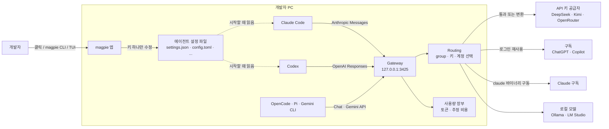
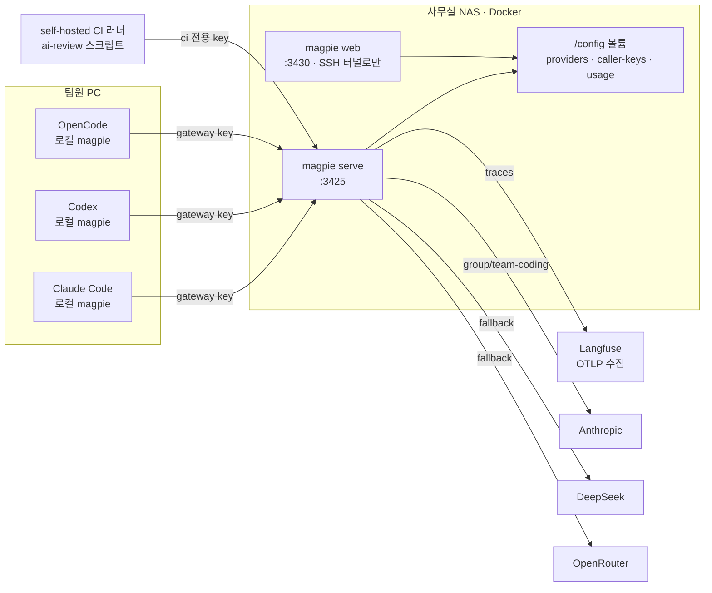
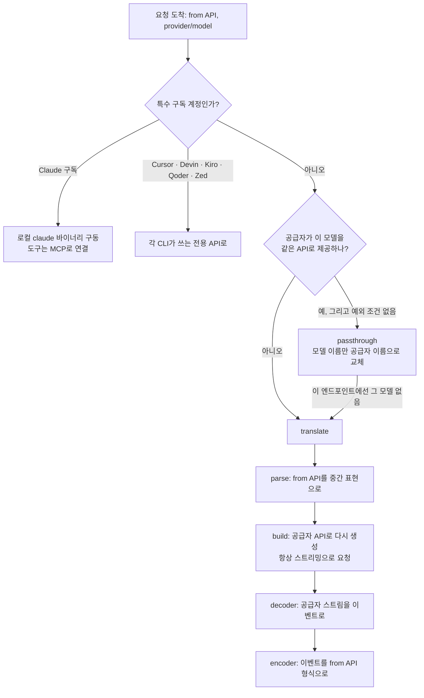
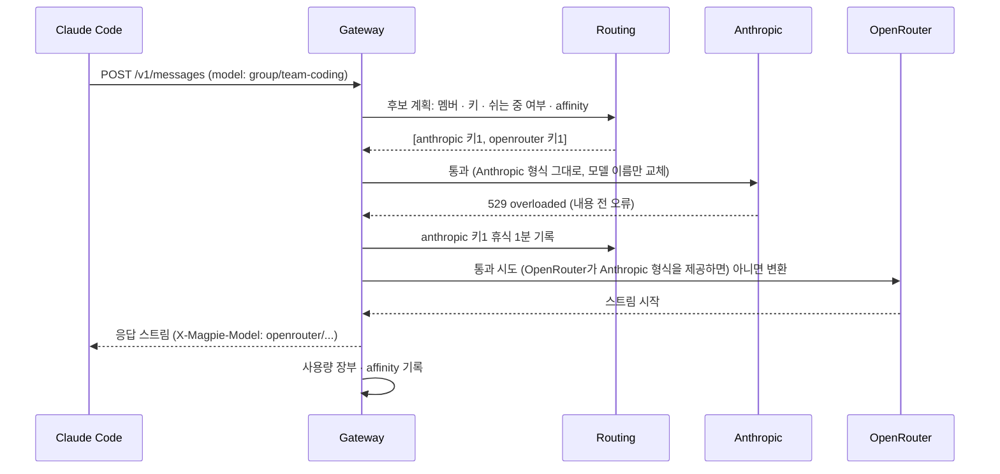

## 개요

> PC에 설치된 여러 AI 코딩 에이전트(Claude Code, Codex, Gemini CLI, OpenCode 등)의 모델 설정을 한 화면에서 바꾸고, 로컬 게이트웨이 하나로 모든 에이전트를 어떤 모델 공급자에든 연결해 주는 Go 기반 데스크톱·CLI 도구입니다.

## 30초 요약

| 항목 | 내용 |
|---|---|
| 무엇인가? | 에이전트 설정 파일 편집기 + 로컬 LLM 게이트웨이(`127.0.0.1:3425`)를 하나로 묶은 메뉴 막대 앱·TUI·CLI |
| 왜 사용하는가? | 에이전트마다 다른 설정 파일과 API 형식을 일일이 맞추지 않고, "Codex는 DeepSeek로, Claude Code는 Kimi로"를 클릭 한 번으로 바꾸기 위해 |
| 해결하는 문제 | 에이전트별로 흩어진 모델 설정, 에이전트가 쓰는 API와 공급자가 제공하는 API의 불일치, 여러 구독·키의 사용량 관리 |
| 주요 사용처 | 에이전트 모델 전환, 저렴한 모델로 비용 절감, 구독(Claude·ChatGPT·Copilot) 공유, 여러 키·계정 라우팅, 사용량·비용 추적 |
| 핵심 개념 | Agent, Provider, `provider/model` 카탈로그, Gateway(통과·변환), Routing group, Profile, Library |
| Client 사용 | O (개발자 PC에서 메뉴 막대 앱·TUI·CLI로 실행. 직접 만든 스크립트도 게이트웨이 사용 가능) |
| Server 사용 | △ (Docker 이미지로 NAS·사내 서버에 띄워 여러 컴퓨터가 공유하는 게이트웨이로 사용. 애플리케이션 서버에 import하는 라이브러리는 아님) |
| 대표 대안 | 설정 파일 직접 편집, CC Switch, claude-code-router, LiteLLM Proxy, OpenRouter |

- **설정 파일을 수술하듯 고친다**: 바꾸는 키 하나만 수정하고 주석·순서·들여쓰기를 보존하며, 쓰기는 atomic으로 처리합니다.
- **모든 에이전트가 하나의 엔드포인트를 본다**: OpenAI Chat Completions, OpenAI Responses, Anthropic Messages, Gemini API를 모두 받아서, 공급자가 같은 API를 쓰면 그대로 통과시키고 다르면 스트리밍·tool call·reasoning까지 변환합니다.
- **로그인한 구독을 공급자로 쓴다**: Claude Code, Codex(ChatGPT), Copilot 등에 로그인해 두면 그 구독이 다른 에이전트에서도 쓸 수 있는 공급자로 나타납니다.
- **여러 키·계정·모델을 하나로 묶는다**: Routing group이 남은 할당량, 사용량, 캐시 유지 여부를 보고 요청을 나눠 보내고, 실패하면 다음 후보로 넘깁니다.
- **실제 모델 목록을 쓴다**: 공급자에게 직접 모델 목록을 물어보고 models.dev 카탈로그로 이름·reasoning 단계·가격을 보완하므로, 새 모델이 나와도 업데이트 없이 선택지에 나타납니다.

---

## 어떤 도구인가?

AI 코딩 에이전트를 두세 개 이상 쓰다 보면 다음과 같은 일이 생깁니다.

- Claude Code의 모델을 바꾸려면 `~/.claude/settings.json`의 `env` 블록을 고쳐야 합니다.
- Codex는 `~/.codex/config.toml`에 `[model_providers.*]` 테이블을 추가해야 하고, 바꾼 뒤에는 재시작해야 합니다.
- OpenCode는 `opencode.jsonc`, Goose는 `config.yaml`, Gemini CLI는 `settings.json`과 `.env`를 따로 씁니다.
- Codex는 OpenAI Responses API로 말하는데, 쓰고 싶은 공급자는 Chat Completions나 Anthropic Messages API만 제공하는 경우가 많습니다. 형식이 다르면 그대로는 연결이 안 됩니다.
- Claude 구독은 Claude Code에서만, ChatGPT 구독은 Codex에서만 쓸 수 있습니다.

magpie는 이 일을 **한 화면으로 모으는 도구**입니다. 앱을 열면 PC에 설치된 에이전트와 각 에이전트에 지금 설정된 모델이 목록으로 나오고, 값을 클릭해 모델을 고르면 끝입니다. README도 "그게 앱의 전부"라고 설명합니다.

기술적으로 보면 magpie는 두 부분으로 이루어져 있습니다.

1. **설정 편집기**: 40여 종 에이전트(2026년 10월 기준)의 설정 파일 형식(JSON, JSONC, TOML, YAML, `.env`)을 알고 있어서, 모델을 바꿀 때 필요한 키만 정확히 고칩니다. magpie가 덮어쓴 원래 값은 따로 보관(`stash.json`)해 두었다가 되돌릴 때 복원합니다.
2. **로컬 게이트웨이**: `http://127.0.0.1:3425`에서 네 가지 LLM API를 받아 실제 공급자에게 전달합니다. 에이전트는 공급자의 키나 URL을 알 필요 없이 이 주소 하나만 바라보고, 모델은 `deepseek/deepseek-chat`처럼 `provider/model` 형식으로 고릅니다.

UI는 세 가지입니다. 메뉴 막대 패널(일반 창으로도 열림), 터미널 버전 `magpie tui`, 그리고 스크립트에서 쓰는 CLI가 같은 기능을 제공합니다. 데스크톱 앱은 [Wails](https://wails.io)로 시스템 webview를 써서 별도 런타임을 번들하지 않으며, macOS·Linux·Windows를 지원합니다.

magpie는 2026년 9월 23일에 공개된 매우 새로운 프로젝트이고, MIT 라이선스로 배포됩니다. 저장소 기여의 대부분은 제작자 yetone 한 사람이 하고 있습니다(2026년 10월 기준).

### 주요 사용 사례

- **에이전트 모델 전환**: `magpie claude moonshot/kimi-k2.5`처럼 명령 한 줄로 Claude Code를 Kimi 모델로 바꿉니다.
- **비싼 모델과 싼 모델 나눠 쓰기**: Claude Code의 메인 모델은 그대로 두고, 보조 작업에 쓰는 haiku 계층만 저렴한 모델로 돌립니다.
- **구독 공유**: ChatGPT 구독으로 로그인한 Codex의 모델을 OpenCode나 Pi에서 씁니다.
- **여러 계정·키 라우팅**: 같은 모델을 제공하는 공급자 여러 개를 Routing group으로 묶어, 한 곳이 할당량을 다 쓰면 다음 곳으로 넘어가게 합니다.
- **직접 만든 도구에서 사용**: OpenAI·Anthropic SDK의 base URL만 게이트웨이로 바꿔 사내 스크립트에서 같은 카탈로그를 씁니다.
- **사용량·비용 추적**: 에이전트·모델·구독 계정별 토큰과 추정 비용을 `magpie usage`로 확인합니다.

주요 용어는 [핵심 개념과 동작 구조](#h-magpie-핵심-개념과-동작-구조)에서 자세히 다룹니다.

---

## 어떤 문제를 해결하는가?

```text
요구사항: Claude Code와 Codex를 쓰는데, 작업에 따라 DeepSeek·Kimi·GLM 같은 다른 모델로 바꿔 쓰고 싶다
 ↓
일반적인 구현: 에이전트마다 설정 파일을 열어 base URL, 키, 모델 이름을 직접 고친다
 ↓
문제 발생: 파일 형식이 제각각이고, API 형식이 안 맞는 조합은 연결이 안 되며, 원래 설정으로 되돌리기 어렵다
 ↓
magpie로 해결: 설정 키만 정확히 고치고, 모든 에이전트를 로컬 게이트웨이에 연결해 API 변환을 맡긴다
```

### 상황 예시

혼자 일하는 개발자가 낮에는 회사 프로젝트를 Claude Code(회사가 준 Anthropic API 키)로, 밤에는 개인 프로젝트를 Codex(개인 ChatGPT 구독)로 작업합니다. 최근 DeepSeek 모델이 저렴하고 쓸 만하다고 해서, 단순 리팩터링이나 테스트 작성은 DeepSeek으로 돌려 보고 싶습니다.

### 일반적인 구현 방식

Claude Code를 DeepSeek의 Anthropic 호환 엔드포인트로 바꾸려면 `settings.json`을 직접 고칩니다.

```json
// ~/.claude/settings.json : 손으로 고친 경우
{
  "env": {
    "ANTHROPIC_BASE_URL": "https://api.deepseek.com/anthropic",
    "ANTHROPIC_AUTH_TOKEN": "sk-deepseek-...",
    "ANTHROPIC_MODEL": "deepseek-chat",
    "ANTHROPIC_SMALL_FAST_MODEL": "deepseek-chat"
  }
}
```

Codex도 DeepSeek으로 바꾸려면 `config.toml`에 공급자 테이블을 추가해야 합니다. 그런데 최근 Codex는 Responses API(`wire_api = "responses"`)를 기준으로 동작하고, DeepSeek을 비롯한 많은 공급자는 Chat Completions나 Anthropic Messages 형식만 제공합니다.

```toml
# ~/.codex/config.toml : 손으로 고친 경우
model = "deepseek-chat"
model_provider = "deepseek"

[model_providers.deepseek]
name = "DeepSeek"
base_url = "https://api.deepseek.com/v1"
env_key = "DEEPSEEK_API_KEY"
# Codex가 기대하는 API와 DeepSeek이 제공하는 API가 달라 그대로는 동작하지 않는다
```

### 이 방식에서 발생하는 문제

- **에이전트마다 다른 형식**: JSON, TOML, YAML, `.env`를 각각 알아야 하고, 키 이름도 에이전트마다 다릅니다.
- **API 불일치**: 에이전트가 말하는 API와 공급자가 제공하는 API가 다르면 중간 변환 서버를 따로 띄워야 합니다.
- **되돌리기 어려움**: 회사 키로 돌아가려면 원래 값을 기억해 두었다가 다시 써야 합니다. 주석이나 다른 설정을 실수로 지우기도 쉽습니다.
- **키가 여기저기 흩어짐**: 공급자 키가 각 에이전트 설정 파일에 복사되어 남습니다.
- **구독이 에이전트에 묶임**: ChatGPT 구독은 Codex에서만, Claude 구독은 Claude Code에서만 쓸 수 있습니다.
- **사용량이 흩어짐**: 어떤 에이전트가 어느 공급자에서 얼마를 썼는지 한곳에서 볼 수 없습니다.

### magpie를 사용하면

같은 요구사항이 명령 몇 줄로 끝납니다. 설치와 호출 방법은 [설치와 첫 사용](#h-magpie-설치와-첫-사용)에서 다룹니다.

```bash
magpie provider add deepseek sk-...          # 키는 magpie에만 저장
magpie claude deepseek/deepseek-chat         # Claude Code → 게이트웨이 → DeepSeek
magpie codex deepseek/deepseek-chat          # Codex도 같은 모델로 (Responses → Chat 변환)
magpie claude default                        # 원래 설정으로 복귀
```

- 에이전트 설정 파일에는 게이트웨이 주소와 magpie 토큰만 들어가고, 실제 공급자 키는 magpie의 `providers.json`(권한 0600)에만 있습니다.
- Codex가 보낸 Responses API 요청은 게이트웨이가 DeepSeek이 이해하는 형식으로 변환합니다.
- magpie가 덮어쓴 원래 값은 보관되어 있다가 되돌릴 때 복원됩니다.

> **핵심:** 에이전트별 설정 파일 편집과 API 형식 변환을 개발자가 직접 관리하는 대신, magpie가 **설정 키만 정확히 고치는 편집기와 모든 API를 받아 주는 로컬 게이트웨이**로 처리해 줍니다.

---

## 왜 주목받고 있는가?

magpie는 공개 후 2주가 안 되어 GitHub Star 4,800개, Fork 340개를 넘겼습니다(2026년 10월 기준). 주목받는 이유는 다음과 같습니다.

**에이전트와 모델이 동시에 늘어났습니다.** 코딩 에이전트는 Claude Code, Codex, Gemini CLI를 넘어 OpenCode, Pi, Goose, Crush, Kimi Code, Droid 등으로 늘었고, 모델 공급자도 DeepSeek, Kimi, GLM, Qwen, MiniMax 같은 저렴한 선택지가 많아졌습니다. "에이전트 × 모델" 조합이 폭발하면서 이 조합을 관리하는 계층이 필요해졌습니다.

**API 표준이 세 갈래로 나뉘었습니다.** OpenAI는 Responses API로 옮겨 가고, Anthropic은 Messages API를, Google은 Gemini API를 씁니다. 에이전트는 보통 그중 하나만 말하므로, 중간에서 변환해 주는 게이트웨이의 가치가 커졌습니다.

**개발자 PC에 맞춘 경험입니다.** LiteLLM 같은 게이트웨이는 서버에 띄우고 YAML로 설정하는 방식이 기본입니다. magpie는 메뉴 막대 앱으로 시작해서, "어떤 에이전트가 설치되어 있는지 자동으로 찾고 클릭으로 바꾸는" 데스크톱 경험에 집중합니다.

**구독을 다른 에이전트에서도 쓸 수 있습니다.** 이미 비용을 내고 있는 Claude·ChatGPT·Copilot 구독을 다른 에이전트에서 쓸 수 있다는 점이 큰 관심을 받았습니다. 다만 공급자 약관과 계정 정지 위험이 함께 따르므로 [주의할 점과 FAQ](#h-magpie-주의할-점과-faq)를 꼭 확인해야 합니다.

**개발 속도가 매우 빠릅니다.** 릴리스 전용 저장소(`yetone/magpie-releases`)에 공개 후 2주 동안 900개가 넘는 릴리스가 올라왔고(2026년 10월 4일 v0.1.928), 하루에도 수십 번 새 버전이 나옵니다. 새 에이전트나 공급자 지원 요청이 빠르게 반영되는 대신, 동작이 자주 바뀐다는 뜻이기도 합니다.

설정 파일 직접 편집이나 다른 도구와의 항목별 차이는 [장단점과 대안 비교](#h-magpie-장단점과-대안-비교)에 정리했습니다.

---

## 언제 사용하면 좋은가?

- **코딩 에이전트를 두 개 이상 쓰는 경우**: 에이전트마다 다른 설정 형식을 외울 필요가 없고, 한 화면에서 전체 상태를 볼 수 있습니다.
- **모델을 자주 바꿔 가며 비교하는 경우**: 새 모델이 나올 때마다 같은 작업을 여러 모델로 돌려 보는 사람에게는 전환 비용이 거의 0이 됩니다.
- **에이전트의 API와 쓰고 싶은 모델의 API가 다른 경우**: Codex를 Responses API가 없는 공급자에 붙이거나, Gemini CLI를 다른 공급자 모델로 돌리는 조합은 게이트웨이 변환 없이는 어렵습니다.
- **구독과 API 키를 여러 개 갖고 있는 경우**: Routing group으로 할당량이 남은 쪽부터 쓰고, 다 쓰면 다음으로 넘기는 운영이 자동화됩니다.
- **회사·개인 설정을 오가는 경우**: Profile로 모든 에이전트 설정을 이름으로 저장하고 한 번에 바꿉니다.
- **에이전트 사용 비용을 한곳에서 보고 싶은 경우**: 모든 호출이 게이트웨이를 거치므로 에이전트·모델·계정별 사용량이 한 장부에 쌓입니다.

---

## 언제 사용하지 않는 것이 좋은가?

- **에이전트 하나, 모델 하나만 쓰는 경우**: Claude Code를 Anthropic 모델로만 쓴다면 바꿀 것이 없습니다. 로컬 게이트웨이라는 중간 계층만 하나 늘어납니다.
  > 예: 회사에서 Claude Code + 회사 API 키만 쓰는 개발자는 `settings.json` 그대로가 가장 단순합니다.
- **설정 파일을 사람이 직접 통제해야 하는 환경**: magpie는 에이전트 설정 파일을 직접 고칩니다. 설정을 Git으로 관리하거나 MDM으로 배포하는 조직이라면, 도구가 파일을 바꾸는 것 자체가 문제가 될 수 있습니다.
- **변화가 적은 안정적인 도구가 필요한 경우**: 아직 0.1.x 버전이고 하루에 수십 번 릴리스가 나옵니다. 자동 업데이트로 동작이 바뀌는 것이 부담스러운 환경에는 맞지 않습니다.
- **서버 애플리케이션의 LLM 게이트웨이가 필요한 경우**: 서비스 트래픽을 처리하는 프로덕션 게이트웨이라면 LiteLLM Proxy나 클라우드 게이트웨이처럼 그 용도로 설계된 도구가 적합합니다. magpie의 서버 모드는 "여러 개발자 PC가 공유하는 게이트웨이"에 가깝습니다.
- **구독 공유에 따른 약관·계정 위험을 감수할 수 없는 경우**: 구독 로그인을 다른 에이전트에서 쓰는 기능은 공급자 정책에 따라 제한되거나 계정이 정지될 수 있습니다. 회사 계정이라면 API 키 공급자만 쓰는 편이 안전합니다.
- **보안 검토 없이 서명되지 않은 바이너리를 쓸 수 없는 경우**: macOS 빌드는 서명·공증되어 있지만 Windows와 Linux 빌드는 아직 서명되지 않았습니다.

---

## 한눈에 정리

| 항목 | 내용 |
|---|---|
| 라이브러리 | magpie (GitHub `yetone/magpie`, 사이트 usemagpie.ai) |
| 주요 목적 | 여러 코딩 에이전트의 모델 설정을 한 곳에서 바꾸고, 하나의 로컬 게이트웨이로 모든 공급자에 연결 |
| 해결하는 문제 | 에이전트별로 다른 설정 형식, 에이전트와 공급자의 API 불일치, 흩어진 키·구독·사용량 |
| 핵심 개념 | Agent, Provider, `provider/model`, Gateway(통과·변환), Signed-in 구독, Routing group, Profile, Library |
| 주요 사용처 | 모델 전환, 비용 절감, 구독 공유, 여러 키·계정 라우팅, 사용량 추적 |
| Client 활용 | 메뉴 막대 앱·TUI·CLI로 에이전트 설정 관리, 직접 만든 스크립트에서 OpenAI·Anthropic SDK로 게이트웨이 사용 |
| Server 활용 | Docker 이미지로 NAS·사내 서버에 공유 게이트웨이 운영, gateway key와 사용 한도, OTLP 내보내기 |
| 장점 | 설정 키만 고치는 편집, 4개 API 상호 변환, 실제 모델 목록, 라우팅·Fallback, 통합 사용량 장부 |
| 단점 | 매우 잦은 변경, 구독 공유의 약관·정지 위험, 변환 과정의 호환성 문제, 1인 중심 개발 |
| 추천 상황 | 에이전트 여러 개와 모델·공급자 여러 개를 오가며 쓰는 개인·소규모 팀 |
| 비추천 상황 | 에이전트·모델 하나만 쓰는 경우, 설정을 중앙에서 통제하는 조직, 프로덕션 서비스 게이트웨이 |
| 대표 대안 | 설정 파일 직접 편집, CC Switch, claude-code-router, LiteLLM Proxy, OpenRouter |

---

## 핵심 정리

### 한 문장으로

> magpie는 에이전트마다 흩어진 모델 설정과 서로 다른 API 형식 문제를 **설정 키만 정확히 고치는 편집기와 네 가지 API를 상호 변환하는 로컬 게이트웨이**로 해결하기 위한 데스크톱·CLI 도구입니다.

### 이것만 기억하기

1. **왜 사용하는가?**
   - 여러 코딩 에이전트의 모델을 설정 파일을 직접 열지 않고 한 화면에서 바꾸고, 어떤 에이전트든 어떤 공급자 모델에든 붙이기 위해서입니다.

2. **어떤 문제를 해결하는가?**
   - 에이전트마다 다른 설정 형식, 에이전트와 공급자의 API 불일치, 원래 설정으로 되돌리기 어려운 문제, 흩어진 키·구독·사용량 문제입니다.

3. **어떻게 동작하는가?**
   - 에이전트 설정 파일에는 게이트웨이 주소와 `provider/model` 이름만 쓰고, 게이트웨이가 요청을 받아 공급자가 같은 API를 쓰면 통과, 다르면 변환해서 전달합니다. Routing group이 여러 키·계정·모델 중 누구에게 보낼지 정합니다.

4. **실제 프로젝트에서는 어디에 사용하는가?**
   - 개인 PC의 에이전트 모델 전환과 비용 절감, 직접 만든 스크립트의 LLM 호출, 소규모 팀이 공유하는 사내 게이트웨이와 사용량 관리에 씁니다.

5. **언제 사용하지 않는가?**
   - 에이전트와 모델을 하나만 쓰는 경우, 설정 파일을 중앙에서 통제해야 하는 조직, 안정성이 중요한 프로덕션 서비스 게이트웨이에는 맞지 않습니다.

6. **비슷한 기술과 가장 큰 차이는 무엇인가?**
   - 설정 전환 도구(CC Switch)와 게이트웨이(LiteLLM, claude-code-router)의 역할을 하나로 합쳐, **설치된 에이전트를 찾아 설정을 고치는 일과 API 변환을 함께** 한다는 점입니다. 대신 변화가 매우 빠르고 구독 공유에는 약관 위험이 따르므로, 쓰는 기능을 좁혀서 쓰는 것이 좋습니다.

## magpie 핵심 개념과 동작 구조

> magpie를 이루는 Agent, Provider, `provider/model` 카탈로그, Gateway, 로그인한 구독, Routing group, Profile, Library가 각각 무엇이고 어떻게 맞물려 동작하는지 다룹니다.

### 용어 한눈에 보기

| 키워드 | 설명 |
|---|---|
| Agent | PC에 설치된 AI 코딩 도구. Claude Code, Codex, Gemini CLI, OpenCode, Pi, Goose 등 40여 종(2026년 10월 기준) |
| Provider | 모델을 실제로 제공하는 곳. API 키 공급자(DeepSeek, Kimi 등), 로컬 서버(Ollama), 로그인한 구독(Claude, ChatGPT, Copilot) |
| Preset | magpie가 미리 알고 있는 공급자. 키만 넣으면 엔드포인트와 모델 목록이 채워짐 |
| `provider/model` | magpie 카탈로그의 모델 이름 형식. 예: `deepseek/deepseek-chat`, `codex/gpt-5.5` |
| Gateway | `127.0.0.1:3425`에서 네 가지 LLM API를 받아 공급자에게 전달하는 로컬 서버 |
| Routing group | 여러 모델·키·계정을 `group/<id>` 하나로 묶어 요청을 나눠 보내는 단위 |
| Profile | 모든 에이전트의 현재 설정을 이름으로 저장한 스냅숏 |
| Library | 지침(instructions), MCP 서버, Skill을 한 번 등록해 여러 에이전트에 나눠 주는 저장소 |

---

### 1. Agent와 설정 파일 편집

#### 쉽게 설명하면

집에 TV, 에어컨, 셋톱박스 리모컨이 따로 있는 상황에서, 모든 기기를 하나로 조작하는 통합 리모컨과 같습니다. 통합 리모컨은 기기마다 다른 신호 방식을 알고 있어서, 사용자는 "채널 7"만 누르면 됩니다.

#### 개발 관점에서는

magpie는 지원하는 에이전트마다 **설정 파일 위치, 형식, 바꿀 수 있는 필드**를 알고 있습니다. 시작할 때 설치되었거나 설정 파일이 있는 에이전트만 찾아서 보여 줍니다.

| Agent | 설정 파일 | 바꿀 수 있는 필드 |
|---|---|---|
| Claude Code | `~/.claude/settings.json` | provider, model, opus/sonnet/haiku 계층별 모델 |
| Codex | `~/.codex/config.toml` | provider, model, effort |
| Gemini CLI | `~/.gemini/settings.json`, `~/.gemini/.env` | auth, model |
| OpenCode | `~/.config/opencode/opencode.json(c)` | model, small |
| Goose | `~/.config/goose/config.yaml` | model |
| Crush | `~/.config/crush/crush.json` | large, small |

편집 방식에는 세 가지 원칙이 있습니다.

- **바꾸는 키만 고칩니다.** `internal/edit` 패키지가 JSON·JSONC·TOML·YAML·`.env`를 형식별로 다루며, 주석·키 순서·들여쓰기를 보존합니다. 파일을 통째로 다시 직렬화하지 않습니다.
- **쓰기는 atomic입니다.** 중간에 실패해도 반쯤 쓰인 설정 파일이 남지 않습니다.
- **원래 값을 보관합니다.** magpie가 에이전트를 게이트웨이로 돌릴 때 덮어쓴 값(예: 원래 `ANTHROPIC_BASE_URL`)은 `~/.config/magpie/stash.json`에 저장해 두었다가, `magpie <agent> default`로 되돌릴 때 그대로 복원합니다.

#### 예제

Claude Code를 게이트웨이 모델로 바꾸면 `settings.json`에 들어가는 주요 키는 다음과 같습니다(실제로는 opus·sonnet·haiku 계층별 모델 변수도 함께 들어갑니다).

```json
{
  "model": "deepseek/deepseek-chat",
  "env": {
    "ANTHROPIC_BASE_URL": "http://127.0.0.1:3425",
    "ANTHROPIC_AUTH_TOKEN": "magpie",
    "ANTHROPIC_SMALL_FAST_MODEL": "deepseek/deepseek-chat"
  }
}
```

공급자 키는 들어가지 않습니다. Claude Code는 게이트웨이에 `magpie`라는 토큰으로 접속하고, 실제 키는 magpie만 갖고 있습니다. `opus`, `sonnet` 같은 네이티브 모델을 다시 고르면 이 키들을 지우고 보관해 둔 원래 값을 되돌립니다.

Codex는 ChatGPT로 로그인되어 있는지에 따라 쓰는 방식이 다릅니다. 로그인되어 있으면 `openai_base_url`만 게이트웨이로 바꿔서 Codex의 기본 OpenAI 공급자와 로그인을 그대로 유지하고, 그렇지 않으면 `[model_providers.magpie]` 테이블(`wire_api = "responses"`)과 모델 카탈로그 파일(`~/.codex/magpie-models.json`)을 추가해 magpie를 별도 공급자로 등록합니다.

#### 핵심

> magpie는 설정 파일의 "주인"이 되지 않습니다. 필요한 키만 빌려 쓰고, 빌린 키는 원래 값과 함께 기록해 두었다가 돌려줍니다.

### 2. Provider와 Preset

#### 쉽게 설명하면

음식 배달 앱의 "가게 목록"과 같습니다. 유명한 가게(Preset)는 이미 등록되어 있어서 계정만 연결하면 되고, 동네 작은 가게(사용자 정의 공급자)는 이름과 주소만 직접 적으면 됩니다.

#### 개발 관점에서는

Provider는 모델 요청을 실제로 처리하는 대상입니다. 네 종류가 있습니다.

- **Preset 공급자**: Anthropic, OpenAI, Gemini, DeepSeek, Kimi, GLM, MiniMax, Qwen, Mistral, Groq, xAI, OpenRouter, Together, Fireworks, SiliconFlow 등. 키만 있으면 엔드포인트와 모델 목록이 채워집니다.
- **로컬 서버**: Ollama, LM Studio. 키가 필요 없습니다.
- **사용자 정의 공급자**: 이름과 base URL만 있으면 됩니다. OpenAI 호환(`url=`), Anthropic 호환(`anthropic=`), 별도 Responses 엔드포인트(`responses=`)를 각각 지정할 수 있습니다.
- **로그인한 구독**: 아래에서 따로 다룹니다.

magpie는 **셸 환경 변수의 키를 읽지 않습니다.** `OPENAI_API_KEY`가 셸에 있어도 자동으로 쓰지 않고, 명시적으로 추가한 키만 `~/.config/magpie/providers.json`(권한 0600)에 저장해 씁니다.

#### 예제

```bash
magpie presets                              # 아는 공급자 목록: vendors, relays, local
magpie provider add deepseek sk-...         # Preset은 키만
magpie provider add ollama                  # 로컬 서버는 키 없이
magpie provider add "My Relay" url=https://relay.example.com/v1 key=sk-... models=gpt-5.5,claude-sonnet-5
magpie provider test deepseek               # API마다 작은 요청 하나로 지연 시간 확인
```

#### 핵심

> Provider는 "어디서 모델을 가져오는가"입니다. 키는 magpie에만 있고, 에이전트는 공급자를 직접 알지 못합니다.

### 3. `provider/model` 카탈로그

#### 쉽게 설명하면

도서관의 청구 기호와 같습니다. 같은 책 제목이라도 어느 서가에 있는지까지 적어야 정확히 찾을 수 있습니다.

#### 개발 관점에서는

magpie에서 모든 모델은 `provider/model` 형식으로 부릅니다. 같은 `claude-sonnet-5`라도 Anthropic 키로 부르면 `anthropic/claude-sonnet-5`, Copilot 구독으로 부르면 `copilot/claude-sonnet-4.5`처럼 공급자가 이름에 들어갑니다. 그래서 "같은 모델을 어느 경로로 부를지"가 이름만 보고 분명해집니다.

카탈로그는 컴파일 시점에 고정되어 있지 않습니다.

1. 키가 있으면 공급자에게 직접 모델 목록을 물어봅니다.
2. [models.dev](https://models.dev) 카탈로그로 사람이 읽을 이름, 지원하는 reasoning 단계, 가격, context window를 보완합니다.
3. 목록 API가 없는 공급자는 models.dev 목록을 그대로 씁니다.

오늘 아침 나온 모델도 다음 갱신(`magpie sync`) 때 선택지에 나타나는 이유입니다. 공급자별로 어떤 모델을 노출할지 고를 수 있고, 에이전트별로 선택지에서 특정 모델을 숨길 수도 있습니다.

#### 예제

```bash
magpie models                         # 에이전트가 보는 전체 카탈로그
magpie models codex                   # Codex가 볼 수 있는 모델과, 못 보는 모델은 왜 못 보는지
magpie provider models deepseek       # 공급자 목록 다시 가져오기
magpie sync                           # models.dev와 모든 공급자 목록 갱신
```

#### 핵심

> 모델 이름에 공급자가 들어가 있으므로, 같은 모델을 여러 경로로 부를 수 있고 비용과 사용량도 경로별로 따로 계산됩니다.

### 4. Gateway (통과와 변환)

#### 쉽게 설명하면

국제회의의 동시통역 부스와 같습니다. 같은 언어를 쓰는 사람끼리는 통역 없이 바로 이야기하고(통과), 언어가 다를 때만 통역사가 끼어듭니다(변환).

#### 개발 관점에서는

Gateway는 magpie 앱과 함께 시작되는 로컬 HTTP 서버입니다. 기본 주소는 `127.0.0.1:3425`이고 `MAGPIE_ADDR`로 바꿀 수 있으며, `magpie serve`로 게이트웨이만 따로 실행할 수도 있습니다.

| 경로 | API |
|---|---|
| `/v1/chat/completions` | OpenAI Chat Completions |
| `/v1/responses` | OpenAI Responses |
| `/v1/messages` | Anthropic Messages |
| `/v1/messages/count_tokens` | Anthropic 토큰 계산 |
| `/v1beta/models/{model}:generateContent` | Google Gemini (`:streamGenerateContent`, `:countTokens` 포함) |
| `/v1/models`, `/v1beta/models` | 카탈로그 |

요청이 들어오면 게이트웨이는 모델 이름에서 공급자를 찾고, **공급자가 에이전트와 같은 API로 그 모델을 제공하면 그대로 통과**시킵니다. 이때 모델 이름만 공급자가 아는 이름으로 바꿉니다. 같은 API가 없으면 요청을 공통 중간 표현으로 파싱한 뒤 공급자의 API 형식으로 다시 만들어 보내고, 스트리밍 응답도 이벤트 단위로 에이전트의 형식에 맞춰 돌려줍니다. 텍스트뿐 아니라 tool call, reasoning(thinking), 이미지, 웹 검색 결과까지 변환 대상입니다.

로컬에서만 듣고 있는 동안에는 **어떤 키 값이든 받습니다.** 관례적으로 `magpie`를 씁니다. 다른 컴퓨터와 공유할 때는 gateway key가 필요해지며, [팀 공유 게이트웨이와 운영](#h-magpie-활용-예시-③-팀-공유-게이트웨이와-운영)에서 다룹니다.

#### 예제

```bash
# 게이트웨이를 아는 어떤 도구든 base URL만 바꾸면 된다
export OPENAI_BASE_URL=http://127.0.0.1:3425/v1
export OPENAI_API_KEY=magpie

curl -s http://127.0.0.1:3425/v1/chat/completions \
  -H "Authorization: Bearer magpie" \
  -H "Content-Type: application/json" \
  -d '{"model":"deepseek/deepseek-chat","messages":[{"role":"user","content":"ping"}]}'
```

통과와 변환을 어떻게 결정하는지는 [게이트웨이 내부](#h-magpie-게이트웨이-내부-변환-라우팅-fallback)에서 소스 코드와 함께 자세히 다룹니다.

#### 핵심

> 에이전트는 자기가 아는 API 하나로만 말하고, 공급자가 다른 API를 쓰는 차이는 게이트웨이가 흡수합니다.

### 5. 로그인한 구독을 공급자로

#### 쉽게 설명하면

이미 끊어 둔 헬스장 회원권을 다른 지점에서도 쓸 수 있게 해 주는 것과 같습니다. 새 회원권을 사지 않고, 가진 회원증을 그대로 보여 줍니다.

#### 개발 관점에서는

Claude Code(OAuth 로그인), Codex(ChatGPT 로그인), Copilot(GitHub 로그인), Devin, Qoder 등에 로그인해 두면, magpie는 그 로그인을 **공급자로 보여 줍니다.** 모델은 `claude/claude-sonnet-5`, `codex/gpt-5.5`, `copilot/claude-sonnet-4.5`처럼 부릅니다.

- magpie는 키를 복사해 두지 않고 **매 요청마다 에이전트의 자격 증명 파일을 읽습니다.** 토큰이 갱신되면 에이전트가 찾을 수 있는 위치에 다시 써 줍니다.
- 에이전트에서 로그아웃하면 그 공급자도 사라집니다.
- Claude 구독은 방식이 다릅니다. Anthropic이 다른 에이전트의 시스템 프롬프트를 제3자 트래픽으로 분류하기 때문에, magpie는 **로컬에 설치된 진짜 `claude` 바이너리를 직접 구동**하고, 호출한 에이전트의 도구는 MCP로 연결합니다. 그래서 Claude 구독을 쓰려면 Claude Code가 설치되어 로그인되어 있어야 합니다.
- Google 계정(Gemini CLI, Antigravity)은 Code Assist API를 씁니다. Gemini CLI 로그인은 이제 개인 계정이 아니라 Gemini Code Assist Standard·Enterprise에만 제공되며 Google Cloud 프로젝트 지정이 필요합니다.

#### 예제

```bash
magpie providers                      # "signed in as ..."로 표시되는 구독 공급자 확인
magpie opencode codex/gpt-5.5         # ChatGPT 구독 모델을 OpenCode에서
magpie accounts                       # 구독별 남은 할당량과 리셋 시각
magpie accounts add codex             # ChatGPT 계정 하나 더 추가
```

#### 핵심

> 구독 공급자는 편리하지만 공급자 정책의 영향을 직접 받습니다. 계정 정지 위험과 약관 문제는 [주의할 점과 FAQ](#h-magpie-주의할-점과-faq)에서 다룹니다.

### 6. Routing group

#### 쉽게 설명하면

콜센터의 자동 상담원 배정과 같습니다. 고객은 대표 번호 하나로 전화하고, 시스템이 지금 여유 있는 상담원에게 연결합니다. 상담 중이던 고객이 다시 전화하면 가능하면 같은 상담원에게 연결합니다.

#### 개발 관점에서는

Routing group은 여러 모델(한 공급자든 여러 공급자든)을 `group/<id>` 하나로 묶은 것입니다. 에이전트는 그룹을 모델처럼 고르고, 게이트웨이가 요청마다 멤버의 키와 계정 전체를 대상으로 누구에게 보낼지 정합니다. 두 공급자가 같은 이름의 모델을 제공하면 magpie가 자동으로 그룹을 만들기도 합니다.

| 설정 | 값 | 의미 |
|---|---|---|
| `routing=` | `smart`(기본) | 할당량이 남은 구독 중 리셋이 가장 빨리 오는 것부터 |
| | `order` | 첫 멤버가 실패할 때까지 쓰고, 그다음 멤버로 |
| | `rotate` | 턴마다 다음 멤버로 |
| | `usage` | 최근 사용량이 가장 적은 것부터 |
| | `pace` | 주간 할당량 대비 남은 비율이 가장 큰 계정부터 |
| `stays=` | `auto`(기본) | 공급자의 프롬프트 캐시가 유지할 가치가 있는 동안 같은 키·계정에 머묾 |
| | `session` / `turn` / `off` | 세션 내내 / 한 턴 동안만 / 머물지 않음 |

#### 예제

```bash
magpie group add "Opus anywhere" \
  models=claude/claude-opus-5-5,copilot/claude-opus-5.5 \
  routing=order stays=session
magpie claude group/opus-anywhere     # 그룹을 모델처럼 사용
magpie groups                         # 직접 만든 그룹과 magpie가 찾은 그룹
```

#### 핵심

> Routing group은 "어떤 모델을"이 아니라 "이 모델들 중 지금 누가"를 정합니다. 할당량 소진, 장애, 캐시 유지까지 고려해 요청을 나눕니다.

### 7. Profile과 Library

#### 쉽게 설명하면

Profile은 자동차 운전석의 "메모리 시트" 버튼입니다. 1번을 누르면 내 자세, 2번을 누르면 가족의 자세로 한 번에 돌아갑니다. Library는 모든 직원에게 같은 사내 매뉴얼과 도구 상자를 나눠 주는 비품실입니다.

#### 개발 관점에서는

- **Profile**: 모든 에이전트의 현재 설정(모델, effort 등)을 이름으로 저장하고 한 번에 되돌립니다. `~/.config/magpie/profiles.json`에 저장됩니다.
- **Library**: 에이전트가 대화 전에 읽는 지침, 호출할 수 있는 MCP 서버, 로드할 수 있는 Skill을 한 번 등록하면, magpie가 각 에이전트의 형식에 맞게 써 넣습니다. 지울 때는 **magpie가 쓴 것만** 가져가고 나머지 설정은 건드리지 않습니다. 최근에 빠르게 커지고 있는 기능입니다.

#### 예제

```bash
magpie save work                              # 현재 모든 에이전트 설정을 "work"로 저장
magpie use work                               # 한 번에 되돌리기

magpie library instructions set ./AGENTS.md   # 공통 지침 등록
magpie library mcp add github npx -y @modelcontextprotocol/server-github agents=claude,codex
magpie library                                # 에이전트별로 무엇이 들어가 있는지
```

#### 핵심

> Profile은 "모델 설정"의 묶음이고, Library는 "모델 밖의 공통 자산(지침·MCP·Skill)"의 묶음입니다.

---

### 8. 전체 동작 구조

magpie는 애플리케이션 코드에 import되는 라이브러리가 아니라, **에이전트와 모델 공급자 사이에 서는 로컬 프로세스**입니다.



한 번의 요청이 처리되는 순서는 다음과 같습니다.

1. **시작점**: 개발자가 `magpie codex deepseek/deepseek-chat`을 실행하면 magpie가 Codex의 `config.toml`에서 필요한 키만 고치고, 원래 값은 보관합니다. Codex는 시작할 때 설정을 읽으므로 이미 실행 중인 세션은 재시작해야 새 모델을 씁니다.
2. **magpie가 개입하는 시점**: Codex가 작업 중 모델을 호출하면, 요청은 OpenAI가 아니라 게이트웨이의 `/v1/responses`로 갑니다.
3. **내부 처리**: 게이트웨이가 모델 이름 `deepseek/deepseek-chat`에서 공급자를 찾습니다. 그룹이라면 Routing이 후보 순서를 정합니다. DeepSeek이 Responses API로 그 모델을 제공하지 않으므로, 요청을 중간 표현으로 파싱해 Chat Completions 형식으로 다시 만듭니다.
4. **외부 시스템과의 연결**: magpie가 저장해 둔 DeepSeek 키로 공급자에 스트리밍 요청을 보내고, 돌아오는 이벤트를 Responses 형식으로 바꿔 Codex에 흘려보냅니다. 실패하면 응답을 한 바이트도 보내기 전에 한해 다음 후보로 넘어갑니다.
5. **결과 반환**: Codex는 원래 OpenAI와 이야기하는 것처럼 답을 받습니다. 게이트웨이는 토큰 수, 응답한 모델, 사용한 키·계정, 추정 비용을 사용량 장부에 기록합니다.

## magpie 설치와 첫 사용

> 설치 방법을 고르는 기준, 첫 공급자 등록, 에이전트 모델을 바꾸고 되돌리는 가장 간단한 흐름, 설치할 때 자주 겪는 문제를 다룹니다.

### 설치

magpie는 Go로 작성된 단일 바이너리입니다. 데스크톱 앱을 포함한 빌드는 약 30MB(macOS 다운로드는 15MB 정도)이고, 터미널 전용 빌드도 있습니다(2026년 10월 기준).

**방법 1. 설치 스크립트(권장)**

```bash
curl -fsSL https://usemagpie.ai/install.sh | sh
```

macOS·Windows·Linux용 앱을 [usemagpie.ai](https://usemagpie.ai)에서 직접 내려받아도 됩니다. Linux에서는 WebKitGTK 4.1이 설치되어 있으면 데스크톱 앱이, 없으면 터미널 전용 명령이 설치됩니다.

방화벽 안이거나 GitHub에 접근하기 어려운 환경이라면 프록시나 미러를 지정합니다. 미러를 써도 다운로드 파일의 SHA-256은 usemagpie.ai에서 받아 검증합니다.

```bash
curl -fsSL https://usemagpie.ai/install.sh | sh -s -- --proxy http://127.0.0.1:7890
```

**방법 2. 소스에서 설치**

```bash
go install github.com/yetone/magpie@latest
```

데스크톱 앱까지 직접 빌드하려면 저장소를 받아 `make build`(cgo와 플랫폼 webview 필요) 또는 `make cli`(터미널 전용, cgo 없이 크로스 컴파일)를 씁니다. Linux 앱 빌드에는 `libgtk-3-dev`와 `libwebkit2gtk-4.1-dev`가 필요합니다.

**방법 3. Docker (서버·NAS용)**

```bash
docker run -d --name magpie \
  -p 127.0.0.1:3425:3425 -p 127.0.0.1:3430:3430 \
  -v magpie-config:/config \
  ghcr.io/yetone/magpie:latest
```

Docker 이미지는 터미널 전용 바이너리를 nonroot로 실행하는 서버용입니다. 개발자 PC에 설치된 에이전트를 찾아 설정해 주는 기능은 없으므로, 개인 PC에서는 방법 1을 쓰고 Docker는 공유 게이트웨이를 띄울 때 씁니다. 자세한 구성은 [팀 공유 게이트웨이와 운영](#h-magpie-활용-예시-③-팀-공유-게이트웨이와-운영)에서 다룹니다.

설치된 앱은 백그라운드에서 새 버전을 받아 두었다가 재시작하거나 종료할 때 설치합니다. 터미널에서는 `magpie update`로 같은 일을 합니다.

### 기본 설정

처음 할 일은 공급자 하나를 등록하는 것입니다.

```bash
magpie                                  # 앱 실행: 창 + 메뉴 막대 아이콘
magpie ls                               # 감지된 에이전트와 현재 설정 확인

magpie provider add deepseek sk-...     # Preset 공급자는 키만
magpie provider test deepseek           # 각 API로 작은 요청을 보내 지연 시간 확인
magpie models                           # 에이전트가 볼 카탈로그
```

앱에서는 *Providers* 탭의 *Add provider*를 누르고 Preset 타일을 고른 뒤 키를 붙여 넣으면 됩니다. 이미 Claude Code나 Codex에 로그인해 있다면, 별도 등록 없이 그 구독이 `signed in as ...` 공급자로 나타납니다.

자주 쓰는 환경 변수는 다음과 같습니다.

```bash
export MAGPIE_ADDR=127.0.0.1:3425   # 게이트웨이 주소 (기본값)
export MAGPIE_DEBUG=1               # 게이트웨이가 변환하는 내용을 터미널에 출력
export DO_NOT_TRACK=1               # 하루 한 번 보내는 사용자 수 집계 끄기 (MAGPIE_NO_STATS=1도 가능)
```

### 가장 간단한 예제

Claude Code의 모델을 DeepSeek으로 바꿨다가 되돌려 봅니다.

```bash
magpie claude deepseek/deepseek-chat    # 1. 모델 변경
claude                                  # 2. 새 세션 시작
magpie usage today                      # 3. 사용량 확인
magpie claude default                   # 4. 원래 설정으로 복귀
```

1. **무엇을 생성하는가**: magpie가 `~/.claude/settings.json`에 게이트웨이 주소(`ANTHROPIC_BASE_URL`), 토큰(`ANTHROPIC_AUTH_TOKEN=magpie`), 모델 이름을 씁니다. 원래 있던 값은 `stash.json`에 보관합니다. 에이전트 이름은 `cc`, `oc`, `gem`처럼 앞부분만 써도 인식합니다.
2. **어떤 값을 전달하는가**: Claude Code는 평소처럼 Anthropic Messages API로 요청을 보내지만, 목적지가 `127.0.0.1:3425`이고 모델 이름이 `deepseek/deepseek-chat`입니다.
3. **magpie가 무엇을 처리하는가**: 게이트웨이가 DeepSeek 공급자를 찾아 저장된 키로 요청을 전달합니다. DeepSeek이 Anthropic 형식을 제공하면 그대로 통과하고, 아니면 변환합니다. 토큰과 추정 비용은 사용량 장부에 기록됩니다.
4. **어떤 결과를 반환하는가**: Claude Code는 DeepSeek 모델의 응답을 받습니다. `magpie claude default`를 실행하면 magpie가 넣은 키를 지우고 보관해 둔 원래 값을 복원합니다.

같은 일을 앱에서는 Claude Code 행의 모델 값을 클릭하고 목록에서 고르는 것으로 합니다. 터미널 화면이 편하다면 `magpie tui`에서 방향키로 에이전트와 필드를 고르고 `↵`로 선택합니다.

---

### 설치할 때 주의할 점

- **실행 중인 에이전트는 바로 바뀌지 않습니다.** 에이전트는 시작할 때 설정을 읽으므로, 이미 열린 세션은 새 세션을 열 때까지 이전 모델을 씁니다. 특히 Codex는 모델 목록도 시작할 때 읽으므로 전환 후 재시작해야 합니다.
- **게이트웨이가 꺼져 있으면 연결된 에이전트가 동작하지 않습니다.** 에이전트 설정이 `127.0.0.1:3425`를 가리키고 있으므로, magpie 앱(또는 `magpie serve`)이 실행 중이어야 합니다. 로그인할 때 자동 실행하려면 `magpie autostart on`을 씁니다.
- **셸 환경 변수의 키는 쓰지 않습니다.** `DEEPSEEK_API_KEY`가 셸에 있어도 `magpie provider add`로 직접 등록해야 합니다.
- **Windows·Linux 빌드는 서명되지 않았습니다.** Windows SmartScreen이 첫 실행 전에 경고할 수 있습니다. macOS 빌드는 서명·공증되어 있습니다.
- **개발 빌드는 실제 설정을 건드리지 않게 분리합니다.** 소스를 고쳐 `make dev`로 실행할 때는 `HOME=/tmp/magpie-home XDG_CONFIG_HOME=/tmp/magpie-home/.config make dev`처럼 임시 홈을 지정해야 실제 에이전트 설정이 바뀌지 않습니다. 개발 빌드는 게이트웨이 포트도 `127.0.0.1:3426`으로 따로 씁니다.
- **Docker에서 포트를 모든 인터페이스에 열지 않습니다.** 공유 설정 전의 게이트웨이는 어떤 키든 받으므로 `-p 3425:3425`는 호스트 방화벽을 넘어 노출될 수 있습니다. 반드시 `127.0.0.1:`을 붙여 publish합니다.

## magpie 활용 예시 ① 에이전트별 모델 전환과 비용 관리

> 회사·개인 설정을 Profile로 오가고, Claude Code의 보조 작업만 저렴한 모델로 돌리고, 리셀러(relay)의 실제 가격으로 비용을 계산하는 과정을 다룹니다.

### 예제 1. 회사 설정과 개인 설정을 한 번에 바꾸기

#### 요구사항

> 낮에는 회사 Anthropic API 키로 Claude Code를, 회사가 계약한 LLM 리셀러(relay)로 Codex를 쓴다. 밤에는 개인 ChatGPT 구독으로 Codex를, 개인 DeepSeek 키로 Claude Code를 쓴다. 매번 설정 파일 두 개를 고치지 않고 한 번에 바꾸고 싶다. 회사 키가 개인 작업에 쓰이면 안 된다.

#### 구현

먼저 공급자를 모두 등록합니다. 회사 리셀러처럼 Preset에 없는 곳은 이름과 base URL로 추가합니다.

```bash
magpie provider add anthropic sk-ant-...                     # 회사 Anthropic 키
magpie provider add "Corp Relay" \
  url=https://llm-relay.corp.example.com/v1 \
  key=sk-corp-... models=gpt-5.5 id=corp-relay               # 회사 리셀러
magpie provider add deepseek sk-...                          # 개인 DeepSeek 키
# 개인 ChatGPT 구독은 Codex에 로그인되어 있으면 codex/ 공급자로 이미 보인다
```

회사 설정을 만들고 Profile로 저장합니다.

```bash
magpie claude anthropic/claude-sonnet-5
magpie codex corp-relay/gpt-5.5
magpie codex effort medium
magpie save work
```

개인 설정도 같은 방식으로 저장합니다.

```bash
magpie claude deepseek/deepseek-chat
magpie codex codex/gpt-5.5
magpie codex effort high
magpie save personal
```

이제 전환은 한 줄입니다.

```bash
magpie use work        # 출근
magpie use personal    # 퇴근
magpie profiles        # 저장된 Profile 목록
```

앱에서는 화면 아래쪽의 Profile 칩을 클릭하면 같은 일이 일어나고, *+ save current*로 현재 상태를 저장합니다.

#### 실행 흐름

```text
개발자: magpie use personal
 ↓
magpie: profiles.json에서 "personal" 읽기
 ↓
Claude Code: settings.json의 model · env 키만 수정 (주석·다른 설정 보존)
Codex: config.toml의 model · effort · 공급자 키만 수정
 ↓
개발자: 각 에이전트 새 세션 시작 (Codex는 재시작)
 ↓
Gateway: deepseek/ · codex/ 요청을 각 공급자로 전달, 회사 키는 사용되지 않음
```

#### 코드 설명

1. **공급자 키는 Profile에 들어가지 않습니다.** Profile은 "어떤 에이전트가 어떤 `provider/model`을 쓰는가"만 저장합니다. 키는 `providers.json` 한곳에만 있으므로, Profile을 바꿔도 키가 섞이지 않습니다.
2. **모델 이름에 공급자가 들어갑니다.** `corp-relay/gpt-5.5`와 `codex/gpt-5.5`는 같은 모델이라도 다른 경로입니다. 이름만 보고 어느 계정으로 비용이 나가는지 알 수 있습니다.
3. **effort도 Profile에 포함됩니다.** 회사에서는 비용을 위해 `medium`, 개인 구독에서는 `high`처럼 reasoning 강도까지 함께 바꿉니다.

#### 왜 이렇게 사용하는가?

설정 파일을 손으로 바꾸면 "회사 키를 개인 프로젝트에 쓰는" 실수가 생기기 쉽고, 되돌릴 때 원래 값을 잊기도 합니다. Profile은 **에이전트 전체 상태를 하나의 이름으로 다루게** 해 줍니다. 에이전트가 하나 늘어나도 Profile만 다시 저장하면 됩니다.

---

### 예제 2. Claude Code의 보조 작업만 저렴한 모델로

#### 요구사항

> Claude Code의 메인 대화는 Claude Sonnet으로 유지하고 싶다. 하지만 파일 요약, 제목 생성 같은 가벼운 보조 호출(haiku 계층)까지 비싼 모델이 처리할 필요는 없다. 보조 작업만 DeepSeek의 빠른 모델로 돌려 비용을 줄이고 싶다.

#### 구현

```bash
magpie claude anthropic/claude-sonnet-5            # 메인 모델
magpie claude haiku deepseek/deepseek-v4-flash      # haiku 계층만 따로
magpie claude                                       # 현재 설정 확인
```

haiku 계층을 다시 메인 모델에 따르게 하려면 빈 값을 줍니다.

```bash
magpie claude haiku ""
```

#### 실행 흐름

```text
Claude Code: 메인 대화 → model = anthropic/claude-sonnet-5 → Gateway → Anthropic (통과)
Claude Code: 보조 호출 → haiku 계층 모델 = deepseek/deepseek-v4-flash → Gateway → DeepSeek
 ↓
magpie usage: 같은 세션 안에서도 모델별로 토큰·비용이 나뉘어 기록
```

#### 코드 설명

1. **Claude Code는 계층별 모델 변수를 가집니다.** magpie는 `settings.json`의 `env` 블록에 계층별 모델을 따로 씁니다. 메인 모델을 바꾸면, 메인을 따라가던 계층은 같이 바뀌고 따로 지정한 계층은 그대로 유지됩니다.
2. **계층마다 공급자가 달라도 됩니다.** 모든 요청이 게이트웨이를 거치므로, 한 에이전트 안에서 메인은 Anthropic, 보조는 DeepSeek처럼 섞을 수 있습니다.

#### 왜 이렇게 사용하는가?

에이전트의 보조 호출은 횟수가 많아서, 단가가 낮아도 합치면 비용이 큽니다. 품질이 중요한 메인 대화는 그대로 두고 **보조 호출만 바꾸면 체감 품질은 유지하면서 비용을 줄일 수 있습니다.** 실제로 줄었는지는 아래 예제 3의 사용량 장부로 확인합니다.

---

### 예제 3. 리셀러의 실제 가격으로 비용 보기

#### 요구사항

> 회사 리셀러는 GPT 모델을 정가의 20% 할인으로 판다. 그런데 `magpie usage`의 비용은 정가 기준으로 나온다. 실제 청구 금액에 가까운 숫자로 에이전트별 비용을 보고 싶다.

#### 구현

```bash
# 현재 어떤 가격으로 계산되고 있는지, 그 가격이 어디서 왔는지
magpie model price corp-relay/gpt-5.5

# input, output, cache read, cache write (USD / 100만 토큰)
magpie model price corp-relay/gpt-5.5 1.00,8.00,0.10,0

# 그 공급자의 모든 모델에 같은 규칙을 주려면 <provider>/* 형식을 쓴다
magpie model prices                    # 직접 지정한 가격 목록

magpie usage 7d                        # 에이전트·모델·계정별 토큰과 비용
magpie usage --csv 30d > usage.csv     # 요청 단위 CSV
```

#### 실행 흐름

```text
요청 발생 → 사용량 장부에 토큰 수(입력·출력·캐시 읽기·캐시 쓰기·reasoning) 기록
 ↓
magpie usage 실행 (읽는 시점에 가격 적용)
 ↓
가격 찾기 순서:
  1. 이 모델에 지정한 가격 (corp-relay/gpt-5.5)
  2. 공급자 전체 가격 (corp-relay/*)
  3. 공급자 자체 카탈로그의 가격
  4. models.dev의 모델 제작사 정가
 ↓
에이전트 · 모델 · 계정별 추정 비용 출력
```

#### 코드 설명

1. **가격 네 개를 모두 받습니다.** 하나라도 빠지면 그 부분의 비용이 0으로 계산되어 전체가 과소 추정되기 때문입니다. `0`은 "무료"라는 가격이고, 가격이 없다는 뜻이 아닙니다.
2. **가격은 "공급자 하나의 요금"입니다.** 같은 모델이라도 공급자가 다르면 가격도 따로 갖습니다. 그래서 `corp-relay/gpt-5.5`의 가격을 바꿔도 `openai/gpt-5.5`의 가격은 그대로입니다.
3. **읽을 때 다시 계산합니다.** 장부에는 토큰 수만 저장되고 가격은 조회할 때 적용되므로, 가격을 바꾸면 과거 기록의 비용도 다시 계산됩니다. 결과는 청구 금액이 아니라 **추정치**입니다.

#### 왜 이렇게 사용하는가?

리셀러나 할인 요금제를 쓰면 정가 기준 비용은 실제와 크게 다릅니다. 가격을 공급자 단위로 지정해 두면 "보조 작업을 DeepSeek으로 돌린 뒤 비용이 얼마나 줄었는가" 같은 질문에 실제에 가까운 숫자로 답할 수 있습니다. 구독 공급자의 비용은 같은 양을 API로 썼을 때의 환산값이므로, 구독료와 직접 비교할 때는 이 점을 감안해야 합니다.

## magpie 활용 예시 ② 내 코드에서 게이트웨이 쓰기

> 에이전트가 아니라 직접 만든 스크립트와 도구가 magpie 게이트웨이를 쓰는 방법, 응답한 모델과 라우팅 경로를 확인하는 방법, 할당량이 바닥났을 때 기다렸다가 이어 가는 방법을 다룹니다.

magpie는 브라우저나 앱에 번들되는 클라이언트 라이브러리가 아니므로, 여기서는 "개발자 PC에서 게이트웨이를 호출하는 쪽"을 클라이언트 관점으로 봅니다. 에이전트가 아닌 사내 스크립트, CLI 도구, 로컬 실험 코드도 base URL만 바꾸면 에이전트와 같은 카탈로그와 라우팅을 그대로 씁니다.

### 활용할 수 있는 기능

- **OpenAI 호환 엔드포인트**: `http://127.0.0.1:3425/v1`. OpenAI SDK와 대부분의 OpenAI 호환 도구가 그대로 붙습니다.
- **Anthropic 호환 엔드포인트**: `http://127.0.0.1:3425`. Anthropic SDK의 `baseURL`만 바꿉니다.
- **Gemini 호환 엔드포인트**: `GOOGLE_GEMINI_BASE_URL=http://127.0.0.1:3425`.
- **응답 헤더**: 모든 응답에 `X-Magpie-Provider`(응답한 공급자 id)와 `X-Magpie-Model`(응답한 멤버의 `provider/model`)이 붙습니다. 본문의 `model`은 공급자가 쓴 이름 그대로 둡니다.
- **계정 고정**: `X-Magpie-Account: <이메일 또는 로그인>` 헤더로 여러 계정이 있는 구독에서 특정 계정만 쓰게 합니다.
- **라우팅 추적**: `X-Magpie-Session: <id>` 헤더를 보내고 `GET /v1/magpie/route?session=<id>`를 조회하면, 첫 토큰이 오기 전에도 어느 멤버로 갔는지 볼 수 있습니다.
- **할당량 대기**: `magpie quota wait <provider|account>`가 할당량이 돌아올 때까지 기다렸다가 종료 코드 0으로 끝납니다.

### 실제 예제

#### 1. OpenAI SDK로 변경 요약 스크립트 만들기

Git diff를 요약해서 커밋 메시지 초안을 만드는 작은 스크립트입니다. 모델 이름만 바꾸면 DeepSeek, Kimi, ChatGPT 구독, Routing group 중 무엇이든 쓸 수 있습니다.

```ts
// scripts/commit-draft.ts
import { execSync } from 'node:child_process';
import OpenAI from 'openai';

const client = new OpenAI({
  baseURL: process.env.MAGPIE_URL ?? 'http://127.0.0.1:3425/v1',
  apiKey: 'magpie', // 로컬 게이트웨이는 어떤 값이든 받는다
  defaultHeaders: { 'X-Magpie-Session': `commit-draft-${process.pid}` },
});

const model = process.env.DRAFT_MODEL ?? 'deepseek/deepseek-chat';
const diff = execSync('git diff --staged', { encoding: 'utf8' }).slice(0, 60_000);

if (!diff.trim()) {
  console.error('staged 변경이 없습니다.');
  process.exit(1);
}

const { data, response } = await client.chat.completions
  .create({
    model,
    messages: [
      { role: 'system', content: 'Conventional Commits 형식의 커밋 메시지 한 개만 출력한다.' },
      { role: 'user', content: diff },
    ],
  })
  .withResponse();

console.log(data.choices[0]?.message.content);
// 그룹을 썼다면 실제로 어떤 멤버가 응답했는지 헤더로 알 수 있다
console.error(`answered by ${response.headers.get('x-magpie-model')}`);
```

```bash
DRAFT_MODEL=group/cheap-chat npx tsx scripts/commit-draft.ts
```

**코드 설명**

1. **키는 아무 값이나 됩니다.** 로컬 루프백으로 들어오는 요청은 키를 검사하지 않으므로 `magpie`를 관례로 씁니다. 실제 공급자 키는 스크립트에 없습니다.
2. **모델은 환경 변수로 뺍니다.** `deepseek/deepseek-chat`에서 `group/cheap-chat`으로 바꿔도 코드는 그대로입니다. 공급자가 Chat Completions를 제공하지 않으면 게이트웨이가 변환합니다.
3. **`withResponse()`로 헤더를 읽습니다.** 본문의 `model`은 공급자의 이름(`deepseek-chat`)이라 어느 공급자·멤버가 답했는지 알 수 없지만, `X-Magpie-Model` 헤더에는 `deepseek/deepseek-chat`처럼 magpie의 이름이 들어 있습니다.

#### 2. Anthropic SDK로 같은 카탈로그 쓰기

Anthropic SDK로 작성된 기존 코드도 `baseURL`만 바꾸면 됩니다. 모델은 Anthropic이 아니어도 됩니다.

```ts
// scripts/review-file.ts
import { readFileSync } from 'node:fs';
import Anthropic from '@anthropic-ai/sdk';

const client = new Anthropic({
  baseURL: 'http://127.0.0.1:3425', // /v1 없이 루트
  apiKey: 'magpie',
});

const file = process.argv[2];
const stream = client.messages.stream({
  model: 'moonshot/kimi-k2.5',
  max_tokens: 2048,
  messages: [{ role: 'user', content: `다음 파일의 버그 가능성을 짧게 지적해줘.\n\n${readFileSync(file, 'utf8')}` }],
});

stream.on('text', (t) => process.stdout.write(t));
await stream.finalMessage();
```

Anthropic 형식의 요청이 Kimi 공급자로 가고, 공급자가 Anthropic 형식을 제공하지 않으면 스트리밍 이벤트까지 변환되어 돌아옵니다. SDK는 차이를 알지 못합니다.

#### 3. 라우팅 경로를 상태 표시줄에 보여 주기

Routing group을 쓰면 요청이 어느 멤버로 갔는지, 실패해서 다음 멤버로 넘어갔는지가 궁금해집니다. 같은 세션 id로 요청을 보내고 라우트를 조회하면 됩니다.

```ts
// scripts/watch-route.ts
type Try = { model: string; done: boolean; status?: number; fail?: string };
type SessionRoute = { asked: string; group?: string; model?: string; tries: Try[]; done: boolean; served?: string };

const base = 'http://127.0.0.1:3425';
const session = process.argv[2];
let after = 0;

while (true) {
  // wait: 라우트가 after 이후로 바뀔 때까지 최대 30초 기다렸다가 응답
  const res = await fetch(`${base}/v1/magpie/route?session=${encodeURIComponent(session)}&after=${after}&wait=30`);
  const { seq, route } = (await res.json()) as { seq: number; route: SessionRoute | null };
  after = seq;
  if (!route) continue;

  const fails = route.tries.filter((t) => t.fail).map((t) => `${t.model}(${t.fail})`);
  console.log(`${route.asked} → ${route.model ?? '결정 중'}${fails.length ? ` · 실패: ${fails.join(', ')}` : ''}`);
  if (route.done) console.log(`완료: ${route.served ?? route.model}`);
}
```

**코드 설명**

1. **롱 폴링입니다.** `after=<seq>&wait=<초>`(최대 60초)를 주면 라우트가 바뀔 때까지 응답을 붙잡고 있으므로, 짧은 주기로 계속 요청할 필요가 없습니다.
2. **라우팅이 결정되면 공급자에게 묻기 전에 나타납니다.** 응답이 느릴 때 "지금 어느 모델을 기다리는 중인지"를 바로 보여 줄 수 있습니다.
3. **실패 이유가 함께 옵니다.** `tries`의 각 항목에 `fail`(rate, quota, credit 등)이 있어서, 왜 다음 멤버로 넘어갔는지 알 수 있습니다.

#### 4. 할당량이 바닥나면 기다렸다가 이어 가기

밤새 돌리는 일괄 작업이 구독 할당량에 걸려 멈추는 경우, 셸에서 다음처럼 감쌀 수 있습니다.

```bash
until codex exec "모든 패키지의 deprecated API 사용처를 찾아 고쳐줘"; do
  magpie quota wait codex --timeout 6h || break
done
```

`magpie quota wait`은 공급자의 할당량 정보를 직접 읽어서, 가장 빠른 리셋 시각 직후에 다시 확인합니다. 할당량이 돌아오면 0, 시간 초과면 1, 모르는 이름이면 2로 끝나므로 위처럼 반복문의 조건으로 쓸 수 있습니다. 게이트웨이가 실행 중이 아니어도 동작합니다.

### 실제 서비스에서는

> 개발자가 사내 문서 검색 CLI를 만들고 있다고 가정합니다. CLI는 OpenAI SDK로 `group/docs-qa`를 호출하고, 이 그룹에는 회사 DeepSeek 키와 OpenRouter 키가 `routing=order`로 묶여 있습니다. DeepSeek이 장애로 503을 돌려주면 게이트웨이가 응답을 한 바이트도 보내기 전에 OpenRouter로 넘기므로, CLI는 실패를 보지 않습니다. CLI는 응답 헤더의 `X-Magpie-Model`을 로그에 남겨 어떤 경로로 답했는지 기록하고, 월말에는 `magpie usage --csv 30d`로 공급자 키별 비용을 확인합니다.

이 방식의 장점은 **LLM 호출 코드에 공급자 선택 로직이 들어가지 않는다는 것**입니다. 공급자를 바꾸거나 Fallback을 추가하는 일은 magpie 쪽 설정이고, 코드는 모델 이름 하나만 압니다. 단, 이 구성은 개발자 PC에서 실행되는 도구에 적합합니다. 여러 사람이 쓰는 서비스라면 [팀 공유 게이트웨이와 운영](#h-magpie-활용-예시-③-팀-공유-게이트웨이와-운영)처럼 gateway key와 사용 한도를 갖춘 구성으로 옮겨야 합니다.

## magpie 활용 예시 ③ 팀 공유 게이트웨이와 운영

> magpie 하나를 여러 컴퓨터가 공유하는 방법, gateway key와 사용 한도, OTLP로 호출을 관측하는 방법, 그리고 소규모 팀에 실제로 도입하는 과정을 다룹니다.

### 팀·서버 환경에서의 활용

magpie는 서버 애플리케이션이 import하는 라이브러리가 아닙니다. 대신 **여러 개발자 PC와 자동화 작업이 함께 쓰는 게이트웨이**로 서버에 올릴 수 있습니다.

#### 활용 사례

- **사무실 PC와 개인 노트북 공유**: 한 컴퓨터의 magpie를 *Settings → Share on local network*로 공유하고, 다른 컴퓨터에서는 그것을 `remote-magpie` 공급자로 추가합니다. 공급자·Routing group·사용량은 공유하는 쪽 것을 씁니다.
- **NAS·사내 서버의 헤드리스 게이트웨이**: Docker 이미지로 띄우고 브라우저 UI(`magpie web`)로 공급자를 설정합니다. 에이전트는 각자의 PC에서 실행되고 이 게이트웨이를 가리킵니다.
- **클라이언트별 키와 한도**: 공유를 켜면 gateway key가 필요해지며, 키마다 일·주·월 단위 토큰·비용 한도를 둘 수 있습니다.
- **관측**: OTLP/HTTP로 요청 메타데이터를 Langfuse 같은 수집기에 보내고, 라우팅 재시도와 Fallback을 span으로 볼 수 있습니다.
- **설정 동기화**: `magpie backup`은 공급자·설정·Profile·Library를 암호(AES-256-GCM, PBKDF2-SHA256)로 봉인하고, WebDAV나 S3 호환 저장소로 3분마다 여러 기기를 맞춥니다.

#### 애플리케이션 구조

magpie가 "서버 코드의 어느 계층에 들어가느냐"가 아니라, **개발자 도구와 모델 공급자 사이의 어느 지점에 서느냐**로 보는 것이 맞습니다.

```text
개발자 PC의 에이전트 (Claude Code · Codex · OpenCode)
 ↓  base URL = 공유 게이트웨이, API 키 = 개인 gateway key
VPN / 사내망
 ↓
공유 magpie (Docker, NAS 또는 사내 서버)
 ├─ gateway key 검사 · 키별 한도
 ├─ Routing group · Fallback
 ├─ 사용량 장부 (키별 · 공급자별)
 └─ OTLP 내보내기 → Langfuse
 ↓
모델 공급자 (회사 API 키)
```

#### 실제 코드

**gateway key 만들기와 한도 걸기**

```bash
magpie gateway-key add "alice-laptop"            # 새 키를 한 번만 출력
magpie gateway-key list                          # id · 이름 · 활성 여부 · 마스킹된 키
magpie gateway-key limit <id> week --tokens 2m --cost 5
magpie gateway-key limit <id>                    # 한도 · 사용량 · 남은 양 · 리셋 시각
magpie gateway-key rotate <id>                   # 이름과 사용 이력은 유지하고 키만 교체
```

한도를 넘은 키의 요청은 공급자에게 묻기 전에 거절되며, 각 API 형식에 맞는 429 오류와 `Retry-After`가 돌아갑니다. 키 하나가 한도에 걸려도 다른 키는 영향을 받지 않습니다. 키는 자기 상태를 `GET /v1/magpie/limit`로 확인할 수 있습니다.

**OTLP로 Langfuse에 보내기**

```bash
MAGPIE_OTEL_ENABLED=true \
MAGPIE_OTEL_ENDPOINT=https://langfuse.internal.example.com/api/public/otel \
MAGPIE_OTEL_HEADERS="Authorization=Basic%20<base64(public-key:secret-key)>" \
magpie serve
```

기본으로는 에이전트, 공급자, 모델, 토큰 수, 상태, 시간 같은 메타데이터만 나갑니다. 프롬프트와 응답 본문은 `MAGPIE_OTEL_BODIES=true`를 켰을 때만 비밀값을 가린 상태로 나가며, 공급자 계정 이름과 키는 내보내지 않습니다.

**계층별로 어떤 기능이 어울리는가**

| 위치 | 적절한 magpie 기능 | 이유 |
|---|---|---|
| 개발자 PC | 로컬 magpie + `remote-magpie` 공급자 | 각자의 에이전트 설정은 로컬 magpie가 고치고, 모델 호출은 공유 게이트웨이로 보냄 |
| 네트워크 경계 | gateway key, VPN, 루프백 publish | 공유 전 게이트웨이는 어떤 키든 받으므로 키 인증 없이 포트를 열면 안 됨 |
| 게이트웨이 | Routing group, `provider fallback` | 공급자 장애·할당량 소진을 클라이언트가 모르게 흡수 |
| 관측 | 사용량 장부, OTLP | 누가 얼마나 썼는지(gateway key)와 어디서 얼마나 썼는지(공급자 키)를 분리해 기록 |

---

### 실전 프로젝트 적용: 5인 에이전시 팀의 공유 게이트웨이

#### 요구사항

다섯 명이 일하는 웹 에이전시가 magpie를 사내 공유 게이트웨이로 도입합니다.

- 사무실 NAS에서 magpie를 Docker로 운영하고, 원격 근무자는 Tailscale VPN으로 접속한다
- 팀원은 Claude Code, Codex, OpenCode를 섞어 쓴다
- 모델 비용은 회사 API 키(Anthropic, DeepSeek, OpenRouter)로만 나간다. 개인 구독은 공유 게이트웨이에 등록하지 않는다
- 팀원별 주간 비용 한도를 두고, 누가 얼마나 썼는지 매주 확인한다
- PR이 올라오면 사내 self-hosted CI 러너가 같은 게이트웨이로 자동 리뷰를 돌린다
- 기본 모델 공급자가 장애이면 자동으로 다른 공급자로 넘어간다

#### 전체 구조



#### 폴더 구조

```text
agency-infra/
├── magpie/
│   ├── compose.yaml            # NAS에서 실행할 magpie 서비스
│   ├── .env.example            # MAGPIE_WEB_KEY 등 (실제 .env는 커밋하지 않음)
│   └── config/                 # /config 바인드 마운트 (uid 65532가 쓸 수 있어야 함)
├── scripts/
│   ├── setup-dev.sh            # 팀원 PC 설정: remote-magpie 추가 + 에이전트 연결
│   └── ai-review.ts            # CI에서 PR diff를 리뷰하는 스크립트
├── .github/workflows/
│   └── ai-review.yml           # self-hosted 러너에서 실행
└── README.md
```

#### 구현

**1. NAS의 magpie 서비스**

```yaml
# magpie/compose.yaml
services:
  magpie:
    image: ghcr.io/yetone/magpie:latest
    restart: unless-stopped
    ports:
      # 공유와 gateway key를 설정하기 전에는 루프백에만 연다
      - "127.0.0.1:3425:3425"
      - "127.0.0.1:3430:3430"
    environment:
      MAGPIE_ADDR: 0.0.0.0:3425
      MAGPIE_PUBLIC_URL: http://magpie-nas.tailnet.example:3425
      MAGPIE_WEB_KEY: ${MAGPIE_WEB_KEY}
      MAGPIE_OTEL_ENABLED: "true"
      MAGPIE_OTEL_ENDPOINT: https://langfuse.internal.example.com/api/public/otel
      MAGPIE_OTEL_HEADERS: ${MAGPIE_OTEL_HEADERS}
    volumes:
      - ./config:/config
    command: [web, --addr, 0.0.0.0:3430, --no-open]
```

```bash
sudo chown -R 65532:65532 ./magpie/config   # 컨테이너의 nonroot 사용자가 쓸 수 있게
docker compose -f magpie/compose.yaml up -d
```

이 설정으로 컨테이너는 브라우저 UI(`magpie web`)와 게이트웨이를 함께 실행합니다. 관리자는 SSH 터널로 `http://127.0.0.1:3430/?k=<MAGPIE_WEB_KEY>`에 접속해 회사 API 키를 공급자로 등록하고, *Share on local network*를 켭니다. 공유를 켜고 gateway key를 만든 **다음에야** `ports`의 3425를 Tailscale 인터페이스 주소로 바꿔 다시 띄웁니다.

**2. 라우팅 그룹과 Fallback**

```bash
docker exec -it magpie bash
magpie provider add anthropic sk-ant-...
magpie provider add deepseek sk-...
magpie provider add openrouter sk-or-...

# 팀 기본 코딩 모델: Anthropic 우선, 실패하면 OpenRouter의 같은 모델
magpie group add "Team coding" \
  models=anthropic/claude-sonnet-5,openrouter/anthropic/claude-sonnet-5 \
  routing=order stays=auto

# 저렴한 보조 모델
magpie group add "Team cheap" models=deepseek/deepseek-chat,openrouter/deepseek/deepseek-chat routing=order

for who in alice bob carol dave erin; do magpie gateway-key add "$who"; done
magpie gateway-key add "ci-review"
magpie gateway-key list    # 각 id에 주간 한도를 건다
```

**3. 팀원 PC 설정 스크립트**

```bash
#!/usr/bin/env bash
# scripts/setup-dev.sh  사용법: ./setup-dev.sh <본인 gateway key>
set -euo pipefail
KEY="$1"

# 공유 magpie를 공급자로 추가 (모델 id는 office/... 로 보인다)
magpie provider add remote-magpie "$KEY" url=http://magpie-nas.tailnet.example:3425 id=office

magpie claude office/group/team-coding
magpie claude haiku office/group/team-cheap
magpie opencode office/group/team-coding
magpie save agency
echo "완료. 실행 중인 에이전트는 새 세션을 열어야 적용됩니다."
```

**4. CI 자동 리뷰 스크립트**

```ts
// scripts/ai-review.ts
import { execSync } from 'node:child_process';
import OpenAI from 'openai';

const client = new OpenAI({
  baseURL: `${process.env.MAGPIE_URL}/v1`,
  apiKey: process.env.MAGPIE_CI_KEY!, // ci-review 전용 gateway key, 주간 한도가 걸려 있다
});

const diff = execSync(`git diff origin/${process.env.BASE_REF}...HEAD`, { encoding: 'utf8' }).slice(0, 80_000);

const res = await client.chat.completions.create({
  model: 'group/team-coding',
  messages: [
    { role: 'system', content: '리뷰어로서 버그, 보안 문제, 누락된 테스트만 지적한다. 없으면 "LGTM"만 출력한다.' },
    { role: 'user', content: diff },
  ],
});

console.log(res.choices[0]?.message.content ?? '');
```

```yaml
# .github/workflows/ai-review.yml
name: ai-review
on: [pull_request]

jobs:
  review:
    runs-on: [self-hosted, office]   # 사내망·VPN 안의 러너만 게이트웨이에 닿는다
    steps:
      - uses: actions/checkout@v4
        with:
          fetch-depth: 0
      - uses: actions/setup-node@v4
        with:
          node-version: 22
      - run: npm ci
      - run: npx tsx scripts/ai-review.ts > review.md
        env:
          MAGPIE_URL: http://magpie-nas.tailnet.example:3425
          MAGPIE_CI_KEY: ${{ secrets.MAGPIE_CI_KEY }}
          BASE_REF: ${{ github.base_ref }}
      - run: gh pr comment ${{ github.event.pull_request.number }} --body-file review.md
        env:
          GH_TOKEN: ${{ github.token }}
```

#### 실제 실행 흐름

팀원 Bob이 Claude Code로 작업하는 상황을 예로 듭니다.

1. **사용자 행동**: Bob이 처음 한 번 `./scripts/setup-dev.sh <bob의 키>`를 실행합니다. 로컬 magpie가 Bob의 `~/.claude/settings.json`을 `office/group/team-coding`으로 바꾸고, 원래 값은 보관합니다.
2. **에이전트 요청**: Bob이 Claude Code 새 세션을 열고 작업을 시작하면, Anthropic Messages 요청이 Bob PC의 로컬 게이트웨이로 갑니다.
3. **원격 전달**: 로컬 magpie는 `office/` 모델을 `remote-magpie` 공급자로 인식하고, Bob의 gateway key를 붙여 NAS 게이트웨이에 같은 API 형식으로 전달합니다. API 변환이 필요하면 NAS 쪽에서 한 번만 일어납니다.
4. **인증과 한도**: NAS 게이트웨이는 Bob의 키가 활성 상태인지, 이번 주 한도가 남았는지 확인합니다. 한도를 넘었으면 공급자에게 묻지 않고 429와 리셋 시각을 돌려줍니다.
5. **라우팅과 Fallback**: `team-coding` 그룹이 `order` 규칙으로 Anthropic을 먼저 시도합니다. Anthropic이 과부하로 529를 돌려주면, 응답을 한 바이트도 보내기 전이므로 OpenRouter의 같은 모델로 넘어가고 Anthropic 키는 잠시 뒤로 밀려 쉽니다.
6. **기록과 관측**: 응답이 끝나면 사용량 장부에 Bob의 gateway key(호출자)와 OpenRouter 키(공급자 키)가 따로 기록되고, Langfuse에는 Anthropic 실패 시도와 OpenRouter 성공 시도가 한 trace의 자식 span으로 나타납니다.
7. **결과 반영과 정산**: 같은 날 PR이 올라오면 CI 러너가 `ci-review` 키로 같은 그룹을 써서 리뷰 코멘트를 남깁니다. 금요일에 관리자가 *Usage → Overview → Gateway keys*나 `magpie usage --csv 7d`로 팀원별·CI별 비용을 확인합니다.

## magpie 장단점과 대안 비교

> magpie의 장점과 단점, 그리고 설정 파일 직접 편집·CC Switch·claude-code-router·LiteLLM Proxy·OpenRouter 같은 대안과 비교해 상황별로 무엇을 고를지 다룹니다.

### 설정 파일을 직접 고칠 때와 무엇이 달라지나

| 항목 | 설정 파일 직접 편집 | magpie |
|---|---|---|
| 모델 변경 | 에이전트마다 파일 위치·형식·키 이름을 알고 직접 수정 | 클릭 또는 `magpie <agent> <model>` 한 줄 |
| 다른 API 공급자 연결 | 에이전트가 말하는 API를 공급자가 제공해야만 가능 | 게이트웨이가 4개 API 사이를 변환 |
| 원래 설정으로 복귀 | 원래 값을 기억해 두었다가 수동 복원 | 보관해 둔 값을 `default`로 복원 |
| 공급자 키 위치 | 각 에이전트 설정 파일에 복사 | magpie의 `providers.json` 한곳 |
| 구독 활용 | 그 구독의 에이전트에서만 | 로그인한 구독을 다른 에이전트에서도 |
| 장애·할당량 대응 | 사람이 알아차리고 다른 공급자로 수동 변경 | Routing group과 Fallback이 자동으로 다음 후보로 |
| 사용량·비용 | 공급자 대시보드를 각각 확인 | 에이전트·모델·계정별 통합 장부 |
| 추가 구성 요소 | 없음 | 상시 실행되는 로컬 프로세스 하나 |

---

### 장점과 단점

#### 장점

##### 에이전트 설정을 정확하고 되돌릴 수 있게 바꾼다

바꾸는 키 하나만 수정하고 주석과 순서를 보존하며, 덮어쓴 원래 값을 보관합니다. "모델을 바꿔 봤다가 원래대로 돌아가는" 실험이 안전해지므로, 새 모델을 시험해 보는 비용이 거의 없어집니다.

##### API 형식의 벽을 없앤다

Codex(Responses API)를 Chat Completions만 제공하는 공급자에, Claude Code(Anthropic Messages)를 OpenAI 호환 공급자에 붙일 수 있습니다. 텍스트뿐 아니라 스트리밍, tool call, reasoning, 이미지까지 변환하므로 코딩 에이전트처럼 도구 호출이 많은 클라이언트에서도 동작합니다.

##### 카탈로그가 실제 공급자 목록을 따른다

공급자에게 직접 모델 목록을 묻고 models.dev로 보완하므로, 새 모델이 나와도 magpie 업데이트를 기다릴 필요가 없습니다. reasoning 단계도 모델별로 맞춰서, 모델이 지원하지 않는 effort를 요청하면 가장 가까운 단계로 바꿔 보냅니다.

##### 여러 키·계정·공급자를 하나의 이름으로 운영한다

Routing group은 할당량이 남은 계정, 덜 쓴 키, 프롬프트 캐시가 살아 있는 계정을 고려해 요청을 보내고, 응답을 보내기 전에 실패하면 다음 후보로 넘깁니다. 에이전트 입장에서는 모델 하나를 고른 것처럼 보입니다.

##### 데스크톱부터 공유 서버까지 같은 도구로

개인 PC의 메뉴 막대 앱으로 시작해서, 필요하면 같은 바이너리를 Docker로 띄워 팀 공유 게이트웨이로 쓸 수 있습니다. gateway key, 키별 한도, OTLP 내보내기, 암호화된 백업·동기화까지 갖추고 있습니다.

#### 단점

##### 변화가 매우 빠르다

2026년 9월 23일 공개 후 2주 동안 900개가 넘는 릴리스가 나왔고, 버전은 아직 0.1.x입니다. 자동 업데이트로 동작이 바뀌고, 안정 버전이나 지원 기간 같은 정책은 공개되어 있지 않습니다. 오늘 작성한 설정 방법이 다음 주에는 달라질 수 있습니다.

##### 변환에는 호환성 문제가 따른다

API 사이의 변환은 "공통으로 표현할 수 있는 것"을 기준으로 합니다. 한쪽 API에만 있는 메타데이터나 필드가 빠지거나, 공급자가 스트림을 비정상적으로 끝내는 경우가 이슈로 계속 보고되고 고쳐지고 있습니다. 통과(passthrough) 경로보다 변환 경로에서 문제가 생길 가능성이 큽니다.

##### 구독 공유는 공급자 정책에 달려 있다

로그인한 구독을 다른 에이전트에서 쓰는 기능은 편리하지만, 공급자가 이를 허용하는지는 공급자마다 다르고 바뀔 수 있습니다. README도 Antigravity 계정은 외부 사용 시 정지될 수 있으니 잃어도 되는 계정을 쓰라고 경고합니다. Claude 구독은 로컬 `claude` 바이너리를 구동하는 방식이라 프로세스와 메모리 부담이 생길 수 있습니다.

##### 에이전트 설정 파일을 직접 바꾼다

설정 파일을 Git이나 사내 배포 도구로 관리하는 환경에서는 magpie의 수정이 다른 도구와 충돌할 수 있습니다. 에이전트가 업데이트되어 설정 형식이 바뀌면 magpie가 따라갈 때까지 연동이 어긋나기도 합니다.

##### 한 사람에게 크게 의존한다

저장소 기여의 대부분을 제작자 한 명이 하고 있습니다(2026년 10월 기준). 개발 속도가 빠른 이유이기도 하지만, 장기 유지보수 측면에서는 위험 요소입니다. 이슈와 토론도 중국어 비중이 높아서 한국어·영어 사용자는 기존 논의를 찾기 어려울 수 있습니다.

---

### 비슷한 도구와 비교

| 도구 | 특징 | 장점 | 단점 | 추천 상황 |
|---|---|---|---|---|
| magpie | 에이전트 설정 편집 + 로컬 게이트웨이(4개 API 변환) + 라우팅·사용량 | 설정 전환과 API 변환을 한 도구로, 구독 공유, 데스크톱 경험 | 매우 잦은 변경, 구독 공유의 약관 위험, 1인 중심 | 여러 에이전트와 여러 공급자를 오가는 개인·소규모 팀 |
| 설정 파일 직접 편집 | 에이전트의 공식 설정 방법 그대로 | 추가 프로세스 없음, 완전히 이해하고 통제 가능 | API가 다른 공급자는 연결 불가, 전환·복귀가 번거로움 | 에이전트·공급자가 하나씩이거나 거의 바뀌지 않는 경우 |
| CC Switch | Claude Code·Codex 등의 공급자 설정을 전환하는 데스크톱 앱 | 사용자층이 넓고, 설정 전환·Skill·MCP 관리에 집중 | API 변환이 필요한 조합은 별도 수단 필요 | 같은 API를 제공하는 공급자 사이를 빠르게 전환하고 싶을 때 |
| claude-code-router | Claude Code 요청을 다른 모델로 라우팅하는 로컬 프록시에서 출발한 도구 | 작업 유형별 라우팅 규칙을 세밀하게 설정 | 설정 파일 중심이고, 에이전트 설정 자동 편집은 범위 밖 | Claude Code 하나를 여러 모델로 정교하게 라우팅할 때 |
| LiteLLM Proxy | 100개 이상 LLM API를 OpenAI 형식 등으로 통합하는 범용 AI 게이트웨이 | 서버 운영 기능(키·예산·로깅)이 성숙, 프로덕션 사례가 많음 | 데스크톱 에이전트 설정 관리와 구독 로그인 공유는 범위 밖 | 서비스 백엔드의 LLM 게이트웨이, 조직 단위 중앙 관리 |
| OpenRouter | 여러 모델을 하나의 API 키로 제공하는 호스팅 서비스 | 설치 없음, 키 하나로 많은 모델 | 요청이 외부 서비스를 거침, 수수료, 기존 구독은 활용 불가 | 로컬 프로세스 없이 다양한 모델을 써 보고 싶을 때. magpie의 공급자로 함께 쓸 수도 있음 |

#### 어떤 것을 선택하면 될까?

##### magpie

코딩 에이전트를 두 개 이상 쓰고, 모델과 공급자를 자주 바꾸며, **에이전트와 공급자의 API가 맞지 않는 조합까지** 쓰고 싶을 때 선택합니다. 처음에는 API 키 공급자와 모델 전환만 쓰고, Routing group이나 구독 공유는 필요해질 때 하나씩 늘리는 것이 좋습니다.

##### 설정 파일 직접 편집

에이전트 하나를 공식 공급자로만 쓴다면 이것이 가장 단순하고 안전합니다. 무엇이 어디에 설정되어 있는지 완전히 아는 것은 어떤 도구보다 큰 장점입니다. 공급자를 바꾸는 일이 일주일에 여러 번 생기기 시작하면 도구를 검토할 시점입니다.

##### CC Switch

쓰려는 공급자가 이미 에이전트의 API를 제공하고(예: Anthropic 호환 엔드포인트를 주는 공급자로 Claude Code 전환), 필요한 것이 "빠른 전환"뿐이라면 충분합니다. magpie는 CC Switch가 관리하는 Skill 폴더를 읽어 Library로 가져오는 기능도 있어서, 두 도구를 함께 쓰는 사용자도 있는 것으로 보입니다.

##### claude-code-router

Claude Code 하나에 집중해서 "배경 작업은 이 모델, 긴 컨텍스트는 저 모델" 같은 규칙을 직접 세밀하게 짜고 싶을 때 적합합니다.

##### LiteLLM Proxy

LLM 호출이 개발 도구가 아니라 **서비스 트래픽**이라면 LiteLLM 같은 범용 게이트웨이가 맞습니다. 조직 단위 예산, 팀·키 관리, 다양한 로깅 연동이 그 용도에 맞춰 성숙해 있습니다. 개발자 PC의 에이전트 설정까지 맡기려면 magpie 같은 도구를 앞단에 두는 조합도 가능합니다.

## magpie 게이트웨이 내부: 변환·라우팅·Fallback

> 게이트웨이가 요청 하나를 받아 "그대로 통과시킬지, 변환할지"를 어떻게 정하는지, 네 가지 API를 잇는 중간 표현이 어떻게 생겼는지, 그리고 Routing group이 후보를 고르고 실패를 넘기는 원리를 소스 코드(`internal/gateway`) 기준으로 다룹니다.

### 왜 게이트웨이를 알아야 하는가

magpie의 화면은 단순하지만, 실제로 일어나는 일 대부분은 게이트웨이 안에서 벌어집니다. "DeepSeek으로 바꿨더니 tool call이 이상하다", "그룹을 만들었는데 왜 이 계정만 쓰지?", "응답이 중간에 끊겼는데 왜 다른 모델로 안 넘어갔지?" 같은 질문의 답이 모두 여기에 있습니다.

게이트웨이가 하는 일은 세 가지로 나눌 수 있습니다.

| 단계 | 질문 | 담당 코드 |
|---|---|---|
| 후보 정하기 | 이 요청을 누구에게(어떤 공급자·키·계정·모델) 어떤 순서로 보낼까? | `fallback.go`, `routing.go`, `affinity.go` |
| 경로 정하기 | 그 후보에게 그대로 보낼까(통과), 다른 API로 바꿔 보낼까(변환)? | `gateway.go`의 `attempt`, `passthrough`, `translate` |
| 실패 넘기기 | 실패하면 다음 후보로 넘어가도 되나? 이 후보는 얼마나 쉬게 할까? | `fallback.go`의 `holdWriter`, `routing.go`의 휴식 규칙 |

---

### 통과와 변환: 경로를 정하는 규칙

#### 한 줄로 구분하면

**통과(passthrough)는 모델 이름만 바꿔서 원본 요청을 그대로 전달하는 것**이고, **변환(translate)은 요청을 공통 중간 표현으로 풀었다가 공급자의 API로 다시 만드는 것**입니다.

통과는 원본을 거의 건드리지 않으므로 빠르고, 한쪽 API에만 있는 필드도 잃지 않습니다. 변환은 어떤 조합이든 연결할 수 있지만, 중간 표현에 담기지 않는 정보는 빠질 수 있습니다. 그래서 게이트웨이는 **가능하면 통과, 안 되면 변환**을 원칙으로 합니다.

#### 결정 순서

요청 하나가 후보 하나에게 시도될 때(`attempt`) 게이트웨이는 다음 순서로 판단합니다.



핵심 판단은 다음 한 줄입니다.

```go
// internal/gateway/gateway.go (attempt 중)
relay := slices.Contains(s.usable(p, model), from) && (p.Account == nil || !p.Account.Stream || streamOf(body))
```

1. **`s.usable(p, model)`**: 공급자가 이 모델을 제공하는 API 목록입니다. 공급자 설정과 카탈로그가 말하는 API 중, 이전에 "이 엔드포인트에서는 그 모델이 없다"고 거절당해 기억해 둔(`markUnfit`) 것을 뺍니다. 순서는 Chat Completions가 먼저이고, OpenAI 계열 최신 모델처럼 Responses를 우선하는 모델(`ResponsesFirst`)은 Responses가 앞에 옵니다.
2. **`from`이 그 목록에 있으면** 통과 후보입니다. 에이전트가 말한 API를 공급자도 그 모델에 대해 제공한다는 뜻입니다.
3. **스트리밍만 하는 백엔드**(ChatGPT 백엔드처럼)에 스트리밍이 아닌 요청이 오면 통과할 수 없으므로 변환으로 보냅니다. 변환 경로는 공급자에게 항상 스트리밍으로 요청하고, 클라이언트가 원하면 결과를 모아 한 번에 돌려줍니다.

그 밖에도 통과를 포기하는 예외가 있습니다. 클라이언트가 공급자 자체 웹 검색을 요청했는데 공급자가 그 API에서 검색을 못 하면 magpie가 검색을 대신해야 하므로 변환으로 보내고, OpenCode Zen 무료 모델처럼 정해진 방식으로만 물어야 하는 경우도 변환으로 보냅니다.

#### 통과에서도 하는 일

통과라고 해서 바이트를 그대로 넘기는 것은 아닙니다. `passthrough`는 최소한의 손질을 합니다.

- **모델 이름 교체**: `deepseek/deepseek-chat`을 공급자가 아는 `deepseek-chat`으로 바꿉니다. 리셀러가 다른 이름을 쓰면 `magpie model wire`로 지정한 이름을 씁니다.
- **공급자별 차이 흡수**: 예를 들어 xAI API는 도구 없이 `tool_choice`만 있는 요청을 거절하므로 그 필드를 빼고, Chat Completions 요청의 `developer` 역할을 `system`으로 바꾸는 식의 작은 보정을 합니다.
- **토큰 수 읽기**: 응답이 지나가는 동안 사용량을 읽어 장부에 기록합니다.

공급자가 "이 엔드포인트에서는 그 모델을 제공하지 않는다"고 답하면 `done=false`로 돌아오고, 아무것도 쓰지 않은 상태이므로 같은 후보에게 변환 경로로 다시 시도합니다.

---

### 중간 표현(IR): 네 가지 API를 잇는 공통 모양

변환 경로의 중심은 `internal/gateway/ir.go`에 정의된 중간 표현입니다. 파일 첫머리 주석이 설계 의도를 그대로 설명합니다. 네 API는 "가까운 사촌"이고, 요청은 공통 모양으로 파싱되었다가 그 모양에서 응답이 만들어진다는 것입니다.

```go
// internal/gateway/ir.go (요약)
type Kind string // text | image | file | tool_call | tool_result | thinking | web_search

type Part struct {
	Kind      Kind
	Text      string          // 텍스트, thinking, 도구 결과
	ID, Name  string          // tool_call
	Args      json.RawMessage // tool_call 인자 (JSON 객체)
	CallID    string          // tool_result가 어느 호출의 결과인지
	Signature string          // thinking 서명
	// ...
}

type Message struct {
	Role  string // user | assistant
	Parts []Part
}

type Request struct {
	Model, System string
	Messages      []Message
	Tools         []Tool
	ToolChoice    string // "" | auto | none | required | name:<tool>
	Stream        bool
	Effort        string // low | medium | high | xhigh | max
	// 한쪽 API에만 있는 필드는 원본 그대로 들고 다닌다
	ClientMetadata json.RawMessage // Responses 클라이언트의 client_metadata
	Metadata       json.RawMessage // Anthropic 클라이언트의 metadata
	// ...
}
```

이 구조에서 읽을 수 있는 설계 포인트는 다음과 같습니다.

1. **메시지는 Part의 목록입니다.** Anthropic의 content block, OpenAI의 tool_calls 배열, Gemini의 parts가 모두 `[]Part`로 모입니다. tool call과 tool result는 `ID`와 `CallID`로 짝을 맞춥니다.
2. **reasoning은 effort 하나로 정규화합니다.** OpenAI의 `reasoning_effort`, Anthropic의 thinking budget, Gemini의 thinking config를 `Effort`로 통일하고, 보낼 때 공급자 방식으로 다시 바꿉니다. 모델이 지원하지 않는 단계면 `fitEffort`가 그 모델의 가장 가까운 단계(동률이면 더 높은 쪽)로 맞춥니다.
3. **공통으로 표현할 수 없는 필드는 원본을 보존합니다.** `ClientMetadata`, `Metadata` 주석에는 이슈 번호(#374, #359)가 달려 있습니다. 변환 과정에서 이 필드가 빠지자 "Claude Code 요청만 받는" 리셀러가 요청을 거절하는 문제가 실제로 보고되었고, 같은 API로 다시 만들 때는 원본을 그대로 실어 보내도록 고친 흔적입니다. 변환이 왜 호환성 문제를 만들기 쉬운지 보여 주는 좋은 예입니다.

응답 쪽은 스트리밍 이벤트(`Event`)로 표현됩니다. `KStart`, `KText`, `KThink`, `KToolStart`, `KToolArgs`, `KStop`, `KUsage`, `KError` 같은 종류가 있고, 공급자별 `decoder`가 공급자 스트림을 이 이벤트로 바꾸면, 클라이언트 API별 `encoder`가 이벤트를 다시 클라이언트의 SSE 형식으로 씁니다. 그래서 N개의 API를 서로 잇는 데 N×N개의 변환기가 아니라 **N개의 decoder와 N개의 encoder**면 됩니다.

---

### 후보 정하기: Routing과 Affinity

#### 후보는 "공급자"가 아니라 "키·계정 단위"

`fallback.go`의 `candidate`는 공급자, 모델, 그리고 **쉬게 할 단위(`rest`)**를 갖습니다. 공급자 하나에 키가 세 개 켜져 있으면 후보가 세 개이고, 구독 계정이 두 개면 후보가 두 개입니다. 그래서 한 계정의 할당량이 떨어지면, 다른 모델로 넘어가기 전에 **같은 공급자의 다른 계정**이 먼저 요청을 받습니다.

Routing group이면 각 멤버의 후보를 모두 모은 뒤, 그룹의 `routing=` 규칙으로 순서를 정합니다.

| 규칙 | 순서를 정하는 기준 |
|---|---|
| `smart` | 할당량이 남은 구독 중 리셋이 가장 빨리 오는 계정부터 (곧 리셋될 할당량을 먼저 써서 낭비를 줄임) |
| `order` | 멤버 순서대로 |
| `rotate` | 턴마다 다음 멤버 |
| `usage` | 최근 처리한 토큰이 적은 쪽부터. 토큰 수는 1시간 반감기로 줄어듦(`usageHalfLife`) |
| `pace` | 주간 할당량 중 리셋까지 시간당 남은 비율이 가장 큰 계정부터 |

어떤 규칙이든 **요청에 맞는 키가 맞지 않는 키보다 앞서고, 쉬는 중인 후보는 맨 뒤로** 갑니다.

#### Affinity: 캐시가 있는 곳에 머물기

코딩 에이전트는 요청마다 지금까지의 대화 전체를 보냅니다. 공급자는 이 앞부분을 프롬프트 캐시로 저장해 두고 다음 요청에서 싸게 읽습니다. 그런데 라우팅이 요청마다 다른 계정으로 보내면 캐시를 매번 처음부터 다시 쓰게 되어 비용이 크게 늘어납니다.

`affinity.go`는 대화가 직전에 답한 키·계정에 머물게 합니다. 기본값(`stays=auto`)의 규칙은 다음과 같습니다.

- **한 턴 안에서는 항상 머뭅니다.** 에이전트가 도구 결과를 보내는 동안은 같은 곳으로 갑니다.
- **턴을 넘어서는 캐시가 가치 있을 때만 머뭅니다.** 직전 응답에서 캐시로 읽은 토큰이 1,024개 이상(`cacheWorth`)이고, 5분(`cacheCold`, Anthropic과 OpenAI의 가장 짧은 캐시 유지 시간)이 지나지 않았을 때입니다.
- **머물던 곳이 쉬는 중이거나 할당량을 거의 다 썼으면** 다시 라우팅 규칙을 따릅니다.
- 누가 답했는지는 `affinity.json`에 최근 512개 대화까지 24시간 저장되어, 업데이트로 재시작해도 캐시가 있는 계정을 잃지 않습니다.

#### Context window에 따른 이동

멤버마다 context window가 다르면, 요청이 현재 멤버의 window 95%에 이르렀을 때 그룹 안에서 더 큰 window를 가진 멤버로 옮깁니다. 그래서 `magpie model context`로 window를 실제보다 크게 적어 두면 이 이동이 너무 늦게 일어납니다.

---

### 실패 넘기기: Fallback과 휴식

#### "반쪽 응답은 없다"

Fallback의 가장 중요한 규칙은 `fallback.go` 첫머리에 적혀 있습니다. **다음 후보로 넘어가는 것은 응답이 아직 한 바이트도 클라이언트에 나가지 않았을 때뿐**입니다. 에이전트는 한 공급자의 깔끔한 응답 하나를 받고, 두 공급자의 응답이 반씩 섞이는 일은 없습니다.

이를 위해 각 시도는 `holdWriter`로 감싸집니다. `holdWriter`는 응답 헤더와 앞부분을 바로 내보내지 않고 들고 있다가, 실제 내용(텍스트, tool call 등)이 시작되면 그때부터 흘려보냅니다. 그 전에 오류가 오면 들고 있던 것을 버리고 다음 후보로 넘어갑니다. 공급자에 따라서는 HTTP 200으로 스트림을 연 뒤 첫 이벤트로 429를 보내기도 하는데, 이 경우도 내용 전 오류이므로 다음 후보로 넘깁니다. 그룹에 첫 토큰 대기 시간(`FirstToken`)을 지정하면, 그 시간 안에 첫 내용이 오지 않는 시도는 놓아 주고 다음 멤버에게 묻습니다.

거꾸로 말하면, **응답이 이미 흘러나가기 시작한 뒤 끊긴 스트림은 Fallback으로 살릴 수 없습니다.** 이때 magpie는 끊긴 응답을 정상 완료로 위장하지 않고 오류로 알립니다.

#### 실패한 후보를 얼마나 쉬게 하나

실패한 후보는 뒤로 밀려 쉽니다. 쉬는 시간은 오류 응답의 상태 코드와 메시지를 정규식으로 분류해서 정합니다(영어와 중국어 오류 메시지를 모두 봅니다).

| 실패 종류 | 판단 근거 예 | 휴식 |
|---|---|---|
| 잔액 부족 (`credit`) | insufficient balance, billing, 余额, 欠费 | 30분 |
| 할당량 소진 (`quota`) | quota, usage limit, limit resets, 额度 | 공급자가 알려 준 리셋 시각까지(최대 8일), 모르면 15분 |
| 짧은 rate limit (`rate`) | rate limit, too many requests, RPM | 1분에서 시작해 반복될수록 두 배씩(최대 30분). 공급자가 `Retry-After` 등으로 더 긴 시간을 말하면 그 시간(최대 1시간) |
| 그 밖의 실패 | 5xx, 연결 오류 | 1분에서 시작해 연속 실패할수록 길게(최대 10분) |

모든 실패가 다음 후보로 넘어가는 것은 아닙니다. 인증·권한 오류(401, 403), 모델 없음(404), 429, 5xx처럼 **다른 공급자라면 될 수도 있는 실패**만 넘깁니다. 대화가 모델의 context window보다 길어서 실패한 경우는 어느 계정으로 보내도 똑같이 실패하므로 넘기지 않고, 에이전트에게 "프롬프트가 너무 길다"는 오류로 알려서 에이전트가 스스로 대화를 압축(compact)하게 합니다.

한 번 답하면 쉬던 기록과 실패 횟수가 지워집니다. 쉬는 이유와 기간은 trace에 그대로 남아서, 앱의 Routing 화면에서 "이 계정이 언제 돌아오는지"를 볼 수 있습니다.

#### 한 요청의 전체 흐름

`group/team-coding`(Anthropic 키 → OpenRouter 순서)에 Claude Code가 요청을 보냈고, Anthropic이 과부하 상태인 경우를 따라가 봅니다.



1. 게이트웨이는 그룹 멤버의 후보를 모으고, 쉬는 중인 후보를 뒤로 보낸 뒤 `order` 규칙으로 정렬합니다.
2. Anthropic은 같은 Anthropic Messages API를 제공하므로 통과 경로로 보냅니다.
3. 529가 내용보다 먼저 왔으므로 `holdWriter`는 아무것도 내보내지 않은 상태입니다. Anthropic 키는 휴식에 들어가고, 다음 후보로 넘어갑니다.
4. OpenRouter에게는 그 모델을 Anthropic 형식으로 제공하는지에 따라 통과 또는 변환으로 보냅니다.
5. 응답 헤더 `X-Magpie-Model`에는 실제로 답한 멤버가 들어가고, 장부에는 호출자 키와 공급자 키가 따로 기록됩니다. 다음 턴은 affinity 규칙에 따라 캐시가 있는 OpenRouter 쪽에 머물 수 있습니다.

---

### 직접 확인하는 방법

게이트웨이의 판단은 밖에서 관찰할 수 있습니다.

```bash
MAGPIE_DEBUG=1 magpie serve          # 요청마다 무엇을 변환하는지 터미널에 출력

# 모델이 어느 API에서 통과되는지: native_endpoints 필드
curl -s http://127.0.0.1:3425/v1/models | jq '.data[] | select(.id=="deepseek/deepseek-chat")'

# 세션의 라우팅 경로: 시도한 멤버, 실패 이유
curl -s "http://127.0.0.1:3425/v1/magpie/route?session=<id>"
```

`/v1/models`의 각 항목에는 `native_endpoints`(예: `["/v1/messages"]`)가 있어서, 그 모델에 대한 요청이 어느 API에서 그대로 통과되는지 알 수 있습니다. 항상 변환되는 모델이나 Routing group에는 이 필드가 없습니다. 변환 경로에서 이상한 동작이 보이면, 같은 모델을 `native_endpoints`에 있는 API로 부르는 에이전트로 바꿔 보는 것이 원인을 좁히는 가장 빠른 방법입니다.

## magpie 주의할 점과 FAQ

> 운영하면서 신경 써야 할 보안·계정·비용·안정성 문제와, 처음 쓸 때 자주 헷갈리는 질문을 다룹니다.

### 사용할 때 주의할 점

**보안: 게이트웨이 노출**
- 공유를 켜기 전의 게이트웨이는 **어떤 키든 받습니다.** 루프백(`127.0.0.1`)에서만 듣는 동안에는 문제가 없지만, `MAGPIE_ADDR=0.0.0.0:3425`나 Docker의 `-p 3425:3425`로 열면 같은 네트워크의 누구나 내 공급자 키로 모델을 호출할 수 있습니다.
- 다른 컴퓨터와 공유하려면 *Settings → Share on local network*를 켜고 gateway key를 만든 뒤에만 포트를 엽니다. 인터넷 너머라면 VPN(Tailscale, WireGuard)을 우선합니다.
- 리버스 프록시를 같은 머신에 두면, 프록시가 루프백으로 넘긴 요청은 "로컬 요청"으로 취급되어 키 없이 통과합니다. 이 경우 프록시가 직접 인증해야 합니다.

**보안: 키와 파일**
- 공급자 키는 `~/.config/magpie/providers.json`(권한 0600), gateway key는 `caller-keys.json`(0600)에 있습니다. 이 디렉터리를 dotfiles 저장소에 올리지 않도록 주의합니다.
- `magpie://import` 링크에는 키가 들어갈 수 있습니다. 공급자 정보는 확인 화면에서 *Add*를 누르기 전에는 저장되지 않지만, 키가 든 링크는 본인만 보는 곳에서만 다룹니다. `https://usemagpie.ai/import#...` 형식은 파라미터를 fragment에 두므로 브라우저가 서버로 보내지 않습니다.
- 백업 파일은 암호 없이는 읽을 수 없지만, 암호를 잃으면 복원할 방법도 없습니다. 키를 빼고 백업하려면 `magpie backup --no-keys`를 씁니다.

**계정: 구독 공유의 위험**
- 로그인한 구독을 다른 에이전트에서 쓰는 것이 각 공급자 약관상 허용되는지는 공급자마다 다르고 바뀔 수 있습니다. 회사 계정이나 잃으면 곤란한 계정에는 쓰지 않는 것이 안전합니다.
- Google은 Antigravity 밖에서 쓰인 Antigravity 계정을 정지할 수 있어서, magpie가 추가 전에 확인을 묻고 README도 "잃어도 되는 계정"을 쓰라고 안내합니다.
- Claude 구독은 로컬 `claude` 바이너리를 구동하는 방식입니다. 하위 에이전트를 많이 띄우는 워크플로에서 `claude -p` 프로세스가 오래 남아 메모리를 크게 차지한다는 보고가 열려 있습니다(2026년 10월 기준 이슈 #345). 병렬 작업이 많다면 프로세스 수를 지켜봐야 합니다.
- Gemini CLI의 Google 로그인은 개인 계정이 아니라 Gemini Code Assist Standard·Enterprise에서만 되며 Google Cloud 프로젝트 지정이 필요합니다.

**비용**
- `magpie usage`의 비용은 읽는 시점의 가격으로 다시 계산한 **추정치**입니다. 리셀러나 할인 요금이라면 `magpie model price`로 실제 가격을 지정해야 의미 있는 숫자가 됩니다([활용 예시 ①](#h-예제-3-리셀러의-실제-가격으로-비용-보기)).
- 구독 공급자의 비용은 같은 양을 API로 썼을 때의 환산값이지, 실제로 청구되는 구독료가 아닙니다.
- Routing group이 요청을 다른 계정으로 자주 옮기면 프롬프트 캐시를 다시 써야 해서 비용이 늘어납니다. 특별한 이유가 없다면 `stays=auto`(기본값)를 유지합니다.
- `magpie model context`로 window를 실제보다 크게 적으면 큰 window 멤버로의 이동이 늦어져, 요청이 실패한 뒤에야 넘어갑니다.

**안정성과 업데이트**
- 2주 동안 900개가 넘는 릴리스가 나올 만큼 변화가 빠르고, 버전은 아직 0.1.x입니다(2026년 10월 기준). 앱은 기본적으로 스스로 업데이트하므로, 동작이 갑자기 바뀌었다면 릴리스 노트(`yetone/magpie-releases`)부터 확인합니다. 자동 확인 주기는 `magpie update auto`로 조절하거나 끌 수 있습니다.
- 변환 경로는 통과 경로보다 호환성 문제가 생기기 쉽습니다. 스트림이 끝 표시 없이 끊기거나, 특정 필드가 빠져 리셀러가 요청을 거절하는 문제가 꾸준히 보고되고 고쳐지고 있습니다.
- Windows·Linux 빌드는 아직 코드 서명이 되어 있지 않습니다.

**다른 도구와의 충돌**
- CC Switch 같은 설정 전환 도구, 직접 만든 설정 관리 스크립트와 함께 쓰면 같은 키를 서로 덮어쓸 수 있습니다. 한 에이전트의 모델 설정은 한 도구만 관리하게 정합니다.
- Library 기능은 지침·MCP·Skill을 각 에이전트 파일에 써 넣습니다. magpie가 쓴 것만 가져가도록 설계되어 있지만, 같은 이름의 Skill이 이미 있으면 `magpie library skill use-library` 또는 `keep-own`으로 어느 쪽을 쓸지 정해야 합니다.

**개인정보**
- 실행 중인 magpie는 하루 한 번 무작위 설치 id, 버전, OS·아키텍처를 PostHog로 보냅니다. 계정·키·프롬프트·사용량은 보내지 않습니다. `DO_NOT_TRACK=1` 또는 `MAGPIE_NO_STATS=1`, 또는 *Settings → Privacy*에서 끌 수 있고, 소스 빌드는 보내지 않습니다.
- OTLP 내보내기에서 본문(`MAGPIE_OTEL_BODIES`)을 켜면 프롬프트와 응답이 수집기로 나갑니다. 비밀값은 가려지지만 코드 내용은 그대로 나가므로 수집기의 보관 정책을 확인합니다.

**Breaking Change와 이름 변경**
- 공급자 id가 바뀌는 경우가 있습니다. 예를 들어 Baidu Qianfan Token Plan은 처음 `qianfan-token-plan`이었다가 `baidu-qianfan`으로 정리되었고, 옛 id도 받아 줍니다. 스크립트에 공급자 id를 하드코딩했다면 `magpie presets`로 현재 id를 확인합니다.
- 공유 게이트웨이의 단일 LAN 키는 이름 붙은 gateway key(**Magpie**)로 옮겨졌습니다. 옛 버전과의 호환을 위해 `lanKey` 설정이 남아 있으므로, 키를 비활성화·회전한 뒤에는 오래된 magpie 인스턴스가 남아 있지 않은지 확인합니다.
- 에이전트 쪽 설정 형식이 바뀌면 magpie도 따라 바뀝니다(예: DeepSeek Harness는 0.1.5부터 프로필별 설정 파일을 씀). 에이전트를 업데이트한 뒤 연동이 어긋나면 magpie도 최신으로 맞춥니다.

**라이선스**
MIT 라이선스입니다. 사내에서 수정해 쓰거나 재배포해도 라이선스 고지만 유지하면 됩니다.

---

### 자주 헷갈리는 부분

#### Q. magpie는 Go 라이브러리인가요? 내 서비스 코드에서 import하나요?

아닙니다. magpie는 독립 실행되는 앱과 CLI입니다. 코드에서 쓰는 방법은 import가 아니라 **게이트웨이의 HTTP 엔드포인트를 호출하는 것**이고, OpenAI·Anthropic SDK의 base URL만 바꾸면 됩니다([활용 예시 ②](#h-magpie-활용-예시-②-내-코드에서-게이트웨이-쓰기)).

#### Q. 모델을 바꿨는데 Claude Code가 계속 예전 모델을 써요.

에이전트는 시작할 때 설정을 읽습니다. 이미 열려 있던 세션은 새 세션을 열 때까지 예전 모델을 유지합니다. Codex는 모델 목록도 시작할 때 읽으므로 반드시 재시작해야 합니다.

#### Q. magpie 앱을 끄면 어떻게 되나요?

게이트웨이로 연결된 에이전트는 `127.0.0.1:3425`에 접속하지 못해 실패합니다. 앱 없이 게이트웨이만 필요하면 `magpie serve`를 쓰고, 로그인할 때 자동 실행하려면 `magpie autostart on`을 씁니다. magpie를 완전히 빼려면 각 에이전트에 `magpie <agent> default`를 실행해 원래 설정으로 돌려놓습니다.

#### Q. 왜 모델 이름이 `deepseek-chat`이 아니라 `deepseek/deepseek-chat`인가요?

같은 모델을 여러 공급자가 제공하기 때문입니다. `openai/gpt-5.5`, `corp-relay/gpt-5.5`, `codex/gpt-5.5`는 같은 모델이라도 비용이 나가는 곳, 할당량, 가격이 다릅니다. 이름에 공급자를 넣어야 게이트웨이가 어디로 보낼지, 장부에 어디로 기록할지 정할 수 있습니다.

#### Q. 통과(passthrough)와 변환(translate)은 품질 차이가 있나요?

모델이 받는 내용은 같아야 하지만, 변환은 공통 중간 표현을 거치므로 한쪽 API에만 있는 필드가 빠지거나 공급자별 특이 동작이 어긋날 수 있습니다. 문제가 의심되면 `/v1/models`의 `native_endpoints`를 보고, 그 모델을 같은 API로 부르는 에이전트에서 재현해 보세요. 자세한 내용은 [게이트웨이 내부](#h-통과와-변환-경로를-정하는-규칙)에서 다룹니다.

#### Q. Routing group과 `magpie provider fallback`은 무엇이 다른가요?

Routing group은 에이전트가 **그룹 이름(`group/<id>`)을 직접 고르는** 방식이고, 멤버 사이의 순서 규칙(smart, order, usage 등)을 갖습니다. `magpie provider fallback <id> <provider/model>…`은 **특정 공급자에 붙는 예비 모델 목록**으로, 에이전트가 그 공급자의 모델을 골랐는데 할당량 소진이나 장애로 받을 수 없을 때 대신 쓸 모델을 정합니다. 둘 다 "응답을 보내기 전의 실패만 넘긴다"는 원칙은 같습니다.

#### Q. 응답이 중간에 끊겼는데 왜 다른 모델로 안 넘어갔나요?

응답이 이미 클라이언트로 흘러나가기 시작한 뒤에는 넘기지 않습니다. 넘기면 두 모델의 답이 반씩 섞이기 때문입니다. magpie는 끊긴 응답을 정상 완료로 꾸미지 않고 오류로 알리며, 에이전트가 재시도하면 그때 다른 후보가 받을 수 있습니다.

#### Q. Profile과 백업은 무엇이 다른가요?

Profile은 **이 PC 안에서** 에이전트들의 모델 설정을 이름으로 저장하고 바꾸는 기능입니다. 키는 들어가지 않습니다. 백업(`magpie backup`)은 공급자와 키, 설정, Profile, Library까지 **다른 PC로 옮기기 위한** 암호화 파일입니다. 구독 로그인은 백업에 들어가지 않으므로 새 PC에서 다시 로그인해야 합니다.

#### Q. OpenRouter를 쓰면 magpie가 필요 없지 않나요?

역할이 다릅니다. OpenRouter는 여러 모델을 하나의 키로 제공하는 **공급자**이고, magpie는 에이전트 설정을 바꾸고 API를 변환하는 **로컬 계층**입니다. OpenRouter의 API 형식을 그대로 쓰는 에이전트 하나만 있다면 magpie 없이도 충분하지만, OpenRouter를 magpie의 공급자 중 하나로 등록해 다른 공급자와 Routing group으로 묶어 쓰는 경우도 많습니다.

## 원본 저장소

[yetone/magpie](https://github.com/yetone/magpie)
