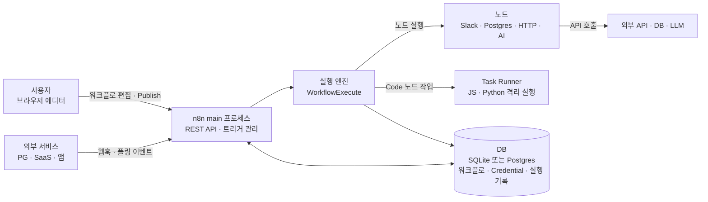
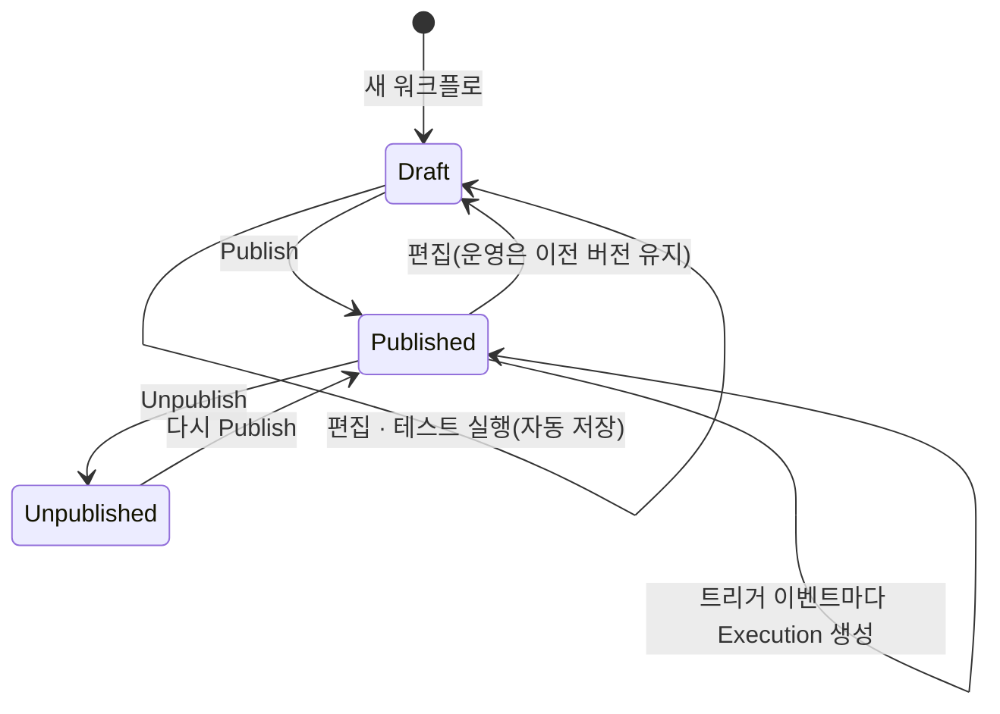
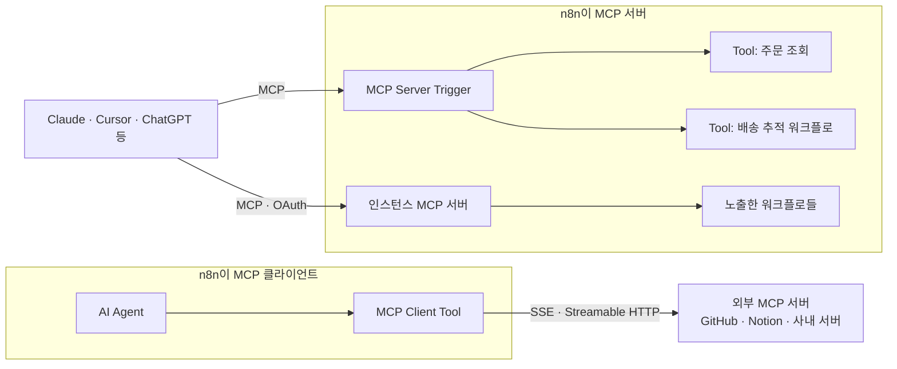
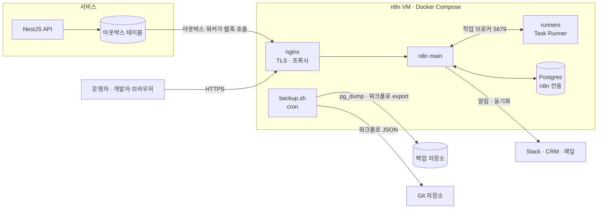
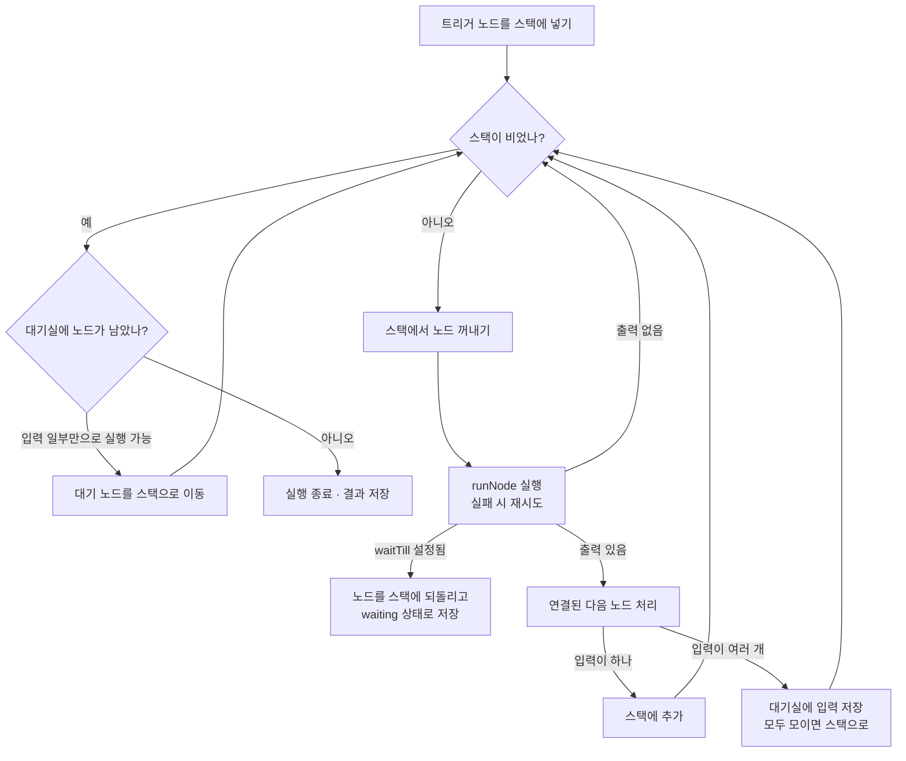

## 개요

> 웹훅·스케줄·앱 이벤트로 시작하는 업무 흐름과 AI 에이전트를 캔버스 위에 노드로 이어 만들고, 필요한 곳에서는 JavaScript·Python 코드를 섞어 쓰며, 직접 서버에 설치(셀프호스팅)하거나 Cloud로 운영할 수 있는 워크플로 자동화 플랫폼입니다.

## 30초 요약

| 항목 | 내용 |
|---|---|
| 무엇인가? | 노드를 연결해 워크플로를 만들고 실행·기록·재시도까지 관리하는 워크플로 자동화 플랫폼(서버 애플리케이션 + 웹 에디터) |
| 왜 사용하는가? | 여러 SaaS·DB·API를 잇는 "접착 코드"와 그 코드를 돌리는 서버·스케줄러·재시도·로그를 매번 직접 만들지 않기 위해 |
| 해결하는 문제 | 시스템 간 연동 코드가 흩어지고, 실패 추적과 수정이 개발자에게만 의존하는 문제 |
| 주요 사용처 | 주문·결제·CS 이벤트 알림, 데이터 동기화, 사내 운영 자동화, LLM을 붙인 분류·요약·에이전트 |
| 핵심 개념 | Workflow, Node(Trigger·Action·Core·Cluster), Item, Expression, Credential, Execution, Publish |
| Client 사용 | △ (브라우저용 라이브러리가 아님. 앱이 웹훅·Chat 위젯·REST API로 n8n을 호출) |
| Server 사용 | O (Node.js 서버로 직접 운영. Docker, Postgres, Redis 기반 확장) |
| 대표 대안 | Zapier, Make, Pipedream, Node-RED, Temporal, 직접 작성한 스크립트 + cron |

- **노드와 아이템이라는 단순한 계약**: 모든 노드는 "아이템 배열을 받아 아이템 배열을 내보낸다"는 하나의 규칙으로 연결됩니다.
- **노코드와 코드 사이**: 대부분은 노드 설정으로 끝내고, 막히는 곳만 Code 노드(JavaScript·Python)나 직접 만든 노드로 채웁니다.
- **셀프호스팅 가능**: 데이터와 인증 정보를 회사 인프라 안에 둘 수 있고, Queue mode로 실행을 여러 워커에 나눌 수 있습니다.
- **AI 노드가 일급 기능**: AI Agent, Chat Model, Memory, Tool, Vector Store를 노드로 조합하고, MCP 클라이언트·서버 양쪽을 지원합니다.
- **실행 기록이 남는다**: 모든 실행의 노드별 입력·출력이 저장되어, 실패한 지점을 화면에서 보고 그 데이터로 다시 실행할 수 있습니다.

---

## 어떤 도구인가?

개발팀에는 이런 요청이 끊임없이 들어옵니다.

- "결제가 실패하면 CS 채널에 바로 알려 주세요."
- "새로 가입한 B2B 고객은 CRM에 등록하고 영업 담당자에게 메일을 보내 주세요."
- "매일 아침 어제 매출을 시트로 정리해서 공유해 주세요."
- "문의 메일을 읽고 환불·배송·기타로 분류해서 담당 팀에 넘겨 주세요."

하나하나는 작은 일이지만, 매번 API 클라이언트를 만들고, 인증 토큰을 관리하고, cron을 걸고, 실패하면 로그를 뒤져야 합니다. n8n은 이런 일을 **"트리거에서 시작해 노드를 차례로 거치는 흐름"으로 화면에 그리고, 실행과 기록은 플랫폼에 맡기는 도구**입니다.

기술적으로 정의하면, n8n은 **TypeScript로 작성된 Node.js 서버 애플리케이션**입니다. Vue 기반 웹 에디터에서 워크플로를 JSON으로 정의하고, 서버의 실행 엔진이 그 그래프를 따라 노드를 실행합니다. 각 노드는 Slack, Postgres, HTTP Request, OpenAI 같은 연동이나 If, Merge, Code 같은 제어 로직을 담당합니다. 공식 README는 1,500개 이상의 통합과 9,000개 이상의 워크플로 템플릿을 내세웁니다(2026년 10월 기준).

npm에서 `import`해 쓰는 라이브러리가 아니라는 점이 중요합니다. 애플리케이션 코드 입장에서 n8n은 **옆에 떠 있는 별도 서비스**이고, 웹훅 URL이나 REST API로 대화합니다.

라이선스는 MIT 같은 OSI 오픈소스가 아니라 **fair-code**인 Sustainable Use License와, 파일명에 `.ee.`가 들어간 기능에 적용되는 n8n Enterprise License입니다. 소스는 모두 공개되어 있고 사내 업무용으로 자유롭게 셀프호스팅할 수 있지만, n8n 자체를 상업 서비스로 재판매하는 데는 제한이 있습니다. 자세한 내용은 [주의할 점과 FAQ](#h-사용할-때-주의할-점)에서 다룹니다.

### 주요 사용 사례

- **이벤트 알림과 후속 처리**: 결제 실패, 신규 가입, 재고 부족 같은 이벤트를 웹훅으로 받아 Slack·메일로 알리고 DB를 갱신합니다.
- **시스템 간 데이터 동기화**: CRM, 결제 시스템, 스프레드시트, 사내 DB 사이를 주기적으로 맞춥니다.
- **사내 운영 자동화**: 온보딩·오프보딩 계정 처리, 정기 리포트, 승인 흐름(사람의 승인을 기다렸다가 진행)을 만듭니다.
- **LLM을 붙인 업무 흐름**: 문의 분류, 문서 요약, 사내 도구를 호출하는 AI 에이전트, RAG 챗봇을 노드로 조합합니다.
- **빠른 내부 API 프로토타입**: Webhook 노드와 Respond to Webhook 노드로 간단한 HTTP 엔드포인트를 만들 수 있습니다.

주요 용어는 [핵심 개념과 동작 구조](#h-n8n-핵심-개념과-동작-구조)에서 자세히 다룹니다.

---

## 어떤 문제를 해결하는가?

```text
요구사항: 결제 실패 이벤트가 오면 고객 정보를 조회해 CS 채널에 알리고, 실패 이력을 DB에 남기고 싶다
 ↓
일반적인 구현: 백엔드에 웹훅 핸들러를 추가하고 Slack·DB 연동 코드를 직접 작성한다
 ↓
문제 발생: 연동이 늘수록 접착 코드가 흩어지고, 실패 재시도·기록·수정이 모두 개발자 몫이 된다
 ↓
n8n으로 해결: 트리거 → 조회 → 분기 → 알림 → 기록을 노드로 그리고, 실행 기록·재시도·인증 정보 관리는 플랫폼이 맡는다
```

### 상황 예시

구독형 서비스를 운영하는 다섯 명 규모의 팀입니다. 결제 대행사(PG)는 결제가 실패하면 웹훅을 보내 줍니다. CS 팀은 "실패 금액이 10만 원 이상이면 바로 Slack으로 알려 달라", 재무 팀은 "실패 이력을 DB에 쌓아 달라", 마케팅 팀은 "세 번 연속 실패한 고객은 이탈 방지 메일 대상에 넣어 달라"고 요청합니다.

### 일반적인 구현 방식

가장 먼저 떠올리는 방법은 기존 백엔드에 핸들러를 하나 추가하는 것입니다.

```ts
// src/webhooks/payment-failed.ts : 백엔드에 직접 작성한 경우
import express from 'express';
import { WebClient } from '@slack/web-api';
import { db } from '../db';

const slack = new WebClient(process.env.SLACK_TOKEN);
export const router = express.Router();

router.post('/webhooks/payment-failed', async (req, res) => {
  const { customerId, amount, reason } = req.body;

  const customer = await db.customer.findUnique({ where: { id: customerId } });
  await db.paymentFailure.create({ data: { customerId, amount, reason } });

  if (amount >= 100_000) {
    await slack.chat.postMessage({
      channel: '#cs-alerts',
      text: `결제 실패: ${customer?.name} / ${amount}원 / ${reason}`,
    });
  }

  const recent = await db.paymentFailure.count({ where: { customerId } });
  if (recent >= 3) {
    await fetch('https://api.mailer.example.com/lists/winback', {
      method: 'POST',
      headers: { Authorization: `Bearer ${process.env.MAILER_TOKEN}` },
      body: JSON.stringify({ email: customer?.email }),
    });
  }

  res.sendStatus(200);
});
```

### 이 방식에서 발생하는 문제

- **실패 처리가 비어 있음**: Slack API가 잠깐 실패하면 알림이 사라집니다. 재시도, 실패 기록, 재실행 기능을 넣으려면 큐와 테이블을 따로 설계해야 합니다.
- **변경 비용이 개발자에게 몰림**: "기준 금액을 5만 원으로 낮춰 주세요", "메일 대신 카카오 알림톡으로 보내 주세요" 같은 요청마다 코드 수정, 리뷰, 배포가 필요합니다.
- **연동 코드가 흩어짐**: Slack, 메일, CRM 토큰과 클라이언트 코드가 서비스 곳곳에 퍼지고, 토큰이 만료되면 어디가 깨졌는지 찾기 어렵습니다.
- **무슨 일이 있었는지 보기 어려움**: "어제 오후 3시 알림이 왜 안 왔나요?"에 답하려면 로그를 검색하고 요청 본문을 재구성해야 합니다.
- **핵심 서비스와 결합됨**: 부가 기능인 알림 코드의 장애나 배포가 결제 API 서버에 영향을 줍니다.

### n8n을 사용하면

같은 요구사항이 캔버스 위의 노드 흐름 하나가 됩니다. 노드 구성과 실행 흐름은 [웹훅 기반 업무 자동화](#h-n8n-활용-예시-①-웹훅-기반-업무-자동화)에서 다룹니다.

- 백엔드는 PG 웹훅을 n8n의 웹훅 URL로 넘기기만 합니다(또는 PG가 n8n을 직접 호출합니다).
- Slack, 메일, DB 인증 정보는 n8n의 Credential에 암호화되어 한곳에 저장됩니다.
- 노드마다 재시도 횟수와 실패 시 동작(중단·계속·오류 출력으로 분기)을 설정하고, 워크플로가 실패하면 Error Workflow가 따로 알립니다.
- 모든 실행의 노드별 입력·출력이 남아서 "어제 3시 실행"을 화면에서 열어 보고, 그 데이터로 다시 실행할 수 있습니다.
- 기준 금액 같은 규칙은 If 노드의 값 하나여서, 권한이 있는 운영자가 수정하고 다시 Publish하면 됩니다.

> **핵심:** 시스템 사이를 잇는 접착 코드와 그 코드를 돌리는 데 필요한 서버·스케줄러·재시도·실행 기록·인증 정보 관리를 개발자가 직접 만드는 대신, n8n이 **노드 그래프와 실행 엔진**으로 처리해줍니다.

---

## 왜 주목받고 있는가?

n8n은 2019년 공개 이후 GitHub Star 20만 6천 개, Fork 6만 1천 개를 넘겼습니다(2026년 10월 기준). 대부분 주마다 새 minor 버전이 나올 정도로 개발이 활발합니다. 숫자보다 중요한 것은 **왜 이 자리에 이런 도구가 필요해졌는가**입니다.

**생산성: "연동 한 줄"이 정말 한 줄이 됩니다.** OAuth 인증, 페이지네이션, API 버전 차이 같은 연동의 귀찮은 부분을 노드가 감춥니다. 노드가 없는 서비스도 HTTP Request 노드와 Credential만으로 연결할 수 있습니다.

**유지보수: 흐름이 그림으로 남습니다.** 코드로 된 연동은 작성자가 떠나면 해석하기 어렵지만, 워크플로는 트리거부터 마지막 노드까지 화면에 그대로 보입니다. 실행 기록과 함께 보면 "무엇이, 어떤 데이터로, 어디서 실패했는지"가 바로 드러납니다.

**개발자 경험: 노코드에서 막히지 않습니다.** Zapier 같은 순수 노코드 도구는 복잡한 변환에서 막히기 쉽습니다. n8n은 Code 노드, 표현식(`{{ $json.amount }}`), 직접 만든 커스텀 노드로 언제든 코드로 내려갈 수 있습니다.

**데이터 주권: 셀프호스팅이 기본 선택지입니다.** 고객 데이터와 API 토큰을 외부 SaaS에 두기 어려운 조직도 자기 인프라에서 운영할 수 있습니다. 실행 횟수 단위 과금이 아니라는 점도 대량 처리에서 차이를 만듭니다.

**최근 흐름: AI 에이전트를 "업무 흐름 안에" 넣는 도구가 되었습니다.** LLM만으로는 사내 시스템 연동, 사람 승인, 실행 기록을 해결하지 못합니다. n8n은 기존 연동 노드를 그대로 에이전트의 도구로 붙이고, MCP 서버·클라이언트를 모두 지원하며, 워크플로와 나란히 두는 Agents(Preview)까지 확장하고 있습니다. README의 제목도 "AI 에이전트와 워크플로 자동화를 위한 플랫폼"으로 바뀌었습니다.

다른 자동화 도구와의 항목별 차이는 [장단점과 대안 비교](#h-n8n-장단점과-대안-비교)에 정리했습니다.

---

## 언제 사용하면 좋은가?

- **여러 SaaS·DB·사내 API를 잇는 일이 계속 생기는 경우**: 연동 하나하나를 코드로 만들고 운영하는 비용이 쌓이므로, 공통 플랫폼으로 모으는 효과가 큽니다.
- **비개발자도 흐름을 보고 고쳐야 하는 경우**: 운영·CS·마케팅 담당자가 조건 값이나 메시지를 직접 수정할 수 있어 개발팀의 요청 대기열이 줄어듭니다.
- **데이터를 외부 자동화 SaaS에 둘 수 없는 경우**: 셀프호스팅으로 고객 데이터와 인증 정보를 회사 네트워크 안에 둘 수 있습니다.
- **LLM을 실제 업무 시스템에 붙이고 싶은 경우**: 에이전트가 호출할 도구로 기존 연동 노드를 그대로 쓰고, 위험한 도구 호출 앞에 사람 승인을 넣을 수 있습니다.
- **실행량이 많아 건당 과금이 부담되는 경우**: 셀프호스팅에서는 실행 횟수가 아니라 서버 자원이 비용을 결정합니다.

---

## 언제 사용하지 않는 것이 좋은가?

- **핵심 비즈니스 로직**: 결제 승인, 재고 차감처럼 트랜잭션과 테스트가 중요한 로직은 애플리케이션 코드에 둡니다. n8n은 그 주변의 알림·동기화·후속 처리에 어울립니다.
  > 예: "주문 생성 API" 자체를 n8n 웹훅으로 만들면 버전 관리, 단위 테스트, 롤백이 모두 어려워집니다.
- **연동이 한두 개뿐인 작은 프로젝트**: cron으로 도는 30줄짜리 스크립트 하나면 될 일에 n8n 서버, DB, 백업, 업그레이드를 운영하는 것은 과합니다.
- **밀리초 단위 응답이 필요한 요청 경로**: 워크플로 실행은 DB 기록과 노드 단위 처리를 거치므로, 사용자 요청마다 동기로 끼워 넣으면 지연이 늘어납니다. Queue mode에서는 워커로 넘기는 비용까지 더해집니다.
- **수 시간~수 일 이어지는 복잡한 장기 프로세스가 핵심인 경우**: 보상 트랜잭션, 정교한 상태 버전 관리, 코드 수준의 테스트가 필요하다면 Temporal 같은 코드 기반 워크플로 엔진이 더 맞습니다.
- **n8n 자체를 고객에게 파는 서비스**: Sustainable Use License는 n8n을 상업 서비스로 재판매하거나 고객용 자동화 기능으로 그대로 제공하는 데 제한이 있습니다. 이런 경우 별도 라이선스 계약이 필요합니다.
- **서버 운영 여력이 없는 팀의 셀프호스팅**: 백업, 암호화 키 관리, 업그레이드, 보안 패치를 맡을 사람이 없다면 Cloud를 쓰거나 다른 SaaS를 고르는 편이 안전합니다.

---

## 한눈에 정리

| 항목 | 내용 |
|---|---|
| 라이브러리 | n8n (`n8n-io/n8n`, Docker 이미지 `n8nio/n8n`) |
| 주요 목적 | 시스템 간 연동과 AI 에이전트를 노드 그래프로 만들고 실행·기록·운영 |
| 해결하는 문제 | 흩어진 접착 코드, 재시도·기록 부재, 변경 요청의 개발자 병목, 인증 정보 분산 |
| 핵심 개념 | Workflow, Node, Item(`json`·`binary`), Expression, Credential, Execution, Publish |
| 주요 사용처 | 이벤트 알림, 데이터 동기화, 사내 운영 자동화, LLM 분류·요약·에이전트 |
| Client 활용 | 앱·백엔드가 웹훅·REST API·Chat 위젯으로 n8n 호출 |
| Server 활용 | Docker + Postgres로 셀프호스팅, Redis 기반 Queue mode로 워커 확장 |
| 장점 | 빠른 연동, 시각적 흐름과 실행 기록, 코드 혼용, 셀프호스팅, AI·MCP 노드 |
| 단점 | 운영 부담, 워크플로 테스트·리뷰 어려움, fair-code 라이선스, 대량 데이터 처리 한계 |
| 추천 상황 | 연동이 계속 늘고, 비개발자도 흐름을 다루며, 데이터를 사내에 두고 싶은 팀 |
| 비추천 상황 | 핵심 트랜잭션 로직, 스크립트 하나로 끝나는 일, 저지연 요청 경로, n8n 재판매 |
| 대표 대안 | Zapier, Make, Pipedream, Node-RED, Temporal, 스크립트 + cron |

---

## 핵심 정리

### 한 문장으로

> n8n은 시스템 사이를 잇는 접착 코드와 그 실행·재시도·기록 문제를 **트리거에서 시작하는 노드 그래프와 실행 엔진**으로 해결하기 위한, 셀프호스팅 가능한 워크플로 자동화 플랫폼입니다.

### 이것만 기억하기

1. **왜 사용하는가?**
   - 연동 코드, 스케줄러, 재시도, 실행 기록, 인증 정보 관리를 매번 직접 만들지 않고 한 플랫폼에 모으기 위해서입니다.

2. **어떤 문제를 해결하는가?**
   - 흩어진 연동 코드, 실패를 추적하기 어려운 문제, 작은 규칙 변경까지 개발자 배포가 필요한 문제, 인증 토큰이 여기저기 퍼지는 문제입니다.

3. **어떻게 동작하는가?**
   - 트리거가 실행을 시작하면 실행 엔진이 연결을 따라 노드를 하나씩 실행하고, 각 노드는 아이템 배열을 받아 아이템 배열을 내보냅니다. 결과는 실행 기록으로 DB에 저장됩니다.

4. **실제 프로젝트에서는 어디에 사용하는가?**
   - 결제·가입·문의 이벤트의 후속 처리, SaaS 간 데이터 동기화, 정기 리포트, 사람 승인 흐름, 사내 도구를 호출하는 AI 에이전트에 씁니다.

5. **언제 사용하지 않는가?**
   - 핵심 트랜잭션 로직, 스크립트 하나로 충분한 일, 저지연 요청 경로, 운영 인력이 없는 셀프호스팅, n8n 자체의 재판매에는 맞지 않습니다.

6. **비슷한 기술과 가장 큰 차이는 무엇인가?**
   - Zapier·Make처럼 쉽게 연결하면서도 셀프호스팅과 코드 혼용이 가능하고, Temporal처럼 코드가 주인공인 엔진보다 훨씬 빨리 만들 수 있다는 점입니다. 대신 **운영과 테스트 책임이 우리 팀으로 온다**는 점을 함께 받아들여야 합니다.

## n8n 핵심 개념과 동작 구조

> n8n을 이루는 Workflow, Node, Item, Expression, Credential, Execution, Publish가 각각 무엇이고 어떻게 맞물려 동작하는지 다룹니다.

### 용어 한눈에 보기

| 키워드 | 설명 |
|---|---|
| Workflow | 트리거에서 시작해 노드들이 연결된 하나의 자동화 흐름. 내부적으로는 노드 목록과 연결 정보를 담은 JSON |
| Node | 워크플로의 한 단계. 트리거, 앱 연동, 흐름 제어, 데이터 변환, AI 등 역할별 종류가 있음 |
| Trigger | 워크플로를 시작시키는 노드. Webhook, Schedule, 앱 이벤트, Chat, Form 등 |
| Item | 노드 사이를 오가는 데이터 한 건. `{ json, binary }` 형태이고 노드는 아이템 배열을 주고받음 |
| Expression | `{{ $json.amount }}`처럼 노드 설정값 안에서 이전 데이터를 참조하는 JavaScript 표현식 |
| Credential | API 키·OAuth 토큰 같은 인증 정보. 암호화되어 DB에 저장되고 노드는 이름으로만 참조 |
| Execution | 워크플로를 한 번 실행한 기록. 노드별 입력·출력과 성공·실패 상태가 남음 |
| Publish | 편집 중인 초안을 운영 버전으로 고정하는 동작. 운영 트리거는 Publish된 버전만 실행 |
| Cluster node | AI Agent 같은 루트 노드에 Chat Model·Memory·Tool 같은 하위 노드를 붙여 쓰는 AI용 노드 묶음 |

---

### 1. Workflow (워크플로)

#### 쉽게 설명하면

공장의 컨베이어 벨트와 같습니다. 벨트 맨 앞에서 재료(이벤트)가 들어오면, 벨트를 따라 놓인 기계(노드)를 차례로 지나며 가공되고, 끝에서 결과물이 나옵니다.

#### 개발 관점에서는

워크플로는 **방향이 있는 노드 그래프**이고, 저장 형식은 JSON입니다. 에디터에서 노드를 드래그해 연결하면 다음과 같은 구조가 만들어집니다.

#### 예제

```json
{
  "name": "결제 실패 알림",
  "nodes": [
    { "name": "Webhook", "type": "n8n-nodes-base.webhook", "typeVersion": 2, "position": [0, 0],
      "parameters": { "httpMethod": "POST", "path": "payment-failed" } },
    { "name": "금액 확인", "type": "n8n-nodes-base.if", "typeVersion": 2, "position": [220, 0],
      "parameters": { "...": "amount >= 100000 조건" } }
  ],
  "connections": {
    "Webhook": { "main": [[{ "node": "금액 확인", "type": "main", "index": 0 }]] }
  },
  "settings": { "executionOrder": "v1" }
}
```

- `nodes`: 각 노드의 종류(`type`), 버전(`typeVersion`), 캔버스 위치(`position`), 설정값(`parameters`)
- `connections`: "어느 노드의 몇 번째 출력이 어느 노드의 몇 번째 입력으로 가는가"
- `settings.executionOrder`: 갈래가 여러 개일 때 실행 순서 규칙. 1.0 이후 만든 워크플로는 `v1`

이 JSON을 그대로 내보내고 가져올 수 있으므로, 워크플로를 Git에 보관하거나 다른 인스턴스로 옮길 수 있습니다.

#### 핵심

> 워크플로는 "그림"이 아니라 **노드 목록 + 연결 정보로 된 JSON 데이터**입니다. 캔버스는 그 JSON을 편집하는 화면입니다.

### 2. Node (노드)

#### 쉽게 설명하면

레고 블록입니다. 블록마다 하는 일이 정해져 있고, 블록을 끼우는 방식(입력과 출력)은 모두 같아서 어떤 순서로든 조립할 수 있습니다.

#### 개발 관점에서는

노드는 역할에 따라 나뉩니다.

| 종류 | 예 | 하는 일 |
|---|---|---|
| Trigger 노드 | Webhook, Schedule Trigger, Gmail Trigger, Chat Trigger, Form Trigger | 실행을 시작시킴. 워크플로의 입구 |
| Action(App) 노드 | Slack, Postgres, Google Sheets, Notion, GitHub | 외부 서비스 API를 호출 |
| Core 노드 | HTTP Request, If, Switch, Merge, Loop Over Items, Wait, Code, Edit Fields(Set) | 흐름 제어, 데이터 변환, 범용 호출 |
| Cluster 노드 | AI Agent + Chat Model·Memory·Tool 하위 노드 | AI 기능을 루트 노드와 하위 노드 조합으로 구성 |

모든 노드에는 공통 설정이 있습니다. 실무에서 자주 쓰는 것은 다음 네 가지입니다.

- **Retry On Fail**: 실패 시 재시도. 최대 시도 횟수와 대기 시간을 지정합니다.
- **On Error**: 실패하면 워크플로를 멈출지(`stopWorkflow`), 계속할지(`continueRegularOutput`), 오류 전용 출력으로 보낼지(`continueErrorOutput`) 정합니다.
- **Always Output Data**: 결과가 비어도 빈 아이템 하나를 내보내 다음 노드가 실행되게 합니다.
- **Execute Once**: 입력 아이템이 여러 개여도 첫 아이템으로 한 번만 실행합니다.

#### 핵심

> 노드의 종류는 수천 개지만, **모두 같은 입출력 규칙(아이템 배열)**을 따르기 때문에 서로 연결할 수 있습니다.

### 3. Item (아이템)

#### 쉽게 설명하면

컨베이어 벨트 위의 상자 하나입니다. 상자 안에는 정보 쪽지(`json`)와 첨부 파일(`binary`)이 들어 있습니다. 벨트 위에는 상자가 여러 개 놓일 수 있습니다.

#### 개발 관점에서는

노드 사이를 오가는 데이터는 항상 **객체 배열**이고, 각 객체가 아이템입니다.

#### 예제

```json
[
  { "json": { "orderId": "A-1001", "amount": 120000 } },
  { "json": { "orderId": "A-1002", "amount": 35000 },
    "binary": { "receipt": { "data": "<base64>", "mimeType": "application/pdf", "fileName": "A-1002.pdf" } } }
]
```

대부분의 노드는 **아이템마다 한 번씩** 동작합니다. 위 배열이 Slack 노드에 들어가면 메시지가 두 번 전송됩니다. 그래서 "100건을 한 메시지로 보내고 싶다"면 먼저 Aggregate 노드나 Code 노드로 아이템을 하나로 합쳐야 합니다.

출력 아이템에는 "이 아이템이 입력의 몇 번째 아이템에서 왔는가"를 뜻하는 `pairedItem` 정보가 붙습니다. 그래서 뒤쪽 노드의 표현식에서 앞쪽 노드의 "같은 줄" 데이터를 찾아올 수 있습니다. 이 연결이 실행 엔진에서 어떻게 유지되는지는 [실행 엔진 깊이 보기](#h-아이템과-paireditem-계보)에서 다룹니다.

#### 핵심

> n8n을 이해하는 가장 중요한 한 줄: **노드는 아이템 배열을 받아, 아이템마다 일하고, 아이템 배열을 내보냅니다.**

### 4. Expression (표현식)

#### 쉽게 설명하면

양식의 빈칸에 "앞에서 받은 주문 번호를 여기 넣어 주세요"라고 적어 두는 것입니다.

#### 개발 관점에서는

노드의 거의 모든 설정 필드에 `{{ }}`로 감싼 JavaScript 표현식을 쓸 수 있습니다. 표현식은 현재 아이템마다 따로 평가됩니다.

#### 예제

```text
{{ $json.amount }}                                  현재 아이템의 amount
{{ $json.amount >= 100000 ? '긴급' : '일반' }}       간단한 조건식
{{ $('고객 조회').item.json.email }}                 앞쪽 노드에서 같은 계보의 아이템
{{ $now.toFormat('yyyy-MM-dd') }}                   날짜 처리 (Luxon)
{{ $execution.id }}                                 현재 실행 ID
```

입력 패널에서 필드를 드래그해 설정 칸에 놓으면 `{{ $json.필드 }}` 표현식이 자동으로 만들어집니다.

#### 핵심

> 노드 설정은 고정값이 아니라 **아이템마다 평가되는 템플릿**입니다. 표현식이 복잡해지면 Code 노드로 옮기는 것이 읽기 쉽습니다.

### 5. Credential (인증 정보)

#### 쉽게 설명하면

건물 관리실에 맡겨 두는 열쇠입니다. 직원은 "3층 회의실 열쇠"라고 이름으로만 요청하고, 열쇠 자체를 들고 다니지 않습니다.

#### 개발 관점에서는

API 키, OAuth 토큰, DB 비밀번호는 Credential로 따로 저장합니다. 값은 인스턴스의 **암호화 키**(`N8N_ENCRYPTION_KEY` 또는 첫 실행 때 자동 생성된 키)로 암호화되어 DB에 들어가고, 워크플로 JSON에는 Credential의 ID와 이름만 남습니다. 그래서 워크플로를 내보내 공유해도 비밀값은 함께 나가지 않습니다.

이 구조 때문에 **암호화 키를 잃어버리면 저장된 모든 Credential을 복호화할 수 없습니다.** 셀프호스팅에서 가장 먼저 백업해야 할 것이 이 키입니다.

#### 핵심

> 워크플로는 Credential을 "이름으로 참조"만 합니다. 비밀값과 흐름을 분리해서, 흐름은 공유하고 비밀은 인스턴스에 남깁니다.

### 6. Execution과 Publish (실행 기록과 운영 버전)

#### 쉽게 설명하면

Publish는 "이 버전으로 영업을 시작합니다"라는 간판을 거는 일이고, Execution은 영업 중 손님 한 명 한 명을 응대한 기록입니다.

#### 개발 관점에서는

n8n 2.x에서 워크플로는 편집하는 동안 자동 저장되지만, 운영에는 **Publish한 버전**만 쓰입니다. Publish하면 Webhook·Form 트리거의 운영 URL이 열리고, Schedule이 돌기 시작하며, 앱 이벤트 트리거가 등록됩니다. 그 뒤에 편집한 내용은 다시 Publish하기 전까지 운영에 반영되지 않습니다. 1.x에서 "Active 토글"로 하던 일이 이 Publish 모델로 바뀌었습니다.

실행에는 두 종류가 있습니다.

| 구분 | 시작 방법 | 웹훅 경로 | 용도 |
|---|---|---|---|
| 수동(테스트) 실행 | 에디터의 Execute workflow, Listen for test event | `/webhook-test/...` | 개발 중 확인. 결과가 캔버스에 바로 표시됨 |
| 운영 실행 | Publish된 트리거가 받은 이벤트 | `/webhook/...` | 실제 업무. 결과는 Executions 탭에서 확인 |

각 실행은 노드별 입력·출력 데이터를 포함해 DB에 저장되고, 기본 설정에서는 14일(336시간)이 지나거나 1만 건을 넘으면 오래된 것부터 정리됩니다.

#### 핵심

> **편집은 초안, 운영은 Publish된 버전**입니다. 실행 기록은 디버깅의 가장 강력한 도구이자, 쌓이면 DB를 키우는 비용입니다.

---

### 7. 전체 동작 구조

n8n은 애플리케이션 코드에 import되는 라이브러리가 아니라, **에디터·API·트리거 관리·실행 엔진을 가진 별도 서버**입니다.



한 번의 실행이 처리되는 순서는 다음과 같습니다.

1. **시작점**: Publish된 워크플로의 트리거가 이벤트를 받습니다. 웹훅이면 HTTP 요청이, Schedule이면 정해진 시각이, 폴링 트리거면 새 데이터가 시작점이 됩니다. 트리거가 만든 아이템이 첫 입력이 됩니다.
2. **n8n이 개입하는 시점**: main 프로세스가 실행 레코드를 만들고 실행 엔진을 시작합니다. Queue mode라면 실행 ID만 Redis 큐에 넣고, 실제 실행은 워커가 가져갑니다.
3. **내부 처리**: 실행 엔진은 "다음에 실행할 노드" 스택에서 노드를 하나씩 꺼내 실행하고, 출력 아이템을 연결된 다음 노드의 입력으로 넘깁니다. 입력이 여러 개인 노드(Merge 등)는 필요한 입력이 모두 도착할 때까지 기다립니다.
4. **외부 시스템과의 연결**: 각 노드는 Credential을 복호화해 외부 API·DB·LLM을 호출합니다. Code 노드의 사용자 코드는 n8n 프로세스가 아니라 Task Runner에서 격리되어 실행됩니다.
5. **결과 반환**: 노드별 결과가 실행 기록으로 DB에 저장됩니다. 웹훅 트리거라면 설정에 따라 즉시, 마지막 노드가 끝난 뒤, 또는 Respond to Webhook 노드 시점에 HTTP 응답을 돌려줍니다. 실패하면 설정된 Error Workflow가 실행됩니다.

워크플로 하나의 생명주기를 상태로 보면 다음과 같습니다.



실행 엔진이 노드 순서를 정하고 데이터를 넘기는 방식은 [실행 엔진 깊이 보기](#h-n8n-실행-엔진-깊이-보기)에서 실제 소스 코드와 함께 다룹니다.

## n8n 설치와 첫 사용

> 설치 방법을 고르는 기준, 꼭 알아야 할 기본 설정, 웹훅 하나로 만드는 첫 워크플로, 설치할 때 자주 겪는 문제를 다룹니다.

### 설치

n8n을 쓰는 방법은 크게 **n8n Cloud**(가입만 하면 바로 사용)와 **셀프호스팅** 두 가지입니다. 이 문서는 셀프호스팅 기준입니다. 셀프호스팅은 Docker를 기본으로 생각하는 것이 좋습니다. 공식 문서가 Docker 계열 설치를 권장하고, n8n 3.0부터는 npm으로 실행하는 방식이 빠지고 Docker 기반 배포가 필수가 될 예정이기 때문입니다.

**방법 1. 설치 스크립트(가장 빠름, Docker 필요)**

```bash
curl -fsSL https://get.n8n.io | sh
```

스크립트는 Docker Compose 구성(`get-n8n-compose.yml`)과 `.env`를 내려받아 n8n, Code 노드용 Task Runner, n8n Assistant용 샌드박스 서비스까지 함께 띄웁니다. 샌드박스까지 포함하면 RAM 4GB, vCPU 2개 이상이 필요합니다.

**방법 2. Docker 한 줄 실행(로컬 체험용)**

```bash
docker volume create n8n_data
docker run -it --rm --name n8n -p 5678:5678 \
  -v n8n_data:/home/node/.n8n \
  docker.n8n.io/n8nio/n8n
```

브라우저에서 `http://localhost:5678`을 열고 소유자 계정을 만들면 에디터가 나옵니다. 데이터는 SQLite 파일로 `n8n_data` 볼륨에 저장됩니다.

**방법 3. Docker Compose + Postgres(운영용)**

여러 사람이 쓰거나 상시 운영하는 인스턴스는 Postgres를 붙이고, Code 노드용 Task Runner를 별도 컨테이너(external mode)로 둡니다. 전체 `compose.yml`은 [셀프호스팅 운영과 실전 적용](#h-n8n-활용-예시-③-셀프호스팅-운영과-실전-적용)에서 다룹니다.

**방법 4. npm(2.x까지)**

```bash
npx n8n
# 또는
npm install -g n8n && n8n start
```

현재 2.x에서는 동작하지만, 3.0에서 실행 가능한 `n8n` 패키지를 npm에 더 이상 배포하지 않을 예정입니다. 새로 시작한다면 Docker로 가는 편이 이후 업그레이드가 쉽습니다.

**버전 선택**

n8n은 대부분 주마다 새 minor 버전을 내고, Docker 이미지 태그로 `stable`(운영용)과 `beta`(가장 최근 릴리스, 불안정할 수 있음)를 제공합니다. 2026년 10월 초 기준 `stable`은 2.41.x, `beta`는 2.42.x이며, 1.x 계열도 유지보수 릴리스가 나오고 있습니다. 운영에서는 `latest`나 `stable` 같은 움직이는 태그 대신 `2.41.6`처럼 **정확한 버전을 고정**하고, 릴리스 노트를 확인한 뒤 올립니다.

### 기본 설정

n8n 설정은 대부분 환경 변수로 합니다. 처음부터 정해 두어야 하는 것은 다음 다섯 가지입니다.

```bash
# 1) Credential 암호화 키: 정하지 않으면 첫 실행 때 자동 생성되어 /home/node/.n8n/config 에 저장된다
N8N_ENCRYPTION_KEY=<openssl rand -hex 32 로 만든 값>

# 2) 외부에서 접근하는 주소: 웹훅 URL과 OAuth 콜백 URL이 이 값으로 만들어진다
WEBHOOK_URL=https://n8n.example.com/

# 3) 시간대: Schedule Trigger와 날짜 표현식의 기준
GENERIC_TIMEZONE=Asia/Seoul
TZ=Asia/Seoul

# 4) DB: 기본은 SQLite. 운영은 Postgres
DB_TYPE=postgresdb
DB_POSTGRESDB_HOST=postgres
DB_POSTGRESDB_DATABASE=n8n
DB_POSTGRESDB_USER=n8n
DB_POSTGRESDB_PASSWORD=<비밀번호>

# 5) 실행 기록 보존: 기본 336시간(14일), 최대 10000건
EXECUTIONS_DATA_MAX_AGE=168
```

- **암호화 키**는 Credential을 복호화하는 유일한 열쇠입니다. 자동 생성된 키를 쓰더라도 `/home/node/.n8n` 볼륨과 함께 반드시 백업합니다.
- **`WEBHOOK_URL`**을 정하지 않으면 리버스 프록시 뒤에서 웹훅 URL이 `http://localhost:5678/...`로 표시되어 외부 서비스가 호출할 수 없습니다.
- **시간대**를 정하지 않으면 "매일 오전 9시" 스케줄이 UTC 기준으로 돌아 한국 시간 오후 6시에 실행됩니다.

### 가장 간단한 예제

웹훅으로 이름을 받아 인사말을 돌려주는 워크플로를 만들어 봅니다.

1. 에디터에서 **Create workflow**를 누르고 **Webhook** 노드를 추가합니다. HTTP Method는 `POST`, Path는 `hello`, Respond는 **When Last Node Finishes**로 둡니다.
2. Webhook 노드 뒤에 **Code** 노드를 연결하고 언어는 JavaScript, 모드는 기본값인 **Run Once for All Items**로 둔 채 아래 코드를 넣습니다.

```js
// Code 노드: 입력 아이템마다 인사말 필드를 추가한다
return $input.all().map((item) => {
  const name = item.json.body?.name ?? '익명';
  return {
    json: {
      greeting: `안녕하세요, ${name}님`,
      receivedAt: new Date().toISOString(),
    },
  };
});
```

3. Webhook 노드에서 **Listen for test event**를 누른 뒤 터미널에서 테스트 URL을 호출합니다.

```bash
curl -X POST http://localhost:5678/webhook-test/hello \
  -H 'Content-Type: application/json' \
  -d '{"name":"지영"}'
# {"greeting":"안녕하세요, 지영님","receivedAt":"2026-10-05T01:23:45.000Z"}
```

4. 결과가 맞으면 오른쪽 위 **Publish**를 누릅니다. 이제 `/webhook/hello`(운영 URL)로 호출할 수 있고, 실행 결과는 캔버스가 아니라 **Executions** 탭에 쌓입니다.

이 예제에서 일어난 일을 정리하면 다음과 같습니다.

1. **무엇을 생성하는가**: Webhook 노드가 `/webhook-test/hello`(테스트)와 `/webhook/hello`(운영) 두 개의 HTTP 엔드포인트를 등록합니다.
2. **어떤 값을 전달하는가**: HTTP 요청 하나가 아이템 하나가 되고, 아이템의 `json`에는 `headers`, `params`, `query`, `body`가 들어갑니다. 그래서 Code 노드에서 `item.json.body.name`으로 꺼냅니다.
3. **n8n이 무엇을 처리하는가**: 실행 엔진이 Webhook → Code 순서로 노드를 실행하고, Code 노드의 JavaScript는 Task Runner에서 격리되어 실행됩니다. 노드별 입력과 출력은 실행 기록으로 저장됩니다.
4. **어떤 결과를 반환하는가**: Respond를 **When Last Node Finishes**로 두었으므로, 마지막 노드(Code)의 첫 아이템 JSON이 HTTP 응답 본문으로 돌아갑니다.

`$input.all()`, `item.json` 같은 표현이 왜 이런 모양인지는 [핵심 개념](#h-3-item-아이템)의 아이템 구조를 보면 이해할 수 있습니다.

---

### 설치할 때 주의할 점

- **볼륨 없이 실행하지 않습니다.** `-v n8n_data:/home/node/.n8n` 없이 `--rm`으로 띄우면 컨테이너를 지우는 순간 워크플로, Credential, 암호화 키가 함께 사라집니다. Postgres를 쓰더라도 이 볼륨은 유지합니다.
- **암호화 키를 바꾸지 않습니다.** 이미 Credential이 저장된 인스턴스에서 `N8N_ENCRYPTION_KEY`를 다른 값으로 바꾸면 기존 Credential을 읽을 수 없습니다. 키를 교체해야 한다면 공식 키 교체(rotate) 절차를 따릅니다.
- **테스트 URL과 운영 URL을 구분합니다.** `/webhook-test/...`는 에디터에서 대기 중일 때만 응답합니다. 외부 서비스에 테스트 URL을 등록해 두고 "가끔만 동작한다"고 착각하는 경우가 많습니다.
- **SQLite로 오래 운영하지 않습니다.** 사용자와 워크플로가 늘거나 상시 실행이 많아지면 Postgres를 권장합니다. Queue mode는 SQLite를 지원하지 않습니다. MySQL·MariaDB 지원은 2.0에서 제거되었습니다.
- **Windows에서는 WSL 파일 시스템 안에서 실행합니다.** Docker Compose 프로젝트 폴더를 `/mnt/c/...` 아래에 두면 성능과 권한 문제가 생깁니다.
- **5678 외의 포트를 외부에 열지 않습니다.** 설치 스크립트 구성의 Task Runner와 샌드박스 컨테이너(특히 privileged로 동작하는 `sandbox-runner-1`)는 내부 네트워크 전용입니다.

## n8n 활용 예시 ① 웹훅 기반 업무 자동화

> 결제 실패 이벤트를 받아 기록·분기·알림까지 처리하는 워크플로를 만들고, 우리 서비스(Client) 쪽에서 n8n을 안전하게 호출하는 방법과 실패를 다루는 방법까지 다룹니다.

### 예제 1. 결제 실패 후속 처리 워크플로

#### 요구사항

> PG사가 결제 실패 웹훅을 보내면 다음을 처리한다.
> 1. 실패 이력을 DB에 남긴다. 같은 이벤트가 두 번 와도 한 번만 기록한다.
> 2. 실패 금액이 10만 원 이상이면 CS 채널(Slack)에 바로 알린다.
> 3. 최근 30일 안에 세 번 이상 실패한 고객은 이탈 방지 메일 목록에 추가한다.
> 4. 어느 단계든 실패하면 운영 채널에 실행 링크와 함께 알린다.

#### 구현

워크플로 구조는 다음과 같습니다.

```text
[Webhook: POST /webhook/payment-failed, Header Auth, Respond Immediately]
   ↓
[Edit Fields: 필요한 필드만 정리]
   ↓
[Postgres: 실패 이력 저장 (중복이면 무시) + 30일 실패 횟수 조회]
   ↓
[If: 새로 기록된 이벤트인가?] ── false → (중복 이벤트, 종료)
   ↓ true
   ├─→ [If: amount >= 100000] ── true → [Slack: #cs-alerts 알림]
   └─→ [If: failCount >= 3]   ── true → [HTTP Request: 메일 서비스 목록 추가]

Workflow Settings → Error workflow: "운영 알림" 워크플로
```

**1. Webhook 노드**

| 설정 | 값 | 이유 |
|---|---|---|
| HTTP Method | `POST` | PG 웹훅 형식 |
| Path | `payment-failed` | 고정 경로로 두어야 PG 설정을 바꾸지 않아도 됨 |
| Authentication | Header Auth (`X-Webhook-Token`) | 아무나 호출하지 못하게 공유 비밀값 확인 |
| Respond | Immediately | PG는 빠른 2xx 응답을 기대함. 후속 처리는 응답 뒤에 진행 |

**2. Edit Fields(Set) 노드**: 웹훅 아이템은 `headers`, `query`, `body`를 모두 담고 있으므로, 뒤쪽 노드가 쓰기 쉽게 필요한 값만 꺼냅니다.

```text
eventId    = {{ $json.body.eventId }}
customerId = {{ $json.body.customerId }}
amount     = {{ $json.body.amount }}
reason     = {{ $json.body.reason }}
```

**3. Postgres 노드(Execute Query)**: 중복 방지와 횟수 조회를 쿼리 하나로 처리합니다. 값은 문자열로 이어 붙이지 않고 **Query Parameters**(`$1`, `$2`...)로 넘깁니다.

```sql
WITH inserted AS (
  INSERT INTO payment_failures (event_id, customer_id, amount, reason)
  VALUES ($1, $2, $3, $4)
  ON CONFLICT (event_id) DO NOTHING   -- 같은 이벤트 재전송은 무시
  RETURNING customer_id
)
SELECT
  (SELECT count(*) FROM inserted) = 1 AS is_new,
  (SELECT count(*) FROM payment_failures
     WHERE customer_id = $2 AND created_at > now() - interval '30 days') AS fail_count;
```

Query Parameters에는 `{{ $json.eventId }}, {{ $json.customerId }}, {{ $json.amount }}, {{ $json.reason }}`를 순서대로 넣습니다.

**4. If 노드와 알림 노드**

- 첫 번째 If: `{{ $json.is_new }}`가 `true`인지 확인합니다.
- 금액 If: `{{ $('Edit Fields').item.json.amount }}`가 `100000` 이상인지 확인합니다. Postgres 노드의 출력에는 금액이 없으므로, 앞쪽 노드에서 같은 계보의 아이템을 찾아옵니다.
- Slack 노드: 메시지에 `{{ $('Edit Fields').item.json.customerId }}`, 금액, 사유를 넣습니다. 노드 설정에서 **Retry On Fail**(3회, 1초 간격)을 켭니다.
- 횟수 If와 HTTP Request 노드: `{{ $json.fail_count }}`가 3 이상이면 메일 서비스 API를 호출합니다. 인증은 Credential로 지정합니다.

**5. Error Workflow**: 별도 워크플로를 **Error Trigger** 노드로 시작하게 만들고, 원래 워크플로의 Workflow Settings에서 Error workflow로 지정합니다. Error Trigger가 받는 데이터는 다음과 같은 형태입니다.

```json
{
  "execution": {
    "id": "231",
    "url": "https://n8n.example.com/execution/231",
    "error": { "message": "Slack API: channel_not_found" },
    "lastNodeExecuted": "Slack"
  },
  "workflow": { "id": "1", "name": "결제 실패 후속 처리" }
}
```

Slack 노드로 `{{ $json.workflow.name }}에서 실패: {{ $json.execution.error.message }} {{ $json.execution.url }}`를 보내면, 운영자는 링크를 눌러 실패한 실행의 노드별 데이터를 바로 열어 볼 수 있습니다.

#### 실행 흐름

```text
PG 서버: POST /webhook/payment-failed (X-Webhook-Token 포함)
 ↓
Webhook 노드: 토큰 확인 → 즉시 200 응답 → 아이템 1개 생성
 ↓
Edit Fields: eventId, customerId, amount, reason만 남김
 ↓
Postgres: INSERT ... ON CONFLICT → is_new, fail_count 반환
 ↓
If(is_new): 중복 이벤트면 여기서 종료
 ↓
If(amount) → Slack 알림 (실패 시 3회 재시도)
If(fail_count) → 메일 서비스 API 호출
 ↓
실행 기록 저장. 어느 노드든 최종 실패하면 Error Workflow 실행 → 운영 채널 알림
```

#### 코드 설명

1. **즉시 응답 후 처리합니다.** PG는 응답이 늦으면 같은 이벤트를 다시 보냅니다. Respond를 Immediately로 두면 HTTP 응답과 후속 처리가 분리됩니다.
2. **중복 방지를 DB 제약으로 합니다.** 웹훅은 "최소 한 번" 전달되는 경우가 많습니다. `event_id`에 UNIQUE 제약을 두고 `ON CONFLICT DO NOTHING`을 쓰면, n8n 쪽에서 상태를 따로 기억하지 않아도 중복 처리가 막힙니다.
3. **쿼리 파라미터를 씁니다.** 표현식을 SQL 문자열에 직접 이어 붙이면 `reason`에 따옴표가 들어오는 순간 SQL Injection이 됩니다.
4. **`$('Edit Fields').item`으로 앞 단계 값을 가져옵니다.** Postgres 노드가 출력을 새로 만들었기 때문에, 금액 같은 원래 값은 pairedItem 계보를 따라 앞 노드에서 찾아야 합니다.
5. **재시도는 노드별로, 최종 실패는 Error Workflow로 다룹니다.** Slack의 일시 오류는 재시도로 흡수하고, 그래도 실패하면 사람에게 알려 재실행 여부를 판단하게 합니다.

#### 왜 이렇게 사용하는가?

같은 기능을 백엔드에 직접 만들면 재시도, 실패 기록, 재실행 화면을 따로 만들어야 합니다. n8n에서는 **노드 설정 몇 개와 Error Workflow 하나**로 그 부분을 얻고, 개발자는 중복 방지 쿼리처럼 정말 중요한 곳에만 집중할 수 있습니다. 기준 금액이나 알림 채널이 바뀌어도 코드 배포 없이 노드 값을 고치고 다시 Publish하면 됩니다.

---

### 예제 2. 우리 서비스(Client)에서 n8n 호출하기

n8n은 브라우저나 앱에 넣는 라이브러리가 아니므로, 여기서 Client는 **n8n을 호출하는 우리 서비스**를 뜻합니다. 가장 흔한 형태는 백엔드가 도메인 이벤트를 n8n 웹훅으로 넘기는 것입니다.

#### 활용할 수 있는 기능

- **Webhook 노드**: Basic·Header·JWT 인증, IP 허용 목록, 최대 16MB 페이로드(셀프호스팅에서 조정 가능)
- **Respond to Webhook 노드**: 워크플로 중간에서 원하는 상태 코드와 본문으로 응답
- **Chat Trigger의 공개 채팅**: 웹 페이지에 붙이는 채팅 위젯으로 AI 워크플로 호출
- **Public REST API**: `X-N8N-API-KEY` 헤더로 워크플로·실행 기록 조회와 관리

#### 실제 예제

```ts
// src/integrations/n8n.ts : 백엔드에서 n8n 웹훅으로 이벤트 전달
type PaymentFailedEvent = {
  eventId: string; // PG 이벤트 ID. n8n 쪽 중복 방지 키로 쓰인다
  customerId: string;
  amount: number;
  reason: string;
};

export async function notifyPaymentFailed(event: PaymentFailedEvent): Promise<void> {
  const res = await fetch(`${process.env.N8N_BASE_URL}/webhook/payment-failed`, {
    method: 'POST',
    headers: {
      'Content-Type': 'application/json',
      'X-Webhook-Token': process.env.N8N_WEBHOOK_TOKEN!, // Webhook 노드의 Header Auth 값
    },
    body: JSON.stringify(event),
    signal: AbortSignal.timeout(5_000), // n8n이 느려도 우리 API는 5초 이상 기다리지 않는다
  });

  if (!res.ok) {
    // 호출자는 이 오류를 잡아 아웃박스 테이블에 남기고 나중에 다시 보낸다
    throw new Error(`n8n webhook failed: ${res.status}`);
  }
}
```

```ts
// scripts/check-failed-executions.ts : 운영 점검용, 최근 실패 실행 조회
const res = await fetch(
  `${process.env.N8N_BASE_URL}/api/v1/executions?status=error&workflowId=${process.env.WORKFLOW_ID}&limit=20`,
  { headers: { 'X-N8N-API-KEY': process.env.N8N_API_KEY!, accept: 'application/json' } },
);
const { data } = (await res.json()) as { data: { id: string; startedAt: string }[] };
for (const exec of data) console.log(exec.id, exec.startedAt);
```

1. **타임아웃을 둡니다.** n8n은 별도 서비스이므로 장애나 지연이 우리 API로 번지지 않게 짧은 타임아웃을 겁니다.
2. **실패하면 버리지 않습니다.** n8n이 잠시 내려가 있을 때를 대비해, 보내지 못한 이벤트를 아웃박스 테이블이나 메시지 큐에 남겨 두고 다시 보냅니다. 다시 보내도 `eventId`로 중복이 막히므로 안전합니다.
3. **웹훅 토큰과 API 키는 용도가 다릅니다.** 웹훅 토큰은 특정 워크플로 하나를 호출하는 비밀값이고, API 키는 인스턴스 전체를 다룰 수 있는 권한입니다. Enterprise가 아니면 API 키에 범위(scope)를 줄 수 없으므로, API 키는 운영 스크립트에만 둡니다.

#### 실제 서비스에서는

> 사용자의 정기 결제가 실패하면 PG가 우리 결제 서버로 웹훅을 보냅니다. 결제 서버는 구독 상태를 `past_due`로 바꾸는 핵심 로직만 트랜잭션 안에서 처리하고, 같은 트랜잭션에서 아웃박스 테이블에 이벤트를 적습니다. 아웃박스 워커가 그 이벤트를 n8n 웹훅으로 보내면, n8n이 실패 이력 기록, CS 알림, 이탈 방지 메일 같은 후속 처리를 맡습니다. 결제 로직은 코드와 테스트로 지키고, 자주 바뀌는 후속 처리는 운영자가 n8n에서 고치는 **역할 분담**입니다.

## n8n 활용 예시 ② AI 에이전트와 MCP

> AI Agent 노드로 사내 데이터를 조회하고 행동하는 CS 에이전트를 만드는 방법과, MCP로 n8n을 외부 AI 도구에 연결하는 두 방향(클라이언트·서버)을 다룹니다.

### AI 관점에서 n8n이 하는 일

LLM 하나만으로는 업무를 끝낼 수 없습니다. 주문을 조회하려면 DB에 접근해야 하고, 환불하려면 결제 API를 호출해야 하며, 위험한 작업 앞에서는 사람의 승인이 필요하고, 무슨 일이 있었는지 기록도 남아야 합니다. n8n은 **이미 갖고 있는 수많은 연동 노드를 LLM이 호출할 도구로 그대로 내어 주는 것**으로 이 문제를 풉니다.

#### 활용할 수 있는 기능

- **AI Agent 노드**: Chat Model과 Tool 하위 노드를 연결하면, 모델이 어떤 도구를 어떤 인자로 호출할지 스스로 결정하는 루프를 돕니다. 내부적으로 LangChain JS의 tool calling 방식(Tools Agent)으로 동작하며, 도구는 최소 1개 연결해야 합니다.
- **하위 노드(sub-node)**: Chat Model(OpenAI, Anthropic, Google, Mistral, Groq, Ollama 등), Memory(Simple, Postgres, Redis 등), Tool(앱 노드, HTTP Request, Code, Call n8n Workflow, Vector Store, MCP Client Tool), Output Parser
- **`$fromAI()`**: 도구로 쓰는 앱 노드의 파라미터를 모델이 채우게 하는 표현식
- **Human review**: 특정 도구 호출 전에 Chat, Slack, Telegram 등으로 승인을 받고, 거부하면 실행하지 않음
- **MCP Client / MCP Client Tool 노드**: 외부 MCP 서버의 도구를 워크플로나 에이전트에서 사용
- **MCP Server Trigger 노드**와 **인스턴스 MCP 서버**: n8n의 도구와 워크플로를 Claude, Cursor, ChatGPT 같은 MCP 클라이언트에 노출
- **Agents(Preview)**: 워크플로와 나란히 두는 독립 에이전트. 모델, 지시문, 도구, Skill, 채널, 스케줄, 하위 에이전트, 지식 베이스, 메모리를 한 화면에서 구성

### 실제 예제: 주문 문의 CS 에이전트

#### 요구사항

> 고객이 웹 채팅으로 "주문 A-1001 언제 와요?", "이거 환불해 주세요"라고 물으면, 에이전트가 주문 DB를 조회해 답하고, 환불은 담당자가 Slack에서 승인한 뒤에만 실행한다. 답변 끝에는 내부 분류(배송·환불·기타)를 구조화된 형태로 남긴다.

#### 구현

```text
[Chat Trigger: 공개 채팅 위젯]
   ↓
[AI Agent]
   ├─ Chat Model    : Anthropic Chat Model (또는 OpenAI 등)
   ├─ Memory        : Postgres Chat Memory (sessionId 기준 대화 유지)
   ├─ Tool          : Postgres "주문 조회" (SELECT 전용 DB 사용자)
   ├─ Tool          : Call n8n Workflow "배송 추적" (택배사 API를 감싼 하위 워크플로)
   └─ Human review (Slack) ── Tool : HTTP Request "환불 요청" (결제 서버 내부 API)
```

**System Message**

```text
당신은 쇼핑몰 CS 상담원입니다.
- 주문 정보는 반드시 "주문 조회" 도구로 확인한 뒤에만 답합니다. 추측하지 않습니다.
- 다른 고객의 주문은 조회하지 않습니다. 고객이 알려준 주문번호와 이메일이 모두 일치할 때만 답합니다.
- 환불은 "환불 요청" 도구로만 처리하며, 승인이 거부되면 담당자가 연락한다고 안내합니다.
- 답변은 한국어 존댓말로 3문장 이내로 합니다.
```

**주문 조회 도구(Postgres 노드를 Tool로 연결)**: 쿼리는 고정하고, 모델이 채울 값만 `$fromAI()`로 열어 둡니다.

```sql
SELECT order_id, status, shipped_at, carrier, tracking_no, total_amount
FROM orders
WHERE order_id = $1 AND customer_email = $2
LIMIT 1;
```

```text
Query Parameters:
  {{ $fromAI('orderId', '고객이 말한 주문번호. 예: A-1001', 'string') }},
  {{ $fromAI('email', '고객 이메일 주소', 'string') }}
```

**환불 요청 도구(HTTP Request 노드를 Tool로 연결, Human review 뒤에 배치)**

```text
Method : POST
URL    : https://payments.internal.example.com/refund-requests
Auth   : Header Auth Credential (내부 서비스 토큰)
Body   :
  orderId = {{ $fromAI('orderId', '환불할 주문번호', 'string') }}
  reason  = {{ $fromAI('reason', '고객이 말한 환불 사유 요약', 'string') }}
```

**AI Agent 옵션**: Max Iterations는 기본 10에서 5로 줄여 도구 호출이 끝없이 반복되지 않게 하고, Require Specific Output Format을 켜서 Structured Output Parser로 `{ "answer": string, "category": "shipping" | "refund" | "other" }` 형태를 강제합니다.

#### 실행 흐름

```text
고객: "A-1001 환불해 주세요. 이메일은 minsu@example.com 이에요"
 ↓
Chat Trigger: 메시지 + sessionId를 아이템으로 생성
 ↓
AI Agent: Memory에서 이전 대화 로드 → 모델 호출
 ↓
모델: "주문 조회" 도구 호출 결정 (orderId=A-1001, email=minsu@example.com)
 ↓
Postgres Tool 실행 → 주문 상태 반환 → 모델에게 결과 전달
 ↓
모델: "환불 요청" 도구 호출 결정
 ↓
Human review: Slack으로 승인 요청 전송 → 실행이 대기 상태가 됨
 ↓
담당자 Approve → HTTP Request 실행 → 결과를 모델에게 전달
 ↓
모델: 최종 답변 + category=refund (Output Parser가 형식 검증)
 ↓
Chat Trigger: 고객 화면에 답변 표시, 실행 기록에 도구 호출 단계 전체 저장
```

#### 코드 설명

1. **도구가 곧 권한입니다.** 에이전트는 연결된 도구만 쓸 수 있습니다. 조회는 SELECT 권한만 가진 DB 사용자로, 환불은 사람 승인 뒤에만 실행되게 해서 모델이 잘못 판단해도 피해 범위가 정해집니다.
2. **쿼리는 고정하고 값만 AI에게 맡깁니다.** `$fromAI()`는 "모델이 채울 인자"를 선언하는 것이지 SQL을 만들게 하는 것이 아닙니다. 모델에게 SQL 전체를 쓰게 하는 것보다 훨씬 안전합니다.
3. **복잡한 도구는 하위 워크플로로 감쌉니다.** 택배사마다 API가 다른 배송 추적은 별도 워크플로로 만들고 Call n8n Workflow 도구로 연결하면, 에이전트는 "배송 추적"이라는 단순한 도구만 보게 됩니다.
4. **메모리는 저장소가 있는 것을 씁니다.** Simple Memory는 n8n 프로세스 안에 대화를 보관하므로 재시작이나 Queue mode의 여러 워커 환경에 맞지 않습니다. 운영에서는 Postgres나 Redis 기반 Chat Memory를 씁니다.
5. **실행 기록이 감사 로그가 됩니다.** 어떤 도구를 어떤 인자로 불렀는지가 실행 기록에 남아서, "에이전트가 왜 이렇게 답했나"를 나중에 확인할 수 있습니다.

#### 왜 이렇게 사용하는가?

에이전트를 코드로 직접 만들면 모델 호출 루프보다 **주변 작업**(DB 연결, 결제 API 인증, 승인 대기와 재개, 실행 기록)이 훨씬 많은 코드를 차지합니다. n8n에서는 그 주변 작업이 이미 노드로 존재하므로, 개발자는 System Message와 도구의 권한 범위를 설계하는 데 집중할 수 있습니다.

---

### MCP로 n8n을 외부 AI 도구와 연결하기

MCP(Model Context Protocol)는 AI 애플리케이션이 외부 도구를 표준 방식으로 호출하게 하는 프로토콜입니다. n8n은 양쪽 역할을 모두 합니다.



#### n8n이 클라이언트일 때: MCP Client Tool

외부 MCP 서버의 엔드포인트와 인증(Bearer, 헤더, OAuth2)을 지정하면 서버가 제공하는 도구 목록을 자동으로 가져옵니다. 에이전트에게 노출할 도구를 골라 둘 수 있으므로, 쓰기 도구가 많은 서버라면 읽기 도구만 선택하는 것이 좋습니다.

#### n8n이 서버일 때: MCP Server Trigger

워크플로 하나를 MCP 서버로 만들고, 그 워크플로에 연결한 Tool 노드만 MCP 클라이언트에 노출합니다. 일반 트리거와 달리 다음 노드로 데이터를 넘기지 않고, 연결된 도구를 호출받아 실행하는 역할만 합니다. 전송 방식은 SSE와 Streamable HTTP이며 stdio는 지원하지 않으므로, stdio만 지원하는 클라이언트는 `mcp-remote` 같은 중계기를 씁니다.

```json
{
  "mcpServers": {
    "n8n-cs-tools": {
      "command": "npx",
      "args": ["mcp-remote", "https://n8n.example.com/mcp/cs-tools", "--header", "Authorization: Bearer ${AUTH_TOKEN}"],
      "env": { "AUTH_TOKEN": "<MCP Server Trigger에 설정한 Bearer 토큰>" }
    }
  }
}
```

인스턴스 단위 MCP 서버를 켜면, 노출하도록 고른 워크플로를 MCP 클라이언트가 검색·실행할 수 있고, 2.13.0부터는 워크플로 생성·수정까지 할 수 있습니다. 인증은 OAuth(권장) 또는 API 키를 씁니다. 다만 **클라이언트별로 범위를 나누지 못해, 연결된 모든 클라이언트가 노출된 워크플로 전체를 봅니다.** 민감한 워크플로는 노출 목록에서 빼야 합니다.

### 실제 서비스에서는

> CS 팀은 웹 채팅 위젯으로 고객 문의를 받고, 같은 "주문 조회"·"배송 추적" 도구를 MCP Server Trigger로도 노출해 사내 개발자가 Claude나 Cursor에서 "A-1001 주문 상태 확인해 줘"라고 물을 수 있게 합니다. 도구 구현은 n8n 한곳에만 있고, 고객용 에이전트와 사내 개발 도구가 그것을 함께 씁니다. 환불처럼 되돌리기 어려운 도구는 고객용 에이전트에서만 Human review 뒤에 두고, MCP로는 노출하지 않습니다.

AI 기능은 변화가 가장 빠른 영역입니다. AI Agent 노드의 agent type 설정은 deprecated되어 모든 에이전트가 Tools Agent로 동작하며, 그 설정이 있는 v1 노드는 3.0에서 제거될 예정입니다. Agents 기능은 Preview이고 셀프호스팅 Enterprise 플랜에서는 아직 쓸 수 없으며 Queue mode도 지원하지 않습니다. 관련 주의점은 [주의할 점과 FAQ](#h-n8n-주의할-점과-faq)에 정리했습니다.

## n8n 활용 예시 ③ 셀프호스팅 운영과 실전 적용

> n8n을 서버로 운영할 때의 구조(Postgres, Queue mode, Task Runner, 리버스 프록시)와, 작은 커머스 팀이 운영 자동화 플랫폼으로 n8n을 도입하는 과정을 파일 단위로 다룹니다.

### 서버 관점에서의 활용

n8n은 그 자체가 서버 애플리케이션입니다. 그래서 "서버 코드의 어느 계층에 넣느냐"가 아니라, **우리 서비스 옆에 어떤 구성으로 띄우고 어떻게 운영하느냐**가 핵심 질문입니다.

#### 활용 사례

- **사내 자동화 플랫폼**: 여러 팀의 알림·동기화·리포트 워크플로를 한 인스턴스에 모으고, 프로젝트와 역할로 권한을 나눕니다.
- **이벤트 후속 처리 계층**: 핵심 서비스는 도메인 이벤트만 내보내고, 알림·CRM 동기화·데이터 적재 같은 후속 처리는 n8n이 맡습니다.
- **배치·정기 작업**: cron 서버에 흩어져 있던 정기 스크립트를 Schedule Trigger 워크플로로 옮겨 실행 기록과 실패 알림을 얻습니다.
- **AI 기능의 백엔드**: 채팅 위젯, MCP 서버, 문서 요약 파이프라인처럼 LLM을 쓰는 기능의 오케스트레이션을 맡습니다.

#### 애플리케이션 구조

단일 프로세스(regular mode)로 시작해, 실행량이 늘면 Queue mode로 나눕니다.

```text
[regular mode: 작은 팀]
리버스 프록시 → n8n main (에디터 · API · 트리거 · 실행) + Task Runner
                 ↓
               Postgres

[queue mode: 실행량이 많을 때]
리버스 프록시 ─┬→ n8n main     (에디터 · API · 스케줄·폴링 트리거, 실행은 큐에 넣기만)
              └→ n8n webhook  (/webhook/* 수신 전용, 선택)
                      ↓ 실행 ID
                    Redis (Bull 큐)
                      ↓
              n8n worker × N  (실제 실행, 각자 Task Runner 사이드카)
                      ↓
                   Postgres   (워크플로 · Credential · 실행 기록)
```

Queue mode에서 main은 트리거를 받아 실행 레코드를 만들고 **실행 ID만** Redis에 넣습니다. 워커가 ID를 꺼내 DB에서 워크플로를 읽어 실행하고, 결과를 DB에 쓴 뒤 완료를 Redis로 알립니다. 그래서 모든 프로세스는 같은 Postgres, 같은 Redis, **같은 암호화 키**를 공유해야 합니다.

#### 실제 코드

**Queue mode의 핵심 환경 변수**

```bash
EXECUTIONS_MODE=queue                       # main, worker, webhook 모두
QUEUE_BULL_REDIS_HOST=redis
QUEUE_BULL_REDIS_PORT=6379
N8N_ENCRYPTION_KEY=<모든 프로세스가 같은 값>
OFFLOAD_MANUAL_EXECUTIONS_TO_WORKERS=true   # 에디터의 수동 실행도 워커에서
QUEUE_HEALTH_CHECK_ACTIVE=true              # 워커의 /healthz, /healthz/readiness 활성화
```

**워커 실행**

```bash
# 워커 프로세스는 같은 이미지에 worker 명령으로 띄운다
# --concurrency: 워커 하나가 동시에 처리할 실행 수. 기본 10, 공식 권장은 5 이상
n8n worker --concurrency=10
```

#### 어느 계층에 두는가

| 위치 | n8n이 맡기 좋은 일 | 이유 |
|---|---|---|
| 사용자 요청 경로(API 동기 처리) | 맡기지 않음 | 실행 기록·큐를 거치는 지연이 사용자 응답 시간에 그대로 더해짐 |
| 도메인 이벤트 이후(비동기) | 알림, CRM·시트 동기화, 메일, 데이터 적재 | 자주 바뀌고 실패해도 재시도할 수 있는 일 |
| 배치·스케줄 | 정기 리포트, 정산 데이터 수집, 정리 작업 | 실행 기록과 실패 알림이 기본 제공됨 |
| 사내 운영 도구 | 승인 흐름, 온보딩, 슬랙 명령 처리 | 비개발자가 흐름을 보고 고칠 수 있음 |
| 핵심 트랜잭션 | 맡기지 않음 | 테스트·버전 관리·롤백이 코드보다 약함 |

---

### 실전 프로젝트 적용: 커머스 운영 자동화 플랫폼

#### 요구사항

개발자 세 명, 운영자 다섯 명인 온라인 쇼핑몰이 n8n을 도입합니다.

- 스택: NestJS API + PostgreSQL, AWS 단일 VM(Docker Compose)에 n8n 셀프호스팅
- 결제 실패·신규 주문·재고 부족 이벤트의 후속 처리를 n8n으로 옮긴다
- 매일 오전 9시(한국 시간) 전날 매출 리포트를 Slack으로 보낸다
- 운영자는 메시지 문구와 기준 값을 직접 고치되, Publish는 개발자 확인 뒤에 한다
- 워크플로 정의는 Git에 남기고, DB와 암호화 키는 매일 백업한다
- Code 노드의 사용자 코드는 n8n 프로세스와 격리한다

#### 전체 구조



처음에는 regular mode 하나로 시작합니다. 하루 실행이 수천 건 수준이면 단일 프로세스로 충분하고, 운영 요소가 적을수록 장애 지점도 줄어듭니다. 실행량이 늘면 같은 구성에 Redis와 워커를 더해 Queue mode로 옮깁니다.

#### 폴더 구조

```text
n8n-ops/
├── compose.yml              # n8n main, runners, postgres
├── .env.example             # 필요한 환경 변수 목록 (실제 .env는 커밋하지 않음)
├── nginx/
│   └── n8n.conf             # TLS 종료, 웹소켓, MCP·SSE용 버퍼링 해제
├── scripts/
│   ├── backup.sh            # DB 덤프 + 워크플로 export + 암호화 키 보관 확인
│   └── export-workflows.sh  # 워크플로 JSON을 workflows/ 로 내보내 Git 커밋
├── workflows/               # 내보낸 워크플로 JSON (리뷰·이력 관리용)
│   ├── payment-failed.json
│   ├── daily-sales-report.json
│   └── error-handler.json
└── README.md                # 운영 절차: 업그레이드, 복구, 키 관리
```

#### 파일 단위 구현

**1. compose.yml**

```yaml
services:
  postgres:
    image: postgres:16
    restart: unless-stopped
    environment:
      POSTGRES_USER: n8n
      POSTGRES_PASSWORD: ${DB_PASSWORD}
      POSTGRES_DB: n8n
    volumes:
      - pg_data:/var/lib/postgresql/data
    healthcheck:
      test: ['CMD-SHELL', 'pg_isready -U n8n -d n8n']
      interval: 5s
      retries: 10

  n8n:
    image: docker.n8n.io/n8nio/n8n:2.41.6   # 정확한 버전 고정
    restart: unless-stopped
    depends_on:
      postgres:
        condition: service_healthy
    ports:
      - '127.0.0.1:5678:5678'               # 외부 노출은 nginx만
    environment:
      DB_TYPE: postgresdb
      DB_POSTGRESDB_HOST: postgres
      DB_POSTGRESDB_DATABASE: n8n
      DB_POSTGRESDB_USER: n8n
      DB_POSTGRESDB_PASSWORD: ${DB_PASSWORD}
      N8N_ENCRYPTION_KEY: ${N8N_ENCRYPTION_KEY}
      WEBHOOK_URL: https://n8n.shop.example.com/
      N8N_PROXY_HOPS: '1'                   # nginx 한 단계 뒤에 있음
      GENERIC_TIMEZONE: Asia/Seoul
      TZ: Asia/Seoul
      EXECUTIONS_DATA_MAX_AGE: '168'        # 실행 기록 7일 보관
      N8N_RUNNERS_MODE: external
      N8N_RUNNERS_AUTH_TOKEN: ${RUNNERS_AUTH_TOKEN}
      N8N_RUNNERS_BROKER_LISTEN_ADDRESS: 0.0.0.0
    volumes:
      - n8n_data:/home/node/.n8n

  runners:
    image: n8nio/runners:2.41.6             # n8n과 같은 버전
    restart: unless-stopped
    depends_on:
      - n8n
    environment:
      N8N_RUNNERS_AUTH_TOKEN: ${RUNNERS_AUTH_TOKEN}
      N8N_RUNNERS_TASK_BROKER_URI: http://n8n:5679
      N8N_RUNNERS_AUTO_SHUTDOWN_TIMEOUT: '15'

volumes:
  pg_data:
  n8n_data:
```

- `runners` 컨테이너는 Code 노드의 JavaScript·Python을 실행하는 Task Runner입니다. external mode로 분리하면 사용자 코드가 n8n 프로세스의 DB 접속 정보나 암호화 키에 접근하기 어렵습니다. 포트는 외부에 열지 않습니다.
- Postgres 지원 버전은 n8n 버전마다 공식 문서에서 확인합니다.

**2. nginx/n8n.conf**

```nginx
server {
  listen 443 ssl;
  server_name n8n.shop.example.com;
  # ssl_certificate ... (생략)

  location / {
    proxy_pass http://127.0.0.1:5678;
    proxy_http_version 1.1;
    proxy_set_header Upgrade $http_upgrade;     # 에디터 실시간 갱신(웹소켓)
    proxy_set_header Connection "upgrade";
    proxy_set_header Host $host;
    proxy_set_header X-Forwarded-For $proxy_add_x_forwarded_for;
    proxy_set_header X-Forwarded-Proto $scheme;
    client_max_body_size 16m;                   # 웹훅 기본 최대 페이로드와 맞춤
  }

  location /mcp/ {
    proxy_pass http://127.0.0.1:5678;
    proxy_http_version 1.1;
    proxy_set_header Connection "";
    proxy_buffering off;                        # SSE·스트리밍 응답이 끊기지 않게
    gzip off;
    chunked_transfer_encoding off;
  }
}
```

**3. scripts/backup.sh**

```bash
#!/usr/bin/env bash
set -euo pipefail
STAMP=$(date +%Y%m%d-%H%M)
DEST=/var/backups/n8n/$STAMP
mkdir -p "$DEST"

# 1) DB 전체 덤프: 워크플로, 암호화된 Credential, 실행 기록
docker compose exec -T postgres pg_dump -U n8n -Fc n8n > "$DEST/n8n.dump"

# 2) 워크플로를 사람이 읽을 수 있는 JSON으로 (Git 이력용)
docker compose exec -T n8n n8n export:workflow --backup --output=/home/node/.n8n/backup/
docker compose cp n8n:/home/node/.n8n/backup "$DEST/workflows"

# 3) 암호화 키는 이 스크립트에서 다루지 않는다
#    (.env의 N8N_ENCRYPTION_KEY는 별도 비밀 저장소에 한 번 보관해 두고, 덤프와 섞지 않는다)

aws s3 cp --recursive "$DEST" "s3://shop-backups/n8n/$STAMP/"
```

DB 덤프에는 Credential이 암호화된 채로 들어 있으므로, **덤프와 암호화 키를 같은 곳에 두지 않는 것**이 원칙입니다. 둘 중 하나만 유출되면 비밀값은 안전하지만, 둘 다 잃으면 복구할 수 없습니다.

**4. scripts/export-workflows.sh**

```bash
#!/usr/bin/env bash
set -euo pipefail
docker compose exec -T n8n n8n export:workflow --backup --output=/home/node/.n8n/git-export/
docker compose cp n8n:/home/node/.n8n/git-export/. ./workflows/
git add workflows
git commit -m "chore(n8n): 워크플로 스냅샷 $(date +%F)" || echo "변경 없음"
```

Git 연동(Source control and environments) 기능은 Enterprise 플랜에서 제공됩니다. Community 에디션에서는 이렇게 CLI로 내보낸 JSON을 커밋해 **변경 이력과 리뷰용 diff**를 확보합니다.

#### 실제 실행 흐름

"재고 부족 알림" 워크플로를 추가하고 운영하는 과정을 예로 듭니다.

1. **사용자 행동**: 개발자가 에디터에서 Webhook(`/webhook/stock-low`) → Postgres(상품·공급사 조회) → Slack(구매 담당 채널) 워크플로를 만들고, 테스트 URL로 샘플 이벤트를 보내 결과를 확인합니다.
2. **검토와 Publish**: 운영자가 Slack 메시지 문구를 다듬은 뒤, 개발자가 Error workflow 지정과 재시도 설정을 확인하고 Publish합니다. 이 시점부터 운영 URL이 열립니다.
3. **이벤트 발생**: NestJS API가 재고를 차감하다 임계값 아래로 내려가면 같은 트랜잭션에서 아웃박스 테이블에 이벤트를 적고, 아웃박스 워커가 n8n 운영 웹훅을 호출합니다.
4. **n8n 처리**: nginx가 요청을 n8n main으로 넘기고, 실행 엔진이 Postgres 조회와 Slack 전송을 실행합니다. 공급사 이름을 다듬는 Code 노드는 `runners` 컨테이너에서 실행됩니다.
5. **실패 대응**: Slack 토큰이 만료되어 Slack 노드가 재시도 끝에 실패하면 Error Workflow가 운영 채널에 실행 링크를 보냅니다. 개발자는 Credential을 다시 연결하고, 실패한 실행을 Executions 화면에서 다시 실행합니다.
6. **이력과 백업**: 매일 새벽 `backup.sh`가 DB 덤프와 워크플로 JSON을 백업 저장소에 올리고, `export-workflows.sh`가 변경된 워크플로를 Git에 커밋합니다. 리뷰어는 diff로 "누가 어떤 노드를 바꿨는지" 확인합니다.
7. **확장**: 프로모션 기간에 실행이 몰려 에디터가 느려지면, Redis와 워커 컨테이너(각각 Task Runner 사이드카 포함)를 추가하고 `EXECUTIONS_MODE=queue`로 전환합니다. 워커와 main은 같은 n8n 버전, 같은 암호화 키를 써야 합니다.

## n8n 장단점과 대안 비교

> n8n의 장점과 단점, 그리고 직접 작성한 스크립트·Zapier·Make·Node-RED·Temporal 같은 대안과 비교해 상황별로 무엇을 고를지 다룹니다.

### 직접 작성한 연동 코드와 무엇이 달라지나

| 항목 | 스크립트 + cron / 백엔드 핸들러 | n8n |
|---|---|---|
| 연동 구현 | API 클라이언트, 인증, 페이지네이션을 직접 작성 | 노드 설정과 Credential 연결 |
| 실행 기록 | 로그를 따로 설계하고 검색 | 모든 실행의 노드별 입력·출력이 자동 저장 |
| 재시도·실패 처리 | 큐와 재시도 로직을 직접 구현 | 노드별 Retry On Fail, On Error, Error Workflow |
| 변경 주체 | 개발자 (코드 수정 → 리뷰 → 배포) | 권한 있는 운영자도 수정 가능, Publish로 반영 |
| 비밀값 관리 | 환경 변수·시크릿 매니저에 흩어짐 | 암호화된 Credential로 한곳에 |
| 테스트 | 단위 테스트, CI로 자연스럽게 | 수동 실행, 고정 데이터(pin data) 중심. 코드 수준 테스트는 약함 |
| 버전 관리 | Git 그대로 | JSON export 또는 Enterprise의 Git 연동 |
| 운영 대상 | 기존 서버에 포함 | n8n 서버, DB, 업그레이드가 추가로 생김 |

---

### 장점과 단점

#### 장점

##### 연동을 만드는 속도가 빠르다

1,500개가 넘는 통합 노드가 OAuth, 토큰 갱신, API 차이를 감춥니다. 노드가 없어도 HTTP Request 노드에 Credential만 붙이면 대부분의 REST API를 바로 호출할 수 있습니다. "Slack에 알림 하나 보내기"가 반나절 작업에서 10분 작업이 됩니다.

##### 흐름과 실행 결과가 눈에 보인다

트리거부터 마지막 노드까지가 캔버스에 그대로 보이고, 실패한 실행은 어느 노드에서 어떤 입력으로 실패했는지까지 화면에서 확인할 수 있습니다. 실패한 실행을 같은 데이터로 다시 돌릴 수도 있어, 운영 중 장애 대응 시간이 크게 줄어듭니다.

##### 노코드에서 막히지 않는다

복잡한 변환은 Code 노드(JavaScript, Python)로, 반복해서 쓰는 사내 연동은 직접 만든 노드(`npm create @n8n/node`)로 해결합니다. 노코드 도구의 "이건 안 돼요" 지점에서 코드로 내려갈 수 있다는 점이 개발자에게 가장 큰 차이입니다.

##### 데이터와 비용을 통제할 수 있다

셀프호스팅하면 고객 데이터와 인증 정보가 회사 인프라 밖으로 나가지 않습니다. 비용도 실행 횟수가 아니라 서버 자원으로 정해지므로, 대량 실행에서 SaaS 자동화 도구보다 예측하기 쉽습니다.

##### AI를 업무 흐름 안에 넣기 쉽다

기존 연동 노드를 그대로 에이전트의 도구로 쓰고, Human review로 위험한 호출 앞에 승인을 두며, MCP로 외부 AI 도구와 양방향으로 연결됩니다.

#### 단점

##### 운영 책임이 우리 팀으로 온다

셀프호스팅은 서버, DB, 백업, 암호화 키 관리, 업그레이드, 보안 패치를 모두 직접 해야 한다는 뜻입니다. 주마다 새 버전이 나오고 2.0·3.0 같은 메이저 버전에서는 기본 동작이 바뀌므로, 업그레이드를 미루면 한 번에 따라잡기 어렵습니다.

##### 테스트와 코드 리뷰가 약하다

워크플로는 JSON이라 diff를 볼 수는 있지만, 노드 위치까지 들어 있어 리뷰하기 어렵습니다. 단위 테스트를 붙이기 어렵고, 고정 데이터(pin data)로 수동 확인하는 방식이 중심입니다. 로직이 복잡해질수록 "아무도 전체를 이해하지 못하는 거대한 캔버스"가 되기 쉽습니다.

##### 대량 데이터 처리에 맞지 않는다

모든 아이템과 노드별 결과가 메모리를 거쳐 실행 기록으로 저장됩니다. 수십만 행을 한 실행에서 다루면 메모리 부족과 DB 비대화가 생깁니다. Loop Over Items로 나눠 처리하거나, 실행 데이터 저장을 줄이거나, 대량 처리는 전용 데이터 파이프라인에 맡겨야 합니다.

##### 라이선스가 OSI 오픈소스가 아니다

Sustainable Use License는 사내 업무용 사용과 수정은 자유롭지만, n8n을 상업 서비스로 재판매하거나 고객용 기능으로 내장하는 데 제한이 있습니다. SSO 일부, Git 연동, 멀티 메인, 로그 스트리밍 같은 기능은 유료 플랜에 묶여 있습니다.

##### 변화가 빠른 영역이 있다

AI 노드, Agents, MCP 기능은 릴리스마다 바뀝니다. 외부 튜토리얼의 화면이나 노드 이름(예: Active 토글, Function 노드, agent type 설정)이 현재 버전과 다른 경우가 많습니다.

---

### 비슷한 도구와 비교

| 도구 | 특징 | 장점 | 단점 | 추천 상황 |
|---|---|---|---|---|
| n8n | 노드 그래프 + 코드 혼용, 셀프호스팅 가능, AI·MCP 노드 | 셀프호스팅, 코드로 확장, 실행 기록, 대량 실행에서 비용 예측 쉬움 | 운영 부담, 테스트·리뷰 약함, fair-code 라이선스 | 연동이 많고 데이터를 사내에 두고 싶은 개발 역량 있는 팀 |
| Zapier | 완전 관리형 노코드 자동화 SaaS | 가장 쉬움, 연동 수가 매우 많음, 운영 부담 없음 | 실행량 기반 과금, 복잡한 로직·셀프호스팅 불가 | 비개발자 중심, 실행량이 적은 단순 연동 |
| Make | 시각적 시나리오 기반 관리형 SaaS | 분기·반복 같은 복잡한 흐름을 시각적으로 표현 | 셀프호스팅 불가, 실행 단위 과금, 코드 확장 제한적 | 셀프호스팅이 필요 없는 중간 복잡도 자동화 |
| Node-RED | 이벤트 흐름 기반 오픈소스(Apache 2.0) 플로 도구 | 가볍고 IoT·MQTT에 강함, 라이선스 자유로움 | SaaS 연동·AI 노드·실행 기록 관리가 상대적으로 약함 | IoT·엣지 장비, 메시지 흐름 처리 |
| Temporal | 코드로 작성하는 내구성 있는 워크플로 엔진 | 장기 실행, 재시도, 상태 복구, 코드 수준 테스트 | 연동을 직접 구현, 학습·운영 비용 큼 | 결제·주문처럼 핵심 비즈니스 프로세스 오케스트레이션 |
| 스크립트 + cron | 직접 작성한 코드 | 의존성 없음, 완전한 통제, Git·테스트 그대로 | 실행 기록·재시도·알림을 직접 구현 | 연동 한두 개, 개발자만 관리하는 작업 |

#### 어떤 것을 선택하면 될까?

##### n8n

연동이 계속 늘어나고, 비개발자도 흐름을 보고 고쳐야 하며, 데이터를 회사 인프라 안에 두고 싶을 때 선택합니다. 서버를 운영할 사람이 있다는 것이 전제입니다. 운영 부담이 걱정되면 n8n Cloud로 시작해 나중에 셀프호스팅으로 옮기는 방법도 있습니다.

##### Zapier·Make

자동화를 주로 비개발자가 만들고, 실행량이 많지 않으며, 서버 운영을 전혀 하고 싶지 않을 때 적합합니다. 실행량이 늘어 비용이 부담되거나 데이터 반출이 문제가 되는 시점이 n8n을 검토할 시점입니다.

##### Node-RED

장비·센서·MQTT처럼 메시지가 끊임없이 흐르는 환경이나, 라이선스 제약 없는 오픈소스가 꼭 필요한 경우에 맞습니다.

##### Temporal

"이 흐름이 틀리면 돈이 사라진다" 수준의 핵심 프로세스는 코드와 테스트로 지키는 Temporal 같은 엔진이 맞습니다. 핵심 프로세스는 Temporal이나 애플리케이션 코드로, 그 주변의 알림과 동기화는 n8n으로 나누는 조합도 자연스럽습니다.

##### 스크립트 + cron

연동이 한두 개이고 개발자만 관리한다면 이것이 가장 단순하고 투명합니다. 스크립트가 다섯 개를 넘고 "어제 왜 실패했지?"를 자주 묻게 되는 시점이 n8n 같은 도구를 검토할 시점입니다.

## n8n 실행 엔진 깊이 보기

> 워크플로 한 번의 실행이 엔진 안에서 어떤 자료구조로 표현되고, 노드 순서·데이터 전달·재시도·대기·아이템 계보가 어떻게 처리되는지 실제 소스 코드를 따라가며 다룹니다.

### 왜 실행 엔진을 알아야 하는가

n8n을 쓰다 보면 이런 질문을 만나게 됩니다.

- 갈래가 두 개인데 왜 아래쪽 갈래가 먼저 실행됐을까?
- If 노드의 false 쪽에 아무것도 안 나왔는데, 왜 그 뒤 Merge 노드는 실행되지 않을까?
- Slack 노드의 재시도를 10회로 설정했는데 왜 5번만 시도할까?
- Wait 노드에서 사흘을 기다리는 동안 서버를 재시작해도 괜찮을까?
- `$('노드 이름').item`은 어떻게 "같은 줄"의 아이템을 찾아올까?

모두 실행 엔진이 동작하는 방식에서 나오는 결과입니다. 이 문서는 `packages/core/src/execution-engine/workflow-execute.ts`(2026년 10월 `master` 기준 약 3,200줄)의 `WorkflowExecute` 클래스를 중심으로 설명합니다. 코드는 이해를 돕기 위해 핵심만 줄여서 보여줍니다.

---

### 실행 하나는 어떤 데이터로 표현되는가

실행 엔진의 상태는 `runExecutionData` 객체 하나에 모두 들어 있습니다. 이 객체가 DB에 저장되고, Queue mode에서는 워커가 읽어 가고, Wait 노드 이후에는 이것으로 실행을 재개합니다.

```ts
// 핵심 필드만 간추린 구조
runExecutionData = {
  startData: { destinationNode, runNodeFilter },   // 부분 실행 시 "어디까지" 실행할지
  resultData: {
    runData: { '노드 이름': [taskData, ...] },     // 노드별 실행 결과(실행될 때마다 하나씩 추가)
    pinData,                                       // 고정 데이터가 있는 노드는 실행 대신 이 값 사용
    lastNodeExecuted,
    error,
  },
  executionData: {
    nodeExecutionStack: [{ node, data, source }],  // 다음에 실행할 노드와 그 입력
    waitingExecution: { '노드 이름': { ... } },     // 입력이 아직 다 모이지 않은 노드
    waitingExecutionSource: { ... },
  },
  waitTill,                                        // Wait 노드가 설정한 재개 시각
};
```

| 필드 | 역할 |
|---|---|
| `nodeExecutionStack` | 실행할 노드와 그 노드가 받을 입력 아이템의 목록. 엔진은 여기서 하나씩 꺼내 실행 |
| `waitingExecution` | Merge처럼 입력이 여러 개인 노드가 나머지 입력을 기다리는 대기실 |
| `runData` | 노드별 결과. 같은 노드가 루프로 여러 번 실행되면 배열에 차례로 쌓이고, 그 순번이 `runIndex` |
| `waitTill` | 값이 있으면 이번 실행은 "대기 중"으로 저장되고 그 시각에 다시 시작됨 |

실행을 시작할 때 엔진은 트리거 노드를 스택에 넣는 것으로 시작합니다.

```ts
const nodeExecutionStack: IExecuteData[] = [
  {
    node: startNode,
    data: triggerToStartFrom?.data?.data ?? { main: [[{ json: {} }]] },
    source: null,
  },
];
```

수동 실행에서 트리거 데이터가 없으면 빈 아이템 하나(`{ json: {} }`)로 시작합니다. 그래서 Manual Trigger 뒤의 노드는 항상 한 번 실행됩니다.

---

### 메인 루프: 스택에서 꺼내고, 실행하고, 다음 노드를 넣는다

`processRunExecutionData()`의 중심은 `executionLoop`라는 이름이 붙은 `while` 루프입니다. 흐름만 남기면 다음과 같습니다.

```ts
executionLoop: while (this.isExecutionStackNotEmpty()) {
  executionData = this.popExecutionStack();            // 1. 스택 맨 앞 노드를 꺼낸다
  executionData.data = this.addPairedItemLineage(executionData); // 2. 입력 아이템에 계보 표시

  runIndex = this.computeRunIndex(executionData);       // 이 노드가 몇 번째 실행인가
  currentExecutionTry = `${executionNode.name}:${runIndex}`;
  if (currentExecutionTry === lastExecutionTry) {
    throw new UserError('Stopped execution because it seems to be in an endless loop');
  }
  if (!this.ensureInputData(...)) {                     // 입력이 아직 없으면 건너뛰고 기록
    lastExecutionTry = currentExecutionTry;
    continue executionLoop;
  }

  await hooks.runHook('nodeExecuteBefore', [...]);       // 3. UI 갱신 등 생명주기 훅

  const [maxTries, waitBetweenTries] = this.getRetryParams(executionData);
  for (let tryIndex = 0; tryIndex < maxTries; tryIndex++) {
    runNodeData = await this.runNode(...);              // 4. 노드 실행 (재시도 포함)
    ...
  }

  if (nodeSuccessData === null) continue executionLoop; // 5. 출력이 없으면 이 갈래는 끝

  if (this.runExecutionData.waitTill) {                 // 6. Wait 노드면 스택에 되돌리고 중단
    this.pushExecutionStack(executionData);
    break;
  }

  // 7. 출력마다 연결된 다음 노드를 스택(또는 대기실)에 넣는다
  for (connectionData of workflow.connectionsBySourceNode[executionNode.name].main[outputIndex]) {
    this.addNodeToBeExecuted(workflow, connectionData, outputIndex, ...);
  }

  await hooks.runHook('nodeExecuteAfter', [...]);        // 8. 결과 저장, UI 푸시
}
```



세 가지가 실무에 바로 영향을 줍니다.

1. **출력이 비면 그 갈래는 끝납니다.** If 노드의 false 출력에 아이템이 0개면, 그 뒤 노드들은 스택에 들어가지 않습니다. "아무 데이터가 없어도 다음 노드를 실행하고 싶다"면 노드 설정의 **Always Output Data**를 켭니다. 엔진은 이 경우 빈 아이템 하나(`{ json: {}, pairedItem }`)를 만들어 넘깁니다.
2. **입력이 준비되지 않아 건너뛴 노드가 같은 순번(`노드 이름:runIndex`)으로 곧바로 다시 꺼내지면 무한 루프로 판단해 멈춥니다.** 엔진이 같은 자리를 맴돌며 끝나지 않는 상황을 막는 안전장치입니다.
3. **노드 단위로 훅이 실행됩니다.** `nodeExecuteBefore`·`nodeExecuteAfter`, `workflowExecuteBefore`·`workflowExecuteAfter` 같은 생명주기 훅이 에디터에 진행 상황을 푸시하고, 실행 기록을 저장하고, Queue mode에서는 결과를 main에 알리는 데 쓰입니다. 엔진 자체는 저장 방식을 모르고, 훅이 그 역할을 나눠 맡는 구조입니다.

---

### 실행 순서: v0와 v1은 무엇이 다른가

갈래가 여러 개일 때 순서는 워크플로 설정의 `executionOrder`로 정해집니다. 차이는 다음 노드를 스택의 **뒤에 넣느냐(push), 앞에 넣느냐(unshift)** 한 줄입니다.

```ts
const enqueueFn = workflow.settings.executionOrder === 'v1' ? 'unshift' : 'push';
```

| 설정 | 넣는 위치 | 결과 | 대상 |
|---|---|---|---|
| `v0`(legacy) | 스택 뒤(push) | 너비 우선. 모든 갈래의 첫 노드 → 모든 갈래의 둘째 노드 순서 | 1.0 이전에 만든 워크플로 |
| `v1` | 스택 앞(unshift) | 깊이 우선. 한 갈래를 끝까지 실행한 뒤 다음 갈래로 | 1.0 이후 만든 워크플로 |

`v1`에서는 한 노드의 출력이 여러 노드로 갈 때, 다음 노드들을 **캔버스 위치**로 정렬한 뒤 스택 앞에 넣습니다.

```ts
nodesToAdd.sort((a, b) => {
  if (a.position[1] < b.position[1]) return 1;   // y가 작은(위쪽) 노드를 뒤로 정렬
  if (a.position[1] > b.position[1]) return -1;
  if (a.position[0] > b.position[0]) return -1;  // 같은 높이면 x가 큰(오른쪽) 노드를 앞으로
  return 0;
});
for (const nodeData of nodesToAdd) this.addNodeToBeExecuted(...); // 차례로 unshift
```

정렬된 순서대로 하나씩 스택 앞에 넣으므로, 마지막에 넣은 **가장 위쪽(같은 높이면 가장 왼쪽) 노드가 스택 맨 앞**에 옵니다. 공식 문서의 "위에서 아래로, 같은 높이면 왼쪽부터 한 갈래씩"이라는 규칙이 이렇게 구현되어 있습니다. 그래서 **노드를 캔버스에서 위아래로 옮기기만 해도 실행 순서가 바뀝니다.** 순서가 중요한 흐름이라면 갈래를 나누지 말고 한 줄로 잇는 편이 안전합니다.

---

### 입력이 여러 개인 노드: 대기실(waitingExecution)

Merge 노드처럼 입력이 둘 이상인 노드는 한쪽 입력만 도착했다고 바로 실행되지 않습니다. `addNodeToBeExecuted()`는 대상 노드의 입력 개수를 먼저 확인합니다.

```ts
const numberOfInputs = workflow.connectionsByDestinationNode[connectionData.node]?.main?.length ?? 0;
if (numberOfInputs > 1) {
  // 도착한 입력을 waitingExecution[노드][runIndex].main[입력 번호]에 저장하고,
  // 모든 입력이 채워졌을 때만 nodeExecutionStack으로 옮긴다
}
```

스택이 모두 비었는데 대기실에 노드가 남아 있으면, 엔진은 그 노드가 "모든 입력이 필요한 노드인지"(`requiredInputs`)를 확인합니다. 일부 입력만으로도 실행할 수 있는 노드라면 그때 실행하고, 모든 입력이 필요한 노드라면 실행하지 않고 끝냅니다. If의 한쪽 갈래가 비어서 Merge에 입력 하나만 도착했을 때 Merge가 실행되지 않는 현상이 여기서 나옵니다. Merge 노드의 모드와 버전에 따라 동작이 다르므로, 한쪽이 빌 수 있는 흐름이라면 앞 노드에 Always Output Data를 켜는 방법을 함께 고려합니다.

---

### 재시도와 오류 처리

노드 설정의 Retry On Fail 값은 엔진에서 다음 범위로 잘립니다.

```ts
private getRetryParams(executionData: IExecuteData): [number, number] {
  if (executionData.node.retryOnFail !== true || isResumedError) return [1, 0];
  return [
    Math.min(5, Math.max(2, executionData.node.maxTries || 3)),             // 2~5회, 기본 3
    Math.min(5000, Math.max(0, executionData.node.waitBetweenTries || 1000)), // 0~5초, 기본 1초
  ];
}
```

그래서 최대 시도 횟수를 10으로 적어도 실제로는 **최대 5회, 대기 최대 5초**입니다. 외부 API의 장애가 몇 분씩 이어진다면 노드 재시도로는 부족하고, Error Workflow에서 알림을 받은 뒤 실행을 다시 돌리거나, Wait 노드와 루프로 긴 간격의 재시도를 직접 설계해야 합니다.

재시도까지 모두 실패하면 노드의 **On Error** 설정을 봅니다.

| 설정 | 엔진의 처리 |
|---|---|
| `stopWorkflow`(기본) | 실행을 실패로 끝내고 Error Workflow를 실행 |
| `continueRegularOutput` | 오류 정보를 담은 아이템을 일반 출력으로 내보내고 계속 |
| `continueErrorOutput` | 노드에 생긴 별도의 오류 출력으로 실패 아이템을 보내 다른 갈래에서 처리 |

AI Agent의 도구로 실행된 노드는 조금 다르게 처리됩니다. 도구가 실패하면 기본적으로 `{ error: 메시지 }`를 도구 결과로 돌려주어 모델이 다른 방법을 시도하게 하고, `stopWorkflow`를 명시한 경우에만 실행 전체를 멈춥니다.

---

### Wait: 실행을 멈췄다가 나중에 다시 시작하는 방법

Wait 노드(그리고 Slack의 "Send and Wait", Human review 같은 승인 대기)는 실행을 메모리에 붙잡아 두지 않습니다. 노드가 `waitTill`을 설정하면 엔진은 다음과 같이 처리합니다.

```ts
if (this.runExecutionData.waitTill) {
  await hooks.runHook('nodeExecuteAfter', [...]);
  this.pushExecutionStack(executionData); // 대기 중인 노드를 스택에 되돌려 둔다
  break;                                   // 루프를 빠져나와 실행 상태를 'waiting'으로 저장
}
```

실행 상태 전체(스택, 지금까지의 `runData`)가 DB에 `waiting` 상태로 저장되고, 프로세스는 다른 일을 합니다. 지정한 시각이 되거나 재개용 웹훅(`/webhook-waiting/...`)이 호출되면, 저장해 둔 `runExecutionData`를 다시 읽어 `waitTill`을 지우고 스택 맨 앞의 Wait 노드부터 실행을 이어 갑니다. 그래서 **사흘을 기다리는 동안 서버를 재시작해도 실행은 이어집니다.** 대신 대기 중인 실행이 많아지면 DB에 그만큼 상태가 쌓입니다.

---

### 아이템과 pairedItem 계보

메인 루프는 노드를 실행하기 직전에 모든 입력 아이템에 "자기가 입력의 몇 번째인지"를 표시합니다.

```ts
private addPairedItemLineage(executionData: IExecuteData) {
  // 각 입력(inputIndex)의 각 아이템(itemIndex)에
  return { ...item, pairedItem: { item: itemIndex, input: inputIndex || undefined } };
}
```

노드는 출력 아이템을 만들 때 "이 출력은 입력의 몇 번째에서 나왔다"를 `pairedItem`으로 남깁니다. 이 연결이 이어지면 아이템 하나하나가 트리거까지 거슬러 올라가는 계보를 갖게 되고, 표현식 `$('Edit Fields').item`은 그 계보를 따라가 "지금 처리 중인 아이템의 조상"을 찾습니다.

계보가 끊기는 대표적인 경우는 **Code 노드에서 아이템을 새로 만들 때**입니다. "Run Once for All Items" 모드에서 입력과 관계없는 새 배열을 반환하면, 뒤쪽에서 `$('앞 노드').item`을 쓸 때 어떤 아이템과 짝인지 알 수 없어 오류가 납니다. 이럴 때는 출력 아이템에 계보를 직접 적어 줍니다.

```js
// Code 노드 (Run Once for All Items): 주문별로 상품 행을 펼치면서 계보 유지
const out = [];
$input.all().forEach((order, index) => {
  for (const line of order.json.lines) {
    out.push({
      json: { orderId: order.json.orderId, sku: line.sku, qty: line.qty },
      pairedItem: { item: index }, // 이 행은 입력의 index번째 주문에서 나왔다
    });
  }
});
return out;
```

---

### 노드가 지켜야 하는 계약

엔진이 노드에 기대하는 것은 단순합니다. **입력 아이템 배열을 받아, 출력별 아이템 배열의 배열(`INodeExecutionData[][]`)을 돌려준다.** 직접 노드를 만들면(`npm create @n8n/node`) 이 계약이 그대로 드러납니다.

```ts
import type { IExecuteFunctions, INodeExecutionData, INodeType, INodeTypeDescription } from 'n8n-workflow';
import { NodeConnectionTypes, NodeOperationError } from 'n8n-workflow';

export class PriceWithVat implements INodeType {
  description: INodeTypeDescription = {
    displayName: 'Price With VAT',
    name: 'priceWithVat',
    group: ['transform'],
    version: 1,
    description: '가격에 부가세를 더한 필드를 추가합니다',
    defaults: { name: 'Price With VAT' },
    inputs: [NodeConnectionTypes.Main],
    outputs: [NodeConnectionTypes.Main],
    properties: [{ displayName: 'VAT Rate', name: 'vatRate', type: 'number', default: 0.1 }],
  };

  async execute(this: IExecuteFunctions): Promise<INodeExecutionData[][]> {
    const items = this.getInputData();
    const out: INodeExecutionData[] = [];

    for (let i = 0; i < items.length; i++) {
      try {
        // 파라미터도 아이템마다 읽는다: 표현식이면 아이템마다 값이 다를 수 있다
        const rate = this.getNodeParameter('vatRate', i) as number;
        const price = Number(items[i].json.price);
        out.push({ json: { ...items[i].json, priceWithVat: Math.round(price * (1 + rate)) }, pairedItem: { item: i } });
      } catch (error) {
        if (this.continueOnFail()) {
          out.push({ json: { error: (error as Error).message }, pairedItem: { item: i } });
          continue;
        }
        throw new NodeOperationError(this.getNode(), error as Error, { itemIndex: i });
      }
    }
    return [out]; // 출력이 하나이므로 배열 하나를 감싸서 반환
  }
}
```

1. **반환값이 2차원 배열인 이유**: 바깥 배열은 출력 번호입니다. If 노드는 `[trueItems, falseItems]`를 돌려주고, 엔진은 각 출력에 연결된 노드로 해당 배열을 보냅니다.
2. **`getNodeParameter(name, i)`가 아이템 번호를 받는 이유**: 설정값이 표현식이면 아이템마다 평가 결과가 다르기 때문입니다.
3. **`continueOnFail()`**: 사용자가 On Error를 "계속"으로 설정했는지 확인해, 실패를 예외 대신 출력 아이템으로 바꿉니다.
4. **`pairedItem`**: 앞에서 본 계보를 노드가 직접 이어 주는 부분입니다.

Code 노드의 사용자 코드는 이 `execute()` 안에서 바로 실행되지 않습니다. Code 노드는 작업을 Task Broker에 요청하고, 별도 프로세스(Task Runner)가 코드를 실행해 결과 아이템을 돌려줍니다. 엔진 입장에서는 Code 노드도 "아이템을 받아 아이템을 돌려주는 노드"일 뿐이고, 격리는 그 아래에서 일어납니다.

---

### 정리: 엔진 동작에서 나오는 실무 규칙

| 엔진 동작 | 실무 규칙 |
|---|---|
| 노드는 아이템마다 실행 | 한 번만 보내야 하는 알림은 Aggregate로 합치거나 Execute Once 사용 |
| 출력이 비면 갈래 종료 | 데이터가 없어도 이어져야 하면 Always Output Data |
| v1은 위치 기반 깊이 우선 | 순서가 중요하면 갈래를 나누지 말고 한 줄로 연결 |
| 다중 입력 노드는 대기실에서 기다림 | 한쪽이 빌 수 있는 Merge 앞은 출력 보장 여부를 확인 |
| 재시도는 최대 5회·5초 | 긴 장애는 Error Workflow와 재실행으로 대응 |
| Wait는 상태를 DB에 저장 | 장기 대기는 안전하지만 대기 실행 수와 DB 크기를 관찰 |
| pairedItem 계보로 앞 노드 아이템 참조 | Code 노드에서 새 아이템을 만들면 `pairedItem`을 직접 기록 |

## n8n 주의할 점과 FAQ

> 운영하면서 신경 써야 할 성능·보안·동시성·라이선스·버전 변화 문제와, 처음 쓸 때 자주 헷갈리는 질문을 다룹니다.

### 사용할 때 주의할 점

**성능과 메모리**
- 한 실행의 모든 아이템과 노드별 결과는 메모리를 거쳐 실행 기록으로 저장됩니다. 수십만 행을 한 번에 읽어 오면 메모리 부족이 납니다. Loop Over Items로 묶음 단위로 나누거나, 큰 처리는 하위 워크플로로 쪼개서 각 실행이 작은 데이터만 다루게 합니다.
- 실행 기록은 DB를 계속 키웁니다. `EXECUTIONS_DATA_MAX_AGE`, `EXECUTIONS_DATA_PRUNE_MAX_COUNT`로 보존 기간과 개수를 줄이고, 성공한 실행이 많은 워크플로는 성공 데이터 저장을 끄는 것(`EXECUTIONS_DATA_SAVE_ON_SUCCESS=none` 또는 워크플로 설정)을 검토합니다.
- SQLite로 오래 운영하면 WAL 파일이 크게 자라 실행이 느려졌다는 보고가 있습니다. 상시 운영은 Postgres로 옮깁니다.

**보안**
- **암호화 키**(`N8N_ENCRYPTION_KEY`)를 잃으면 모든 Credential을 쓸 수 없고, 키와 DB 덤프가 함께 유출되면 모든 비밀값이 노출됩니다. 키와 백업은 다른 곳에 보관합니다.
- **Task Runner는 external mode로** 운영합니다. Task Runner가 없거나 internal mode면, 워크플로를 편집할 수 있는 사람이 Code 노드로 DB, 암호화 키, Credential, 환경 변수에 접근할 수 있다고 공식 문서가 경고합니다.
- **편집 권한 = 실행 권한**입니다. 워크플로를 편집할 수 있는 사용자는 그 인스턴스의 Credential을 사용하는 코드를 실행할 수 있습니다. 편집자 권한은 신뢰할 수 있는 사람에게만 주고, 프로젝트별로 Credential 공유 범위를 나눕니다.
- 2.0부터 Code 노드의 환경 변수 접근, Execute Command·Local File Trigger 노드가 **기본으로 막혀** 있습니다. 다시 여는 설정(`N8N_BLOCK_ENV_ACCESS_IN_NODE=false`, `NODES_EXCLUDE`)은 위험을 이해한 뒤에만 바꿉니다.
- 웹훅에는 Header·Basic·JWT 인증이나 IP 허용 목록을 겁니다. 경로가 무작위 문자열이라는 것은 보안 장치가 아닙니다.
- Enterprise가 아닌 플랜의 **API 키는 범위를 좁힐 수 없어** 계정의 모든 권한을 가집니다. 운영 스크립트에만 두고 만료 기간을 설정합니다.
- 인스턴스 MCP 서버는 연결된 모든 클라이언트가 노출된 워크플로 전체를 봅니다. 쓰기·삭제를 하는 워크플로는 노출 목록에서 뺍니다.

**동시성과 확장**
- Queue mode에서는 웹훅 요청을 main(또는 webhook 프로세스)이 받고 실행은 워커가 하므로, 응답 지연이 조금 늘어납니다. Respond to Webhook으로 돌려주는 응답은 Redis를 거치므로 기본 64MiB 상한이 있습니다.
- Queue mode는 Postgres와 Redis가 필요하고 SQLite를 지원하지 않습니다. 모든 main·worker는 **같은 n8n 버전, 같은 암호화 키**여야 합니다.
- 워커 동시성을 너무 낮게 잡고 워커 수만 늘리면 DB 연결 풀이 고갈될 수 있습니다. 공식 권장은 동시성 5 이상입니다.
- MCP Server Trigger를 Queue mode에서 여러 webhook 프로세스 뒤에 두면 SSE·스트리밍 연결이 끊길 수 있습니다. `/mcp*` 요청은 전용 프로세스 하나로 보내고, 리버스 프록시에서는 버퍼링을 끕니다.
- Simple Memory는 프로세스 안에 대화를 보관하므로 재시작이나 여러 워커 환경에 맞지 않습니다. 운영 에이전트는 Postgres·Redis 기반 메모리를 씁니다.

**비용**
- 셀프호스팅에서 n8n 자체는 실행 횟수로 과금되지 않지만, LLM 노드와 n8n Assistant는 토큰 비용이 듭니다. 에이전트의 Max Iterations, 긴 System Message, 큰 도구 응답은 호출 한 번의 토큰을 크게 늘립니다.
- 설치 스크립트 구성처럼 샌드박스 서비스까지 띄우면 최소 RAM 4GB, vCPU 2개가 필요합니다. AI Assistant 기능이 필요 없으면 n8n과 Task Runner만 띄우는 구성이 훨씬 가볍습니다.

**라이선스**
- Sustainable Use License는 **사내 업무용, 비상업·개인 용도**의 사용과 수정을 허용하고, 배포는 비상업 목적의 무료 배포로 제한합니다. n8n을 호스팅해 고객에게 판매하거나, 우리 제품 안에 n8n을 고객용 자동화 기능으로 넣으려면 별도 라이선스를 확인해야 합니다.
- 파일명에 `.ee.`가 들어간 소스는 n8n Enterprise License가 적용되며, 유효한 엔터프라이즈 라이선스 없이 쓸 수 없습니다.
- 2022년 3월 17일 이전 버전은 Apache 2.0 with Commons Clause였습니다. 오래된 글의 라이선스 설명은 현재와 다를 수 있습니다.

**Breaking Change와 Deprecated 사용 방식**
- **2.0에서 바뀐 것**: Active 토글 대신 저장(초안)과 Publish 분리, Start 노드 제거(Manual Trigger·Execute Workflow Trigger로 대체), Task Runner 기본 활성화와 `n8nio/runners` 이미지 분리, Pyodide 기반 Python 제거(Task Runner 기반 네이티브 Python으로 대체), MySQL·MariaDB 지원 제거, `n8n --tunnel` 제거, Code 노드의 `$evaluateExpression` 사용 불가, 대기 후 재개된 하위 워크플로가 입력이 아니라 최종 출력을 부모에게 반환.
- **Deprecated**: `N8N_RUNNERS_ENABLED`(2.0부터 불필요), Task Runner internal mode, AI Agent 노드의 agent type 설정(v1 노드는 3.0에서 제거 예정), Function·Function Item 노드(Code 노드로 대체).
- **3.0에서 예정된 변화**: npm으로 실행하는 배포 방식 대신 Docker 기반 배포 필수, Function·Item Lists·Cron·Interval·레거시 OpenAI 노드 등 다수의 레거시 노드 제거, `$getPairedItem` 표현식 헬퍼 제거, Execute Sub-workflow의 Local File·URL 소스 제거. 업그레이드 전에 n8n이 제공하는 Migration Report를 확인합니다.
- 주마다 새 minor 버전이 나옵니다. 운영 이미지는 정확한 버전으로 고정하고, 스테이징 인스턴스에서 먼저 올려 본 뒤 운영에 반영합니다.

---

### 자주 헷갈리는 부분

#### Q. n8n은 npm 라이브러리인가요? 내 앱 코드에서 import하나요?

아닙니다. n8n은 **별도로 띄우는 서버 애플리케이션**입니다. 앱은 웹훅 URL이나 REST API(`X-N8N-API-KEY`)로 n8n과 통신합니다. npm에 `n8n` 패키지가 있지만 이것은 서버를 실행하는 CLI이며, 3.0부터는 이 방식도 Docker로 바뀔 예정입니다. 코드로 n8n을 확장하고 싶다면 import가 아니라 **커스텀 노드**를 만들어 n8n에 설치합니다.

#### Q. 오픈소스인가요?

소스는 모두 공개되어 있고 셀프호스팅도 자유롭지만, OSI 기준 오픈소스 라이선스는 아닙니다. n8n은 스스로를 **fair-code**라고 부릅니다. 사내 자동화에 쓰는 데는 문제가 없지만, n8n 자체를 상품으로 판매하는 용도에는 제한이 있습니다.

#### Q. 노드가 왜 여러 번 실행되나요? Slack 메시지가 50개나 왔어요.

대부분의 노드는 **입력 아이템마다 한 번씩** 동작하기 때문입니다. 앞 노드가 50개의 아이템을 내보냈다면 Slack 노드는 50번 메시지를 보냅니다. 하나로 합쳐 보내려면 Aggregate 노드나 Code 노드로 아이템을 하나로 모으거나, 노드 설정의 Execute Once를 켭니다. 이 동작 원리는 [실행 엔진 깊이 보기](#h-노드가-지켜야-하는-계약)에서 다룹니다.

#### Q. 테스트할 때는 되는데 실제 이벤트로는 실행이 안 돼요.

두 가지를 확인합니다. 첫째, 외부 서비스에 **테스트 URL(`/webhook-test/...`)을 등록하지 않았는지** 봅니다. 테스트 URL은 에디터에서 "Listen for test event" 중일 때만 응답합니다. 둘째, 워크플로를 **Publish했는지** 봅니다. 2.x에서는 편집 내용이 자동 저장되지만, 운영 트리거는 Publish한 버전만 실행합니다.

#### Q. 예전 글에 나오는 "Active" 토글이 안 보여요.

2.0에서 저장과 운영 반영이 분리되면서 **Publish**로 바뀌었습니다. 편집은 초안으로 자동 저장되고, Publish해야 운영 URL과 스케줄이 그 버전으로 동작합니다. 이후 편집한 내용은 다시 Publish하기 전까지 운영에 반영되지 않으므로, 운영 중인 워크플로를 안심하고 고칠 수 있습니다.

#### Q. Code 노드에서 환경 변수나 파일, HTTP 요청을 쓸 수 없나요?

2.0부터 Code 노드의 환경 변수 접근은 기본으로 막혀 있고, 사용자 코드는 Task Runner에서 격리되어 실행됩니다. 공식 문서는 파일 읽기·쓰기는 Read/Write Files from Disk 노드, HTTP 호출은 HTTP Request 노드를 쓰라고 안내합니다. 비밀값은 환경 변수가 아니라 Credential에 넣고 해당 노드에서 사용합니다. 셀프호스팅에서는 허용 목록에 넣은 npm·Python 모듈만 Code 노드에서 import할 수 있습니다.

#### Q. AI Agent 노드와 Agents는 무엇이 다른가요?

**AI Agent 노드**는 워크플로 안의 한 단계입니다. 트리거와 다른 노드 사이에 끼워 넣고, 정해진 흐름의 일부로 실행됩니다. **Agents**는 워크플로와 나란히 존재하는 독립된 에이전트로, 채팅·Slack 같은 채널이나 스케줄로 직접 호출되고 워크플로를 도구로 부릅니다. 흐름이 정해진 일은 워크플로 + AI Agent 노드로, 요청이 열려 있어 에이전트가 스스로 순서를 정해야 하는 일은 Agents로 생각하면 됩니다. Agents는 2026년 10월 기준 Preview입니다.

#### Q. Cloud와 셀프호스팅 중 무엇으로 시작해야 하나요?

서버 운영 경험이 없거나 빨리 써 보는 것이 목적이면 Cloud가 맞습니다. 고객 데이터를 외부에 둘 수 없거나, 실행량이 많거나, 커스텀 노드와 외부 npm 모듈이 필요하면 셀프호스팅이 맞습니다. 셀프호스팅을 고른다면 첫날부터 Postgres, 암호화 키 백업, 버전 고정, external mode Task Runner를 갖추는 것이 나중에 옮기는 것보다 쉽습니다.

## 원본 저장소

[n8n-io/n8n](https://github.com/n8n-io/n8n)
