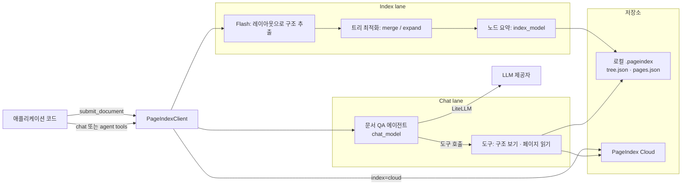
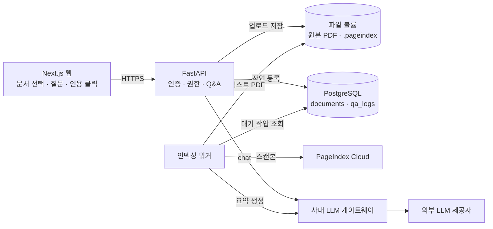
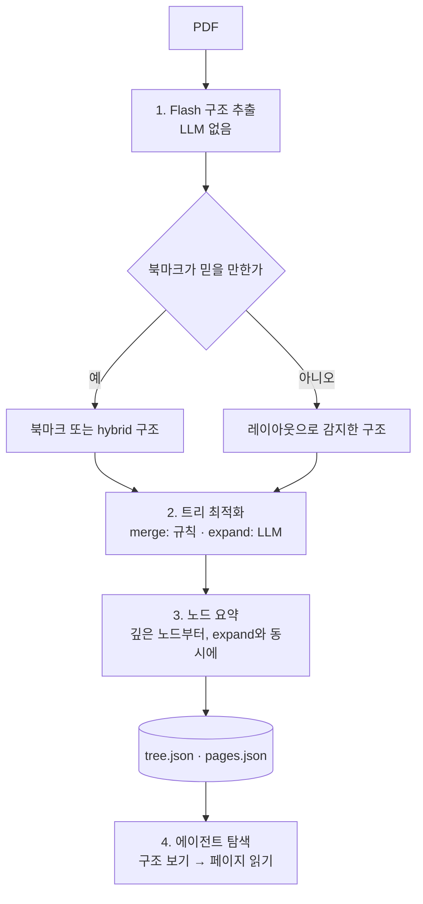

## 개요

> 긴 PDF를 잘게 잘라 벡터 DB에 넣는 대신 문서마다 "목차 트리"를 만들어 두고, LLM이 사람처럼 목차를 보며 필요한 페이지를 골라 읽은 뒤 답하게 만드는 벡터리스(vectorless), 추론 기반(reasoning-based) RAG용 Python SDK입니다.

## 30초 요약

| 항목 | 내용 |
|---|---|
| 무엇인가? | PDF마다 계층형 트리 인덱스를 만들고, LLM 에이전트가 그 트리를 탐색해 답을 찾게 하는 Python SDK(`pageindex`) |
| 왜 사용하는가? | 긴 전문 문서에서 "비슷한 문장"이 아니라 "질문에 실제로 필요한 섹션"을 찾고, 답의 근거 페이지를 남기기 위해 |
| 해결하는 문제 | 청크 분할로 문맥이 끊기고, 유사도 검색이 관련 없는 문단을 가져오며, 왜 그 문단이 선택됐는지 설명할 수 없는 문제 |
| 주요 사용처 | 사업보고서·공시, 계약서·법률 문서, 규정집, 기술 매뉴얼, 교재 같은 긴 PDF의 질의응답 |
| 핵심 개념 | 트리 인덱스, 노드 요약, Flash 인덱싱, index/chat 두 레인, 에이전트 도구(구조 → 페이지 읽기), 인용 |
| Client 사용 | △ (브라우저에서 직접 쓰는 라이브러리가 아님. 에이전트·노트북·CLI 같은 "호출하는 쪽"에서 사용) |
| Server 사용 | O (Python 백엔드에서 인덱싱 워커와 질의응답 API로 사용) |
| 대표 대안 | 벡터 RAG(LangChain·LlamaIndex + 벡터 DB), 긴 컨텍스트 모델에 PDF 통째로 넣기, 하이브리드 검색 |

- **벡터 DB와 청크가 없다**: 임베딩·청크 크기·top-k 튜닝 대신 문서의 원래 목차 구조를 인덱스로 씁니다.
- **검색이 곧 추론이다**: LLM이 트리의 제목과 요약을 보고 "이 질문이면 3장 2절, 41~44쪽"처럼 읽을 곳을 직접 고릅니다.
- **근거가 남는다**: 답변에 문서 이름과 페이지 번호(Cloud는 블록 단위)를 인용으로 붙일 수 있습니다.
- **로컬과 Cloud가 같은 클라이언트**: `PageIndexClient()`는 서버·API 키 없이 로컬에서 동작하고, 인자 하나로 인덱싱과 저장만 PageIndex Cloud로 옮길 수 있습니다.
- **에이전트 친화적**: OpenAI Agents SDK, Anthropic SDK, Claude Agent SDK에 바로 꽂을 수 있는 도구 묶음을 제공합니다.

---

## 어떤 라이브러리인가?

두꺼운 사업보고서에서 "2023년 영업이익률이 얼마였지?"를 찾는 사람을 떠올려 보겠습니다. 사람은 첫 페이지부터 읽지 않습니다. 목차를 펴서 "재무 정보 → 손익 요약" 쪽을 찾고, 그 몇 페이지만 읽고, 숫자가 애매하면 주석 섹션으로 넘어갑니다.

PageIndex는 **LLM이 이렇게 읽도록 만드는 도구**입니다. 문서를 처음 받을 때 한 번 "목차 + 섹션별 요약"으로 이루어진 트리를 만들어 저장해 두고, 질문이 오면 LLM 에이전트가 그 트리를 보고 어떤 페이지를 읽을지 판단한 뒤 해당 페이지만 꺼내 답합니다.

기술적으로 정의하면, PageIndex는 **문서 단위 계층형 인덱스(tree index)와 그 위에서 동작하는 도구 호출 기반 문서 QA 에이전트를 묶은 Python SDK**입니다. 처리는 두 단계로 나뉩니다.

1. **Index**: 문서마다 트리 구조 인덱스를 만듭니다. 로컬 기본 방식인 PageIndex Flash는 PDF 레이아웃 통계(글자 크기, 굵기, 번호 체계, 여백 등)로 구조를 뽑고, LLM은 노드 요약만 씁니다.
2. **Retrieve**: 질문이 오면 LLM이 트리를 에이전트 방식으로 탐색합니다. 구조를 먼저 보고, 필요한 페이지 범위만 읽고, 부족하면 다른 노드를 더 읽습니다.

VectifyAI가 만들었고 MIT 라이선스입니다. 2025년 4월 저장소가 공개된 뒤, 2026년 8월에 로컬 모드를 포함한 SDK와 Flash 인덱싱이 나오면서 지금의 사용 방식이 자리 잡았습니다.

### 주요 사용 사례

- **재무·공시 문서 분석**: 연차보고서, 분기 실적 발표, 규제 공시에서 수치와 근거 페이지를 함께 뽑습니다.
- **계약서·법률 문서 검토**: "해지 조항에서 통지 기간은?"처럼 조항 구조를 따라가야 답할 수 있는 질문에 씁니다.
- **사내 규정·매뉴얼 Q&A**: 수백 페이지짜리 규정집이나 장비 매뉴얼에서 해당 절을 찾아 답하고 출처를 보여줍니다.
- **교재·논문 학습 보조**: 1,000페이지 교재를 한 번 인덱싱해 두고 장·절 단위로 질문합니다.
- **에이전트의 문서 도구**: 이미 만든 에이전트에 "문서 구조 보기 / 페이지 읽기" 도구를 붙여 긴 문서를 다루게 합니다.

주요 용어는 [핵심 개념과 동작 구조](#h-pageindex-핵심-개념과-동작-구조)에서 자세히 다룹니다.

---

## 어떤 문제를 해결하는가?

```text
요구사항: 300페이지 사업보고서에 대해 정확한 숫자와 근거 페이지가 있는 답을 받고 싶다
 ↓
일반적인 구현: PDF를 500토큰 청크로 잘라 임베딩하고, 질문과 가장 비슷한 청크 top-5를 LLM에 넣는다
 ↓
문제 발생: 표와 그 설명이 다른 청크로 갈라지고, "영업이익"이 들어간 엉뚱한 문단이 상위에 오며, 왜 그 청크인지 설명할 수 없다
 ↓
PageIndex로 해결: 문서의 원래 목차 트리를 인덱스로 쓰고, LLM이 트리를 보며 읽을 섹션을 직접 고른다
```

### 상황 예시

증권사 리서치팀이 사내 도구를 만들고 있습니다. 애널리스트가 기업의 연차보고서 PDF를 올리고 "2023년 영업이익률과 전년 대비 변화 원인"을 물으면, 답과 함께 근거 페이지를 보여줘야 합니다. 숫자가 틀리면 보고서 전체의 신뢰가 무너지므로 "어느 페이지를 보고 답했는지"가 반드시 필요합니다.

### 일반적인 구현 방식

```python
# 흔한 벡터 RAG 파이프라인 (개념 예시)
chunks = split_pdf(pdf_path, chunk_size=500, overlap=50)       # 1. 고정 크기로 자르기
vectors = embed(chunks)                                         # 2. 임베딩
vector_db.upsert(zip(chunk_ids, vectors, chunks))               # 3. 벡터 DB 저장

def answer(question: str) -> str:
    hits = vector_db.search(embed([question])[0], top_k=5)      # 4. 유사도 top-k
    context = "\n\n".join(h.text for h in hits)
    return llm(f"다음 자료로 답하세요:\n{context}\n\n질문: {question}")
```

### 이 방식에서 발생하는 문제

- **문맥이 잘린다**: "영업이익률 12.3%"가 있는 표와 "원자재 가격 상승 때문"이라는 설명이 서로 다른 청크로 갈라지면, 둘 중 하나만 검색됩니다.
- **비슷함과 관련 있음은 다르다**: 질문은 "2023년 영업이익률"인데, 문장 모양이 비슷한 "2021년 영업이익률" 문단이나 경쟁사 비교 문단이 더 높은 점수를 받을 수 있습니다.
- **질문의 맥락을 쓰지 못한다**: 유사도 검색은 질문 임베딩 하나만 봅니다. "아까 말한 그 부문"처럼 대화 맥락이나 "재무제표 주석에 있을 것"이라는 도메인 지식을 검색에 반영하기 어렵습니다.
- **튜닝 지점이 많다**: 청크 크기, overlap, 임베딩 모델, top-k, 리랭커를 문서 종류마다 다시 맞춰야 합니다.
- **설명할 수 없다**: 왜 그 청크가 뽑혔는지가 벡터 점수뿐이라 검증하기 어렵습니다.

### PageIndex를 사용하면

문서는 청크가 아니라 "섹션 트리"로 저장되고, 검색은 LLM의 판단으로 이루어집니다. 설치와 호출 방법은 [설치와 첫 사용](#h-pageindex-설치와-첫-사용)에서 다룹니다.

- 트리 노드는 원본 문서의 장·절 경계를 따르므로 표와 설명이 같은 섹션 안에 남습니다.
- 에이전트는 "재무 정보 → 손익 요약(41~44쪽)"처럼 제목과 요약을 보고 읽을 곳을 고르고, 질문과 대화 맥락을 모두 판단에 씁니다.
- 답변에 `<cite doc="..." page="42"/>` 같은 인용을 붙여 근거 페이지를 화면에 보여줄 수 있습니다.
- 임베딩 모델과 벡터 DB를 운영하지 않아도 됩니다.

> **핵심:** 문서를 잘게 잘라 유사도로 찾는 대신, PageIndex가 **문서의 목차 트리를 인덱스로 만들고 LLM이 그 트리를 보며 읽을 페이지를 고르게** 해서 처리해줍니다.

---

## 왜 주목받고 있는가?

PageIndex는 GitHub Star 약 3.9만 개, Fork 약 3,300개를 기록하고 있습니다(2026년 10월 기준). 숫자보다 중요한 것은 이 접근이 어떤 흐름 위에 있느냐입니다.

**"검색도 추론으로" 흐름의 대표 사례입니다.** 모델이 도구를 호출하며 여러 단계로 일하는 에이전트 방식이 보편화되면서, 검색을 임베딩 한 번이 아니라 "목차 보기 → 페이지 읽기 → 다시 찾기"라는 여러 단계 추론으로 바꾸는 시도가 늘었습니다. PageIndex는 이 아이디어를 문서 검색에 가장 직접적으로 적용한 오픈소스입니다.

**긴 컨텍스트만으로는 해결되지 않는 문제를 겨냥합니다.** 문서를 통째로 모델에 넣으면 질문마다 문서 전체 비용을 냅니다. 공식 벤치마크에 따르면 PDF 전체 입력은 52페이지 문서에서 2.1배, 420페이지에서 16.6배 비쌌고, 805페이지에서는 컨텍스트 창에 들어가지 않았습니다. PageIndex는 추론이 도달한 노드만 읽으므로 문서가 길어져도 질문당 비용이 덜 늘어납니다.

**인덱싱 비용이 낮아졌습니다.** Flash 인덱싱은 구조 추출에 LLM을 쓰지 않습니다. 공식 수치로 페이지당 약 $0.001(1,000페이지 교재 기준 1달러 남짓), 9~1,098페이지 문서 기준 약 13초~4.5분입니다. 한 번 만든 트리는 이후 모든 질문에서 재사용됩니다.

**개발자 경험이 단순합니다.** `PageIndexClient()` → `submit_document()` → `chat()` 세 줄로 시작하고, 서버나 벡터 DB 없이 로컬에서 바로 돌아갑니다. 같은 코드를 Cloud로 옮기는 것도 인자 하나입니다.

**유지보수가 매우 활발합니다.** 2026년 8월 말부터 10월 초까지 0.2.11 → 0.2.21이 3~5일 간격으로 나왔습니다. 대신 PyPI 분류는 아직 `Development Status :: 3 - Alpha`이고, 최근 릴리스에도 Breaking Change가 있었습니다([주의할 점과 FAQ](#h-pageindex-주의할-점과-faq) 참고).

벡터 RAG와의 항목별 차이는 [장단점과 대안 비교](#h-pageindex-장단점과-대안-비교)에 정리했습니다.

---

## 언제 사용하면 좋은가?

- **수십~수천 페이지의 구조화된 전문 문서를 다룰 때**: 장·절·조항 구조가 뚜렷할수록 트리 인덱스의 효과가 큽니다. 연차보고서, 계약서, 규정집, 교재가 대표적입니다.
- **근거 페이지가 반드시 필요할 때**: 금융·법률·의료처럼 답의 출처를 사람이 검증해야 하는 분야에서 페이지 단위 인용이 그대로 감사 기록이 됩니다.
- **질문이 여러 섹션을 오가야 할 때**: "본문 수치와 주석의 설명을 대조해줘"처럼 한 번의 유사도 검색으로 모을 수 없는 정보를 에이전트가 단계적으로 찾아 읽습니다.
- **벡터 DB 운영을 피하고 싶을 때**: 문서 수가 많지 않고(수십~수백 건) 문서별로 깊게 질문하는 서비스라면, 임베딩 파이프라인 없이 파일 저장소 하나로 운영할 수 있습니다.
- **이미 에이전트가 있고 문서 도구가 필요할 때**: 에이전트 프레임워크용 도구를 제공하므로 기존 에이전트에 "긴 PDF 읽기 능력"을 붙이기 쉽습니다.

---

## 언제 사용하지 않는 것이 좋은가?

- **짧은 문서가 대부분일 때**: 10~20페이지 문서라면 전체를 컨텍스트에 넣는 편이 더 단순하고 정확합니다. PageIndex 자체도 20페이지 이하 문서는 구조를 건너뛰고 페이지를 바로 읽도록 에이전트를 안내합니다.
  > 예: 사내 공지 PDF 2~3장에 대한 Q&A라면 PDF를 그대로 모델에 넣으면 충분합니다.
- **수만~수백만 건의 짧은 문서에서 "어떤 문서가 관련 있는지"를 찾을 때**: PageIndex의 강점은 문서 하나 안의 탐색입니다. 대규모 말뭉치 검색은 오픈소스 범위 밖이고(Cloud의 PageIndex File System이 이 영역), 이 경우 벡터·키워드 검색이 더 빠르고 저렴합니다.
  > 예: 고객 문의 50만 건에서 비슷한 사례 찾기는 벡터 검색이 맞습니다.
- **응답 지연이 수백 ms 이내여야 할 때**: 질문마다 LLM이 여러 번 도구를 호출하므로 벡터 검색 한 번보다 느립니다. 자동완성이나 실시간 추천에는 맞지 않습니다.
- **스캔본·이미지 위주 문서를 로컬에서 처리해야 할 때**: 오픈소스 로컬 모드는 텍스트가 있는 PDF만 다룹니다. OCR이 필요하면 Cloud를 쓰거나 별도 OCR을 먼저 거쳐야 합니다.
- **목차 구조가 거의 없는 문서**: 채팅 로그, 줄글 메모, 표만 가득한 데이터 덤프는 트리가 페이지 단위로 평평해져 장점이 줄어듭니다.
- **LLM 호출 비용이 엄격히 고정돼야 할 때**: 질문마다 에이전트가 몇 번 도구를 부를지는 질문 난이도에 따라 달라집니다.

---

## 한눈에 정리

| 항목 | 내용 |
|---|---|
| 라이브러리 | PageIndex (PyPI `pageindex`, 2026년 10월 기준 최신 0.2.21) |
| 주요 목적 | 긴 전문 문서에서 추론 기반으로 관련 섹션을 찾아 근거와 함께 답하기 |
| 해결하는 문제 | 청크 분할로 인한 문맥 손실, 유사도와 관련성의 차이, 설명할 수 없는 검색, 벡터 파이프라인 튜닝 부담 |
| 핵심 개념 | 트리 인덱스, 노드 요약, Flash, index/chat 레인, 에이전트 도구, 인용 |
| 주요 사용처 | 재무·법률·규정·매뉴얼·교재 PDF 질의응답, 에이전트의 문서 도구 |
| Client 활용 | 에이전트 프레임워크(OpenAI Agents SDK, Anthropic SDK, Claude Agent SDK)에 도구로 연결 |
| Server 활용 | 인덱싱 워커 + 질의응답 API, 인용 기반 근거 표시, Local → Cloud 전환 |
| 장점 | 벡터 DB 불필요, 문맥 보존, 근거 페이지, 낮은 인덱싱 비용, 로컬/Cloud 동일 API |
| 단점 | 질문당 지연·비용 변동, 로컬은 텍스트 PDF만, 대규모 말뭉치 검색은 범위 밖, Alpha 단계의 잦은 변경 |
| 추천 상황 | 구조가 뚜렷한 긴 PDF를 깊게 질문하고 출처가 중요한 경우 |
| 비추천 상황 | 짧은 문서, 대규모 짧은 문서 검색, 초저지연 요구, 로컬 스캔본 |
| 대표 대안 | 벡터 RAG, 긴 컨텍스트 전체 입력, 하이브리드 검색 |

---

## 핵심 정리

### 한 문장으로

> PageIndex는 긴 문서에서 벡터 유사도 검색이 관련 섹션을 놓치는 문제를 **문서의 목차 트리를 인덱스로 만들고 LLM이 그 트리를 추론으로 탐색하게** 해서 해결하기 위한 Python SDK입니다.

### 이것만 기억하기

1. **왜 사용하는가?**
   - 긴 전문 문서에서 "비슷한 문장"이 아니라 "질문에 필요한 섹션"을 찾고, 답의 근거 페이지를 남기기 위해서입니다.

2. **어떤 문제를 해결하는가?**
   - 청크 분할로 표와 설명이 갈라지는 문제, 유사도가 관련성과 다른 문제, 검색 이유를 설명할 수 없는 문제, 벡터 파이프라인 튜닝 부담입니다.

3. **어떻게 동작하는가?**
   - 문서마다 한 번 트리(제목·페이지 범위·요약)를 만들어 저장하고, 질문이 오면 에이전트가 "구조 보기 → 필요한 페이지만 읽기"를 반복해 답합니다.

4. **실제 프로젝트에서는 어디에 사용하는가?**
   - 연차보고서·계약서·규정집 Q&A 서비스, 근거 페이지 표시가 필요한 분석 도구, 기존 에이전트의 문서 읽기 도구로 씁니다.

5. **언제 사용하지 않는가?**
   - 짧은 문서, 수많은 짧은 문서 중에서 찾는 검색, 초저지연 서비스, 로컬에서 스캔본을 처리해야 하는 경우입니다.

6. **비슷한 기술과 가장 큰 차이는 무엇인가?**
   - 검색 단계를 임베딩 점수가 아니라 **LLM의 판단**으로 바꿨다는 점입니다. 그 대가로 질문마다 LLM 호출이 여러 번 일어나므로, 정확도·설명 가능성과 지연·비용 사이의 교환으로 이해해야 합니다.

## PageIndex 핵심 개념과 동작 구조

> PageIndex를 이루는 트리 인덱스, 노드 요약, Flash 인덱싱, index/chat 레인, 에이전트 도구, 인용이 각각 무엇이고 어떻게 맞물려 동작하는지 다룹니다.

### 용어 한눈에 보기

| 키워드 | 설명 |
|---|---|
| Tree index | 문서의 장·절 구조를 그대로 옮긴 계층형 인덱스. 노드마다 제목, 페이지 범위, 요약을 가짐 |
| Node | 트리의 한 칸. `node_id`(4자리 문자열), `title`, `start_index`, `end_index`, `summary`, 하위 `nodes` |
| Flash | 로컬 기본 인덱싱 엔진. PDF 레이아웃 통계로 구조를 뽑고 LLM은 요약만 작성 |
| Standard | LLM이 목차 탐지부터 트리 생성까지 맡는 기존 파이프라인(`mode="standard"`) |
| Index lane | 트리를 만들고 요약하는 모델(`index_model`). 저렴한 기본 모델로 충분 |
| Chat lane | 트리를 탐색해 답하는 모델(`chat_model`). 가능한 좋은 모델 권장 |
| Agent tools | 에이전트가 쓰는 도구 묶음. `browse_documents`, `get_document`, `get_document_structure`, `get_page_content` |
| Citation | 답변 속 근거 태그. 로컬은 페이지 단위, Cloud는 레이아웃 블록 단위까지 |
| `toc_source` | 트리 구조의 출처. `detected` / `bookmarks` / `hybrid` / `pages` / `unreadable` |

---

### 1. 트리 인덱스 (Tree Index)

#### 쉽게 설명하면

책 앞쪽의 목차에 "각 장이 무슨 내용인지 한두 문단 설명"을 붙여 둔 것입니다. 목차만 훑어도 어느 장을 펴야 할지 알 수 있습니다.

#### 개발 관점에서는

PageIndex의 인덱스는 벡터 배열이 아니라 **JSON 트리**입니다. 노드는 문서의 실제 제목을 따르고, 각 노드는 자신이 덮는 페이지 범위(`start_index` ~ `end_index`, 1부터 시작, 양 끝 포함)와 그 범위의 요약을 가집니다. 검색 단계에서 모델이 보는 것은 이 트리(텍스트 제외)이고, 실제 본문은 필요할 때 페이지 번호로 따로 꺼냅니다.

0.2.21부터 로컬과 Cloud의 트리 모양이 하나로 통일되었습니다. 부모 노드의 범위와 요약은 하위 섹션까지 포함한 섹션 전체를 덮고, 부모의 첫 하위 섹션 앞에 있는 페이지는 `"<제목> (intro)"` 노드로 분리됩니다.

#### 예제

```json
[
  {
    "title": "재무 정보",
    "node_id": "0007",
    "start_index": 38,
    "end_index": 61,
    "summary": "연결 손익, 부문별 실적, 현금흐름과 주요 재무 비율을 다룬다.",
    "nodes": [
      {
        "title": "손익 요약",
        "node_id": "0008",
        "start_index": 41,
        "end_index": 44,
        "summary": "2023년 매출 24.7조 원, 영업이익률 12.3%, 전년 대비 원가율 변화 설명."
      },
      {
        "title": "부문별 실적",
        "node_id": "0009",
        "start_index": 45,
        "end_index": 52,
        "summary": "가전·부품·서비스 부문별 매출과 영업이익, 환율 영향."
      }
    ]
  }
]
```

에이전트는 이 구조만 보고도 "영업이익률은 0008 노드, 41~44쪽"이라고 판단할 수 있습니다.

#### 핵심

> 인덱스가 "의미 벡터"가 아니라 "사람이 읽을 수 있는 목차"이기 때문에, 검색 경로를 사람이 그대로 확인할 수 있습니다.

### 2. 노드 요약과 index lane

#### 쉽게 설명하면

목차 제목만으로는 부족할 때가 있습니다. "기타 사항"이라는 제목 아래 핵심 수치가 숨어 있을 수 있으니, 각 장에 짧은 소개글을 붙여 두는 작업입니다.

#### 개발 관점에서는

노드 요약은 인덱싱 시점에 **index lane 모델**이 씁니다. 공식 권장은 "index 모델은 기본 모델로 충분"입니다. 구조 자체는 레이아웃에서 나오고 모델은 요약과 다듬기만 하기 때문입니다. 요약은 `summary_max_words`(기본 150단어) 안에서 작성되고, 짧은 말단 노드는 요약 대신 원문을 그대로 씁니다.

한 번 만든 요약은 저장되어 이후 모든 질문에서 재사용됩니다. 그래서 인덱싱은 "문서당 한 번 내는 고정 비용"이고, 질문 비용은 chat lane에서 발생합니다.

#### 예제

```python
from pageindex import PageIndexClient

client = PageIndexClient(
    index={"model": "gpt-5.6-luna", "summary_max_words": 80},  # 저렴한 모델 + 짧은 요약
    chat="gpt-5.6-sol",                                         # 탐색은 좋은 모델
)
```

#### 핵심

> 요약은 "검색할 때 길잡이가 되는 메타데이터"입니다. 저렴한 모델로 한 번 만들고, 돈은 질문에 답하는 모델에 씁니다.

### 3. Flash와 Standard 인덱싱

#### 쉽게 설명하면

목차를 만드는 두 가지 방법입니다. Flash는 "글자가 크고 굵고 번호가 붙은 줄은 제목"이라는 식으로 **모양을 보고** 목차를 만들고, Standard는 LLM에게 **내용을 읽혀서** 목차를 만듭니다.

#### 개발 관점에서는

- **Flash(로컬 기본값)**: pdfium으로 글자 단위 정보를 뽑아 줄·블록·단(column)을 복원하고, 머리글·바닥글·워터마크를 걸러낸 뒤 제목 후보를 모아 개요를 조립합니다. PDF에 북마크가 있고 믿을 만하면 그것도 씁니다. 구조 생성에는 LLM이 없고, 그 뒤 트리 최적화(병합·확장)와 노드 요약에만 LLM을 씁니다.
- **Standard(`mode="standard"`)**: 목차 페이지 탐지, 제목-페이지 매칭, 검증을 LLM 호출로 수행하는 기존 파이프라인입니다. 더 느리지만 레이아웃이 특이한 문서에서 대안이 됩니다.

트리 최적화는 `optimize`로 조절합니다. `"full"`(기본)은 결정적 병합 + LLM 확장, `"merge"`는 LLM 없는 병합만, `"off"`는 원본 트리 그대로입니다. 세부 원리는 [트리 인덱스와 추론 탐색 깊이 보기](#h-pageindex-트리-인덱스와-추론-탐색-깊이-보기)에서 다룹니다.

#### 예제

```python
# 기본: Flash + 최적화(full) + 요약
doc = client.submit_document("annual-report.pdf")

# 레이아웃이 특이해 Flash 결과가 마음에 들지 않을 때
doc = client.submit_document("odd-layout.pdf", mode="standard")
```

#### 핵심

> Flash는 "구조는 규칙으로, 요약은 LLM으로" 나눠 인덱싱을 빠르고 싸게 만든 엔진입니다. 결과에 붙는 `toc_source`로 구조가 어디서 왔는지 확인할 수 있습니다.

### 4. index / chat 두 레인과 로컬·Cloud

#### 쉽게 설명하면

"문서를 어디에 보관하고 정리하느냐"와 "누가 질문에 답하느냐"를 따로 고를 수 있습니다. 도서관(문서 보관)은 Cloud에 맡기고, 사서(답하는 모델)는 내가 계약한 모델을 쓰는 식입니다.

#### 개발 관점에서는

`PageIndexClient`는 두 축으로 구성됩니다.

| 축 | 로컬 | Cloud |
|---|---|---|
| index (문서가 사는 곳) | 내 컴퓨터에서 인덱싱, `storage_path`(기본 `./.pageindex`)에 저장 | PageIndex가 파싱·OCR·트리 생성·저장 |
| chat (누가 답하나) | 내 모델, 내 키(LiteLLM 경유) | 내 모델(`chat_model` 지정 시) 또는 PageIndex 관리형 chat |

인자 없는 `PageIndexClient()`는 환경 변수에 `PAGEINDEX_API_KEY`가 있어도 **항상 로컬**입니다. Cloud는 `index="cloud"`나 `api_key=`로 코드에서 명시해야 합니다. "로컬 문서 + 관리형 chat" 조합은 관리형 chat이 내 디스크를 읽을 수 없으므로 불가능합니다.

#### 예제

```python
from pageindex import PageIndexClient

local = PageIndexClient()                                   # 로컬 문서 + 내 모델(기본값)
cloud_own_model = PageIndexClient(index="cloud", chat="gpt-5.6-sol")  # Cloud 문서 + 내 모델
cloud_managed = PageIndexClient(index="cloud")              # Cloud 문서 + 관리형 chat
```

#### 핵심

> `api_key`는 문서의 위치를 옮길 뿐, 모델을 바꾸지 않습니다. 같은 코드를 로컬에서 Cloud로 옮길 때 바뀌는 것은 index 쪽 한 줄입니다.

### 5. 에이전트 도구 (구조 보기 → 페이지 읽기)

#### 쉽게 설명하면

사서에게 주는 업무 도구입니다. "서가 목록 보기", "책 상태 확인", "목차 보기", "특정 페이지 펴기" 네 가지만 쥐여 주고, 어떤 순서로 쓸지는 사서가 판단합니다.

#### 개발 관점에서는

`chat()`의 내부와 `agent_tools()`가 공유하는 도구 계약은 PageIndex Cloud MCP 서버와 이름·스키마가 같습니다.

| 도구 | 하는 일 |
|---|---|
| `browse_documents` | 라이브러리의 문서 목록(이름, 설명) |
| `get_document` | 문서 상태와 메타데이터 확인 |
| `get_document_structure` | 텍스트를 뺀 트리(제목·범위·요약). 크면 `part`로 나눠 받음 |
| `get_page_content` | `"41-44"`, `"3,7,10"` 같은 페이지 지정으로 본문 읽기 |
| `remove_document` | 문서 삭제(`include_management=True`일 때만) |

에이전트 지시문에는 "20페이지를 넘는 문서는 구조를 먼저 보고 좁은 페이지 범위만 읽어라, 20페이지 이하면 바로 읽어라"라는 규칙이 들어 있습니다. 도구는 예외를 던지지 않고 `{"success": ...}` 또는 `{"error": ...}` JSON과 다음 행동 안내(`next_steps`)를 돌려줍니다.

#### 예제

```python
tools = client.agent_tools()        # 프레임워크 무관 일반 함수 목록
print([t.__name__ for t in tools])
# ['browse_documents', 'get_document', 'get_document_structure', 'get_page_content']
```

#### 핵심

> PageIndex의 "검색"은 함수 하나가 아니라 **도구 호출의 연쇄**입니다. 트리는 지도이고, 어디를 읽을지는 chat 모델이 정합니다.

### 6. 인용 (Citations)

#### 쉽게 설명하면

답변 문장마다 "(보고서 42쪽)"처럼 출처를 다는 것입니다.

#### 개발 관점에서는

`chat(citations=True)`로 물으면 모델이 `<cite doc="report.pdf" page="42"/>` 태그를 답에 넣습니다. `get_citations(answer)`는 이 태그를 문서 ID·페이지 목록으로 풀고, `resolve_citations(answer)`는 태그를 `[[1]](#pageindex-citation-01)` 같은 번호 링크로 바꾼 표시용 답변과 인용 목록을 돌려줍니다. Cloud 문서는 블록 단위(페이지 내 좌표 `bbox`)까지 내려갈 수 있습니다.

#### 예제

```python
answer = client.chat("2023년 영업이익률은?", doc_id=doc_id, citations=True)
resolved = client.resolve_citations(answer, doc_id=doc_id)
print(resolved["answer"])                     # 번호 링크가 달린 답변
for c in resolved["citations"]:
    print(c["index"], c["document"], c["page"])
```

#### 핵심

> 인용은 "모델이 실제로 읽은 페이지"를 사용자 화면까지 연결하는 장치입니다. 0.2.19에서 이름이 바뀐 이력이 있으니 버전을 확인하고 씁니다.

---

### 7. 전체 동작 구조



한 번의 질문이 처리되는 순서는 다음과 같습니다.

1. **시작점**: 문서를 처음 올리면 `submit_document()`가 PDF의 페이지 텍스트를 뽑고 Flash로 트리 구조를 만듭니다. 로컬에서는 이 호출 안에서 인덱싱이 끝나고, Cloud에서는 업로드 후 비동기로 처리됩니다(`wait=True`로 기다릴 수 있음).
2. **PageIndex가 개입하는 시점**: 트리 최적화와 노드 요약이 index lane 모델로 실행되고, 결과가 `tree.json`(구조·요약)과 `pages.json`(페이지 본문)으로 저장됩니다. 여기까지가 문서당 한 번 일어나는 일입니다.
3. **내부 처리**: `chat(question, doc_id=...)`가 호출되면 chat lane 모델로 문서 QA 에이전트가 만들어지고, 대상 문서 정보와 도구 사용 규칙이 지시문으로 들어갑니다.
4. **외부 시스템과의 연결**: 에이전트는 `get_document_structure`로 트리를 보고, 관련 노드의 페이지 범위를 `get_page_content`로 읽습니다. 부족하면 다른 노드를 더 읽습니다. 모델 호출은 LiteLLM을 거쳐 OpenAI·Anthropic·Bedrock·Vertex·OpenAI 호환 서버 등으로 나갑니다.
5. **결과 반환**: 에이전트가 읽은 페이지를 근거로 답을 만들고, 요청했다면 인용 태그를 붙여 반환합니다. 스트리밍(`stream=True`)이면 생각·도구 호출 과정이 텍스트로 흘러나옵니다.

## PageIndex 설치와 첫 사용

> 설치 방법, 모델과 저장 위치 같은 기본 설정, 가장 간단한 첫 실행, 그리고 설치·설정할 때 자주 겪는 문제를 다룹니다.

### 설치

필요 조건은 Python 3.10 이상과, 사용할 LLM 제공자의 API 키(기본값은 OpenAI)입니다. 로컬 모드에는 PageIndex API 키, 서버, 벡터 DB가 필요 없습니다.

```bash
pip install -U pageindex
```

```bash
uv add pageindex
```

```bash
poetry add pageindex
```

에이전트 프레임워크와 연결할 때는 extra를 함께 설치합니다.

```bash
pip install -U "pageindex[anthropic]"   # Anthropic SDK tool runner, chat(protocol="messages")
pip install -U "pageindex[claude]"      # Claude Agent SDK
```

기본 설치에 `openai`, `openai-agents`(chat 엔진), `litellm`(모델 라우팅), `mcp`, `pypdfium2`·`PyPDF2`(PDF 처리), `Pillow`가 함께 들어옵니다. 의존성이 가볍지 않으므로 기존 프로젝트에 넣을 때는 가상 환경을 분리하는 편이 안전합니다.

### 기본 설정

**모델 키**

```bash
export OPENAI_API_KEY="sk-..."          # 기본 모델(OpenAI)을 쓸 때
export ANTHROPIC_API_KEY="sk-ant-..."   # anthropic/ 모델을 쓸 때
```

**모델과 저장 위치**

```python
from pageindex import PageIndexClient

client = PageIndexClient(
    index={"model": "gpt-5.6-luna", "storage_path": "./data/pageindex"},  # 인덱싱 모델 + 저장 위치
    chat="anthropic/claude-opus-5",                                       # 답변 모델
)
```

- 모델 이름은 LiteLLM 규칙을 따릅니다. 접두사 없는 이름은 OpenAI 모델, 다른 제공자는 `anthropic/...`, `bedrock/...`, `vertex_ai/...`처럼 `제공자/모델` 형식입니다.
- 아무것도 지정하지 않으면 SDK 기본값(2026년 10월 기준 index `gpt-5.6-luna`, chat `gpt-5.6-sol`)을 씁니다.
- `storage_path`의 기본값은 현재 작업 디렉터리의 `./.pageindex`입니다. 스크립트를 어디서 실행하느냐에 따라 저장 위치가 달라지므로, 서비스에서는 절대 경로로 고정합니다.

**사내 게이트웨이나 OpenAI 호환 서버(vLLM, Ollama 등)**

```python
client = PageIndexClient(
    index={
        "model": "gpt-5.6-luna",
        "backend": {"api_key": "gateway-key", "base_url": "https://llm-gateway.internal/v1"},
    },
    chat={
        "model": "gpt-5.6-sol",
        "backend": {"api_key": "gateway-key", "base_url": "https://llm-gateway.internal/v1"},
    },
)
```

index와 chat은 서로 다른 레인이므로 연결 정보도 각각 지정합니다. 인덱싱은 사내 저렴한 모델로, 답변은 외부 고성능 모델로 나누는 구성도 가능합니다.

### 가장 간단한 예제

```python
# quickstart.py
from pageindex import PageIndexClient


def main() -> None:
    client = PageIndexClient()  # 로컬 모드, SDK 기본 모델

    doc = client.submit_document("annual-report.pdf")
    doc_id = doc["doc_id"]

    # 트리 확인: 텍스트 없이 제목·페이지 범위·요약만
    for node in client.get_document_structure(doc_id):
        print(node["node_id"], node["title"], node["start_index"], node["end_index"])

    answer = client.chat("2023년 영업이익률과 전년 대비 변화 원인은?", doc_id=doc_id)
    print(answer)


if __name__ == "__main__":  # Flash가 하위 프로세스를 띄우므로 반드시 필요
    main()
```

```bash
python quickstart.py
```

1. **무엇을 생성하는가**: `submit_document()`가 PDF를 Flash로 인덱싱해 트리를 만들고 `./.pageindex/` 아래에 문서 폴더(`tree.json`, `pages.json`, `doc.json`)를 저장합니다. 반환값은 `{"doc_id": ..., "name": ...}`입니다. 같은 이름의 문서가 이미 있으면 `name_1`처럼 접미사가 붙고 경고가 출력됩니다.
2. **어떤 값을 전달하는가**: `chat()`에는 질문 문자열(또는 대화 메시지 목록)과 대상 `doc_id`를 넘깁니다. `doc_id`에 목록을 주면 여러 문서를 함께 대상으로 삼습니다.
3. **PageIndex가 무엇을 처리하는가**: chat 모델로 문서 QA 에이전트를 만들고, 에이전트가 트리 구조를 본 뒤 관련 페이지를 골라 읽습니다. 로컬 문서는 `doc_id` 범위 제한이 프롬프트뿐 아니라 도구 계층에서도 강제됩니다.
4. **어떤 결과를 반환하는가**: 답변 문자열을 반환합니다. `stream=True`면 텍스트 조각을 순서대로 내주는 스트림, `citations=True`면 인용 태그가 포함된 답변이 됩니다.

인덱싱은 문서당 한 번이므로, 실제 사용에서는 `doc_id`를 DB 등에 저장해 두고 다음부터는 `chat()`만 호출합니다. 저장된 문서는 `client.list_documents()`로 다시 찾을 수 있습니다.

**Cloud로 옮기기**

```python
import os
from pageindex import PageIndexClient

os.environ["PAGEINDEX_API_KEY"] = "pi-..."

client = PageIndexClient(index="cloud", chat="gpt-5.6-sol")
doc_id = client.submit_document("scanned-contract.pdf", wait=True)["doc_id"]  # Cloud는 비동기라 wait로 대기
print(client.chat("해지 통지 기간은?", doc_id=doc_id))
```

바뀌는 것은 `index="cloud"`와 `wait=True`뿐입니다. Cloud는 스캔본 OCR, 이미지 이해, 폴더, 메타데이터, 블록 단위 인용을 추가로 지원합니다.

---

### 설치·설정할 때 주의할 점

- **`if __name__ == "__main__":` 가드가 필요합니다.** Flash는 PDF 파싱을 여러 프로세스로 나눠 실행합니다. macOS·Windows의 spawn 방식에서는 하위 프로세스가 스크립트를 다시 import하므로, 가드가 없으면 `submit_document()`가 "spawned worker process" 오류로 중단됩니다. Jupyter 노트북에서는 문제가 되지 않습니다.
- **인자 없는 클라이언트는 항상 로컬입니다.** `.env`에 `PAGEINDEX_API_KEY`를 넣어도 `PageIndexClient()`는 Cloud로 가지 않습니다. Cloud를 의도했다면 `index="cloud"` 또는 `api_key=`를 코드에 적어야 합니다.
- **로컬 SDK는 PDF만 받습니다.** `.docx`, `.txt`는 먼저 PDF로 변환합니다. Markdown은 SDK 클라이언트가 아니라 CLI(`python run_pageindex.py --md_path doc.md`, 저장소 클론 필요)나 `md_to_tree()`로 트리만 만들 수 있습니다.
- **텍스트 레이어가 없는 PDF는 로컬에서 실패합니다.** 모든 페이지가 비어 있으면 "PDF has no content" 오류가 납니다. 스캔본은 Cloud를 쓰거나 OCR 도구로 텍스트 레이어를 먼저 입힙니다.
- **설정 키를 틀리면 생성 시점에 바로 실패합니다.** `index=`/`chat=` 딕셔너리의 오타, 로컬과 Cloud 설정 혼용, `mode="standard"`와 Flash 전용 옵션(`summary_max_words` 등) 혼용은 클라이언트 생성이나 제출 단계에서 허용되는 키 목록과 함께 오류가 납니다. 조용히 무시되지 않으므로 오류 메시지를 그대로 읽으면 됩니다.
- **모델 키가 잘못되면 인덱싱 전체가 실패합니다.** 요약이 빈 채로 저장되는 대신 실패하므로, 대량 인덱싱 전에 작은 PDF로 키와 모델 이름을 먼저 확인합니다.
- **레이트 리밋이 낮은 계정**: Flash는 요약 호출을 동시에 최대 64개(`summary_concurrency` 기본값)까지 보냅니다. 429 오류가 잦으면 `index={"summary_concurrency": 8}`처럼 낮춥니다.
- **버전 고정**: 릴리스가 잦고 Breaking Change가 있었으므로 `pageindex==0.2.21`처럼 고정하고, 올릴 때 릴리스 노트를 확인합니다. 저장소의 `pyproject.toml`에 적힌 버전은 자리표시자이고, 실제 버전은 릴리스 태그에서 정해집니다.

## PageIndex 활용 예시 ① 근거 페이지가 달린 문서 질의응답

> 두 해 연차보고서를 비교하는 질의응답을 만들면서, 인용으로 근거 페이지를 붙이고 에이전트가 실제로 읽은 페이지를 기록하는 방법을 다룹니다.

### 예제 1. 연차보고서 두 개를 비교하는 Q&A

#### 요구사항

> 애널리스트가 한 회사의 2022년·2023년 연차보고서(각 200~300페이지)를 올리고 "영업이익률이 어떻게 변했고 원인은 무엇인가?"를 묻는다. 답변의 모든 수치에는 문서 이름과 페이지 번호가 붙어야 하고, 이어지는 후속 질문("그중 원자재 영향은 얼마나 되나?")도 이전 대화를 이어서 답해야 한다.

#### 구현

```python
# analyst_qa.py
from pageindex import PageIndexClient

QUESTION = "2022년 대비 2023년 영업이익률은 어떻게 변했고, 보고서가 밝힌 원인은 무엇인가요?"
FOLLOW_UP = "그중 원자재 가격 영향은 금액으로 얼마나 되나요?"


def main() -> None:
    client = PageIndexClient(
        index={"model": "gpt-5.6-luna", "storage_path": "/srv/pageindex"},
        chat="gpt-5.6-sol",  # 탐색 품질이 정확도를 좌우하므로 좋은 모델
    )

    # 1. 인덱싱은 문서당 한 번. 이미 있으면 재사용한다
    existing = {d["name"]: d["id"] for d in client.list_documents(limit=1000)["documents"]}
    doc_ids = []
    for path in ["reports/acme-2022.pdf", "reports/acme-2023.pdf"]:
        name = path.rsplit("/", 1)[-1]
        doc_ids.append(existing.get(name) or client.submit_document(path)["doc_id"])

    # 2. 첫 질문: 두 문서를 함께 대상으로, 인용 포함
    messages = [{"role": "user", "content": QUESTION}]
    answer = client.chat(messages, doc_id=doc_ids, citations=True)

    resolved = client.resolve_citations(answer, doc_id=doc_ids)
    print(resolved["answer"])
    for c in resolved["citations"]:
        print(f'  [{c["index"]}] {c["document"]} p.{c["page"]}')

    # 3. 후속 질문: 보이는 대화를 직접 이어 붙인다 (doc_id는 같은 값 유지)
    messages += [
        {"role": "assistant", "content": answer},
        {"role": "user", "content": FOLLOW_UP},
    ]
    print(client.chat(messages, doc_id=doc_ids, citations=True))


if __name__ == "__main__":
    main()
```

출력은 대략 다음과 같은 모양입니다.

```text
2023년 영업이익률은 12.3%로 2022년 9.8%에서 2.5%p 올랐습니다 [[1]](#pageindex-citation-01) [[2]](#pageindex-citation-02).
보고서는 원인으로 판가 인상과 고마진 서비스 부문 비중 확대를 들고, 원자재 가격 부담은 일부 상쇄 요인으로 설명합니다 [[3]](#pageindex-citation-03).
  [1] acme-2023.pdf p.42
  [2] acme-2022.pdf p.39
  [3] acme-2023.pdf p.47
```

#### 실행 흐름

```text
애널리스트 질문
 ↓
chat(doc_id=[2022, 2023], citations=True)
 ↓
에이전트: get_document_structure(acme-2023.pdf) → "재무 정보 > 손익 요약 (41~44쪽)" 선택
 ↓
에이전트: get_page_content(acme-2023.pdf, "41-44") → 12.3% 확인
 ↓
에이전트: 2022 문서도 같은 방식으로 구조 → 페이지 읽기 → 9.8% 확인
 ↓
에이전트: 원인 설명이 있는 "경영진 분석(46~48쪽)"을 추가로 읽음
 ↓
인용 태그가 붙은 답변 → resolve_citations()로 번호 링크와 목록으로 변환
```

#### 코드 설명

1. **인덱싱 결과를 재사용합니다.** `submit_document()`는 호출할 때마다 인덱싱 비용이 듭니다. 같은 이름으로 다시 올리면 새 문서(`acme-2023_1.pdf`)가 생기므로, `list_documents()`로 먼저 확인합니다. 실제 서비스에서는 `doc_id`를 DB에 저장합니다([활용 예시 ③](#h-pageindex-활용-예시-③-서비스-운영과-실전-프로젝트) 참고).
2. **`doc_id`에 목록을 넘깁니다.** 두 문서를 한 대화의 대상으로 지정하면, 에이전트가 문서마다 구조를 보고 필요한 부분을 따로 읽습니다. 로컬 문서에서는 이 범위가 도구 계층에서도 강제되어, 라이브러리의 다른 문서를 읽지 못합니다.
3. **`citations=True` + `resolve_citations()`**: 모델이 넣은 `<cite doc=... page=.../>` 태그를 번호 링크로 바꿔, 화면에서 각 번호를 "문서 이름 + 페이지"로 연결할 수 있게 합니다. 로컬 문서는 페이지 단위까지입니다.
4. **대화 상태는 호출자가 관리합니다.** `chat()`은 서버 쪽 세션을 두지 않습니다. 사용자에게 보인 대화를 `role/content` 목록으로 쌓아 다시 넘기고, 대화 중 `doc_id`는 바꾸지 않습니다.

#### 왜 이렇게 사용하는가?

같은 질문을 벡터 RAG로 처리하면 "영업이익률"이 들어간 문단이 2022·2023 문서 모두에서, 그리고 "5개년 요약표" 같은 엉뚱한 섹션에서도 높은 점수로 섞여 나옵니다. 어느 해 수치인지 모델이 혼동하기 쉽습니다. PageIndex에서는 에이전트가 **문서별로 목차를 따라가 해당 연도의 손익 섹션을 직접 고르기** 때문에 이런 혼동이 줄고, 인용이 그 선택을 사용자에게 보여줍니다. 숫자가 틀렸을 때도 "어느 페이지를 읽고 그렇게 답했는지"를 바로 확인할 수 있습니다.

---

### 예제 2. 에이전트가 읽은 페이지를 감사 로그로 남기기

#### 요구사항

> 컴플라이언스팀은 답변마다 "모델이 실제로 열어 본 페이지"를 기록해 두길 원한다. 인용은 모델이 답에 적은 것이고, 감사 로그는 모델이 실제로 읽은 것이어야 한다.

#### 구현

```python
# audit_trail.py
import json

from pageindex import PageIndexClient


def ask_with_trace(client: PageIndexClient, question: str, doc_id: str) -> dict:
    stream = client.chat(question, doc_id=doc_id, stream=True)

    answer_parts: list[str] = []
    pages_read: list[dict] = []
    for event in stream.events:  # 텍스트 대신 타입이 있는 이벤트로 소비
        if event["type"] == "answer":
            answer_parts.append(event["delta"])
        elif event["type"] == "tool_call" and event["name"] == "get_page_content":
            args = json.loads(event["arguments"]) if isinstance(event["arguments"], str) else event["arguments"]
            pages_read.append({"doc": args.get("doc_name"), "pages": args.get("pages")})

    return {"answer": "".join(answer_parts), "pages_read": pages_read}


def main() -> None:
    client = PageIndexClient(index={"storage_path": "/srv/pageindex"})
    doc_id = client.get_document_id("internal-policy-2026.pdf")  # 표시 이름으로 ID 조회
    result = ask_with_trace(client, "해외 출장 시 1일 숙박비 한도는?", doc_id)
    print(result["answer"])
    print(result["pages_read"])  # 예: [{'doc': 'internal-policy-2026.pdf', 'pages': '57-58'}]


if __name__ == "__main__":
    main()
```

#### 실행 흐름

```text
chat(stream=True) → ChatStream
 ↓
.events 소비: thinking → tool_call(get_document_structure) → tool_result
 ↓
tool_call(get_page_content, pages="57-58") → 감사 로그에 기록
 ↓
answer 이벤트의 delta를 모아 최종 답변 구성
```

#### 코드 설명

1. **스트림은 한 가지 방식으로만 소비합니다.** `ChatStream`은 그대로 순회하면 텍스트 조각을, `.events`로 순회하면 `thinking`·`answer`·`tool_call`·`tool_result` 이벤트를 줍니다. 한 번의 실행은 한 가지 보기만 제공하므로 둘 다 필요하면 이벤트에서 텍스트를 직접 모읍니다.
2. **`tool_call`의 인자에서 페이지를 뽑습니다.** `get_page_content`의 `pages` 인자가 곧 모델이 실제로 연 페이지 범위입니다.
3. **`get_document_id(name)`**: 표시 이름으로 문서 ID를 찾습니다. 사람이 파일 이름으로 문서를 지정하는 화면과 잘 맞습니다.

#### 왜 이렇게 사용하는가?

인용은 "모델이 근거라고 주장한 것"이고, 도구 호출 기록은 "모델이 실제로 읽은 것"입니다. 둘을 함께 저장해 두면 인용된 페이지를 실제로 읽지 않은 답변(환각 가능성)을 기계적으로 찾아낼 수 있습니다. 벡터 RAG에서는 검색된 청크를 저장할 수는 있어도 "왜 그 청크였는지"가 점수뿐이지만, PageIndex에서는 **구조를 보고 → 이 범위를 열었다**는 탐색 경로 자체가 사람이 읽을 수 있는 감사 기록이 됩니다.

## PageIndex 활용 예시 ② 에이전트에 문서 도구로 붙이기

> 이미 만들어 둔 에이전트(OpenAI Agents SDK, Anthropic SDK, Claude Agent SDK, 그 밖의 프레임워크)에 PageIndex를 "긴 문서 읽기 도구"로 연결하는 방법을 다룹니다.

PageIndex는 브라우저에서 실행되는 클라이언트 라이브러리가 아니므로, 여기서는 **PageIndex를 호출하는 쪽, 즉 에이전트**를 클라이언트 관점으로 봅니다. `chat()`은 PageIndex가 에이전트를 대신 만들어 주는 방식이고, 이 문서의 방식은 **내 에이전트가 대화와 다른 도구를 쥐고 있고 PageIndex는 도구만 빌려주는** 방식입니다.

### 활용할 수 있는 기능

| 메서드 | 대상 | 돌려주는 것 |
|---|---|---|
| `agent_tools()` | LangChain, PydanticAI 등 아무 프레임워크 | JSON 문자열을 반환하는 일반 Python 함수 목록 |
| `as_openai_tools()` / `openai_agent_config()` | OpenAI Agents SDK | `Agent(tools=...)`용 도구 / `Agent(**...)` 인자 한 벌 |
| `as_anthropic_tools()` / `anthropic_runner_config()` | Anthropic SDK tool runner | 도구 정의 / runner 인자 한 벌 |
| `as_claude_mcp()` / `claude_agent_config()` | Claude Agent SDK | MCP 서버 설정 / `ClaudeAgentOptions(**...)` 인자 한 벌 |
| `agent_instructions()` | 공통 | 도구 사용 규칙이 담긴 시스템 프롬프트 |
| `document_context(doc_id)` | 공통 | 대상 문서를 지정하는 첫 사용자 메시지 |
| `citation_prompt()` | 공통 | 인용 규칙 프롬프트 |

알아 둘 동작 차이도 있습니다.

- **로컬 클라이언트**는 내장 도구 4개(`browse_documents`, `get_document`, `get_document_structure`, `get_page_content`)를 같은 프로세스 안에서 실행합니다. `as_claude_mcp()`는 프로세스 내부 SDK MCP 서버를 돌려줍니다.
- **Cloud 클라이언트**는 PageIndex Cloud MCP 서버의 도구 목록을 그대로 가져와 MCP로 호출합니다. 기본은 읽기 전용 엔드포인트이고, 업로드·삭제는 `include_management=True`일 때만 열립니다.
- 두 모드의 도구 이름과 응답 형식이 같으므로 **에이전트 프롬프트를 바꾸지 않고 로컬에서 Cloud로 옮길 수 있습니다.**
- `*_config()` 묶음을 쓰면 실행은 내 환경에서 일어나므로 모델 인증도 내 환경(`OPENAI_API_KEY` 등)을 따릅니다. 클라이언트에 지정한 `chat_backend`는 함께 넘어가지 않습니다.

### 실제 예제

#### OpenAI Agents SDK: 사내 업무 에이전트에 규정집 도구 추가

```python
# hr_agent.py
from agents import Agent, Runner, function_tool
from pageindex import PageIndexClient


@function_tool
def get_remaining_leave(employee_id: str) -> int:
    """직원의 남은 연차 일수를 조회한다."""
    return 7  # 실제로는 HR 시스템 API 호출


def main() -> None:
    client = PageIndexClient(index={"storage_path": "/srv/pageindex"}, chat="gpt-5.6-sol")
    policy_id = client.get_document_id("hr-policy-2026.pdf")

    config = client.openai_agent_config()          # name, instructions, tools, model 한 벌
    config["tools"] = config["tools"] + [get_remaining_leave]
    agent = Agent(**config)

    result = Runner.run_sync(agent, [
        {"role": "user", "content": client.document_context(policy_id)},  # 대상 문서 지정
        {"role": "user", "content": "사번 A1024인데, 남은 연차로 5일 연속 휴가를 쓸 수 있나요? 규정상 사전 신청 기한도 알려주세요."},
    ])
    print(result.final_output)


if __name__ == "__main__":
    main()
```

에이전트는 한 대화 안에서 HR API 도구로 "남은 연차 7일"을 확인하고, PageIndex 도구로 규정집의 "휴가 신청" 절을 찾아 "연속 5일 이상은 2주 전 신청" 같은 조항을 읽은 뒤 두 정보를 합쳐 답합니다.

#### Anthropic SDK tool runner

```python
# claude_runner.py
import anthropic
from pageindex import PageIndexClient


def main() -> None:
    client = PageIndexClient(index={"storage_path": "/srv/pageindex"})
    doc_id = client.get_document_id("supply-contract.pdf")

    runner = anthropic.Anthropic().beta.messages.tool_runner(
        **client.anthropic_runner_config(model="claude-opus-5"),
        messages=[{
            "role": "user",
            "content": client.document_context(doc_id) + "\n\n공급 지연 시 지체상금 산정 방식은?",
        }],
    )
    final = runner.until_done()
    print(final.content[0].text)


if __name__ == "__main__":
    main()
```

`anthropic_runner_config()`는 `model`, `max_tokens`(기본 8192), `system`(PageIndex 지시문), `tools`, 그리고 무한 반복을 막는 `max_iterations`(10턴) 상한을 한 번에 채웁니다. 모델 이름의 접두사로 경로가 정해져, `bedrock/...`, `vertex_ai/...`, `azure_ai/...`는 각 클라우드로, 그 밖에는 Anthropic API로 직접 갑니다. `pageindex[anthropic]` extra(anthropic 0.122.0 이상)가 필요합니다.

#### Claude Agent SDK

```python
# claude_agent.py
import asyncio

from claude_agent_sdk import ClaudeAgentOptions, query
from pageindex import PageIndexClient


async def main() -> None:
    client = PageIndexClient(index={"storage_path": "/srv/pageindex"})
    doc_id = client.get_document_id("equipment-manual.pdf")
    options = ClaudeAgentOptions(**client.claude_agent_config(model="claude-opus-5"))

    prompt = client.document_context(doc_id) + "\n\nE-217 경보가 뜨면 현장에서 먼저 확인할 항목은?"
    async for message in query(prompt=prompt, options=options):
        print(message)


if __name__ == "__main__":
    asyncio.run(main())
```

`claude_agent_config()`는 시스템 프롬프트, `mcp_servers={"pageindex": ...}`, 그리고 그 서버 도구의 사전 승인(`allowed_tools`)을 함께 채웁니다. 직접 `model=`이나 `env=`를 넘기려면 반환된 딕셔너리에서 해당 키를 먼저 빼야 합니다.

#### 그 밖의 프레임워크

```python
tools = client.agent_tools()  # 일반 함수: 인자는 JSON 직렬화 가능한 값, 반환은 JSON 문자열
```

함수마다 이름과 docstring(도구 설명, 인자 설명)이 채워져 있으므로 LangChain의 `StructuredTool.from_function` 같은 래퍼에 그대로 넘길 수 있습니다. 도구는 실패해도 예외를 던지지 않고 `{"error": ..., "next_steps": ...}` JSON을 반환해, 모델이 오류 메시지를 읽고 다음 행동을 고를 수 있게 합니다.

### 실제 서비스에서는

> 고객지원 상담원이 쓰는 내부 어시스턴트가 있다고 하겠습니다. 상담원이 "이 고객 장비가 E-217 경보를 냈는데 보증으로 처리되나요?"라고 묻습니다. 에이전트는 CRM 도구로 고객의 장비 모델과 구매일을 조회하고, PageIndex 도구로 그 모델의 서비스 매뉴얼(600페이지)에서 E-217 절을, 보증 약관 PDF에서 "소모품 제외" 조항을 찾아 읽습니다. 답변에는 매뉴얼 312쪽과 약관 9쪽 인용이 붙고, 상담원 화면은 인용 번호를 눌러 해당 PDF 페이지를 엽니다.

이 구조에서 PageIndex는 **에이전트가 가진 여러 도구 중 "긴 문서 담당"**입니다. 대화 관리, 다른 시스템 조회, 최종 답변 형식은 기존 에이전트가 그대로 맡고, PageIndex는 문서 탐색만 책임집니다.

선택 기준은 단순합니다.

- 문서 질의응답만 필요하다 → `chat()` (에이전트를 PageIndex가 만들어 줌)
- 이미 에이전트가 있고 다른 도구와 섞어야 한다 → `*_config()` 또는 `as_*_tools()`
- 프레임워크가 목록에 없다 → `agent_tools()`

참고로 Claude Desktop이나 Cursor 같은 외부 MCP 클라이언트에 바로 연결할 수 있는 MCP 서버는 Cloud 쪽에서 제공됩니다. 로컬 라이브러리를 독립 실행형 MCP 서버로 띄우는 기능은 2026년 10월 기준 기능 요청 단계입니다. 로컬 문서를 외부 MCP 클라이언트에 노출하려면 `agent_tools()`를 감싼 MCP 서버를 직접 만들어야 합니다.

## PageIndex 활용 예시 ③ 서비스 운영과 실전 프로젝트

> Python 백엔드에서 PageIndex를 어느 계층에 두고 인덱싱과 질의응답을 어떻게 나누는지, 그리고 사내 문서 Q&A 포털에 실제로 적용하는 과정을 다룹니다.

### 서버에서의 활용

#### 활용 사례

- **문서 업로드 → 비동기 인덱싱**: 업로드 API는 파일만 받고, 인덱싱은 별도 워커 프로세스가 처리합니다. 로컬 인덱싱은 수십 초~수 분 걸리고 CPU와 여러 프로세스를 쓰기 때문입니다.
- **질의응답 API**: `doc_id`와 질문을 받아 `chat()`을 호출하고, 인용을 풀어 프론트엔드에 페이지 링크와 함께 돌려줍니다.
- **스트리밍 응답**: `chat(stream=True)`의 텍스트 조각을 Server-Sent Events로 흘려 체감 지연을 줄입니다.
- **문서 성격에 따른 Local/Cloud 분기**: 텍스트 PDF는 로컬, 스캔본은 Cloud로 보내는 식으로 index 쪽만 나눕니다. chat 쪽 코드와 도구 계약은 같습니다.
- **사내 모델 게이트웨이 연결**: index/chat 레인마다 `backend={"base_url": ...}`로 사내 LLM 게이트웨이를 지정해, 문서 내용이 승인된 경로로만 나가게 합니다.

#### 애플리케이션 구조

PageIndex는 **검색 계층(Retrieval)이자 외부 LLM 어댑터**에 해당합니다. 비즈니스 로직이 직접 부르기보다 서비스 계층 뒤에 감싸 둡니다.

```text
Controller (FastAPI 라우터)
 ↓  요청 검증, 인증, 권한 확인 (이 사용자가 이 doc_id를 볼 수 있는가)
Service (DocumentQAService)
 ↓  doc_id 조회, 대화 이력 구성, 인용 변환, 감사 로그
Retrieval Adapter (PageIndexClient 래퍼)
 ↓  chat(), resolve_citations(), submit_document()
Storage
    ├─ RDB: documents(id, name, doc_id, status, owner) · qa_logs
    ├─ 파일 볼륨: 원본 PDF, PageIndex storage_path(.pageindex)
    └─ 외부: LLM 제공자 / 사내 게이트웨이, (선택) PageIndex Cloud
```

| 위치 | 둘 것 | 이유 |
|---|---|---|
| Controller | 문서 접근 권한 검사 | PageIndex에는 사용자 개념이 없습니다. 누가 어떤 `doc_id`를 볼 수 있는지는 애플리케이션이 판단해야 합니다 |
| Service | 대화 이력, 인용 변환, 로그 | `chat()`은 상태가 없으므로 대화를 저장하고 다시 넘기는 책임이 여기 있습니다 |
| Adapter | `PageIndexClient` 생성과 호출 | 모델·저장 위치·Local/Cloud 설정을 한곳에 모아, 교체할 때 여기만 바꿉니다 |
| Worker | `submit_document()` | 무겁고 오래 걸리는 인덱싱을 요청 처리 경로에서 떼어냅니다 |

#### 실제 코드

```python
# app/pageindex_adapter.py
import os

from pageindex import PageIndexClient

STORAGE = os.environ.get("PAGEINDEX_STORAGE", "/srv/pageindex")
GATEWAY = {"api_key": os.environ["LLM_GATEWAY_KEY"], "base_url": os.environ["LLM_GATEWAY_URL"]}


def make_client() -> PageIndexClient:
    # 한 곳에서만 설정한다. 스레드 안전성이 문서화되어 있지 않으므로 요청마다 새로 만든다
    return PageIndexClient(
        index={"model": "gpt-5.6-luna", "storage_path": STORAGE, "backend": GATEWAY,
               "summary_concurrency": 16},  # 게이트웨이 레이트 리밋에 맞춤
        chat={"model": "gpt-5.6-sol", "backend": GATEWAY},
    )
```

```python
# app/main.py
from fastapi import Depends, FastAPI, HTTPException
from pydantic import BaseModel

from .auth import current_user, can_read           # 애플리케이션의 인증·권한 모듈
from .db import get_document_row, save_qa_log
from .pageindex_adapter import make_client

app = FastAPI()


class AskRequest(BaseModel):
    messages: list[dict]   # [{"role": "user", "content": "..."}, ...]


@app.post("/documents/{document_id}/ask")
def ask(document_id: int, body: AskRequest, user=Depends(current_user)):
    row = get_document_row(document_id)
    if row is None or not can_read(user, row):
        raise HTTPException(404)
    if row.status != "ready":
        raise HTTPException(409, "문서 인덱싱이 아직 끝나지 않았습니다.")

    client = make_client()
    answer = client.chat(body.messages, doc_id=row.doc_id, citations=True, max_turns=12)
    resolved = client.resolve_citations(answer, doc_id=row.doc_id)
    save_qa_log(user.id, document_id, body.messages[-1]["content"], resolved)
    return resolved   # {"answer": "... [[1]](#pageindex-citation-01)", "citations": [...]}
```

`def`(비동기 아님)로 선언한 엔드포인트는 FastAPI가 스레드 풀에서 실행하므로, 동기 함수인 `chat()`이 이벤트 루프를 막지 않습니다. `max_turns`는 에이전트가 도구 호출을 몇 번까지 반복할지의 상한으로, 넘으면 "질문을 좁히거나 상한을 올리라"는 오류가 납니다. 질문당 비용과 지연의 상한 역할을 합니다.

---

### 실전 프로젝트 적용: 사내 규정·계약 문서 Q&A 포털

#### 요구사항

직원 2,000명 규모 회사의 법무·총무팀이 쓰는 문서 Q&A 포털을 만듭니다.

- 문서: 사내 규정집, 표준 계약서, 공급 계약서 약 400건(건당 20~600페이지), 일부는 스캔본
- 직원은 웹에서 문서를 고르고 질문하며, 답변에는 반드시 근거 페이지가 붙어야 한다
- 부서별로 볼 수 있는 문서가 다르다
- 문서 내용은 사내 LLM 게이트웨이를 통해서만 외부 모델로 나갈 수 있다
- 법무팀은 어떤 질문에 어떤 페이지를 근거로 답했는지 나중에 확인할 수 있어야 한다

#### 전체 구조



#### 폴더 구조

```text
doc-qa-portal/
├── app/
│   ├── main.py                 # FastAPI 라우터 (업로드, 질문, 문서 목록)
│   ├── auth.py                 # SSO 사용자, 부서별 문서 권한
│   ├── db.py                   # documents, qa_logs 테이블 접근
│   ├── pageindex_adapter.py    # PageIndexClient 생성 (로컬/Cloud)
│   └── qa_service.py           # 대화 이력·인용 변환·감사 로그
├── worker/
│   └── index_worker.py         # 대기 문서를 인덱싱
├── web/                        # Next.js 프론트엔드
└── docker-compose.yml          # api, worker, postgres, 공유 볼륨
```

#### 구현

**1. 업로드 API: 파일만 받고 작업을 등록**

```python
# app/main.py (일부)
import shutil
import uuid
from pathlib import Path

from fastapi import UploadFile

from .db import create_document_row

UPLOAD_DIR = Path("/srv/uploads")


@app.post("/documents")
def upload(file: UploadFile, scanned: bool = False, user=Depends(current_user)):
    if not file.filename.lower().endswith(".pdf"):
        raise HTTPException(400, "PDF만 업로드할 수 있습니다.")
    path = UPLOAD_DIR / f"{uuid.uuid4().hex}-{Path(file.filename).name}"
    with path.open("wb") as out:
        shutil.copyfileobj(file.file, out)
    doc = create_document_row(owner_dept=user.dept, path=str(path),
                              name=file.filename, scanned=scanned, status="queued")
    return {"id": doc.id, "status": doc.status}
```

**2. 인덱싱 워커: 문서 성격에 따라 Local/Cloud 선택**

```python
# worker/index_worker.py
import time

from pageindex import PageIndexAPIError, PageIndexClient

from app.db import claim_next_queued, mark_failed, mark_ready
from app.pageindex_adapter import make_client


def index_one(row) -> None:
    if row.scanned:
        client = PageIndexClient(index="cloud", chat="gpt-5.6-sol")  # OCR이 필요한 문서
        doc_id = client.submit_document(row.path, wait=True, metadata={"dept": row.owner_dept})["doc_id"]
        mark_ready(row.id, doc_id=doc_id, location="cloud")
    else:
        client = make_client()
        doc_id = client.submit_document(row.path, metadata={"dept": row.owner_dept})["doc_id"]
        mark_ready(row.id, doc_id=doc_id, location="local")


def main() -> None:
    while True:
        row = claim_next_queued()          # SELECT ... FOR UPDATE SKIP LOCKED
        if row is None:
            time.sleep(5)
            continue
        try:
            index_one(row)
        except (PageIndexAPIError, FileNotFoundError) as exc:
            mark_failed(row.id, reason=str(exc))   # 텍스트 없는 PDF 등은 사유와 함께 실패 처리


if __name__ == "__main__":   # Flash의 하위 프로세스 생성 때문에 필수
    main()
```

**3. Q&A 서비스: 문서 위치에 맞는 클라이언트로 질문**

```python
# app/qa_service.py
from pageindex import PageIndexClient

from .pageindex_adapter import GATEWAY, make_client


def client_for(row) -> PageIndexClient:
    if row.location == "cloud":
        # Cloud 문서 + 내 모델: 페이지 내용이 내 프로세스를 거쳐 게이트웨이로 간다
        return PageIndexClient(index="cloud", chat={"model": "gpt-5.6-sol", "backend": GATEWAY})
    return make_client()


def ask(row, messages: list[dict]) -> dict:
    client = client_for(row)
    answer = client.chat(messages, doc_id=row.doc_id, citations=True, max_turns=12)
    return client.resolve_citations(answer, doc_id=row.doc_id)
```

Cloud 문서에도 `chat_model`을 지정하면 관리형 chat 대신 내 프로세스의 에이전트가 답하므로, "문서 내용은 사내 게이트웨이로만 나간다"는 요구를 chat 단계에서는 지킬 수 있습니다. 다만 스캔본 원본 자체는 Cloud에 업로드되므로, 이 부분은 보안 검토 대상입니다.

#### 실제 실행 흐름

"공급 계약서의 지체상금 상한"을 묻는 상황을 예로 듭니다.

1. **사용자 행동**: 구매팀 직원이 포털에서 `supply-contract-2026.pdf`를 고르고 "납품 지연 시 지체상금 상한은?"이라고 입력합니다.
2. **API 처리**: FastAPI가 SSO 사용자의 부서를 확인하고, 이 문서가 구매팀에 공개된 문서인지 `documents` 테이블로 검사합니다. 상태가 `ready`가 아니면 409를 돌려줍니다.
3. **PageIndex 호출**: `qa_service.ask()`가 문서 위치(local)에 맞는 클라이언트로 `chat(citations=True)`를 호출합니다.
4. **트리 탐색**: 에이전트가 `get_document_structure`로 계약서 트리를 보고 "제12조 지체상금(18~19쪽)"을 고른 뒤 `get_page_content("18-19")`로 읽습니다. 상한이 "별표 3"을 참조하면 별표 노드의 페이지를 추가로 읽습니다.
5. **외부 모델 호출**: 모든 모델 호출은 chat 레인의 `backend` 설정에 따라 사내 게이트웨이를 거쳐 나갑니다.
6. **결과 반환**: `resolve_citations()`가 번호 링크로 바꾼 답변과 인용 목록(문서, 페이지)을 돌려주고, 웹은 인용 번호를 누르면 원본 PDF 뷰어를 해당 페이지로 엽니다.
7. **기록**: `qa_logs`에 질문, 답변, 인용 페이지를 저장합니다. 더 엄밀한 감사가 필요하면 [활용 예시 ①](#h-예제-2-에이전트가-읽은-페이지를-감사-로그로-남기기)처럼 도구 호출 이벤트에서 실제로 읽은 페이지도 함께 저장합니다.

## PageIndex 장단점과 대안 비교

> PageIndex의 장점과 단점, 그리고 벡터 RAG·긴 컨텍스트 전체 입력·하이브리드 검색 같은 대안과 비교해 상황별로 무엇을 고를지 다룹니다.

### 일반적인 벡터 RAG와 무엇이 달라지나

| 항목 | 일반적인 벡터 RAG | PageIndex |
|---|---|---|
| 인덱스 | 청크별 임베딩 벡터 | 문서별 목차 트리(제목·페이지 범위·요약) |
| 문서 분할 | 고정 크기 청크(+overlap) | 원래 장·절 경계 |
| 검색 방식 | 질문 임베딩과의 유사도 top-k | LLM이 트리를 보고 읽을 노드를 고름(여러 단계) |
| 검색에 쓰는 정보 | 질문 임베딩 하나 | 질문, 대화 이력, 도메인 지식, 이미 읽은 내용 |
| 검색 근거 설명 | 유사도 점수 | "이 섹션의 이 페이지를 읽었다"는 경로 |
| 필요한 인프라 | 임베딩 모델, 벡터 DB | LLM과 파일 저장소(로컬) 또는 PageIndex Cloud |
| 질문당 지연 | 짧음(검색 1회 + 생성 1회) | 김(도구 호출 여러 번) |
| 질문당 비용 | 대체로 일정 | 질문 난이도에 따라 달라짐 |
| 잘 맞는 데이터 | 많은 수의 짧은 문서 | 구조가 있는 긴 문서 |

---

### 장점과 단점

#### 장점

##### 문서 구조가 그대로 검색 단위가 된다

청크 경계가 문단이나 표 중간을 자르는 문제가 없습니다. 섹션은 저자가 의도한 의미 단위이므로, 표와 그 해설, 조항과 그 단서가 같은 노드 안에 남습니다.

##### 관련성을 판단으로 찾는다

"2023년 수치"를 물으면 2021년 문단을 걸러내고, "주석에 있을 것"이라는 도메인 지식으로 주석 섹션을 찾아갑니다. 유사도로는 잡히지 않는 "관련 있지만 비슷하지 않은" 부분을 찾을 수 있다는 것이 이 방식의 핵심 주장입니다.

##### 근거와 탐색 경로가 남는다

페이지 단위 인용과 도구 호출 기록이 그대로 감사 자료가 됩니다. 금융·법률처럼 사람이 결과를 검증해야 하는 분야에서 실무적으로 큰 차이입니다.

##### 벡터 파이프라인 튜닝이 없다

청크 크기, overlap, 임베딩 모델 선택, top-k, 리랭커 같은 조정 지점이 사라집니다. 로컬 모드는 파일 저장소만 있으면 됩니다.

##### 인덱싱이 빠르고 싸다

Flash는 구조 추출에 LLM을 쓰지 않고 요약에만 저렴한 모델을 씁니다. 공식 수치로 페이지당 약 $0.001이며, 한 번 만든 트리는 계속 재사용됩니다.

##### 로컬과 Cloud, 에이전트 프레임워크 간 이식성

같은 클라이언트와 같은 도구 계약을 쓰므로, 로컬에서 시작해 Cloud로 옮기거나 `chat()`에서 직접 만든 에이전트로 옮겨도 코드와 프롬프트가 거의 그대로입니다.

#### 단점

##### 질문당 지연과 비용이 크고 일정하지 않다

검색 자체가 LLM 추론이므로 질문마다 모델 호출이 여러 번 일어납니다. 쉬운 질문은 두세 번, 여러 섹션을 대조하는 질문은 더 많이 호출합니다. 공식 벤치마크도 같은 모델 안에서 추론 강도를 높이면 정확도가 오르지만 비용이 함께 오르는 구조를 보여줍니다.

##### chat 모델 품질에 크게 좌우된다

트리를 잘못 읽으면 엉뚱한 섹션으로 들어갑니다. 공식 권장도 "chat 모델은 감당할 수 있는 가장 좋은 모델"입니다. 작은 로컬 모델로 비용을 줄이면 정확도가 먼저 떨어질 수 있습니다.

##### 트리 품질이 문서에 따라 다르다

목차가 없거나 레이아웃이 특이한 PDF에서는 문장 전체가 노드 제목이 되거나, 같은 페이지의 형제 노드 요약이 중복되거나, 구조를 찾지 못해 페이지당 노드 하나로 평평해질 수 있습니다. 크고 복잡한 PDF에서 Flash의 페이지 커버리지가 낮았다는 사용자 보고도 있고, 메인테이너는 이런 문서에 Cloud를 권장했습니다.

##### 로컬 오픈소스의 범위가 좁다

로컬은 텍스트 PDF만 다루고, OCR·이미지 이해·폴더·메타데이터 필터·블록 단위 인용·MCP 서버·대규모 말뭉치용 File System은 Cloud 기능입니다. 오픈소스만으로 프로덕션을 꾸리려면 이 빈자리를 직접 메워야 합니다.

##### Alpha 단계의 잦은 변경

2026년 9~10월에만 인용 메서드 이름 변경(0.2.19), 트리 필드 통일(0.2.21) 같은 Breaking Change가 있었습니다. 버전 고정과 릴리스 노트 확인이 필수입니다.

---

### 비슷한 방식과 비교

| 방식 | 특징 | 장점 | 단점 | 추천 상황 |
|---|---|---|---|---|
| PageIndex | 문서별 트리 인덱스 + LLM 에이전트 탐색 | 문맥 보존, 근거 경로, 벡터 DB 불필요 | 질문당 지연·비용, chat 모델 의존, 로컬 범위 제한 | 구조 있는 긴 문서를 깊게 질문하고 출처가 중요할 때 |
| 벡터 RAG (LangChain·LlamaIndex + 벡터 DB) | 청크 임베딩 + 유사도 검색 | 빠르고 싸며 대규모 말뭉치에 강함, 생태계가 큼 | 청크 경계 문제, 유사도와 관련성의 차이, 튜닝 부담 | 많은 수의 짧은 문서, FAQ·지식베이스, 저지연 검색 |
| 하이브리드 검색 (BM25 + 벡터 + 리랭커) | 키워드와 의미 검색을 합치고 재정렬 | 고유명사·숫자 검색에 강함, 여전히 빠름 | 구성 요소가 늘어 운영이 복잡, 문맥 분할 문제는 남음 | 정확한 용어 검색이 중요한 대규모 문서 검색 |
| 긴 컨텍스트 전체 입력 | PDF를 통째로 모델에 넣음 | 구현이 가장 단순, 검색 누락이 없음 | 질문마다 문서 전체 비용, 컨텍스트 한도 초과 | 짧은 문서, 질문 수가 적은 일회성 분석 |
| 그래프 기반 RAG (GraphRAG 계열) | 엔티티·관계 그래프를 만들어 탐색 | 여러 문서에 걸친 관계·요약 질문에 강함 | 그래프 구축 비용이 큼, 원문 페이지 근거가 약해지기 쉬움 | "전체 문서에서 반복되는 주제"처럼 말뭉치 수준 질문 |

LlamaIndex 같은 프레임워크에도 계층형·요약 기반 인덱스가 있어 PageIndex와 비슷한 구성을 직접 만들 수 있습니다. PageIndex는 PDF 레이아웃 기반 트리 생성(Flash), 트리 최적화, 구조 → 페이지 읽기 도구 계약과 인용까지 한 묶음으로 제공한다는 점이 다릅니다.

#### 어떤 것을 선택하면 될까?

##### PageIndex

연차보고서, 계약서, 규정집, 매뉴얼처럼 **구조가 뚜렷한 긴 PDF**에 대해 **정확한 근거가 필요한 질문**을 하고, 질문당 몇 초의 지연과 여러 번의 모델 호출을 감수할 수 있을 때 선택합니다. 문서 수가 수십~수백 건이고 문서별로 깊게 묻는 서비스에 잘 맞습니다.

##### 벡터 RAG

문서 수가 많고 각 문서가 짧으며, "관련 문서 몇 개를 빨리 찾는 것"이 핵심일 때 선택합니다. 고객지원 FAQ, 사내 위키 검색, 상품 설명 검색이 여기에 해당합니다. 두 방식을 섞는 구성도 자연스럽습니다. 벡터 검색으로 후보 문서를 고른 뒤, 그 문서 안에서는 PageIndex로 섹션을 찾는 방식입니다.

##### 하이브리드 검색

계약 번호, 품번, 법령 조항 번호처럼 **정확한 문자열**이 질문의 핵심이고 문서가 많을 때 선택합니다. PageIndex의 에이전트도 목차에서 조항 번호를 찾을 수 있지만, 수천 건 문서에서 문자열을 찾는 일은 키워드 검색이 훨씬 빠릅니다.

##### 긴 컨텍스트 전체 입력

문서가 짧거나(수십 페이지 이하), 한 문서에 질문을 몇 번만 할 때는 이것이 가장 단순하고 정확합니다. 문서가 길어지고 같은 문서에 질문이 반복될수록 PageIndex 쪽으로 기웁니다.

## PageIndex 트리 인덱스와 추론 탐색 깊이 보기

> PDF에서 트리가 어떤 단계로 만들어지고, 그 트리를 "탐색 비용"이라는 기준으로 어떻게 다듬으며, 에이전트가 완성된 트리를 어떤 규칙으로 탐색하는지 소스 코드 기준으로 다룹니다.

### 왜 이 주제인가

PageIndex의 정확도는 두 가지로 결정됩니다. **트리가 얼마나 좋은 지도인가**, 그리고 **에이전트가 그 지도를 얼마나 잘 읽는가**입니다. 트리가 잘못되면 좋은 모델도 엉뚱한 섹션으로 들어가고, 트리가 좋아도 탐색 규칙이 없으면 모델이 문서 전체를 읽으려 듭니다. 이 둘을 이해하면 "왜 이 문서에서는 답을 못 찾았는가"를 스스로 진단할 수 있습니다.

전체 흐름은 다음과 같습니다.



---

### 1. Flash: 레이아웃에서 구조를 뽑는 단계

#### 무엇을 하는가

`pageindex/flash/main.py`의 오케스트레이터는 다음 순서로 실행되며, 문서 주석에 "순서 자체가 하중을 받는다(load-bearing)"고 적혀 있습니다. 뒤 단계가 앞 단계의 표시(annotation)를 소비하기 때문입니다.

| 순서 | 단계 | 하는 일 |
|---|---|---|
| 1 | 글자 단위 파싱 | pdfium으로 글자, 글꼴, 크기, 좌표를 추출(여러 프로세스 병렬) |
| 2 | 줄 묶기 | 글자 조각을 줄로 묶음 |
| 3 | 페이지 통계 | 페이지별 글자 크기 분포 등 계산 |
| 4 | 단(column) 감지 | 2단 편집을 감지하고 단을 고려해 줄을 다시 묶음 |
| 5 | 줄 번호 제거 | 법률 문서 등의 줄 번호 흔적 제거 후 통계 재계산 |
| 6 | 문서 통계 | 본문 글자 크기 같은 문서 전체 기준값 계산 |
| 7 | 블록·읽기 순서 | 줄을 블록으로 묶고 읽는 순서 부여 |
| 8 | 분류 | 머리글·바닥글·워터마크·목차 페이지·캡션·참고문헌·본문 문단 판별 |
| 9 | 문서 제목 감지 | 제목 블록 선택 |
| 10 | 개요 조립 | 제목 후보(크기, 굵기, 번호 체계, 주변 여백)를 모아 계층 트리로 조립 |

여기에 PDF 내장 북마크가 결합됩니다(`use_embedded_toc=True`, 기본값). 북마크가 깊고 믿을 만하면 뼈대로 쓰고 빠진 섹션을 감지 결과로 채우며, 북마크가 얕으면 장 단위 뼈대로만 쓰고 감지한 노드를 그 아래에 다시 매답니다. 쓸모없는 북마크는 무시합니다.

#### 결과에 남는 신호: `toc_source`

| 값 | 의미 | 실무 해석 |
|---|---|---|
| `detected` | 레이아웃에서 감지 | 일반적인 경우 |
| `bookmarks` | 내장 북마크 사용 | 북마크 품질이 곧 트리 품질 |
| `hybrid` | 북마크 뼈대 + 감지 섹션 | 대체로 가장 좋은 경우 |
| `pages` | 계층을 못 찾아 페이지당 노드 하나(`Page N`) | 트리 탐색의 이점이 거의 없음. 10페이지를 넘으면 로컬 클라이언트가 인덱싱을 거부 |
| `unreadable` | 텍스트가 있는 페이지가 없음 | 스캔본. OCR 필요 |

어떤 페이지도 트리에서 빠지지 않도록, 첫 제목이 1페이지보다 뒤에 나오면 그 앞을 `Preface` 노드로, 부모의 첫 하위 섹션 앞 페이지를 `"<부모 제목> (intro)"` 노드로 만듭니다.

#### 핵심

> Flash는 "사람이 제목을 알아보는 시각적 단서"를 규칙으로 옮긴 것입니다. 그래서 언어나 문자 체계와 무관하게 같은 레이아웃이면 같은 제목을 뽑지만, 시각적 단서가 없는 문서에서는 구조를 만들 수 없습니다.

---

### 2. 트리 최적화: "탐색 비용"으로 나누고 합치기

레이아웃에서 나온 트리는 그대로 쓰기에 두 가지 문제가 있습니다. 어떤 노드는 너무 커서(제목 하나 아래 40페이지) 에이전트가 고르고도 40페이지를 다 읽어야 하고, 어떤 노드는 너무 잘게 쪼개져서(1페이지짜리 소제목 여러 개) 구조를 읽는 비용만 늘립니다. `pageindex/tree_optimize.py`는 이것을 **최악의 경우 탐색 비용(페이지 수)**이라는 하나의 기준으로 판단합니다.

#### 비용 정의

- `S(v)`: 노드 v를 펼치지 않고 통째로 읽을 때 드는 페이지 수 = v가 덮는 전체 범위
- `R(v)`: v를 경유하며 제목·요약·하위 설명을 보는 비용 = 1페이지(`ROUTING_COST`)
- `S_residual(v)`: v의 페이지 중 어떤 하위 노드에도 속하지 않는 페이지 수

#### expand: 큰 노드를 LLM으로 쪼개기

하위 노드가 없는 노드 v가 5페이지(`TRIGGER_PAGES`)보다 크면, LLM에게 그 페이지들을 보여주고 "이 범위 안에서 시작하는 하위 제목과 시작 페이지"를 묻습니다.

```text
collapse_cost = S(v)
expand_cost   = R(v) + max(S_residual(v), 가장 큰 하위 노드의 S)
expand_cost < collapse_cost 일 때만 펼친다 (같으면 펼치지 않음)
```

> 예: 40페이지짜리 "부문별 실적" 노드에서 LLM이 10페이지씩 4개 부문 제목을 찾았다면, expand_cost = 1 + 10 = 11 < 40 이므로 펼칩니다. 에이전트는 최악의 경우에도 40페이지 대신 11페이지 분량만 보면 됩니다.

expand 프롬프트에는 "문서에 실제로 인쇄된 제목만 쓰고, 지어내거나 바꿔 쓰지 말 것", "머리글·표의 열 이름·상호 참조는 제목이 아님", "연속된 산문이나 한 표가 이어지는 구간이면 빈 목록을 돌려줄 것(정상적인 답)" 같은 규칙이 있습니다. LLM이 구조를 지어내는 것을 막는 장치입니다. expand는 노드 여러 개를 동시에(최대 32개) 처리합니다.

#### merge: 쓸모없이 잘게 나뉜 하위 트리 합치기

하위 트리가 있는 노드는 아래에서부터 다음 기준으로 판단합니다.

```text
merge_cost    = S(v)
tree_cost(v)  = S(v)                                         (v가 말단일 때)
              = R(v) + max(S_residual(v), 하위 노드들의 tree_cost 최댓값)   (펼쳐져 있을 때)
merge_cost <= tree_cost(v) 이면 합친다 (같으면 합침)
```

> 예: 2페이지짜리 노드 아래 1페이지씩 소제목 두 개가 있으면, tree_cost = 1 + 1 = 2, merge_cost = 2 이므로 합칩니다. 구조를 한 단계 더 보는 비용이 페이지를 그냥 읽는 비용보다 작지 않기 때문입니다.

합쳐서 사라진 하위 제목은 부모의 `key_items`에 남깁니다. 페이지는 부모를 통째로 읽으면 여전히 닿지만, 제목은 에이전트가 길을 찾는 단서이므로 버리지 않는 것입니다.

같은 페이지를 덮는 형제 노드는 따로 합칩니다(`merge_same_page`). 검색 단위가 페이지이므로 에이전트가 어느 쪽으로 가든 같은 텍스트를 읽게 되고, 요약도 거의 같아져 구분이 불가능하기 때문입니다.

#### `optimize` 옵션의 의미

| 값 | merge | expand | LLM 사용 |
|---|:-:|:-:|:-:|
| `"full"`(기본) | O | O | O |
| `"merge"` | O | X | X |
| `"off"` | X | X | X |

스캔본이나 북마크만 있는 PDF처럼 페이지 텍스트가 없으면 expand는 자동으로 건너뜁니다.

#### 핵심

> 트리 최적화의 목표는 "예쁜 목차"가 아니라 **에이전트가 최악의 경우 읽어야 하는 페이지 수를 줄이는 것**입니다. 그래서 같은 문서라도 원래 목차와 최종 트리가 다를 수 있습니다.

---

### 3. 노드 요약: 깊은 곳부터, 쉬지 않고

요약은 index lane 모델이 노드마다 씁니다. 0.2.20부터 가장 깊은 노드부터 요약을 시작하고, expand가 아직 다른 노드를 쪼개는 중에도 준비된 노드의 요약을 먼저 돌립니다. 부모 요약은 하위 섹션 요약이 끝나는 즉시 시작합니다. 공식 수치로 222페이지 보고서가 98초에서 73초로, 758페이지 책이 174초에서 137초로 줄었습니다.

요약은 `summary_max_words`(기본 150단어) 안에서 작성되고, 짧은 말단 노드는 요약 대신 자기 원문을 그대로 씁니다. 부모의 요약은 하위 섹션까지 포함한 섹션 전체를 설명합니다(0.2.21에서 로컬·Cloud 모두 이 규칙으로 통일).

---

### 4. 에이전트 탐색: 도구 계약과 탐색 규칙

트리가 완성되면 검색은 `pageindex/agent_tools.py`의 도구와 지시문이 담당합니다.

#### 탐색 규칙

에이전트 지시문의 "READING WORKFLOW"는 짧습니다.

- **20페이지 초과 문서**: `get_document_structure()`로 구조를 먼저 보고, 관련 섹션의 페이지 범위만 `get_page_content()`로 읽는다.
- **20페이지 이하 문서**: 구조를 건너뛰고 `get_page_content()`로 바로 읽는다.

`get_page_content`의 도구 설명에는 "좁고 표적화된 페이지 범위를 쓰고, 절대 문서 전체를 한 번에 읽지 말 것"이 들어 있습니다. 페이지 지정은 `"5"`, `"3,7,10"`, `"5-10"`, `"1-3,7,9-12"` 형식만 허용됩니다.

#### 큰 트리는 나눠서 보여준다

`get_document_structure`는 텍스트를 뺀 트리(제목, `node_id`, 페이지 범위, 요약, 하위 노드)를 돌려줍니다. 직렬화한 크기가 도구 응답 한도(10만 자)의 95%를 넘으면 노드 단위로 여러 `part`로 나누고, 응답의 `pagination.has_more`가 `false`가 될 때까지 `part`를 올려 가며 읽으라고 안내합니다. 1,000페이지 교재의 트리도 모델 컨텍스트를 한 번에 채우지 않게 하는 장치입니다.

#### 실패해도 예외 대신 안내를 준다

도구는 예외를 던지지 않고 `{"success": true, ...}` 또는 `{"error": ..., "next_steps": {...}}` JSON을 돌려줍니다. 예를 들어 처리 중인 문서를 읽으려 하면 "처리 중이니 `wait_for_completion`을 쓰라"는 선택지를 줍니다. 모델이 문자열로 보낸 `"false"` 같은 불리언도 도구 쪽에서 보정합니다. 에이전트 루프가 사소한 오류로 끊기지 않게 하려는 설계입니다(Cloud의 인증 실패·사용량 초과 같은 치명적 오류만 예외로 올립니다).

#### 범위 제한과 끈기

- `chat(doc_id=...)`로 대상을 정하면, 로컬 문서에서는 다른 문서를 열 수 없도록 **도구 계층에서** 막습니다. 프롬프트로 부탁하는 것보다 강한 보장입니다.
- 문서를 특정하지 않은 질문에서는 "PERSISTENCE" 규칙이 적용됩니다. 첫 검색에서 못 찾았다고 포기하지 말고, 동의어로 다시 찾고, 라이브러리 전체를 페이지 단위로 훑은 다음에야 "없다"고 결론 내리며, 일반 지식으로 대신 답하지 말라는 내용입니다.

#### 핵심

> 탐색 품질은 모델의 똑똑함만이 아니라 **도구가 강제하는 읽기 습관**(구조 먼저, 좁은 범위, 범위 밖 금지, 쉽게 포기하지 않기)에서 나옵니다.

---

### 5. 직접 확인해 보기

트리 품질이 의심될 때는 질문을 바꾸기 전에 트리부터 봅니다.

```python
# inspect_tree.py
from pageindex import page_index_flash
from pageindex.utils import get_node_path, print_tree


def main() -> None:
    # LLM 없이 레이아웃 구조만: 비용 0, 몇 초
    raw = page_index_flash("contract.pdf", summary=False, optimize=False)
    print("toc_source:", raw["toc_source"])
    print_tree(raw["structure"])

    # 결정적 병합까지 (여전히 LLM 없음)
    merged = page_index_flash("contract.pdf", summary=False, optimize="merge")
    print(merged.get("optimize"))   # 병합 횟수와 전후 탐색 비용 지표

    # 특정 노드까지의 경로: 에이전트가 거쳐 갈 목차 경로
    for node in get_node_path(merged["structure"], "0012"):
        print(node["title"], node["start_index"], node["end_index"])


if __name__ == "__main__":
    main()
```

저장소 예제 폴더의 408페이지 규정안 PDF(`Regulation Best Interest_proposed rule.pdf`)로 0.2.21에서 실행하면 API 키 없이 다음과 같은 결과가 나옵니다(요약).

```text
toc_source: bookmarks
[0000] SUMMARY
[0001] FOR FURTHER INFORMATION CONTACT
{'merges': 11, 'expands': 0, 'same_page_merges': 1, ...,
 'before': {'frontier_nodes': 147, 'worst_case_search_complexity': 18, 'average_search_complexity': 9.152, 'max_depth': 6, ...},
 'after':  {'frontier_nodes': 138, 'worst_case_search_complexity': 18, 'average_search_complexity': 8.985, 'max_depth': 5, ...}}
I.   Introduction 6 44
A. Background 12 36
A. Background (intro) 12 22
```

북마크로 구조를 잡았고, 병합 11번으로 말단 노드가 147개에서 138개로 줄면서 평균 탐색 비용(페이지)이 조금 낮아졌습니다. 마지막 세 줄은 노드 경로로, `(intro)` 노드가 부모의 첫 하위 섹션 앞 페이지(12~22쪽)를 맡는 모습입니다.

1. `summary=False, optimize=False`는 LLM을 전혀 쓰지 않으므로 키 없이도 돌릴 수 있습니다. `toc_source`가 `pages`라면 이 문서는 트리 탐색의 이점을 거의 못 봅니다.
2. `optimize="merge"`의 결과에는 병합 횟수와 최적화 전후 탐색 비용이 함께 기록됩니다.
3. `get_node_path`, `get_node`, `get_node_parent`, `get_node_map`(0.2.21 추가)은 트리를 한 번 받아 로컬에서 탐색하는 도우미입니다. 에이전트가 왜 그 노드로 갔는지 경로를 확인할 때 유용합니다.

저장소를 클론했다면 최적화 결정만 미리 볼 수도 있습니다.

```bash
python3 -m pageindex.tree_optimize --pdf contract.pdf --structure tree.json --plan
```

`--plan`은 API 호출 없이 노드별 비용과 병합·확장 결정만 출력합니다.

## PageIndex 주의할 점과 FAQ

> 운영하면서 신경 써야 할 비용·지연·정확도·보안·버전 문제와, 처음 쓸 때 자주 헷갈리는 질문을 다룹니다.

### 사용할 때 주의할 점

**비용**
- 인덱싱은 문서당 한 번 내는 비용(공식 수치로 페이지당 약 $0.001)이고, 진짜 변동 비용은 질문입니다. 질문 하나에 chat 모델이 구조 읽기, 페이지 읽기를 여러 번 반복하며, 읽은 페이지 텍스트가 모두 입력 토큰이 됩니다.
- `max_turns`로 도구 호출 반복 횟수의 상한을 두고, 질문당 토큰 사용량을 기록해 이상치를 찾습니다.
- 같은 파일을 다시 `submit_document()`하면 새 문서로 다시 인덱싱됩니다. 파일 해시나 이름으로 중복을 먼저 확인합니다.

**성능(지연)**
- 질문당 응답은 벡터 검색보다 확연히 느립니다. `stream=True`로 진행 과정을 흘려 보내 체감 지연을 줄이고, 자동완성처럼 즉답이 필요한 기능에는 쓰지 않습니다.
- 로컬 인덱싱은 CPU 다중 프로세스와 동시 LLM 호출(기본 최대 64개)을 씁니다. 웹 요청 처리 프로세스 안에서 돌리지 말고 별도 워커로 분리합니다.

**정확도**
- 정확도는 chat 모델 품질과 트리 품질에 크게 좌우됩니다. 결과가 이상하면 질문을 바꾸기 전에 `get_document_structure()`와 `toc_source`부터 확인합니다([트리 인덱스와 추론 탐색 깊이 보기](#h-5-직접-확인해-보기)).
- README의 FinanceBench 98.7%는 PageIndex 팀의 금융 문서 QA 시스템(Mafin 2.5) 평가로 링크되어 있습니다. 오픈소스 로컬 모드의 Flash 설정에서 같은 수치가 나온다는 뜻으로 읽으면 안 됩니다. 실제로 Flash로 FinanceBench 문서를 돌렸을 때 일부 파일의 앞쪽 페이지가 트리에서 빠졌다는 보고가 있었고, 메인테이너는 크고 복잡한 PDF에 Cloud를 권장했습니다. 도입 전에는 자기 문서로 직접 평가해야 합니다.
- 목차가 없는 문서에서 문장 전체가 노드 제목이 되거나, 같은 페이지의 형제 노드 요약이 겹치는 등 트리 품질 관련 이슈가 열려 있습니다.

**보안**
- 로컬 모드에서도 질문에 답할 때 읽은 페이지 내용은 chat 모델 제공자에게 전송됩니다. "로컬"은 인덱싱과 저장이 로컬이라는 뜻이지 모델이 로컬이라는 뜻이 아닙니다. 민감 문서는 `backend`로 승인된 게이트웨이나 사내 모델을 지정합니다.
- Cloud 모드는 원본 문서를 PageIndex 서버에 업로드합니다. 데이터 처리 조건은 직접 확인해야 하며, VPC·온프레미스 전용 배포는 별도 문의 대상입니다.
- PageIndex에는 사용자·권한 개념이 없습니다. 누가 어떤 `doc_id`를 볼 수 있는지는 애플리케이션이 검사해야 합니다.
- 문서 본문은 모델에게 그대로 들어가므로, 외부에서 받은 PDF 안에 숨겨진 지시문(프롬프트 인젝션)이 있을 수 있습니다. 에이전트에 삭제 같은 관리 도구(`include_management=True`)를 함께 주지 않는 것이 기본입니다.
- 2026년 10월 기준 저장소에 보안 정책 문서(SECURITY.md)가 없다는 이슈가 열려 있습니다.

**동시성과 저장소**
- 로컬 저장소는 JSON 파일을 원자적으로 쓰고, 이름 중복 검사는 파일 잠금(`fcntl`)으로 보호합니다. Windows에는 `fcntl`이 없어 이 보호가 최선 노력 수준입니다.
- 클라이언트의 스레드 안전성은 문서화되어 있지 않습니다. 여러 스레드에서 쓸 때는 요청마다 클라이언트를 만들거나 프로세스 단위로 분리하는 편이 안전합니다.

**플랫폼과 입력 제약**
- 로컬 SDK는 텍스트 레이어가 있는 PDF만 받습니다. 스캔본은 Cloud나 별도 OCR이 필요합니다.
- 권한 플래그만 AES로 암호화된 PDF에서 Flash가 PyCryptodome 누락 오류로 실패하는 이슈가 있습니다. `pip install pycryptodome`으로 우회할 수 있는지 먼저 확인합니다.
- 스크립트에서 쓸 때는 `if __name__ == "__main__":` 가드가 필요합니다([설치와 첫 사용](#h-설치-설정할-때-주의할-점)).

**Breaking Change와 Deprecated 사용 방식**
- **0.2.21**: 트리 모양이 로컬·Cloud 공통으로 통일되었습니다. `get_tree` 노드는 두 모드 모두 `start_index`·`end_index`·`summary`를 쓰고, Cloud의 `page_index`·`prefix_summary` 필드는 사라졌습니다. 새로 인덱싱한 문서는 부모 범위와 요약이 섹션 전체를 덮고 `(intro)` 노드가 생깁니다. 이전에 인덱싱한 문서는 기존 범위와 요약을 유지하므로, 같은 라이브러리 안에서도 문서마다 트리 모양이 조금 다를 수 있습니다.
- **0.2.19**: 0.2.17에 추가된 `resolve_citations`(목록 반환)가 `get_citations`로 이름이 바뀌었고, `resolve_citations`는 `{"answer", "citations"}` 표시용 결과를 반환하도록 의미가 바뀌었습니다. 0.2.17~0.2.18 코드는 그대로 두면 다른 결과를 받습니다.
- **Deprecated**: Cloud의 `submit_query()`·`get_retrieval()` 검색 API는 폐기 예정이며 로컬에는 없습니다. `chat()`을 씁니다. 설정의 `retrieve_model`, `summary_model`, Flash의 `optimize_expand`는 이전 이름으로, 각각 `chat_model`, `index_model`, `optimize`를 씁니다.
- 저장소 `pyproject.toml`의 버전 숫자는 자리표시자입니다. 실제 버전은 릴리스 태그로 정해지므로 `pip show pageindex`로 확인합니다.

**라이선스와 유지보수**
- MIT 라이선스입니다. 상업적 사용과 수정이 자유롭습니다.
- 3~5일 간격으로 릴리스가 나올 만큼 활발하지만 PyPI 분류는 Alpha입니다. 버전을 고정하고, 올릴 때는 릴리스 노트의 BREAKING 항목을 확인합니다.

---

### 자주 헷갈리는 부분

#### Q. "벡터리스"라면 임베딩을 전혀 안 쓰나요?

문서 안의 검색에는 임베딩을 쓰지 않습니다. 트리 구조는 레이아웃 규칙으로, 어느 섹션을 읽을지는 chat 모델의 판단으로 정합니다. 다만 Cloud의 문서 탐색 도구에는 "relevance" 정렬 같은 의미 기반 정렬 옵션이 있고, 그 내부 구현은 공개 코드 범위 밖입니다. "문서 하나 안에서 청크와 벡터 DB 없이 찾는다"로 이해하는 것이 정확합니다.

#### Q. LLM이 "검색"을 한다면 결국 문서 전체를 읽는 것 아닌가요?

아닙니다. 에이전트는 텍스트가 빠진 트리(제목·페이지 범위·요약)만 먼저 보고, 고른 범위의 페이지만 읽습니다. 공식 비교에서 PDF 전체 입력이 420페이지 문서에서 16.6배 비쌌던 이유가 이것입니다. 단, 20페이지 이하 문서는 구조 없이 바로 페이지를 읽도록 설계되어 있습니다.

#### Q. 트리는 PDF 목차(북마크)를 그대로 쓰는 건가요?

북마크가 믿을 만하면 활용하지만 그대로 쓰지는 않습니다. 레이아웃에서 감지한 섹션과 합치고(`hybrid`), 탐색 비용 기준으로 큰 노드는 쪼개고 잘게 나뉜 노드는 합칩니다. 결과에 붙은 `toc_source`로 출처를 알 수 있습니다.

#### Q. 로컬 모드면 외부로 아무 데이터도 안 나가나요?

PageIndex 서버로는 나가지 않지만, 요약을 만들 때(index lane)와 질문에 답할 때(chat lane) 문서 텍스트가 지정한 LLM 제공자로 전송됩니다. 완전한 사내 처리가 필요하면 두 레인 모두 사내 모델이나 게이트웨이를 `backend`로 지정해야 합니다.

#### Q. `PAGEINDEX_API_KEY`를 설정했는데 왜 Cloud로 안 가나요?

인자 없는 `PageIndexClient()`는 환경과 무관하게 항상 로컬입니다. 실수로 문서가 Cloud에 업로드되는 일을 막기 위한 설계입니다. `index="cloud"`, `api_key=...`, 또는 `PageIndexCloudClient()`처럼 코드에서 명시해야 합니다.

#### Q. 수천 개 문서 전체에서 답을 찾을 수 있나요?

PageIndex의 강점은 문서 하나 안의 탐색입니다. 에이전트는 문서 목록(이름·설명)을 훑어 대상 문서를 고를 수 있지만, 수천 건이 넘는 말뭉치에서 "어떤 문서가 관련 있는가"를 빠르게 찾는 일은 벡터·키워드 검색이 더 적합합니다. 대규모 말뭉치용 계층(PageIndex File System)은 Cloud 기능입니다. 오픈소스만 쓴다면 벡터 검색으로 후보 문서를 고르고 PageIndex로 그 안을 탐색하는 조합을 고려합니다.

#### Q. `chat()`과 `agent_tools()`는 무엇이 다른가요?

`chat()`은 PageIndex가 문서 QA 에이전트를 직접 만들어 실행하고 답만 돌려줍니다. `agent_tools()`와 `as_*_tools()`는 같은 도구를 내 에이전트에 빌려주는 방식으로, 다른 도구와 섞거나 대화 흐름을 직접 제어할 때 씁니다. 자세한 비교는 [에이전트에 문서 도구로 붙이기](#h-pageindex-활용-예시-②-에이전트에-문서-도구로-붙이기)에서 다룹니다.

#### Q. 인용된 페이지는 모델이 실제로 읽은 페이지인가요?

인용 규칙은 "도구 결과로 읽은 내용만 인용하라"고 지시하지만, 인용 자체는 모델이 쓴 텍스트입니다. 엄밀한 검증이 필요하면 스트림 이벤트의 `get_page_content` 호출 기록과 인용 페이지를 대조합니다([근거 페이지가 달린 문서 질의응답](#h-예제-2-에이전트가-읽은-페이지를-감사-로그로-남기기)).

## 원본 저장소

[VectifyAI/PageIndex](https://github.com/VectifyAI/PageIndex)
