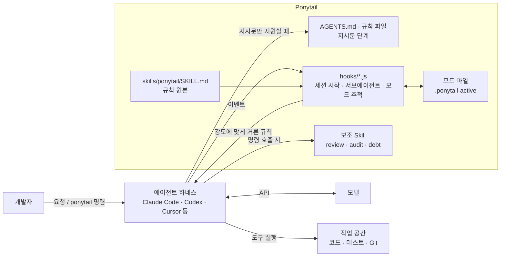
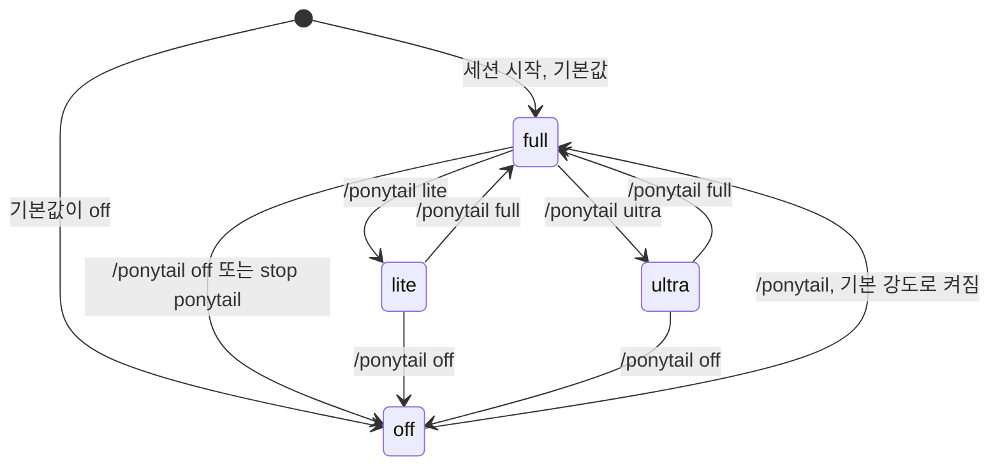
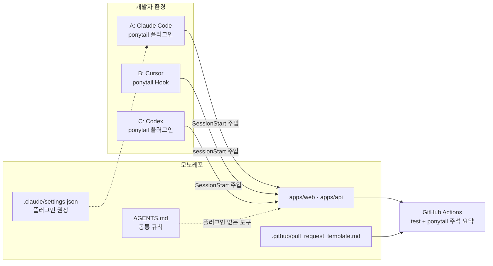
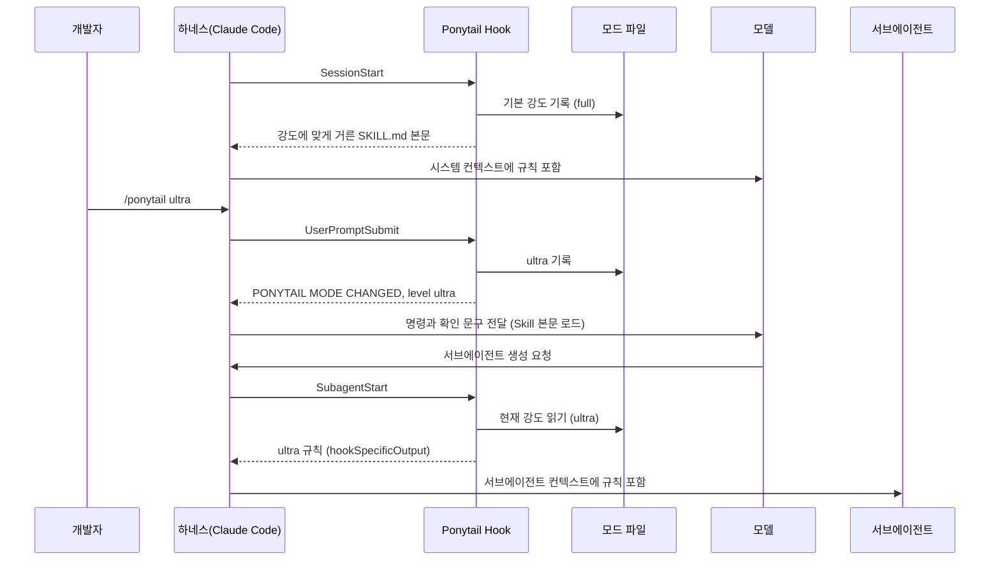

## 개요

> AI 코딩 에이전트가 코드를 쓰기 전에 "이게 꼭 있어야 하나? 이미 있는 걸로 되지 않나?"부터 따지게 만들어서, 요청보다 크게 짓는 과잉 구현을 줄여 주는 Skill·플러그인 배포판입니다.

## 30초 요약

| 항목 | 내용 |
|---|---|
| 무엇인가? | AI 코딩 에이전트에 "가장 게으른 시니어 개발자"의 판단 순서를 규칙으로 넣어 주는 Skill·Hook·규칙 파일 묶음 |
| 왜 사용하는가? | 날짜 선택기 하나에 라이브러리·래퍼 컴포넌트·스타일시트를 만드는 식의 과잉 구현을 줄이기 위해 |
| 해결하는 문제 | 에이전트가 요청 범위보다 많은 코드, 의존성, 추상화를 만들어 리뷰·유지보수 비용을 키우는 문제 |
| 주요 사용처 | 기능 구현, 버그 수정, 과잉 설계 리뷰(`/ponytail-review`), 저장소 감사(`/ponytail-audit`), 단순화 부채 관리(`/ponytail-debt`) |
| 핵심 개념 | 7단 사다리, 강도(lite/full/ultra), 줄이지 않는 것(검증·보안·접근성), `ponytail:` 주석, 플러그인 단계와 지시문 단계 |
| Client 사용 | O (개발자 로컬의 에이전트 하네스에 설치) |
| Server 사용 | △ (서버 런타임 라이브러리가 아님. 백엔드 코드를 작성하는 에이전트의 판단 기준으로 사용) |
| 대표 대안 | 직접 쓴 `CLAUDE.md`/`AGENTS.md`의 YAGNI 지시, "YAGNI + 한 줄 해법" 프롬프트, caveman(말을 줄이는 Skill과 함께 쓰는 조합), ECC 같은 대형 워크플로 하네스 |

- **코드를 쓰기 전에 멈추는 지점을 정한다**: "필요한가 → 이미 있나 → 표준 라이브러리 → 플랫폼 기능 → 설치된 의존성 → 한 줄 → 최소 구현" 순서로, 처음 성립하는 단계에서 멈춥니다.
- **줄이면 안 되는 것을 명시한다**: 신뢰 경계의 입력 검증, 데이터 손실을 막는 오류 처리, 보안, 접근성은 절대 줄이지 않습니다.
- **단순화를 숨기지 않는다**: 한계가 있는 의도적 단순화에는 `ponytail:` 주석으로 한계와 업그레이드 시점을 남기고, `/ponytail-debt`로 모아 봅니다.
- **한 원본, 여러 에이전트**: `skills/`와 `AGENTS.md`를 원본으로 두고 Claude Code, Codex, Cursor, OpenCode, Gemini CLI 등 20개 이상의 에이전트에 얇은 어댑터로 붙입니다.
- **측정으로 주장한다**: 실제 Claude Code 세션으로 실제 저장소를 수정하는 벤치마크를 공개하고, 규칙을 바꾸는 PR에는 벤치마크를 요구합니다.

---

## 어떤 도구인가?

AI 코딩 에이전트에게 작은 일을 시켰는데 결과물이 이상하게 큰 경험이 한 번쯤 있을 것입니다.

- 날짜 입력 칸을 부탁했더니 `flatpickr`를 설치하고, 래퍼 컴포넌트와 스타일시트를 만들고, 타임존 이야기를 꺼냅니다.
- "검색창에 디바운스 걸어줘"에 기본 버전, 로딩 상태 버전, 취소 가능한 버전까지 세 벌을 줍니다.
- 구현체가 하나뿐인데 인터페이스, 팩토리, 설정 옵션이 함께 생깁니다.
- 이미 `src/lib/slug.ts`에 있는 함수를 모르고 새로 하나 더 만듭니다.

Ponytail은 이런 상황에서 **에이전트가 코드를 쓰기 전에 "이걸 정말 새로 만들어야 하나?"를 먼저 따지도록 규칙을 넣어 주는 도구**입니다. 프로젝트 소개 문구도 같은 이야기를 합니다.

> The best code is the code you never wrote.

이름은 회사에서 가장 오래 일한 "포니테일 머리의 시니어 개발자"에서 왔습니다. 50줄짜리 코드를 보여주면 아무 말 없이 한 줄로 바꿔 놓는 사람입니다. Ponytail은 그 사람을 에이전트 안에 넣는 것을 목표로 합니다.

기술적으로 정의하면, Ponytail은 **애플리케이션에 import하는 라이브러리가 아니라 에이전트의 컨텍스트에 규칙을 넣는 배포판**입니다. 핵심 동작은 `skills/ponytail/SKILL.md` 한 파일에 있고, 나머지는 이 규칙을 각 에이전트가 읽을 수 있게 전달하는 어댑터입니다.

- Claude Code·Codex 같은 플러그인 지원 에이전트에서는 세션 시작 Hook이 규칙을 자동으로 주입하고, `/ponytail ultra` 같은 명령으로 강도를 바꿀 수 있습니다.
- Windsurf, Cline, Zed, Amp처럼 규칙 파일만 읽는 에이전트에서는 `AGENTS.md`나 전용 규칙 파일을 복사해 쓰는 "항상 켜진 지시문"으로 동작합니다.

2026년 6월 12일에 공개된 뒤 2026년 10월 기준 GitHub Star 약 15만 5천 개, Fork 약 8,300개를 기록하고 있고, 10월 4일에 v4.11.0이 나왔을 정도로 활발하게 유지보수되고 있습니다. 라이선스는 MIT입니다.

### 주요 사용 사례

- **기능 구현**: 평소처럼 기능을 요청하면 에이전트가 사다리를 거쳐 네이티브 기능이나 이미 있는 헬퍼부터 찾습니다. 날짜 선택기, 색상 선택기, 파일 업로드처럼 브라우저에 이미 있는 기능에서 효과가 가장 큽니다.
- **버그 수정**: 증상이 보고된 한 곳만 고치지 않고, 수정할 함수의 호출부를 모두 찾은 뒤 공유 함수에서 한 번 고치도록 유도합니다.
- **과잉 설계 리뷰**: `/ponytail-review`로 현재 diff에서 지울 수 있는 것만 한 줄씩 뽑아 받습니다.
- **저장소 감사**: `/ponytail-audit`로 저장소 전체에서 표준 라이브러리로 대체할 코드, 구현체가 하나뿐인 추상화, 안 쓰는 설정을 찾습니다.
- **단순화 부채 추적**: `/ponytail-debt`로 코드에 남긴 `ponytail:` 주석을 장부처럼 모아, "나중에"가 "영원히 안 함"이 되지 않게 합니다.

주요 용어는 [핵심 개념과 동작 구조](#h-ponytail-핵심-개념과-동작-구조)에서 자세히 다룹니다.

---

## 어떤 문제를 해결하는가?

```text
요구사항: AI 에이전트가 필요한 만큼만 코드를 쓰게 하고 싶다
 ↓
일반적인 구현: 프롬프트나 CLAUDE.md에 "YAGNI를 지켜라", "간결하게"를 적는다
 ↓
문제 발생: 효과가 들쭉날쭉하고, "짧게"만 강조하면 입력 검증 같은 안전장치까지 잘려 나간다
 ↓
Ponytail로 해결: 멈출 지점(7단 사다리)과 절대 줄이지 않는 것(검증·보안·접근성)을 함께 규칙으로 고정한다
```

### 상황 예시

관리자 대시보드를 만드는 팀이 Claude Code로 화면을 하나씩 추가하고 있습니다. 이번 티켓은 "상품 등록 폼에 판매 시작일 입력 칸 추가"입니다. 팀은 번들 크기와 의존성 수에 민감하고, PR 리뷰는 한 명이 담당합니다.

### 일반적인 구현 방식

규칙 없이 요청하면 에이전트는 흔히 이렇게 만듭니다.

```bash
npm install react-datepicker date-fns
```

```tsx
// components/SaleStartDatePicker.tsx (발췌)
import DatePicker from 'react-datepicker';
import 'react-datepicker/dist/react-datepicker.css';
import { format, isBefore, startOfDay } from 'date-fns';
import './SaleStartDatePicker.css';

type Props = {
  value: Date | null;
  onChange: (date: Date | null) => void;
  minDate?: Date;
  locale?: string;
  dateFormat?: string;
};

export function SaleStartDatePicker({ value, onChange, minDate = new Date(), dateFormat = 'yyyy-MM-dd' }: Props) {
  // ...키보드 처리, 포커스 관리, 타임존 보정, 커스텀 헤더 렌더링 등 100줄 이상
}
```

그 다음 이 팀이 무엇을 해야 하는지 "프롬프트로 막기"를 시도합니다.

```md
<!-- CLAUDE.md -->
- YAGNI 원칙을 지킬 것
- 가능하면 한 줄로 해결할 것
```

### 이 방식에서 발생하는 문제

- **불필요한 의존성과 코드**: 브라우저에 이미 있는 `<input type="date">`로 충분한데 라이브러리 두 개와 컴포넌트 파일, CSS 파일이 생깁니다. 리뷰어가 읽어야 할 양과 앞으로 업데이트해야 할 패키지가 늘어납니다.
- **짧은 지시문은 일관되지 않습니다**: Ponytail 저장소의 벤치마크에서 "Follow YAGNI principles, and prefer one-liner solutions." 한 줄 프롬프트는 색상 선택기에서는 25줄로 잘 줄였지만, 날짜 선택기에서는 162줄, 명령 팔레트에서는 기준선보다 더 긴 코드를 냈습니다.
- **"짧게"만 강조하면 안전장치가 잘립니다**: 같은 벤치마크에서 한 줄 프롬프트는 신뢰할 수 없는 파일명을 경로에 붙이는 작업에서 경로 탐색 검사를 빼먹은 경우가 있었습니다(20번 중 1번).
- **단순화한 흔적이 사라집니다**: "일단 전역 락으로 처리" 같은 의도적 단순화가 코드에 아무 표시 없이 남아, 나중에 왜 그런지 아무도 모르게 됩니다.

### Ponytail을 사용하면

같은 요청에 에이전트는 사다리의 4번째 단계(네이티브 플랫폼 기능)에서 멈춥니다.

```tsx
{/* ponytail: 브라우저에 날짜 입력이 있음 */}
<label>
  판매 시작일
  <input type="date" name="saleStartsAt" min={today} required />
</label>
```

- 새 의존성이 없고, 변경은 폼 파일 몇 줄입니다.
- `required`, `min`, `<label>` 같은 검증과 접근성은 줄이지 않습니다.
- 응답 끝에는 "생략한 것: 커스텀 달력 UI, 추가할 시점: 디자인 시스템에서 달력 모양을 요구할 때"처럼 생략한 것과 추가할 조건이 짧게 붙습니다.

> **핵심:** 에이전트의 과잉 구현을 개발자가 매번 리뷰에서 걷어내는 대신, Ponytail이 **"멈출 지점"과 "절대 줄이지 않는 것"을 함께 규칙으로 주입**해서 처음부터 필요한 만큼만 쓰게 해 줍니다.

---

## 왜 주목받고 있는가?

**에이전트가 "너무 많이 쓰는" 문제가 체감되기 시작했습니다.** 코딩 에이전트가 기능을 끝까지 구현할 수 있게 되면서, 이제 문제는 "못 만든다"가 아니라 "필요 이상으로 만든다"로 옮겨 갔습니다. 에이전트가 만든 코드도 결국 사람이 리뷰하고 유지보수하므로, 줄 수 자체가 비용입니다.

**측정 결과를 공개하고, 비판을 받아 다시 측정했습니다.** 처음 공개한 단발(single-shot) 벤치마크의 "80~94% 코드 감소"는 기준선이 대화체 답변까지 포함한 탓에 부풀려졌다는 지적(이슈 #126)을 받았습니다. 프로젝트는 이를 인정하고 실제 Claude Code 헤드리스 세션으로 실제 오픈소스 저장소(FastAPI + React 템플릿)를 수정하는 agentic 벤치마크를 다시 만들었습니다. 그 결과 12개 기능 작업 평균으로 기준선 대비 코드 -54%, 토큰 -22%, 비용 -20%, 시간 -27%이고, 효과가 없는 작업(이미 최소인 백엔드 CRUD)도 그대로 공개했습니다. 과장보다 "줄일 게 있는 곳에서는 크게, 없는 곳에서는 0"이라는 정직한 결론이 신뢰를 얻었습니다.

**안전을 함께 측정합니다.** "짧게 써라"는 지시의 가장 큰 위험은 검증 코드가 잘려 나가는 것입니다. Ponytail은 경로 탐색, SQL 인젝션, 위조 토큰 같은 적대적 입력으로 생성된 코드를 실제로 실행해 보는 안전성 측정에서 20번 모두 안전했습니다.

**설치가 가볍고 대상이 넓습니다.** 규칙의 본체가 Markdown 한 파일이고, Hook도 Node.js 스크립트 몇 개뿐입니다. Claude Code, Codex, Copilot CLI, Cursor, OpenCode, Gemini CLI, Hermes, pi, Grok Build 등 플러그인 지원 에이전트와 `AGENTS.md`만 읽는 에이전트까지 폭넓게 지원합니다.

**다른 도구와 겹치지 않습니다.** Ponytail은 "무엇을 만드는가"만 다룹니다. 말투를 줄이는 caveman과는 역할이 나뉘어 함께 쓰기를 권하고, 계획·TDD·리뷰 절차를 다루는 워크플로 도구와도 충돌하지 않습니다.

일반적인 방식과의 항목별 차이는 [장단점과 대안 비교](#h-ponytail-장단점과-대안-비교)에 정리했습니다.

---

## 언제 사용하면 좋은가?

- **에이전트가 만든 PR이 자주 "왜 이렇게 커요?"라는 리뷰를 받는 경우**: 리뷰에서 걷어내는 대신 처음부터 작게 만들게 하는 편이 리뷰어 시간을 아낍니다.
- **프론트엔드 작업이 많은 경우**: 날짜·색상·파일 입력, 모달(`<dialog>`), 아코디언(`<details>`)처럼 브라우저가 이미 제공하는 기능을 라이브러리로 다시 만드는 일이 가장 흔하고, 벤치마크에서도 효과가 가장 큰 영역입니다.
- **의존성 수와 번들 크기를 관리해야 하는 경우**: "설치된 의존성으로 되는가, 몇 줄로 되는데 새 의존성을 추가하지 않는가"가 규칙에 들어 있습니다.
- **여러 에이전트를 함께 쓰는 팀**: Claude Code를 쓰는 사람과 Cursor, Codex를 쓰는 사람이 같은 원칙을 공유할 수 있습니다.
- **오래된 코드베이스를 정리하려는 경우**: `/ponytail-audit`와 `/ponytail-review`는 "무엇을 지울 수 있는가"에만 집중한 리뷰를 줍니다.

---

## 언제 사용하지 않는 것이 좋은가?

- **이미 최소한으로 쓰는 영역만 다루는 경우**: 벤치마크에서 백엔드 CRUD 엔드포인트는 모든 방식이 거의 같은 줄 수였습니다. 줄일 것이 없는 코드에서는 체감 효과가 거의 없습니다.
  > 예: "사용자 아이템 개수 세기" API는 기준선 21줄, Ponytail 17줄이었습니다.
- **추론 토큰을 많이 쓰는 모델을 쓰는 경우**: 사다리의 각 단계를 따지느라 생각 토큰이 늘어 비용이 오히려 오를 수 있습니다. 프로젝트도 GPT-5.5에서 그런 경향이 있다고 밝힙니다.
- **확장성을 미리 설계해야 하는 것이 요구사항인 경우**: 공개 SDK나 플러그인 API처럼 "구현체가 지금은 하나지만 외부 사용자가 확장해야 하는" 코드라면, "구현체 하나짜리 인터페이스 금지" 규칙이 요구사항과 충돌합니다. 이때는 요구사항을 명시하거나 `lite` 강도로 낮춥니다.
- **문서·보고서 작성이 주 작업인 경우**: Ponytail은 코딩 작업용입니다. 그런데 세션 시작 Hook이 규칙을 주입하므로 글쓰기 세션에도 규칙이 들어가고, 일부 사용자는 대문자로 강조된 지속 지시가 비코딩 응답까지 짧게 만든다고 보고하고 있습니다(2026년 10월 기준 열린 이슈). 글쓰기 위주라면 `/ponytail off`가 낫습니다.
- **이미 엄격한 코드 규칙과 리뷰 문화가 있는 팀**: 리뷰에서 과잉 설계가 이미 잘 걸러진다면 추가 이득이 작습니다. 짧은 `AGENTS.md` 한 단락으로 충분할 수 있습니다.

---

## 한눈에 정리

| 항목 | 내용 |
|---|---|
| 라이브러리 | Ponytail (`ponytail@ponytail` 플러그인, npm `@dietrichgebert/ponytail`, 최신 v4.11.0) |
| 주요 목적 | AI 코딩 에이전트가 필요한 만큼만 코드를 쓰게 하는 판단 규칙 주입 |
| 해결하는 문제 | 과잉 구현, 불필요한 의존성·추상화, 짧게 쓰다 안전장치가 잘리는 문제 |
| 핵심 개념 | 7단 사다리, lite/full/ultra 강도, 줄이지 않는 것, `ponytail:` 주석, 플러그인·지시문 단계 |
| 주요 사용처 | 기능 구현, 근본 원인 버그 수정, 과잉 설계 리뷰·감사, 단순화 부채 추적 |
| Client 활용 | 네이티브 HTML·CSS·브라우저 API로 라이브러리 대체, 프론트엔드 diff 축소 |
| Server 활용 | 표준 라이브러리·DB 제약 우선, 호출부 전체를 본 근본 원인 수정, 서브에이전트까지 같은 규칙 적용 |
| 장점 | 가벼운 설치, 넓은 에이전트 지원, 안전 경계 명시, 공개 벤치마크, 다른 도구와 역할이 겹치지 않음 |
| 단점 | 강제력 없는 지시문, 벤치마크 범위 제한(Haiku 4.5·n=4), 에이전트별 기능 차이, 비코딩 응답에 과적용될 수 있음 |
| 추천 상황 | 에이전트 PR이 자주 비대해지는 팀, 프론트엔드·의존성 관리가 중요한 프로젝트 |
| 비추천 상황 | 이미 최소한인 코드, 추론 비용이 큰 모델, 확장 API 설계가 요구사항인 경우, 글쓰기 위주 세션 |
| 대표 대안 | `AGENTS.md`의 YAGNI 지시, 한 줄 프롬프트, caveman(보완 관계), ECC 같은 워크플로 하네스 |

---

## 핵심 정리

### 한 문장으로

> Ponytail은 AI 코딩 에이전트가 요청보다 크게 짓는 문제를 **"멈출 지점(7단 사다리)"과 "절대 줄이지 않는 것(검증·보안·접근성)"을 함께 규칙으로 주입**해서 해결하기 위한 Skill·플러그인 배포판입니다.

### 이것만 기억하기

1. **왜 사용하는가?**
   - 에이전트가 라이브러리, 래퍼, 추상화를 필요 이상으로 만드는 것을 리뷰에서 걷어내지 않고, 처음부터 필요한 만큼만 쓰게 하기 위해서입니다.

2. **어떤 문제를 해결하는가?**
   - 과잉 구현과 불필요한 의존성 문제, 그리고 "짧게 써라"는 지시가 안전장치까지 잘라 내는 문제입니다.

3. **어떻게 동작하는가?**
   - `SKILL.md`의 규칙을 세션 시작 Hook(또는 규칙 파일)이 에이전트 컨텍스트에 넣고, 에이전트는 문제를 이해한 뒤 사다리의 첫 번째로 성립하는 단계에서 멈춥니다. 서브에이전트에도 같은 규칙이 주입됩니다.

4. **실제 프로젝트에서는 어디에 사용하는가?**
   - 프론트엔드 기능 구현, 근본 원인 버그 수정, PR 전 과잉 설계 리뷰, 저장소 정리, 의도적 단순화의 부채 관리에 씁니다.

5. **언제 사용하지 않는가?**
   - 이미 최소한인 코드, 추론 토큰 비용이 큰 모델, 확장 API 설계가 요구사항인 코드, 글쓰기 위주 세션에서는 이득이 작거나 오히려 방해가 됩니다.

6. **비슷한 기술과 가장 큰 차이는 무엇인가?**
   - 한 줄 "YAGNI" 프롬프트와 달리 **줄이지 않을 것을 명시**하고, 측정으로 그 차이를 보여 준다는 점입니다. 범위도 "무엇을 만드는가" 하나로 좁아서 다른 워크플로 도구와 함께 쓰기 쉽습니다.

## Ponytail 핵심 개념과 동작 구조

> Ponytail을 이루는 7단 사다리, 강도, 줄이지 않는 것, `ponytail:` 주석, 보조 Skill, 플러그인·지시문 단계가 각각 무엇이고 어떻게 맞물려 동작하는지 다룹니다.

### 용어 한눈에 보기

| 키워드 | 설명 |
|---|---|
| Ruleset | `skills/ponytail/SKILL.md`에 있는 규칙 본문. 에이전트 컨텍스트에 들어가는 실체 |
| Ladder (사다리) | 코드를 쓰기 전에 위에서부터 확인하는 7개 질문. 처음 성립하는 단계에서 멈춤 |
| Intensity (강도) | `lite` / `full` / `ultra`. 사다리를 얼마나 강하게 적용할지 정함. 기본값 `full` |
| Not lazy about | 절대 줄이지 않는 것. 신뢰 경계 입력 검증, 데이터 손실 방지 오류 처리, 보안, 접근성 등 |
| `ponytail:` 주석 | 한계가 알려진 의도적 단순화에 한계와 업그레이드 시점을 적는 주석 규약 |
| 보조 Skill | `ponytail-review`, `ponytail-audit`, `ponytail-debt`, `ponytail-gain`, `ponytail-help` |
| Plugin tier | Hook으로 규칙을 자동 주입하고 `/ponytail` 강도 전환이 되는 에이전트 지원 방식 |
| Instruction tier | `AGENTS.md`나 규칙 파일만 읽는 에이전트 지원 방식. 강도 전환·명령 없음 |
| Adapter | 같은 규칙을 특정 에이전트 형식으로 전달하는 얇은 파일(매니페스트, Hook 설정, 규칙 사본) |

---

### 1. 7단 사다리 (The ladder)

#### 쉽게 설명하면

경험 많은 시니어 개발자는 "이거 만들어 주세요"라는 말을 들으면 바로 코드를 쓰지 않습니다. "이거 진짜 필요해요? 저번에 만든 거 있지 않아요? 브라우저에 원래 있는 기능 아니에요?"를 먼저 묻습니다. 사다리는 그 질문 순서를 적어 둔 것입니다.

#### 개발 관점에서는

에이전트는 코드를 쓰기 전에 아래 질문을 위에서부터 확인하고, **처음으로 "예"가 되는 단계에서 멈춥니다.**

| 단계 | 질문 | 예 |
|---|---|---|
| 1 | 이게 존재해야 하는가? (YAGNI) | "나중에 쓸지도 모르는" 설정 옵션은 만들지 않고 한 줄로 그 사실만 말함 |
| 2 | 이미 이 코드베이스에 있는가? | `src/lib/slug.ts`에 있는 함수를 다시 만들지 않고 import |
| 3 | 표준 라이브러리가 하는가? | 직접 만든 캐시 클래스 대신 `functools.lru_cache` |
| 4 | 네이티브 플랫폼 기능이 있는가? | 날짜 선택기 라이브러리 대신 `<input type="date">`, JS 대신 CSS, 앱 코드 대신 DB 제약 |
| 5 | 이미 설치된 의존성이 해결하는가? | 새 패키지를 추가하지 않고 이미 있는 것 사용 |
| 6 | 한 줄로 되는가? | 한 줄로 작성 |
| 7 | 그제야 | 동작하는 최소한의 코드 |

중요한 단서가 두 가지 붙어 있습니다.

- **사다리는 이해한 다음에 오릅니다.** 작업과 그 작업이 닿는 코드를 먼저 읽고, 실제 흐름을 끝까지 따라간 뒤에 단계를 고릅니다. 이해 없이 작은 diff를 내는 것은 "효율로 위장한 게으름"이라고 규칙이 직접 경고합니다.
- **버그 수정은 증상이 아니라 근본 원인을 고칩니다.** 수정할 함수의 호출부를 모두 찾고(grep), 모든 호출이 지나가는 공유 함수에 가드를 한 번 넣습니다. 호출부마다 가드를 넣는 것보다 diff가 작고, 티켓에 적힌 경로만 고쳐서 다른 호출부가 여전히 깨져 있는 상황도 막습니다.

#### 예제

"이 API 응답을 캐시해 줘"라는 요청에 대한 사다리 적용입니다.

```python
from functools import lru_cache

@lru_cache(maxsize=1000)  # 3단계: 표준 라이브러리
def fetch_exchange_rate(currency: str) -> float:
    return http_get(f"/rates/{currency}").json()["rate"]
```

응답 끝에는 "생략: 직접 만든 캐시 클래스, 추가 시점: `lru_cache`로 부족하다는 측정 결과가 나올 때"처럼 생략한 것과 추가할 조건이 붙습니다.

#### 핵심

> 사다리는 "가장 짧은 코드"를 찾는 게임이 아니라 "새로 만들지 않아도 되는 이유"를 먼저 찾는 순서입니다.

### 2. 강도 (lite / full / ultra)

#### 쉽게 설명하면

같은 시니어라도 기분에 따라 반응이 다릅니다. "만들어 드릴게요, 근데 이것도 있어요"(lite), "그냥 이걸로 하세요"(full), "그거 왜 필요한데요?"(ultra).

#### 개발 관점에서는

| 강도 | 동작 |
|---|---|
| `lite` | 요청한 대로 만들되, 더 게으른 대안을 한 줄로 알려 주고 선택은 사용자에게 맡김 |
| `full` | 사다리를 강제. 표준 라이브러리와 네이티브 우선, 가장 짧은 diff와 설명. 기본값 |
| `ultra` | 삭제가 추가보다 먼저. 한 줄짜리를 내놓으면서 요구사항의 나머지에 이의를 제기 |

규칙 본문에는 강도별 표 행과 예시가 모두 들어 있지만, 실제로 주입될 때는 **현재 강도에 해당하는 행과 예시만 남기고 나머지는 걸러집니다.** 이 필터링이 어떻게 이루어지는지는 [규칙 주입 구조 깊이 보기](#h-ponytail-규칙-주입-구조-깊이-보기)에서 다룹니다.

#### 예제

"API 응답에 캐시를 추가해 줘"에 대한 강도별 응답 예시(규칙 본문의 예를 옮긴 것)입니다.

```text
lite : 캐시 클래스 추가했습니다. 참고로 functools.lru_cache 한 줄로도 됩니다.
full : fetch 함수에 @lru_cache(maxsize=1000). 직접 만든 캐시 클래스는 생략, lru_cache가 부족하다는 측정이 나오면 추가.
ultra: 프로파일러가 필요하다고 할 때까지 캐시 없음. 그때 @lru_cache. 직접 만든 TTL 캐시는 버그 농장입니다.
```

#### 핵심

> 처음 도입할 때는 `lite`로 대안만 보고, 익숙해지면 기본값 `full`로 씁니다. `ultra`는 정리 작업처럼 "지우는 것"이 목표일 때만 씁니다.

### 3. 줄이지 않는 것 (When NOT to be lazy)

#### 쉽게 설명하면

게으른 것과 대충 하는 것은 다릅니다. 좋은 시니어는 코드를 줄여도 문단속은 빼먹지 않습니다.

#### 개발 관점에서는

규칙은 다음 항목을 **절대 단순화하지 않는다**고 명시합니다.

- 신뢰 경계(사용자 입력, 외부 API 응답, 파일명 등)의 입력 검증
- 데이터 손실을 막는 오류 처리
- 보안 조치
- 접근성 기본(레이블, 키보드 조작 등)
- 실제 하드웨어 보정값(시계는 틀어지고 센서는 오차가 있으므로 보정 손잡이는 남김)
- 사용자가 명시적으로 요청한 것. 사용자가 전체 버전을 고집하면 다시 따지지 않고 만듭니다.

여기에 **최소 검증 하나**가 더해집니다. 분기·루프·파서·금전·보안 경로처럼 단순하지 않은 로직에는, 로직이 깨지면 실패하는 가장 작은 검사 하나(`assert` 기반 self-check나 작은 테스트 파일 하나)를 남깁니다. 테스트 프레임워크나 함수별 테스트 묶음까지는 요청이 없으면 만들지 않고, 한 줄짜리 코드에는 테스트도 붙이지 않습니다.

#### 예제

신뢰할 수 없는 파일명을 업로드 디렉터리에 붙이는 함수입니다. "짧게"만 강조하면 `path.join(base, name)` 한 줄이 되지만, Ponytail은 경로 탐색 검사를 남깁니다.

```ts
import path from 'node:path';

export function safeJoin(baseDir: string, filename: string): string {
  const base = path.resolve(baseDir);
  const target = path.resolve(base, filename);
  // 신뢰 경계: ../../ 로 디렉터리를 벗어나는 파일명 차단
  if (!target.startsWith(base + path.sep)) throw new Error('invalid filename');
  return target;
}

// 최소 검증 하나
import assert from 'node:assert';
assert.throws(() => safeJoin('/srv/uploads', '../../etc/passwd'));
assert.equal(safeJoin('/srv/uploads', 'a.png'), path.resolve('/srv/uploads/a.png'));
```

공개된 벤치마크의 `safe-path` 작업에서 Ponytail이 한 줄 프롬프트보다 약 3줄 더 쓴 부분이 바로 이 경로 탐색 검사였습니다.

#### 핵심

> Ponytail이 줄이는 것은 "필요 없는 코드"이지 "필요한 방어 코드"가 아닙니다. 이 목록이 단순한 "짧게 써라" 프롬프트와 가장 크게 다른 점입니다.

### 4. `ponytail:` 주석과 출력 형식

#### 쉽게 설명하면

일부러 대충 만든 곳에 "여기는 일부러 이렇게 했고, 이럴 때 바꾸세요"라는 포스트잇을 붙이는 것입니다.

#### 개발 관점에서는

전역 락, O(n²) 스캔, 단순한 휴리스틱처럼 **한계가 알려진 의도적 단순화**에는 `ponytail:` 주석으로 한계(ceiling)와 업그레이드 경로를 남깁니다. 이 주석은 나중에 `/ponytail-debt`가 grep으로 모아 부채 장부를 만드는 입력이 됩니다.

응답 형식도 정해져 있습니다. 코드가 먼저 나오고, 그 뒤에는 "무엇을 생략했고 언제 추가하면 되는지"를 최대 세 줄로만 씁니다. 사용자가 명시적으로 요청한 설명(보고서, 단계별 설명)은 예외입니다.

```text
[code] → skipped: [X], add when [Y].
```

#### 예제

```ts
// ponytail: 프로세스 단위 Map, 인스턴스가 2대 이상이 되면 Redis로 옮길 것
const attempts = new Map<string, number>();
```

#### 핵심

> 단순화는 숨기면 부채가 되고, 표시하면 계획이 됩니다.

### 5. 보조 Skill 다섯 개

#### 쉽게 설명하면

코드를 쓸 때의 태도(본체 Skill) 말고도, 이미 있는 코드를 보는 도구들이 따로 있습니다.

#### 개발 관점에서는

| Skill(명령) | 하는 일 | 범위 |
|---|---|---|
| `/ponytail-review` | 현재 diff에서 지울 것을 한 줄씩 나열하고 `net: -<N> lines possible.`로 끝냄 | 과잉 설계만. 정확성·보안·성능은 범위 밖 |
| `/ponytail-audit` | diff가 아니라 저장소 전체를 감사해 큰 것부터 순위대로 나열 | `delete:` 전에는 테스트까지 포함해 저장소 전체를 grep |
| `/ponytail-debt` | `ponytail:` 주석을 모아 부채 장부를 만들고, 업그레이드 조건이 없는 항목에 `no-trigger` 표시 | 읽기만 하고 파일은 바꾸지 않음 |
| `/ponytail-gain` | 공개 벤치마크의 효과 점수판 표시 | 현재 저장소의 수치가 아님 |
| `/ponytail-help` | 명령 요약 | - |

리뷰와 감사 결과는 `delete:`, `stdlib:`, `native:`, `reuse:`, `yagni:`, `shrink:` 여섯 가지 태그로 분류됩니다. `reuse:` 태그는 v4.11.0에서 추가되었습니다. 실제 사용 방법은 [활용 예시 ② 기존 코드 리뷰와 부채 관리](#h-ponytail-활용-예시-②-기존-코드-리뷰와-부채-관리)에서 다룹니다.

#### 핵심

> 본체 Skill은 "새로 쓰는 코드"를, 보조 Skill은 "이미 있는 코드"를 다룹니다. 모두 목록만 주고 직접 고치지는 않습니다.

### 6. 플러그인 단계와 지시문 단계

#### 쉽게 설명하면

같은 규칙을 전달하는 방법이 두 가지입니다. 하나는 비서가 매 회의 시작마다 메모를 책상에 올려 두는 방식(플러그인), 다른 하나는 사무실 벽에 붙여 두는 방식(지시문)입니다.

#### 개발 관점에서는

| 구분 | 대표 에이전트 | 규칙 전달 | 강도 전환·명령 |
|---|---|---|---|
| 플러그인 단계 | Claude Code, Codex, Copilot CLI, OpenCode, pi, Hermes, Gemini CLI, Grok Build, Cursor(Hook 설치), Qoder(Hook 설정) | Hook이나 플러그인이 세션 시작 또는 매 턴에 주입 | O (에이전트마다 범위 차이 있음) |
| 지시문 단계 | Windsurf, Cline, Copilot Chat, Kiro, Zed, Amp, Jules, Junie, Antigravity 등 | `AGENTS.md`나 전용 규칙 파일을 항상 읽음 | X |

저장소는 이를 "어댑터는 얇게 유지한다"는 원칙으로 관리합니다. Skill이나 Hook을 지원하는 에이전트는 기존 `skills/`, `hooks/`를 가리키게 하고, 지시문만 지원하는 에이전트의 규칙 사본은 `AGENTS.md`와 내용을 맞춥니다(`scripts/check-rule-copies.js`로 검사).

#### 핵심

> 규칙의 원본은 하나(`SKILL.md`, 압축본 `AGENTS.md`)이고, 에이전트별 파일은 전달 방법만 다릅니다. 기능 차이는 "규칙 내용"이 아니라 "전달 방법"에서 생깁니다.

---

### 7. 전체 동작 구조

Ponytail은 애플리케이션 코드에 들어가지 않고, **개발자와 모델 사이의 에이전트 하네스 안에서 규칙을 전달하는 계층**입니다.



한 번의 작업이 처리되는 순서는 다음과 같습니다(Claude Code 기준).

1. **시작점**: 세션이 시작(또는 재개, `/clear`, 컨텍스트 압축)되면 `SessionStart` Hook이 기본 강도를 정하고, 모드 파일에 기록한 뒤, 그 강도에 맞게 거른 규칙 본문을 컨텍스트에 넣습니다.
2. **Ponytail이 개입하는 시점**: 개발자가 "판매 시작일 입력 칸 추가"를 요청하면, 모델은 이미 받은 규칙에 따라 관련 코드를 읽고 사다리를 오릅니다. 코딩 작업이면 Skill 설명과도 맞기 때문에 Skill이 다시 호출될 수 있습니다.
3. **내부 처리**: 모델이 탐색이나 리뷰를 위해 서브에이전트를 띄우면 `SubagentStart` Hook이 같은 규칙을 서브에이전트에도 주입합니다. 개발자가 `/ponytail ultra`를 입력하면 `UserPromptSubmit` Hook이 모드 파일을 바꿉니다.
4. **외부 시스템과의 연결**: Ponytail은 모델 호출이나 도구 실행에 직접 끼어들지 않습니다. 파일 수정, 셸 실행, 모델 API는 모두 하네스 설정을 그대로 따르고, Ponytail은 컨텍스트에 들어가는 "판단 기준"만 바꿉니다.
5. **결과 반환**: 모델은 코드를 먼저 내고, 생략한 것과 추가할 시점을 짧게 덧붙입니다. 의도적 단순화에는 `ponytail:` 주석이 남아 나중에 `/ponytail-debt`로 모을 수 있습니다.

강도가 바뀌는 흐름을 상태로 보면 다음과 같습니다.



## Ponytail 설치와 첫 사용

> 에이전트별 설치 방법, 기본 강도 설정, 가장 간단한 첫 실행, 설치와 제거에서 자주 겪는 문제를 다룹니다.

### 설치

Claude Code·Codex 플러그인과 Cursor Hook은 Node.js로 작성된 작은 라이프사이클 Hook을 실행하므로 `node`가 **비대화형 셸의 PATH**에 있어야 합니다. nvm이나 Nix처럼 대화형 셸 설정에서만 PATH를 잡는 경우 특히 확인이 필요합니다. Node가 없어도 Skill 자체는 동작하지만, Hook이 호출될 때마다 `node: command not found` 오류가 보이고 자동 활성화가 빠집니다.

**Claude Code**

두 명령을 **각각 별도의 프롬프트로** 보내야 설치됩니다.

```text
/plugin marketplace add DietrichGebert/ponytail
```

```text
/plugin install ponytail@ponytail
```

Claude Code Desktop 앱의 Code 탭에서도 같은 명령을 입력하거나, 입력창 옆 **+** → **Plugins** → **Add plugin**으로 설치할 수 있습니다. CodeBuddy와 ZCode도 Claude 형식 플러그인을 그대로 읽으므로 같은 방법으로 설치합니다.

**Codex**

```bash
codex plugin marketplace add DietrichGebert/ponytail
codex plugin add ponytail@ponytail
```

설치 후 `codex`를 실행해 `/hooks`에서 두 Hook을 검토하고 신뢰(trust)한 다음 새 스레드를 시작해야 합니다. Codex에서는 명령이 Skill로 노출되므로 `$ponytail-review`처럼 호출합니다.

**GitHub Copilot CLI**

```bash
copilot plugin marketplace add DietrichGebert/ponytail
copilot plugin install ponytail@ponytail
```

Copilot CLI는 플러그인 이름으로 명령을 묶기 때문에 `/ponytail:ponytail ultra`, `/ponytail:ponytail-review`처럼 씁니다.

**OpenCode**

```json
// opencode.json (OpenCode 2)
{ "plugins": ["@dietrichgebert/ponytail"] }
```

OpenCode 1은 예전 키 이름을 씁니다: `{ "plugin": ["@dietrichgebert/ponytail"] }`. OpenCode 2 지원은 v4.10.1에서 추가되었습니다.

**Cursor**

```bash
git clone https://github.com/DietrichGebert/ponytail
node ponytail/scripts/cursor-hooks.js install            # ~/.cursor/hooks.json 에 병합
node ponytail/scripts/cursor-hooks.js install --project  # 프로젝트 .cursor/hooks.json 에 병합
```

설치된 Hook은 clone한 위치의 스크립트를 실행하므로, 폴더를 옮기면 다시 `install`해야 합니다.

**그 밖의 에이전트**

```bash
gemini extensions install https://github.com/DietrichGebert/ponytail   # Gemini CLI
pi install git:github.com/DietrichGebert/ponytail                       # pi
hermes plugins install DietrichGebert/ponytail --enable                 # Hermes Agent
grok plugin install DietrichGebert/ponytail --trust                     # Grok Build (설치 후 활성화 필요)
```

규칙 파일만 읽는 에이전트는 저장소의 해당 파일을 프로젝트에 복사합니다.

| 에이전트 | 복사할 파일 |
|---|---|
| Windsurf | `.windsurf/rules/ponytail.md` |
| Cline | `.clinerules/ponytail.md` |
| Kiro | `.kiro/steering/ponytail.md` |
| GitHub Copilot Chat(에디터 확장) | `.github/copilot-instructions.md` |
| Zed, Amp, Jules, VS Code Codex 확장 등 | `AGENTS.md` |

### 기본 설정

설정 파일은 필수가 아닙니다. 아무것도 하지 않으면 `full` 강도로 시작합니다. 새 세션의 기본 강도를 바꾸고 싶을 때만 아래 중 하나를 씁니다.

```bash
# 1) 환경 변수 (가장 우선)
export PONYTAIL_DEFAULT_MODE=lite   # off | lite | full | ultra
```

```json
// 2) ~/.config/ponytail/config.json  (Windows: %APPDATA%\ponytail\config.json)
{ "defaultMode": "lite" }
```

```text
# 3) 대화 중 명령으로 기본값 저장 (위 config.json에 기록됨)
/ponytail default lite
```

서브에이전트 주입 범위를 좁히려면 `PONYTAIL_SUBAGENT_MATCHER`를 씁니다. 서브에이전트의 `agent_type`에 대해 대소문자를 구분하지 않는 정규식으로 검사하며, 설정하지 않으면 모든 서브에이전트에 주입합니다.

```bash
# general-purpose 에이전트에만 주입하고, 읽기 전용 탐색 에이전트에는 주입하지 않기
export PONYTAIL_SUBAGENT_MATCHER='^general'
```

### 가장 간단한 예제

Claude Code에서 플러그인을 설치하고 새 세션을 연 뒤, 평소처럼 요청합니다.

```text
회원가입 폼에 생년월일 입력 칸을 추가해 줘. 만 14세 미만은 가입할 수 없어.
```

1. **무엇을 생성하는가**: 에이전트는 기존 폼 컴포넌트를 먼저 읽고, 날짜 선택기 라이브러리 대신 `<input type="date">`와 `max` 속성을 쓴 몇 줄짜리 변경을 만듭니다.
2. **어떤 값을 전달하는가**: 사용자가 입력한 요청과 현재 저장소 코드가 입력입니다. 규칙은 세션 시작 때 이미 컨텍스트에 들어와 있으므로 따로 지시할 필요가 없습니다.
3. **Ponytail이 무엇을 처리하는가**: 규칙상 "만 14세 미만 금지"는 신뢰 경계의 검증이므로 줄이는 대상이 아닙니다. 브라우저 속성은 사용자가 우회할 수 있으므로, 서버에 이미 검증 계층이 있다면 그곳에도 같은 조건이 들어가야 합니다. 사다리는 코드를 줄이지만 검증은 줄이지 않습니다. 다만 이것은 모델이 따르는 지시이지 강제가 아니므로, 결과물에서 서버 검증이 빠졌는지는 직접 확인해야 합니다.
4. **어떤 결과를 반환하는가**: 코드 변경이 먼저 나오고, 끝에 "생략: 커스텀 달력 UI, 추가 시점: 디자인 요구가 생길 때" 같은 한두 줄이 붙습니다.

강도를 바꾸거나 상태를 확인하는 명령은 다음과 같습니다.

```text
/ponytail            # 꺼져 있으면 기본 강도로 켜고, 켜져 있으면 현재 강도만 표시
/ponytail ultra      # 이번 세션 강도 변경
/ponytail off        # 끄기 ("stop ponytail" 또는 "normal mode"도 같은 효과)
/ponytail-help       # 명령 요약
```

플러그인이 처음 실행될 때 Claude Code에서는 "상태 표시줄(statusline)에 `[PONYTAIL]` 배지를 설정할까요?"라는 제안이 한 번 나올 수 있습니다. 수락하면 `~/.claude/settings.json`에 `statusLine` 항목이 추가됩니다.

---

### 설치할 때 주의할 점

- **Claude Code 설치 명령은 두 번에 나눠 보냅니다.** 한 프롬프트에 두 줄을 넣으면 설치가 완료되지 않습니다.
- **Codex는 Hook 신뢰 단계를 빼먹기 쉽습니다.** `/hooks`에서 신뢰하지 않으면 규칙이 자동 주입되지 않습니다. 또 v4.10.2~v4.10.3에서는 루트 `plugin.json`의 한 줄 때문에 Codex, VS Code, Qwen이 Ponytail을 Hook 없는 Skill 전용 플러그인으로 읽어 규칙이 모델에 전달되지 않았습니다. 이 구간을 설치했다면 v4.11.0 이상으로 업데이트해야 합니다.
- **Cursor는 규칙 파일과 Hook 중 하나만 씁니다.** 작업 공간에 `.cursor/rules/ponytail.mdc`가 있으면 Hook은 규칙을 주입하지 않고 안내만 하며, 강도 전환도 되지 않습니다. Hook으로 강도를 관리하려면 규칙 파일을 지웁니다.
- **OpenCode 설정 키는 버전마다 다릅니다.** OpenCode 2는 `plugins`, OpenCode 1은 `plugin`입니다. OpenCode 2에서 체크아웃 경로를 쓸 때는 파일이 아니라 디렉터리(`./.opencode/plugins`)를 지정해야 합니다.
- **제거는 순서가 중요합니다.** 호스트의 제거 명령은 플러그인 파일만 지우고 모드 파일(`~/.claude/.ponytail-active`), `~/.config/ponytail/config.json`, statusLine 항목은 남깁니다. 이를 지우는 `node scripts/uninstall.js`도 플러그인 파일이므로, **호스트 제거 명령보다 먼저** 실행하거나 별도로 clone한 저장소에서 실행해야 합니다.

```bash
# 정리 스크립트 먼저 (별도 clone에서 실행해도 됨)
node ponytail/scripts/uninstall.js
```

```text
# 그 다음 Claude Code에서 플러그인 제거
/plugin remove ponytail
```

## Ponytail 활용 예시 ① 프론트엔드 기능 개발

> 관리자 화면의 상품 등록 폼과 피드 무한 스크롤을 예로, Ponytail이 라이브러리 대신 브라우저 기본 기능을 고르는 과정과 그 결과를 검토하는 방법을 다룹니다.

프론트엔드는 Ponytail의 효과가 가장 크게 나는 영역입니다. 공개된 agentic 벤치마크에서 날짜 선택기는 404줄에서 23줄로, 색상 선택기는 287줄에서 23줄로, 파일 드롭존은 251줄에서 95줄로 줄었습니다. 공통점은 **브라우저가 이미 같은 기능을 제공하는데 에이전트가 컴포넌트를 직접 만들던 작업**이라는 것입니다.

### 예제 1. 상품 등록 폼에 판매 기간·대표 색상·이미지 업로드 추가

#### 요구사항

> 관리자 상품 등록 폼에 판매 시작일, 상품 대표 색상, 상품 이미지(최대 5장, 이미지 파일만) 입력을 추가한다. 등록 전에 "판매 기간이 지나면 자동으로 비공개된다"는 확인 창을 띄운다. 스택은 React + TypeScript, 서버는 기존 `POST /api/products` 를 그대로 쓴다.

#### 구현

Ponytail이 켜진 Claude Code 세션에서 요청을 그대로 입력합니다.

```text
상품 등록 폼(src/admin/ProductForm.tsx)에 판매 시작일, 대표 색상, 상품 이미지(최대 5장, 이미지만) 입력을 추가하고,
등록 전에 "판매 기간이 지나면 자동 비공개" 확인 창을 띄워 줘.
```

에이전트는 먼저 `ProductForm.tsx`와 제출 함수를 읽고, 사다리를 오르며 각 요구를 다음 단계에서 멈춥니다.

| 요구 | 멈춘 단계 | 선택 |
|---|---|---|
| 판매 시작일 | 4. 네이티브 기능 | `<input type="date">` |
| 대표 색상 | 4. 네이티브 기능 | `<input type="color">` |
| 이미지 업로드 | 4. 네이티브 기능 | `<input type="file" accept="image/*" multiple>` |
| 최대 5장 제한 | 7. 최소 코드 | 개수 검사 한 줄 (HTML 속성으로는 개수 제한 불가) |
| 확인 창 | 4. 네이티브 기능 | `<dialog>` + `showModal()` |
| 폼 값 수집 | 3. 표준 API | `FormData` |

결과물은 다음과 같습니다.

```tsx
// src/admin/ProductForm.tsx
import { useRef, useState, type FormEvent } from 'react';
import { createProduct } from './api'; // 2단계: 이미 있는 API 함수 재사용

const MAX_IMAGES = 5;

export function ProductForm() {
  const formRef = useRef<HTMLFormElement>(null);
  const confirmRef = useRef<HTMLDialogElement>(null);
  const [error, setError] = useState('');
  const today = new Date().toISOString().slice(0, 10);

  function onSubmit(e: FormEvent<HTMLFormElement>) {
    e.preventDefault();
    const images = new FormData(e.currentTarget).getAll('images') as File[];
    // 신뢰 경계는 서버지만, 사용자에게 바로 알려 주는 검사는 남긴다
    if (images.length > MAX_IMAGES) return setError(`이미지는 최대 ${MAX_IMAGES}장입니다.`);
    setError('');
    confirmRef.current?.showModal();
  }

  async function onConfirm() {
    await createProduct(new FormData(formRef.current!));
    confirmRef.current?.close();
  }

  return (
    <>
      <form ref={formRef} onSubmit={onSubmit}>
        {/* 기존 상품명·가격 필드 생략 */}
        <label>
          판매 시작일
          <input type="date" name="saleStartsAt" min={today} required />
        </label>
        <label>
          대표 색상
          <input type="color" name="themeColor" defaultValue="#222222" />
        </label>
        <label>
          상품 이미지 (최대 {MAX_IMAGES}장)
          <input type="file" name="images" accept="image/*" multiple required />
        </label>
        {error && <p role="alert">{error}</p>}
        <button type="submit">등록</button>
      </form>

      <dialog ref={confirmRef} aria-labelledby="confirm-title">
        <h2 id="confirm-title">판매 기간이 지나면 자동으로 비공개됩니다.</h2>
        <button onClick={onConfirm}>등록</button>
        <button onClick={() => confirmRef.current?.close()}>취소</button>
      </dialog>
    </>
  );
}
```

응답 끝에는 이런 줄이 붙습니다.

```text
skipped: 날짜·색상 선택기 라이브러리, 커스텀 모달, 드래그앤드롭 업로드 영역.
add when: 디자인 시스템이 달력·팔레트 모양을 요구하거나, 드래그앤드롭이 실제 요구사항이 될 때.
```

#### 실행 흐름

```text
개발자: 상품 등록 폼에 ... 추가해 줘
 ↓
SessionStart Hook이 세션 시작 때 주입한 규칙(full)이 이미 컨텍스트에 있음
 ↓
에이전트: ProductForm.tsx, api.ts 읽기 → 기존 createProduct 발견 (2단계)
 ↓
에이전트: 요구마다 사다리 → 네이티브 input·dialog 선택 (4단계)
 ↓
에이전트: 줄이지 않는 것 확인 → label, required, min, role="alert", aria-labelledby 유지
 ↓
결과: ProductForm.tsx 한 파일 수정, 새 의존성 0개 + "skipped / add when" 두 줄
```

#### 코드 설명

1. **새 파일과 새 의존성이 없습니다.** 기존 폼 파일 하나만 바뀌고 `package.json`은 그대로입니다. 리뷰어는 diff 한 화면만 보면 됩니다.
2. **이미 있는 `createProduct`를 재사용합니다.** 사다리 2단계("이미 코드베이스에 있는가")입니다. 에이전트가 관련 코드를 먼저 읽어야 이 단계가 성립하므로, "이해한 다음 사다리"라는 규칙이 여기서 의미를 가집니다.
3. **HTML 속성으로 할 수 없는 것만 코드로 씁니다.** `accept="image/*"`는 파일 종류를 거르지만 개수 제한은 없으므로 `MAX_IMAGES` 검사 한 줄만 추가했습니다.
4. **접근성은 줄이지 않았습니다.** `<label>`, `role="alert"`, `aria-labelledby`는 "접근성 기본"에 해당해 규칙상 생략 대상이 아닙니다. `<dialog>`의 `showModal()`은 포커스 가두기와 Esc 닫기를 브라우저가 처리해 줍니다.
5. **브라우저 검증은 서버 검증을 대신하지 않습니다.** `accept`와 `required`는 사용자 편의를 위한 것이고, 파일 형식·개수 검증은 `POST /api/products` 쪽에도 있어야 합니다. Ponytail 규칙의 "신뢰 경계 입력 검증"은 바로 이 서버 쪽 검증을 가리킵니다.

#### 왜 이렇게 사용하는가?

에이전트에게 "날짜 선택기 만들어 줘"라고 하면 에이전트는 성실하게 "좋은 날짜 선택기"를 만들려고 합니다. 문제는 그 성실함이 키보드 처리, 로캘, 타임존, 스타일까지 직접 책임지는 수백 줄로 이어진다는 것입니다. 브라우저 기본 입력은 그 책임을 플랫폼에 넘깁니다. 모양이 디자인 시스템과 완전히 같지 않다는 단점이 있지만, 그 요구가 실제로 생겼을 때 라이브러리를 추가해도 늦지 않습니다. Ponytail이 응답 끝에 "언제 추가하면 되는지"를 남기는 이유가 이것입니다.

---

### 예제 2. 피드 무한 스크롤을 `lite` 강도로 도입하기

#### 요구사항

> 공지 피드에서 사용자가 목록 끝까지 스크롤하면 다음 페이지를 불러온다. 팀이 Ponytail을 처음 도입하는 중이라, 에이전트가 마음대로 방식을 바꾸지 말고 대안만 알려 줬으면 한다.

#### 구현

```text
/ponytail lite
공지 피드(src/feed/Feed.tsx)에 무한 스크롤 추가해 줘. react-infinite-scroll-component 써서.
```

`lite`는 요청한 대로 만들되 더 게으른 대안을 한 줄로 알려 주는 강도입니다. 에이전트는 요청대로 라이브러리 버전을 만들고 끝에 다음과 같이 덧붙입니다.

```text
라이브러리로 구현했습니다. 참고: IntersectionObserver로 의존성 없이 15줄 정도면 됩니다. 원하시면 바꿔 드릴게요.
```

팀이 대안을 고르면 결과는 다음과 같습니다.

```tsx
// src/feed/Feed.tsx
// ponytail: IntersectionObserver 기반, 목록이 수천 개를 넘어 렌더링이 느려지면 가상 스크롤 도입
import { useEffect, useRef } from 'react';
import { NoticeCard, type Notice } from './NoticeCard';

type Props = { items: Notice[]; hasMore: boolean; fetchMore: () => void };

export function Feed({ items, hasMore, fetchMore }: Props) {
  const sentinel = useRef<HTMLDivElement>(null);

  useEffect(() => {
    if (!hasMore || !sentinel.current) return;
    const observer = new IntersectionObserver(([entry]) => {
      if (entry.isIntersecting) fetchMore();
    });
    observer.observe(sentinel.current);
    return () => observer.disconnect();
  }, [hasMore, fetchMore]);

  return (
    <>
      {items.map((item) => <NoticeCard key={item.id} notice={item} />)}
      <div ref={sentinel} aria-hidden="true" />
    </>
  );
}
```

#### 코드 설명

1. **감시용 빈 `div`(sentinel)가 화면에 들어오면 다음 페이지를 부릅니다.** 스크롤 이벤트를 듣고 위치를 계산하는 대신, 브라우저가 "이 요소가 보이기 시작했다"를 알려 줍니다. 스크롤 throttle도 필요 없습니다.
2. **`hasMore`가 false면 관찰을 시작하지 않습니다.** 마지막 페이지 이후 불필요한 호출을 막습니다.
3. **`ponytail:` 주석이 한계를 적어 둡니다.** 이 방식은 항목이 아주 많아지면 DOM이 커져 느려집니다. 그 시점(가상 스크롤 필요)을 주석에 남겼기 때문에, 나중에 `/ponytail-debt`로 모아 볼 수 있습니다.

#### 왜 이렇게 사용하는가?

처음부터 `full`이나 `ultra`로 도입하면 "라이브러리 쓰라고 했는데 왜 바꿨냐"는 반발이 생기기 쉽습니다. `lite`는 결정권을 사람에게 남겨 두고 대안만 보여 주므로, 팀이 Ponytail의 판단을 몇 번 확인해 본 뒤 기본값 `full`로 옮겨 가는 도입 경로로 적합합니다.

---

### 검토할 때 확인할 것

Ponytail이 만든 프론트엔드 diff를 리뷰할 때는 "짧은가"보다 다음을 봅니다.

- 레이블, 키보드 조작, 오류 메시지 같은 **접근성 요소가 남아 있는가**
- 브라우저 속성만으로 검증을 끝내고 **서버 검증을 빠뜨리지 않았는가**
- 네이티브 기능의 **브라우저 지원 범위**가 서비스 대상과 맞는가(예: `field-sizing: content` 같은 최신 CSS)
- 의도적 단순화에 **`ponytail:` 주석과 업그레이드 조건**이 있는가

이 중 앞의 세 가지는 Ponytail의 리뷰 Skill 범위 밖이므로, 일반 코드 리뷰에서 확인해야 합니다.

## Ponytail 활용 예시 ② 기존 코드 리뷰와 부채 관리

> 이미 작성된 코드를 다루는 개발자 관점에서 `/ponytail-review`, `/ponytail-audit`, `/ponytail-debt`로 지울 것을 찾고 의도적 단순화를 관리하는 방법을 다룹니다.

Ponytail은 브라우저나 서버에서 실행되는 라이브러리가 아니므로 Client/Server 구분이 맞지 않습니다. 이 문서는 대신 **"새로 쓰는 코드"가 아니라 "이미 있는 코드"를 다루는 관점**으로 봅니다. 본체 Skill이 에이전트가 코드를 쓸 때의 태도라면, 여기서 다루는 세 Skill은 이미 쓴 코드에서 덜어낼 것을 찾는 도구입니다.

### 활용할 수 있는 기능

| 명령 | 입력 | 출력 | 바꾸는 것 |
|---|---|---|---|
| `/ponytail-review` | 현재 diff | 지울 것 목록 + `net: -<N> lines possible.` | 없음 (목록만) |
| `/ponytail-audit` | 저장소 전체 | 큰 것부터 순위 매긴 목록 + `net: -<N> lines, -<M> deps possible.` | 없음 (목록만) |
| `/ponytail-debt` | `ponytail:` 주석 | 파일별 부채 장부 + 업그레이드 조건 없는 항목 표시 | 없음 (요청하면 파일로 저장) |

세 명령 모두 **정확성 버그, 보안 취약점, 성능은 범위 밖**이라고 명시합니다. 일반 코드 리뷰를 대신하는 것이 아니라, 일반 리뷰가 잘 다루지 않는 "복잡도"만 따로 보는 리뷰입니다.

---

### 예제 1. PR 올리기 전에 `/ponytail-review`

#### 상황

다른 에이전트 세션에서 "회원 초대 기능"을 구현했고, PR을 올리기 전에 과잉 설계가 없는지 보고 싶습니다. diff에는 다음 코드가 포함되어 있습니다.

```ts
// src/invite/email-validator.ts (27줄 중 발췌)
export class EmailValidator {
  private readonly rules: Array<(email: string) => boolean> = [
    (e) => e.length <= 254,
    (e) => /^[^\s@]+@[^\s@]+\.[^\s@]+$/.test(e),
    // ...로컬 파트 길이, 연속 점, 특수문자 규칙 등
  ];
  validate(email: string): boolean {
    return this.rules.every((rule) => rule(email));
  }
}
```

```ts
// src/invite/invite.service.ts (발췌)
import moment from 'moment';

function toSlug(name: string) {
  return name.toLowerCase().trim().replace(/[^a-z0-9]+/g, '-').replace(/^-|-$/g, '');
}

export interface InviteRepository { save(invite: Invite): Promise<void> }
export class PrismaInviteRepository implements InviteRepository { /* ... */ }

export function formatExpiry(date: Date) {
  return moment(date).format('YYYY-MM-DD');
}
```

#### 실행

```text
/ponytail-review
```

#### 결과

```text
src/invite/email-validator.ts:L1-27: stdlib: 27줄 검증 클래스. 형식 검사는 기존 zod 스키마의 z.string().email() 한 줄, 실제 검증은 초대 메일 수신으로 충분.
src/invite/invite.service.ts:L1: native: moment는 format 한 번에만 사용. Intl.DateTimeFormat('sv-SE') 또는 toISOString().slice(0, 10), 의존성 0.
src/invite/invite.service.ts:L3-5: reuse: toSlug가 src/lib/slug.ts의 slugify와 같음. 삭제하고 기존 함수 import.
src/invite/invite.service.ts:L7-8: yagni: 구현체가 하나뿐인 InviteRepository 인터페이스. 두 번째 구현이 생길 때까지 클래스를 직접 사용.
net: -41 lines possible.
```

#### 코드 설명

1. **한 줄에 한 건, 위치·태그·대체물 순서입니다.** "이 부분은 좀 복잡한 것 같은데 고려해 보셨나요?" 같은 문장 대신, 무엇을 지우고 무엇으로 바꾸는지만 씁니다.
2. **태그가 사다리와 대응합니다.** `delete:`(1단계, 필요 없음), `reuse:`(2단계, 이미 있음), `stdlib:`(3단계), `native:`(4단계), `yagni:`(쓰지 않는 추상화), `shrink:`(같은 로직을 더 짧게)입니다. 리뷰 결과를 보면 어느 단계를 건너뛰었는지 알 수 있습니다.
3. **`reuse:` 태그는 v4.11.0에서 추가되었습니다.** 에이전트가 가장 흔히 만드는 낭비가 "몇 파일 옆에 있는 함수를 다시 만드는 것"이라서, 이 경우를 따로 표시하도록 했습니다.
4. **고치지 않습니다.** 결과는 목록일 뿐이고, 어떤 항목을 반영할지는 사람이 정합니다. 예를 들어 이메일 검증은 회사 정책상 더 엄격해야 할 수도 있습니다.
5. **최소 검증은 지우라고 하지 않습니다.** `assert` 기반 self-check나 작은 smoke test 하나는 Ponytail이 요구하는 최소한이므로 삭제 대상에서 제외하도록 Skill에 명시되어 있습니다.

#### 실제 개발에서는

> 개발자가 기능 구현을 마치면 `/ponytail-review`로 지울 것을 먼저 줄이고, 그 다음 일반 코드 리뷰(정확성·보안)를 받습니다. 순서를 이렇게 하면 일반 리뷰어는 이미 작아진 diff를 보게 됩니다. 반대로 리뷰 Skill의 결과만 보고 머지하면 정확성과 보안은 아무도 확인하지 않은 상태가 됩니다.

---

### 예제 2. 오래된 저장소에 `/ponytail-audit`

#### 상황

3년 된 Express 백엔드를 이어받았습니다. 어디부터 정리할지 감을 잡고 싶습니다.

#### 실행

```text
/ponytail-audit
```

#### 결과 예시

```text
yagni: BaseService/BaseController 추상 계층, 상속 클래스 각 1개씩. 상속 제거하고 직접 구현. [src/core/]
native: lodash는 get/isEmpty 두 함수에만 사용. 옵셔널 체이닝과 Object.keys(o).length. [package.json, 14곳]
stdlib: utils/deepClone.ts 직접 구현. structuredClone. [src/utils/deepClone.ts]
delete: FEATURE_NEW_CHECKOUT 플래그, 2년 전부터 항상 true. 분기와 플래그 삭제. [src/config/flags.ts]
reuse: services/order/format.ts의 formatPrice가 lib/money.ts와 중복. 기존 함수 import. [src/services/order/format.ts]
net: -620 lines, -2 deps possible.
```

#### 코드 설명

1. **큰 것부터 나열합니다.** 정리 작업은 보통 시간이 부족하므로, 가장 많이 줄일 수 있는 항목부터 처리할 수 있게 순위를 매깁니다.
2. **`delete:` 전에 저장소 전체를 검색하도록 되어 있습니다.** v4.11.0에서 테스트, 픽스처, 문자열·동적 참조까지 포함해 저장소 전체를 grep한 뒤에만 `delete:`를 내도록 강화되었습니다. 그래도 리플렉션이나 외부 설정 파일에서 이름으로 참조하는 경우는 놓칠 수 있으므로, 삭제 전에 테스트를 돌려야 합니다.
3. **결과는 추정입니다.** `net:` 숫자는 모델이 읽고 판단한 추정치이지 측정값이 아닙니다.

#### 실제 개발에서는

감사 결과를 한 번에 반영하지 않고 항목마다 별도 브랜치·PR로 나눕니다. "lodash 제거"와 "추상 계층 제거"를 한 PR에 섞으면 문제가 생겼을 때 원인을 찾기 어렵습니다. `ultra` 강도는 이런 정리 작업에 잘 맞지만, 기능 개발 세션으로 돌아갈 때는 `full`로 되돌립니다.

---

### 예제 3. `/ponytail-debt`로 "나중에"를 관리하기

#### 상황

몇 주 동안 Ponytail을 쓰면서 코드 곳곳에 의도적 단순화가 쌓였습니다.

```ts
// src/auth/rate-limit.ts
// ponytail: 프로세스 메모리 Map, 인스턴스 2대 이상이면 Redis로
const attempts = new Map<string, number>();
```

```py
# jobs/report.py
# ponytail: O(n²) 중복 제거, 행이 만 개를 넘으면 set 기반으로
```

```ts
// src/search/rank.ts
/* ponytail: 단순 키워드 일치 점수 */
```

#### 실행

```text
/ponytail-debt
```

내부적으로는 다음과 비슷한 검색을 합니다(`.git`, `node_modules`, `dist`, `build` 제외).

```bash
grep -rnE --exclude-dir=.git --exclude-dir=node_modules --exclude-dir=dist --exclude-dir=build \
  '(#|//|/[*]) ?ponytail:' .
```

#### 결과

```text
src/auth/rate-limit.ts:2, 프로세스 메모리 Map. ceiling: 단일 인스턴스. upgrade: 인스턴스 2대 이상이면 Redis.
jobs/report.py:1, O(n²) 중복 제거. ceiling: 행 수 증가 시 느려짐. upgrade: 만 행 초과 시 set 기반.
src/search/rank.ts:1, 단순 키워드 일치 점수. ceiling: (없음). upgrade: (없음). no-trigger
3 markers, 1 with no trigger.
```

#### 코드 설명

1. **주석 접두어가 있어야 장부에 들어갑니다.** `#`, `//`, `/*` 뒤의 `ponytail:`만 찾으므로, 문서에서 이 규약을 설명하는 문장은 장부에 섞이지 않습니다. `/* */` 블록 주석 인식과 빌드 디렉터리 제외는 v4.11.0에서 추가되었습니다.
2. **`no-trigger`가 가장 위험한 항목입니다.** 업그레이드 조건이 없는 단순화는 언제 다시 봐야 하는지 아무도 모르므로 조용히 영구화됩니다. `rank.ts`의 주석은 "검색 품질 불만이 월 N건을 넘으면 BM25로" 같은 조건을 추가해야 합니다.
3. **파일로 남기려면 요청합니다.** 기본은 읽기 전용이고, "PONYTAIL-DEBT.md로 저장해 줘"라고 하면 장부 파일을 씁니다. 담당자가 필요하면 `git blame -L<줄>,<줄>`을 함께 쓰라고 안내합니다.

#### 실제 개발에서는

> 스프린트 회고 전에 `/ponytail-debt`를 돌려, 업그레이드 조건이 충족된 항목(예: 인스턴스가 2대로 늘어난 rate-limit)을 다음 스프린트 작업으로 옮깁니다. `no-trigger` 항목은 조건을 적어 넣는 작은 작업으로 처리합니다.

---

### `/ponytail-gain`은 어디에 쓰나

`/ponytail-gain`은 공개 벤치마크의 효과를 막대그래프로 보여 주는 표시용 명령입니다. 두 가지를 알아 두어야 합니다.

- **현재 저장소의 수치가 아닙니다.** Skill 자체가 "만들지 않은 코드에는 기준선이 없으므로 저장소별 절감량을 출력하지 말라"고 정해 두었습니다. 실제 저장소에서 셀 수 있는 숫자는 `/ponytail-debt`의 장부뿐입니다.
- **표시되는 숫자는 예전 단발 벤치마크 기준입니다.** 2026년 10월 기준 Skill 본문은 "80~94% 코드 감소" 같은 단발(single-shot) 벤치마크 수치를 보여 주는데, 이 수치는 프로젝트 스스로 "대화체 기준선 때문에 부풀려진 작업별 상한"이라고 정정한 값입니다. 팀에 효과를 설명할 때는 README의 agentic 벤치마크(평균 -54%)를 인용하는 편이 정확합니다.

## Ponytail 활용 예시 ③ 팀·다중 에이전트 운영

> 여러 사람이 서로 다른 에이전트를 쓰는 팀에서 Ponytail 규칙을 공유하는 방법, 백엔드 코드에서 사다리가 어디에 적용되는지, 작은 서비스에 실제로 도입하는 과정을 다룹니다.

### 팀·서버 환경에서의 활용

Ponytail은 서버 런타임에 들어가는 라이브러리가 아닙니다. 대신 **서버 코드를 쓰는 에이전트의 판단 기준**과 **팀 단위 규칙 공유**에 쓰입니다.

#### 활용 사례

- **저장소에 공통 바닥 깔기**: 루트에 `AGENTS.md`를 커밋하면 Codex, Zed, Amp, Jules, OpenCode 등 이 파일을 읽는 에이전트는 플러그인 없이도 같은 규칙을 받습니다.
- **개인별 플러그인으로 강도 조절**: Claude Code·Codex·Cursor 사용자는 플러그인이나 Hook을 설치해 `/ponytail lite|full|ultra`와 리뷰 명령을 씁니다.
- **서브에이전트 범위 지정**: 읽기 전용 탐색 에이전트에는 규칙이 필요 없으므로 `PONYTAIL_SUBAGENT_MATCHER`로 코드를 쓰는 에이전트에만 주입합니다.
- **공유 게이트웨이 권한 관리**: Hermes Agent처럼 여러 사람이 한 프로세스를 공유하는 환경에서는 강도가 프로세스 단위로 바뀌므로, `/ponytail` 명령을 신뢰할 수 있는 사용자로 제한하라고 안내합니다.
- **부채 가시화**: `ponytail:` 주석 목록을 PR 요약에 표시해, 의도적 단순화가 몰래 늘어나지 않게 합니다.

#### 애플리케이션 구조

Ponytail이 "서버 코드의 어느 계층에 들어가느냐"가 아니라, **각 계층에서 사다리의 어느 단계가 자주 성립하느냐**로 보는 것이 맞습니다.

| 계층 | 자주 성립하는 단계 | 예 |
|---|---|---|
| Controller / 라우트 | 5. 설치된 의존성 | 이미 쓰는 검증 라이브러리(zod, class-validator)로 입력 검증, 별도 검증 클래스 만들지 않음 |
| Service | 1. 필요한가, 2. 이미 있는가 | 구현체가 하나인 전략 패턴, 쓰이지 않는 옵션 제거, 기존 헬퍼 재사용 |
| Repository / DB | 4. 네이티브 기능 | 앱 코드의 중복 검사 대신 DB 유니크 제약, 앱 단 정렬·집계 대신 SQL |
| 공통 유틸 | 3. 표준 라이브러리 | 직접 만든 deepClone 대신 `structuredClone`, 날짜 포맷은 `Intl` |
| 버그 수정 전반 | 근본 원인 | 호출부를 모두 찾고 공유 함수에서 한 번 고침 |

그리고 어느 계층이든 **신뢰 경계의 입력 검증과 데이터 손실을 막는 오류 처리**는 줄이지 않습니다.

#### 실제 코드

**1. 앱 코드 중복 검사 대신 DB 제약 (4단계)**

```prisma
// prisma/schema.prisma
model Reservation {
  id     String   @id @default(cuid())
  seatId String
  date   DateTime @db.Date
  slot   Int
  userId String

  // 같은 좌석·날짜·시간대는 한 건만. 동시 요청도 DB가 막는다
  @@unique([seatId, date, slot])
}
```

```ts
// src/reservations/reservation.service.ts
import { Prisma, type PrismaClient } from '@prisma/client';

export class SeatTakenError extends Error {}

export async function reserve(db: PrismaClient, input: { seatId: string; date: Date; slot: number; userId: string }) {
  try {
    return await db.reservation.create({ data: input });
  } catch (e) {
    // P2002 = 유니크 제약 위반. 사용자에게 의미 있는 오류로 바꿔 준다 (오류 처리는 줄이지 않음)
    if (e instanceof Prisma.PrismaClientKnownRequestError && e.code === 'P2002') throw new SeatTakenError();
    throw e;
  }
}
```

규칙 없이 요청하면 에이전트는 흔히 "먼저 `findFirst`로 조회하고 없으면 `create`"하는 코드를 쓰고, 동시 요청을 걱정해 트랜잭션과 잠금 코드를 더합니다. DB 유니크 제약은 그 문제를 한 줄로, 그리고 더 정확하게 해결합니다.

**2. 저장소에 공통 규칙 고정하기**

```bash
# Ponytail 저장소의 AGENTS.md를 프로젝트 루트에 복사
curl -fsSL https://raw.githubusercontent.com/DietrichGebert/ponytail/main/AGENTS.md -o AGENTS.md
git add AGENTS.md
git commit -m "chore: 에이전트 공통 규칙(ponytail) 추가"
```

기존 `AGENTS.md`가 있다면 덮어쓰지 말고 Ponytail 단락을 붙여 넣습니다. 복사본은 업스트림이 바뀌어도 자동으로 갱신되지 않으므로, 버전을 올릴 때 함께 비교해야 합니다.

**3. Claude Code 사용자에게 플러그인을 프로젝트 단위로 권장하기**

```json
// .claude/settings.json
{
  "extraKnownMarketplaces": {
    "ponytail": { "source": { "source": "github", "repo": "DietrichGebert/ponytail" } }
  },
  "enabledPlugins": { "ponytail@ponytail": true }
}
```

이 파일을 커밋하면 팀원이 저장소를 신뢰할 때 마켓플레이스 추가와 플러그인 설치를 안내받습니다. 설치는 각자 승인해야 하며 강제되지 않습니다.

---

### 실전 프로젝트 적용: 동네 도서관 열람실 좌석 예약 서비스

#### 요구사항

세 명이 개발하는 "열람실 좌석 예약 서비스"에 Ponytail을 도입합니다.

- 스택: Next.js(프론트) + Fastify(API) + PostgreSQL(Prisma), TypeScript 모노레포
- 개발자 A는 Claude Code, B는 Cursor, C는 Codex를 사용
- 에이전트 PR이 너무 커서 리뷰가 밀린다는 불만이 있음
- 의존성 추가는 리뷰에서 반드시 이유를 확인
- 의도적 단순화는 기록하고 스프린트마다 점검

#### 전체 구조



#### 폴더 구조

```text
seat-booking/
├── AGENTS.md                         # Ponytail 공통 규칙 + 팀 추가 규칙 한 단락
├── .claude/
│   └── settings.json                 # ponytail 플러그인 권장
├── .github/
│   ├── pull_request_template.md      # 의존성 추가 이유, ponytail-review 결과 붙이기
│   └── workflows/
│       └── ci.yml                    # 테스트 + ponytail: 주석 요약
├── apps/
│   ├── web/                          # Next.js
│   └── api/                          # Fastify + Prisma
│       ├── prisma/schema.prisma
│       └── src/reservations/
└── package.json
```

#### 구현

**1. 팀 추가 규칙: `AGENTS.md` 끝에 한 단락**

```md
## Team additions

- New dependencies need one line in the PR description: what it replaces and why a few lines of code won't do.
- Reservation rules live in the database (constraints) first, application code second.
```

Ponytail 규칙 본문은 그대로 두고, 팀 고유 규칙은 짧게 덧붙입니다. 규칙 본문을 직접 고치면 업스트림 갱신 때 비교가 어려워집니다.

**2. Cursor 사용자 설정**

```bash
git clone https://github.com/DietrichGebert/ponytail ~/tools/ponytail
node ~/tools/ponytail/scripts/cursor-hooks.js install
```

저장소에 `.cursor/rules/ponytail.mdc`를 커밋하지 **않는** 이유가 있습니다. 규칙 파일이 작업 공간에 있으면 Cursor Hook이 주입을 멈추고 강도 전환도 막히므로, B가 `/ponytail ultra` 같은 명령을 쓸 수 없게 됩니다.

**3. PR 템플릿**

```md
<!-- .github/pull_request_template.md -->
## 변경 내용

## 새 의존성 (없으면 "없음")
- 패키지 / 대체한 것 / 몇 줄로 안 되는 이유:

## /ponytail-review 결과
<!-- 마지막 줄 net: ... 포함해서 붙여 넣기. 반영하지 않은 항목은 이유 한 줄 -->
```

**4. CI: `ponytail:` 주석 요약을 PR에 표시**

```yaml
# .github/workflows/ci.yml
name: ci
on: [pull_request]

jobs:
  test:
    runs-on: ubuntu-latest
    steps:
      - uses: actions/checkout@v4
      - uses: pnpm/action-setup@v4
      - uses: actions/setup-node@v4
        with:
          node-version: 22
          cache: pnpm
      - run: pnpm install --frozen-lockfile
      - run: pnpm -r test

  ponytail-debt:
    runs-on: ubuntu-latest
    steps:
      - uses: actions/checkout@v4
      - name: List ponytail markers
        run: |
          {
            echo "### ponytail: markers"
            grep -rnE --exclude-dir=.git --exclude-dir=node_modules --exclude-dir=dist --exclude-dir=.next \
              '(#|//|/[*]) ?ponytail:' . || echo "none"
          } >> "$GITHUB_STEP_SUMMARY"
```

`/ponytail-debt`와 같은 검색식을 CI에서 그대로 돌려 Actions 요약 화면에 표시합니다. 실패시키지 않고 보여 주기만 합니다. 업그레이드 조건이 있는지 판단하는 것은 사람과 `/ponytail-debt`의 몫입니다.

**5. 서브에이전트 범위 (A의 셸 설정)**

```bash
# ~/.zshrc
export PONYTAIL_SUBAGENT_MATCHER='general'   # 탐색 전용 에이전트(Explore 등)에는 주입하지 않음
```

#### 실제 실행 흐름

"같은 좌석이 두 번 예약되는 버그 수정" 작업을 예로 듭니다.

1. **사용자 행동**: 개발자 A가 Claude Code에서 "주말에 같은 좌석이 두 명에게 예약되는 버그 고쳐 줘"라고 입력합니다.
2. **규칙 주입**: 세션 시작 때 `SessionStart` Hook이 `full` 강도의 규칙을 이미 넣어 두었습니다. 모델이 원인을 찾으려고 탐색 서브에이전트를 띄우지만, `PONYTAIL_SUBAGENT_MATCHER`와 맞지 않아 규칙 없이 가볍게 실행됩니다.
3. **근본 원인 추적**: 규칙의 "버그 수정은 근본 원인" 지침에 따라 에이전트는 `reserve`를 호출하는 곳을 모두 찾습니다. 웹 예약 API뿐 아니라 관리자 일괄 배정 스크립트도 같은 "조회 후 생성" 패턴을 쓰고 있음을 발견합니다.
4. **사다리 적용**: 각 호출부에 잠금을 넣는 대신 4단계(네이티브 기능)에서 멈춰 `@@unique([seatId, date, slot])` 마이그레이션 하나와 `P2002`를 `SeatTakenError`로 바꾸는 처리를 공유 함수에 넣습니다. 기존 데이터에 중복이 있으면 마이그레이션이 실패하므로, 중복 행을 찾는 SQL과 정리 절차를 함께 제시합니다(데이터 손실 방지는 줄이지 않음).
5. **최소 검증**: 동시 요청 두 건 중 하나만 성공하는지 확인하는 테스트 하나를 남깁니다.
6. **리뷰**: A는 `/ponytail-review`를 실행해 `net: -18 lines possible.`(기존 "조회 후 생성" 분기 삭제)을 확인하고 PR 템플릿에 붙입니다. 정확성과 마이그레이션 안전성은 B가 일반 코드 리뷰로 확인합니다.
7. **결과 반영과 부채 확인**: CI 요약에 `ponytail:` 주석 목록이 표시되고, 스프린트 회고에서 C가 Codex로 `$ponytail-debt`를 실행해 업그레이드 조건이 충족된 항목을 다음 스프린트로 옮깁니다.

## Ponytail 장단점과 대안 비교

> Ponytail의 장점과 단점, 그리고 직접 쓴 규칙 파일·한 줄 프롬프트·caveman·워크플로 하네스 같은 대안과 비교해 상황별로 무엇을 고를지 다룹니다.

### 일반적인 방식과 무엇이 달라지나

| 항목 | 아무것도 없을 때 | `CLAUDE.md`에 "YAGNI, 한 줄로" | Ponytail |
|---|---|---|---|
| 판단 순서 | 모델 기본 성향(꼼꼼하게, 많이) | "짧게"라는 방향만 있음 | 필요성 → 재사용 → 표준 라이브러리 → 플랫폼 → 의존성 → 한 줄 → 최소 구현 |
| 안전장치 | 대체로 유지 | 잘려 나갈 수 있음 | 검증·오류 처리·보안·접근성은 줄이지 않는다고 명시 |
| 결과 일관성 | - | 작업마다 들쭉날쭉 | 공개 벤치마크에서 작업 전반에 걸쳐 일관된 감소 |
| 단순화 기록 | 없음 | 없음 | `ponytail:` 주석 + `/ponytail-debt` 장부 |
| 강도 조절 | - | 문구를 직접 수정 | `/ponytail lite\|full\|ultra\|off` (플러그인 단계) |
| 서브에이전트 | - | 하네스에 따라 다름 | `SubagentStart` Hook으로 같은 규칙 주입 (지원 에이전트 한정) |
| 리뷰 도구 | - | - | 과잉 설계 전용 review·audit |
| 시작 비용 | 없음 | 매우 낮음 | 낮음 (플러그인 설치 또는 파일 복사) |

공개 agentic 벤치마크(Claude Code 헤드리스, Haiku 4.5, 12개 기능 작업, 작업당 4회) 기준으로 기준선 대비 수치는 다음과 같습니다.

| 방식 | 코드 줄 수 | 토큰 | 비용 | 시간 | 안전성 |
|---|--:|--:|--:|--:|--:|
| Ponytail | -54% | -22% | -20% | -27% | 100% |
| caveman (말을 짧게 하는 Skill) | -20% | +7% | +3% | +2% | 100% |
| "YAGNI + 한 줄 해법" 프롬프트 | -33% | -14% | -21% | -30% | 95% |

한 줄 프롬프트는 비용·시간에서는 Ponytail과 비슷하거나 조금 낫지만, 코드 감소폭이 작고 작업마다 결과가 크게 흔들렸으며, 유일하게 안전장치를 빠뜨린 방식이었습니다.

---

### 장점과 단점

#### 장점

##### "무엇을 줄이지 않을지"까지 규칙에 들어 있다

단순히 "짧게"를 요구하는 규칙은 모델이 검증 코드까지 줄이게 만들 수 있습니다. Ponytail은 신뢰 경계 검증, 데이터 손실 방지, 보안, 접근성을 예외로 명시하고, 단순하지 않은 로직에는 최소 검증 하나를 남기게 합니다. 코드 감소와 안전을 함께 측정한 결과가 공개되어 있다는 점도 다른 프롬프트 모음과 다릅니다.

##### 가볍고 이해하기 쉽다

규칙 본문은 Markdown 한 파일(약 120줄)이고, 압축본 `AGENTS.md`는 30줄 남짓입니다. Hook도 Node.js 스크립트 몇 개뿐이라, 무엇이 컨텍스트에 들어가는지 직접 읽어 보고 판단할 수 있습니다.

##### 지원 에이전트가 넓다

플러그인 단계(Claude Code, Codex, Copilot CLI, OpenCode, Gemini CLI, Cursor Hook, Hermes, pi, Grok Build 등)부터 `AGENTS.md`만 읽는 에이전트까지 20개 이상을 지원합니다. 팀원이 서로 다른 도구를 써도 같은 원칙을 공유할 수 있습니다.

##### 다른 도구와 역할이 겹치지 않는다

"무엇을 만드는가"만 다루므로, 말투를 줄이는 caveman이나 계획·TDD·리뷰 절차를 다루는 워크플로 도구와 함께 써도 충돌이 적습니다.

##### 측정 문화를 유지한다

규칙 본문을 바꾸는 PR은 기준선·현재 버전·변경 버전 세 가지를 같은 작업·같은 모델로 최소 6회씩 돌린 벤치마크가 있어야 병합된다는 기여 규칙이 있습니다. 규칙이 "좋아 보이는 문장"으로 계속 불어나는 것을 막는 장치입니다.

#### 단점

##### 강제력이 없다

Ponytail의 Hook은 규칙을 **전달**할 뿐, 도구 실행을 막거나 결과를 검사하지 않습니다. 모델이 규칙을 따르지 않아도 아무것도 차단되지 않습니다. 안전장치를 줄이지 않는다는 것도 모델에 대한 지시이므로, 결과물의 검증 코드는 사람이 확인해야 합니다.

##### 효과의 근거가 아직 좁다

대표 수치는 Haiku 4.5 한 모델, 작업당 4회 실행 기준입니다. 더 큰 모델에서는 격차가 좁아질 수도 넓어질 수도 있다고 프로젝트 스스로 밝힙니다. 안전성 결과도 6개 작업의 결정적 검사로 "알려진 가드를 빠뜨리는지"만 본 하한선입니다.

##### 에이전트마다 기능이 다르다

지시문 단계 에이전트는 강도 전환과 명령이 없습니다. Cursor Hook은 서브에이전트에 규칙을 주입하지 못하고 클라우드 에이전트에서는 세션 시작 이벤트가 오지 않으며, ZCode와 CodeBuddy도 서브에이전트 주입이 없습니다. "어디서나 같은 동작"을 기대하면 안 됩니다.

##### 과적용될 수 있다

세션 시작에 주입되는 규칙은 코딩이 아닌 응답에도 영향을 줄 수 있습니다. 규칙의 "매 응답 유지" 문구가 대문자로 강조되어 있어 보고서·문서 작성까지 짧게 만든다는 보고가 2026년 10월 기준 열린 이슈로 올라와 있습니다. 또 확장 가능한 API 설계가 요구사항인 코드에서는 "구현체 하나짜리 인터페이스 금지"가 요구사항과 충돌할 수 있습니다.

##### 변경이 잦다

2026년 10월 2일부터 4일 사이에만 v4.10.1~v4.11.0 네 개의 릴리스가 나왔고, 그 사이 Codex에서 Hook이 등록되지 않는 회귀(v4.10.2~v4.10.3)도 있었습니다. 활발하다는 뜻이지만, 업데이트 후 동작을 확인하는 습관이 필요합니다.

---

### 비슷한 도구와 비교

| 도구 | 특징 | 장점 | 단점 | 추천 상황 |
|---|---|---|---|---|
| Ponytail | 과잉 구현 방지에 집중한 규칙 + 리뷰·부채 Skill, 다중 에이전트 어댑터 | 안전 경계 명시, 공개 벤치마크, 가벼움 | 강제력 없음, 측정 범위 제한 | 에이전트 PR이 자주 비대해지는 팀 |
| 직접 쓴 `CLAUDE.md` / `AGENTS.md` | 팀이 직접 쓴 규칙 몇 줄 | 완전히 통제 가능, 의존성 없음 | 효과 검증이 없고 안전 예외를 빠뜨리기 쉬움 | 규칙이 짧고 과잉 구현 문제가 크지 않은 팀 |
| "YAGNI + 한 줄 해법" 프롬프트 | 7단어짜리 지시 | 가장 싸고 빠름 | 결과가 들쭉날쭉, 안전장치 누락 사례 | 버릴 스크립트나 실험 |
| caveman | 에이전트가 **말하는 양**을 줄이는 Skill | 응답 텍스트가 짧아짐, 코드는 그대로 | 코드 양은 크게 줄지 않음(벤치마크 -20%), 토큰은 오히려 증가 | Ponytail과 함께 쓰는 보완 도구 |
| ECC 같은 워크플로 하네스 | 계획·TDD·리뷰·Hook·기억을 담은 대형 카탈로그 | 절차와 강제 장치(Hook 차단)까지 포함 | 크고 복잡함, 학습·컨텍스트 비용 | 개발 절차 전체를 정비하려는 팀 (Ponytail과 병행 가능) |
| 정적 분석 도구(knip, depcheck 등) | 안 쓰는 export·의존성을 코드 분석으로 탐지 | 결정적이고 CI에서 강제 가능 | "더 짧게 쓸 수 있는 코드", "플랫폼 기능으로 대체" 같은 판단은 못 함 | 이미 쌓인 미사용 코드 정리, `/ponytail-audit`와 상호 보완 |

#### 어떤 것을 선택하면 될까?

##### Ponytail

에이전트가 기능은 잘 만들지만 **필요 이상으로 만드는 것**이 주된 불만일 때 선택합니다. 특히 프론트엔드처럼 플랫폼 기능으로 대체할 수 있는 작업이 많다면 효과가 큽니다. `lite`로 시작해 팀이 판단을 확인한 뒤 `full`로 옮기는 도입 방식을 권합니다.

##### 직접 쓴 규칙 파일

과잉 구현이 가끔 생기는 정도이고, 규칙을 팀이 완전히 통제하고 싶다면 이것으로 충분합니다. 이때도 Ponytail의 `AGENTS.md`를 참고해 **"줄이지 않을 것" 목록은 꼭 함께 적는 것**이 좋습니다. 그 목록이 빠진 "짧게 써라"가 벤치마크에서 안전장치를 놓친 방식입니다.

##### caveman

응답이 장황해서 읽기 힘든 것이 문제라면 caveman이 맞습니다. 다만 코드 양 문제는 거의 해결하지 못하므로, 두 문제가 다 있다면 Ponytail과 함께 씁니다. 프로젝트도 이 조합을 권합니다.

##### 워크플로 하네스

문제의 원인이 "계획 없이 바로 구현하고, 테스트 없이 끝내는 것"이라면 Ponytail보다 계획·TDD·리뷰 절차를 다루는 도구가 먼저입니다. 두 도구는 역할이 달라 함께 쓸 수 있지만, 둘 다 세션 시작에 컨텍스트를 주입하므로 합친 분량은 확인해야 합니다.

## Ponytail 규칙 주입 구조 깊이 보기

> Ponytail의 규칙이 언제, 어떤 경로로, 어떤 형태로 모델에게 도달하는지를 실제 Hook 소스 코드를 따라가며 다룹니다. 강도별 필터링, 모드 상태 파일, 서브에이전트 주입, 에이전트별 출력 형식, "세션을 절대 멈추지 않는다"는 설계 원칙이 핵심입니다.

### 왜 이 주제가 중요한가

Ponytail의 "기능"은 Markdown 한 파일에 적힌 규칙이 전부입니다. 그래서 Ponytail을 제대로 이해한다는 것은 **그 규칙이 언제 컨텍스트에 들어가고, 언제 들어가지 않는가**를 아는 것입니다. 이걸 알면 다음 질문에 스스로 답할 수 있습니다.

- 규칙은 매 턴 주입되나, 세션 시작에 한 번 주입되나?
- 서브에이전트는 규칙을 받나?
- `/ponytail ultra`를 입력하면 정확히 무엇이 바뀌나?
- 같은 컴퓨터에서 세션 두 개를 열면 강도가 서로 영향을 주나?
- Hook이 실패하면 세션이 멈추나?

아래 설명은 2026년 10월 기준 `main` 브랜치(v4.11.0)의 `hooks/` 디렉터리 소스를 기준으로 합니다.

---

### 규칙이 도달하는 세 가지 경로

Claude Code·Codex용 Hook 설정(`hooks/claude-codex-hooks.json`)에는 이벤트가 세 개만 등록되어 있습니다.

| 이벤트 | 스크립트 | 하는 일 | 규칙 본문 주입 |
|---|---|---|---|
| `SessionStart` (startup, resume, clear, compact) | `ponytail-activate.js` | 기본 강도 결정, 모드 파일 기록, 규칙 주입, 상태 표시줄 안내 | O |
| `SubagentStart` | `ponytail-subagent.js` | 현재 강도의 규칙을 서브에이전트에 주입 | O |
| `UserPromptSubmit` | `ponytail-mode-tracker.js` | `/ponytail ...` 명령과 "stop ponytail"을 감지해 모드 파일 갱신 | X (확인 문구만) |

여기서 흔한 오해 하나가 풀립니다. **Claude Code에서 규칙 본문은 매 턴 주입되지 않습니다.** 세션이 시작될 때, 그리고 `/clear`나 컨텍스트 압축(compact)으로 대화가 다시 시작될 때 주입되고, 서브에이전트가 생길 때 주입됩니다. 일반 프롬프트에서 `UserPromptSubmit` Hook은 아무것도 출력하지 않습니다. 압축 이벤트를 matcher에 넣은 이유도 여기에 있습니다. 압축으로 앞부분 대화가 요약되면 규칙도 함께 흐려질 수 있으므로 다시 넣는 것입니다.

반면 다른 에이전트는 구조가 다릅니다.

| 에이전트 | 주입 시점 | 방법 |
|---|---|---|
| Claude Code, Codex, Copilot CLI, ZCode, CodeBuddy | 세션 시작(+서브에이전트, 지원 시) | 위 세 Hook |
| Cursor (Hook 설치) | 세션 시작, 강도 변경 시 | `sessionStart`, `beforeSubmitPrompt`의 `additional_context` |
| Qoder | 매 프롬프트 | 세션 시작 이벤트가 없어 `UserPromptSubmit`이 활성화와 주입을 함께 처리 |
| OpenCode, Kilo Code | 매 턴 | 서버 플러그인이 `experimental.chat.system.transform`으로 시스템 프롬프트 변환 |
| pi | 매 턴 | 확장이 공유 instruction 빌더로 주입 |
| Hermes Agent | 세션당 한 번 (v4.11.0부터) | `pre_llm_call`. 이전에는 매 턴 주입해 토큰을 낭비한다는 지적이 있었음 |
| 지시문 단계 에이전트 | 항상 | `AGENTS.md`나 규칙 파일을 에이전트가 직접 읽음 |



---

### Hook 명령은 왜 이렇게 생겼나

`hooks/claude-codex-hooks.json`의 명령은 스크립트 경로를 직접 쓰지 않습니다.

```json
{
  "type": "command",
  "command": "node -e \"require(require('node:path').join(process.env.CLAUDE_PLUGIN_ROOT.replaceAll(String.fromCharCode(92), '/'), 'hooks/ponytail-activate.js'))\"",
  "timeout": 5
}
```

평범하게 `node "${CLAUDE_PLUGIN_ROOT}/hooks/ponytail-activate.js"`라고 쓰지 않은 데는 두 가지 이유가 있습니다.

1. **셸 문자열에 경로를 끼워 넣지 않기 위해서입니다.** 플러그인 설치 경로에 공백이나 셸 특수문자가 있으면, 경로를 명령 문자열에 그대로 넣는 방식은 깨지거나 의도하지 않은 명령이 실행될 수 있습니다. v4.10.2는 이를 보안 수정으로 다뤄, 경로를 셸이 아니라 Node가 환경 변수에서 직접 읽도록 바꿨습니다.
2. **Windows 경로를 정규화하기 위해서입니다.** `String.fromCharCode(92)`는 백슬래시입니다. JSON과 셸 양쪽의 이스케이프를 피하려고 문자 코드로 쓴 것이고, 백슬래시 경로를 `/`로 바꿔 Windows에서도 스크립트를 찾게 합니다.

`timeout: 5`는 Hook이 아무리 늦어도 5초 안에 하네스가 끊는다는 뜻이지만, 아래에서 보듯 스크립트 자체도 1초 안에 스스로 끝나도록 만들어져 있습니다.

---

### `ponytail-activate.js`: 세션 시작에 일어나는 일

```text
1. 기본 강도 결정
   PONYTAIL_DEFAULT_MODE 환경 변수 → ~/.config/ponytail/config.json 의 defaultMode → 'full'
2. off 이면 모드 파일을 지우고 종료 (규칙을 주입하지 않음)
3. Cursor 이고 작업 공간에 .cursor/rules/ponytail.mdc 가 있으면 안내 문구만 내고 종료
4. 모드 파일 기록 (setMode)
5. 강도에 맞게 거른 규칙 본문 생성 (getPonytailInstructions)
6. Claude Code 이고 statusLine 설정이 없으면, 설정 방법 안내를 한 번만 덧붙임
7. 에이전트 형식에 맞게 출력 (writeHookOutput)
```

3번은 중복 주입을 막는 장치입니다. Cursor의 항상 켜진 규칙 파일이 이미 규칙을 넣고 있으면 Hook이 두 번째 사본을 넣지 않습니다. 규칙 파일은 Hook이 끌 수 없으므로, 두 사본의 강도가 다르면 서로 모순되기 때문입니다.

6번의 안내는 `.ponytail-statusline-nudged` 파일로 "이미 한 번 보여 줬음"을 기록해, 매 세션 같은 제안을 반복하지 않습니다.

---

### 강도별 필터링: `filterSkillBodyForMode`

`SKILL.md`에는 세 강도의 설명과 예시가 모두 들어 있습니다. 그대로 주입하면 `full` 세션에 `ultra` 예시까지 들어가 모델이 어느 쪽을 따를지 헷갈립니다. 그래서 `hooks/ponytail-instructions.js`는 **현재 강도와 관계없는 줄만** 지웁니다.

```js
// hooks/ponytail-instructions.js (요약)
function filterSkillBodyForMode(body, mode) {
  const withoutFrontmatter = body.replace(/^---[\s\S]*?---\s*/, ''); // frontmatter 제거
  return withoutFrontmatter
    .split(/\r?\n/)
    .filter((line) => {
      // 강도 표의 행: | **lite** | ... |
      const tableLabel = line.match(/^\|\s*\*\*(.+?)\*\*\s*\|/);
      if (tableLabel && normalizeMode(tableLabel[1])) return normalizeMode(tableLabel[1]) === mode;

      // 예시 줄: - lite: "..."   (따옴표가 바로 따라와야 예시로 인정)
      const exampleLabel = line.match(/^-\s*([^:]+):\s*"/);
      if (exampleLabel && normalizeMode(exampleLabel[1])) return normalizeMode(exampleLabel[1]) === mode;

      return true; // 나머지 규칙은 그대로
    })
    .join('\n');
}
```

설계에서 눈여겨볼 점은 두 가지입니다.

- **규칙을 두 벌 관리하지 않습니다.** 강도별 파일을 따로 두지 않고, 하나의 `SKILL.md`에서 줄 단위로 걸러 냅니다. 규칙을 고칠 곳이 한 군데뿐입니다.
- **예시로 인정하는 조건이 엄격합니다.** `- Full: ...`처럼 우연히 강도 이름으로 시작하는 일반 규칙 줄이 다른 강도에서 사라지지 않도록, 콜론 뒤에 따옴표가 바로 와야만 예시로 봅니다. 이 조건이 없으면 평범한 규칙이 조용히 빠지는 버그가 생깁니다.

`SKILL.md`를 읽지 못하면 코드에 내장된 압축 규칙(`getFallbackInstructions`)을 대신 씁니다. 파일 하나가 깨져도 규칙이 아예 없는 상태는 되지 않습니다.

주입되는 결과의 첫 줄은 항상 `PONYTAIL MODE ACTIVE — level: <강도>`입니다. 모델과 사용자 모두 지금 어떤 강도인지 알 수 있게 하는 표시입니다.

---

### 모드 상태는 어디에 저장되나

강도는 대화 내용이 아니라 **파일**에 저장됩니다. 그래야 별도 프로세스로 실행되는 `SubagentStart` Hook이나 상태 표시줄 스크립트가 같은 값을 읽을 수 있습니다.

| 파일 | 내용 | 비고 |
|---|---|---|
| `~/.claude/.ponytail-active` | 현재 강도 문자열 (`full` 등) | 공유 플래그. 상태 표시줄이 읽음. `CLAUDE_CONFIG_DIR`을 따름 |
| `~/.claude/ponytail-modes/<프로젝트 경로>` | 프로젝트별 현재 강도 | v4.10.3부터. `CLAUDE_PROJECT_DIR`이 있을 때만 |
| `~/.config/ponytail/config.json` | `defaultMode` 등 기본값 | `/ponytail default <강도>`가 쓰는 유일한 경로 |

에이전트마다 상태 디렉터리가 다릅니다. Codex는 `$PLUGIN_DATA`, Copilot CLI는 `$COPILOT_PLUGIN_DATA`, Cursor는 `~/.cursor`, Qoder는 `~/.qoder`, CodeBuddy는 `~/.codebuddy`를 씁니다.

v4.10.3 이전에는 공유 플래그 하나만 있어서, 저장소 A의 세션에서 `/ponytail off`를 하면 저장소 B 세션의 강도까지 꺼졌습니다. 지금은 프로젝트 경로별 파일을 먼저 읽으므로 다른 저장소끼리는 서로 영향을 주지 않습니다. 다만 **같은 저장소에서 연 세션 두 개는 여전히 강도를 공유**합니다. 소스에도 `ponytail:` 주석으로 이 한계와 업그레이드 경로(세션 ID 기준으로 키 바꾸기)가 적혀 있고, 2026년 10월 기준 이를 고치는 PR이 열려 있습니다. 프로젝트 자체가 자기 규약을 그대로 쓰고 있는 예이기도 합니다.

---

### `ponytail-mode-tracker.js`: 명령 해석

`UserPromptSubmit` Hook은 사용자의 입력 전체를 받아 소문자로 바꾼 뒤 다음 규칙으로 해석합니다.

| 입력 | 동작 |
|---|---|
| `/ponytail lite` / `full` / `ultra` | 모드 파일 변경, `PONYTAIL MODE CHANGED — level: <강도>` 출력 |
| `/ponytail off`, `stop ponytail`, `normal mode` | 모드 파일 삭제, `PONYTAIL MODE OFF` 출력 |
| `/ponytail` (인자 없음) | 꺼져 있으면 기본 강도로 켜고(기본값도 off면 `full`), 켜져 있으면 현재 강도만 보고 |
| `/ponytail default <강도>` | `config.json`의 `defaultMode`만 바꾸고 현재 세션 강도는 그대로 |
| `/ponytail-review` 등 | 아무것도 저장하지 않음 (일회성 Skill) |
| `@ponytail`, `$ponytail` | `/ponytail`과 같게 취급 (에이전트별 호출 문법 차이 흡수) |

`/ponytail-review`를 "강도"로 저장하지 않는 것은 실제 버그 수정의 결과입니다. 예전에는 리뷰 명령이 모드를 `review`로 바꿔 놓아, 리뷰가 끝난 뒤에도 세션 내내 리뷰 모드가 유지되었습니다(v4.10.3에서 수정).

Claude Code에서 이 Hook은 확인 문구만 출력하고, 바뀐 강도의 규칙 본문은 `/ponytail` 명령이 Skill을 불러오면서 들어갑니다. 반면 Cursor에는 Skill로 동작하는 `/ponytail` 명령이 없으므로, 이 Hook이 확인 문구와 함께 새 강도의 규칙 본문까지 출력합니다. Qoder는 매 프롬프트마다 규칙 전체를 출력하는데, 강도가 바뀐 턴에는 확인 문구를 규칙 앞에 붙여 출력을 하나로 합칩니다.

---

### `ponytail-subagent.js`: 서브에이전트 주입

Claude Code에서 `SessionStart`로 넣은 컨텍스트는 메인 대화에만 있고 서브에이전트에는 전달되지 않습니다. 그래서 별도 Hook이 필요합니다(v4.8.3에서 추가).

```text
1. 모드 파일 읽기 → 없거나 off 이면 아무것도 하지 않고 종료
2. PONYTAIL_SUBAGENT_MATCHER 가 없으면 → stdin 을 기다리지 않고 바로 주입
3. 있으면 → stdin 의 agent_type 을 읽어 정규식 검사
   - 확실히 불일치할 때만 주입 생략
   - agent_type 이 없거나, JSON 이 깨졌거나, 정규식이 잘못됐거나, 검사가 100ms 를 넘으면 → 주입 (fail open)
```

정규식 검사를 `vm.runInNewContext(..., { timeout: 100 })` 안에서 실행하는 이유는 `(a+)+$` 같은 역추적이 심한 정규식이 이벤트 루프를 막아 세션 전체를 멈추게 할 수 있기 때문입니다(v4.10.2에서 수정). 의심스러운 모든 경우에 "주입한다" 쪽으로 기우는 것도 의도된 설계입니다. 범위 지정 설정 때문에 규칙이 조용히 사라지는 것보다, 필요 없는 곳에 규칙이 들어가는 편이 덜 위험하다고 본 것입니다.

---

### 에이전트별 출력 형식: `writeHookOutput`

같은 규칙이라도 에이전트마다 Hook 출력을 해석하는 방식이 다릅니다. `hooks/ponytail-runtime.js`는 환경 변수로 실행 중인 에이전트를 판별한 뒤 형식을 맞춥니다.

| 판별 기준 | 에이전트 | 출력 형식 |
|---|---|---|
| `COPILOT_PLUGIN_DATA`, 또는 `.vscode/agent-plugins` 경로 | Copilot | `{ "additionalContext": ... }` (세션 시작만) |
| `PLUGIN_DATA` | Codex | `{ "hookSpecificOutput": { "hookEventName", "additionalContext" } }` |
| `QODER_SESSION_ID` / `ZCODE_APP_VERSION` / `CODEBUDDY_PLUGIN_ROOT` | Qoder, ZCode, CodeBuddy | Codex와 같은 `hookSpecificOutput` JSON |
| `CURSOR_VERSION` | Cursor | `{ "additional_context": ... }`, 프롬프트 이벤트에는 `continue: true` |
| 그 외 | Claude Code | 세션 시작은 일반 텍스트, `SubagentStart`는 `hookSpecificOutput` JSON |

이 표에는 실제로 겪은 문제들이 녹아 있습니다.

- **Codex의 노란 경고**: 예전에는 Codex에 `systemMessage`도 함께 보냈는데, Codex가 이를 `warning:`으로 표시해 매 세션 오류처럼 보였습니다. v4.10.3에서 제거했습니다.
- **ZCode의 무시된 규칙**: ZCode는 Hook 출력을 엄격한 JSON으로만 받아서, 일반 텍스트로 보낸 규칙이 조용히 버려졌습니다. v4.10.3에서 JSON 형식으로 바꿔 해결했습니다.
- **Claude Code `SubagentStart`**: 세션 시작과 달리 일반 텍스트를 보내면 컨텍스트가 버려지므로 JSON 형식이 필요합니다.

판별 순서도 중요합니다. Cursor 터미널 안에서 Claude Code를 실행해도 `CURSOR_VERSION`은 Cursor가 Hook 프로세스에만 설정하므로 Claude Code로 올바르게 판별된다는 내용이 소스 주석에 기록되어 있습니다.

---

### 설계 원칙: Hook 때문에 세션이 멈추면 안 된다

Ponytail Hook 코드 전반에는 하나의 원칙이 일관되게 적용되어 있습니다. **Hook은 최선을 다하되(best effort), 실패해도 세션을 막지 않는다.**

- 모든 파일 쓰기와 출력은 `try/catch`로 감싸고, 실패하면 조용히 넘어갑니다.
- 모든 스크립트는 종료 코드 0으로 끝납니다. Ponytail은 도구 실행을 차단하는 Hook이 아닙니다.
- stdin을 읽는 스크립트는 1초 타이머를 둡니다. Windows의 PowerShell 래퍼가 입력을 삼켜 stdin 종료 신호가 오지 않으면 Hook이 영원히 기다려 세션이 멈추던 문제(#443) 때문입니다. 이 타이머를 `unref()`하면 Windows에서는 아예 실행되지 않는다는 것도 나중에 발견되어(#790) 지금은 일부러 ref 상태로 둡니다.
- `config.json`이나 `settings.json`을 읽을 때는 Windows 편집기가 붙이는 UTF-8 BOM을 지운 뒤 파싱합니다.

ECC 같은 도구의 Hook이 "위험하면 막는다(fail closed)"를 원칙으로 하는 것과 대조적입니다. Ponytail의 Hook은 안전장치가 아니라 **규칙 배달원**이므로, 배달에 실패하더라도 작업은 계속되는 쪽(fail open)이 맞다고 본 것입니다.

---

### 직접 확인해 보기

Hook은 stdin으로 JSON을 받고 stdout으로 결과를 내는 일반 Node.js 스크립트이므로, 에이전트 없이도 동작을 확인할 수 있습니다. 실제 설정을 건드리지 않도록 임시 디렉터리를 설정 위치로 지정합니다.

```bash
git clone https://github.com/DietrichGebert/ponytail && cd ponytail
export CLAUDE_CONFIG_DIR="$(mktemp -d)" XDG_CONFIG_HOME="$(mktemp -d)"

# 1) 세션 시작: ultra 강도의 규칙이 출력되고 모드 파일이 생긴다
PONYTAIL_DEFAULT_MODE=ultra node hooks/ponytail-activate.js | head -1
# PONYTAIL MODE ACTIVE — level: ultra
cat "$CLAUDE_CONFIG_DIR/.ponytail-active"
# ultra

# 강도 표와 예시는 ultra 행만 남는다
PONYTAIL_DEFAULT_MODE=ultra node hooks/ponytail-activate.js | grep -E '^\| \*\*|^- (lite|full|ultra): "'

# 2) 강도 변경
echo '{"prompt":"/ponytail lite"}' | node hooks/ponytail-mode-tracker.js
# PONYTAIL MODE CHANGED — level: lite

# 3) 서브에이전트 범위 지정: Explore 는 주입 생략, general-purpose 는 주입
echo '{"agent_type":"Explore"}' | PONYTAIL_SUBAGENT_MATCHER=general node hooks/ponytail-subagent.js
# (출력 없음)
echo '{"agent_type":"general-purpose"}' | PONYTAIL_SUBAGENT_MATCHER=general node hooks/ponytail-subagent.js | head -c 80
# {"hookSpecificOutput":{"hookEventName":"SubagentStart","additionalContext":"PONY...

# 4) 기본값 저장
echo '{"prompt":"/ponytail default lite"}' | node hooks/ponytail-mode-tracker.js
cat "$XDG_CONFIG_HOME/ponytail/config.json"
# { "defaultMode": "lite" }
```

이렇게 돌려 보면 "규칙이 안 먹는 것 같다"는 문제를 만났을 때 원인을 나눠 볼 수 있습니다. Hook 출력이 비어 있으면 모드 파일이나 기본값 설정 문제이고, 출력은 정상인데 모델이 따르지 않으면 하네스가 출력을 컨텍스트에 넣지 않았거나(형식 문제, Hook 미신뢰) 모델이 지시를 따르지 않은 것입니다.

## Ponytail 주의할 점과 FAQ

> 운영하면서 신경 써야 할 효과의 한계·비용·보안·플랫폼·업데이트 문제와, 처음 쓸 때 자주 헷갈리는 질문을 다룹니다.

### 사용할 때 주의할 점

**효과의 한계(성능)**
- 대표 수치(-54% 코드)는 12개 작업의 평균이고, 작업별로는 0%에서 -94%까지 차이가 큽니다. 브라우저 기본 기능으로 대체할 수 있는 프론트엔드 작업에서 크게 줄고, 이미 최소한인 백엔드 CRUD에서는 거의 변화가 없습니다.
- 측정은 Haiku 4.5 한 모델, 작업당 4회 기준입니다. 더 큰 모델에서는 결과가 달라질 수 있다고 프로젝트가 직접 밝힙니다. 팀에 도입 효과를 설명할 때는 이 조건을 함께 전달합니다.
- `/ponytail-gain`이 보여 주는 "80~94%"는 프로젝트가 스스로 정정한 예전 단발 벤치마크 수치입니다. 자세한 내용은 [활용 예시 ②](#h-ponytail-활용-예시-②-기존-코드-리뷰와-부채-관리)에 정리했습니다.

**비용**
- 규칙 본문(강도별로 걸러도 100줄 안팎)이 세션 시작과 서브에이전트마다 컨텍스트에 들어갑니다. 서브에이전트를 많이 띄우는 작업이라면 `PONYTAIL_SUBAGENT_MATCHER`로 탐색 전용 에이전트를 빼는 것을 고려합니다.
- 추론 토큰을 쓰는 모델은 사다리 단계를 따지느라 생각 토큰이 늘어 비용이 오히려 오를 수 있습니다(프로젝트는 GPT-5.5에서 그렇다고 밝힘). 도입 전후 비용을 직접 비교해 봅니다.
- 다른 도구도 세션 시작에 컨텍스트를 주입한다면 합친 분량을 확인합니다. 저장소에 `AGENTS.md`를 커밋한 상태에서 Codex 플러그인까지 설치하면 같은 규칙이 두 번 들어갈 수 있습니다.

**보안·정확성**
- Ponytail은 도구 실행을 막지 않습니다. "보안과 검증은 줄이지 않는다"는 모델에 대한 지시이지 강제가 아니므로, 결과물의 검증 코드는 리뷰에서 확인합니다.
- `/ponytail-review`와 `/ponytail-audit`는 정확성 버그, 보안 취약점, 성능을 **명시적으로 범위 밖**에 둡니다. 이 리뷰만 보고 머지하면 안 됩니다.
- `/ponytail-audit`의 `delete:` 제안은 저장소 전체 검색을 거치도록 되어 있지만, 리플렉션이나 외부 설정에서 이름으로 참조하는 코드는 놓칠 수 있습니다. 삭제 전에 테스트를 돌립니다.
- 세션 시작 때 상태 표시줄 설정을 제안받아 수락하면 에이전트가 `~/.claude/settings.json`을 수정합니다. 설정 파일을 엄격히 관리하는 환경이라면 제안을 거절하거나 내용을 확인한 뒤 수락합니다.
- Hermes Agent를 여러 사람이 공유하는 게이트웨이로 운영하면 강도가 프로세스 단위로 바뀝니다. `/ponytail` 명령은 신뢰할 수 있는 사용자로 제한합니다.

**동시성**
- 서로 다른 저장소의 세션은 v4.10.3부터 강도를 따로 관리하지만, **같은 저장소에서 연 세션끼리는 강도를 공유**합니다. 한 세션에서 `/ponytail off`를 하면 같은 저장소의 다른 세션도 꺼집니다(2026년 10월 기준 수정 PR이 열려 있음).
- 상태 표시줄은 공유 플래그를 읽으므로 마지막으로 바뀐 강도를 보여 줍니다.

**과적용**
- 규칙은 "코딩 작업"을 대상으로 하지만, 세션 시작에 주입되므로 보고서·문서 작성 같은 비코딩 응답에도 영향을 줄 수 있습니다. 대문자로 강조된 지속 지시가 원인이라는 지적이 열린 이슈로 올라와 있습니다. 글쓰기 위주 세션에서는 `/ponytail off`를 씁니다.
- 공개 SDK처럼 확장성 설계가 요구사항인 코드에서는 요구사항을 명시하거나 `lite`로 낮춥니다. 사용자가 전체 버전을 명시적으로 요구하면 규칙상 다시 따지지 않고 만듭니다.

**플랫폼 제약**
- Hook을 쓰는 에이전트는 비대화형 셸 PATH에 `node`가 있어야 합니다.
- 서브에이전트 주입은 Claude Code, Codex, Qoder 등에서만 됩니다. Cursor Hook, ZCode, CodeBuddy에서는 서브에이전트가 규칙 없이 실행되고, Cursor 클라우드 에이전트에서는 세션 시작 주입도 일어나지 않습니다.
- 지시문 단계 에이전트(Windsurf, Cline, Kiro, Copilot Chat 등)는 강도 전환과 리뷰 명령이 없습니다.
- Grok Build는 라이프사이클 Hook 출력이 지시를 주입하지 못해 Hook을 쓰지 않고, Skill 설명으로 자동 호출되거나 `/ponytail`로 명시해야 합니다.

**Breaking Change와 업데이트**
- v4.10.2~v4.10.3에서는 Codex, VS Code, Qwen이 Ponytail을 Hook 없는 Skill 전용 플러그인으로 읽어 규칙이 전달되지 않았습니다. v4.11.0에서 수정되었으므로 이 구간 버전을 쓰고 있다면 업데이트합니다.
- OpenCode 2 지원(v4.10.1)과 함께 설정 키가 `plugin`(OpenCode 1)과 `plugins`(OpenCode 2)로 나뉘었습니다. 예전 글의 설정을 그대로 복사하면 로드되지 않을 수 있습니다.
- `/ponytail`을 인자 없이 입력했을 때의 동작이 바뀌어 왔습니다. 현재는 꺼져 있으면 켜고, 켜져 있으면 강도만 보고합니다.
- 업데이트가 잦으므로(2026년 10월 2~4일에만 릴리스 4개) 팀에서는 업데이트 후 [Hook을 직접 실행해 보는 방법](#h-직접-확인해-보기)으로 동작을 확인합니다.

**제거**
- 호스트의 제거 명령은 모드 파일, `config.json`, statusLine 항목을 남깁니다. 정리 스크립트 `scripts/uninstall.js`를 **먼저** 실행해야 합니다. 순서는 [설치와 첫 사용](#h-설치할-때-주의할-점)에 정리했습니다.

**라이선스**
MIT 라이선스입니다. 규칙 파일을 팀에 맞게 고쳐 쓰거나 사내에 배포해도 라이선스 고지만 유지하면 됩니다.

---

### 자주 헷갈리는 부분

#### Q. Ponytail은 npm 라이브러리인가요? 앱 코드에서 import하나요?

아닙니다. npm 패키지 `@dietrichgebert/ponytail`이 있지만, 그 진입점은 OpenCode 플러그인이고 pi 확장과 Skill 파일을 함께 배포하는 용도입니다. 실제로 하는 일은 에이전트 컨텍스트에 규칙을 넣는 것이므로, 앱의 `package.json` 의존성에 추가할 필요가 없습니다.

#### Q. 규칙은 매 턴 주입되나요?

에이전트마다 다릅니다. Claude Code와 Codex에서는 세션 시작(재개, `/clear`, 컨텍스트 압축 포함)과 서브에이전트 생성 때 주입되고, 일반 프롬프트마다 주입되지는 않습니다. OpenCode와 pi는 매 턴, Qoder는 매 프롬프트, Hermes는 v4.11.0부터 세션당 한 번입니다. 자세한 경로는 [규칙 주입 구조 깊이 보기](#h-규칙이-도달하는-세-가지-경로)에서 다룹니다.

#### Q. "가장 짧은 코드"를 쓰게 하는 도구인가요?

아닙니다. 프로젝트도 목표가 "가장 적은 토큰"이 아니라고 분명히 말합니다. 목표는 "작업에 필요한 것만 쓰는 것"이고, 그 결과로 코드가 작아집니다. 그래서 같은 크기의 표준 라이브러리 방법이 두 개라면 엣지 케이스에서 정확한 쪽을 고르라는 규칙도 있고, 경로 탐색 검사처럼 필요한 방어 코드는 줄 수가 늘어도 남깁니다.

#### Q. `CLAUDE.md`에 "YAGNI를 지켜라" 한 줄 쓰는 것과 무엇이 다른가요?

세 가지가 다릅니다. 첫째, "어디서 멈출지"를 7단계로 구체화합니다. 둘째, "무엇을 줄이지 않을지"를 명시합니다. 셋째, 그 차이를 측정했습니다. 공개 벤치마크에서 한 줄 프롬프트는 작업마다 결과가 크게 흔들렸고, 신뢰할 수 없는 파일명 처리에서 경로 탐색 검사를 빠뜨린 경우가 있었습니다. 직접 규칙을 쓰더라도 "줄이지 않을 것" 목록만은 꼭 포함하는 것이 좋습니다.

#### Q. caveman과 함께 써도 되나요?

권장되는 조합입니다. caveman은 에이전트가 **말하는 양**을, Ponytail은 **만드는 양**을 줄입니다. caveman은 코드를 바이트 단위로 그대로 두고, Ponytail은 설명 문체에 관여하지 않으므로 역할이 겹치지 않습니다.

#### Q. 강도를 바꾸면 다음 세션에도 유지되나요?

`/ponytail ultra` 같은 일반 전환은 세션 단위입니다. 다음 세션은 다시 기본 강도로 시작합니다. 기본 강도 자체를 바꾸려면 `/ponytail default ultra`, `PONYTAIL_DEFAULT_MODE`, 또는 `~/.config/ponytail/config.json`의 `defaultMode`를 씁니다.

#### Q. `ponytail:` 주석은 꼭 남겨야 하나요?

모든 코드에 남기는 것이 아니라 **한계가 알려진 의도적 단순화**(전역 락, O(n²) 스캔, 단순 휴리스틱)에만 남깁니다. 주석에는 한계와 업그레이드 조건을 함께 적어야 합니다. 조건이 없는 주석은 `/ponytail-debt`에서 `no-trigger`로 표시되며, 가장 쉽게 영구 부채가 되는 항목입니다.

#### Q. 서브에이전트에도 규칙이 들어가는 게 좋은가요?

코드를 쓰는 서브에이전트라면 좋습니다. 메인 대화에만 규칙이 있으면 구현을 위임받은 서브에이전트가 다시 과잉 구현을 할 수 있기 때문입니다. 반대로 파일을 찾기만 하는 탐색 에이전트에는 규칙이 컨텍스트만 차지하므로, `PONYTAIL_SUBAGENT_MATCHER`로 빼는 것이 낫습니다.

#### Q. 규칙을 우리 팀에 맞게 고치고 싶은데 업스트림에 기여하려면요?

규칙 본문(`skills/`, `AGENTS.md`, 각 규칙 사본)을 바꾸는 PR은 기준선·현재 `main`·변경 버전 세 가지를 같은 작업과 같은 모델로 최소 6회씩 돌린 벤치마크 결과가 있어야 병합됩니다. 효과가 있어야 할 작업과 깨질 수 있는 기존 작업을 모두 보여 줘야 합니다. Hook, 설치 스크립트, 어댑터, 문서의 버그 수정은 벤치마크 없이 `npm test`와 사본 일치 검사만 통과하면 됩니다. 팀 고유 규칙은 업스트림을 고치기보다 `AGENTS.md`에 짧은 단락을 덧붙이는 편이 관리하기 쉽습니다.

## 원본 저장소

[DietrichGebert/ponytail](https://github.com/DietrichGebert/ponytail)
