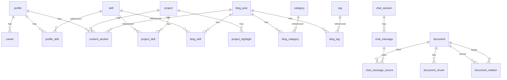

# Data Model

Status: Draft — ERD 초안

Updated: 2026-09-09

입력/표시 요구사항은 [CONTENT_SPEC](../00-project/CONTENT_SPEC.md), 답변/세션 정책은 [ADR-0004](../03-decisions/ADR-0004-rag-answer-and-session-policy.md)를 따른다.
이 초안은 `samples/`의 실제 콘텐츠(프로젝트 3건, 블로그 3편)를 표현할 수 있는지 기준으로 작성했다.
모델 차원, 저장 정책 등 ADR이 필요한 항목은 [ADR-0005](../03-decisions/ADR-0005-content-and-document-model.md)에 Proposed로 분리했다.

## 0. 작성 규칙

- PK는 `bigint generated always as identity`. 외부 노출이 필요한 식별자만 별도 컬럼으로 둔다.
- 문자열은 `text`, 시각은 `timestamptz`, 식별자는 소문자 snake_case.
- 모든 FK 컬럼에 인덱스를 만든다. 복합 PK의 선두 컬럼은 예외로 둔다.
- Enum은 `text` + `check` 제약으로 표현한다. 값 추가 시 마이그레이션 비용이 낮다.
- RLS는 사용하지 않는다. 공개 범위 판정은 애플리케이션 계층에서 하며, DB 접속 주체가 백엔드 하나이기 때문이다.

## 1. 전체 ERD



원본 Business Data(위쪽)와 RAG Document Layer(아래쪽)는 FK로 직접 연결하지 않는다.
`document`가 `(document_type, source_id)`로 원본을 가리키며, 이 쌍이 unique다. Document는 재생성 가능한 파생 데이터이기 때문이다.

## 2. Business Data

### skill — 공통 기술 카탈로그

```sql
create table skill (
  id         bigint generated always as identity primary key,
  code       text not null unique,   -- 참조 키: web-serial
  name       text not null,          -- 표시명: Web Serial API
  icon_key   text,
  created_at timestamptz not null default now()
);
```

`code`와 `name`을 분리한다. 샘플에서 표시명 문자열로 연결하니 `Web Serial API`처럼 공백·대소문자가 섞인 값이 참조 키가 되는 문제가 있었다.

### profile / career / profile_skill

```sql
create table profile (
  id         bigint generated always as identity primary key,
  headline   text not null,   -- 소개 한 줄 요약
  short_bio  text not null,   -- 상세 본문과 별개의 짧은 소개 문구
  image_url  text,
  github_url text,
  email      text,
  updated_at timestamptz not null default now()
);

create table career (
  id            bigint generated always as identity primary key,
  profile_id    bigint not null references profile(id) on delete cascade,
  company       text not null,
  role          text,
  period_start  date not null,
  period_end    date,          -- null = 재직 중
  description   text,
  display_order int not null default 0
);
create index career_profile_id_idx on career (profile_id);

create table profile_skill (
  profile_id    bigint not null references profile(id) on delete cascade,
  skill_id      bigint not null references skill(id) on delete restrict,
  skill_group   text not null check (skill_group in
                   ('PRIMARY', 'PROJECT_EXPERIENCE', 'LEARNING', 'COLLABORATION')),
  display_order int not null default 0,
  primary key (profile_id, skill_id)
);
create index profile_skill_skill_id_idx on profile_skill (skill_id);
```

MVP는 개인 1명이므로 `profile`은 단일 행이다. 별도 테넌트 컬럼을 두지 않는다.
`skill_group`은 프로필에서의 표시 분류이며 Skill 자체의 속성이 아니다(CONTENT_SPEC 4절).

### project

```sql
create table project (
  id                bigint generated always as identity primary key,
  slug              text not null unique,
  title             text not null,
  summary           text not null,      -- 한 줄 요약
  organization      text,               -- 소속: 사내 프로덕트 / 프리랜서
  position          text,               -- 담당 포지션
  contribution      int check (contribution between 0 and 100),
  contribution_note text,               -- "담당 3개 컴포넌트 100%"
  period_start      date not null,
  period_end        date,               -- null = 진행 중
  thumbnail_url     text,
  featured          boolean not null default false,
  published         boolean not null default false,
  published_at      timestamptz,
  display_order     int not null default 0,
  github_url        text,
  service_url       text,
  admin_note        text,               -- 관리자 전용. Public/RAG 모두 제외
  created_at        timestamptz not null default now(),
  updated_at        timestamptz not null default now()
);

create index project_public_list_idx
  on project (display_order, period_start desc, id desc)
  where published;
```

- 진행 중 여부는 `period_end is null`로 판정한다. 별도 boolean을 두면 두 값이 어긋날 수 있다.
- 목록 정렬은 `display_order`가 1차 기준이다. 샘플의 유진로봇과 싱크마스터는 기간이 완전히 동일해서 기간만으로는 순서가 정해지지 않는다. `id desc`를 마지막 tie-breaker로 둬 페이지네이션이 흔들리지 않게 한다.
- Public 목록은 항상 `published`로 필터하므로 부분 인덱스를 쓴다.
- `featured`와 `published`는 관리용 분류이며 방문자에게 배지로 노출하지 않는다(CONTENT_SPEC 1절).

```sql
create table project_highlight (       -- 핵심 요약 리스트
  id            bigint generated always as identity primary key,
  project_id    bigint not null references project(id) on delete cascade,
  content       text not null,
  display_order int not null default 0
);
create index project_highlight_project_id_idx on project_highlight (project_id);

create table project_skill (
  project_id    bigint not null references project(id) on delete cascade,
  skill_id      bigint not null references skill(id) on delete restrict,
  display_order int not null default 0,
  primary key (project_id, skill_id)
);
create index project_skill_skill_id_idx on project_skill (skill_id);
```

`project_highlight`는 JPA `@ElementCollection`이 생성하는 형태와 같다. `text[]` 컬럼도 순서를 보존하지만 QueryDSL·Admin 편집에서 다루기 번거로워 테이블로 둔다.

### blog_post / category / tag

```sql
create table blog_post (
  id            bigint generated always as identity primary key,
  slug          text not null unique,
  title         text not null,
  summary       text,
  thumbnail_url text,
  published     boolean not null default false,
  published_at  timestamptz,
  admin_note    text,
  created_at    timestamptz not null default now(),
  updated_at    timestamptz not null default now()
);
create index blog_post_published_idx on blog_post (published_at desc, id desc)
  where published;

create table category (
  id            bigint generated always as identity primary key,
  code          text not null unique,
  name          text not null,
  display_order int not null default 0
);

create table tag (
  id   bigint generated always as identity primary key,
  code text not null unique,
  name text not null
);

create table blog_category (
  blog_post_id bigint not null references blog_post(id) on delete cascade,
  category_id  bigint not null references category(id) on delete restrict,
  primary key (blog_post_id, category_id)
);
create index blog_category_category_id_idx on blog_category (category_id);

create table blog_tag (
  blog_post_id bigint not null references blog_post(id) on delete cascade,
  tag_id       bigint not null references tag(id) on delete cascade,
  primary key (blog_post_id, tag_id)
);
create index blog_tag_tag_id_idx on blog_tag (tag_id);

create table blog_skill (
  blog_post_id bigint not null references blog_post(id) on delete cascade,
  skill_id     bigint not null references skill(id) on delete restrict,
  primary key (blog_post_id, skill_id)
);
create index blog_skill_skill_id_idx on blog_skill (skill_id);
```

해시태그는 `tag`를 재사용한다. 기술명(`skill`)과 태그는 이름이 겹쳐도 같은 항목으로 취급하지 않는다(CONTENT_SPEC 2절).

### content_section — Project / Blog / Profile 공용 섹션

```sql
create table content_section (
  id            bigint generated always as identity primary key,
  project_id    bigint references project(id)   on delete cascade,
  blog_post_id  bigint references blog_post(id) on delete cascade,
  profile_id    bigint references profile(id)   on delete cascade,
  title         text not null,
  body_markdown text not null,
  display_order int not null default 0,
  constraint content_section_single_owner
    check (num_nonnulls(project_id, blog_post_id, profile_id) = 1)
);

create index content_section_project_idx   on content_section (project_id, display_order)
  where project_id is not null;
create index content_section_blog_idx      on content_section (blog_post_id, display_order)
  where blog_post_id is not null;
create index content_section_profile_idx   on content_section (profile_id, display_order)
  where profile_id is not null;
```

세 소유자 타입이 동일한 구조(제목 + Markdown + 순서)를 쓰므로 테이블 하나로 둔다.
`owner_type` + `owner_id` 방식 대신 nullable FK 3개와 CHECK을 쓰는 이유는 FK 참조 무결성과 CASCADE 삭제를 DB가 보장하기 때문이다.

**추천 질문 블록은 별도 테이블을 두지 않는다.** 본문 Markdown 안에 컨테이너 문법으로 그대로 저장한다.

```markdown
:::questions
- 폐쇄망에서 WebRTC를 쓰지 않은 이유가 뭔가요?
:::
```

본문 내 위치가 곧 표시 위치이므로 위치를 표현할 별도 컬럼이 필요 없다. 파서는 remark-directive를 사용한다.

## 3. RAG Document Layer

### document

```sql
create table document (
  id                bigint generated always as identity primary key,
  document_type     text not null check (document_type in
                      ('PROFILE', 'CAREER', 'PROJECT', 'BLOG')),
  source_id         bigint not null,
  title             text not null,
  content           text not null,
  metadata          jsonb not null default '{}',
  visible           boolean not null default false,
  source_updated_at timestamptz,
  index_status      text not null default 'PENDING' check (index_status in
                      ('PENDING', 'INDEXING', 'READY', 'FAILED')),
  index_error       text,
  indexed_at        timestamptz,
  created_at        timestamptz not null default now(),
  updated_at        timestamptz not null default now(),
  unique (document_type, source_id)
);
create index document_visible_idx on document (document_type) where visible;
```

- `(document_type, source_id)` unique로 원본 1건 = Document 1건을 보장한다. 재생성은 이 키 기준 upsert이므로 `document.id`가 유지되고, 여기에 걸린 Relation과 인용 이력이 끊기지 않는다.
- `visible`은 원본 공개 상태의 투영이다. 발행/발행 취소와 **같은 트랜잭션에서** 갱신해야 한다. 매 검색마다 원본 테이블로 polymorphic join을 하지 않기 위한 비정규화다.
- `index_status` / `index_error`는 재색인 실패를 상태로 남기기 위한 것이다. 실패한 문서가 조용히 옛 청크를 유지하는 상황을 구분한다.
- `TROUBLESHOOTING`은 document_type에서 제외했다. 샘플에서 트러블슈팅은 독립 원본이 아니라 프로젝트의 한 섹션이었고, 섹션 정보는 청크 메타데이터로 표현된다.

### document_chunk

```sql
create table document_chunk (
  id            bigint generated always as identity primary key,
  document_id   bigint not null references document(id) on delete cascade,
  chunk_index   int not null,
  content       text not null,
  section_titles text[] not null default '{}',  -- 유래한 섹션들. 청크 경계와 1:1이 아니다
  token_count   int,
  embedding     vector(1536),  -- text-embedding-3-small 실측 (ADR-0006)
  metadata      jsonb not null default '{}',
  created_at    timestamptz not null default now(),
  unique (document_id, chunk_index)
);
create index document_chunk_document_id_idx on document_chunk (document_id);
create index document_chunk_embedding_idx on document_chunk
  using hnsw (embedding vector_cosine_ops);
```

- `section_titles`는 출처 표시와 디버깅용 메타데이터다. **배열인 이유는 PoC 측정 결과다**(`poc/`).
  샘플 6건에서 가장 긴 섹션이 647자라 길이 때문에 섹션을 쪼갤 일은 없었다. 문제는 반대쪽이었다.
  46개 섹션 중 11개가 200자 미만("정리", "시작", "개요")이라 그대로 청크로 쓰면 검색 노이즈가 된다.
  짧은 섹션을 인접 섹션에 병합하면 35청크(최소 205 / 중앙 367 / 최대 821자)가 되는데,
  이 중 9개가 두 개 이상의 섹션에 걸친다. 단일 `section_title`로는 출처를 정확히 표시할 수 없다.
- 벡터 인덱스는 HNSW를 쓴다. 문서 수가 수십~수백 규모라 빌드 비용이 문제되지 않고 IVFFlat보다 recall이 안정적이다.
- 공개 범위는 검색 시 `document.visible` 조인으로 거른다. 청크에 `visible`을 복제하고 부분 HNSW 인덱스를 만드는 방식이 더 빠르지만, 현재 데이터 규모에서 필요 없는 비정규화다. 규모가 커져 조인 비용이 문제되면 그때 전환한다.
- `vector(1536)`은 `text-embedding-3-small`의 실측 차원이다([ADR-0006](../03-decisions/ADR-0006-embedding-model-and-retrieval.md), Proposed). 모델을 바꾸면 전체 재임베딩이 필요하다.

### document_relation

```sql
create table document_relation (
  id                 bigint generated always as identity primary key,
  source_document_id bigint not null references document(id) on delete cascade,
  target_document_id bigint not null references document(id) on delete cascade,
  relation_type      text not null default 'RELATED_TO',
  created_at         timestamptz not null default now(),
  constraint document_relation_no_self
    check (source_document_id <> target_document_id),
  unique (source_document_id, target_document_id, relation_type)
);
create index document_relation_target_idx on document_relation (target_document_id);
```

- 기준 ID는 **Document ID**다. Graph View와 RAG Relation Expansion이 같은 소스를 쓰기 위한 조건이다(ARCHITECTURE 2절).
- 저장은 방향이 있고, 탐색은 양방향이다. Admin에서 "프로젝트 → 관련 블로그"로 등록해도 블로그 상세에서 역방향으로 보인다. 반대 방향 행을 따로 만들지 않는다.
- 자기 연결은 CHECK으로, 중복은 unique로 막는다.
- 확장 시 `relation_type`에 `PART_OF` / `USED_IN` / `REFERENCES` 등을 추가한다. MVP는 `RELATED_TO` 하나로 시작한다.

## 4. Chat

```sql
create table chat_session (
  id             bigint generated always as identity primary key,
  public_id      uuid not null default gen_random_uuid() unique,
  visitor_key    text,
  created_at     timestamptz not null default now(),
  last_active_at timestamptz not null default now(),
  expires_at     timestamptz
);

create table chat_message (
  id         bigint generated always as identity primary key,
  session_id bigint not null references chat_session(id) on delete cascade,
  role       text not null check (role in ('USER', 'ASSISTANT')),
  content    text not null,
  created_at timestamptz not null default now()
);
create index chat_message_session_idx on chat_message (session_id, created_at);

create table chat_message_source (
  message_id  bigint not null references chat_message(id) on delete cascade,
  document_id bigint not null references document(id) on delete restrict,
  chunk_id    bigint references document_chunk(id) on delete set null,
  primary key (message_id, document_id)
);
create index chat_message_source_document_idx on chat_message_source (document_id);
```

- 클라이언트에는 `public_id`(uuid)만 노출한다. 순차 PK를 URL에 노출하면 값을 바꿔 남의 세션을 조회하는 시도가 가능해진다. ADR-0004의 "세션 ID만 바꾸어 타인의 이력에 접근할 수 없어야 한다"를 만족시키려면 추측 불가능한 식별자와 `visitor_key` 대조가 함께 필요하다.
- `chat_message_source`는 ADR-0004의 출처 표시 요구를 저장한다. `document_id`는 `on delete restrict`로 두어 인용된 문서가 조용히 사라지지 않게 한다. `chunk_id`는 재색인으로 바뀌므로 `set null`이다.
- 보관 기간·복원·만료 동작은 미정이다. `expires_at`은 자리만 잡아둔 컬럼이며 정책 확정 전까지 사용하지 않는다.

## 5. 두지 않은 테이블

| 후보 | 두지 않은 이유 |
|---|---|
| `admin_user` | 허용 계정이 GitHub 본인 계정 하나다(ADR-0002). 허용 로그인 ID를 설정값으로 두면 테이블·조회·동기화가 전부 사라진다. |
| `suggested_question` | 본문 Markdown 안에 위치와 함께 저장된다. 테이블로 빼면 위치 정보를 다시 만들어야 한다. |
| `project_troubleshooting` | 프로젝트의 한 섹션이다. `content_section`이 그대로 표현한다. |
| `chat_usage` | 질문 제한의 기준·기간·집계 방식이 미정이다(NEXT_ACTIONS Priority 1). 규칙이 정해진 뒤 설계한다. |
| `document_index_job` | 재색인 상태는 `document.index_status`로 충분하다. 잡 이력이 필요해지면 그때 추가한다. |

## 6. 샘플에서 식별한 공백 8건의 처리

| # | 공백 | 처리 |
|---|---|---|
| 1 | 소속 필드 없음 | `project.organization` |
| 2 | 기여도 숫자만으로 오해 | `project.contribution_note` |
| 3 | 진행 중 상태 표현 불가 | `period_start` / `period_end` 분리, `period_end is null`로 판정 |
| 4 | 기간 동일 시 정렬 미결정 | `project_public_list_idx (display_order, period_start desc, id desc)` |
| 5 | 관리자 전용 메모 | `project.admin_note` / `blog_post.admin_note`. Document 생성 대상에서 제외 |
| 6 | 공개→비공개 링크 필터 시점 | 조회 시점 필터. `document.visible` 조인으로 검색·Relation 확장·출처에서 제외 |
| 7 | 섹션 ≠ 청크 | 청크 경계는 독립, `document_chunk.section_titles`(배열)는 메타데이터. PoC에서 병합 청크 9개 확인 |
| 8 | Skill 참조 키 | `skill.code` / `skill.name` 분리 |

8번의 잔여 항목인 `STT` / `LLM` / `TTS`의 분류는 정하지 않았다. 파이프라인 단계에 가까우나 프로필 표시에는 기술로 보이는 편이 자연스러워, 실제 프로필 스킬 그룹 확정 시 함께 결정한다.

## 7. 남은 결정

- ~~임베딩 모델과 `vector(n)` 차원~~ — ADR-0006에 Proposed. 생성 모델은 여전히 미측정·미결정
- PostgreSQL / pgvector 버전과 HNSW 파라미터(`m`, `ef_construction`)
- 세션 이력 보관 기간·복원·만료 동작
- 챗봇 질문 제한의 집계 기준
- 이미 화면에 전달된 답변의 소급 처리(ADR-0004 Consequences)
