# 포트폴리오 RAG 챗봇 아키텍처

> 2026-09-28 코드 기준 스냅샷. 이 문서 하나로 전체 구조를 이해할 수 있도록 결정 이유와 측정 수치를 함께 담았다.
> 저장소 안의 기준 문서(설계·결정 기록·측정 기록)가 바뀌면 이 문서도 갱신해야 한다.

---

# 1. 개요

## 1.1 무엇을 만드는가

개발자 개인 포트폴리오 사이트다. 방문자는 프로필, 프로젝트, 블로그를 읽고, **챗봇에게 개발자의 경험을 질문**할 수 있다.

```text
"React Native를 사용한 프로젝트 경험이 있나요?"
"폐쇄망에서 실시간 영상을 어떻게 전송했나요?"
"WebRTC 대신 WebSocket을 선택한 이유가 뭔가요?"
```

챗봇은 **공개된 포트폴리오 콘텐츠만 근거로** 답하고, 어떤 문서를 참고했는지 출처를 보여준다. 근거가 없으면 지어내지 않고 모른다고 안내한다.

## 1.2 한 문장 요약

> **공개 콘텐츠를 공통 Document로 바꿔 벡터 색인하고,
> 질문마다 벡터 검색 → 참고 관계 1단계 확장 → (FAQ 판정) → LLM 답변을 수행하며,
> 근거가 없으면 거절한 뒤 그 질문을 관리자에게 넘겨 콘텐츠를 보강한다.**

일반적인 RAG 발전 단계에 대입하면 현재 위치는 다음과 같다.

```text
Vector RAG            ← 핵심 검색
+ Relation 1-hop 확장  ← GraphRAG의 아주 얕은 형태
+ LLM 판단 2곳         ← FAQ 동일 질문 판정, 근거 부족 판정
+ Human-in-the-loop    ← 미답변 질문 → 관리자 → FAQ 등록
```

## 1.3 설계 원칙

| 원칙 | 이유 |
|---|---|
| 공개 콘텐츠만 검색·확장·출처 표시 | 비공개 초안이나 관리자 메모가 답변으로 새면 안 된다 |
| 근거에 있는 내용만 답하고, 번호로 인용 | 포트폴리오에서 과장은 사실 오류만큼 위험하다 |
| 근거 부족은 유사도 임계값이 아니라 LLM이 판단 | 측정해 보니 임계값으로는 구분이 불가능했다(8장) |
| 별도 Python 서비스 없이 Spring Boot가 전체 흐름 제어 | 1인 운영, 월 10만 원 예산. 서버를 하나로 유지 |
| 자율 에이전트·추가 모델은 평가로 필요가 확인될 때만 | 콘텐츠가 적어 복잡한 구조의 이득이 검증되지 않았다 |

---

# 2. 전체 구조

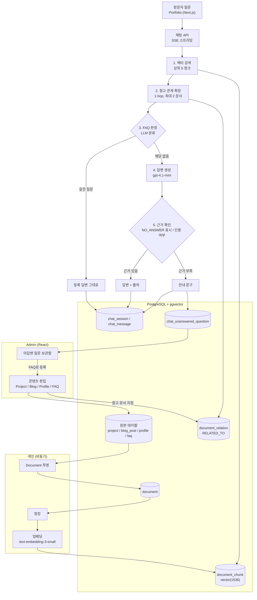

계층으로 보면 다음과 같다.

```text
┌─────────────────────────────────┐
│          Generation             │
│        gpt-4.1-mini (T=0)       │
│   근거 기반 답변 / 인용 / 안내    │
└────────────────┬────────────────┘
                 │
┌────────────────▼────────────────┐
│          Decision               │
│   같은 LLM이 수행 (별도 모델 없음) │
│ FAQ 동일 판정 │ 근거 부족 판정    │
└────────────────┬────────────────┘
                 │
┌────────────────▼────────────────┐
│          Retrieval              │
│ Vector(pgvector) │ Relation 1-hop│
└────────────────┬────────────────┘
                 │
┌────────────────▼────────────────┐
│        Knowledge Layer          │
│ document │ document_chunk │ relation │
└────────────────┬────────────────┘
                 │
┌────────────────▼────────────────┐
│           Raw Data              │
│ Project │ Blog │ Profile │ FAQ  │
└─────────────────────────────────┘
```

---

# 3. 기술 구성

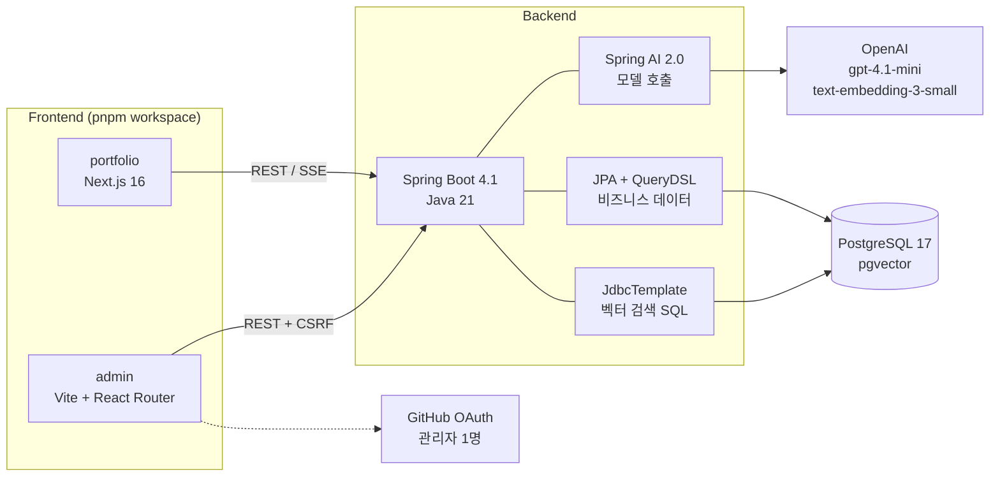

| 구성 요소 | 역할 |
|---|---|
| Spring AI | 임베딩·채팅 모델 호출만 담당 |
| JdbcTemplate SQL | pgvector 코사인 검색, 관계 확장 |
| 애플리케이션 코드 | 공개 필터, 관계 확장, 인용 추출, 세션 접근 제어, 재색인 |
| PostgreSQL | 원본 데이터, Document, 벡터, 세션을 한 DB에 |
| 관리자 인증 | GitHub OAuth, 허용 계정 1개(본인) + 서버 세션 + 쿠키 CSRF |

모델 선택:

| 용도 | 모델 | 선택 이유 |
|---|---|---|
| 임베딩 | `text-embedding-3-small` (1536차원) | 한국어 질문 7개에서 기대 출처 7/7 회수. `-large`는 약 6.5배 비용에 저장 공간 2배라 이득이 확인되지 않음 |
| 생성·판단 | `gpt-4.1-mini`, temperature 0 | 질문 7개 모두 기대대로 답변·거절. 같은 질문에 같은 답이 나오도록 온도 0 |

배포 계획은 Vercel(프론트) + 서울 Lightsail 2GB(Spring Boot) + RDS PostgreSQL micro이며, 월 운영비 상한은 10만 원이다(아직 배포 전).

---

# 4. 색인 흐름 — Raw Data → Knowledge Layer

## 4.1 투영

Project, Blog, Profile, FAQ는 형태가 서로 다르다. 관리자가 저장하면 **같은 트랜잭션 안에서** 공통 `document` 한 행으로 투영된다.

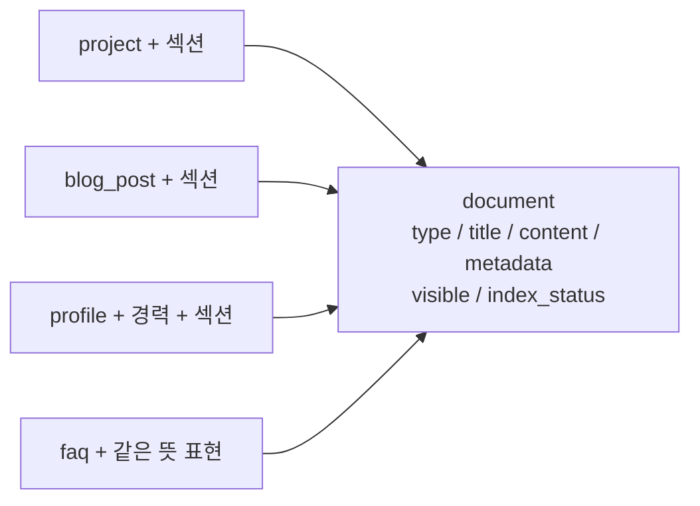

투영 규칙:

- `visible`은 원본의 공개 여부를 따른다. 비공개 문서도 행은 존재하며, **검색하는 시점에** `where visible` 조건으로 걸러진다. 공개를 해제하면 재색인을 기다리지 않고 즉시 검색에서 빠진다.
- 관리자 메모와 추천 질문 블록은 본문에서 제외한다.
- metadata에는 `slug`, `skills`, `contentHash`만 쓴다.
- Document 타입: `PROJECT`, `BLOG`, `PROFILE`, `FAQ`. 경력은 프로필 섹션에 포함된다.
- FAQ는 제목 "자주 묻는 질문: {질문}"으로 투영되어, 일반 콘텐츠와 같은 검색 경로로 찾아진다.

## 4.2 청킹 → 임베딩

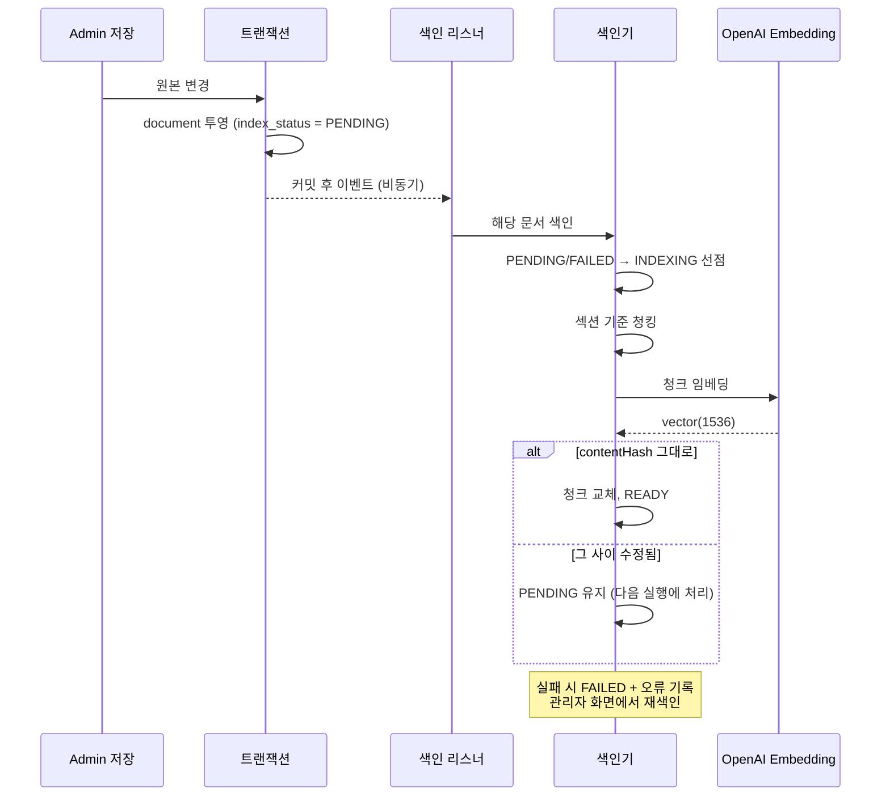

임베딩 호출은 트랜잭션 밖에서 한다. 외부 API가 느리거나 실패해도 관리자의 저장은 막히지 않는다.

## 4.3 청킹 규칙

```text
"## " 제목 기준으로 섹션 분할
↓
1200자 초과 섹션은 빈 줄 기준으로 분할
↓
200자 미만 조각은 앞 청크에 병합
↓
병합된 청크는 section_titles[]로 여러 섹션명을 보존
```

이 규칙은 실측으로 정했다. 원래는 "섹션이 길어서 쪼개야 한다"고 가정했지만, 샘플 콘텐츠를 재 보니 반대였다.

| 전략 | 청크 수 | 최소 | 중앙값 | 최대 | 200자 미만 | 여러 섹션에 걸침 |
|---|---|---|---|---|---|---|
| 섹션 = 청크 | 46 | 88자 | 268자 | 647자 | 11 | 0 |
| **짧은 섹션 병합 (채택)** | **35** | 205자 | 367자 | 821자 | 0 | 9 |

- 가장 긴 섹션이 647자라 1200자 분할은 한 번도 발동하지 않았다.
- 실제 문제는 "트러블슈팅", "배운 것" 같은 200자 미만 짧은 섹션 11개였다. 너무 짧은 청크는 검색 신호가 약하다.
- 병합 청크가 여러 섹션에 걸치므로 스키마를 `section_title` 하나에서 `section_titles text[]`로 바꿨다.

---

# 5. 질의 흐름 — 질문 → 답변

## 5.1 시퀀스

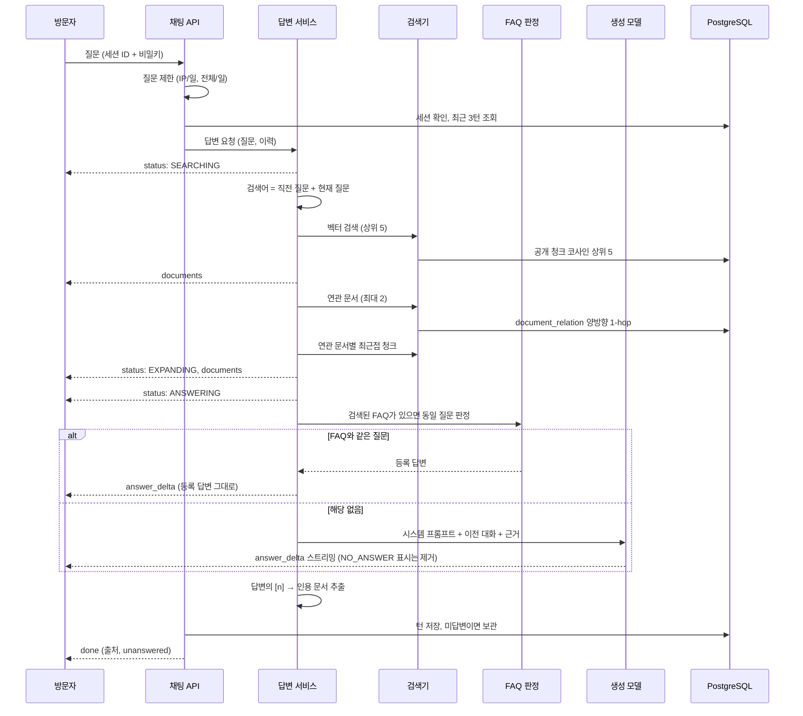

## 5.2 단계별 요약

| 단계 | 동작 | 설정값 |
|---|---|---|
| 질문 제한 | 메모리 카운터. 설정으로 끄거나 수치 변경, 제외 IP 지정 가능 | IP당 하루 20, 전체 하루 300 |
| 세션 | 서버가 발급한 ID + 비밀키(해시로 저장). 마지막 활동 기준 만료 | 24시간, 세션당 30질문 |
| 후속 질문 처리 | 직전 질문을 검색어 앞에 붙임(별도 재작성 호출 없음) | 최근 3턴을 프롬프트에 전달 |
| 벡터 검색 | pgvector 코사인 거리, 공개 필터 | 상위 5 |
| 관계 확장 | 검색된 문서와 연결된 공개 문서, 문서당 최근접 청크 1개 | 최대 2 문서 |
| FAQ 판정 | 검색 결과에 FAQ가 있을 때만 LLM에게 번호 선택 | 0이면 일반 답변 |
| 답변 생성 | 근거만 사용, 번호 인용, 스트리밍 | gpt-4.1-mini, T=0 |
| 근거 판정 | `[[NO_ANSWER]]` 표시 또는 인용 번호 없음 | 임계값 없음 |
| 출처 | 답변에 나온 `[n]`을 문서 단위로 모음 | 화면에서는 번호 숨기고 목록만 표시 |

"직전 질문을 검색어에 붙인다"는 후속 질문 때문이다. "거기서 맡은 역할은?"만으로는 무엇을 검색할지 알 수 없다. 모델을 한 번 더 불러 질문을 다시 쓰는 대신, 비용이 들지 않는 방법을 먼저 택했다.

## 5.3 스트리밍 이벤트 (SSE)

사용자가 기다리는 동안 실제 처리 단계를 보여준다.

| 이벤트 | 내용 | 비고 |
|---|---|---|
| `status` | `SEARCHING` / `EXPANDING` / `ANSWERING` | EXPANDING은 공개 연관 문서가 있을 때만 |
| `documents` | 살펴본 공개 문서 제목 목록 | 검색 직후, 확장 직후 |
| `answer_delta` | 답변 조각 | 생성 순서대로 |
| `done` | `sources[{type, slug, title, url}]`, `unanswered` | 답변에서 실제로 인용한 문서만 |
| `error` | 오류 | |

## 5.4 답변 프롬프트 규칙

시스템 프롬프트의 핵심 규칙은 다음과 같다.

```text
- <근거> 안의 내용만 사용해 답한다. 근거에 없는 사실을 만들지 않는다.
- 사용한 근거는 [1] 같은 번호로 표시한다.
- 방문자에게 보여줄 답변만 쓴다. 판단 과정은 쓰지 않는다.
- 질문의 전부 또는 일부를 근거로 답할 수 없으면 맨 앞에 [[NO_ANSWER]]를 쓴다.
- 답할 수 없는 부분은 안내 문장에 짧은 명사구 주제를 넣어 안내한다.
  (예: "어디서 일하세요?" → "현재 근무지")
- <이전 대화>는 질문의 뜻을 이해하는 데만 쓴다.
  이전 대화의 내용도 <근거>에서 확인되지 않으면 사실로 쓰지 않는다.
```

안내 문장(설정값):

```text
{주제}에 대해서는 지금 정보로는 답변드리기 어려워요.
질문주신 내용은 따로 보관하여 더 보완하도록 하겠습니다. 감사합니다.
```

`[[NO_ANSWER]]`는 방문자에게 보이지 않는다. 스트림 조각 경계에 걸쳐 나와도 지울 수 있도록, 서버가 표시 길이만큼 출력을 잠깐 늦춘다.

---

# 6. 검색 — Vector + Relation 1-hop

## 6.1 벡터 검색

```text
질문 (+ 직전 질문)
↓
text-embedding-3-small
↓
document_chunk.embedding <=> query   (코사인 거리)
↓
where document.visible
↓
상위 5 청크
```

## 6.2 관계 확장

`document_relation`에는 관계 종류가 `RELATED_TO` 하나뿐이며, "source 문서가 target 문서를 참고한다"는 뜻이다. 관리자가 프로젝트·블로그를 쓸 때 참고 문서를 고르면 생긴다. 상세 화면에서는 "참고 문서"와 "이 문서를 참고한 문서"로 방향을 나눠 보여주지만, 검색 확장에서는 **방향을 무시하고** 양쪽 모두 따라간다.

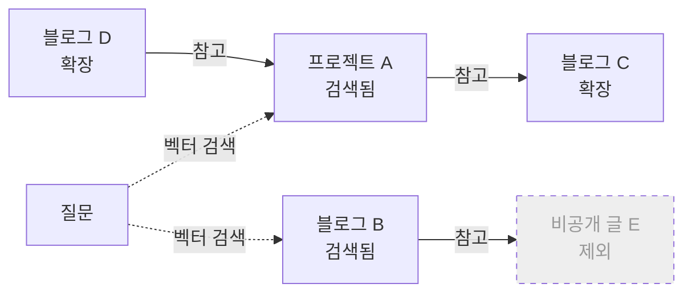

- 확장 대상은 공개 문서만이다. 위 그림의 E는 연결되어 있어도 제외된다.
- 확장된 문서는 전체가 아니라 **질문과 가장 가까운 청크 1개**만 근거에 추가한다.
- 1단계까지만 확장한다. 여러 단계 탐색이나 경로 점수 계산은 없다.

## 6.3 그래프의 단위

현재 그래프는 **문서 단위 참고 그래프**다. 개체(Entity) 단위 지식 그래프가 아니다.

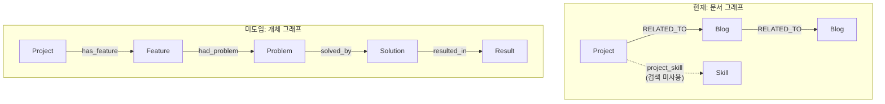

프로젝트·블로그와 기술(Skill), 블로그와 카테고리를 잇는 연결 테이블은 있지만 검색 확장에는 쓰지 않는다. 사이트의 Graph View에서 이 테이블들을 간선으로 그릴지는 아직 정하지 않았다.

---

# 7. 판단 계층 — 같은 LLM이 두 번 판단한다

별도의 작은 판단 모델은 없다. 판단이 필요한 두 곳을 생성 모델(gpt-4.1-mini)이 맡는다.

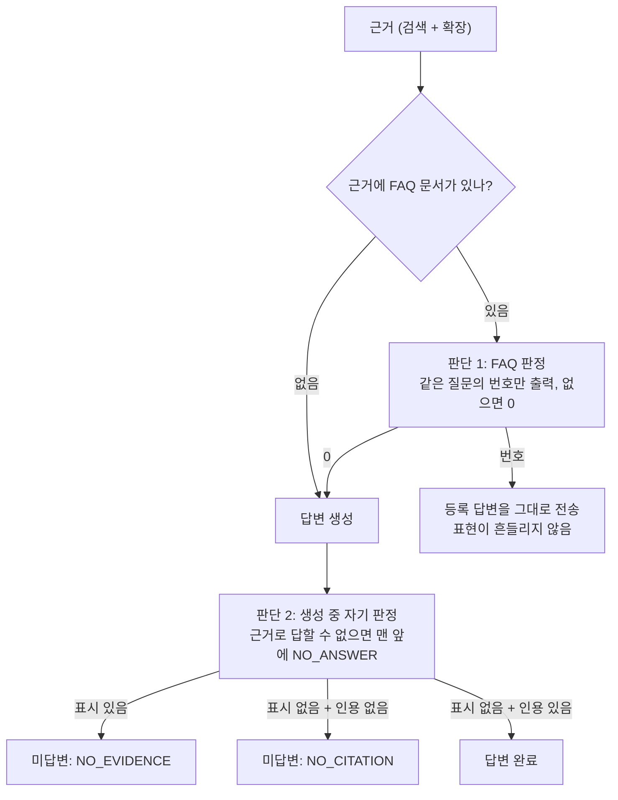

FAQ 판정 프롬프트의 핵심:

```text
너는 질문 분류기다.
방문자 질문이 아래 등록 질문 중 하나와 사실상 같은 정보를 묻는지 판단한다.
- 표현이 달라도 원하는 정보가 같으면 같은 질문이다.
  ("고향이 어디세요?" ↔ "어디서 태어나셨나요?")
- 원하는 정보가 다르면 다른 질문이다.
  ("어디 사세요?" ↔ "어디서 일하세요?")
- 등록 질문의 내용 말고 다른 내용도 함께 물으면 같은 질문이 아니다.
같은 질문인 항목의 번호 하나만 출력한다. 없으면 0만 출력한다.
```

FAQ 판정을 답변 생성과 **분리한 이유**: 처음에는 답변 프롬프트 안에 "FAQ와 같은 질문이면 그 답을 그대로 써라"라는 규칙을 넣었다. 그러자 같은 질문에서 결과가 번갈아 나왔다. 어떤 때는 판단 과정을 서술하고("…라는 질문에 대한 답변으로 대신할 수 있습니다"), 어떤 때는 안내 문구만 냈다. 번호만 고르는 단계로 떼어낸 뒤에는 질문별로 여러 번 반복해도 결과가 일정했다.

판단을 임계값이 아니라 모델에게 맡긴 근거는 8장의 측정이다.

---

# 8. 측정 근거

작은 표본(공개 문서 5건, 질문 7개)으로 측정했지만, 주요 설계 결정은 모두 이 측정에서 나왔다.

## 8.1 검색 회수

`text-embedding-3-small`, 공개 청크 30개, 상위 5, 코사인 유사도. **기대 출처 7/7 포함.**

| 질문 | 기대 출처 | 상위 1건 점수 |
|---|---|---|
| React Native를 사용한 프로젝트 경험이 있나요? | viora | 0.372 |
| AI 관련 프로젝트 경험을 정리해주세요. | viora | 0.425 |
| 폐쇄망에서 실시간 영상을 어떻게 전송했나요? | yujin-robot, websocket-binary-video | 0.518 |
| 브라우저에서 USB 기기와 직접 통신한 경험이 있나요? | syncmaster, web-serial-usb | 0.439 |
| 오프라인 우선 앱에서 동기화 충돌을 어떻게 처리했나요? | syncmaster | 0.520 |
| WebRTC 대신 WebSocket을 선택한 이유가 뭔가요? | websocket-binary-video, yujin-robot | 0.678 |
| OAuth 인증 관련 트러블슈팅 경험을 설명해주세요. | 없음 (근거 부족 기대) | 0.342 |

- "오프라인 우선 앱에서 동기화 충돌" 질문은 **비공개 글의 제목과 거의 같지만**, 그 글의 청크는 한 건도 올라오지 않았다. 검색 시점 공개 필터가 동작한다.
- 근거 없는 OAuth 질문의 상위 3건은 각 프로젝트의 "트러블슈팅" 섹션이었다. OAuth 내용이 있어서가 아니라 질문 단어가 섹션 제목과 겹쳤기 때문이다.

## 8.2 임계값으로 근거 부족을 가를 수 없다

| 구분 | 상위 점수 |
|---|---|
| 근거 있는 질문 중 가장 낮은 점수 (React Native) | **0.372** |
| 근거 없는 질문의 점수 (OAuth) | **0.342** |
| 간격 | **0.030** |

이 폭에서는 어떤 고정 컷오프를 정해도 정상 질문을 잘라내거나, 없는 근거를 통과시킨다. 그래서 **검색 결과를 모두 생성 단계에 넘기고 LLM이 근거 충분 여부를 판단**하게 했다. 근거 없는 질문에도 LLM 호출이 발생하므로 질문 제한이 비용 상한 역할을 한다.

## 8.3 답변 생성

같은 7개 질문을 `gpt-4.1-mini`(T=0)로 답하게 했다.

- 근거 있는 6개는 모두 정확했다.
- OAuth 질문은 근거 5건을 받고도 **거절**했다. 8.2 결정의 전제가 검증된 것이다.
- 비공개 글 주제와 같은 질문에서도 공개 원본 내용만 썼다.
- 원문의 기여도 구분("모델 학습은 **단독 담당**", "하드웨어 요구사항은 **논의 참여**")이 답변에서 그대로 유지됐다.
- 인용은 문서 수준으로는 정확했지만 문장 수준으로는 느슨했다(끝에 `[1][2][3][4]`를 묶어 표시). 그래서 **출처 표시 단위를 문서로 정했다.**

이후 Spring Boot + pgvector로 옮긴 제품 파이프라인에서 다시 실행해도 7/7이 같게 나왔다. 응답 시간은 첫 호출 6.8초, 이후 1.5~3.5초였다(전체 응답 기준).

## 8.4 FAQ 동일 질문도 거리로 가를 수 없다

등록 질문 3개(사는 곳·연락 방법·이직 준비)에 방문자 질문 22개(같은 뜻 10, 다른 뜻 12)의 임베딩 거리를 쟀다.

- 같은 뜻 중 가장 먼 거리 0.7338, 다른 뜻 중 가장 가까운 거리 0.6305로 **두 범위가 겹쳤다.**
- 다른 뜻인 "어디서 일하세요?"(0.6305)가 같은 뜻인 "사는 곳이 어디예요?"(0.6583)보다 "어디 사세요?"에 더 가까웠다.
- 같은 뜻 10개 중 3개는 엉뚱한 FAQ가 더 가까웠다("집이 어디세요?" → 이직 준비).

→ LLM 판정으로 바꾼 뒤의 실제 결과:

| 질문 | 기대 | 결과 |
|---|---|---|
| 어디 거주중이신가요? / 집이 어디세요? / 사는 곳이 어디예요? | FAQ 답변 | ✅ 등록 답변 그대로 |
| 어디서 일하세요? | FAQ 미사용 | ✅ 안내 문구 ("현재 근무지에 대해서는…") |
| 고향이 어디세요? (미등록 시) | 안내 | ✅ |
| OAuth 트러블슈팅 경험 | 안내 | ✅ |
| 근거 있는 기존 질문 6개 | 정상 답변 | ✅ 표시 오판정 없음 |

## 8.5 측정이 바꾼 결정

| 측정 결과 | 바뀐 것 |
|---|---|
| 최장 섹션 647자 | 섹션 분할 전제 폐기, 짧은 섹션 병합이 실제로 필요한 처리 |
| 여러 섹션에 걸친 청크 9건 | `section_titles text[]` |
| 실측 차원 1536 | `vector(1536)` 고정 |
| 임계값 간격 0.030 | 근거 부족 판정을 생성 단계로 |
| OAuth 거절 성공 | 위 결정의 전제 검증 |
| React Native 0.372가 가장 낮음 | Hybrid search를 검토 대상으로 올림 |
| 문장 단위 인용 느슨 | 출처는 문서 단위 |
| FAQ 거리 범위 겹침 | FAQ 판정을 LLM 분류로 |
| 프롬프트 규칙만으로는 FAQ 결과가 번갈아 나옴 | FAQ 판정 단계를 생성과 분리 |

## 8.6 측정의 한계

- 표본이 작다(공개 문서 5건, 질문 7개). 콘텐츠가 늘면 점수 분포가 달라진다.
- 측정은 샘플 콘텐츠 기준이다. 2026-09-28 실제 콘텐츠(프로젝트 7건, 블로그 12편)로 바꿨으므로 **재측정이 필요하다.**
- 길이는 토큰이 아니라 문자 수로 쟀다.
- 여러 프로젝트를 비교하는 질문, 근거를 유도하는 질문은 측정하지 않았다.

---

# 9. 근거 부족 처리 — 재검색 대신 사람이 채우는 순환

자동으로 재검색하지 않는다. 콘텐츠에 근거가 없으면 다시 검색해도 새 근거는 생기지 않기 때문이다. 대신 관리자가 빈틈을 채운다.

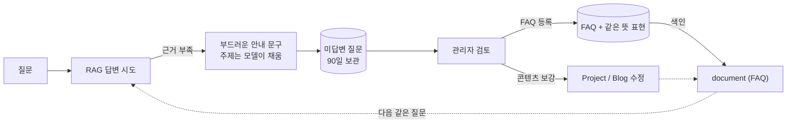

미답변 기록 항목:

| 항목 | 내용 |
|---|---|
| 질문, 답변 | 방문자 질문과 실제로 나간 안내 |
| 사유 | `NO_EVIDENCE`(모델 표시) / `NO_CITATION`(인용 없음) |
| 당시 검색 문서 | 유형·slug·제목·거리. 검색이 문제인지 콘텐츠가 없는지 구분하는 데 쓴다 |
| 상태 | `OPEN` / `RESOLVED` / `IGNORED` + 관리자 메모 |

- 방문자 식별 정보(IP 등)는 저장하지 않는다.
- 질문에 개인정보가 섞일 수 있어 90일 후 자동 삭제한다.
- 채팅 세션(24시간)이 지워져도 기록은 남고, 세션 연결만 끊긴다.

---

# 10. 세션과 대화 이력

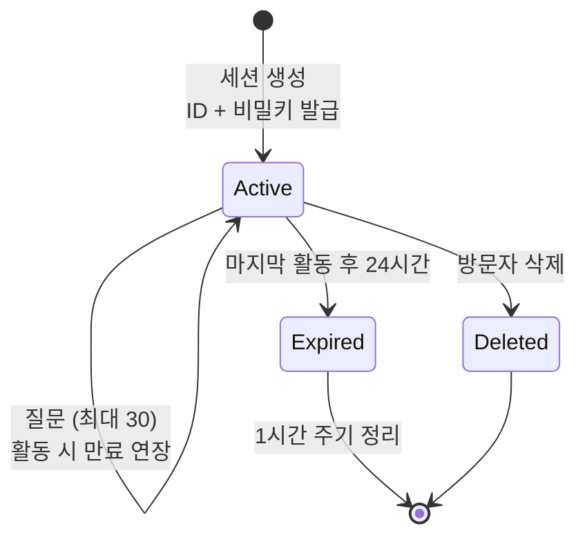

- 로그인 없는 익명 세션이다. 서버가 발급한 비밀키를 가진 브라우저만 그 세션을 읽을 수 있다. 없는 세션, 만료된 세션, 키가 틀린 세션은 모두 같은 404로 응답해 존재 여부를 드러내지 않는다.
- 이전 대화는 **질문의 뜻을 이해하는 데만** 쓴다. 이전 답변의 내용도 이번 근거에 없으면 사실로 쓰지 않는다.
- 세션을 복원할 때 출처는 그 문서가 **지금도 공개일 때만** 보여준다.

---

# 11. 데이터 모델 (RAG 관련 부분)

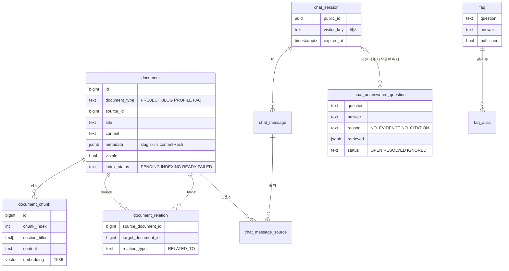

- `document`는 `(document_type, source_id)`로 원본과 1:1이다. 원본을 고치면 다시 투영되고, RAG 데이터를 직접 편집하지 않는다.
- `document_relation`은 자기 자신 연결을 금지하고, 같은 쌍의 중복을 막는다.

---

# 12. 코드 구성

| 역할 | 클래스 |
|---|---|
| 서로 다른 원본을 검색용 공통 형태로 | `rag/DocumentProjector` |
| 섹션 기준 분할·병합 | `rag/Chunker` |
| 임베딩, 상태 관리, hash 확인 | `rag/DocumentIndexer`, `rag/DocumentIndexListener` |
| 벡터 검색, 관계 확장, 공개 필터 | `chat/Retriever` |
| FAQ 동일 질문 판정 | `chat/FaqMatcher` |
| 근거·이전 대화 조립, 답변 규칙 | `chat/AnswerPrompt` |
| 스트림에서 근거 부족 표시 제거·감지 | `chat/NoAnswerMarker` |
| 전체 흐름 조율, 인용 추출 | `chat/ChatService` |
| 세션·이력·출처 저장 | `chat/ChatSessionService` |
| 질문 수 제한 | `chat/ChatRateLimiter` |
| 미답변 보관·처리 | `chat/UnansweredQuestionService` |

---

# 13. 일반적인 RAG 발전 단계와 비교

| 단계 | 일반적 형태 | 현재 프로젝트 |
|---|---|---|
| Vector RAG | 임베딩 → Top-K → LLM | ✅ 핵심 경로 |
| Hybrid RAG | BM25/FTS + Vector + Reranker | ❌ FTS·Reranker 없음. Hybrid는 검토 대상 |
| Embedding-less / Long Context | 키워드만, 또는 전체 문서를 컨텍스트에 | ❌ 미사용 |
| Agentic RAG | 결과를 보고 반복 검색 | ❌ 한 번 검색. 대신 사람이 채우는 순환(9장) |
| GraphRAG | 개체·관계 그래프, 여러 단계 탐색 | 🟡 문서 참고 관계 1-hop만 |
| Decision Layer | 작은 모델로 라우팅·경로 선택·재정렬·검증 | 🟡 같은 LLM이 FAQ·근거 부족만 판단 |
| Answer Verification | 생성 후 근거 대조, 실패 시 재검색 | 🟡 생성 중 자기 판정 + 인용 유무 확인. 사후 검증 없음 |

현재 구조를 한 줄씩 쓰면:

```text
Knowledge = 원본 콘텐츠 → document (공개 필터)
Search    = pgvector 코사인 + 참고 관계 1-hop
Decision  = gpt-4.1-mini (FAQ 판정, 근거 부족 판정)
LLM       = gpt-4.1-mini (근거 기반 설명)
Loop      = 미답변 → 관리자 → FAQ/콘텐츠 보강
```

---

# 14. 알려진 약점과 확장 후보

도입이 확정된 것은 없다. 측정과 운영 데이터로 필요가 확인되면 결정한다.

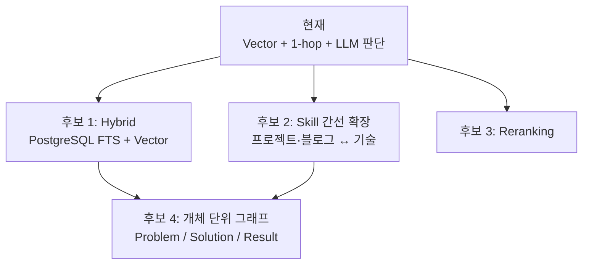

| 후보 | 해결하려는 약점 | 도입 신호 |
|---|---|---|
| Hybrid (FTS + Vector) | 기술명·고유명사 질문의 유사도가 가장 낮았다(React Native 0.372). 기술명이 긴 청크 안에 한 번 나오면 벡터 유사도가 희석된다 | 실제 콘텐츠 재측정에서 기술명 질문 회수 실패 |
| Skill 간선 확장 | "이 기술을 쓴 경험" 질문이 청크 본문에만 의존 | 기술 질문이 미답변 보관함에 쌓임 |
| Reranking | 문서가 늘면 상위 5 안에 무관한 청크가 섞임 | 콘텐츠 증가 후 근거 품질 저하 |
| 개체 단위 그래프 | 프로젝트 이름 없이 문제 유형으로 묻는 질문 ("센서 데이터로 문제를 해결한 경험?") | 해당 유형 질문이 반복적으로 미답변 |

주의:

- 개체 그래프는 사람이 사실을 구조화해야 한다. 원문에 없는 관계를 그래프에 넣으면 그 자체가 근거 없는 답변의 원천이 된다. 원문에서 확인한 관계만 넣는다.
- 콘텐츠가 작을 때는 전체 문서를 컨텍스트에 넣는 방식(Long Context)도 대안이다. 다만 콘텐츠가 늘면 비용과 품질이 함께 무너지므로 현재 구조를 유지한다.
